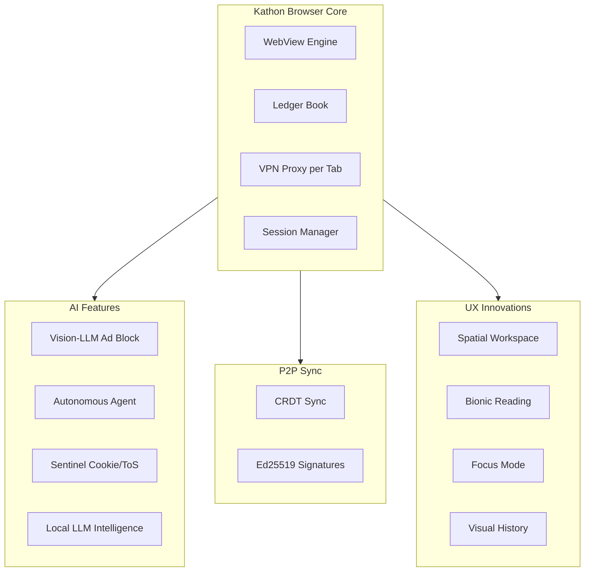

# 01 — Kathon Cryptographic Browser

[](https://doi.org/10.7910/DVN/3VDF75) [](https://doi.org/10.7910/DVN/GDLO0L)

A privacy-first, AI-augmented web browser built on Tauri/Rust. Features vision-LLM ad blocking, CRDT-based P2P synchronization, spatial workspace browsing, autonomous agent execution, per-tab VPN, and a cryptographic audit ledger for all browsing actions.



## Research Papers

| # | Paper |
|---|-------|
| 01 | [Vision-LLM Ad Blocking](./research/01-vision-llm-ad-blocking.md) |
| 02 | [Ledger Browser Agent Audit](./research/02-ledger-browser-agent-audit.md) |
| 03 | [Spatial Workspace Browsing](./research/03-spatial-workspace-browsing.md) |
| 04 | [Anti-Enshittification Engine](./research/04-anti-enshittification-engine.md) |
| 05 | [Ephemeral Browsing & Shredding](./research/05-ephemeral-browsing-shredding.md) |
| 06 | [P2P Browser Sync with CRDT](./research/06-p2p-browser-sync-crdt.md) |
| 07 | [BIP39 Self-Sovereign Identity](./research/07-bip39-self-sovereign-identity.md) |
| 08 | [TOTP Vault Authenticator](./research/08-totp-vault-authenticator.md) |
| 09 | [Local LLM Browser Intelligence](./research/09-local-llm-browser-intelligence.md) |
| 10 | [Sentinel Cookie & ToS Automation](./research/10-sentinel-cookie-tos.md) |
| 11 | [Floating Omnibox Search](./research/11-floating-omnibox-search.md) |
| 12 | [Visual History Scrubbing](./research/12-visual-history-scrubbing.md) |
| 13 | [Bionic Reading Typography](./research/13-bionic-reading-typography.md) |
| 14 | [Universal Live Dubbing](./research/14-universal-live-dubbing.md) |
| 15 | [Split Cognition Windowing](./research/15-split-cognition-windowing.md) |
| 16 | [WebExtensions Bridge](./research/16-webextensions-bridge.md) |
| 17 | [Distributed GPU Compute](./research/17-distributed-gpu-compute.md) |
| 18 | [Focus Mode Guardrails](./research/18-focus-mode-guardrails.md) |
| 19 | [Proxy VPN per Tab](./research/19-proxy-vpn-per-tab.md) |
| 20 | [Autonomous Agent Execution](./research/20-autonomous-agent-execution.md) |

```
.====================================================================.
!  Made in the UAE, Dubai #DubaiIt #Dubai #Dxb #SovereignAI          !
!  Made in The Emirates #Dubai_it                                    !
!                                                                    !
!  Lois-Kleinner Alpasan - The Anticloud 2026-                       !
!                                                                    !
!  As seen on:                                                       !
!  Harvard Dataverse ! Zenodo/CERN ! Academia.edu ! HuggingFace      !
!  anticloud.telepedia.net ! anticloud.fandom.com                    !
!                                                                    !
!  0-1.gg ! GitHub ! LinkedIn ! DEV ! GH Pages                       !
!  HuggingFace ! Blog ! Bluesky ! Mastodon                           !
!  Internet Archive ! ORCID ! Figshare                               !
!                                                                    !
!  Sovereign AI ! Local-First ! Privacy ! Zero Trust ! No Datacenter !
!  Air-Gapped ! Open Source ! Rust ! Hash Chain ! Single Binary      !
!  Offline LLM ! Crypto Ledger ! P2P ! Federated                     !
'===================================================================='
```

Lois-Kleinner Alpasan, 22, has served executive roles spanning technology, operations, finance, and product across 20+ organizations. His cross-functional work combines architecture, business, and AI strategy.

References:
1. Lois-Kleinner Zenodo: https://doi.org/10.5281/zenodo.20781790
2. Lois-Kleinner GitHub: https://github.com/kleinnner/Anticloud/tree/main/04-aioss-format
3. Lois-Kleinner Harvard DV: https://doi.org/10.7910/DVN/KFK12Y
4. Lois-Kleinner Internet Arc: https://archive.org/details/aioss-format
5. Lois-Kleinner ORCID: https://orcid.org/0009-0009-2233-6107
6. Lois-Kleinner DEV.to: https://dev.to/kleinner
7. Lois-Kleinner LinkedIn: https://linkedin.com/in/kleinner
8. Lois-Kleinner HuggingFace: https://huggingface.co/Anticloud
9. Lois-Kleinner Tumblr: https://anticloud.tumblr.com
10. Lois-Kleinner Mastodon: https://mastodon.social/@kleinner
11. Lois-Kleinner Bluesky: https://bsky.app/profile/kleinner.bsky.social
12. 0-1.gg: https://0-1.gg
13. Lois-Kleinner Figshare: https://figshare.com/authors/Lois-Kleinner_Alpasan/20849885
14. Lois-Kleinner Academia: https://independent.academia.edu/kleinner
15. Lois-Kleinner Telepedia: https://anticloud.telepedia.net/wiki/Anticloud_by_Lois-Kleinner_Wiki
16. Lois-Kleinner Fandom: https://anticloud.fandom.com
17. AIOSS Offline Verification Kit: https://dataverse.harvard.edu/dataset.xhtml?persistentId=doi:10.7910/DVN/OORKNJ