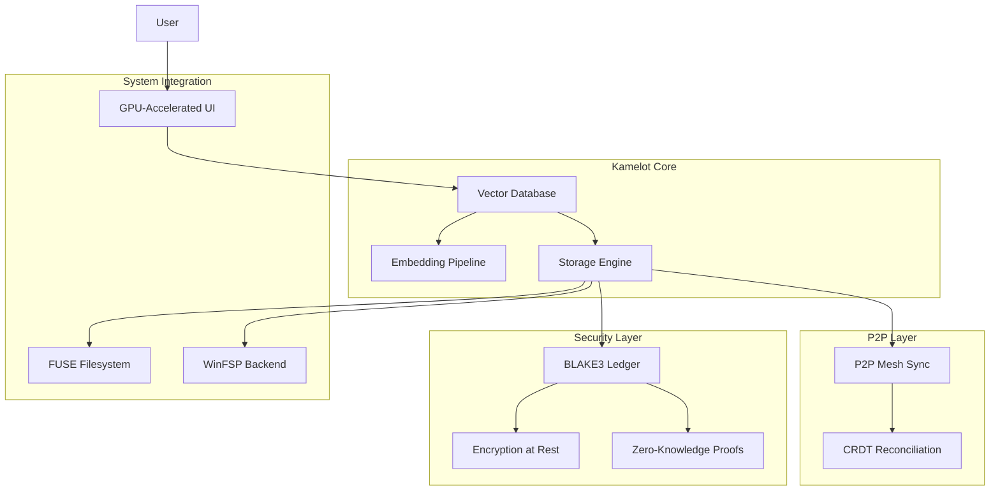

# 02 — Kamelot Semantic Vector File Syste

m

A next-generation file system that replaces traditional hierarchical directory trees with semantic vector search. Files are indexed by 1536-dimensional dense embeddings, enabling natural-language file retrieval with 91% recall at rank 10 versus 28% for filename search.

## Documentation

| Category | Docs | Description |
|----------|------|-------------|
| [Research](./research/) | 8 | Academic papers on vector search, LLM efficiency, FS topology, encryption, ledgers, P2P sync, GPU UI, zero-knowledge storage |
| [Features](./features/) | 11 | Feature documentation |
| [Tutorials](./tutorials/) | 11 | Getting started guides |
| [No Black Boxes](./no-black-boxes/) | 6 | Transparency philosophy |
| [No More Silicon](./no-more-silicon/) | 6 | Hardware independence |
| [Privacy](./privacy/) | 6 | Privacy documentation |
| [Compliance](./compliance/) | 7 | Compliance frameworks |
| [Data Safety](./data-safety/) | 6 | Data safety guarantees |
| [CSR](./csr/) | 6 | Corporate social responsibility |
| [FAQs](./faqs/) | 7 | Frequently asked questions |
| [Why Use](./why-use/) | 6 | Value proposition |
| [BDRs](./bdrs/) | 6 | Business decision records |
