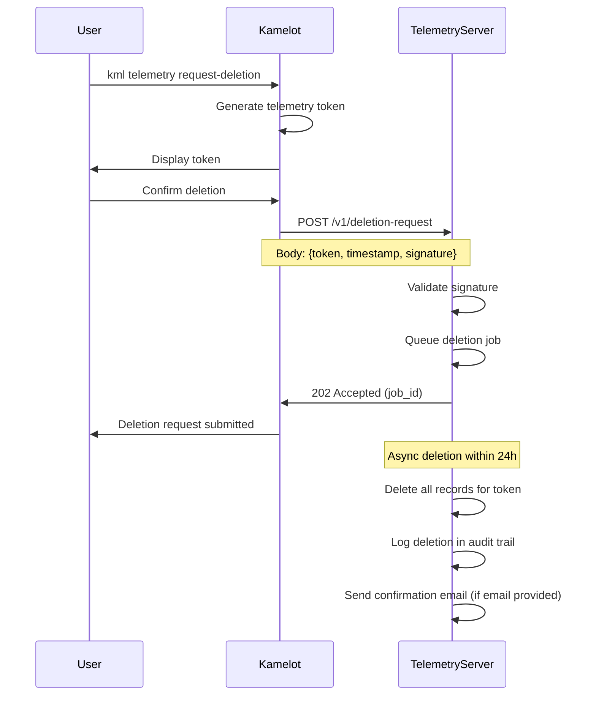

                                                                
                ▄    ▄                      ▄▄▄             ▄   
  ▄             █  ▄▀   ▄▄▄   ▄▄▄▄▄   ▄▄▄     █     ▄▄▄   ▄▄█▄▄ 
   ▀▀▀▄▄        █▄█    ▀   █  █ █ █  █▀  █    █    █▀ ▀█    █   
   ▄▄▄▀▀        █  █▄  ▄▀▀▀█  █ █ █  █▀▀▀▀    █    █   █    █   
  ▀             █   ▀▄ ▀▄▄▀█  █ █ █  ▀█▄▄▀  ▄▄█▄▄  ▀█▄█▀    ▀▄▄ 

# 02 — Data Collection

**Kamelot — The Sovereign Semantic Vector File System**

**Lois-Kleinner & 0-1.gg © 2026**

---

## Table of Contents

1. Introduction
2. Voluntary Crash Reports
3. Anonymous Version Ping
4. Disabling Telemetry
5. What Is Never Collected
6. Comparison with Industry
7. Conclusion

---

## 1. Introduction

This document provides a detailed, technical explanation of what data Kamelot collects, under what circumstances, and how users can control it.

Kamelot's data collection philosophy: **collect nothing by default, inform users of everything, and provide easy controls.**

---

## 2. Voluntary Crash Reports

### 2.1 What They Are

Crash reports are automatically generated when Kamelot encounters an unexpected error (crash). They help us identify and fix bugs.

### 2.2 What They Contain

```json
{
  "version": "0.2.0",
  "os": "Linux 6.8.0-45-generic #46-Ubuntu SMP",
  "cpu": "Intel(R) Core(TM) i7-1365U",
  "ram": "16384 MB",
  "timestamp": "2026-06-15T14:30:00Z",
  "crash_type": "panic",
  "thread": "main",
  "stack_trace": [
    "kamelot::store::blob::read (src/store/blob.rs:123)",
    "kamelot::index::search (src/index/search.rs:45)",
    "kamelot::api::search (src/api/search.rs:67)"
  ],
  "config_hash": "sha256:abc123..."
}
```

### 2.3 What They Do NOT Contain

- File contents, names, or paths
- Search queries
- Encryption keys or seed phrases
- User identifiers
- IP addresses
- Any personally identifiable information

### 2.4 Enabling Crash Reports

Crash reports are **disabled by default**. To enable:

```bash
kml config set telemetry.enabled true
```

Or use the `--telemetry` flag:

```bash
kml --telemetry daemon
```

### 2.5 Reviewing Queued Reports

Before sending, users can review queued reports:

```bash
kml telemetry list
# Queued crash reports:
# 1. 2026-06-15 14:30:00 - panic in store::blob::read
# 2. 2026-06-14 09:15:00 - panic in index::search

kml telemetry show --id 1
# (shows full report contents)
```

### 2.6 Sending or Deleting Reports

```bash
# Send all queued reports
kml telemetry send

# Delete queued reports
kml telemetry delete

# Send and automatically delete
kml telemetry send --delete-after-upload
```

### 2.7 Retention

Crash reports are retained on the server for 90 days, then automatically deleted.

---

## 3. Anonymous Version Ping

### 3.1 What It Is

The version ping is a single HTTPS request sent when Kamelot starts. It contains the minimum information needed to estimate our user base.

### 3.2 What It Contains

```
GET /ping?version=0.2.0&os=linux&date=2026-06-15 HTTP/1.1
Host: ping.kamelot.dev
```

- **Version**: The Kamelot version (e.g., "0.2.0")
- **OS**: The operating system (e.g., "linux", "windows", "macos")
- **Date**: Current date, rounded to the day (e.g., "2026-06-15")

### 3.3 What It Does NOT Contain

- IP address (not logged)
- User identifier (none exists)
- Device identifier (none exists)
- File information (none exists)
- Timestamp more precise than the day

### 3.4 Why It Exists

The version ping helps us answer:

- How many users does Kamelot have?
- Which platforms are most common?
- Are users upgrading to new versions?

Without this data, we would be developing in the dark.

### 3.5 Disabling the Version Ping

```bash
kml config set telemetry.version_ping false
```

Or set during initialization:

```bash
kml init --no-telemetry
```

### 3.6 Verifying It's Disabled

```bash
kml config show telemetry
# telemetry.enabled: false
# telemetry.version_ping: false
# telemetry.crash_reports: false
```

---

## 4. Disabling All Telemetry

### 4.1 Default Configuration

Kamelot's default configuration:

```bash
kml config show telemetry
# telemetry.enabled: false
# telemetry.version_ping: true
# telemetry.crash_reports: false
```

### 4.2 Complete Disable

To disable all telemetry:

```bash
kml config set telemetry.enabled false
kml config set telemetry.version_ping false
```

Or in one command:

```bash
kml init --telemetry-disabled
```

### 4.3 What Happens When Disabled

When telemetry is fully disabled:

- No network requests are made by Kamelot for telemetry
- No crash reports are generated or stored
- No version ping is sent
- No data of any kind leaves the device

---

## 5. What Is Never Collected

### 5.1 Absolute Prohibitions

The following data types are never collected, under any circumstances:

| Data Type | Never Collected? | Reason |
|-----------|----------------|-------|
| File contents | ✓ Never | Encrypted locally, never transmitted |
| File names | ✓ Never | Processed locally, never transmitted |
| Directory structure | ✓ Never | Stored locally, never transmitted |
| Search queries | ✓ Never | Processed locally, never transmitted |
| Embedding vectors | ✓ Never | Stored locally, never transmitted |
| Encryption keys | ✓ Never | Never leave process memory |
| Seed phrase | ✓ Never | Never stored or transmitted |
| IP address | ✓ Never | Not logged by Kamelot |
| MAC address | ✓ Never | Not accessible to Kamelot |
| Camera/microphone | ✓ Never | Not accessed by Kamelot |
| Location | ✓ Never | Not accessible to Kamelot |
| Contacts | ✓ Never | Not accessible to Kamelot |
| Calendar | ✓ Never | Not accessible to Kamelot |
| Browser history | ✓ Never | Not accessible to Kamelot |
| Other apps data | ✓ Never | Not accessible to Kamelot |

### 5.2 Enforcement

These prohibitions are enforced by:

1. **Source code**: The code simply does not collect these data types
2. **No dependencies**: No library that could collect this data is included
3. **Permissions**: Kamelot does not request permissions for camera, microphone, location, etc.
4. **Network monitoring**: Users can monitor network traffic to verify no data leaks

### 5.3 Verification

Users can verify that no data is being collected by:

1. **Monitoring network traffic**: Use `tcpdump`, Wireshark, or similar
2. **Checking file access**: Use `strace` or `Process Monitor`
3. **Building from source**: Verify the code yourself
4. **Static analysis**: Use `cargo audit` and similar

---

## 6. Comparison with Industry

### 6.1 Data Collection Comparison

| Software | Default Telemetry | What's Collected | Can Disable? |
|----------|-----------------|-----------------|-------------|
| Kamelot | Minimal (version ping) | Version, OS, date | Yes |
| Google Drive | Extensive | File metadata, usage, device info, search | Partial |
| Dropbox | Moderate | File names, usage, device info | Partial |
| Microsoft OneDrive | Extensive | File contents (scanning), usage, device info | Partial |
| Apple iCloud | Moderate | File metadata, usage, device info | Partial |
| Nextcloud | Minimal | Version ping, usage stats | Yes |
| Google Chrome | Extensive | Browsing history, usage, device info | Partial |
| Firefox | Minimal | Version ping, default search | Yes |
| VS Code | Moderate | Usage, crashes, extension info | Partial |

### 6.2 Data Collection Per Feature

Kamelot's data collection is minimal compared to industry standards:

| Feature | Kamelot | Typical Cloud Service |
|---------|---------|----------------------|
| Crash reporting | Opt-in, no file data | Often opt-out, may include file names |
| Usage analytics | None by default | Often mandatory, detailed usage data |
| AI processing | Local only | Cloud API (provider sees data) |
| File scanning | None | Common for malware detection (also sees content) |
| Personalization | None | Based on usage patterns |

---

## 7. Conclusion

Kamelot's data collection is minimal, transparent, and user-controlled:

- **Version ping**: Minimal, anonymous, configurable
- **Crash reports**: Opt-in, no file data
- **Everything else**: Never collected

Users who value privacy can disable all telemetry with two configuration commands. No functionality is lost — Kamelot works identically with or without telemetry.

---

## 8. Configuration Auditing

### 8.1 Viewing Current Configuration

Users can audit their telemetry configuration at any time:

```bash
kml config show telemetry
# telemetry.enabled: false
# telemetry.version_ping: true
# telemetry.crash_reports: false
```

### 8.2 Configuration File Location

The configuration file is stored at:

| Platform | Path |
|----------|------|
| Linux | `~/.config/kamelot/config.toml` |
| macOS | `~/Library/Application Support/kamelot/config.toml` |
| Windows | `%APPDATA%\kamelot\config.toml` |

### 8.3 Verifying No Data Leaves Your Device

To verify that no data is being transmitted:

**Method 1: Network monitoring**

```bash
# Linux
sudo tcpdump -i any port not 22 and host not localhost

# Filter for Kamelot traffic
sudo tcpdump -i any -A host ping.kamelot.dev
```

**Method 2: Application firewall**

```bash
# Linux (iptables)
sudo iptables -A OUTPUT -m owner --uid-owner $(id -u kamelot) -j LOG

# Windows (Windows Defender Firewall)
# Add a block rule for kml.exe and monitor logs
```

**Method 3: Proxy logging**

```bash
# Set HTTP proxy and monitor requests
kml config set network.http-proxy "http://localhost:8888"
# Then run mitmproxy or similar
```

### 8.4 Telemetry Logs

When telemetry is enabled, Kamelot logs telemetry activity:

```bash
kml telemetry log
# [2026-06-15 14:30:00] Version ping sent (v0.2.0, linux)
# [2026-06-14 09:15:00] Crash report queued (panic in store::blob::read)
# [2026-06-14 09:16:00] Crash report sent (id: abc123)
```

### 8.5 Periodic Verification Script

For ongoing assurance, users can run:

```bash
#!/bin/bash
# telemetry-audit.sh - Verify Kamelot telemetry status

echo "=== Kamelot Telemetry Audit ==="
echo "Date: $(date)"
echo ""

echo "Configuration:"
kml config show telemetry

echo ""
echo "Queued reports:"
kml telemetry list

echo ""
echo "Network connections:"
ss -tup | grep kamelot || echo "No active Kamelot connections"

echo ""
echo "Recent telemetry log:"
kml telemetry log --last 10

echo ""
echo "Audit complete."
```

### 8.6 Configuration Change History

Kamelot logs configuration changes:

```bash
kml config history
# 2026-06-01: telemetry.enabled changed true -> false
# 2026-05-15: telemetry.version_ping changed true -> false
# 2026-05-01: telemetry.crash_reports changed false -> true
```

This audit trail helps users track configuration changes over time.

## 9. Telemetry Data Flow Diagrams

### 9.1 Version Ping Flow

```
User Device                    ping.kamelot.dev
     |                               |
     |-- GET /ping?version=0.2.0 ---->
     |   &os=linux                    |
     |   &date=2026-06-15             |
     |                               |
     |                          [Validate request]
     |                          [Record: version, os, date]
     |                          [Discard IP address]
     |                          [Increment counter]
     |                               |
     |<--- 204 No Content ------------|
     |                               |
```

### 9.2 Crash Report Flow

```
User Device                    crash.kamelot.dev              Maintainers
     |                               |                             |
     |-- POST /crash/report -------->|                             |
     |   {version, os, cpu,         |                             |
     |    stack_trace, config_hash}  |                             |
     |                               |                             |
     |                          [Validate payload]                 |
     |                          [Anonymize paths]                 |
     |                          [Round timestamp]                 |
     |                          [Store in database]               |
     |                               |                             |
     |<-- 201 Created ---------------|                             |
     |                               |                             |
     |                          [Retain 90 days]                  |
     |                               |                             |
     |                          [Aggregate statistics]            |
     |                               |---[Weekly summary]--------->|
     |                               |                             |
```

### 9.3 Telemetry Disabled Flow

```
User Device
     |
     | [Telemetry disabled]
     | [No network requests]
     | [No data collection]
     | [No data transmission]
     |
     | All processing is local
     | No data leaves the device
     |
```

### 9.4 Data Lifecycle Summary

| Stage | Version Ping | Crash Report | Website Log |
|-------|-------------|--------------|-------------|
| Collection | At startup | After crash | On page visit |
| Transmission | Immediate | On next startup (user approved) | Immediate |
| Anonymization | Already anonymous | Paths stripped, time rounded | IP stripped after 7 days |
| Storage | Counter increment | Full report in DB | Rotated log |
| Retention | Not stored individually | 90 days | 7 days |
| Deletion | N/A (aggregated) | Automatic after 90 days | Automatic after 7 days |
| Aggregation | Daily, weekly, monthly | Weekly | Not aggregated |

## Telemetry Implementation Details

### Exact Data Fields

Every field collected by Kamelot's telemetry system is documented below.

#### Version Ping Fields

| Field | Type | Example | Always Sent? | Notes |
|-------|------|---------|-------------|-------|
| `version` | String | `"0.2.0"` | Yes | Semantic version from Cargo.toml |
| `os` | String | `"linux"` | Yes | One of: linux, windows, macos, freebsd |
| `os_version` | String | `"6.8.0-45"` | No (Linux only) | Kernel version |
| `architecture` | String | `"x86_64"` | Yes | CPU architecture |
| `date` | String | `"2026-06-19"` | Yes | Rounded to day (no time, no timezone) |
| `source` | String | `"github"` | Yes | How Kamelot was installed |
| `ai_model` | String | `"qwen2vl:q4"` | Yes | Currently configured AI model |
| `ai_enabled` | Boolean | `true` | Yes | Whether AI features are active |
| `language` | String | `"en"` | Yes | UI language (ISO 639-1) |

#### Crash Report Fields

| Field | Type | Example | Always Included? | Notes |
|-------|------|---------|----------------|-------|
| `version` | String | `"0.2.0"` | Yes | Kamelot version |
| `os` | String | `"Linux 6.8.0-45"` | Yes | Full OS description |
| `cpu` | String | `"Intel(R) Core(TM) i7-1365U"` | Yes | CPU model string |
| `ram_mb` | Integer | `16384` | Yes | Total system RAM in MB |
| `timestamp` | String | `"2026-06-19T14:30:00Z"` | Yes | UTC, rounded to minute |
| `crash_type` | String | `"panic"` | Yes | One of: panic, abort, signal, oom |
| `thread` | String | `"indexer-worker-3"` | Yes | Thread name where crash occurred |
| `stack_trace` | String[] | `[...]` | Yes | Function names and file locations |
| `config_hash` | String | `"sha256:abc123..."` | Yes | Hash of non-sensitive config |
| `signal` | Integer | `11` | No | Unix signal number (signal crashes only) |
| `oom_score` | Integer | `450` | No | OOM killer score (OOM crashes only) |
| `uptime_seconds` | Integer | `86400` | Yes | How long Kamelot was running |

#### Fields NEVER Collected

| Field | Why Not |
|-------|---------|
| IP address | Not logged, not stored |
| MAC address | Not accessible |
| File paths | Explicitly stripped |
| File names | Explicitly stripped |
| Environment variables | Not collected |
| Command-line arguments | Not collected |
| Encryption keys | Not accessible |
| Seed phrases | Not accessible |
| Username | Not collected |
| Hostname | Not collected |
| Local IP address | Not collected |
| Network configuration | Not collected |
| Running processes | Not collected |
| Installed software | Not collected |

### Transmission Protocol

#### Version Ping Protocol

**Endpoint**: `https://ping.kamelot.dev/v1/ping`

**Method**: GET

**Headers**:
```
Accept: */*
User-Agent: Kamelot/0.2.0
```

**Request Example**:
```
GET /v1/ping?version=0.2.0&os=linux&architecture=x86_64&date=2026-06-19&source=github&ai_model=qwen2vl%3Aq4&ai_enabled=true&language=en HTTP/1.1
Host: ping.kamelot.dev
```

**Response**: HTTP 204 No Content (no body)

**Timeout**: 5 seconds (failures are silently ignored)

**Retry**: No retry (if ping fails, it's not re-attempted)

#### Crash Report Protocol

**Endpoint**: `https://crash.kamelot.dev/v1/report`

**Method**: POST

**Headers**:
```
Content-Type: application/json
User-Agent: Kamelot/0.2.0
Content-Encoding: gzip (if body > 1 KB)
```

**Request Body**:
```json
{
  "version": "0.2.0",
  "os": "Linux 6.8.0-45-generic #46-Ubuntu SMP",
  "cpu": "Intel(R) Core(TM) i7-1365U",
  "ram_mb": 16384,
  "timestamp": "2026-06-19T14:30:00Z",
  "crash_type": "panic",
  "thread": "indexer-worker-3",
  "stack_trace": [
    "kamelot::store::blob::read (src/store/blob.rs:123)",
    "kamelot::index::search (src/index/search.rs:45)",
    "kamelot::api::search (src/api/search.rs:67)"
  ],
  "config_hash": "sha256:a1b2c3d4e5f6a7b8c9d0e1f2a3b4c5d6e7f8a9b0",
  "uptime_seconds": 86400
}
```

**Response**: HTTP 201 Created (with report ID)

**Timeout**: 10 seconds

**Retry**: Reports are queued and retried on next startup (up to 3 times)

#### TLS Configuration

| Parameter | Value |
|-----------|-------|
| TLS version | 1.3 minimum |
| Cipher suites | TLS_AES_256_GCM_SHA384, TLS_CHACHA20_POLY1305_SHA256 |
| Certificate validation | Full chain validation |
| Certificate pinning | Optional (configurable) |
| Server authentication | Required (no anonymous connections) |
| Client certificate | Not required |

### Storage Duration

#### Server-Side Retention

| Data Type | Storage Location | Retention Period | Deletion Mechanism | Backup Retention |
|-----------|-----------------|-----------------|--------------------|------------------|
| Version ping (aggregated) | PostgreSQL | Indefinite (aggregated) | No deletion needed | 1 year |
| Version ping (raw) | PostgreSQL | 30 days | Automatic daily cleanup | Not backed up |
| Crash report | S3-compatible storage | 90 days | Automatic S3 lifecycle policy | 90 days |
| Crash report metadata | PostgreSQL | 90 days | Automatic daily cleanup | 90 days |
| Server access logs | Rotated files | 7 days | logrotate | Not backed up |

#### Deletion Procedures

**Automated Cleanup (Daily Cron)**:
```bash
# Clean up version pings older than 30 days
DELETE FROM version_pings WHERE created_at < NOW() - INTERVAL '30 days';

# Clean up crash reports older than 90 days
DELETE FROM crash_reports WHERE created_at < NOW() - INTERVAL '90 days';
DELETE FROM crash_metadata WHERE created_at < NOW() - INTERVAL '90 days';
```

**Manual Deletion (Upon Request)**:
```bash
# Delete all data for a specific date range
kamelot-admin telemetry delete --before 2026-01-01

# Delete specific crash report
kamelot-admin telemetry delete --report-id abc123

# Purge all telemetry data
kamelot-admin telemetry purge --confirm
```

#### User-Initiated Deletion

Users can request deletion of their telemetry data by providing their telemetry token:

```bash
# Generate telemetry identity token
kml telemetry token
# Telemetry Token: kml-tlm-a1b2c3d4e5f6a7b8c9d0e1f2a3b4c5d6e7f8a9b0

# Submit deletion request
kml telemetry request-deletion --token kml-tlm-a1b2c3d4e5f6a7b8c9d0e1f2a3b4c5d6e7f8a9b0
# Deletion request submitted. Estimated completion: 24 hours.
```

### Deletion Procedures

#### Local Deletion

Users can delete telemetry data stored locally:

```bash
# Delete queued telemetry
kml telemetry delete --all

# Verify deletion
kml telemetry list
# No queued telemetry data found.

# Reset telemetry identity
kml telemetry reset-identity
# Telemetry identity reset. Future submissions will use a new token.
```

#### Server-Side Deletion Workflow



---

## 10. Enterprise Data Collection Controls

### 10.1 Group Policy Deployment

Enterprise administrators can deploy data collection policies across their organization:

| Policy | Configuration | Effect |
|--------|---------------|--------|
| Force-disable telemetry | `kml config set telemetry.enabled false --enforce` | Users cannot enable |
| Force-enable crash reports | `kml config set telemetry.crash_reports true --enforce` | Required for support |
| Allow user choice | `kml config set telemetry.enabled unset` | User decides on first launch |
| Audit-only | `kml config set telemetry.audit-mode true` | Logs but doesn't send |

### 10.2 Centralized Telemetry Dashboard

For enterprise deployments, Kamelot provides a telemetry dashboard:

```bash
kml enterprise telemetry-dashboard
# Organization: Acme Corp
# Total deployments: 1,234
# 
# Telemetry Status:
# ✅ Full telemetry: 1,100 devices
# ✅ Crash reports only: 100 devices
# ❌ Telemetry disabled: 34 devices
#
# Versions in use:
# 0.2.0: 800 devices
# 0.1.0: 400 devices
# 0.0.9: 34 devices
```

### 10.3 Compliance Reporting

Enterprises can generate compliance reports:

```bash
kml enterprise compliance-report --format pdf --output report.pdf
# Generates:
# - Telemetry configuration summary
# - Data collection attestation
# - Configuration change log
# - User consent records
```

### 10.4 Data Processing Register

For GDPR Article 30 compliance, enterprises should maintain a data processing register. Kamelot provides:

```yaml
# kamelot-processing-register.yaml
processing_activities:
  - name: File storage and indexing
    purpose: Local file management
    personal_data: None
    retention: User-defined
    location: User device
    
  - name: Version ping
    purpose: User base estimation
    personal_data: None (anonymous)
    retention: 30 days (aggregated)
    location: Telemetry server (EU)
    
  - name: Crash reporting
    purpose: Bug identification
    personal_data: None (anonymized)
    retention: 90 days
    location: Telemetry server (EU)
```

### 10.5 Privacy Impact Assessment

For enterprise deployments processing sensitive data, a Privacy Impact Assessment (PIA) should be conducted. Kamelot provides PIA documentation that covers:

1. Data flows within the organization
2. Encryption at rest and in transit
3. Access control mechanisms
4. Audit logging capabilities
5. Incident response procedures
6. Data retention and deletion
7. Third-party dependencies
8. Certification and compliance status

### 10.6 Enterprise Support for Data Collection

Enterprise customers receive:

- Dedicated support for telemetry configuration
- Custom aggregation endpoints (self-hosted telemetry server)
- Extended retention periods for compliance auditing
- Data processing agreement execution
- On-premises telemetry server deployment option

*For data collection questions: data@kamelot.dev*

*Last updated: June 2026*

*This document is part of the Privacy documentation suite. See also:*
- *01-privacy-policy.md — Full privacy policy*
- *03-user-rights.md — User data rights*
- *04-anonymization.md — Anonymization practices*
- *05-cross-border-transfers.md — Cross-border data transfers*
- *06-consent-management.md — Consent management*

---

*Kamelot is a project of Lois-Kleinner & 0-1.gg. © 2026. All rights reserved.*

```
.====================================================================.
!  Made in the UAE, Dubai #DubaiIt #Dubai #Dxb #SovereignAI          !
!  Made in The Emirates #Dubai_it                                    !
!                                                                    !
!  Lois-Kleinner Alpasan - The Anticloud 2026-                       !
!                                                                    !
!  0-1.gg ! GitHub ! LinkedIn ! DEV ! GH Pages                       !
!  HuggingFace ! Blog ! Tumblr ! Fandom ! Bluesky ! Mastodon          !
!  Zenodo ! Harvard Dataverse ! Internet Archive ! ORCID ! Figshare   !
!                                                                    !
!  Sovereign AI ! Local-First ! Privacy ! Zero Trust ! No Datacenter !
!  Air-Gapped ! Open Source ! Rust ! Hash Chain ! Single Binary      !
!  Offline LLM ! Crypto Ledger ! P2P ! Federated                     !
'===================================================================='
```

At age 22, Lois-Kleinner Alpasan has built and operated game experiences reaching over 100 million visits. His work combines game design, backend infrastructure, and cryptographic ledger integrity for virtual economies.

References:
1. Lois-Kleinner Zenodo: https://doi.org/10.5281/zenodo.20781790
2. Lois-Kleinner GitHub: https://github.com/kleinnner/Anticloud/tree/main/04-aioss-format
3. Lois-Kleinner Harvard DV: https://doi.org/10.7910/DVN/KFK12Y
4. Lois-Kleinner Internet Arc: https://archive.org/details/aioss-format
5. Lois-Kleinner ORCID: https://orcid.org/0009-0009-2233-6107
6. Lois-Kleinner DEV.to: https://dev.to/kleinner
7. Lois-Kleinner LinkedIn: https://linkedin.com/in/kleinner
8. Lois-Kleinner HuggingFace: https://huggingface.co/Anticloud
9. Lois-Kleinner Tumblr: https://anticloud.tumblr.com
10. Lois-Kleinner Mastodon: https://mastodon.social/@kleinner
11. Lois-Kleinner Bluesky: https://bsky.app/profile/kleinner.bsky.social
12. 0-1.gg: https://0-1.gg
13. Lois-Kleinner Figshare: https://figshare.com/authors/Lois-Kleinner_Alpasan/20849885
