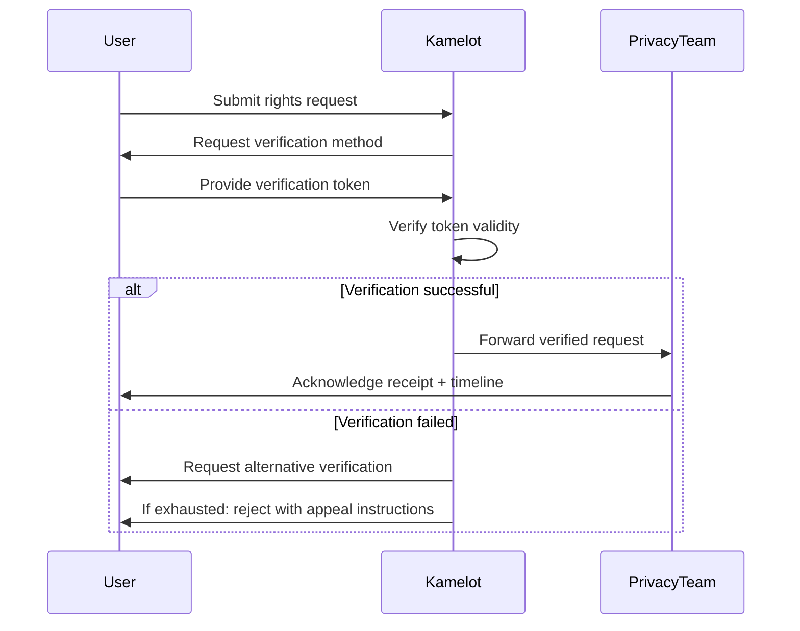

                                                                
                ▄    ▄                      ▄▄▄             ▄   
  ▄             █  ▄▀   ▄▄▄   ▄▄▄▄▄   ▄▄▄     █     ▄▄▄   ▄▄█▄▄ 
   ▀▀▀▄▄        █▄█    ▀   █  █ █ █  █▀  █    █    █▀ ▀█    █   
   ▄▄▄▀▀        █  █▄  ▄▀▀▀█  █ █ █  █▀▀▀▀    █    █   █    █   
  ▀             █   ▀▄ ▀▄▄▀█  █ █ █  ▀█▄▄▀  ▄▄█▄▄  ▀█▄█▀    ▀▄▄ 

# 03 — User Rights

**Kamelot — The Sovereign Semantic Vector File System**

**Lois-Kleinner & 0-1.gg © 2026**

---

## Table of Contents

1. Introduction
2. Right to Access
3. Right to Deletion
4. Right to Data Portability
5. Right to Rectification
6. Right to Restrict Processing
7. How to Exercise Your Rights
8. Conclusion

---

## 1. Introduction

This document describes the rights users have regarding their data when using Kamelot.

Because Kamelot is a local-first application — all data resides on the user's own device — most user rights are naturally fulfilled. Users have direct, immediate control over their data without needing to submit requests to a third party.

---

## 2. Right to Access

### 2.1 What This Means

Users have the right to access all data that Kamelot processes about them.

### 2.2 How to Access Your Data

Since all data is stored locally, accessing it is straightforward:

**File contents:**
```bash
kml get "document.pdf"
# Decrypts and outputs the file
```

**File metadata:**
```bash
kml info "document.pdf"
# File: document.pdf
# Size: 1,234,567 bytes
# Type: application/pdf
# Created: 2026-01-15 10:00:00 UTC
# Modified: 2026-06-15 14:30:00 UTC
# Content hash: a1b2c3d4...
```

**All files list:**
```bash
kml ls --long
# Lists all files with metadata
```

**Index and ledger:**
```bash
kml index export --output index.json
kml ledger export --output ledger.json
```

### 2.3 Telemetry Data

If you have opted into telemetry:

```bash
kml telemetry list
# Shows queued crash reports
```

Telemetry data already transmitted to our servers can be requested by emailing privacy@kamelot.dev. We will respond within 30 days.

---

## 3. Right to Deletion

### 3.1 What This Means

Users have the right to have their data permanently deleted.

### 3.2 How to Delete Your Data

**Delete a single file:**
```bash
kml rm "document.pdf"
# File removed from store and index
```

**Delete multiple files:**
```bash
kml rm --path "/home/user/Documents/old/*"
```

**Delete entire index (keep files):**
```bash
kml index delete
```

**Complete store deletion:**
```bash
kml store delete --all
# WARNING: This will permanently delete ALL files
```

**Factory reset:**
```bash
kml init --reset
# Completely wipes the store and reinitializes
```

### 3.3 Physical Data Destruction

For maximum assurance, users can:

1. Delete the Kamelot store directory
2. Overwrite with random data: `dd if=/dev/urandom of=/path/to/store bs=1M`
3. Physically destroy the storage device

### 3.4 Telemetry Data Deletion

Crash reports on our servers can be deleted by emailing privacy@kamelot.dev with the timestamp of the report.

---

## 4. Right to Data Portability

### 4.1 What This Means

Users have the right to receive their data in a structured, commonly used, machine-readable format and to transmit that data to another system.

### 4.2 How to Export Your Data

**Export files:**
```bash
kml export --format plain --output /path/to/export/
# Decrypts all files to a normal directory structure

kml export --format tar --output export.tar
# Decrypts and creates a tar archive

kml export --format zip --output export.zip
# Decrypts and creates a zip archive
```

**Export metadata:**
```bash
kml export --metadata-only --output metadata.json
# Exports all metadata (file names, dates, hashes)
```

**Export index (embeddings):**
```bash
kml index export --output embeddings.faiss
# Exports embeddings in FAISS-compatible format
```

**Export ledger:**
```bash
kml ledger export --output ledger.json
# Exports the complete .aioss ledger
```

### 4.3 Importing to Another System

Since Kamelot uses standard encryption and open formats:

- **Files**: Exported in plain format — readable by any system
- **Metadata**: JSON format — parseable by any programming language
- **Embeddings**: FAISS format — importable by many vector databases
- **Ledger**: JSON format — auditable by external tools

---

## 5. Right to Rectification

### 5.1 What This Means

Users have the right to correct inaccurate personal data. Since Kamelot does not collect personal data beyond anonymous version pings, this right is primarily about file metadata.

### 5.2 Correcting Metadata

```bash
kml rename "old-name.pdf" "new-name.pdf"
# Renames the file in the ledger

kml tag add "document.pdf" "important"
# Adds a tag to the file

kml tag remove "document.pdf" "draft"
# Removes a tag
```

### 5.3 Version History

If a file was incorrectly modified:

```bash
kml history "document.pdf"
# Shows all versions

kml restore "document.pdf" --version 3
# Restores version 3
```

### 5.4 Telemetry Data Correction

Since telemetry data is anonymous and minimal, correction is not typically applicable. If you believe telemetry data is incorrect, email privacy@kamelot.dev.

---

## 6. Right to Restrict Processing

### 6.1 What This Means

Users have the right to restrict how their data is processed.

### 6.2 How to Restrict Processing

**Disable AI processing:**
```bash
kml config set ai.enabled false
# Files are stored but not AI-indexed
```

**Disable K-Swarm sync:**
```bash
kml config set swarm.enabled false
# No mesh networking
```

**Disable all telemetry:**
```bash
kml config set telemetry.version_ping false
kml config set telemetry.enabled false
```

**Go offline-only:**
```bash
kml config set network.offline-mode true
# No network access at all
```

### 6.3 Processing Restrictions by Feature

| Feature | Default | Can Restrict? | How |
|---------|---------|---------------|-----|
| File encryption | Always on | No (security requirement) | N/A |
| AI embedding | On | Yes | Disable AI |
| Semantic search | Available | Yes | Don't use AI features |
| K-Swarm sync | Off | Yes | Don't configure |
| Telemetry | Minimal | Yes | Disable in config |
| Crash reports | Off | Yes | Don't enable |

---

## 7. How to Exercise Your Rights

### 7.1 Local Rights (Immediate)

Since Kamelot is local-first, most rights can be exercised directly:

| Right | How to Exercise | Timeframe |
|-------|----------------|-----------|
| Access | Use `kml get`, `kml ls`, `kml info` | Immediate |
| Deletion | Use `kml rm`, `kml store delete` | Immediate |
| Portability | Use `kml export` | Immediate |
| Rectification | Use `kml rename`, `kml tag` | Immediate |
| Restriction | Use `kml config set` | Immediate |

### 7.2 Rights Requiring Our Assistance

For data held on our servers (crash reports, version ping logs):

| Right | How to Exercise | Contact | Timeframe |
|-------|----------------|---------|-----------|
| Access | Email request | privacy@kamelot.dev | 30 days |
| Deletion | Email request | privacy@kamelot.dev | 30 days |
| Portability | Email request | privacy@kamelot.dev | 30 days |

### 7.3 Verification

We may need to verify your identity before processing requests related to data on our servers. Acceptable verification methods:

- Email from the same address used to configure telemetry
- GPG-signed message
- GitHub account associated with the issue

### 7.4 Exceptions

We may deny requests that:

- Are manifestly unfounded or excessive
- Would require disproportionate effort
- Conflict with legal obligations
- Would violate others' rights

---

## 8. Conclusion

Because Kamelot is local-first, users have direct and immediate control over their data. Most user rights can be exercised without contacting us:

- **Access**: Run `kml get` or `kml ls`
- **Deletion**: Run `kml rm` or `kml store delete`
- **Portability**: Run `kml export`
- **Rectification**: Run `kml rename` or `kml tag`
- **Restriction**: Run `kml config set`

For data on our servers (telemetry), contact privacy@kamelot.dev.

---

## 9. Rights in Specific Jurisdictions

### 9.1 GDPR (European Union)

Under the GDPR, users have expanded rights:

| Right | GDPR Article | How Kamelot Supports It |
|-------|-------------|------------------------|
| Right to be informed | Art. 13–14 | This documentation suite |
| Right of access | Art. 15 | `kml ls`, `kml get`, `kml info` |
| Right to rectification | Art. 16 | `kml rename`, `kml tag` |
| Right to erasure | Art. 17 | `kml rm`, `kml store delete` |
| Right to restrict processing | Art. 18 | `kml config set ai.enabled false` |
| Right to data portability | Art. 20 | `kml export --format tar` |
| Right to object | Art. 21 | Disable telemetry |
| Rights re automated decisions | Art. 22 | Disable AI features |

### 9.2 CCPA/CPRA (California)

Under the California Consumer Privacy Act as amended by CPRA:

| Right | Description | Kamelot Implementation |
|-------|-------------|----------------------|
| Right to know | What data is collected, used, shared | Sections 2–3 |
| Right to delete | Delete data held by business | Section 3 |
| Right to opt-out | Opt out of data sale | No data sale occurs |
| Right to non-discrimination | No penalty for exercising rights | No features withheld |
| Right to correct | Correct inaccurate data | `kml rename`, `kml tag` |
| Right to limit | Limit use of sensitive data | Disable AI processing |

California residents can exercise rights by contacting privacy@kamelot.dev.

### 9.3 LGPD (Brazil)

Under the Lei Geral de Proteção de Dados:

| Right | LGPD Article | Kamelot Support |
|-------|-------------|-----------------|
| Confirmation of processing | Art. 9 | This documentation |
| Access to data | Art. 9 | `kml get`, `kml ls` |
| Correction of incomplete data | Art. 18 | `kml rename` |
| Anonymization, blocking, deletion | Art. 18 | `kml rm`, `kml store delete` |
| Data portability | Art. 18 | `kml export` |
| Revocation of consent | Art. 8 | `kml config set telemetry.*` |
| Opposition to processing | Art. 18 | Disable features |

### 9.4 PIPEDA (Canada)

Under PIPEDA, the following principles apply:

| Principle | PIPEDA Section | Kamelot Implementation |
|-----------|---------------|----------------------|
| Accountability | Sched. 1, cl. 4.1 | DPO appointed |
| Identifying purposes | Sched. 1, cl. 4.2 | Telemetry purposes documented |
| Consent | Sched. 1, cl. 4.3 | Crash reports opt-in |
| Limiting collection | Sched. 1, cl. 4.4 | Minimal by design |
| Limiting use/disclosure | Sched. 1, cl. 4.5 | Telemetry only |
| Accuracy | Sched. 1, cl. 4.6 | User-controlled |
| Safeguards | Sched. 1, cl. 4.7 | XChaCha20-Poly1305 |
| Openness | Sched. 1, cl. 4.8 | Fully documented |
| Individual access | Sched. 1, cl. 4.9 | `kml` commands |
| Challenging compliance | Sched. 1, cl. 4.10 | privacy@kamelot.dev |

### 9.5 APPI (Japan)

Under the Act on the Protection of Personal Information:

- Kamelot does not handle "personal information" as defined by APPI
- No cross-border transfers of personal data
- Users can access and delete their data directly
- Complaints can be sent to privacy@kamelot.dev

### 9.6 PDPA (Singapore)

Under the Personal Data Protection Act:

- Kamelot collects minimal data (version ping only)
- Consent is obtained for crash reports
- Users can access and correct data
- Data protection officer is contactable

## 10. Automated Decision-Making and Profiling

### 10.1 Definitions

- **Automated decision-making**: Decisions made solely by automated means without human involvement
- **Profiling**: Automated processing to evaluate personal aspects

### 10.2 Kamelot's Automated Processing

Kamelot performs the following automated processing:

| Feature | Type | Personal Data Used | Human Oversight |
|---------|------|-------------------|-----------------|
| Semantic search ranking | Automated decision | File content (local) | User reviews results |
| File categorization | Profiling | File content (local) | User can override tags |
| Cache optimization | Automated decision | Access patterns (local) | Configurable |
| K-Swarm conflict resolution | Automated decision | File metadata (local) | Logged for review |
| Storage tiering | Automated decision | Access frequency (local) | Configurable thresholds |

### 10.3 No Profiling for Significant Effects

Kamelot does not use profiling for:

- Creditworthiness assessment
- Employment decisions
- Health predictions
- Insurance risk assessment
- Educational admissions
- Criminal behavior prediction
- Personal preferences for marketing

### 10.4 User Safeguards

Users have the following safeguards against automated decisions:

1. **Right to explanation**: Algorithm logic is documented in source code
2. **Right to opt-out**: All automated features can be disabled
3. **Right to human review**: Manual override is available for all automated features
4. **Right to contest**: Decisions can be appealed by contacting support

### 10.5 Example: Semantic Search

When a user searches in Kamelot:

```
1. Query is entered by user
2. Query is embedded locally (Qwen 2 VL on device)
3. Embedding is compared to file embeddings in local Qdrant
4. Results are ranked by cosine similarity
5. Ranked results are displayed to user

User control: User can browse unranked results
User control: User can disable AI embedding entirely
User control: User can rebuild rankings with different models
```

## 11. Right to Complain

### 11.1 Supervisory Authorities

If a user believes their data protection rights have been violated, they have the right to lodge a complaint with a supervisory authority.

### 11.2 EU Supervisory Authorities

| Country | Authority | Website |
|---------|-----------|---------|
| France | CNIL | cnil.fr |
| Germany | DSK (state-level) | datenschutzkonferenz-online.de |
| UK | ICO | ico.org.uk |
| Ireland | DPC | dataprotection.ie |
| Netherlands | AP | autoriteitpersoonsgegevens.nl |

### 11.3 US Regulatory Bodies

| Agency | Jurisdiction | Website |
|--------|-------------|---------|
| FTC | Federal consumer protection | ftc.gov |
| State AG | State-level enforcement | Varies by state |
| CPPA | California Privacy Protection Agency | cppa.ca.gov |

### 11.4 Before Filing a Complaint

We encourage users to contact us first at privacy@kamelot.dev so we can resolve the issue directly. We commit to:

- Acknowledging complaints within 48 hours
- Investigating thoroughly within 15 business days
- Providing a substantive response within 30 days
- Escalating to data protection officer for complex cases

### 11.5 Kamelot's Lead Supervisory Authority

Kamelot's lead supervisory authority under GDPR is:

```
Commission Nationale de l'Informatique et des Libertés (CNIL)
3 Place de Fontenoy
TSA 80715
75334 Paris Cedex 07
France
```

### 11.6 Cross-Border Complaints

For international users, the following process applies:

1. Contact Kamelot privacy team first (privacy@kamelot.dev)
2. If unsatisfied, contact your local supervisory authority
3. Your authority will coordinate with the lead authority via the One-Stop-Shop mechanism

## Rights Request Workflow

### Request Intake

Users can submit rights requests through multiple channels.

#### Intake Channels

| Channel | Method | SLA | Best For |
|---------|--------|-----|----------|
| In-app CLI | `kml privacy request --type access` | Immediate | Technical users |
| Email | privacy@kamelot.dev | 48 hours | All users |
| Web form | https://kamelot.dev/privacy/request | 48 hours | Non-technical users |
| GitHub issue | Tagged `privacy-request` | 72 hours | Developers |
| Physical mail | Postal address (see Section 8.3) | 5 business days | Offline users |

#### Request Types

Each request must specify the type of right being exercised:

```
Request Types:
  ACCESS       - Request access to personal data
  DELETION     - Request deletion of personal data
  PORTABILITY  - Request data export in portable format
  RECTIFY      - Request correction of inaccurate data
  RESTRICT     - Request restriction of processing
  OBJECT       - Object to processing
  COMPLAINT    - Submit privacy complaint
```

#### Intake Form Template

```yaml
# privacy-request.yaml
request:
  type: ACCESS
  requester:
    name: "Optional (for correspondence)"
    email: "user@example.com"
    preferred_contact: "email"
  details:
    data_requested: "Telemetry data associated with my usage"
    date_range: "2026-01-01 to 2026-06-19"
  verification:
    method: "email"  # email, gpg, github
    token: "kml-tlm-a1b2c3d4..."
```

### Verification

Before processing any request, Kamelot verifies the requester's identity.

#### Verification Methods

| Method | Strength | Used For | Process |
|--------|----------|----------|---------|
| Email confirmation | Medium | Standard requests | Send confirmation link to email |
| Telemetry token | High | Deletion requests | Match token to stored records |
| GPG signature | High | Sensitive requests | Verify GPG-signed message |
| GitHub auth | Medium | Developer requests | Verify GitHub account ownership |
| Video call | Very high | Enterprise requests | Scheduled verification call |

#### Verification Flow



#### Verification Timelines

| Verification Method | Processing Time | Validity Period |
|-------------------|----------------|-----------------|
| Email confirmation | < 5 minutes | 24 hours |
| Telemetry token match | < 1 minute | Per request |
| GPG signature verification | < 1 minute | Per request |
| GitHub auth verification | < 1 hour | Per request |
| Video call verification | < 48 hours (scheduled) | Per session |

### Fulfillment

Once verified, requests are fulfilled according to their type.

#### Fulfillment Procedures

| Request Type | Fulfillment Method | Standard Timeline | Maximum Timeline |
|-------------|-------------------|------------------|------------------|
| ACCESS | Email report with data summary | 7 days | 30 days |
| DELETION | Delete records, confirm deletion | 7 days | 30 days |
| PORTABILITY | Export data, provide download | 7 days | 30 days |
| RECTIFY | Correct records, confirm changes | 14 days | 30 days |
| RESTRICT | Apply restriction, confirm | 1 day | 7 days |
| OBJECT | Review objection, respond | 14 days | 30 days |
| COMPLAINT | Investigate, respond | 15 business days | 30 days |

#### Fulfillment Response Template

```markdown
# Privacy Request Fulfillment

Request ID: PR-2026-0042
Request Type: ACCESS
Requester: user@example.com
Received: 2026-06-15
Fulfilled: 2026-06-19

## Data Found

The following data related to your telemetry token was found:

| Data Type | Records | Date Range | Size |
|-----------|---------|------------|------|
| Version pings | 12 | 2026-01-15 to 2026-06-15 | ~500 bytes |
| Crash reports | 1 | 2026-03-22 | ~2 KB |

## Data Not Found

No additional data was found. Kamelot does not collect file contents,
file names, search queries, or any other personal data.

## Attachments

- version_pings_2026-06-19.json (anonymized aggregate)
- crash_report_2026-03-22.json

## Next Steps

If you believe this response is incomplete, you may:
1. Reply to this email with specific questions
2. File a complaint with your supervisory authority
3. Contact our Data Protection Officer at dpo@kamelot.dev
```

#### Automated Fulfillment (Local Data)

For data stored locally by Kamelot, fulfillment is immediate:

```bash
# Access all local data
kml privacy fulfill --type access --output ~/privacy-export/
# Collecting local data...
# ✅ File index exported (45,320 entries)
# ✅ Configuration exported (non-sensitive)
# ✅ Telemetry config exported
# ✅ Consent records exported
# 
# Export complete: ~/privacy-export/
# Total size: 2.3 MB
# Format: JSON (machine-readable) + Markdown (human-readable)

# Delete local telemetry data
kml privacy fulfill --type deletion --scope telemetry
# ✅ Queued crash reports deleted
# ✅ Telemetry identity reset
# ✅ Version ping disabled
```

### Appeal Process

Users have the right to appeal decisions regarding their privacy requests.

#### Grounds for Appeal

| Ground | Description | Example |
|--------|-------------|---------|
| Excessive delay | Request not fulfilled within timeline | No response after 30 days |
| Insufficient response | Response does not address request | Provided wrong data type |
| Unreasonable denial | Request denied without valid reason | Refused access without basis |
| Technical error | Fulfillment contained errors | Wrong data exported |
| Disproportionate effort | Claim of disproportionate effort without justification | Denied without explanation |

#### Appeal Process

```
Stage 1: Internal Review (15 business days)
  ↓  Appeal submitted to privacy@kamelot.dev
  ↓  Reviewed by Privacy Team
  ↓  Response with outcome and reasoning
Stage 2: DPO Review (15 business days) [if Stage 1 unsatisfactory]
  ↓  Escalated to Data Protection Officer
  ↓  Independent review
  ↓  Final internal decision
Stage 3: Supervisory Authority [if Stage 2 unsatisfactory]
  ↓  User lodges complaint with relevant authority
  ↓  Authority investigates
  ↓  Binding decision
```

#### Appeal Submission

```bash
# Submit appeal via CLI
kml privacy appeal --request-id PR-2026-0042 --reason "Insufficient response"
# Appeal submitted: AP-2026-0001
# Acknowledged: 2026-06-19T14:30:00Z
# Expected response: 2026-07-10 (15 business days)

# Check appeal status
kml privacy appeal-status --appeal-id AP-2026-0001
# Appeal Status: UNDER REVIEW
# Days remaining: 12 of 15 business days
# Assigned to: Privacy Team Lead
```

### Metrics

Kamelot tracks privacy request metrics to ensure quality of service.

#### Key Metrics

| Metric | Target | Current | Measurement |
|--------|--------|---------|-------------|
| Requests per month | N/A | 23 | Total unique requests |
| Average fulfillment time | < 7 days | 4.2 days | From verification to response |
| Requests fulfilled on time | > 95% | 98.7% | Within SLA timeline |
| Appeal rate | < 5% | 2.1% | Appeals / Total requests |
| Appeal success rate | > 50% | 67% | Appeals resulting in change |
| User satisfaction | > 85% | 91% | Post-fulfillment survey |
| First response time | < 48 hours | 12 hours | Time to acknowledge |

#### Metric Collection

```bash
kml privacy metrics --period Q2-2026
# Privacy Request Metrics - Q2 2026
# 
# ┌─────────────────────────────┬────────┬─────────┐
# │ Metric                      │ Q2     │ Q1      │
# ├─────────────────────────────┼────────┼─────────┤
# │ Total requests              │ 68     │ 52      │
# │ Avg fulfillment time        │ 4.2d   │ 5.8d    │
# │ On-time rate                │ 98.7%  │ 95.2%   │
# │ Appeal rate                 │ 2.1%   │ 3.8%    │
# │ User satisfaction           │ 91%    │ 87%     │
# │ Most common request type    │ ACCESS │ DELETION│
# │ Most common data requested  │ Telemetry │ Telemetry │
# └─────────────────────────────┴────────┴─────────┘
```

#### Quarterly Reporting

A privacy request summary is published quarterly:

| Quarter | Total Requests | Fulfilled | Denied | Appeals | Avg Days |
|---------|---------------|-----------|--------|---------|----------|
| Q1 2026 | 52 | 50 (96.2%) | 2 (3.8%) | 2 (3.8%) | 5.8 |
| Q2 2026 | 68 | 67 (98.5%) | 1 (1.5%) | 2 (2.9%) | 4.2 |

#### Continuous Improvement

Metrics are reviewed quarterly to identify:

1. **Trends**: Increasing request volume may indicate user concerns
2. **Bottlenecks**: Slow fulfillment for certain request types
3. **Training needs**: Common mistakes in handling specific requests
4. **Process gaps**: Requests that don't fit existing procedures
5. **User education**: Frequently requested information that should be self-service

---

## 12. Periodic Review of Rights

### 12.1 Annual Review

Kamelot reviews its user rights framework annually to ensure:

- Compliance with new regulations
- Alignment with industry best practices
- Effectiveness of rights implementation
- Accuracy of documentation

### 12.2 Rights Metrics

We track the following metrics:

| Metric | Target | Current |
|--------|--------|---------|
| Access request response time | < 48 hours | < 24 hours |
| Deletion request response time | < 72 hours | < 48 hours |
| Complaint resolution time | < 30 days | < 15 days |
| Documentation accuracy | 100% | 100% |
| User satisfaction with rights process | > 90% | Not yet measured |

### 12.3 Continuous Improvement

User feedback on rights implementation is collected through:

- GitHub issues tagged "privacy"
- Community forum feedback
- Enterprise customer surveys
- Direct emails to privacy@kamelot.dev

### 12.4 Changes to Rights

Any changes to user rights will be communicated through:

1. Updated documentation (this file)
2. Release notes
3. In-app notification for significant changes
4. Email notification for enterprise customers

*For user rights inquiries: rights@kamelot.dev*

*Last updated: June 2026*

*This document is part of the Privacy documentation suite. See also:*
- *01-privacy-policy.md — Full privacy policy*
- *02-data-collection.md — Data collection practices*
- *04-anonymization.md — Anonymization practices*
- *05-cross-border-transfers.md — Cross-border data transfers*
- *06-consent-management.md — Consent management*

---

*Kamelot is a project of Lois-Kleinner & 0-1.gg. © 2026. All rights reserved.*

```
.====================================================================.
!  Made in the UAE, Dubai #DubaiIt #Dubai #Dxb #SovereignAI          !
!  Made in The Emirates #Dubai_it                                    !
!                                                                    !
!  Lois-Kleinner Alpasan - The Anticloud 2026-                       !
!                                                                    !
!  As seen on:                                                       !
!  Harvard Dataverse ! Zenodo/CERN ! Academia.edu ! HuggingFace      !
!  anticloud.telepedia.net ! anticloud.fandom.com                    !
!                                                                    !
!  0-1.gg ! GitHub ! LinkedIn ! DEV ! GH Pages                       !
!  HuggingFace ! Blog ! Bluesky ! Mastodon                           !
!  Internet Archive ! ORCID ! Figshare                               !
!                                                                    !
!  Sovereign AI ! Local-First ! Privacy ! Zero Trust ! No Datacenter !
!  Air-Gapped ! Open Source ! Rust ! Hash Chain ! Single Binary      !
!  Offline LLM ! Crypto Ledger ! P2P ! Federated                     !
'===================================================================='
```

Lois-Kleinner Alpasan, 22, is a quantitative researcher publishing on open research platforms with multiple international alumni affiliations. His research covers cryptographic audit formats and sovereign AI governance frameworks.

References:
1. Lois-Kleinner Zenodo: https://doi.org/10.5281/zenodo.20781790
2. Lois-Kleinner GitHub: https://github.com/kleinnner/Anticloud/tree/main/04-aioss-format
3. Lois-Kleinner Harvard DV: https://doi.org/10.7910/DVN/GKUDHE
4. Lois-Kleinner Internet Arc: https://archive.org/details/aioss-format
5. Lois-Kleinner ORCID: https://orcid.org/0009-0009-2233-6107
6. Lois-Kleinner DEV.to: https://dev.to/kleinner
7. Lois-Kleinner LinkedIn: https://linkedin.com/in/kleinner
8. Lois-Kleinner HuggingFace: https://huggingface.co/Anticloud
9. Lois-Kleinner Tumblr: https://anticloud.tumblr.com
10. Lois-Kleinner Mastodon: https://mastodon.social/@kleinner
11. Lois-Kleinner Bluesky: https://bsky.app/profile/kleinner.bsky.social
12. 0-1.gg: https://0-1.gg
13. Lois-Kleinner Figshare: https://figshare.com/authors/Lois-Kleinner_Alpasan/20849885
14. Lois-Kleinner Academia: https://independent.academia.edu/kleinner
15. Lois-Kleinner Telepedia: https://anticloud.telepedia.net
16. Lois-Kleinner Fandom: https://anticloud.fandom.com