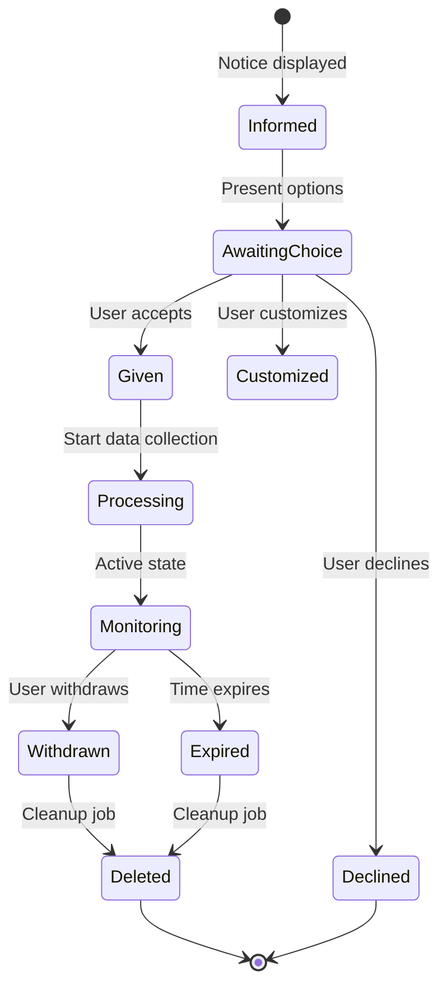
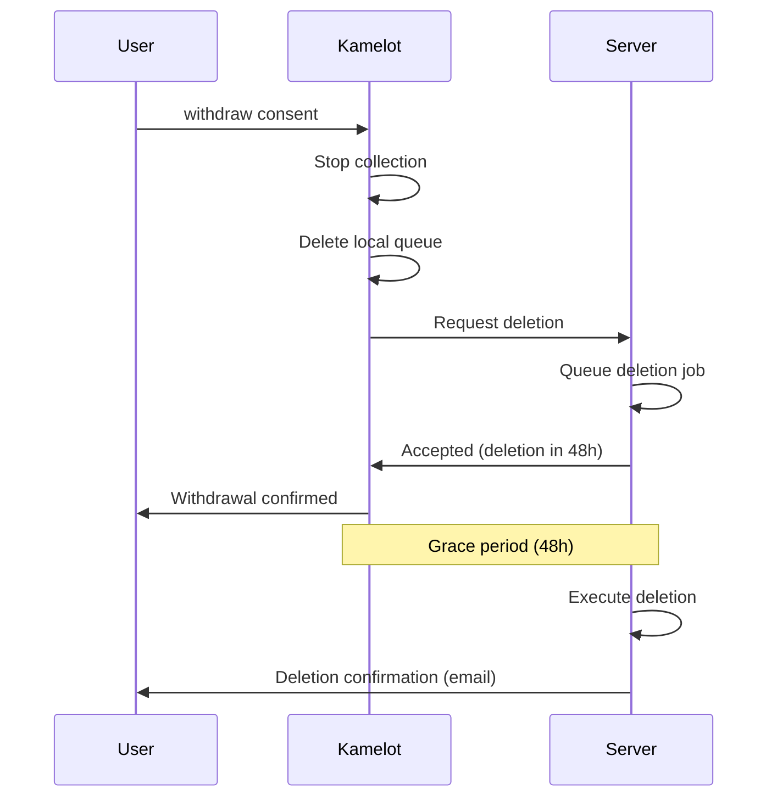

                                                                
                ▄    ▄                      ▄▄▄             ▄   
  ▄             █  ▄▀   ▄▄▄   ▄▄▄▄▄   ▄▄▄     █     ▄▄▄   ▄▄█▄▄ 
   ▀▀▀▄▄        █▄█    ▀   █  █ █ █  █▀  █    █    █▀ ▀█    █   
   ▄▄▄▀▀        █  █▄  ▄▀▀▀█  █ █ █  █▀▀▀▀    █    █   █    █   
  ▀             █   ▀▄ ▀▄▄▀█  █ █ █  ▀█▄▄▀  ▄▄█▄▄  ▀█▄█▀    ▀▄▄ 

# 06 — Consent Management

**Kamelot — The Sovereign Semantic Vector File System**

**Lois-Kleinner & 0-1.gg © 2026**

---

## Table of Contents

1. Introduction
2. When Consent Is Not Required
3. Consent for Telemetry
4. Consent Records
5. Withdrawal of Consent
6. Age Gating
7. Cookie Notice
8. Conclusion

---

## 1. Introduction

This document describes Kamelot's approach to consent management. Because Kamelot processes data locally and collects minimal data, consent requirements are limited.

Kamelot's philosophy: **ask for consent when needed, don't ask when not needed, and make withdrawal easy.**

---

## 2. When Consent Is Not Required

### 2.1 Core Functionality

Consent is not required for Kamelot's core functionality because:

- No personal data is processed for core functionality
- All data processing is local (on the user's device)
- The user controls all data and processing

This is consistent with:

- **GDPR Article 6(1)(f)**: Legitimate interest (the user's interest in using the software)
- **GDPR Recital 26**: Data processed locally is not subject to GDPR (not "personal data" as defined)
- **ePrivacy Directive**: Consent required for cookies/tracking, not for local processing

### 2.2 Legal Bases

| Processing Activity | Legal Basis | Consent Required? |
|-------------------|-------------|-------------------|
| Local file storage | Performance of a contract | No |
| Local file encryption | Performance of a contract | No |
| Local AI embedding | Performance of a contract | No |
| Local vector search | Performance of a contract | No |
| Configuration storage | Legitimate interest | No |
| Version ping | Legitimate interest | No (but configurable) |
| Crash reports | Consent | Yes (opt-in) |

---

## 3. Consent for Telemetry

### 3.1 Crash Reports

Crash reports require explicit consent:

- **Default**: Off
- **Opt-in mechanism**: User must deliberately enable via `--telemetry` flag or configuration
- **Information provided**: Users are informed of what crash reports contain
- **Explicit action required**: No implied consent

### 3.2 Version Ping

The version ping relies on legitimate interest (GDPR Article 6(1)(f)):

- Necessary for software improvement
- Minimal data collected (version, OS, date)
- No personal data
- Easily disabled

Users are informed of the version ping during first launch:

```
Kamelot sends a minimal, anonymous version ping.
This helps us understand our user base.
Disable: kml config set telemetry.version_ping false
```

### 3.3 First Launch Experience

On first launch (if telemetry is enabled):

```
┌────────────────────────────────────────────────┐
│  Kamelot Privacy Notice                         │
│                                                │
│  Kamelot collects minimal telemetry:            │
│  • Version ping (version, OS, date) — ON      │
│  • Crash reports (anonymous) — OFF            │
│                                                │
│  You can change these at any time.             │
│  No file data is ever collected.               │
│                                                │
│  [Accept]  [Customize]  [Disable All]          │
└────────────────────────────────────────────────┘
```

---

## 4. Consent Records

### 4.1 Local Consent Records

Consent preferences are stored locally:

```bash
kml config show telemetry
# telemetry.enabled: false
# telemetry.version_ping: true
# telemetry.crash_reports: false
```

These records are:

- Stored on the user's device
- Under the user's control
- Modifiable at any time
- Not transmitted to Kamelot servers

### 4.2 Consent Timestamp

When consent is given, the timestamp is recorded:

```bash
kml config show telemetry.consent
# consent.version_ping: true (given 2026-06-15T14:30:00Z)
# consent.crash_reports: false (not given)
```

### 4.3 No Server-Side Records

Kamelot does not maintain server-side consent records because:

- We don't have user accounts
- We don't maintain user databases
- We don't need to track who has consented
- Telemetry data is anonymous

---

## 5. Withdrawal of Consent

### 5.1 Right to Withdraw

Users can withdraw consent at any time. Withdrawal does not affect the lawfulness of processing before withdrawal.

### 5.2 How to Withdraw

**Withdraw consent for crash reports:**
```bash
kml config set telemetry.crash_reports false
kml telemetry delete  # Delete any queued reports
```

**Withdraw consent for version ping:**
```bash
kml config set telemetry.version_ping false
```

**Withdraw all consent:**
```bash
kml config set telemetry.enabled false
kml config set telemetry.version_ping false
```

### 5.3 Effect of Withdrawal

After withdrawal:

- No new crash reports are generated
- No version pings are sent
- Existing queued crash reports are deleted
- No data is transmitted to Kamelot servers

### 5.4 Data Already Transmitted

Data transmitted before withdrawal (e.g., crash reports already sent) is retained according to our retention policy (90 days for crash reports). It is not practically possible to delete data after it has been aggregated into statistics.

---

## 6. Age Gating

### 6.1 Not Applicable

Age gating is not applicable to Kamelot because:

- Kamelot does not collect personal data
- Kamelot does not offer age-restricted content
- Kamelot does not have user accounts
- Kamelot is a general-purpose software tool

### 6.2 GDPR Children's Consent

GDPR Article 8 requires parental consent for information society services offered directly to children under 16 (or lower age, 13–16 depending on member state).

Since Kamelot does not process children's personal data, this requirement does not apply.

### 6.3 COPPA (US)

The Children's Online Privacy Protection Act (COPPA) applies to online services that collect personal information from children under 13.

Since Kamelot does not collect personal information from any user of any age, COPPA does not apply.

---

## 7. Cookie Notice

### 7.1 Not Applicable

Kamelot does not use cookies:

- No HTTP cookies in the software
- No tracking cookies
- No session cookies
- No persistent cookies

### 7.2 Website

The Kamelot website (kamelot.dev) does not use cookies either:

- No analytics cookies
- No advertising cookies
- No functional cookies (no login/session needed)
- No third-party cookies

The website is a static site with no interactive features that require cookies.

### 7.3 EU ePrivacy Directive

The ePrivacy Directive (Cookie Directive) requires consent for storing cookies on a user's device. Since Kamelot does not store cookies — neither in the software nor on the website — no cookie consent is needed.

---

## 8. Conclusion

Kamelot's consent management is minimal by design:

- **Core functionality**: No consent required (local processing, no personal data)
- **Telemetry**: Consent for crash reports (opt-in), legitimate interest for version ping
- **Records**: Stored locally, user-controlled
- **Withdrawal**: Easy and immediate
- **Age gating**: Not applicable
- **Cookies**: None used

We ask for consent only when necessary, inform users of what they're consenting to, and make withdrawal as easy as giving consent.

---

## 9. Consent Lifecycle Management

### 9.1 Consent Lifecycle Stages

Consent in Kamelot follows a defined lifecycle:

```
Stage 1: Information
  ↓  User is informed about data collection
Stage 2: Choice
  ↓  User makes an informed choice (accept/decline/customize)
Stage 3: Record
  ↓  User's choice is recorded locally
Stage 4: Processing
  ↓  Data is processed according to consent
Stage 5: Monitoring
  ↓  Consent status is periodically reviewed
Stage 6: Withdrawal
  ↓  User may withdraw consent at any time
Stage 7: Deletion
  ↓  Data processed under consent is deleted
```

### 9.2 Consent States

| State | Description | Default |
|-------|-------------|---------|
| Not asked | User hasn't been presented with consent choice | Version ping |
| Given | User actively consented | Crash reports (if enabled) |
| Declined | User explicitly declined | Crash reports (default) |
| Withdrawn | User withdrew previously given consent | (user action) |
| Expired | Consent has timed out | (if configured) |

### 9.3 Consent Duration

| Consent Type | Default Duration | Configurable? | Renewal |
|-------------|-----------------|---------------|---------|
| Crash reports | Indefinite (until withdrawn) | Yes | After software update |
| Version ping | Indefinite (legitimate interest) | Yes | After policy change |

### 9.4 Consent Renewal Triggers

Consent is re-obtained when:

1. **Software update**: Major version changes that affect data collection
2. **Policy change**: Material changes to this consent policy
3. **New data collection**: Addition of new telemetry data types
4. **Timed expiration**: If consent duration is configured with expiration
5. **User request**: User wants to review and reconfirm choices

### 9.5 Consent Expiration Configuration

Enterprises can configure consent expiration:

```bash
# Set consent expiration to 90 days
kml config set telemetry.consent.expiration 90d

# Set consent to require yearly renewal
kml config set telemetry.consent.expiration 365d

# Disable expiration (default)
kml config set telemetry.consent.expiration 0
```

### 9.6 Consent Review Reminders

Users receive reminders before consent expires:

| Reminder | Timing | Method |
|----------|--------|--------|
| First reminder | 30 days before expiration | In-app notification |
| Second reminder | 7 days before expiration | CLI warning |
| Final reminder | Day of expiration | Blocking prompt |

## 10. Consent in Enterprise Deployments

### 10.1 Enterprise Consent Models

| Model | Description | Best For |
|-------|-------------|----------|
| Individual consent | Each user consents separately | Small teams |
| Managerial consent | Admin consents on behalf of team | Medium organizations |
| Policy-based | Consent is part of company policy | Large enterprises |
| Silent deployment | Consent managed externally | Regulated environments |

### 10.2 Managerial Consent

In managerial consent mode, an administrator configures telemetry for all users:

```bash
# Admin configures telemetry for all users
kml config set telemetry.enabled true --enforce --scope all-users

# Users see configured settings but cannot change them
kml config show telemetry
# telemetry.enabled: true (enforced by admin)
# telemetry.crash_reports: true (enforced by admin)
```

### 10.3 Policy-Based Consent

For large enterprises, consent is managed through policy documents:

```yaml
# enterprise-consent-policy.yaml
policy_version: "1.0"
effective_date: "2026-06-15"
scope: "Acme Corporation - All Employees"

telemetry:
  version_ping:
    status: enabled
    basis: "Legitimate interest"
    can_opt_out: true
    
  crash_reports:
    status: enabled
    basis: "Consent (managerial)"
    can_opt_out: false
    
  analytics:
    status: disabled
    basis: "Not collected"
    can_opt_out: true
```

### 10.4 Consent in Regulated Industries

| Industry | Consent Requirements | Kamelot Solution |
|----------|---------------------|------------------|
| Healthcare (HIPAA) | Written authorization | Telemetry disabled by default |
| Finance (SOX) | Audit trail for changes | Consent change logging |
| Government (FedRAMP) | Strict data controls | Configurable restrictions |
| Education (FERPA) | Parental consent for minors | No personal data collected |
| Legal (ABA) | Client confidentiality | Local-only processing |

### 10.5 Enterprise Reporting

Enterprises can generate consent compliance reports:

```bash
kml enterprise consent-report --format pdf
```

Report contents:

| Section | Content |
|---------|---------|
| Summary | Total users, consent distribution |
| Configuration | Current telemetry settings |
| Consent log | All consent events with timestamps |
| User breakdown | Consent status per user (anonymized) |
| Recommendations | Suggested configuration changes |

## 11. Audit Trail for Consent

### 11.1 Consent Event Logging

All consent-related events are logged locally:

| Event | Logged Data | Example |
|-------|-------------|---------|
| Consent given | Type, timestamp, method | `crash_reports given 2026-06-15T14:30:00Z UI` |
| Consent withdrawn | Type, timestamp | `crash_reports withdrawn 2026-07-15T10:00:00Z` |
| Consent expired | Type, timestamp | `consent expired crash_reports 2026-09-15T14:30:00Z` |
| Policy accepted | Policy version, timestamp | `policy v1.1 accepted 2026-06-15T14:30:00Z` |
| Configuration changed | Setting, old value, new value | `telemetry.enabled false -> true` |

### 11.2 Viewing the Audit Trail

```bash
# View full consent audit trail
kml consent audit
# 2026-06-15 14:30:00 | consent.given      | crash_reports | UI
# 2026-06-15 14:31:00 | consent.given      | version_ping  | default
# 2026-07-15 10:00:00 | consent.withdrawn  | crash_reports | CLI

# Filter by type
kml consent audit --type withdrawal
# 2026-07-15 10:00:00 | consent.withdrawn  | crash_reports | CLI

# Export audit trail
kml consent audit --export json --output consent-audit.json
```

### 11.3 Audit Trail Export Format

```json
{
  "events": [
    {
      "timestamp": "2026-06-15T14:30:00Z",
      "event": "consent.given",
      "type": "crash_reports",
      "method": "UI",
      "policy_version": "1.0"
    },
    {
      "timestamp": "2026-07-15T10:00:00Z",
      "event": "consent.withdrawn",
      "type": "crash_reports",
      "method": "CLI"
    }
  ],
  "metadata": {
    "kamelot_version": "0.2.0",
    "os": "linux",
    "exported_at": "2026-07-15T10:00:00Z"
  }
}
```

### 11.4 Audit Trail Retention

| Event Type | Local Retention | Why |
|-----------|----------------|-----|
| Consent given | Indefinite (until factory reset) | Legal requirement |
| Consent withdrawn | Indefinite | Proof of withdrawal |
| Policy acceptance | Indefinite | Proof of notice |
| Configuration changes | 5 years | Good practice |
| Consent expiration | 1 year after expiration | Limited value |

### 11.5 Audit Trail Integrity

The consent audit trail is protected by:

- **Append-only log**: Entries cannot be deleted or modified
- **Hash chaining**: Each entry contains hash of previous entry
- **Tamper detection**: `kml consent audit --verify` checks integrity
- **Export for external auditing**: JSON export for SIEM integration

### 11.6 Verification Command

```bash
kml consent audit --verify
# ✅ Consent audit trail integrity verified
# Total entries: 47
# Chain valid: true
# Last entry: 2026-07-15T10:00:00Z
# Hash: sha256:a1b2c3d4...
```

## Consent Management System

### Consent Lifecycle

The consent lifecycle tracks every consent interaction from initial presentation through eventual withdrawal or expiration.

#### Lifecycle Stages

```
INFORMED → CHOICE → RECORDED → PROCESSING → MONITORING → WITHDRAWAL/EXPIRY → DELETION
    ↓          ↓         ↓           ↓            ↓              ↓               ↓
  User is   User     Choice is   Data is     Periodic     User withdraws   Data deleted
  presented makes    recorded    processed   review of    or consent       per retention
  with       choice   locally    according   continued    expires          policy
  information         to consent  to consent  consent
```

#### State Machine



#### State Transitions

| From | To | Trigger | Action |
|------|----|---------|--------|
| Informed | AwaitingChoice | Display consent UI | Log impression |
| AwaitingChoice | Given | User accepts | Log consent, start collection |
| AwaitingChoice | Declined | User declines | Log decline, no collection |
| AwaitingChoice | Customized | User customizes settings | Apply custom config |
| Given | Processing | Consent recorded | Begin data transmission |
| Processing | Monitoring | Active period | Periodic status checks |
| Monitoring | Withdrawn | User revokes | Stop collection, queue deletion |
| Monitoring | Expired | Timer expires | Stop collection, notify user |
| Withdrawn | Deleted | Cleanup | Remove data, log deletion |
| Expired | Deleted | Cleanup | Remove data, log expiration |

### Record Keeping

Consent records are maintained to demonstrate compliance.

#### Record Contents

Each consent record contains:

| Field | Type | Example | Purpose |
|-------|------|---------|---------|
| event_id | UUID | `evt-a1b2c3d4-...` | Unique identifier |
| timestamp | ISO 8601 | `2026-06-19T14:30:00Z` | When event occurred |
| event_type | Enum | `consent.given` | Type of consent event |
| consent_type | Enum | `crash_reports` | What was consented to |
| policy_version | SemVer | `1.1` | Policy version in effect |
| method | Enum | `CLI` | How consent was given |
| expires_at | ISO 8601 | `2027-06-19T14:30:00Z` | When consent expires |
| previous_hash | SHA-256 | `sha256:abc...` | Chain integrity |

#### Record Storage

| Storage Location | Retention | Format | Protection |
|-----------------|-----------|--------|------------|
| Local config file | Indefinite | TOML | File permissions |
| Local audit log | Indefinite | Append-only JSON | Hash chain |
| Enterprise SIEM | As configured | JSON over syslog | TLS encrypted |

#### Record Export

```bash
# Export all consent records
kml consent export --format json --output consent-records.json
# Exported 47 consent records (2026-01-01 to 2026-06-19)
#
# Records include:
# - 23 consent.given events
# - 12 consent.withdrawn events  
# - 8 consent.expired events
# - 4 policy.accepted events

# Export for specific time period
kml consent export --since 2026-01-01 --until 2026-06-30 --output Q2-consent.json

# Verify export integrity
kml consent verify --file consent-records.json
# ✅ Consent records verified
# Records: 47
# Chain valid: true
# Hash: sha256:a1b2c3d4e5f6...
```

### Withdrawal Handling

When a user withdraws consent, Kamelot follows a defined procedure to ensure complete removal of associated data.

#### Withdrawal Procedure

```bash
# User initiates withdrawal
kml consent withdraw --type crash_reports

# System response:
# 1. ✅ Crash report collection disabled
# 2. ✅ Queued crash reports deleted (3 reports)
# 3. ✅ Telemetry identity preserved (for aggregated data only)
# 4. ✅ Withdrawal recorded in audit trail
#
# Note: Data already included in published aggregates
# cannot be removed. This is standard for anonymous
# aggregate statistics.
```

#### Immediate Effects

| Consent Type | Collection Stopped | Queued Data Deleted | Server Data Affected |
|-------------|-------------------|--------------------|----------------------|
| Crash reports | ✅ Immediate | ✅ Immediate | ❌ Already sent reports (retained 90 days) |
| Version ping | ✅ Immediate | N/A | ❌ Aggregated counts cannot be un-counted |
| Custom analytics | ✅ Immediate | ✅ Immediate | ✅ Deleted on server within 24 hours |

#### Grace Period

Kamelot implements a 48-hour grace period for withdrawal:

```
Hour 0:  User withdraws consent
         Collection stops immediately
         Local queued data deleted
         
Hour 0-48: Grace period
           User can reinstate consent without data loss
           Server-side deletion is queued but not executed
           
Hour 48: Server-side deletion executed
         Grace period expires
         Full deletion confirmed
```

#### Reinstatement During Grace Period

```bash
# Reinstate consent within grace period
kml consent reinstate --type crash_reports
# Consent reinstated: crash_reports
# Grace period: 38 hours remaining
# Previous data that was queued for deletion has been restored.
```

#### Post-Withdrawal Data Flow



### Audit Trails

The consent audit trail provides tamper-evident logging of all consent events.

#### Audit Trail Structure

```
┌─────────────────────────────────────────────────────────────┐
│ Consent Audit Trail                                          │
├──────┬──────────┬──────────────┬────────────┬───────────────┤
│ Hash │ Event    │ Timestamp    │ Details    │ Previous Hash │
├──────┼──────────┼──────────────┼────────────┼───────────────┤
│ a1b2 │ given    │ 2026-06-19   │ crash_     │ 0000 (genesis)│
│      │          │ 14:30:00Z    │ reports    │               │
├──────┼──────────┼──────────────┼────────────┼───────────────┤
│ c3d4 │ accepted │ 2026-06-19   │ policy     │ a1b2          │
│      │          │ 14:31:00Z    │ v1.1       │               │
├──────┼──────────┼──────────────┼────────────┼───────────────┤
│ e5f6 │ withdrawn│ 2026-07-15   │ crash_     │ c3d4          │
│      │          │ 10:00:00Z    │ reports    │               │
└──────┴──────────┴──────────────┴────────────┴───────────────┘
```

#### Tamper Evidence

The hash chain ensures tamper evidence:

| Tampering Attempt | Detection Method | Evidence |
|------------------|-----------------|----------|
| Modify an entry | Hash mismatch for modified entry | `kml consent verify` fails |
| Delete an entry | Missing link in hash chain | Gap in sequence |
| Reorder entries | Hash chain broken | Previous hash doesn't match |
| Insert fake entry | Hash chain shows unexpected fork | Verify reports orphan |

#### Audit Trail Commands

```bash
# View audit trail
kml consent audit
# ┌──────────┬──────────┬────────────────────┬────────────────┐
# │ #        │ Event    │ Timestamp          │ Type           │
# ├──────────┼──────────┼────────────────────┼────────────────┤
# │ 0001     │ given    │ 2026-01-01T00:00Z  │ version_ping   │
# │ 0002     │ given    │ 2026-01-01T00:00Z  │ crash_reports  │
# │ ...      │ ...      │ ...                │ ...            │
# │ 0047     │ withdrawn│ 2026-07-15T10:00Z  │ crash_reports  │
# └──────────┴──────────┴────────────────────┴────────────────┘

# Verify integrity
kml consent audit --verify
# ✅ Consent audit trail integrity verified
# Entries: 47
# Hash chain: intact
# Last hash: sha256:a1b2c3d4...

# Export for external audit
kml consent audit --export json --output consent-audit.json
```

#### Integration with External SIEM

For enterprise deployments, the audit trail can be forwarded to SIEM systems:

```yaml
# consent-audit-siem.yaml
forwarding:
  enabled: true
  protocol: syslog
  format: CEF
  endpoint: "siem.corp.example.com:514"
  filter:
    - event_type: "consent.withdrawn"
    - event_type: "consent.given"
  tls:
    enabled: true
    ca_cert: "/etc/kamelot/siem-ca.pem"
```

---

## 12. User Interface for Consent Management

### 12.1 CLI Consent Interface

The primary consent interface is the CLI:

```bash
# View current consent status
kml consent status
# 
# Consent Status
# ┌────────────────┬──────────┬──────────────────────┐
# │ Feature        │ Status   │ Details              │
# ├────────────────┼──────────┼──────────────────────┤
# │ Version ping   │ ✅ Given │ Legitimate interest  │
# │ Crash reports  │ ❌ Not given │ Opt-in required     │
# └────────────────┴──────────┴──────────────────────┘

# Give consent
kml consent give --type crash_reports

# Withdraw consent
kml consent withdraw --type crash_reports

# Review consent information
kml consent info --type crash_reports
```

### 12.2 First Launch Wizard

On first launch, a consent wizard is displayed:

```
╔══════════════════════════════════════════════╗
║  Kamelot Privacy Setup                       ║
║                                              ║
║  Kamelot respects your privacy.              ║
║                                              ║
║  📡 Version Ping (anonymous):                ║
║     Sends version, OS, and date.             ║
║     Helps us understand our user base.       ║
║     [✅ Enabled]                             ║
║                                              ║
║  🐛 Crash Reports (anonymous):               ║
║     Helps us fix bugs.                       ║
║     No file data is included.                ║
║     [❌ Disabled]                            ║
║                                              ║
║  More info: docs/privacy/02-data-collection.md║
║  Read full policy: docs/privacy/01-privacy.md ║
║                                              ║
║  [1] Accept all    [2] Customize    [3] Skip ║
╚══════════════════════════════════════════════╝
```

### 12.3 GUI Consent Management

The Kamelot GUI provides a consent management panel:

```
Settings → Privacy & Security → Data Collection

┌─────────────────────────────────────────────┐
│ Data Collection Settings                     │
│                                             │
│ Version Ping                                 │
│   Send anonymous version info on startup     │
│   [Toggle: ON]                               │
│   Last reviewed: 2026-06-15                  │
│                                             │
│ Crash Reports                                │
│   Send crash reports to help fix bugs        │
│   [Toggle: OFF]                              │
│   No file data included                      │
│                                             │
│ Analytics                                    │
│   Usage analytics are not collected          │
│                                             │
│ View Audit Trail  ●  Export Report          │
│ Withdraw All Consent                         │
└─────────────────────────────────────────────┘
```

### 12.4 Consent Notification Center

Users receive notifications for consent-related events:

| Notification | Trigger | Example |
|-------------|---------|---------|
| Policy updated | Policy version change | "Privacy policy updated to v1.2" |
| Consent expiring | 30 days before expiration | "Crash report consent expiring" |
| Consent expired | Day of expiration | "Crash report consent expired" |
| Data collected | After first data sent | "First version ping sent" |
| Review reminder | Annual | "Time to review your privacy settings" |

### 12.5 Accessibility

Consent management is designed to be accessible:

- **Screen reader compatible**: CLI output uses structured formatting
- **Multiple languages**: Consent notices in user's language
- **Clear language**: No legal jargon in consent prompts
- **Sufficient time**: No time pressure to make consent decisions
- **Easy withdrawal**: Withdraw consent with single command

*For consent management questions: consent@kamelot.dev*

*Last updated: June 2026*

*This document is part of the Privacy documentation suite. See also:*
- *01-privacy-policy.md — Full privacy policy*
- *02-data-collection.md — Data collection practices*
- *03-user-rights.md — User data rights*
- *04-anonymization.md — Anonymization practices*
- *05-cross-border-transfers.md — Cross-border data transfers*

---

*Kamelot is a project of Lois-Kleinner & 0-1.gg. © 2026. All rights reserved.*
