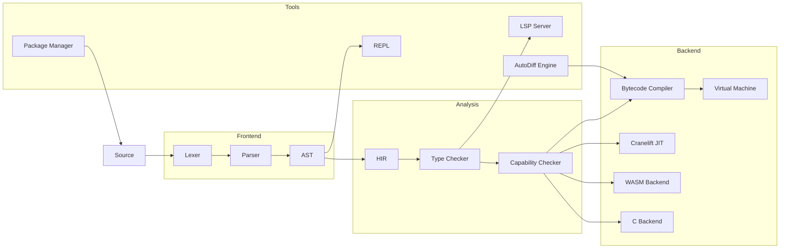

# 03 — Kasteran Programming Language

A systems programming language with rune-based visual syntax (symbolic glyphs inspired by Urbit's Hoon and APL), a gradual type system with linear capability model, self-hosted compiler with formal verification, and multiple compilation targets.

## Documentation

| Category | Docs | Description |
|----------|------|-------------|
| [Research](./research/) | 15 | Academic papers on language design, rune syntax, type theory, linear types, memory safety, formal verification, theorem proving, compiler optimization, auto-vectorization, auto-differentiation, dataflow architecture, ECS, GPU computing, WASM, package management |
| [Features](./features/) | 15 | Feature documentation |
| [Tutorials](./tutorials/) | 15 | Getting started guides |
| [No Black Boxes](./no-black-boxes/) | 10 | Transparency philosophy |
| [No More Silicon](./no-more-silicon/) | 10 | Hardware independence |
| [Privacy](./privacy/) | 10 | Privacy documentation |
| [Compliance](./compliance/) | 11 | Compliance frameworks |
| [Data Safety](./data-safety/) | 10 | Data safety guarantees |
| [CSR](./csr/) | 10 | Corporate social responsibility |
| [FAQ](./faq/) | 13 | Frequently asked questions |
| [Why Use](./why-use/) | 15 | Value proposition |
| [Community](./community/) | 10 | Community documentation |
| [BDRs](./bdr/) | 10 | Business decision records |
| [Help](./help/) | 11 | Troubleshooting guides |
| [Developers](./developers/) | 15 | Developer documentation |
