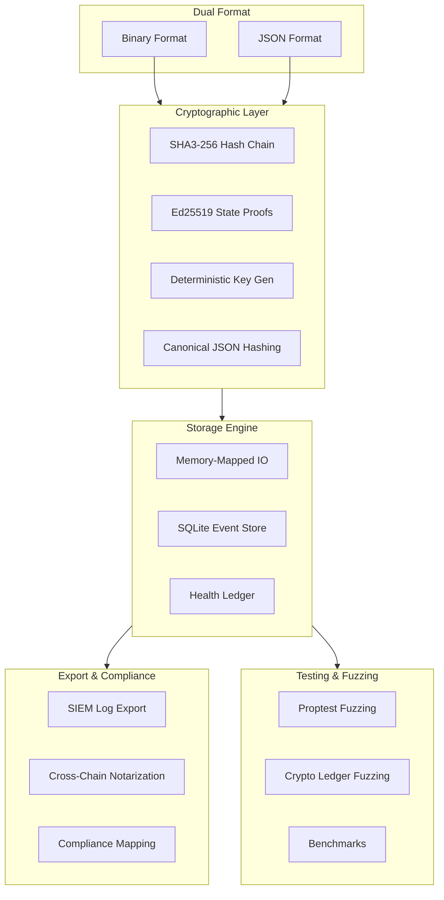

# 04 — AIOSS Format

**AI Open Signed Storage Format** — a cryptographic ledger file format standard designed for tamper-evident, auditable record-keeping. Defines a dual-format (binary + JSON) ledger with SHA3-256 hash chaining, Ed25519 signatures, and memory-mapped I/O.

## Research Papers

| # | Paper |
|---|-------|
| 01 | [SHA3 Hash Chain Integrity](./research/01-sha3-hash-chain-integrity.md) |
| 02 | [Ed25519 State Proofs](./research/02-ed25519-state-proofs.md) |
| 03 | [Dual Format Ledger](./research/03-dual-format-ledger.md) |
| 04 | [Compliance Framework Mapping](./research/04-compliance-framework-mapping.md) |
| 05 | [Hash Chain Verification Benchmarks](./research/05-hash-chain-verification-benchmarks.md) |
| 06 | [Ledger Lifecycle Management](./research/06-ledger-lifecycle-management.md) |
| 07 | [SQLite Event Store](./research/07-sqlite-event-store.md) |
| 08 | [SIEM Log Export](./research/08-siem-log-export.md) |
| 09 | [Cross-Chain Notarization](./research/09-cross-chain-notarization.md) |
| 10 | [Health Ledger Subsystem](./research/10-health-ledger-subsystem.md) |
| 11 | [Proptest Fuzz Testing](./research/11-proptest-fuzz-testing.md) |
| 12 | [Memory-Mapped IO Ledger](./research/12-memory-mapped-io-ledger.md) |
| 13 | [Post-Quantum Migration](./research/13-post-quantum-migration.md) |
| 14 | [Deterministic Key Generation](./research/14-deterministic-key-generation.md) |
| 15 | [Canonical JSON Hashing](./research/15-canonical-json-hashing.md) |
| 16 | [Cryptographic Ledger Fuzzing](./research/16-cryptographic-ledger-fuzzing.md) |
| 17 | [Cross-Jurisdiction Governance](./research/17-cross-jurisdiction-governance.md) |
| 18 | [Distribution Strategies](./research/18-distribution-strategies.md) |
| 19 | [Open Source Governance](./research/19-open-source-governance.md) |
| 20 | [Multilanguage Bindings](./research/20-multilanguage-bindings.md) |

## Documentation

| Category | Docs | Description |
|----------|------|-------------|
| [Features](./features/) | 8 | Feature documentation |
| [Tutorials](./tutorials/) | 5 | Getting started guides |
| [How To Use](./how-to-use/) | 1 | Developer usage |
