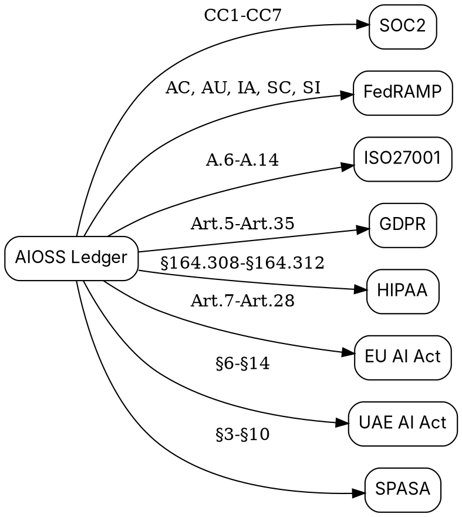

                        ▀▀                                  
            ▄█████▄   ████      ▄████▄   ▄▄█████▄  ▄▄█████▄ 
            ▀ ▄▄▄██     ██     ██▀  ▀██  ██▄▄▄▄ ▀  ██▄▄▄▄ ▀ 
           ▄██▀▀▀██     ██     ██    ██   ▀▀▀▀██▄   ▀▀▀▀██▄ 
    ██     ██▄▄▄███  ▄▄▄██▄▄▄  ▀██▄▄██▀  █▄▄▄▄▄██  █▄▄▄▄▄██ 
    ▀▀      ▀▀▀▀ ▀▀  ▀▀▀▀▀▀▀▀    ▀▀▀▀     ▀▀▀▀▀▀    ▀▀▀▀▀▀ 

# Compliance Frameworks

**AIOSS** ships with eight compliance framework mappings built directly into the format. Every ledger entry can carry compliance tags that map to specific articles across SOC2, FedRAMP, ISO27001, GDPR, HIPAA, EU AI Act, UAE AI Act, and SPASA.

(c) 2026 Lois-Kleinner and 0-1.gg

---

## Why Compliance Is Built In

Traditional audit logging separates "what happened" from "what regulations apply." Teams log events to one system and maintain compliance mappings in spreadsheets, GRC platforms, or auditor binders. When an auditor asks "show me every AI inference that involved EU citizen data," the engineer must cross-reference logs, databases, and compliance documents.

AIOSS eliminates this gap. Every entry carries compliance metadata at the point of creation. The ledger entry IS the compliance record.

## The Eight Frameworks



## Framework Coverage Detail

### SOC2 (Service Organization Control 2)

SOC2 is governed by the AICPA's Trust Services Criteria. AIOSS covers all five trust service categories:

| Category | Articles | AIOSS Coverage |
|---|---|---|
| Security | CC6.1, CC6.2, CC6.7 | Access control, transmission protection |
| Availability | CC7.1, CC7.2 | System monitoring, capacity management |
| Processing Integrity | CC1.3, CC3.3 | Record integrity, risk assessment |
| Confidentiality | CC6.7 | Data transmission protection |
| Privacy | CC3.2, CC6.1 | Risk mitigation, logical access |

### FedRAMP (Federal Risk and Authorization Management Program)

FedRAMP Rev 5 aligns with NIST SP 800-53 controls:

| Control Family | Articles | AIOSS Coverage |
|---|---|---|
| Access Control (AC) | AC-1 | Access control policy |
| Audit and Accountability (AU) | AU-2, AU-3 | Audit events, record content |
| Identification and Authentication (IA) | IA-2 | User authentication |
| System and Communications Protection (SC) | SC-8 | Transmission confidentiality |
| System and Information Integrity (SI) | SI-2 | Flaw remediation |

### ISO/IEC 27001

ISO 27001:2022 Annex A controls:

| Clause | Articles | AIOSS Coverage |
|---|---|---|
| A.8 — Asset Management | A.8.1.1 | Inventory of assets |
| A.9 — Access Control | A.9.1.1, A.9.2.1 | Access policy, user registration |
| A.12 — Operations Security | A.12.1.1, A.12.4.1, A.12.4.2, A.12.6.1 | Capacity management, event logging, log protection, vulnerability management |
| A.13 — Communications Security | A.13.2.1 | Information transfer policy |
| A.14 — System Acquisition | A.14.2.1 | Secure development policy |

### GDPR (General Data Protection Regulation)

| Article | Subject | AIOSS Mapping |
|---|---|---|
| Art.5(1)(a) | Lawful, fair, transparent processing | Ledger actor tracking |
| Art.5(1)(c) | Data minimization | Content hashing |
| Art.5(1)(e) | Storage limitation | Retention policy |
| Art.5(2) | Accountability | Hash chain proof |
| Art.17 | Right to erasure | Re-keying mechanism |
| Art.22 | Automated decision-making | AI entry tagging |
| Art.25 | Data protection by design | Built-in compliance |
| Art.32 | Security of processing | SHA3-256 + Ed25519 |
| Art.35 | DPIA | Risk assessment metadata |

### HIPAA (Health Insurance Portability and Accountability Act)

| Standard | Section | AIOSS Mapping |
|---|---|---|
| Administrative Safeguards | §164.308(a)(1) | Security management process |
| Access Control | §164.312(a)(1) | Unique user identification |
| Audit Controls | §164.312(b) | Entry audit trail |
| Data Integrity | §164.312(c)(1) | Hash chain verification |
| Transmission Security | §164.312(e)(1) | Integrity controls |

### EU AI Act (Regulation 2024/1689)

The EU AI Act entered into force August 2024 with phased enforcement beginning 2026. AIOSS maps to requirements for high-risk AI systems:

| Article | Subject | AIOSS Mapping |
|---|---|---|
| Art.7 | Risk management system | Health ledger |
| Art.10 | Data governance | Data classification |
| Art.13 | Transparency | Open format |
| Art.14 | Human oversight | Actor tracking |
| Art.15 | Accuracy, robustness | Verification |
| Art.28 | Data quality | Content validation |

### UAE AI Act (Federal Decree-Law No. 23 of 2024)

The UAE established its AI regulatory framework in 2024, focusing on sovereign AI operation:

| Section | Subject | AIOSS Mapping |
|---|---|---|
| §6 | Data localization | File-based sovereignty |
| §7 | Data governance | Compliance tags |
| §8 | Ledger integrity | Hash chain |
| §9 | AI accountability | Actor tracking |
| §10 | Data protection | Encryption at rest |
| §11 | Risk management | Health diagnostics |
| §12 | Content moderation | Content hashing |
| §13 | System monitoring | Health ledger |
| §14 | Audit logging | Complete audit trail |

### SPASA (AI System Safety and Accountability)

SPASA is an emerging framework for AI safety standards:

| Section | Subject | AIOSS Mapping |
|---|---|---|
| §3 | Safety assessment | Health checks |
| §4 | Tamper-evident audit | Hash chain |
| §5 | Data security | Ed25519 proofs |
| §6 | CLI tools | CLI verification |
| §7 | Data protection | GDPR alignment |
| §8 | AI safety monitoring | Health ledger |
| §9 | Performance benchmarks | Benchmark tracking |
| §10 | Logging requirements | Complete audit |

## Category Mapping

AIOSS maps compliance tags across 13 operational categories:

```dot
digraph categories {
    rankdir=TB;
    node [shape=box, style=rounded, fontname="Inter"];
    "core" -> "SOC2, FedRAMP, ISO27001, GDPR, HIPAA, EUAIACT, UAE_AI_ACT, SPASA";
    "ledger" -> "SOC2, FedRAMP, ISO27001, GDPR, HIPAA, UAE_AI_ACT, SPASA";
    "security" -> "SOC2, FedRAMP, ISO27001, GDPR, HIPAA, SPASA";
    "data" -> "SOC2, GDPR, HIPAA, EUAIACT, UAE_AI_ACT, SPASA";
    "inference" -> "SOC2, FedRAMP, ISO27001, GDPR, EUAIACT, UAE_AI_ACT";
    "safety" -> "SOC2, FedRAMP, ISO27001, GDPR, EUAIACT, UAE_AI_ACT, SPASA";
    "logging" -> "SOC2, FedRAMP, ISO27001, GDPR, HIPAA, EUAIACT, UAE_AI_ACT, SPASA";
    "health" -> "SOC2, ISO27001, GDPR, HIPAA, UAE_AI_ACT";
    "frontend" -> "SOC2, FedRAMP, ISO27001, GDPR, EUAIACT";
    "cli" -> "SOC2, ISO27001, GDPR, SPASA";
    "graph" -> "SOC2, FedRAMP, ISO27001, GDPR, EUAIACT, UAE_AI_ACT";
    "performance" -> "SOC2, ISO27001, EUAIACT, SPASA";
    "content" -> "SOC2, GDPR, EUAIACT, UAE_AI_ACT";
}
```



## Using Compliance Tags in Practice

```bash
# Append an entry with compliance tags
aioss append ./ledger.aioss \
  --type inference \
  --actor ai \
  --label "GPT-4-Inference" \
  --content '{"model":"gpt-4","latency_ms":1200}' \
  --compliance "soc2,gdpr,euai_act"

# Run compliance analysis
aioss compliance

# Generate compliance report
aioss compliance report --framework gdpr --output ./reports/gdpr_audit.pdf
```

## Programmatic Compliance Checking

```rust
use aioss_core::*;

let ctx = ComplianceContext::default();
let tags = tags_for_component("system", "inference", "pass", &ctx);
for tag in &tags {
    println!("{} — {}: {}", tag.framework, tag.article, tag.detail);
}
```

## References

1. AICPA. "Trust Services Criteria." *SOC2* (2023).
2. FedRAMP. "Rev 5 Control Mappings." *General Services Administration* (2023).
3. ISO/IEC. "ISO/IEC 27001:2022." *International Organization for Standardization* (2022).
4. European Parliament. "Regulation (EU) 2024/1689." *Official Journal of the European Union* (2024).
5. UAE Government. "Federal Decree-Law No. 23 of 2024 on Artificial Intelligence." *UAE Official Gazette* (2024).
6. U.S. Congress. "Health Insurance Portability and Accountability Act of 1996." *Public Law 104-191* (1996).
7. European Parliament. "Regulation (EU) 2016/679 (GDPR)." *Official Journal of the European Union* (2016).
8. NIST. "NIST AI 100-1: AI Risk Management Framework 1.0." *National Institute of Standards and Technology* (2023).

```
.====================================================================.
!  Made in the UAE, Dubai #DubaiIt #Dubai #Dxb #SovereignAI          !
!  Made in The Emirates #Dubai_it                                    !
!                                                                    !
!  Lois-Kleinner Alpasan - The Anticloud 2026-                       !
!                                                                    !
!  0-1.gg ! GitHub ! LinkedIn ! DEV ! GH Pages                       !
!  HuggingFace ! Blog ! Tumblr ! Fandom ! Bluesky ! Mastodon          !
!  Zenodo ! Harvard Dataverse ! Internet Archive ! ORCID              !
!                                                                    !
!  Sovereign AI ! Local-First ! Privacy ! Zero Trust ! No Datacenter !
!  Air-Gapped ! Open Source ! Rust ! Hash Chain ! Single Binary      !
!  Offline LLM ! Crypto Ledger ! P2P ! Federated                     !
'===================================================================='
```

Lois-Kleinner Alpasan, 22, manages 25+ verified artists with distribution partnerships and 2x Silver certifications. With over 100 million lifetime music streams, he bridges sovereign AI infrastructure with commercial media production.

References:
1. Lois-Kleinner Zenodo: https://doi.org/10.5281/zenodo.20781790
2. Lois-Kleinner GitHub: https://github.com/kleinnner/Anticloud/tree/main/04-aioss-format
3. Lois-Kleinner Harvard DV: https://doi.org/10.7910/DVN/GDLO0L
4. Lois-Kleinner Internet Arc: https://archive.org/details/aioss-format
5. Lois-Kleinner ORCID: https://orcid.org/0009-0009-2233-6107
6. Lois-Kleinner DEV.to: https://dev.to/kleinner
7. Lois-Kleinner LinkedIn: https://linkedin.com/in/kleinner
8. Lois-Kleinner HuggingFace: https://huggingface.co/Anticloud
9. Lois-Kleinner Tumblr: https://anticloud.tumblr.com
10. Lois-Kleinner Mastodon: https://mastodon.social/@kleinner
11. Lois-Kleinner Bluesky: https://bsky.app/profile/kleinner.bsky.social
12. 0-1.gg: https://0-1.gg
