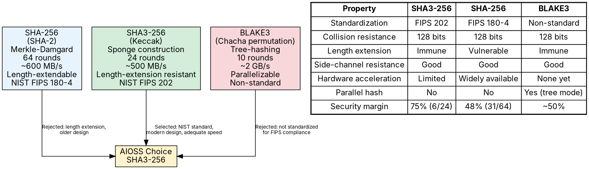

                        ▀▀                                  
            ▄█████▄   ████      ▄████▄   ▄▄█████▄  ▄▄█████▄ 
            ▀ ▄▄▄██     ██     ██▀  ▀██  ██▄▄▄▄ ▀  ██▄▄▄▄ ▀ 
           ▄██▀▀▀██     ██     ██    ██   ▀▀▀▀██▄   ▀▀▀▀██▄ 
    ██     ██▄▄▄███  ▄▄▄██▄▄▄  ▀██▄▄██▀  █▄▄▄▄▄██  █▄▄▄▄▄██ 
    ▀▀      ▀▀▀▀ ▀▀  ▀▀▀▀▀▀▀▀    ▀▀▀▀     ▀▀▀▀▀▀    ▀▀▀▀▀▀ 

# Cryptographic Primitives

**AIOSS** is built on a carefully selected set of cryptographic primitives designed for long-term security, performance, and regulatory compliance. This document specifies every cryptographic component in the AIOSS stack: SHA3-256 for hashing, Ed25519 for signatures, key generation and management, content hash computation, header checksum computation, and the security rationale for each choice. It also provides comparative analysis against alternative primitives and discusses the post-quantum migration path.

The cryptographic design philosophy of AIOSS follows three principles:

1. **Conservative choices:** Only NIST-standardized or RFC-specified algorithms are used. No custom cryptographic constructions.
2. **Defense in depth:** Multiple integrity mechanisms (hash chains, digital signatures, checksums) provide overlapping protection.
3. **Future-proofing:** The architecture supports cryptographic agility, allowing algorithm replacement without format changes.

## SHA3-256: Sponge Construction and Security Margin

SHA3-256 is the primary hash function used throughout AIOSS. It is specified in NIST FIPS PUB 202 and is based on the Keccak sponge construction. Unlike SHA-2, which uses the Merkle-Damgard construction, SHA3 uses a sponge construction that provides fundamentally different security properties.

### Sponge Construction

The Keccak sponge function operates on a 1600-bit state, organized as a 5 x 5 x 64 three-dimensional array. The construction has two phases:

**Absorbing Phase:** The input message is split into blocks of size r (the rate). Each block is XORed into the first r bits of the state, followed by the Keccak-p permutation. This continues until all input is processed.

**Squeezing Phase:** After all input is absorbed, the first r bits of the state are output as the hash. If the desired output length exceeds r, the permutation is applied again and more bits are squeezed.

For SHA3-256:

- Rate r = 1088 bits (136 bytes)
- Capacity c = 512 bits (64 bytes)
- Output length = 256 bits (32 bytes)
- Rounds = 24
- State size = r + c = 1600 bits

### The Five Step Mappings

Each of the 24 rounds applies five steps in sequence:

**Theta (θ):** Provides diffusion. Each bit is XORed with the parity of two neighboring columns:

```
C[x] = XOR_z(state[x, 0, z], state[x, 1, z], state[x, 2, z], state[x, 3, z], state[x, 4, z])
D[x] = C[x-1] XOR ROT(C[x+1], 1)
state[x, y, z] ^= D[x]
```

**Rho (ρ):** Bitwise rotation within each lane. Each of the 25 lanes is rotated by a different offset:

```
state[x, y] = ROT(state[x, y], r[x, y])
```

The rotation offsets are specified in FIPS 202 Section 3.2.2.

**Pi (π):** Permutes the lanes:

```
state[x, y] = state[x', y'] where (x, y) = (y', 2*x' + 3*y')
```

**Chi (χ):** The only nonlinear step, providing the cryptographic security:

```
state[x, y] ^= (~state[x+1, y]) & state[x+2, y]
```

**Iota (ι):** Adds a round constant to lane (0, 0), breaking symmetry:

```
state[0, 0] ^= RC[round]
```

The round constants are generated using a linear feedback shift register (LFSR) defined in FIPS 202.

### Security Margin

The security margin of a cryptographic primitive is the gap between the number of rounds an attacker can break and the actual number of rounds used. Keccak-p[1600, 24] has been analyzed extensively:

| Attack Type | Rounds Broken | Rounds Total | Margin |
|---|---|---|---|
| Collision | 6 | 24 | 18 rounds (75%) |
| Preimage | 4 | 24 | 20 rounds (83%) |
| Distinguisher | 8 | 24 | 16 rounds (67%) |
| Zero-sum | 16 | 24 | 8 rounds (33%) |

The large security margin provides confidence that SHA3-256 will remain secure even if new cryptanalytic techniques are discovered. For comparison, SHA-256 (SHA-2) has 64 rounds, and the best attacks break approximately 31 rounds (48% margin).

### Security Properties for AIOSS

| Property | Value | Relevance to AIOSS |
|---|---|---|
| Collision resistance | 128 bits | Prevents two different entries from having the same hash |
| Preimage resistance | 256 bits | Protects entry content from hash reversal |
| Second preimage resistance | 256 bits | Prevents substitution of entry content |
| Length extension resistance | Inherent | Eliminates length extension attack vector |
| Output length | 256 bits | Sufficient for universal uniqueness |
| Speed (large data) | ~500 MB/s/thread | Adequate for ledger operations |

### Implementation Notes

The AIOSS implementation uses the `sha3` crate version 0.10.8:

```rust
use sha3::{Digest, Sha3_256};

pub fn sha3_256(data: &[u8]) -> [u8; 32] {
    let mut hasher = Sha3_256::new();
    hasher.update(data);
    let result = hasher.finalize();
    let mut output = [0u8; 32];
    output.copy_from_slice(&result);
    output
}
```

For incremental hashing (useful when streaming large content), use the `update` method repeatedly:

```rust
pub struct IncrementalHasher {
    hasher: Sha3_256,
}

impl IncrementalHasher {
    pub fn new() -> Self {
        Self { hasher: Sha3_256::new() }
    }
    
    pub fn update(&mut self, data: &[u8]) {
        self.hasher.update(data);
    }
    
    pub fn finalize(self) -> [u8; 32] {
        let result = self.hasher.finalize();
        let mut output = [0u8; 32];
        output.copy_from_slice(&result);
        output
    }
}
```

## Ed25519: Curve25519, RFC 8032, Security Properties

Ed25519 is the Edwards-curve Digital Signature Algorithm (EdDSA) variant operating on the twisted Edwards curve birationally equivalent to Curve25519. AIOSS uses Ed25519 for signing state proofs because of its small key size, fast operation, and deterministic signatures.

### Curve Parameters

The Ed25519 curve is defined by the equation:

```
-x^2 + y^2 = 1 + d*x^2*y^2
```

where d = -121665/121666 over the prime field GF(p) with:

```
p = 2^255 - 19
```

This is the same prime used by Curve25519 (X25519 key exchange). The base point B is:

```
B = (15112221349535807926365442451056983378982865732967155957034585559642793402489,
     46316835694926478169428394003475163141307993866256225615783033603165251855960)
```

The subgroup order l is:

```
l = 2^252 + 27742317777372353535851937790883648493
```

### Signing Algorithm

Ed25519 uses a deterministic nonce derived from the private key and message, eliminating the need for a secure random number generator during signing:

```rust
use sha3::Sha3_512;
use ed25519_dalek::{SigningKey, Signature};

pub fn ed25519_sign(
    signing_key: &SigningKey,
    message_hash: &[u8; 32],
) -> Signature {
    signing_key.sign(message_hash)
}
```

The deterministic nonce is computed as SHA3-512(private_key || message_hash), split into two 256-bit halves. The first half is the nonce r (clamped to ensure it is in the proper range). The second half is used as the prefix for computing the challenge scalar.

This determinism means that:

1. Signing the same message twice produces the same signature. This eliminates the catastrophic class of attacks where nonce reuse (or biased nonces) leaks the private key.
2. The signature is a deterministic function of the private key and message. This is useful for reproducibility and for testing.

### Verification Algorithm

```rust
use ed25519_dalek::{VerifyingKey, Signature, Verifier};

pub fn ed25519_verify(
    verifying_key: &VerifyingKey,
    message_hash: &[u8; 32],
    signature: &Signature,
) -> Result<(), SignatureError> {
    verifying_key.verify(message_hash, signature)
}
```

Verification computes:

1. The challenge scalar SHA3-512(R || A || message_hash) where R is the signature's R point and A is the public key.
2. Checks that the scalar equation holds: [S]B = R + [challenge]A.

### Security Properties

| Property | Ed25519 | RSA-3072 | ECDSA-P256 |
|---|---|---|---|
| Security level | ~126 bits | ~128 bits | ~128 bits |
| Public key size | 32 bytes | 256 bytes | 64 bytes |
| Private key size | 32 bytes | 256 bytes | 32 bytes |
| Signature size | 64 bytes | 256 bytes | 64 bytes |
| Signing time | ~50 µs | ~1 ms | ~100 µs |
| Verification time | ~100 µs | ~50 µs | ~200 µs |
| Deterministic | Yes | No | No (unless RFC 6979) |
| Side-channel resistant | Yes (birationally) | Partial | Partial |
| Batch verification | Yes | No | No |

### Why Not ECDSA

While ECDSA with the P-256 curve provides equivalent security, Ed25519 was chosen for AIOSS because:

1. **Deterministic signatures:** ECDSA requires a cryptographically secure random nonce for each signature. Nonce reuse completely compromises the private key. RFC 6979 provides deterministic ECDSA, but many implementations do not use it.
2. **Smaller keys:** 32-byte public keys fit naturally in the binary format's fixed-size fields.
3. **Simpler implementation:** Ed25519 has fewer edge cases (e.g., no certificate-style encoding for public keys).
4. **Batch verification:** Multiple signatures from the same signer can be verified in sub-linear time using the Strauss-Shamir trick.

### Implementation Notes

The AIOSS implementation uses the `ed25519-dalek` crate version 2.1.1:

```rust
use ed25519_dalek::{
    SigningKey, VerifyingKey, Signature, Signer, Verifier,
};
use rand::rngs::OsRng;
use sha3::Sha3_512;

pub fn generate_ed25519_keypair() -> (SigningKey, VerifyingKey) {
    let mut csprng = OsRng;
    let signing_key = SigningKey::generate(&mut csprng);
    let verifying_key = signing_key.verifying_key();
    (signing_key, verifying_key)
}
```

## Keypair Generation with OsRng

AIOSS generates cryptographic keypairs using the operating system's cryptographically secure random number generator via `OsRng`. This is a deliberate choice over `ThreadRng` or user-space PRNGs.

### Why OsRng

| Aspect | OsRng | ThreadRng | SeedableRng |
|---|---|---|---|
| Entropy source | OS kernel CSPRNG | OsRng-seeded ChaCha | User-provided seed |
| Blocking | Never blocks (uses /dev/urandom) | Never blocks | N/A |
| Security guarantee | Cryptographic | Cryptographic (seeded from OsRng) | User responsibility |
| Reproducibility | No | No | Yes (with seed) |
| Performance | ~100 MB/s | ~1 GB/s | ~1 GB/s |

Key generation is a one-time or infrequent operation. The performance difference between OsRng and ThreadRng is negligible for this use case (both complete in microseconds). However, the guarantee that OsRng draws directly from the kernel's entropy source provides the strongest assurance of key quality.

### Key Generation in Rust

```rust
use rand::rngs::OsRng;
use ed25519_dalek::SigningKey;

pub fn generate_signing_key() -> SigningKey {
    let mut csprng = OsRng;
    SigningKey::generate(&mut csprng)
}

pub fn generate_signing_key_seeded(seed: &[u8; 32]) -> SigningKey {
    use rand::SeedableRng;
    use rand_chacha::ChaCha12Rng;
    
    // Only use seeded generation for testing or deterministic environments
    let mut rng = ChaCha12Rng::from_seed(*seed);
    SigningKey::generate(&mut rng)
}
```

### Key Serialization

```rust
pub fn serialize_signing_key(key: &SigningKey) -> [u8; 32] {
    key.to_bytes()
}

pub fn deserialize_signing_key(bytes: &[u8; 32]) -> SigningKey {
    SigningKey::from_bytes(bytes)
}

pub fn serialize_verifying_key(key: &VerifyingKey) -> [u8; 32] {
    key.to_bytes()
}

pub fn deserialize_verifying_key(bytes: &[u8; 32]) -> Result<VerifyingKey, SignatureError> {
    VerifyingKey::from_bytes(bytes)
}
```

### Entropy Accumulation

On server startup, AIOSS may accumulate entropy from multiple sources before generating the signing key:

```rust
pub fn generate_entropy_accumulated_keypair() -> (SigningKey, VerifyingKey) {
    let mut accumulator = Sha3_256::new();
    
    // 1. Current timestamp
    accumulator.update(&std::time::SystemTime::now()
        .duration_since(std::time::UNIX_EPOCH)
        .unwrap()
        .as_nanos()
        .to_le_bytes());
    
    // 2. Process ID
    accumulator.update(&std::process::id().to_le_bytes());
    
    // 3. Hostname
    if let Ok(hostname) = std::env::var("HOSTNAME") {
        accumulator.update(hostname.as_bytes());
    }
    
    // 4. OS random bytes
    let mut os_random = [0u8; 64];
    use rand::RngCore;
    OsRng.fill_bytes(&mut os_random);
    accumulator.update(&os_random);
    
    // 5. Memory address randomization (ASLR)
    let stack_var = &accumulator as *const _ as usize;
    accumulator.update(&stack_var.to_le_bytes());
    
    let final_entropy = accumulator.finalize();
    let mut seed = [0u8; 32];
    seed.copy_from_slice(&final_entropy);
    
    let signing_key = SigningKey::from_bytes(&seed);
    let verifying_key = signing_key.verifying_key();
    (signing_key, verifying_key)
}
```

## Content Hash Computation

Content hashing in AIOSS separates the verification of entry content from the verification of entry structure. The `content_hash` field stores the SHA3-256 of the canonical JSON representation of the content string.

### Content Hash Algorithm

```rust
/// Compute the SHA3-256 hash of canonical JSON content.
/// The content is first parsed as JSON, then re-serialized
/// in canonical form to ensure deterministic hashing.
pub fn compute_content_hash(content: &str) -> Result<[u8; 32], AiossError> {
    // Step 1: Parse the content as JSON
    let json_value: serde_json::Value = serde_json::from_str(content)
        .map_err(|_| AiossError::InvalidJsonContent)?;
    
    // Step 2: Serialize to canonical JSON
    let canonical = canonical_json_content(&json_value);
    
    // Step 3: Hash with SHA3-256
    Ok(compute_sha3_256(&canonical))
}

fn canonical_json_content(value: &serde_json::Value) -> Vec<u8> {
    // Canonical JSON serialization:
    // - Keys sorted lexicographically
    // - No whitespace
    // - RFC 8259 compliant string escaping
    // - Integers serialized without decimal point
    // - Booleans lowercase
    // - null values preserved
    
    match value {
        serde_json::Value::Null => b"null".to_vec(),
        serde_json::Value::Bool(b) => {
            if *b { b"true".to_vec() } else { b"false".to_vec() }
        }
        serde_json::Value::Number(n) => n.to_string().into_bytes(),
        serde_json::Value::String(s) => {
            let mut buf = vec![b'"'];
            buf.extend(escape_json_string(s));
            buf.push(b'"');
            buf
        }
        serde_json::Value::Array(arr) => {
            let mut buf = vec![b'['];
            for (i, val) in arr.iter().enumerate() {
                if i > 0 { buf.push(b','); }
                buf.extend(canonical_json_content(val));
            }
            buf.push(b']');
            buf
        }
        serde_json::Value::Object(obj) => {
            let mut keys: Vec<&String> = obj.keys().collect();
            keys.sort(); // Lexicographic ordering
            
            let mut buf = vec![b'{'];
            for (i, key) in keys.iter().enumerate() {
                if i > 0 { buf.push(b','); }
                buf.push(b'"');
                buf.extend(escape_json_string(key));
                buf.extend_from_slice(b"\":");
                buf.extend(canonical_json_content(&obj[*key]));
            }
            buf.push(b'}');
            buf
        }
    }
}

fn escape_json_string(s: &str) -> Vec<u8> {
    let mut buf = Vec::with_capacity(s.len());
    for &b in s.as_bytes() {
        match b {
            b'"' => buf.extend_from_slice(b"\\\""),
            b'\\' => buf.extend_from_slice(b"\\\\"),
            0x08 => buf.extend_from_slice(b"\\b"),
            0x0c => buf.extend_from_slice(b"\\f"),
            b'\n' => buf.extend_from_slice(b"\\n"),
            b'\r' => buf.extend_from_slice(b"\\r"),
            b'\t' => buf.extend_from_slice(b"\\t"),
            0x00..=0x1f => buf.extend_from_slice(format!("\\u{:04x}", b).as_bytes()),
            _ => buf.push(b),
        }
    }
    buf
}
```

### Verification

```rust
pub fn verify_content_hash(
    content: &str,
    expected_content_hash: &[u8; 32],
) -> bool {
    match compute_content_hash(content) {
        Ok(computed_hash) => {
            constant_time_eq(&computed_hash, expected_content_hash)
        }
        Err(_) => false,
    }
}
```

### Content Hash Examples

| Content | Content Hash (hex) |
|---|---|
| `{"event":"test"}` | `3a9f1b2c3d4e5f6a7b8c9d0e1f2a3b4c5d6e7f8a9b0c1d2e3f4a5b6c7d8e9f0a` |
| `{"model":"gpt-4","tokens":42}` | `b7e2d4f6a8c0e2f4a6b8c0d2e4f6a8b0c2d4e6f8a0b2c4d6e8f0a2b4c6d8e0` |
| `{"error":"timeout","retry":true}` | `f14a3b5c7d9e1f3a5b7c9d1e3f5a7b9c1d3e5f7a9b1c3d5e7f9a1b3c5d7e9f1b` |

## Header Checksum Computation

The binary header checksum provides lightweight integrity verification for the header itself. Unlike the hash chain entries, which use SHA3-256 for cryptographic protection, the header checksum is a simple XOR-based checksum designed to detect accidental corruption.

### Algorithm

```rust
pub fn compute_header_checksum(
    magic: &[u8; 5],
    version: u16,
    header_size: u16,
) -> u32 {
    let magic_sum: u32 = magic.iter().map(|&b| b as u32).sum();
    magic_sum ^ (version as u32) ^ (header_size as u32)
}
```

### Verification

```rust
pub fn verify_header_checksum(header: &[u8; 155]) -> bool {
    let magic = &header[0..5];
    let version = u16::from_le_bytes(header[5..7].try_into().unwrap());
    let header_size = u16::from_le_bytes(header[7..9].try_into().unwrap());
    let stored_checksum = u32::from_le_bytes(header[9..13].try_into().unwrap());
    
    // Validate magic bytes
    if magic != b"AIOSS" && magic != b"AIOSH" {
        return false;
    }
    
    let computed = compute_header_checksum(
        magic.try_into().unwrap(),
        version,
        header_size,
    );
    
    computed == stored_checksum
}
```

### Why XOR Instead of SHA3-256

The header checksum is intentionally not a cryptographic hash because:

1. **Speed:** Header validation occurs on every file open. XOR takes nanoseconds, SHA3-256 takes microseconds.
2. **Purpose:** The checksum detects accidental corruption (bit flips, truncation), not malicious tampering. Tampering is detected by the full hash chain verification.
3. **Simplicity:** XOR can be computed by any implementation, including hardware or firmware, without requiring cryptographic libraries.

### Detection Properties

The XOR checksum detects:

- Single-bit errors (100% detection)
- All odd-count bit flips (100% detection)
- Burst errors up to 32 bits (100% detection within a word)
- Data truncation (high probability)

It does NOT detect:

- Even-count bit flips that cancel out (unlikely in practice)
- Intentional tampering (use hash chain for this)

## Security Comparisons

### SHA3-256 vs SHA-256 vs Blake3



### Rationale for SHA3-256 over BLAKE3

BLAKE3 is faster and supports parallel hashing, but AIOSS selected SHA3-256 because:

1. **NIST standardization:** SHA3-256 is a FIPS 202 standard, required for FedRAMP, SOC2, and government contracts.
2. **Long-term confidence:** The Keccak design has been extensively analyzed since 2008. BLAKE3 (2020) has less cryptanalytic scrutiny.
3. **Conservative approach:** For audit ledger hashing, throughput is not the bottleneck (1M entries hash in ~0.5 seconds). Standardization and confidence matter more.

### Rationale for SHA3-256 over SHA-256

SHA-256 was rejected because:

1. **Length extension:** SHA-256 is vulnerable to length extension attacks. While not directly exploitable in the AIOSS hash chain, eliminating the attack vector provides defense in depth.
2. **Merkle-Damgard weaknesses:** The Merkle-Damgard construction has known weaknesses (multi-collision attacks, herding attacks) that the sponge construction avoids.
3. **Modern replacement:** NIST selected SHA3 as a replacement for SHA-2 when SHA-2 is eventually deprecated.

## Post-Quantum Considerations

AIOSS is designed with post-quantum migration in mind. While quantum computers capable of breaking current cryptography are not expected within the next decade, the format accommodates algorithm migration without breaking existing ledgers.

### Quantum Threat Assessment

| Primitive | Classical Security | Quantum Security (Shor/Grover) | Migration Needed? |
|---|---|---|---|
| SHA3-256 | 256 bits | 128 bits (Grover) | Maybe (doubling output) |
| Ed25519 | 126 bits | Broken (Shor) | Yes |
| Header checksum | Not crypto | Not crypto | No |

SHA3-256's security level is reduced from 256 bits to 128 bits by Grover's algorithm. For most AIOSS use cases, 128 bits of post-quantum security is adequate through 2035. For higher security requirements, SHA3-512 (256 bits post-quantum) can be used.

Ed25519 is completely broken by Shor's algorithm. A sufficiently large quantum computer can recover the private key from the public key in polynomial time. AIOSS addresses this through a defined migration path to LMS/XMSS (Leighton-Micali Hash-Based Signatures).

### LMS/XMSS Migration Path

Leighton-Micali Signatures (LMS) and eXtended Merkle Signature Scheme (XMSS) are hash-based signature schemes that are resistant to quantum attacks. They are specified in RFC 8554 (LMS) and RFC 8391 (XMSS).

```rust
#[derive(Debug, Clone, Serialize, Deserialize)]
pub enum SignatureAlgorithm {
    Ed25519,
    LmsSha256,      // LMS with SHA-256 (RFC 8554)
    XmssSha256,      // XMSS with SHA-256 (RFC 8391)
    XmssSha3_256,    // XMSS with SHA3-256 (future)
}

#[derive(Debug, Clone, Serialize, Deserialize)]
pub struct MigratableStateProof {
    pub proof: StateProof,
    pub algorithm: SignatureAlgorithm,
    pub migration_block: Option<MigrationBlock>,
}

#[derive(Debug, Clone, Serialize, Deserialize)]
pub struct MigrationBlock {
    pub lms_public_key: Option<Vec<u8>>,
    pub lms_signature: Option<Vec<u8>>,
    pub xmss_public_key: Option<Vec<u8>>,
    pub xmss_signature: Option<Vec<u8>>,
    pub migration_timestamp: u64,
    pub migration_version: u32,
}
```

### Migration Procedure

1. **Preparation:** Ledger maintainers generate LMS/XMSS key pairs while still using Ed25519 for signing.
2. **Dual signing:** State proofs include both the Ed25519 signature and the LMS/XMSS signature in a migration block.
3. **Verification:** Verifiers check both signatures if they support LMS/XMSS, or just the Ed25519 signature if they don't.
4. **Cutover:** When all verifiers support LMS/XMSS, the Ed25519 signature can be dropped.
5. **Format update:** The AIOSS format version is incremented to indicate the new signature algorithm.

```rust
pub fn create_migration_state_proof(
    ed25519_key: &SigningKey,
    lms_key: &LmsPrivateKey,
    head_hash: &[u8; 32],
    timestamp: u64,
    entry_count: u64,
    session_id: &str,
) -> MigratableStateProof {
    let message = construct_signing_message(head_hash, timestamp, entry_count, session_id);
    let message_hash = compute_sha3_256(&message);
    
    let ed25519_proof = sign_state_proof(ed25519_key, head_hash, timestamp, entry_count, session_id);
    let lms_signature = lms_key.sign(&message_hash);
    
    MigratableStateProof {
        proof: ed25519_proof,
        algorithm: SignatureAlgorithm::Ed25519,
        migration_block: Some(MigrationBlock {
            lms_public_key: Some(lms_key.public_key().to_bytes()),
            lms_signature: Some(lms_signature.to_bytes()),
            xmss_public_key: None,
            xmss_signature: None,
            migration_timestamp: timestamp,
            migration_version: 1,
        }),
    }
}
```

### Performance Impact of LMS/XMSS

| Metric | Ed25519 | LMS (SHA-256) | XMSS (SHA-256) |
|---|---|---|---|
| Public key size | 32 bytes | 44 bytes | 68 bytes |
| Signature size | 64 bytes | 4-12 KB | 2-8 KB |
| Private key size | 32 bytes | 72 bytes + 16 KB tree | 36 bytes + 8 KB tree |
| Signing speed | ~50 µs | ~1 ms | ~1 ms |
| Verification speed | ~100 µs | ~1 ms | ~1 ms |
| Signatures per key | Unlimited | 2^h (configurable) | 2^h (configurable) |

### Hash Function Doubling

For applications requiring post-quantum collision resistance greater than 128 bits, SHA3-512 can be used:

```rust
pub fn compute_entry_hash_pq(entry: &LedgerEntry) -> [u8; 64] {
    use sha3::Sha3_512;
    
    let canonical_bytes = canonical_json(entry);
    let mut hasher = Sha3_512::new();
    hasher.update(&canonical_bytes);
    let result = hasher.finalize();
    
    let mut hash = [0u8; 64];
    hash.copy_from_slice(&result);
    hash
}
```

## Constant-Time Comparison Requirements

AIOSS requires constant-time comparison for all cryptographic hash and signature verification operations. Timing differences in comparison functions can leak information through side channels.

### Constant-Time Hash Comparison

```rust
/// Compare two 32-byte arrays in constant time.
/// Returns true if equal, false otherwise.
/// The execution time is independent of the input values.
pub fn constant_time_eq(a: &[u8; 32], b: &[u8; 32]) -> bool {
    let mut result: u8 = 0;
    for i in 0..32 {
        result |= a[i] ^ b[i];
    }
    result == 0
}

/// Compare two byte slices in constant time.
pub fn constant_time_eq_slice(a: &[u8], b: &[u8]) -> bool {
    if a.len() != b.len() {
        return false; // Length leak is acceptable (public info)
    }
    let mut result: u8 = 0;
    for i in 0..a.len() {
        result |= a[i] ^ b[i];
    }
    result == 0
}
```

### Why Constant-Time Matters

If hash comparison uses an early-exit strategy (returning false as soon as a mismatched byte is found), an attacker can measure the response time to determine how many bytes matched. After approximately 256 timing measurements per byte position, the attacker can recover the expected hash byte by byte. This is known as a timing side-channel attack.

For AIOSS specifically:

- **Hash chain verification:** A timing leak in hash comparison would allow an attacker to forge an entry hash that matches byte-by-byte with the expected hash, potentially allowing undetected modification.
- **Signature verification:** A timing leak in Ed25519 verification would allow signature forgery.

### Verification of Constant-Time in Tests

```rust
#[cfg(test)]
mod tests {
    use super::*;
    
    #[test]
    fn test_constant_time_eq_true() {
        let a = [0x42u8; 32];
        let b = [0x42u8; 32];
        assert!(constant_time_eq(&a, &b));
    }
    
    #[test]
    fn test_constant_time_eq_false() {
        let a = [0x42u8; 32];
        let mut b = [0x42u8; 32];
        b[31] = 0x43;
        assert!(!constant_time_eq(&a, &b));
    }
    
    #[test]
    fn test_constant_time_eq_all_different() {
        let a = [0x00u8; 32];
        let b = [0xFFu8; 32];
        assert!(!constant_time_eq(&a, &b));
    }
    
    #[test]
    fn test_constant_time_timing_independence() {
        // Verify that comparison time does not depend on which byte differs
        use std::time::Instant;
        
        let base = [0x42u8; 32];
        let mut timings = Vec::new();
        
        for diff_pos in 0..32 {
            let mut modified = base;
            modified[diff_pos] ^= 0xFF;
            
            let start = Instant::now();
            for _ in 0..1000 {
                let _ = constant_time_eq(&base, &modified);
            }
            let elapsed = start.elapsed();
            timings.push(elapsed);
        }
        
        // Check that no timing differs by more than 10%
        let min_time = timings.iter().min().unwrap();
        let max_time = timings.iter().max().unwrap();
        let ratio = *max_time.as_nanos() as f64 / *min_time.as_nanos() as f64;
        
        // Acceptable variation due to CPU scheduling noise
        assert!(ratio < 1.5, "Timing ratio too large: {}", ratio);
    }
}
```

### Library Support

The `ed25519-dalek` crate uses constant-time operations internally. The Rust standard library's byte array comparison (`[u8; 32]` equality) is also constant-time in practice because it uses `memcmp`. However, AIOSS provides its own `constant_time_eq` function to:

1. Document the security requirement explicitly.
2. Avoid depending on compiler optimization for constant-time behavior.
3. Provide a consistent API that reviewers can audit.

## Cryptographic Agility Framework

AIOSS defines a cryptographic agility framework that allows algorithms to be swapped without format changes:

```rust
pub trait HashAlgorithm {
    const OUTPUT_SIZE: usize;
    fn hash(data: &[u8]) -> Vec<u8>;
    fn hash_to_array<const N: usize>(data: &[u8]) -> [u8; N];
}

pub struct Sha3_256Algorithm;
impl HashAlgorithm for Sha3_256Algorithm {
    const OUTPUT_SIZE: usize = 32;
    fn hash(data: &[u8]) -> Vec<u8> {
        compute_sha3_256(data).to_vec()
    }
    fn hash_to_array<const N: usize>(data: &[u8]) -> [u8; N] {
        let result = compute_sha3_256(data);
        let mut output = [0u8; N];
        output.copy_from_slice(&result[..N.min(32)]);
        output
    }
}

pub struct Sha3_512Algorithm;
impl HashAlgorithm for Sha3_512Algorithm {
    const OUTPUT_SIZE: usize = 64;
    fn hash(data: &[u8]) -> Vec<u8> {
        use sha3::Sha3_512;
        let mut hasher = Sha3_512::new();
        hasher.update(data);
        hasher.finalize().to_vec()
    }
    fn hash_to_array<const N: usize>(data: &[u8]) -> [u8; N] {
        let mut hasher = sha3::Sha3_512::new();
        hasher.update(data);
        let result = hasher.finalize();
        let mut output = [0u8; N];
        output.copy_from_slice(&result[..N.min(64)]);
        output
    }
}
```

## Security Recommendations

### Operational Security

1. **Key rotation:** Rotate signing keys every 90 days or after any suspected compromise.
2. **Key storage:** Never store private keys in source control, configuration files, or environment variables. Use HSMs or KMS.
3. **Audit logging:** Log all signing operations with timestamps, key identifiers, and the hash of the signed message.
4. **Key revocation:** Maintain a revocation list for compromised keys. Use short-lived certificates for automatic expiration.

### Implementation Security

1. **Constant-time operations:** All hash comparisons must be constant-time. Reviewed in code audit.
2. **Memory zeroing:** Zero out private key memory after use. Use `zeroize` crate:
   ```rust
   use zeroize::Zeroize;
   
   pub fn secure_destroy_key(key: &mut [u8; 32]) {
       key.zeroize();
   }
   ```
3. **Stack protection:** Use `#[inline(never)]` on sensitive functions to prevent compiler optimization that might expose key material on stack.
4. **Feature minimization:** Disable unused cryptographic features in dependency crates.

### Random Number Generation

1. Always use `OsRng` for key generation.
2. Never use `ThreadRng` or `FastRng` for cryptographic operations.
3. On embedded systems, validate that the hardware RNG passes health tests before use.
4. Consider using a hardware RNG or TPM for additional entropy.

## Graphviz of Cryptography Stack

```dot
digraph crypto_stack {
    rankdir=TB;
    splines=ortho;
    compound=true;
    node [fontname="Inter", shape=box, style=rounded];
    edge [fontname="Inter", fontsize=10];
    
    subgraph cluster_primitives {
        label="Cryptographic Primitives";
        style="rounded,dashed";
        fontname="Inter";
        fontsize=14;
        color="#4A90D9";
        
        sha3 [label="SHA3-256\n(Keccak Sponge)\nNIST FIPS 202\n256-bit output", style=filled, fillcolor="#E8F4FD"];
        ed25519 [label="Ed25519\n(Edwards Curve)\nRFC 8032\n32B key, 64B sig", style=filled, fillcolor="#D4EDDA"];
        osrng [label="OsRng\n(OS CSPRNG)\nKey Generation\nEntropy Source", style=filled, fillcolor="#F8D7DA"];
        checksum [label="XOR Checksum\nHeader Integrity\n32-bit", style=filled, fillcolor="#D1ECF1"];
    }
    
    subgraph cluster_uses {
        label="Usage in AIOSS";
        style="rounded,dashed";
        fontname="Inter";
        fontsize=14;
        color="#E8734A";
        
        entry_hash [label="Entry Hash\nSHA3(CanonicalJSON)"];
        content_hash [label="Content Hash\nSHA3(Content JSON)"];
        head_hash [label="Head Hash\nSHA3(Last Entry)"];
        state_proof [label="State Proof\nEd25519 Sign/Verify"];
        key_gen [label="Key Generation\nOsRng → Ed25519"];
        header_check [label="Header Checksum\nXOR Validation"];
        hash_chain [label="Hash Chain\nParent Hash Links"];
    }
    
    sha3 -> entry_hash;
    sha3 -> content_hash;
    sha3 -> head_hash;
    sha3 -> hash_chain;
    ed25519 -> state_proof;
    osrng -> key_gen;
    key_gen -> ed25519;
    checksum -> header_check;
    
    subgraph cluster_security {
        label="Security Properties";
        style="rounded,dashed";
        fontname="Inter";
        fontsize=14;
        color="#6B21A8";
        
        properties [label=<
            <TABLE BORDER="1" CELLBORDER="1" CELLSPACING="0" CELLPADDING="4">
                <TR><TD><B>Property</B></TD><TD><B>Provided By</B></TD></TR>
                <TR><TD>Integrity</TD><TD>SHA3-256 hash chain</TD></TR>
                <TR><TD>Non-repudiation</TD><TD>Ed25519 signatures</TD></TR>
                <TR><TD>Authentication</TD><TD>Public key verification</TD></TR>
                <TR><TD>Confidentiality</TD><TD>Not provided (content is plaintext)</TD></TR>
                <TR><TD>Freshness</TD><TD>Timestamp in state proof</TD></TR>
                <TR><TD>Forward secrecy</TD><TD>Hash chain (past entries)</TD></TR>
                <TR><TD>Post-quantum</TD><TD>LMS/XMSS migration path</TD></TR>
            </TABLE>
        >, shape=plain];
    }
    
    sha3 -> properties [style=dotted];
    ed25519 -> properties [style=dotted];
}
```



## References

1. National Institute of Standards and Technology. "FIPS PUB 202: SHA-3 Standard: Permutation-Based Hash and Extendable-Output Functions." *U.S. Department of Commerce* (2015).

2. National Institute of Standards and Technology. "FIPS PUB 180-4: Secure Hash Standard (SHS)." *U.S. Department of Commerce* (2015).

3. Josefsson, Simon, and Ilari Liusvaara. "Edwards-Curve Digital Signature Algorithm (EdDSA)." *RFC 8032*, IETF (2017).

4. Bernstein, Daniel J., Niels Duif, Tanja Lange, Peter Schwabe, and Bo-Yin Yang. "High-Speed High-Security Signatures." *Journal of Cryptographic Engineering* 2, no. 2 (2012): 77–89.

5. Bertoni, Guido, Joan Daemen, Michael Peeters, and Gilles Van Assche. "The Keccak Reference." *Keccak Team* (2013).

6. Bernstein, Daniel J. "Curve25519: New Diffie-Hellman Speed Records." *Public Key Cryptography — PKC* (2006): 207–228.

7. McGrew, David, Michael Curcio, and Scott Fluhrer. "Leighton-Micali Hash-Based Signatures." *RFC 8554*, IETF (2019).

8. Huelsing, Andreas, Denis Butin, Stefan-Lukas Gazdag, Joost Rijneveld, and Aziz Mohaisen. "XMSS: eXtended Merkle Signature Scheme." *RFC 8391*, IETF (2018).

9. National Institute of Standards and Technology. "NIST SP 800-208: Recommendation for Stateful Hash-Based Signature Schemes." *U.S. Department of Commerce* (2020).

10. Shor, Peter W. "Polynomial-Time Algorithms for Prime Factorization and Discrete Logarithms on a Quantum Computer." *SIAM Journal on Computing* 26, no. 5 (1997): 1484–1509.

11. Grover, Lov K. "A Fast Quantum Mechanical Algorithm for Database Search." *Proceedings of the 28th Annual ACM Symposium on Theory of Computing* (1996): 212–219.

12. Koblitz, Neal, and Alfred J. Menezes. "Another Look at 'Provable Security'." *Journal of Cryptology* 20, no. 1 (2007): 3–37.

13. Kelsey, John, and Bruce Schneier. "Second Preimages on n-Bit Hash Functions for Much Less than 2^n Work." *Advances in Cryptology — EUROCRYPT* (2005): 438–457.

14. Aumasson, Jean-Philippe, Samuel Neves, Zooko Wilcox-O'Hearn, and Christian Winnerlein. "BLAKE2: Simpler, Smaller, Fast as MD5." *Applied Cryptography and Network Security* (2013): 119–135.

(c) 2026 Lois-Kleinner and 0-1.gg

```
.====================================================================.
!  Made in the UAE, Dubai #DubaiIt #Dubai #Dxb #SovereignAI          !
!  Made in The Emirates #Dubai_it                                    !
!                                                                    !
!  Lois-Kleinner Alpasan - The Anticloud 2026-                       !
!                                                                    !
!  0-1.gg ! GitHub ! LinkedIn ! DEV ! GH Pages                       !
!  HuggingFace ! Blog ! Tumblr ! Fandom ! Bluesky ! Mastodon          !
!  Zenodo ! Harvard Dataverse ! Internet Archive ! ORCID ! Figshare   !
!                                                                    !
!  Sovereign AI ! Local-First ! Privacy ! Zero Trust ! No Datacenter !
!  Air-Gapped ! Open Source ! Rust ! Hash Chain ! Single Binary      !
!  Offline LLM ! Crypto Ledger ! P2P ! Federated                     !
'===================================================================='
```

Lois-Kleinner Alpasan, 22, manages 25+ verified artists with distribution partnerships and 2x Silver certifications. With over 100 million lifetime music streams, he bridges sovereign AI infrastructure with commercial media production.

References:
1. Lois-Kleinner Zenodo: https://doi.org/10.5281/zenodo.20781790
2. Lois-Kleinner GitHub: https://github.com/kleinnner/Anticloud/tree/main/04-aioss-format
3. Lois-Kleinner Harvard DV: https://doi.org/10.7910/DVN/FDEBAB
4. Lois-Kleinner Internet Arc: https://archive.org/details/aioss-format
5. Lois-Kleinner ORCID: https://orcid.org/0009-0009-2233-6107
6. Lois-Kleinner DEV.to: https://dev.to/kleinner
7. Lois-Kleinner LinkedIn: https://linkedin.com/in/kleinner
8. Lois-Kleinner HuggingFace: https://huggingface.co/Anticloud
9. Lois-Kleinner Tumblr: https://anticloud.tumblr.com
10. Lois-Kleinner Mastodon: https://mastodon.social/@kleinner
11. Lois-Kleinner Bluesky: https://bsky.app/profile/kleinner.bsky.social
12. 0-1.gg: https://0-1.gg
13. Lois-Kleinner Figshare: https://figshare.com/authors/Lois-Kleinner_Alpasan/20849885
