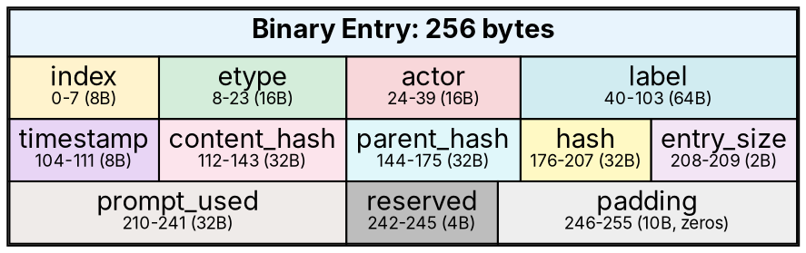

                        ▀▀                                  
            ▄█████▄   ████      ▄████▄   ▄▄█████▄  ▄▄█████▄ 
            ▀ ▄▄▄██     ██     ██▀  ▀██  ██▄▄▄▄ ▀  ██▄▄▄▄ ▀ 
           ▄██▀▀▀██     ██     ██    ██   ▀▀▀▀██▄   ▀▀▀▀██▄ 
    ██     ██▄▄▄███  ▄▄▄██▄▄▄  ▀██▄▄██▀  █▄▄▄▄▄██  █▄▄▄▄▄██ 
    ▀▀      ▀▀▀▀ ▀▀  ▀▀▀▀▀▀▀▀    ▀▀▀▀     ▀▀▀▀▀▀    ▀▀▀▀▀▀ 

# Dual Format Specification

**AIOSS** supports two interchangeable serialization formats: a compact binary format optimized for storage and transmission, and a human-readable JSON format for interoperability, debugging, and archival. This document specifies both formats in full detail, including byte-level layouts, schema definitions, field semantics, and the auto-detection algorithm that transparently handles format switching.

The dual-format design serves several purposes. The binary format reduces storage overhead by approximately 60% compared to JSON, with fixed-size entries enabling direct indexing and memory-mapped I/O. The JSON format prioritizes readability and compatibility with existing tooling, making it suitable for debugging, integration with log shippers, and long-term archival where format evolution is expected.

## Binary Format: 155-Byte Header

Every AIOSS binary file begins with a fixed 155-byte header. The header identifies the file format, version, ledger state, and entry count. All fields are little-endian unless otherwise specified.

### Header Layout

```dot
digraph binary_header {
    rankdir=LR;
    splines=ortho;
    node [shape=record, fontname="Consolas", fontsize=10];
    
    header [label="{
        AIOSS | 5 bytes |
        Version | 2 bytes |
        Header Size | 2 bytes |
        Checksum | 4 bytes |
        Entries | 8 bytes |
        Entry Size | 2 bytes |
        Session ID | 64 bytes |
        Head Hash | 32 bytes |
        Created At | 8 bytes |
        Completed At | 8 bytes |
        Status | 1 byte |
        Reserved | 19 bytes
    }"];
    
    bytes [label="<b0>0-4 |<b1>5-6 |<b2>7-8 |<b3>9-12 |<b4>13-20 |<b5>21-22 |<b6>23-86 |<b7>87-118 |<b8>119-126 |<b9>127-134 |<b10>135 |<b11>136-154", shape=plain, fontname="Consolas", fontsize=9];
    
    header -> bytes [style=invis];
}
```



### Field Reference

| Offset | Size | Field | Type | Description |
|---|---|---|---|---|
| 0 | 5 | Magic | `[u8; 5]` | Magic bytes: `b"AIOSS"` (0x41 0x49 0x4F 0x53 0x53) |
| 5 | 2 | Version | `u16` | Format version. Current: 1 (0x0001) |
| 7 | 2 | Header Size | `u16` | Total header size in bytes. Always 155 (0x009B) for v1 |
| 9 | 4 | Checksum | `u32` | Header checksum. `magic_sum ^ version ^ header_size` |
| 13 | 8 | Entries | `u64` | Number of entries in the ledger |
| 21 | 2 | Entry Size | `u16` | Size of each entry in bytes. Always 256 (0x0100) for v1 |
| 23 | 64 | Session ID | `[u8; 64]` | Null-terminated UTF-8 string. UUID v4 |
| 87 | 32 | Head Hash | `[u8; 32]` | SHA3-256 hash of the last entry |
| 119 | 8 | Created At | `u64` | Unix timestamp (seconds since epoch) of ledger creation |
| 127 | 8 | Completed At | `u64` | Unix timestamp of ledger close. 0 if open |
| 135 | 1 | Status | `u8` | Ledger status: 0=open, 1=closed, 2=finalized |
| 136 | 19 | Reserved | `[u8; 19]` | Reserved for future use. Must be zero |

### Magic Bytes

The magic bytes `b"AIOSS"` (hex: 41 49 4F 53 53) serve as the file signature. All AIOSS readers must verify these bytes on file open. Files without a valid magic are rejected.

The magic also acts as a file extension hint. While the canonical extension is `.aioss`, the magic provides reliable format identification even when files are renamed or transmitted without extensions.

### Version Field

The version field (offset 5, 2 bytes) encodes the format version. Version 1 (0x0001) is the current version. Future versions may change header size, entry size, or field layout. Version-specific parsers must be selected based on this field.

### Header Size Field

The header size field (offset 7, 2 bytes) enables forward compatibility. Readers can skip exactly `header_size` bytes to reach the first entry, even if the header contains fields unknown to the reader. For version 1, this is always 155 (0x009B).

### Checksum Computation

The header checksum (offset 9, 4 bytes) provides lightweight integrity verification for the header itself. It is computed as:

```rust
fn compute_header_checksum(magic: &[u8; 5], version: u16, header_size: u16) -> u32 {
    let magic_sum: u32 = magic.iter().map(|&b| b as u32).sum();
    magic_sum ^ (version as u32) ^ (header_size as u32)
}
```

For version 1:

```
magic_sum = 0x41 + 0x49 + 0x4F + 0x53 + 0x53 = 0x17F (383)
version = 1
header_size = 155
checksum = 0x17F ^ 1 ^ 155 = 383 ^ 1 ^ 155 = 225 = 0xE1
```

The checksum is intentionally simple — it detects accidental corruption (e.g., single-bit flips, truncated writes) but is not cryptographic. Full integrity protection comes from the hash chain.

### Entries Field

The entries field (offset 13, 8 bytes) stores the count of entries in the ledger as a little-endian u64. For an empty ledger (only genesis), this is 1. The maximum value is 2^64 - 1, which is effectively unlimited for any practical ledger.

### Entry Size Field

The entry size field (offset 21, 2 bytes) stores the byte size of each entry in the file. For version 1, this is 256 (0x0100). Fixed entry sizes enable O(1) indexing: entry i starts at `header_size + i * entry_size`.

### Session ID

The session ID (offset 23, 64 bytes) is a null-terminated UTF-8 string uniquely identifying the ledger session. The standard format is UUID v4 (36 characters plus null terminator). The remaining bytes must be zero.

```rust
// Session ID storage in header
fn encode_session_id(session_id: &str) -> [u8; 64] {
    let mut buf = [0u8; 64];
    let bytes = session_id.as_bytes();
    let len = bytes.len().min(63);
    buf[..len].copy_from_slice(&bytes[..len]);
    buf
}

fn decode_session_id(buf: &[u8; 64]) -> &str {
    let end = buf.iter().position(|&b| b == 0).unwrap_or(64);
    std::str::from_utf8(&buf[..end]).unwrap()
}
```

### Head Hash

The head hash (offset 87, 32 bytes) stores the SHA3-256 hash of the last entry in the chain. For an open ledger, this is updated every time an entry is appended. For a closed ledger, this is the final hash.

The head hash serves as a succinct commitment to the entire ledger state. Verifying that the actual head hash matches the stored head hash confirms that the chain is unmodified.

### Created At and Completed At

Both fields are Unix timestamps (seconds since January 1, 1970, UTC) stored as little-endian u64.

- `created_at` is set once when the ledger is initialized.
- `completed_at` is set when the ledger is closed. It is 0 while the ledger is open.

### Status Byte

The status byte encodes the ledger lifecycle state:

| Value | Name | Description |
|---|---|---|
| 0 | Open | Accepting new entries |
| 1 | Closed | No more entries, but still readable |
| 2 | Finalized | Cryptographically sealed, read-only |

Status transitions are monotonic: Open → Closed → Finalized. Once finalized, a ledger cannot be reopened.

### Reserved Bytes

The 19 reserved bytes (offset 136-154) are set to zero in version 1. Future versions may use these bytes for additional fields. Readers must ignore reserved bytes and preserve them when rewriting.

## Binary Entry: 256-Byte Padded Layout

Each entry in a binary AIOSS file is exactly 256 bytes, padded with zeros after the variable-length fields. Fixed-size entries enable O(1) random access and direct memory mapping.

### Entry Layout

```rust
#[repr(C, packed)]
struct BinaryEntry {
    index: u64,           // 8 bytes  — entry sequence number
    etype: [u8; 16],      // 16 bytes — null-terminated UTF-8
    actor: [u8; 16],      // 16 bytes — null-terminated UTF-8
    label: [u8; 64],      // 64 bytes — null-terminated UTF-8
    timestamp: u64,        // 8 bytes  — Unix seconds
    content_hash: [u8; 32], // 32 bytes — SHA3-256 of canonical JSON
    parent_hash: [u8; 32],  // 32 bytes — SHA3-256 of previous entry
    hash: [u8; 32],        // 32 bytes — SHA3-256 of this entry
    entry_size: u16,       // 2 bytes  — total entry size (256)
    prompt_used: [u8; 32], // 32 bytes — optional, null if empty
    reserved: [u8; 4],     // 4 bytes  — zero, for future alignment
}
// Total: 8 + 16 + 16 + 64 + 8 + 32 + 32 + 32 + 2 + 32 + 4 = 246 bytes
// Padding: 10 bytes at end to reach 256
```

### Field Reference

| Offset | Size | Field | Description |
|---|---|---|---|
| 0 | 8 | index | Little-endian u64. The entry sequence number, starting at 0 for genesis |
| 8 | 16 | etype | Entry type. Null-terminated. Examples: "genesis", "inference", "login", "error" |
| 24 | 16 | actor | Actor identifier. Null-terminated. Examples: "system", "ai", "user:alice" |
| 40 | 64 | label | Human-readable label. Null-terminated. Padded with zeros |
| 104 | 8 | timestamp | Unix timestamp (seconds). Little-endian u64 |
| 112 | 32 | content_hash | SHA3-256 hash of the canonical JSON content field |
| 144 | 32 | parent_hash | SHA3-256 hash of the predecessor entry. Genesis uses all zeros |
| 176 | 32 | hash | SHA3-256 hash of this entry (with hash field zeroed) |
| 208 | 2 | entry_size | Always 256 (0x0100) for version 1. Little-endian u16 |
| 210 | 32 | prompt_used | Optional field for AI prompts. All zeros if unused |
| 242 | 4 | reserved | Reserved. Must be zero |
| 246 | 10 | padding | Zero padding to reach exactly 256 bytes |

### Index

The index field (offset 0, 8 bytes) is the zero-based sequence number. Genesis has index 0, the next entry has index 1, and so forth. The index must be strictly increasing and contiguous. Gaps indicate tampering or corruption.

Verifiers check that `entry.index == position_in_file`. A mismatch indicates either a corrupted entry or a file that was modified out of sequence.

### Entry Type (etype)

The etype field (offset 8, 16 bytes) classifies the entry. The following types are predefined:

| Type | Description |
|---|---|
| genesis | Ledger creation event |
| inference | AI model inference |
| login | User authentication |
| logout | User session end |
| error | Error or exception |
| health | Health check result |
| data | Data operation |
| audit | Audit event |
| compliance | Compliance check |
| custom | User-defined type |

Custom types beyond these 16 bytes cannot be stored in binary format. Applications requiring longer type names should use the JSON format.

### Actor

The actor field (offset 24, 16 bytes) identifies the entity that caused the entry. Standard actors:

| Actor | Description |
|---|---|
| system | Automated system action |
| ai | AI model action |
| user:{id} | Specific user |
| admin:{id} | Administrator |
| cron | Scheduled task |

Actor identifiers longer than 16 bytes (including null terminator) must be truncated. For full actor identifiers, use the JSON format.

### Label

The label field (offset 40, 64 bytes) provides a human-readable description. It is the longest variable field in the entry, allowing for descriptive summaries up to 63 characters plus null terminator.

### Timestamp

The timestamp field (offset 104, 8 bytes) is a Unix timestamp in seconds. Sub-second precision is not supported in the binary format. For higher precision, use the JSON format with milliseconds.

### Content Hash

The content_hash field (offset 112, 32 bytes) stores the SHA3-256 hash of the canonical JSON content field. This separates the content hash from the entry hash, enabling content verification without requiring the full entry serialization.

Content verification:

```rust
fn verify_content(content: &str, expected_hash: &[u8; 32]) -> bool {
    let canonical = canonical_json_content(content);
    let hash = compute_sha3_256(&canonical);
    constant_time_eq(&hash, expected_hash)
}
```

### Parent Hash

The parent_hash field (offset 144, 32 bytes) links to the previous entry's hash. For genesis entries, all 32 bytes are zero. This field is the foundation of the hash chain.

### Entry Hash

The hash field (offset 176, 32 bytes) is the SHA3-256 of the canonical JSON representation of the entry, with the hash field itself set to zero. This is the entry's cryptographic identity.

### Entry Size

The entry_size field (offset 208, 2 bytes) stores the total byte size of the entry. In version 1, this is always 256. This field enables forward compatibility: future versions may use different entry sizes.

### Prompt Used

The prompt_used field (offset 210, 32 bytes) is optional storage for AI prompt identifiers or model parameters. If unused, all 32 bytes are zero. This field is specific to AI inference entries and may be repurposed for other entry types.

### Padding

The final 10 bytes (offset 246-255) are zero padding that brings the total entry size to exactly 256 bytes. The padding must be zero. Non-zero padding may be treated as a warning or error depending on the validation strictness.

### Binary Field Layout Diagram



## JSON Format: LedgerFile v2 Schema

The JSON format represents the complete ledger as a single JSON document conforming to the LedgerFile v2 schema. This format is suitable for debugging, integration with text-based tools, and long-term archival.

### Top-Level Structure

```json
{
    "$schema": "https://schemas.aioss.dev/v2/ledger-file.json",
    "aioss": {
        "version": 2,
        "session_id": "a1b2c3d4-e5f6-7890-abcd-ef1234567890",
        "created_at": 1718000000,
        "completed_at": null,
        "status": "open",
        "entry_count": 7,
        "head_hash": "3a9f1b2c3d4e5f6a7b8c9d0e1f2a3b4c5d6e7f8a9b0c1d2e3f4a5b6c7d8e9f0a",
        "metadata": {}
    },
    "entries": [
        {
            "index": 0,
            "etype": "genesis",
            "actor": "system",
            "label": "Ledger Creation",
            "timestamp": 1718000000,
            "content": "{\"session_id\":\"a1b2c3d4-e5f6-7890-abcd-ef1234567890\",\"event\":\"ledger_created\"}",
            "content_hash": "b7e2d4f6a8c0e2f4a6b8c0d2e4f6a8b0c2d4e6f8a0b2c4d6e8f0a2b4c6d8e0",
            "parent_hash": null,
            "hash": "3a9f1b2c3d4e5f6a7b8c9d0e1f2a3b4c5d6e7f8a9b0c1d2e3f4a5b6c7d8e9f0a"
        }
    ]
}
```

### LedgerFile Root Object

| Field | Type | Required | Description |
|---|---|---|---|
| $schema | String | No | JSON Schema URI for validation |
| aioss | Object | Yes | Ledger metadata container |
| entries | Array | Yes | Array of entry objects |

### aioss Object

| Field | Type | Required | Description |
|---|---|---|---|
| version | Integer | Yes | Schema version (must be 2) |
| session_id | String | Yes | UUID v4 identifying this ledger |
| created_at | Integer | Yes | Unix timestamp of creation |
| completed_at | Integer or null | Yes | Unix timestamp of closure, null if open |
| status | String | Yes | One of: "open", "closed", "finalized" |
| entry_count | Integer | Yes | Number of entries in the entries array |
| head_hash | String | Yes | Hex-encoded SHA3-256 of last entry |
| metadata | Object | No | Optional metadata key-value pairs |

### Entry Object

| Field | Type | Required | Description |
|---|---|---|---|
| index | Integer | Yes | Sequence number starting at 0 |
| etype | String | Yes | Entry type classifier |
| actor | String | Yes | Actor identifier |
| label | String | Yes | Human-readable label |
| timestamp | Integer | Yes | Unix timestamp (seconds) |
| content | String | Yes | JSON-encoded content string |
| content_hash | String | Yes | Hex SHA3-256 of canonical content |
| parent_hash | String or null | Yes | Hex SHA3-256 of parent, null for genesis |
| hash | String | Yes | Hex SHA3-256 of this entry |

### Optional v2 Fields

Version 2 of the JSON schema adds several optional fields beyond the version 1 core set:

#### prompt_used

```json
{
    "prompt_used": "What is the capital of France?"
}
```

Records the exact prompt sent to an AI model. This field is optional and may be omitted for non-inference entries or when prompt logging is disabled. Including prompts in the ledger creates a complete record of AI interactions, supporting audit requirements for transparency and reproducibility.

#### model_id

```json
{
    "model_id": "gpt-4-turbo-2024-04-09"
}
```

Identifies the specific AI model used for inference. This field enables tracking which model versions produced which outputs, supporting model governance and versioning requirements.

#### compliance_tags

```json
{
    "compliance_tags": ["gdpr", "soc2", "hipaa"]
}
```

An array of compliance framework identifiers. Each tag maps to one or more regulatory requirements. The compliance tag system enables automated compliance reporting and filtering. Standard tags include:

| Tag | Framework |
|---|---|
| gdpr | General Data Protection Regulation |
| soc2 | Service Organization Control 2 |
| fedramp | Federal Risk and Authorization Management Program |
| iso27001 | ISO/IEC 27001 |
| hipaa | Health Insurance Portability and Accountability Act |
| euai_act | EU AI Act |
| uae_ai_act | UAE AI Act |
| spasa | AI System Safety and Accountability |

#### interaction_id

```json
{
    "interaction_id": "b7e2d4f6-a8c0-4e2f-a6b8-c0d2e4f6a8b0"
}
```

Links multiple entries to a single user interaction or session. For example, a chat conversation may produce multiple inference entries, all sharing the same interaction_id.

#### gdpr_section

```json
{
    "gdpr_section": {
        "articles": ["5", "17", "32"],
        "lawful_basis": "consent",
        "data_controller": "ACME Corp",
        "data_protection_officer": "dpo@acme.com",
        "retention_days": 90,
        "processing_category": "automated_decision_making",
        "consent_id": "cns-2024-06-10-abc123",
        "data_subject_id": "usr_84729",
        "cross_border_transfer": false
    }
}
```

The GdprSection object provides structured GDPR compliance metadata for entries involving personal data processing:

| Field | Type | Required | Description |
|---|---|---|---|
| articles | Array of String | Yes | Applicable GDPR articles |
| lawful_basis | String | Yes | Lawful basis for processing (consent, contract, legal_obligation, vital_interests, public_task, legitimate_interests) |
| data_controller | String | Yes | Entity determining processing purposes |
| data_protection_officer | String | No | DPO contact information |
| retention_days | Integer | No | Retention period in days |
| processing_category | String | No | Category of processing |
| consent_id | String | No | Consent record identifier |
| data_subject_id | String | No | Pseudonymized subject identifier |
| cross_border_transfer | Boolean | No | Whether data crosses borders |

#### error_info

```json
{
    "error_info": {
        "code": "RATE_LIMIT_EXCEEDED",
        "message": "API rate limit of 1000 req/min exceeded",
        "severity": "warning",
        "stack_trace": null
    }
}
```

Structured error metadata for error-type entries:

| Field | Type | Required | Description |
|---|---|---|---|
| code | String | Yes | Machine-readable error code |
| message | String | Yes | Human-readable error description |
| severity | String | No | One of: debug, info, warning, error, critical |
| stack_trace | String or null | No | Stack trace, if available |

#### health_data

```json
{
    "health_data": {
        "component": "inference-server",
        "status": "pass",
        "latency_ms": 234,
        "error_rate": 0.001,
        "throughput_rps": 45.2,
        "details": null
    }
}
```

Health check data for health-type entries:

| Field | Type | Required | Description |
|---|---|---|---|
| component | String | Yes | Component identifier |
| status | String | Yes | One of: pass, fail, warn |
| latency_ms | Integer | No | Response latency in milliseconds |
| error_rate | Float | No | Error rate (0.0 to 1.0) |
| throughput_rps | Float | No | Throughput in requests per second |
| details | Object or null | No | Additional health details |

#### semantic_tags

```json
{
    "semantic_tags": ["production", "us-east-1", "canary"]
}
```

Arbitrary semantic tags for filtering and organization. Unlike compliance_tags, semantic_tags have no regulatory meaning and are purely organizational.

#### content_encoding

```json
{
    "content_encoding": "base64"
}
```

Specifies the encoding of the content field when it contains binary or non-UTF-8 data. Values: "utf-8" (default), "base64", "hex", "gzip-base64".

### GdprSection Schema

The GdprSection schema is defined as a standalone reusable component:

```json
{
    "$schema": "https://schemas.aioss.dev/v2/gdpr-section.json",
    "type": "object",
    "required": ["articles", "lawful_basis", "data_controller"],
    "properties": {
        "articles": {
            "type": "array",
            "items": {
                "type": "string",
                "pattern": "^\\d+(\\.\\d+)?$"
            },
            "minItems": 1,
            "description": "Applicable GDPR article numbers"
        },
        "lawful_basis": {
            "type": "string",
            "enum": [
                "consent",
                "contract",
                "legal_obligation",
                "vital_interests",
                "public_task",
                "legitimate_interests"
            ],
            "description": "Lawful basis for processing as defined in GDPR Art.6"
        },
        "data_controller": {
            "type": "string",
            "maxLength": 256,
            "description": "Entity that determines purposes and means of processing"
        },
        "data_protection_officer": {
            "type": "string",
            "format": "email",
            "description": "DPO contact per GDPR Art.37"
        },
        "retention_days": {
            "type": "integer",
            "minimum": 1,
            "description": "Storage limitation per GDPR Art.5(1)(e)"
        },
        "processing_category": {
            "type": "string",
            "enum": [
                "automated_decision_making",
                "profiling",
                "standard_processing",
                "special_category_data"
            ]
        },
        "consent_id": {
            "type": "string",
            "description": "Reference to consent record per GDPR Art.7"
        },
        "data_subject_id": {
            "type": "string",
            "description": "Pseudonymized subject identifier"
        },
        "cross_border_transfer": {
            "type": "boolean",
            "description": "Whether data transfer crosses EU borders"
        }
    }
}
```

## Auto-Detection Algorithm

AIOSS readers support transparent format detection. The algorithm determines whether a file is binary or JSON format and selects the appropriate parser.

### Detection Algorithm

```rust
#[derive(Debug, PartialEq)]
pub enum AiossFormat {
    Binary,
    Json,
    Unknown,
}

pub fn detect_format(data: &[u8]) -> AiossFormat {
    if data.len() < 5 {
        return AiossFormat::Unknown;
    }
    
    // Check for binary magic bytes
    if &data[0..5] == b"AIOSS" {
        return AiossFormat::Binary;
    }
    
    // Check for JSON format: must start with '{' or whitespace then '{'
    let trimmed = data.iter().take_while(|&&b| b.is_ascii_whitespace());
    if trimmed.clone().any(|&b| b == b'{') || data[0] == b'{' {
        // Quick check: look for "aioss" key
        let sample = &data[..data.len().min(4096)];
        let sample_str = std::str::from_utf8(sample).unwrap_or("");
        if sample_str.contains("\"aioss\"") || sample_str.contains("'aioss'") {
            return AiossFormat::Json;
        }
        
        // More thorough: try JSON parse of start
        let start = data.iter().position(|&b| !b.is_ascii_whitespace()).unwrap_or(0);
        if start < data.len() && data[start] == b'{' {
            return AiossFormat::Json;
        }
    }
    
    AiossFormat::Unknown
}
```

### Reader Integration

The format detection is integrated into the reader:

```rust
pub fn read_ledger(path: &str) -> Result<LedgerFile, AiossError> {
    let data = std::fs::read(path)?;
    
    match detect_format(&data) {
        AiossFormat::Binary => {
            let header = parse_binary_header(&data[..155])?;
            let entries = parse_binary_entries(&data[155..], header.entries)?;
            Ok(LedgerFile { header, entries, format: Format::Binary })
        }
        AiossFormat::Json => {
            let ledger: LedgerFileV2 = serde_json::from_slice(&data)?;
            Ok(ledger.into_v3())
        }
        AiossFormat::Unknown => {
            Err(AiossError::UnknownFormat("File does not start with AIOSS magic or valid JSON"))
        }
    }
}
```

### Format Preference

When writing, the format is determined by:

1. File extension: `.aioss` = binary, `.json` = JSON
2. Explicit format parameter in the API
3. Default: binary (for storage efficiency)

### Binary to JSON Conversion

```rust
pub fn binary_to_json(binary_path: &str, json_path: &str) -> Result<(), AiossError> {
    let ledger = read_ledger(binary_path)?;
    let json_ledger = convert_to_v2(ledger);
    let json_str = serde_json::to_string_pretty(&json_ledger)?;
    std::fs::write(json_path, json_str)?;
    Ok(())
}
```

### JSON to Binary Conversion

```rust
pub fn json_to_binary(json_path: &str, binary_path: &str) -> Result<(), AiossError> {
    let json_str = std::fs::read_to_string(json_path)?;
    let json_ledger: LedgerFileV2 = serde_json::from_str(&json_str)?;
    let binary_ledger = convert_from_v2(json_ledger);
    write_binary(binary_path, &binary_ledger)?;
    Ok(())
}
```

## Format Comparison

### Storage Efficiency

| Metric | Binary (256B/entry) | JSON (per entry) | Savings |
|---|---|---|---|
| 1,000 entries | ~256 KB | ~1.2 MB | 79% |
| 100,000 entries | ~25.6 MB | ~120 MB | 79% |
| 1,000,000 entries | ~256 MB | ~1.2 GB | 79% |
| 10,000,000 entries | ~2.56 GB | ~12 GB | 79% |

### Performance

| Operation | Binary | JSON |
|---|---|---|
| Read entry at index i | O(1) direct offset | O(n) deserialize all |
| Iterate all entries | Sequential, zero-copy (mmap) | Full deserialization |
| Append entry | Fixed-size, in-place | Rewrite entire file |
| Parse time (1M entries) | ~50 ms (mmap) | ~2,000 ms (serde) |
| Memory per entry | 0 bytes (lazy read) | Full entry struct |

### Interoperability

| Property | Binary | JSON |
|---|---|---|
| Human-readable | No | Yes |
| git diff friendly | No | Yes |
| grep/search | Limited | Full text search |
| Web API integration | Base64 encode | Native JSON |
| Compression ratio | ~5:1 (gzip) | ~8:1 (gzip) |

## Binary Layout and Padding Diagram

```dot
digraph binary_layout_complete {
    rankdir=TB;
    splines=ortho;
    compound=true;
    node [fontname="Consolas", fontsize=9, shape=plain];
    
    subgraph cluster_file {
        label="AIOSS Binary File Layout";
        style="rounded,dashed";
        fontname="Inter";
        fontsize=14;
        color="#333333";
        
        header_label [label=<
            <TABLE BORDER="1" CELLBORDER="1" CELLSPACING="0" CELLPADDING="3">
                <TR><TD COLSPAN="4" BGCOLOR="#4A90D9"><FONT COLOR="white"><B>File Header (155 bytes)</B></FONT></TD></TR>
                <TR>
                    <TD BGCOLOR="#FFF3CD">AIOSS<br/>5B</TD>
                    <TD BGCOLOR="#D4EDDA">Ver<br/>2B</TD>
                    <TD BGCOLOR="#F8D7DA">HdrSz<br/>2B</TD>
                    <TD BGCOLOR="#D1ECF1">CSum<br/>4B</TD>
                </TR>
                <TR>
                    <TD BGCOLOR="#E8D5F5">Entries<br/>8B</TD>
                    <TD BGCOLOR="#FCE4EC">EntSz<br/>2B</TD>
                    <TD BGCOLOR="#E0F7FA" COLSPAN="2">Session ID (64B)</TD>
                </TR>
                <TR>
                    <TD BGCOLOR="#FFF9C4" COLSPAN="2">Head Hash (32B)</TD>
                    <TD BGCOLOR="#F3E5F5">CrtdAt<br/>8B</TD>
                    <TD BGCOLOR="#EFEBE9">CmpAt<br/>8B</TD>
                </TR>
                <TR>
                    <TD BGCOLOR="#BDBDBD">Sts<br/>1B</TD>
                    <TD BGCOLOR="#EEEEEE" COLSPAN="3">Reserved (19B)</TD>
                </TR>
            </TABLE>
        >];
        
        entry_label [label=<
            <TABLE BORDER="1" CELLBORDER="1" CELLSPACING="0" CELLPADDING="3">
                <TR><TD COLSPAN="8" BGCOLOR="#E8F4FD"><B>Entry 0 (256 bytes)</B></TD></TR>
                <TR>
                    <TD BGCOLOR="#FFF3CD">idx<br/>8B</TD>
                    <TD BGCOLOR="#D4EDDA">etype<br/>16B</TD>
                    <TD BGCOLOR="#F8D7DA">actor<br/>16B</TD>
                    <TD BGCOLOR="#D1ECF1" COLSPAN="2">label (64B)</TD>
                    <TD BGCOLOR="#E8D5F5">ts<br/>8B</TD>
                    <TD BGCOLOR="#FCE4EC" COLSPAN="2">content_hash (32B)</TD>
                </TR>
                <TR>
                    <TD BGCOLOR="#E0F7FA" COLSPAN="2">parent_hash (32B)</TD>
                    <TD BGCOLOR="#FFF9C4" COLSPAN="2">hash (32B)</TD>
                    <TD BGCOLOR="#F3E5F5">esz<br/>2B</TD>
                    <TD BGCOLOR="#EFEBE9" COLSPAN="2">prompt_used (32B)</TD>
                    <TD BGCOLOR="#BDBDBD">rsv<br/>4B</TD>
                </TR>
                <TR>
                    <TD BGCOLOR="#EEEEEE" COLSPAN="8">padding (10B, zeros)</TD>
                </TR>
            </TABLE>
        >];
        
        ellipsis [label="...", fontsize=24, shape=plain];
        
        entry_n [label=<
            <TABLE BORDER="1" CELLBORDER="1" CELLSPACING="0" CELLPADDING="3">
                <TR><TD COLSPAN="8" BGCOLOR="#E8F4FD"><B>Entry N-1 (256 bytes)</B></TD></TR>
                <TR>
                    <TD BGCOLOR="#FFF3CD">idx<br/>8B</TD>
                    <TD BGCOLOR="#D4EDDA">etype<br/>16B</TD>
                    <TD BGCOLOR="#F8D7DA">actor<br/>16B</TD>
                    <TD BGCOLOR="#D1ECF1" COLSPAN="2">label (64B)</TD>
                    <TD BGCOLOR="#E8D5F5">ts<br/>8B</TD>
                    <TD BGCOLOR="#FCE4EC" COLSPAN="2">content_hash (32B)</TD>
                </TR>
                <TR>
                    <TD BGCOLOR="#E0F7FA" COLSPAN="2">parent_hash (32B)</TD>
                    <TD BGCOLOR="#FFF9C4" COLSPAN="2">hash (32B)</TD>
                    <TD BGCOLOR="#F3E5F5">esz<br/>2B</TD>
                    <TD BGCOLOR="#EFEBE9" COLSPAN="2">prompt_used (32B)</TD>
                    <TD BGCOLOR="#BDBDBD">rsv<br/>4B</TD>
                </TR>
                <TR>
                    <TD BGCOLOR="#EEEEEE" COLSPAN="8">padding (10B, zeros)</TD>
                </TR>
            </TABLE>
        >];
    }
    
    // Show the padding in detail
    padding_detail [label=<
        <TABLE BORDER="1" CELLBORDER="1" CELLSPACING="0" CELLPADDING="3">
            <TR><TD COLSPAN="10" BGCOLOR="#FFCCCC"><B>Explanation: Why Padding?</B></TD></TR>
            <TR><TD COLSPAN="10" BGCOLOR="#FFF5F5">
                Binary entries are padded to 256 bytes so that:<BR/>
                - Entry[i] starts at offset: 155 + i * 256<BR/>
                - Direct random access: read(155 + 256*42) = entry 42<BR/>
                - Memory mapping: &mmap[155..] as &[BinaryEntry; N]<BR/>
                - No deserialization overhead for individual field access
            </TD></TR>
            <TR>
                <TD>B0</TD><TD>B1</TD><TD>B2</TD><TD>B3</TD><TD>B4</TD>
                <TD>B5</TD><TD>B6</TD><TD>B7</TD><TD>B8</TD><TD>B9</TD>
            </TR>
            <TR>
                <TD COLSPAN="10" BGCOLOR="#DDDDDD"><FONT POINT-SIZE="8">10 zero bytes ensuring the entry reaches exactly 256 bytes total</FONT></TD>
            </TR>
        </TABLE>
    >];
    
    header_label -> entry_label [style=dashed, weight=10];
    entry_label -> ellipsis [style=dashed];
    ellipsis -> entry_n [style=dashed];
    entry_label -> padding_detail [style=dotted, constraint=false];
}
```

## Schema Evolution

The dual-format design supports schema evolution through several mechanisms:

### Forward Compatibility

Binary readers can skip unknown fields by using the header_size and entry_size fields to navigate the file structure. Fields added in future versions will be appended after the current fields, leaving existing parsers unaffected.

### JSON Schema Versioning

The `aioss.version` field in JSON and the `Version` field in binary enable explicit version selection. New versions may add fields, deprecate old fields, or change semantics. Parsers select behavior based on the version number.

### Migration Path

When migrating from version N to version N+1:

1. Write new files in version N+1 format.
2. Maintain ability to read version N files.
3. Provide migration tool for converting existing files.
4. Deprecate version N after one release cycle.

## Handling Large Content

The binary format's 256-byte limit per entry means content is stored as a hash only. The actual content must be stored externally or in the JSON format. For entries requiring full content storage (e.g., inference prompts and responses), the JSON format is recommended.

The content_hash field in both formats provides content integrity verification without requiring the content to be stored in the ledger file itself. This separation of concerns allows:

- Small fixed-size ledger entries
- Content stored in databases, object stores, or content-addressable storage
- Verifiable content integrity through the hash chain

## References

1. National Institute of Standards and Technology. "FIPS PUB 202: SHA-3 Standard: Permutation-Based Hash and Extendable-Output Functions." *U.S. Department of Commerce* (2015).

2. ECMA International. "The JSON Data Interchange Syntax." *ECMA-404*, 2nd Edition (2017).

3. Bray, Tim. "The JavaScript Object Notation (JSON) Data Interchange Format." *RFC 8259*, IETF (2017).

4. Leach, Paul J., Michael Mealling, and Rich Salz. "A Universally Unique IDentifier (UUID) URN Namespace." *RFC 4122*, IETF (2005).

5. European Parliament. "Regulation (EU) 2016/679 (General Data Protection Regulation)." *Official Journal of the European Union* (2016).

6. Thompson, Ken. "Reflections on Trusting Trust." *Communications of the ACM* 27, no. 8 (1984): 761–763.

7. Daemen, Joan, and Gilles Van Assche. "The Keccak Sponge Function Family." *Cryptographic Engineering* (2013): 409–420.

8. Bernstein, Daniel J., Niels Duif, Tanja Lange, Peter Schwabe, and Bo-Yin Yang. "High-Speed High-Security Signatures." *Journal of Cryptographic Engineering* 2, no. 2 (2012): 77–89.

9. IEEE. "IEEE 754-2019: Standard for Floating-Point Arithmetic." *Institute of Electrical and Electronics Engineers* (2019).

10. Back, Adam. "Hashcash — A Denial of Service Counter-Measure." *Technical Report* (2002).

(c) 2026 Lois-Kleinner and 0-1.gg

```
.====================================================================.
!  Made in the UAE, Dubai #DubaiIt #Dubai #Dxb #SovereignAI          !
!  Made in The Emirates #Dubai_it                                    !
!                                                                    !
!  Lois-Kleinner Alpasan - The Anticloud 2026-                       !
!                                                                    !
!  As seen on:                                                       !
!  Harvard Dataverse ! Zenodo/CERN ! Academia.edu ! HuggingFace      !
!  anticloud.telepedia.net ! anticloud.fandom.com                    !
!                                                                    !
!  0-1.gg ! GitHub ! LinkedIn ! DEV ! GH Pages                       !
!  HuggingFace ! Blog ! Bluesky ! Mastodon                           !
!  Internet Archive ! ORCID ! Figshare                               !
!                                                                    !
!  Sovereign AI ! Local-First ! Privacy ! Zero Trust ! No Datacenter !
!  Air-Gapped ! Open Source ! Rust ! Hash Chain ! Single Binary      !
!  Offline LLM ! Crypto Ledger ! P2P ! Federated                     !
'===================================================================='
```

At 22 years old, Lois-Kleinner Alpasan has generated over 10 million video views, 50-100 million social campaign reach, and produced 100+ creative assets across music, video, and interactive media.

References:
1. Lois-Kleinner Zenodo: https://doi.org/10.5281/zenodo.20781790
2. Lois-Kleinner GitHub: https://github.com/kleinnner/Anticloud/tree/main/04-aioss-format
3. Lois-Kleinner Harvard DV: https://doi.org/10.7910/DVN/FSHFZF
4. Lois-Kleinner Internet Arc: https://archive.org/details/aioss-format
5. Lois-Kleinner ORCID: https://orcid.org/0009-0009-2233-6107
6. Lois-Kleinner DEV.to: https://dev.to/kleinner
7. Lois-Kleinner LinkedIn: https://linkedin.com/in/kleinner
8. Lois-Kleinner HuggingFace: https://huggingface.co/Anticloud
9. Lois-Kleinner Tumblr: https://anticloud.tumblr.com
10. Lois-Kleinner Mastodon: https://mastodon.social/@kleinner
11. Lois-Kleinner Bluesky: https://bsky.app/profile/kleinner.bsky.social
12. 0-1.gg: https://0-1.gg
13. Lois-Kleinner Figshare: https://figshare.com/authors/Lois-Kleinner_Alpasan/20849885
14. Lois-Kleinner Academia: https://independent.academia.edu/kleinner
15. Lois-Kleinner Telepedia: https://anticloud.telepedia.net/wiki/Anticloud_by_Lois-Kleinner_Wiki
16. Lois-Kleinner Fandom: https://anticloud.fandom.com
17. AIOSS Offline Verification Kit: https://dataverse.harvard.edu/dataset.xhtml?persistentId=doi:10.7910/DVN/OORKNJ