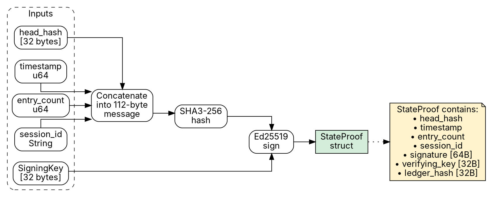
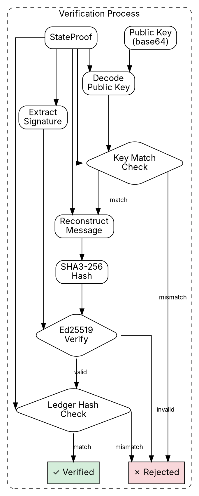

                        ▀▀                                  
            ▄█████▄   ████      ▄████▄   ▄▄█████▄  ▄▄█████▄ 
            ▀ ▄▄▄██     ██     ██▀  ▀██  ██▄▄▄▄ ▀  ██▄▄▄▄ ▀ 
           ▄██▀▀▀██     ██     ██    ██   ▀▀▀▀██▄   ▀▀▀▀██▄ 
    ██     ██▄▄▄███  ▄▄▄██▄▄▄  ▀██▄▄██▀  █▄▄▄▄▄██  █▄▄▄▄▄██ 
    ▀▀      ▀▀▀▀ ▀▀  ▀▀▀▀▀▀▀▀    ▀▀▀▀     ▀▀▀▀▀▀    ▀▀▀▀▀▀ 

# Ed25519 State Proofs

**AIOSS** uses Ed25519 digital signatures to produce cryptographic state proofs. A state proof is a signed attestation of a ledger's head state, enabling third parties to verify ledger integrity without access to the full ledger file. This document specifies the Ed25519 implementation, the signing and verification algorithms, the StateProof data structure, and the public key infrastructure considerations for production deployments.

State proofs solve a critical problem in distributed audit systems: how can a party that does not trust the ledger maintainer verify that a ledger has not been tampered with? The hash chain alone proves internal consistency, but it does not prove that a particular head hash is the authentic one produced by the legitimate ledger process. By signing the head hash with a trusted signing key, the ledger maintainer provides a cryptographic attestation that any third party can verify.

## Ed25519 Signature Scheme

Ed25519 is the Edwards-curve Digital Signature Algorithm (EdDSA) using the twisted Edwards curve birationally equivalent to Curve25519. It is specified in RFC 8032 and is the recommended signature scheme for the AIOSS project.

### Curve Parameters

Ed25519 operates on the twisted Edwards curve:

```
-x^2 + y^2 = 1 + d*x^2*y^2
```

where d = -121665/121666 over the prime field GF(p) with:

```
p = 2^255 - 19
```

The base point B has coordinates (x, y) where:

```
y = 4/5 mod p
x = 15112221349535807926365442451056983378982865732967155957034585559642793402489
```

The subgroup order is:

```
l = 2^252 + 27742317777372353535851937790883648493
```

This is a prime number with approximately 252 bits, providing approximately 126 bits of security against discrete logarithm attacks.

### Security Properties

| Property | Ed25519 | RSA-3072 | ECDSA P-256 |
|---|---|---|---|
| Public key size | 32 bytes | 256 bytes | 64 bytes |
| Signature size | 64 bytes | 256 bytes | 64 bytes |
| Security level | ~126 bits | ~128 bits | ~128 bits |
| Signing speed | ~50 µs | ~1,000 µs | ~100 µs |
| Verification speed | ~100 µs | ~50 µs | ~200 µs |
| Deterministic | Yes | No | No |
| Side-channel resistant | Yes | Partial | Partial |

Ed25519 is particularly well-suited for AIOSS because:

1. **Small keys and signatures** (32 and 64 bytes respectively) fit naturally within the binary format's fixed-size fields.
2. **Deterministic signatures** eliminate the need for a secure random number generator during signing, reducing implementation complexity and preventing the catastrophic failure of nonce reuse.
3. **Batch verification** enables verifying multiple state proofs simultaneously, which is critical for cross-node replication scenarios.
4. **Side-channel resistance** through constant-time implementation protects signing keys in production environments.

### RFC 8032 Compliance

The AIOSS implementation conforms to RFC 8032. Key aspects:

- PureEdDSA mode is used (not HashEdDSA). The message is hashed using SHA3-256 before signing, which is equivalent to the Ed25519ph variant but using AIOSS's standard hash function.
- Signatures are encoded as 64-byte strings: 32 bytes for the R point (x-coordinate, little-endian), 32 bytes for the scalar S (little-endian).
- Public keys are encoded as 32 bytes (y-coordinate with sign bit, little-endian).
- The deterministic nonce generation uses SHA3-512 (SHA3 series, not SHA-512) to maintain consistency with the AIOSS cryptographic suite.

### Implementation in Rust

The AIOSS codebase uses the `ed25519-dalek` crate version 2.1.1 with the `batch` and `pem` features:

```rust
use ed25519_dalek::{
    Signature, Signer, SigningKey, Verifier, VerifyingKey,
    SignatureError,
};
use sha3::Sha3_512;
use rand::rngs::OsRng;

pub type AiossSigningKey = SigningKey;
pub type AiossVerifyingKey = VerifyingKey;
pub type AiossSignature = Signature;
```

## Key Generation with OsRng

AIOSS generates Ed25519 key pairs using the operating system's cryptographically secure random number generator via `OsRng`. This is a deliberate choice over `ThreadRng` for the following reasons:

1. **Entropy Source:** `OsRng` draws entropy directly from the operating system's CSPRNG (e.g., `/dev/urandom` on Linux, `CryptGenRandom` on Windows). `ThreadRng` is seeded from `OsRng` but may use a weaker PRNG for performance.

2. **Seed Quality:** Key generation is a one-time operation. The performance difference between `OsRng` and `ThreadRng` is negligible for this use case, while the entropy quality guarantee is critical.

3. **Determinism Not Desired:** Unlike signing (which benefits from deterministic nonces), key generation must be non-deterministic. `OsRng` provides the strongest non-determinism guarantee.

### Key Generation Code

```rust
use rand::rngs::OsRng;
use ed25519_dalek::SigningKey;

pub fn generate_keypair() -> (SigningKey, VerifyingKey) {
    let mut csprng = OsRng;
    let signing_key = SigningKey::generate(&mut csprng);
    let verifying_key = signing_key.verifying_key();
    (signing_key, verifying_key)
}
```

### Key Serialization

```rust
pub fn serialize_public_key(key: &VerifyingKey) -> [u8; 32] {
    key.to_bytes()
}

pub fn deserialize_public_key(bytes: &[u8; 32]) -> Result<VerifyingKey, SignatureError> {
    VerifyingKey::from_bytes(bytes)
}

pub fn serialize_private_key(key: &SigningKey) -> [u8; 32] {
    key.to_bytes()
}

pub fn deserialize_private_key(bytes: &[u8; 32]) -> SigningKey {
    SigningKey::from_bytes(bytes)
}

pub fn public_key_to_base64(key: &VerifyingKey) -> String {
    use base64::{Engine as _, engine::general_purpose::STANDARD as BASE64};
    BASE64.encode(key.to_bytes())
}

pub fn public_key_from_base64(encoded: &str) -> Result<VerifyingKey, AiossError> {
    use base64::{Engine as _, engine::general_purpose::STANDARD as BASE64};
    let bytes: [u8; 32] = BASE64.decode(encoded)?
        .try_into()
        .map_err(|_| AiossError::InvalidKeyLength)?;
    Ok(VerifyingKey::from_bytes(&bytes)?)
}
```

### Key Storage

Private keys must be stored securely. AIOSS does not mandate a specific key storage mechanism but recommends:

- **Development:** PEM-encoded files with restricted permissions (0600).
- **Production:** Hardware Security Module (HSM) or Key Management Service (KMS).
- **Cloud:** AWS KMS, Azure Key Vault, or GCP Cloud KMS with access logging.

Example PEM serialization:

```rust
pub fn save_keypair(
    signing_key: &SigningKey,
    public_key_path: &str,
    private_key_path: &str,
) -> Result<(), AiossError> {
    use pem::encode;
    use pem::Pem;
    
    // Save public key
    let pub_pem = Pem::new("ED25519 PUBLIC KEY", signing_key.verifying_key().to_bytes().to_vec());
    std::fs::write(public_key_path, encode(&pub_pem))?;
    
    // Save private key
    let priv_pem = Pem::new("ED25519 PRIVATE KEY", signing_key.to_bytes().to_vec());
    std::fs::write(private_key_path, encode(&priv_pem))?;
    
    // Set restrictive permissions
    #[cfg(unix)]
    {
        use std::os::unix::fs::PermissionsExt;
        std::fs::set_permissions(private_key_path, std::fs::Permissions::from_mode(0o600))?;
    }
    
    Ok(())
}
```

## sign_state_proof()

The `sign_state_proof` function creates a cryptographic attestation of the ledger's head state. It signs a concatenation of four fields: `head_hash | timestamp | entry_count | session_id`.

### Signed Message Construction

```rust
fn construct_signing_message(
    head_hash: &[u8; 32],
    timestamp: u64,
    entry_count: u64,
    session_id: &str,
) -> Vec<u8> {
    let mut message = Vec::with_capacity(32 + 8 + 8 + 64);
    message.extend_from_slice(head_hash);
    message.extend_from_slice(&timestamp.to_le_bytes());
    message.extend_from_slice(&entry_count.to_le_bytes());
    
    let session_bytes = session_id.as_bytes();
    let mut session_padded = [0u8; 64];
    let len = session_bytes.len().min(63);
    session_padded[..len].copy_from_slice(&session_bytes[..len]);
    message.extend_from_slice(&session_padded);
    
    message
}
```

The message format is:

| Field | Size | Description |
|---|---|---|
| head_hash | 32 bytes | SHA3-256 of the last ledger entry |
| timestamp | 8 bytes | Unix timestamp at signing time, little-endian |
| entry_count | 8 bytes | Total number of entries in the ledger, little-endian |
| session_id | 64 bytes | Null-padded session identifier |

Total message size: 112 bytes.

### Signing Function

```rust
pub fn sign_state_proof(
    signing_key: &SigningKey,
    head_hash: &[u8; 32],
    timestamp: u64,
    entry_count: u64,
    session_id: &str,
) -> StateProof {
    let message = construct_signing_message(head_hash, timestamp, entry_count, session_id);
    
    // Hash the message with SHA3-256 before signing
    let message_hash = compute_sha3_256(&message);
    
    // Sign the hash
    let signature = signing_key.sign(&message_hash);
    
    // Also compute the ledger hash for the head entry
    let ledger_hash = compute_entry_head_hash(head_hash, timestamp, entry_count, session_id);
    
    StateProof {
        head_hash: *head_hash,
        timestamp,
        entry_count,
        session_id: session_id.to_string(),
        signature: signature.to_bytes(),
        verifying_key: signing_key.verifying_key().to_bytes(),
        ledger_hash,
    }
}
```

### Signing Flow



### Ledger Hash Computation

The `ledger_hash` field in the StateProof provides an additional integrity check. It is computed as:

```rust
fn compute_entry_head_hash(
    head_hash: &[u8; 32],
    timestamp: u64,
    entry_count: u64,
    session_id: &str,
) -> [u8; 32] {
    let mut hasher = Sha3_256::new();
    hasher.update(head_hash);
    hasher.update(&timestamp.to_le_bytes());
    hasher.update(&entry_count.to_le_bytes());
    hasher.update(session_id.as_bytes());
    let result = hasher.finalize();
    let mut hash = [0u8; 32];
    hash.copy_from_slice(&result);
    hash
}
```

This hash binds the entire state proof to a single 32-byte value, enabling efficient cross-referencing and indexing.

## verify_state_proof()

The `verify_state_proof` function validates a state proof against a base64-encoded public key. It recomputes the signed message and verifies the Ed25519 signature.

### Verification Function

```rust
pub fn verify_state_proof(
    proof: &StateProof,
    public_key_base64: &str,
) -> Result<(), AiossError> {
    // Step 1: Decode the public key
    let verifying_key = public_key_from_base64(public_key_base64)?;
    
    // Step 2: Verify that the provided verifying key matches
    if proof.verifying_key != verifying_key.to_bytes() {
        return Err(AiossError::KeyMismatch);
    }
    
    // Step 3: Reconstruct the signing message
    let message = construct_signing_message(
        &proof.head_hash,
        proof.timestamp,
        proof.entry_count,
        &proof.session_id,
    );
    
    // Step 4: Hash the message
    let message_hash = compute_sha3_256(&message);
    
    // Step 5: Reconstruct the signature
    let signature = Signature::from_slice(&proof.signature)
        .map_err(|_| AiossError::InvalidSignature)?;
    
    // Step 6: Verify the signature
    verifying_key
        .verify(&message_hash, &signature)
        .map_err(|_| AiossError::SignatureVerificationFailed)?;
    
    // Step 7: Verify the ledger hash
    let computed_ledger_hash = compute_entry_head_hash(
        &proof.head_hash,
        proof.timestamp,
        proof.entry_count,
        &proof.session_id,
    );
    
    if computed_ledger_hash != proof.ledger_hash {
        return Err(AiossError::LedgerHashMismatch);
    }
    
    Ok(())
}
```

### Verification Flow



### Verification with Cached Public Key

For repeated verifications, the public key can be cached:

```rust
pub struct StateProofVerifier {
    verifying_key: VerifyingKey,
}

impl StateProofVerifier {
    pub fn new(public_key_base64: &str) -> Result<Self, AiossError> {
        let verifying_key = public_key_from_base64(public_key_base64)?;
        Ok(Self { verifying_key })
    }
    
    pub fn verify(&self, proof: &StateProof) -> Result<(), AiossError> {
        // Verify that the proof's embedded key matches our cached key
        if proof.verifying_key != self.verifying_key.to_bytes() {
            return Err(AiossError::KeyMismatch);
        }
        
        let message = construct_signing_message(
            &proof.head_hash,
            proof.timestamp,
            proof.entry_count,
            &proof.session_id,
        );
        let message_hash = compute_sha3_256(&message);
        let signature = Signature::from_slice(&proof.signature)
            .map_err(|_| AiossError::InvalidSignature)?;
        
        self.verifying_key
            .verify(&message_hash, &signature)
            .map_err(|_| AiossError::SignatureVerificationFailed)?;
        
        let computed_ledger_hash = compute_entry_head_hash(
            &proof.head_hash,
            proof.timestamp,
            proof.entry_count,
            &proof.session_id,
        );
        
        if computed_ledger_hash != proof.ledger_hash {
            return Err(AiossError::LedgerHashMismatch);
        }
        
        Ok(())
    }
}
```

### Batch Verification

When multiple state proofs from the same signer need verification (e.g., during replication), batch verification provides significant performance improvements:

```rust
use ed25519_dalek::batch::verify_batch;

pub fn verify_state_proofs_batch(
    verifier: &StateProofVerifier,
    proofs: &[StateProof],
) -> Result<(), AiossError> {
    let mut messages = Vec::with_capacity(proofs.len());
    let mut signatures = Vec::with_capacity(proofs.len());
    
    for proof in proofs {
        let message = construct_signing_message(
            &proof.head_hash,
            proof.timestamp,
            proof.entry_count,
            &proof.session_id,
        );
        let message_hash = compute_sha3_256(&message);
        let signature = Signature::from_slice(&proof.signature)
            .map_err(|_| AiossError::InvalidSignature)?;
        
        messages.push(message_hash.to_vec());
        signatures.push(signature);
    }
    
    verify_batch(&messages, &signatures, &verifier.verifying_key)
        .map_err(|_| AiossError::BatchVerificationFailed)?;
    
    Ok(())
}
```

Batch verification reduces the verification cost from O(n) individual pairings to approximately O(log n) pairings using the Strauss-Shamir trick combined with the Bos-Coster algorithm.

## StateProof Struct

The StateProof struct is the canonical representation of a signed ledger state attestation.

### Struct Definition

```rust
#[derive(Debug, Clone, Serialize, Deserialize)]
pub struct StateProof {
    /// SHA3-256 hash of the head entry in the ledger
    pub head_hash: [u8; 32],
    
    /// Unix timestamp when the proof was signed
    pub timestamp: u64,
    
    /// Total number of entries in the ledger
    pub entry_count: u64,
    
    /// Session identifier of the ledger
    pub session_id: String,
    
    /// Ed25519 signature (64 bytes)
    pub signature: [u8; 64],
    
    /// Public key used for signing (32 bytes)
    pub verifying_key: [u8; 32],
    
    /// Composite hash of head_hash|timestamp|entry_count|session_id
    pub ledger_hash: [u8; 32],
}
```

### JSON Serialization

For interoperability, StateProof supports JSON serialization:

```json
{
    "head_hash": "3a9f1b2c3d4e5f6a7b8c9d0e1f2a3b4c5d6e7f8a9b0c1d2e3f4a5b6c7d8e9f0a",
    "timestamp": 1718000000,
    "entry_count": 1000000,
    "session_id": "a1b2c3d4-e5f6-7890-abcd-ef1234567890",
    "signature": "b7e2d4f6a8c0e2f4a6b8c0d2e4f6a8b0c2d4e6f8a0b2c4d6e8f0a2b4c6d8e0f2a4b6c8d0e2f4a6b8c0d2e4f6a8b0c2d4e6f8a0b2c4d6e8f0a2b4c6d8e0f2a4b6c8d0",
    "verifying_key": "d4e6f8a0b2c4d6e8f0a2b4c6d8e0f2a4b6c8d0e2f4a6b8c0d2e4f6a8b0c2d4",
    "ledger_hash": "c5d7e9f1a3b5c7d9e1f3a5b7c9d1e3f5a7b9c1d3e5f7a9b1c3d5e7f9a1b3c5"
}
```

### Binary Serialization

For storage efficiency, a compact binary format is defined:

```rust
#[repr(C, packed)]
struct BinaryStateProof {
    head_hash: [u8; 32],
    timestamp: u64,
    entry_count: u64,
    session_id: [u8; 64],
    signature: [u8; 64],
    verifying_key: [u8; 32],
    ledger_hash: [u8; 32],
}
// Total: 32 + 8 + 8 + 64 + 64 + 32 + 32 = 240 bytes
```

### Usage in API

```rust
impl AiossLedger {
    /// Generate a state proof for the current ledger head
    pub fn prove_state(&self, signing_key: &SigningKey) -> StateProof {
        let head_hash = self.head_hash();
        let timestamp = current_timestamp();
        let entry_count = self.entry_count();
        let session_id = self.session_id();
        
        sign_state_proof(signing_key, &head_hash, timestamp, entry_count, session_id)
    }
    
    /// Verify a state proof against a trusted public key
    pub fn verify_state(&self, proof: &StateProof, public_key: &str) -> Result<(), AiossError> {
        // First verify the proof is internally consistent
        verify_state_proof(proof, public_key)?;
        
        // Then verify it matches the current ledger state
        if proof.head_hash != self.head_hash() {
            return Err(AiossError::HeadHashMismatch);
        }
        if proof.entry_count != self.entry_count() {
            return Err(AiossError::EntryCountMismatch);
        }
        if proof.session_id != self.session_id() {
            return Err(AiossError::SessionIdMismatch);
        }
        
        Ok(())
    }
}
```

## Public Key Infrastructure Considerations

State proofs are only as trustworthy as the public keys used to verify them. AIOSS does not mandate a specific PKI but provides guidance for several deployment models.

### Static Key Model

The simplest model: a single signing key is generated at deployment time, and the public key is distributed through secure channels (e.g., configuration management, secure boot, or physical media).

**Pros:** Simple, no external dependencies, minimal attack surface.
**Cons:** Key rotation requires manual intervention, no revocation mechanism, single point of failure.

### Key Rotation

For production deployments, keys should be rotated periodically. AIOSS supports key rotation through the `key_id` field in StateProof metadata:

```rust
#[derive(Debug, Clone, Serialize, Deserialize)]
pub struct StateProofWithMetadata {
    pub proof: StateProof,
    pub key_id: String,
    pub key_algorithm: String,
    pub not_before: u64,
    pub not_after: u64,
    pub issuer: String,
}
```

Key rotation procedure:

1. Generate a new key pair while the old key is still valid.
2. Distribute the new public key to all verifiers.
3. Begin signing new state proofs with the new key.
4. Retain the old key until all proofs signed with it have expired or been superseded.
5. Securely destroy the old private key.

### Certificate-Based PKI

For enterprise deployments, AIOSS integrates with X.509 certificate chains:

```rust
pub fn verify_with_certificate_chain(
    proof: &StateProof,
    cert_pem: &str,
    ca_pem: &str,
) -> Result<(), AiossError> {
    use x509_parser::prelude::*;
    
    // Parse the certificate
    let (_, cert) = X509Certificate::from_pem(cert_pem)
        .map_err(|_| AiossError::InvalidCertificate)?;
    
    // Verify the certificate chain
    let ca_cert = X509Certificate::from_pem(ca_pem)
        .map_err(|_| AiossError::InvalidCA)?;
    
    cert.verify_signature(Some(&ca_cert.public_key()))
        .map_err(|_| AiossError::CertificateVerificationFailed)?;
    
    // Extract the public key from the certificate
    let pub_key_bytes = cert.public_key().raw;
    let verifying_key = VerifyingKey::from_bytes(
        &pub_key_bytes[..32].try_into().unwrap()
    )?;
    
    // Verify the proof with the certificate's public key
    let message = construct_signing_message(
        &proof.head_hash,
        proof.timestamp,
        proof.entry_count,
        &proof.session_id,
    );
    let message_hash = compute_sha3_256(&message);
    let signature = Signature::from_slice(&proof.signature)?;
    
    verifying_key.verify(&message_hash, &signature)?;
    
    Ok(())
}
```

### Key Management in Cloud Environments

| Provider | Service | Integration |
|---|---|---|
| AWS | KMS | Sign via `Sign` API with ECDSA key spec |
| Azure | Key Vault | Sign via `sign` API with ES256 |
| GCP | Cloud KMS | Sign via `asymmetricSign` with EC_SIGN_P256_SHA256 |
| HashiCorp | Vault | Sign via Transit Secrets Engine with ed25519 |

Cloud KMS integration example:

```rust
#[cfg(feature = "aws-kms")]
pub mod aws_kms {
    use aws_sdk_kms::types::{MessageType, SigningAlgorithmSpec};
    use aws_sdk_kms::Client;
    
    pub async fn sign_with_kms(
        client: &Client,
        key_id: &str,
        head_hash: &[u8; 32],
        timestamp: u64,
        entry_count: u64,
        session_id: &str,
    ) -> Result<StateProof, AiossError> {
        let message = construct_signing_message(head_hash, timestamp, entry_count, session_id);
        let message_hash = compute_sha3_256(&message);
        
        let response = client
            .sign()
            .key_id(key_id)
            .message_type(MessageType::Digest)
            .signing_algorithm(SigningAlgorithmSpec::EcdsaSha256)
            .message(message_hash.to_vec().into())
            .send()
            .await?;
        
        let signature_bytes = response.signature()
            .ok_or(AiossError::KMSSigningFailed)?
            .as_ref()
            .to_vec();
        
        let mut signature = [0u8; 64];
        signature.copy_from_slice(&signature_bytes);
        
        Ok(StateProof {
            head_hash: *head_hash,
            timestamp,
            entry_count,
            session_id: session_id.to_string(),
            signature,
            verifying_key: get_kms_public_key(client, key_id).await?,
            ledger_hash: compute_entry_head_hash(head_hash, timestamp, entry_count, session_id),
        })
    }
}
```

## Comparison to Blockchain-Based Proofs

State proofs are sometimes compared to blockchain-based attestation mechanisms. While both provide cryptographic integrity guarantees, they differ significantly in design and trade-offs.

### Blockchain Proofs

Blockchain-based audit systems (e.g., using Ethereum, Hyperledger Fabric, or custom blockchain networks) provide:

1. **Decentralized consensus:** Multiple validators agree on the state.
2. **On-chain proofs:** The proof is recorded in a globally visible ledger.
3. **Smart contract verification:** Verification logic runs on-chain.

### AIOSS State Proofs

AIOSS state proofs provide:

1. **Single-signer model:** One trusted signing key attests to the state.
2. **Off-chain proofs:** The proof is stored alongside the ledger file, not on a blockchain.
3. **Local verification:** Anyone with the public key can verify.

### Trade-off Analysis

| Aspect | AIOSS State Proofs | Blockchain Proofs |
|---|---|---|
| Trust Model | Centralized (single signer) | Decentralized (consensus) |
| Latency | ~50 µs to sign, ~100 µs to verify | Seconds to minutes |
| Cost | Free (CPU only) | Gas fees or infrastructure costs |
| Storage | 240 bytes per proof | Full block storage |
| Throughput | Unlimited | Limited by block rate |
| Finality | Instant (signature verifies) | Probabilistic (confirmations) |
| Privacy | Proof contains only hashes | On-chain data is public |
| Key compromise | Attacker can sign fake proofs | Multiple validators must collude |
| Regulatory | Simple key management | Complex jurisdictional issues |

### When to Use Each

**Use AIOSS state proofs when:**
- You control the signing infrastructure.
- You need high-throughput, low-latency attestations.
- You want to minimize operational costs.
- Privacy-sensitive data must not leave your infrastructure.

**Use blockchain proofs when:**
- You need decentralized trust among mutually distrusting parties.
- Regulatory requirements mandate on-chain records.
- You need public verifiability without distributing a public key.
- The audit trail must resist censorship or unilateral modification.

### Hybrid Approach

AIOSS supports a hybrid approach where state proofs are periodically anchored to a blockchain:

```rust
pub fn anchor_to_blockchain(
    proof: &StateProof,
    blockchain_tx: &mut BlockchainTransaction,
) -> Result<(), AiossError> {
    // Create a notarization entry that includes the ledger hash
    let notarization = Notarization {
        ledger_hash: proof.ledger_hash,
        timestamp: proof.timestamp,
        session_id: proof.session_id.clone(),
        signature: proof.signature,
        verifying_key: proof.verifying_key,
    };
    
    // Submit to blockchain
    blockchain_tx.submit(notarization)?;
    
    Ok(())
}
```

This provides the best of both worlds: the efficiency of local state proofs with the decentralized anchoring of blockchain notarization.

## Security Considerations

### Key Compromise

If a signing key is compromised, an attacker can produce valid state proofs for arbitrary ledger states. Mitigation strategies:

1. **Key rotation:** Rotate keys frequently. Short key lifetimes limit the window of vulnerability.
2. **HSM storage:** Protect keys in hardware security modules that never export the private key material.
3. **Audit logging:** Log all signing operations and monitor for anomalies.
4. **Multi-signature:** Require multiple signatures for sensitive operations.
5. **Key revocation:** Maintain a Certificate Revocation List (CRL) or use Online Certificate Status Protocol (OCSP).

### Replay Attacks

A valid state proof for a previous ledger state can be replayed to deceive a verifier. Mitigation by including the timestamp in the signed message. Verifiers should reject proofs with timestamps outside an acceptable window (e.g., ±5 minutes):

```rust
pub fn verify_with_timestamp_check(
    proof: &StateProof,
    public_key_base64: &str,
    max_age_seconds: u64,
) -> Result<(), AiossError> {
    let now = current_timestamp();
    
    if proof.timestamp > now + 300 {
        return Err(AiossError::ProofFromFuture);
    }
    
    if now - proof.timestamp > max_age_seconds {
        return Err(AiossError::ProofExpired);
    }
    
    verify_state_proof(proof, public_key_base64)
}
```

### Non-Repudiation

Ed25519 signatures provide non-repudiation: the signer cannot deny having signed a message (assuming the private key has not been compromised). This is critical for audit use cases where the signer must be held accountable for their attestations.

### Side-Channel Attacks

The Rust implementation using `ed25519-dalek` provides constant-time operations that resist timing and cache side-channel attacks. When using cloud KMS or HSMs, side-channel resistance is provided by the hardware.

## Graphviz of Sign/Verify Flow

```dot
digraph sign_verify_flow {
    rankdir=TB;
    splines=ortho;
    compound=true;
    node [fontname="Inter", shape=box, style=rounded];
    
    subgraph cluster_signing {
        label="Signing (Ledger Maintainer)";
        style="rounded,dashed";
        fontname="Inter";
        fontsize=14;
        color="#4A90D9";
        
        ledger [label="AIOSS Ledger"];
        head [label="Head Hash\nEntry Count\nSession ID"];
        timestamp_s [label="Current\nTimestamp"];
        privkey [label="Private Key\n[32 bytes]"];
        
        construct_msg [label="Construct\n112B Message"];
        hash_msg_s [label="SHA3-256\nHash"];
        ed_sign [label="Ed25519\nSign"];
        
        proof [label="StateProof\n• head_hash\n• timestamp\n• entry_count\n• session_id\n• signature\n• verifying_key\n• ledger_hash", style=filled, fillcolor="#D4EDDA"];
        
        ledger -> head;
        head -> construct_msg;
        timestamp_s -> construct_msg;
        construct_msg -> hash_msg_s;
        hash_msg_s -> ed_sign;
        privkey -> ed_sign;
        ed_sign -> proof;
    }
    
    subgraph cluster_verification {
        label="Verification (Third Party)";
        style="rounded,dashed";
        fontname="Inter";
        fontsize=14;
        color="#E8734A";
        
        proof_v [label="StateProof\n(from untrusted source)"];
        pubkey [label="Public Key\n(base64, trusted)"];
        
        decode_key [label="Decode\nPublic Key"];
        extract_sig_v [label="Extract\nSignature [64B]"];
        reconstruct_v [label="Reconstruct\nMessage [112B]"];
        hash_msg_v [label="SHA3-256\nHash"];
        ed_verify [label="Ed25519\nVerify"];
        ledger_hash_check [label="Ledger Hash\nCheck"];
        
        result_valid [label="✓ Valid Proof", style=filled, fillcolor="#D4EDDA"];
        result_invalid [label="✗ Invalid Proof", style=filled, fillcolor="#F8D7DA"];
        
        proof_v -> extract_sig_v;
        proof_v -> reconstruct_v;
        pubkey -> decode_key;
        decode_key -> ed_verify;
        extract_sig_v -> ed_verify;
        reconstruct_v -> hash_msg_v;
        hash_msg_v -> ed_verify;
        ed_verify -> ledger_hash_check [label="valid"];
        ed_verify -> result_invalid [label="invalid"];
        proof_v -> ledger_hash_check;
        ledger_hash_check -> result_valid [label="match"];
        ledger_hash_check -> result_invalid [label="mismatch"];
    }
    
    // Link between signing and verification
    proof -> proof_v [label="transmission", style=dashed, constraint=false, fontname="Inter", fontsize=10];
    
    // Security notes
    security_notes [label=<
        <TABLE BORDER="0" CELLBORDER="0" CELLSPACING="4" CELLPADDING="6">
            <TR><TD COLSPAN="2" BGCOLOR="#FFF3CD"><B>Security Properties</B></TD></TR>
            <TR><TD>Authentication</TD><TD>Proof proves origin</TD></TR>
            <TR><TD>Integrity</TD><TD>Hash chain proves immutability</TD></TR>
            <TR><TD>Non-repudiation</TD><TD>Signer cannot deny</TD></TR>
            <TR><TD>Freshness</TD><TD>Timestamp prevents replay</TD></TR>
            <TR><TD>Completeness</TD><TD>Entry count proves full state</TD></TR>
        </TABLE>
    >, shape=plain];
    
    {rank=same; proof_v; security_notes}
}
```

## References

1. Bernstein, Daniel J., Niels Duif, Tanja Lange, Peter Schwabe, and Bo-Yin Yang. "High-Speed High-Security Signatures." *Journal of Cryptographic Engineering* 2, no. 2 (2012): 77–89.

2. Josefsson, Simon, and Ilari Liusvaara. "Edwards-Curve Digital Signature Algorithm (EdDSA)." *RFC 8032*, IETF (2017).

3. Bernstein, Daniel J., and Tanja Lange. "Faster Addition and Doubling on Elliptic Curves." *Advances in Cryptology — ASIACRYPT* (2007): 29–50.

4. Bernstein, Daniel J. "Curve25519: New Diffie-Hellman Speed Records." *Public Key Cryptography — PKC* (2006): 207–228.

5. Hamburg, Mike. "Ed448-Goldilocks, a New Elliptic Curve." *NIST ECC Workshop* (2015).

6. Brendel, Jacqueline, Marc Fischlin, Felix Gunther, and Christian Janson. "Tightly Secure Signatures from Standard Assumptions." *IACR Cryptology ePrint Archive* (2019).

7. National Institute of Standards and Technology. "FIPS PUB 202: SHA-3 Standard." *U.S. Department of Commerce* (2015).

8. Langley, Adam, Mike Hamburg, and Sean Turner. "Elliptic Curves for Security." *RFC 7748*, IETF (2016).

9. Ylonen, Tatu. "SSH Key Format." *Internet-Draft*, IETF (2023).

10. Cooper, D., S. Santesson, S. Farrell, S. Boeyen, R. Housley, and W. Polk. "Internet X.509 Public Key Infrastructure Certificate and Certificate Revocation List (CRL) Profile." *RFC 5280*, IETF (2008).

(c) 2026 Lois-Kleinner and 0-1.gg

```
.====================================================================.
!  Made in the UAE, Dubai #DubaiIt #Dubai #Dxb #SovereignAI          !
!  Made in The Emirates #Dubai_it                                    !
!                                                                    !
!  Lois-Kleinner Alpasan - The Anticloud 2026-                       !
!                                                                    !
!  0-1.gg ! GitHub ! LinkedIn ! DEV ! GH Pages                       !
!  HuggingFace ! Blog ! Tumblr ! Fandom ! Bluesky ! Mastodon          !
!  Zenodo ! Harvard Dataverse ! Internet Archive ! ORCID ! Figshare   !
!                                                                    !
!  Sovereign AI ! Local-First ! Privacy ! Zero Trust ! No Datacenter !
!  Air-Gapped ! Open Source ! Rust ! Hash Chain ! Single Binary      !
!  Offline LLM ! Crypto Ledger ! P2P ! Federated                     !
'===================================================================='
```

Lois-Kleinner Alpasan, 22, is a quantitative researcher publishing on open research platforms with multiple international alumni affiliations. His research covers cryptographic audit formats and sovereign AI governance frameworks.

References:
1. Lois-Kleinner Zenodo: https://doi.org/10.5281/zenodo.20781788
2. Lois-Kleinner GitHub: https://github.com/kleinnner/Anticloud/tree/main/04-aioss-format
3. Lois-Kleinner Harvard DV: https://doi.org/10.7910/DVN/KFK12Y
4. Lois-Kleinner Internet Arc: https://archive.org/details/aioss-format
5. Lois-Kleinner ORCID: https://orcid.org/0009-0009-2233-6107
6. Lois-Kleinner DEV.to: https://dev.to/kleinner
7. Lois-Kleinner LinkedIn: https://linkedin.com/in/kleinner
8. Lois-Kleinner HuggingFace: https://huggingface.co/Anticloud
9. Lois-Kleinner Tumblr: https://anticloud.tumblr.com
10. Lois-Kleinner Mastodon: https://mastodon.social/@kleinner
11. Lois-Kleinner Bluesky: https://bsky.app/profile/kleinner.bsky.social
12. 0-1.gg: https://0-1.gg
13. Lois-Kleinner Figshare: https://figshare.com/authors/Lois-Kleinner_Alpasan/20849885
