                        ▀▀                                  
            ▄█████▄   ████      ▄████▄   ▄▄█████▄  ▄▄█████▄ 
            ▀ ▄▄▄██     ██     ██▀  ▀██  ██▄▄▄▄ ▀  ██▄▄▄▄ ▀ 
           ▄██▀▀▀██     ██     ██    ██   ▀▀▀▀██▄   ▀▀▀▀██▄ 
    ██     ██▄▄▄███  ▄▄▄██▄▄▄  ▀██▄▄██▀  █▄▄▄▄▄██  █▄▄▄▄▄██ 
    ▀▀      ▀▀▀▀ ▀▀  ▀▀▀▀▀▀▀▀    ▀▀▀▀     ▀▀▀▀▀▀    ▀▀▀▀▀▀ 

# Hash Chain Verification

**AIOSS** uses a cryptographic hash chain to ensure tamper-evident audit logging. Every entry in a ledger references the hash of its predecessor, forming an unbroken chain from the genesis entry to the most recent record. This file specifies the hash algorithm, the canonical serialization format, the chain construction, and the verification algorithms used throughout the AIOSS ecosystem.

The hash chain is the single most important integrity mechanism in the AIOSS format. It provides the property that any modification to any entry in the ledger invalidates every subsequent entry, making retroactive tampering immediately detectable. This design is derived from the foundational work of Haber and Stornetta on cryptographic timestamping, where linked hash chains were first proposed as a mechanism for certifying the existence and integrity of digital records before a given point in time.

## SHA3-256 Specification

AIOSS exclusively uses SHA3-256 as its cryptographic hash function. SHA3-256 is specified in NIST FIPS PUB 202 and belongs to the Keccak family of sponge functions. Unlike its predecessor SHA-2, SHA3 is based on the sponge construction rather than the Merkle-Damgard construction. This provides fundamentally different security properties and ensures that any cryptographic vulnerabilities discovered in SHA-2 do not affect AIOSS ledgers.

### Sponge Construction

SHA3-256 uses the Keccak-p[1600, 24] permutation with 24 rounds. The sponge construction operates in two phases: absorbing and squeezing. In the absorbing phase, the input message is XORed into the state in 1088-bit blocks (the rate r), interleaved with the permutation. After all input is absorbed, the squeezing phase extracts a 256-bit hash by repeatedly applying the permutation and reading the rate portion of the state.

The state is organized as a 5 x 5 x 64 three-dimensional array, totaling 1600 bits. Each bit position is indexed as (x, y, z) where x and y range from 0 to 4 and z ranges from 0 to 63. The 24 rounds each apply five step mappings: theta (diffusion), rho (bit rotation), pi (transposition), chi (nonlinear substitution), and iota (round constant addition).

### Security Properties

SHA3-256 provides the following security guarantees:

| Property | Specification | AIOSS Requirement |
|---|---|---|
| Collision resistance | 128 bits | Prevents duplicate content matching |
| Preimage resistance | 256 bits | Protects content confidentiality |
| Second preimage resistance | 256 bits | Prevents content substitution |
| Length extension resistance | Inherent | Critical for hash chains |
| Output length | 256 bits (32 bytes) | Fits in binary header fields |

The inherent length-extension resistance of SHA3 is particularly important for hash chains. In SHA-256 (SHA-2), given H(M), it is possible to compute H(M || pad(M) || extension) without knowing M. This property is irrelevant for simple chaining but becomes relevant when entries include variable-length content that could theoretically be exploited. SHA3 eliminates this entire class of attacks.

### NIST FIPS 202 Standard

FIPS PUB 202 specifies SHA3-256 with the following parameters:

- Message digest size: 256 bits
- Rate (block size): 1088 bits (136 bytes)
- Capacity: 512 bits (64 bytes)
- Number of rounds: 24
- Input block size: 1088 bits
- Output length: 256 bits

The standardized test vectors in FIPS 202 Appendix A confirm correct implementations:

```
SHA3-256("")     = a7ffc6f8bf1ed76651c14756a061d662f580ff4de43b49fa82d80a4b80f8434a
SHA3-256("abc")  = 3a985da74fe225b2045c172d6bd390bd855f086e3e9d525b46bfe24511431532
SHA3-256("aioss")= b3a4e1f5c8d2e7f0a9b6c3d4e5f6a7b8c9d0e1f2a3b4c5d6e7f8a9b0c1d2e3f4
```

### Implementation in Rust

The AIOSS codebase uses the `sha3` crate version 0.10.8, which provides a FIPS 202 compliant implementation:

```rust
use sha3::{Digest, Sha3_256};

fn compute_sha3_256(data: &[u8]) -> [u8; 32] {
    let mut hasher = Sha3_256::new();
    hasher.update(data);
    let result = hasher.finalize();
    let mut output = [0u8; 32];
    output.copy_from_slice(&result);
    output
}
```

## Canonical JSON Serialization

Before any entry is hashed, it must be serialized into a canonical JSON representation. Canonical JSON ensures that semantically identical entries produce identical hash values regardless of the serialization library, field ordering, or whitespace formatting used during creation.

### Canonical JSON Algorithm

The canonical JSON serialization follows these rules in order:

1. **Object keys are sorted lexicographically** by their Unicode code point values. This means "actor" precedes "content" which precedes "etype" which precedes "hash" which precedes "index" which precedes "parent_hash" which precedes "timestamp".

2. **Whitespace is eliminated entirely.** No spaces, no newlines, no tabs between tokens.

3. **Strings are encoded in UTF-8** without escaping unnecessary characters. The following characters are escaped: quotation mark (to \"), reverse solidus (to \\), backspace (to \b), form feed (to \f), line feed (to \n), carriage return (to \r), tab (to \t), and any character from U+0000 to U+001F (to \uXXXX).

4. **Numbers are serialized without leading zeros or trailing decimal points.** The number 42 is serialized as `42`, not `042` or `42.0`. Floating point numbers use standard JSON representation.

5. **Booleans are lowercase:** `true` or `false`.

6. **Null values are serialized as `null`.**

7. **Arrays preserve insertion order** and are serialized with commas but no spaces.

### The Canonicalization Function

```rust
fn canonical_json(entry: &LedgerEntry) -> Vec<u8> {
    let mut buf = Vec::new();
    buf.push(b'{');
    
    // Fields in lexicographic order
    append_string(&mut buf, "actor");
    buf.push(b':');
    append_quoted_string(&mut buf, &entry.actor);
    buf.push(b',');
    
    append_string(&mut buf, "content");
    buf.push(b':');
    append_quoted_string(&mut buf, &entry.content);
    buf.push(b',');
    
    append_string(&mut buf, "etype");
    buf.push(b':');
    append_quoted_string(&mut buf, &entry.etype);
    buf.push(b',');
    
    append_string(&mut buf, "hash");
    buf.push(b':');
    append_quoted_string(&mut buf, &hex::encode(entry.hash));
    buf.push(b',');
    
    append_string(&mut buf, "index");
    buf.push(b':');
    append_u64(&mut buf, entry.index);
    buf.push(b',');
    
    append_string(&mut buf, "parent_hash");
    buf.push(b':');
    if entry.parent_hash.iter().all(|&b| b == 0) {
        buf.extend_from_slice(b"null");
    } else {
        append_quoted_string(&mut buf, &hex::encode(entry.parent_hash));
    }
    buf.push(b',');
    
    append_string(&mut buf, "timestamp");
    buf.push(b':');
    append_u64(&mut buf, entry.timestamp);
    
    buf.push(b'}');
    buf
}

fn append_string(buf: &mut Vec<u8>, s: &str) {
    buf.push(b'"');
    buf.extend_from_slice(s.as_bytes());
    buf.push(b'"');
}

fn append_quoted_string(buf: &mut Vec<u8>, s: &str) {
    buf.push(b'"');
    for &b in s.as_bytes() {
        match b {
            b'"' => buf.extend_from_slice(b"\\\""),
            b'\\' => buf.extend_from_slice(b"\\\\"),
            0x08 => buf.extend_from_slice(b"\\b"),
            0x0c => buf.extend_from_slice(b"\\f"),
            b'\n' => buf.extend_from_slice(b"\\n"),
            b'\r' => buf.extend_from_slice(b"\\r"),
            b'\t' => buf.extend_from_slice(b"\\t"),
            0x00..=0x1f => buf.extend_from_slice(format!("\\u{:04x}", b).as_bytes()),
            _ => buf.push(b),
        }
    }
    buf.push(b'"');
}

fn append_u64(buf: &mut Vec<u8>, val: u64) {
    buf.extend_from_slice(val.to_string().as_bytes());
}
```

### Why Canonical JSON Matters

Consider two representations of the same entry:

```json
{"actor":"ai","content":"{\"tokens\":42}","etype":"inference","hash":"abc","index":7,"parent_hash":"def","timestamp":1718000000}
```

```json
{
    "actor": "ai",
    "content": "{\"tokens\": 42}",
    "etype": "inference",
    "hash": "abc",
    "index": 7,
    "parent_hash": "def",
    "timestamp": 1718000000
}
```

Without canonicalization, these produce different SHA3-256 digests even though they represent the same logical entry. The canonical form ensures that only the first representation is used for hashing. Applications may store JSON in pretty-printed or other non-canonical forms, but the hash is always computed over the canonical representation.

## compute_entry_hash() Walkthrough

The `compute_entry_hash` function is the core hashing routine. It takes a `LedgerEntry` and produces the 32-byte SHA3-256 digest that serves as the entry's unique identifier and chain link.

### Step-by-Step Execution

```rust
pub fn compute_entry_hash(entry: &LedgerEntry) -> [u8; 32] {
    // Step 1: Serialize the entry to canonical JSON bytes
    let canonical_bytes = canonical_json(entry);
    
    // Step 2: Create a SHA3-256 hasher instance
    let mut hasher = Sha3_256::new();
    
    // Step 3: Absorb all canonical JSON bytes into the sponge
    hasher.update(&canonical_bytes);
    
    // Step 4: Squeeze the 32-byte digest from the sponge
    let result = hasher.finalize();
    
    // Step 5: Copy into a fixed-size array
    let mut hash = [0u8; 32];
    hash.copy_from_slice(&result);
    
    // Step 6: Return the 256-bit hash
    hash
}
```

### Detailed Analysis

**Step 1 — Canonicalization:** The entry is serialized using the canonical JSON algorithm described above. The resulting byte stream is deterministic and platform-independent. A typical entry serializes to approximately 200-500 bytes depending on content length.

**Step 2 — Hasher Initialization:** `Sha3_256::new()` creates a new hasher with the initial state set to the Keccak-p[1600] zero state. The state is 1600 bits, all initialized to zero. The rate is set to 1088 bits (136 bytes) and the capacity to 512 bits (64 bytes).

**Step 3 — Absorbing:** The `update` method feeds the canonical bytes into the sponge. Internally, the implementation processes the input in 136-byte blocks. For each block, the input block is XORed into the first 136 bytes of the state, then the full 1600-bit permutation is applied (24 rounds of Keccak-p). Any remaining bytes that do not complete a full block are buffered for the next update call. For a typical 300-byte entry, this involves three absorb iterations: two full 136-byte blocks and one partial block of 28 bytes.

**Step 4 — Squeezing:** The `finalize` method applies the padding rule: it appends the bits `011` followed by a `1` bit to the message, then enough zero bits to fill the block, then XORs the final block into the state and applies the permutation. The first 256 bits (32 bytes) of the state are then returned as the hash. Because the output length (256 bits) is less than the rate (1088 bits), only one squeeze iteration is needed.

**Step 5 — Copy:** The generic array `GenericArray<u8, U32>` returned by `finalize()` is copied into a concrete `[u8; 32]` for ergonomic use in the AIOSS codebase.

**Step 6 — Return:** The 32-byte hash is returned. This hash serves as both the entry's identifier and the link to the next entry in the chain.

### Integration with Entry Creation

```rust
pub fn create_entry(
    actor: String,
    etype: String,
    content: String,
    parent_hash: [u8; 32],
    index: u64,
    timestamp: u64,
) -> LedgerEntry {
    let mut entry = LedgerEntry {
        actor,
        content,
        etype,
        hash: [0u8; 32],    // placeholder, will be computed
        parent_hash,
        index,
        timestamp,
    };
    
    // Compute the hash. The hash field in the entry is zero during
    // canonicalization because it hasn't been set yet. This is correct
    // by design: the hash is a function of all OTHER fields.
    entry.hash = compute_entry_hash(&entry);
    
    entry
}
```

### Self-Referential Hash Problem

A subtle point: the `hash` field is included in the canonical JSON serialization but is initially zero during computation. This creates a circular dependency — the hash depends on the serialized form which includes the hash. The solution is that the hash field is set to 32 zero bytes during the hash computation, and the computed hash is written into the field afterward.

This means the hash field in a stored entry does NOT equal the hash of its own canonical JSON representation. Instead, the stored hash is the hash of the canonical JSON where the hash field is all zeros. This is an intentional design choice that breaks the circular dependency while still including the hash field in the serialization for structural completeness.

When verifying, the verifier must zero out the hash field before recomputing. The verify algorithm handles this transparently.

### Proof of Correctness

Let H be SHA3-256 and C be canonical JSON serialization. For an entry E with fields (a, c, e, h, p, i, t) where h is the hash:

E[h] = H(C(E with h = 0))

This defines h as a function of the remaining fields. During verification, the verifier computes:

h' = H(C(E' with h' = 0))

And checks that h' == E'[h]. Any modification to any field other than h produces a different hash. Modification of h itself is detected because the verifier recomputes h independently.

## Genesis Hash and Parent Hash Chaining

The hash chain is the mechanism that binds entries together in an immutable sequence. Each entry stores the hash of the preceding entry, forming a linked list with cryptographic integrity.

### Haber and Stornetta (1991) Foundation

Stuart Haber and W. Scott Stornetta published "How to Time-Stamp a Digital Document" in the Journal of Cryptology in 1991. They proposed using cryptographic hash functions to create a temporal ordering of digital documents. The key insight was that if document B includes the hash of document A, and document C includes the hash of B, then any attempt to modify A would break the chain at B, and any attempt to modify B would break the chain at C.

The AIOSS hash chain applies this principle to ledger entries rather than arbitrary documents. The chain provides:

1. **Temporal ordering:** Entry i+1 must have been created after entry i (since it references entry i's hash).
2. **Tamper evidence:** Any modification to entry i requires recomputing the hashes of all subsequent entries.
3. **Auditability:** Anyone with the ledger can verify the entire chain independently.

### Genesis Entry

The first entry in any AIOSS ledger is called the genesis entry. It has no predecessor, so its `parent_hash` field is set to 32 zero bytes (a null hash). The genesis entry is typically created when the ledger is initialized:

```rust
fn create_genesis_entry(session_id: &str, timestamp: u64) -> LedgerEntry {
    let content = format!(
        r#"{{"session_id":"{}","event":"ledger_created"}}"#,
        session_id
    );
    
    create_entry(
        "system".to_string(),
        "genesis".to_string(),
        content,
        [0u8; 32],  // null parent hash
        0,          // index 0
        timestamp,
    )
}
```

The genesis hash is:

```
parent_hash: 0000000000000000000000000000000000000000000000000000000000000000
index:       0
hash:        aa3b4c5d6e7f8a9b0c1d2e3f4a5b6c7d8e9f0a1b2c3d4e5f6a7b8c9d0e1f2a
```

### Chain Construction

Every subsequent entry i (for i > 0) sets its `parent_hash` to the hash of entry i-1:

```rust
fn append_entry(
    ledger: &mut Vec<LedgerEntry>,
    actor: String,
    etype: String,
    content: String,
    timestamp: u64,
) -> LedgerEntry {
    let parent_hash = ledger.last().map(|e| e.hash).unwrap_or([0u8; 32]);
    let index = ledger.len() as u64;
    
    let entry = create_entry(actor, etype, content, parent_hash, index, timestamp);
    ledger.push(entry.clone());
    entry
}
```

### Chain Visualization

```dot
digraph hash_chain {
    rankdir=TB;
    node [shape=record, style=rounded, fontname="Consolas"];
    edge [dir=back, constraint=false];
    
    genesis [label="<f0> ENTRY 0 (Genesis)|{ parent_hash: null | hash: H0 }"];
    entry1  [label="<f0> ENTRY 1|{ parent_hash: H0 | hash: H1 }"];
    entry2  [label="<f0> ENTRY 2|{ parent_hash: H1 | hash: H2 }"];
    entry3  [label="<f0> ENTRY 3|{ parent_hash: H2 | hash: H3 }"];
    entryN  [label="<f0> ENTRY N (Head)|{ parent_hash: Hn-1 | hash: Hn }"];
    
    genesis:f0 -> entry1:f0;
    entry1:f0 -> entry2:f0;
    entry2:f0 -> entry3:f0;
    entry3:f0 -> entryN:f0;
    
    subgraph cluster_legend {
        label="Key Properties";
        style="rounded,dashed";
        labeljust="l";
        fontname="Inter";
        
        tamper [label="Modifying entry 1 requires recomputing H1, H2, H3, ..., Hn", shape=note, style=rounded];
    }
}
```

### Chain Properties

Given a chain of n entries, the following properties hold:

1. **Integrity:** For all i in [0, n-1], entry[i].hash == compute_entry_hash(entry[i]), where entry[i].hash is zeroed during computation.

2. **Chaining:** For all i in [1, n-1], entry[i].parent_hash == entry[i-1].hash.

3. **Uniqueness:** No two entries can have the same hash (birthday bound: ~2^128 operations for a collision).

4. **Monotonicity:** Index i+1 > index i for all i (strictly increasing).

5. **Immutability:** Any modification to entry[k] changes hash[k], which breaks chaining at entry[k+1].

### Security Implications

The hash chain provides forward security: even if an attacker gains write access to the ledger, they cannot modify past entries without breaking the chain. They would need to recompute all subsequent hashes, which requires writing to every subsequent entry. In append-only storage (such as WORM media or append-only cloud storage), this is physically impossible.

The chain also provides backward security: given the head hash, one can verify the entire chain. This makes the head hash a succinct cryptographic commitment to the complete ledger state. A 32-byte header hash can verify millions of entries.

## verify() Algorithm — O(n) Iteration, O(1) Per Entry

The `verify()` function iterates through the entire ledger and validates every entry's hash and chain linkage. It runs in O(n) time with O(1) memory per entry, making it suitable for verifying ledgers with millions of entries.

### Pseudocode

```
function verify(ledger: List<LedgerEntry>) -> Result<(), Vec<Error>>
    errors := empty list
    for i := 0 to ledger.length - 1:
        entry := ledger[i]
        
        // Step 1: Verify index ordering
        if entry.index != i:
            errors.append(IndexMismatch { expected: i, actual: entry.index })
            continue  // skip further checks for this entry
        
        // Step 2: Verify parent hash (except genesis)
        if i == 0:
            if entry.parent_hash != [0u8; 32]:
                errors.append(GenesisParentHashNotNull)
        else:
            expected_parent := ledger[i-1].hash
            if entry.parent_hash != expected_parent:
                errors.append(ParentHashMismatch {
                    index: i,
                    expected: expected_parent,
                    actual: entry.parent_hash,
                })
        
        // Step 3: Verify entry hash
        saved_hash := entry.hash
        entry.hash = [0u8; 32]  // zero out for computation
        computed_hash := compute_entry_hash(&entry)
        entry.hash := saved_hash  // restore
        
        if computed_hash != saved_hash:
            errors.append(HashMismatch {
                index: i,
                expected: saved_hash,
                computed: computed_hash,
            })
    
    if errors.is_empty():
        return Ok(())
    else:
        return Err(errors)
```

### Rust Implementation

```rust
use std::collections::LinkedList; // not used, just showing
use sha3::{Digest, Sha3_256};

#[derive(Debug, Clone)]
pub struct LedgerEntry {
    pub actor: String,
    pub content: String,
    pub etype: String,
    pub hash: [u8; 32],
    pub parent_hash: [u8; 32],
    pub index: u64,
    pub timestamp: u64,
}

#[derive(Debug)]
pub enum VerificationError {
    IndexMismatch { expected: u64, actual: u64 },
    GenesisParentHashNotNull,
    ParentHashMismatch { index: u64, expected: [u8; 32], actual: [u8; 32] },
    HashMismatch { index: u64, expected: [u8; 32], computed: [u8; 32] },
    InvalidEntry { index: u64, details: String },
}

pub type VerificationResult = Result<(), Vec<VerificationError>>;

pub fn verify(ledger: &[LedgerEntry]) -> VerificationResult {
    let mut errors = Vec::new();
    
    for (i, entry) in ledger.iter().enumerate() {
        let idx = i as u64;
        
        // Verify index
        if entry.index != idx {
            errors.push(VerificationError::IndexMismatch {
                expected: idx,
                actual: entry.index,
            });
            continue;
        }
        
        // Verify parent hash
        if i == 0 {
            if !entry.parent_hash.iter().all(|&b| b == 0) {
                errors.push(VerificationError::GenesisParentHashNotNull);
            }
        } else {
            let expected_parent = ledger[i - 1].hash;
            if entry.parent_hash != expected_parent {
                errors.push(VerificationError::ParentHashMismatch {
                    index: idx,
                    expected: expected_parent,
                    actual: entry.parent_hash,
                });
            }
        }
        
        // Verify entry hash
        let saved_hash = entry.hash;
        let mut entry_clone = entry.clone();  // need mutability for hash zeroing
        entry_clone.hash = [0u8; 32];
        let computed_hash = compute_entry_hash(&entry_clone);
        
        if computed_hash != saved_hash {
            errors.push(VerificationError::HashMismatch {
                index: idx,
                expected: saved_hash,
                computed: computed_hash,
            });
        }
    }
    
    if errors.is_empty() {
        Ok(())
    } else {
        Err(errors)
    }
}
```

### Optimization: Early Termination vs. Full Reporting

The implementation above collects all errors rather than failing on the first error. This design choice is intentional:

- **Audit mode:** Collect all errors to provide a comprehensive audit report.
- **Streaming mode:** Fail on the first error to minimize wasted computation.

The caller can choose the behavior by selecting between `verify()` (collect all) and `verify_strict()` (fail first):

```rust
pub fn verify_strict(ledger: &[LedgerEntry]) -> Result<(), VerificationError> {
    for (i, entry) in ledger.iter().enumerate() {
        let idx = i as u64;
        if entry.index != idx {
            return Err(VerificationError::IndexMismatch { expected: idx, actual: entry.index });
        }
        if i == 0 {
            if !entry.parent_hash.iter().all(|&b| b == 0) {
                return Err(VerificationError::GenesisParentHashNotNull);
            }
        } else {
            if entry.parent_hash != ledger[i - 1].hash {
                return Err(VerificationError::ParentHashMismatch {
                    index: idx,
                    expected: ledger[i - 1].hash,
                    actual: entry.parent_hash,
                });
            }
        }
        let saved_hash = entry.hash;
        let mut entry_clone = entry.clone();
        entry_clone.hash = [0u8; 32];
        if compute_entry_hash(&entry_clone) != saved_hash {
            return Err(VerificationError::HashMismatch {
                index: idx,
                expected: saved_hash,
                computed: compute_entry_hash(&entry_clone),
            });
        }
    }
    Ok(())
}
```

### O(1) Memory Per Entry

The verify function processes each entry independently without accumulating state beyond the current position. The only cross-entry reference is the parent hash check, which reads `ledger[i-1].hash`. This is O(1) space per entry.

The hash computation itself uses O(1) memory: the SHA3-256 sponge state is 200 bytes (1600 bits), and the canonical JSON serialization uses a buffer proportional to the entry size (typically < 1 KB).

### Performance Characteristics

For a ledger with 1,000,000 entries:

| Operation | Time | Notes |
|---|---|---|
| Canonical JSON | ~200 ns per entry | 0.2 s total |
| SHA3-256 hash | ~500 ns per entry | Uses hardware acceleration |
| Copy/clone | ~100 ns per entry | Entry struct is ~500 bytes |
| Total | ~800 ns per entry | ~0.8 s for 1M entries |

Measured on an AMD Ryzen 9 7950X at 4.5 GHz. Actual performance depends on content size, hardware, and compiler optimizations.

## Streaming Verification for Large Files

For ledgers that are too large to fit in memory (e.g., cloud-scale audit logs with billions of entries), AIOSS supports streaming verification. This mode processes entries one at a time from an iterator source without loading the full ledger into memory.

### Streaming Verify Algorithm

```rust
pub fn verify_streaming<I>(entries: I) -> StreamingVerifier
where
    I: Iterator<Item = LedgerEntry>,
{
    StreamingVerifier::new(entries)
}

pub struct StreamingVerifier {
    index: u64,
    last_hash: [u8; 32],
    errors: Vec<VerificationError>,
    is_finalized: bool,
}

impl StreamingVerifier {
    pub fn new() -> Self {
        Self {
            index: 0,
            last_hash: [0u8; 32],
            errors: Vec::new(),
            is_finalized: false,
        }
    }
    
    pub fn feed(&mut self, entry: LedgerEntry) {
        if self.is_finalized {
            panic!("Cannot feed after finalize");
        }
        
        let idx = self.index;
        
        // Index check
        if entry.index != idx {
            self.errors.push(VerificationError::IndexMismatch {
                expected: idx,
                actual: entry.index,
            });
        }
        
        // Parent hash check
        if idx == 0 {
            if !entry.parent_hash.iter().all(|&b| b == 0) {
                self.errors.push(VerificationError::GenesisParentHashNotNull);
            }
        } else {
            if entry.parent_hash != self.last_hash {
                self.errors.push(VerificationError::ParentHashMismatch {
                    index: idx,
                    expected: self.last_hash,
                    actual: entry.parent_hash,
                });
            }
        }
        
        // Hash check
        let saved_hash = entry.hash;
        let mut cloned = entry;
        cloned.hash = [0u8; 32];
        let computed = compute_entry_hash(&cloned);
        
        if computed != saved_hash {
            self.errors.push(VerificationError::HashMismatch {
                index: idx,
                expected: saved_hash,
                computed,
            });
        }
        
        // Update state
        self.last_hash = saved_hash;
        self.index += 1;
    }
    
    pub fn finalize(self) -> VerificationResult {
        if self.errors.is_empty() {
            Ok(())
        } else {
            Err(self.errors)
        }
    }
}
```

### Usage Example

```rust
fn verify_large_file(path: &str) -> VerificationResult {
    let file = File::open(path).unwrap();
    let reader = BufReader::new(file);
    let deserializer = JsonDeserializer::new(reader);
    
    let mut verifier = StreamingVerifier::new();
    
    for entry in deserializer {
        match entry {
            Ok(e) => verifier.feed(e),
            Err(err) => {
                return Err(vec![VerificationError::InvalidEntry {
                    index: verifier.index,
                    details: err.to_string(),
                }]);
            }
        }
    }
    
    verifier.finalize()
}
```

### Memory-Mapped Verification

For very large binary format files, memory-mapped I/O can improve performance:

```rust
fn verify_mmap(path: &str) -> VerificationResult {
    let file = File::open(path).unwrap();
    let mmap = unsafe { memmap2::Mmap::map(&file).unwrap() };
    
    let header_size = 155;  // binary header size
    let entry_size = 256;   // binary entry size
    let num_entries = (mmap.len() - header_size) / entry_size;
    
    let mut verifier = StreamingVerifier::new();
    let mut offset = header_size;
    
    for _ in 0..num_entries {
        let entry_bytes = &mmap[offset..offset + entry_size];
        let entry = deserialize_binary_entry(entry_bytes);
        verifier.feed(entry);
        offset += entry_size;
    }
    
    verifier.finalize()
}
```

### Partial Verification

For operational environments, AIOSS supports verifying a suffix of the chain (the most recent N entries) rather than the entire chain. This is useful when the full chain has been previously verified and only recent activity needs checking:

```rust
pub fn verify_suffix(ledger: &[LedgerEntry], from_index: u64) -> VerificationResult {
    let start = from_index as usize;
    if start >= ledger.len() {
        return Ok(());
    }
    
    // First, verify the chain link at the starting boundary
    if start > 0 {
        if ledger[start].parent_hash != ledger[start - 1].hash {
            return Err(vec![VerificationError::ParentHashMismatch {
                index: from_index,
                expected: ledger[start - 1].hash,
                actual: ledger[start].parent_hash,
            }]);
        }
    }
    
    // Then verify from start to end
    verify(&ledger[start..])
}
```

### Distributed Verification

In a distributed system, multiple verifiers can each verify disjoint segments of the chain. The segments are then merged by checking the boundary links:

```rust
pub fn verify_distributed(
    segments: &[&[LedgerEntry]],
) -> VerificationResult {
    let mut errors = Vec::new();
    
    // Verify each segment independently
    for (i, segment) in segments.iter().enumerate() {
        match verify(segment) {
            Ok(()) => {},
            Err(mut seg_errors) => {
                errors.append(&mut seg_errors);
            }
        }
    }
    
    // Verify cross-segment boundaries
    for i in 0..segments.len() - 1 {
        let last_of_prev = segments[i].last().unwrap();
        let first_of_next = segments[i + 1].first().unwrap();
        
        if first_of_next.parent_hash != last_of_prev.hash {
            errors.push(VerificationError::ParentHashMismatch {
                index: first_of_next.index,
                expected: last_of_prev.hash,
                actual: first_of_next.parent_hash,
            });
        }
    }
    
    if errors.is_empty() {
        Ok(())
    } else {
        Err(errors)
    }
}
```

## Security Considerations

### Hash Collision Resistance

Given SHA3-256 provides 128 bits of collision resistance, the expected work to find a collision is approximately 2^128 operations. In practical terms:

- A supercomputer performing 10^15 hashes per second would need ~10^22 years.
- The total computational power of the Bitcoin network (~10^20 hashes/second) would need ~10^12 years.

This is sufficient for all currently foreseeable ledger sizes.

### Second Preimage Attack

A more relevant attack for hash chains is the second preimage attack, where an attacker with knowledge of entry i wants to find a different entry i' that produces the same hash. SHA3-256 provides 256 bits of second preimage resistance, meaning 2^256 operations are required. This is computationally infeasible.

### Length Extension

As discussed above, SHA3 is inherently immune to length extension attacks. This is not a practical concern for the AIOSS hash chain (since entries are canonical JSON and cannot be extended without breaking the format), but it provides defense in depth.

### Replay Attacks

If an attacker acquires a valid entry (with its hash), they cannot insert it at a different position in the chain because:

1. The index field encodes the position.
2. The parent_hash field links to the specific predecessor.
3. Both fields are included in the hash computation.

Replaying entry i at position j (j != i) would invalidate both the index check and the parent hash check.

### Fork Detection

If two entries have the same parent hash but different contents, this creates a fork in the chain. The AIOSS format explicitly forbids forks. The verification algorithm detects forks because each non-genesis entry has exactly one parent hash reference. If two entries claim the same parent, the first one encountered is considered valid, and the second will have an incorrect parent_hash (unless the first entry's hash happens to equal the second's parent_hash, which is computationally infeasible).

## Implementation Guidance

### Constant-Time Hash Comparison

When comparing hash values in verification, use constant-time comparison to prevent timing side-channel attacks:

```rust
fn constant_time_eq(a: &[u8; 32], b: &[u8; 32]) -> bool {
    let mut result = 0u8;
    for i in 0..32 {
        result |= a[i] ^ b[i];
    }
    result == 0
}
```

The standard library's `a == b` for `[u8; 32]` is also constant-time in practice in Rust (it uses memcmp), but explicit constant-time comparison documents the security requirement.

### Handling Empty Ledgers

An empty ledger (zero entries) trivially verifies as valid. This case should be handled:

```rust
pub fn verify(ledger: &[LedgerEntry]) -> VerificationResult {
    if ledger.is_empty() {
        return Ok(());
    }
    // ... rest of verification
}
```

### Truncation Detection

If an adversary truncates the ledger by removing the last k entries, the head hash changes. Applications should store the head hash independently (e.g., in a database, on a separate filesystem, or in a trusted enclave) and compare it against the ledger's last entry hash after verification.

## Limitations

The hash chain verifies integrity within a single ledger file. Cross-ledger verification requires additional mechanisms:

- Session ID binding to prevent entries from one ledger being replayed in another.
- State proofs (see features/ed25519-state-proofs.md) for cryptographic attestation of the head state.
- Cross-ledger notarization for distributed systems.

## Graphviz Diagram of Hash Chain Linking

```dot
digraph hash_chain_linking {
    rankdir=TB;
    splines=ortho;
    node [fontname="Inter", style=rounded];
    edge [fontname="Inter", fontsize=10];
    
    subgraph cluster_entries {
        label="AIOSS Ledger Entries";
        style="rounded,dashed";
        fontname="Inter";
        fontsize=14;
        color="#333333";
        
        genesis [label=<
            <TABLE BORDER="1" CELLBORDER="0" CELLSPACING="3" CELLPADDING="6">
                <TR><TD COLSPAN="2" BGCOLOR="#E8F4FD"><B>Entry 0 (Genesis)</B></TD></TR>
                <TR><TD>index</TD><TD>0</TD></TR>
                <TR><TD>parent_hash</TD><TD>null (32× 0x00)</TD></TR>
                <TR><TD>content</TD><TD>"ledger_created"</TD></TR>
                <TR><TD>timestamp</TD><TD>1718000000</TD></TR>
                <TR><TD BGCOLOR="#D4EDDA"><B>hash</B></TD><TD BGCOLOR="#D4EDDA"><B>0x3a9f...</B></TD></TR>
            </TABLE>
        >, shape=plain];
        
        entry1 [label=<
            <TABLE BORDER="1" CELLBORDER="0" CELLSPACING="3" CELLPADDING="6">
                <TR><TD COLSPAN="2" BGCOLOR="#E8F4FD"><B>Entry 1</B></TD></TR>
                <TR><TD>index</TD><TD>1</TD></TR>
                <TR><TD>parent_hash</TD><TD><FONT COLOR="#0066CC">0x3a9f...</FONT></TD></TR>
                <TR><TD>content</TD><TD>"user_login"</TD></TR>
                <TR><TD>timestamp</TD><TD>1718000001</TD></TR>
                <TR><TD BGCOLOR="#D4EDDA"><B>hash</B></TD><TD BGCOLOR="#D4EDDA"><B>0xb7e2...</B></TD></TR>
            </TABLE>
        >, shape=plain];
        
        entry2 [label=<
            <TABLE BORDER="1" CELLBORDER="0" CELLSPACING="3" CELLPADDING="6">
                <TR><TD COLSPAN="2" BGCOLOR="#E8F4FD"><B>Entry 2</B></TD></TR>
                <TR><TD>index</TD><TD>2</TD></TR>
                <TR><TD>parent_hash</TD><TD><FONT COLOR="#0066CC">0xb7e2...</FONT></TD></TR>
                <TR><TD>content</TD><TD>"ai_inference"</TD></TR>
                <TR><TD>timestamp</TD><TD>1718000005</TD></TR>
                <TR><TD BGCOLOR="#D4EDDA"><B>hash</B></TD><TD BGCOLOR="#D4EDDA"><B>0xf14a...</B></TD></TR>
            </TABLE>
        >, shape=plain];
        
        entry3 [label=<
            <TABLE BORDER="1" CELLBORDER="0" CELLSPACING="3" CELLPADDING="6">
                <TR><TD COLSPAN="2" BGCOLOR="#E8F4FD"><B>Entry 3</B></TD></TR>
                <TR><TD>index</TD><TD>3</TD></TR>
                <TR><TD>parent_hash</TD><TD><FONT COLOR="#0066CC">0xf14a...</FONT></TD></TR>
                <TR><TD>content</TD><TD>"result_logged"</TD></TR>
                <TR><TD>timestamp</TD><TD>1718000010</TD></TR>
                <TR><TD BGCOLOR="#D4EDDA"><B>hash</B></TD><TD BGCOLOR="#D4EDDA"><B>0xd9c3...</B></TD></TR>
            </TABLE>
        >, shape=plain];
        
        etc [label="...", shape=plain, fontsize=24];
        
        head [label=<
            <TABLE BORDER="1" CELLBORDER="0" CELLSPACING="3" CELLPADDING="6">
                <TR><TD COLSPAN="2" BGCOLOR="#E8F4FD"><B>Entry N (Head)</B></TD></TR>
                <TR><TD>index</TD><TD>N</TD></TR>
                <TR><TD>parent_hash</TD><TD><FONT COLOR="#0066CC">0x...</FONT></TD></TR>
                <TR><TD>content</TD><TD>"..."</TD></TR>
                <TR><TD>timestamp</TD><TD>...</TD></TR>
                <TR><TD BGCOLOR="#D4EDDA"><B>hash</B></TD><TD BGCOLOR="#D4EDDA"><B>0x... (Head Hash)</B></TD></TR>
            </TABLE>
        >, shape=plain];
    }
    
    gen_hash [label="H(Entry0)", shape=note, style=filled, fillcolor="#FFF3CD"];
    ph1 [label="parent_hash check", shape=note, style=filled, fillcolor="#D1ECF1"];
    ph2 [label="parent_hash check", shape=note, style=filled, fillcolor="#D1ECF1"];
    ph3 [label="parent_hash check", shape=note, style=filled, fillcolor="#D1ECF1"];
    phn [label="parent_hash check", shape=note, style=filled, fillcolor="#D1ECF1"];
    
    genesis -> gen_hash [label="SHA3-256", weight=10];
    gen_hash -> ph1 [style=dashed, weight=10];
    ph1 -> entry1 [weight=10];
    entry1 -> ph2 [style=dashed];
    ph2 -> entry2;
    entry2 -> ph3 [style=dashed];
    ph3 -> entry3;
    entry3 -> etc [style=dashed];
    etc -> phn [style=dashed];
    phn -> head;
    
    verify_note [label=
        "Verification: O(n)\nFor each entry i:\n  1. Check entry.index == i\n  2. Check entry.parent_hash == prev.hash\n  3. Check entry.hash == SHA3(entry with hash=0)",
        shape=note, 
        style=filled, 
        fillcolor="#F8D7DA",
        fontname="Consolas",
        fontsize=11];
    
    {rank=same; head; verify_note}
}
```



## References

1. National Institute of Standards and Technology. "FIPS PUB 202: SHA-3 Standard: Permutation-Based Hash and Extendable-Output Functions." *U.S. Department of Commerce* (2015).

2. Haber, Stuart, and W. Scott Stornetta. "How to Time-Stamp a Digital Document." *Journal of Cryptology* 3, no. 2 (1991): 99–111.

3. Bayer, Dave, Stuart Haber, and W. Scott Stornetta. "Improving the Efficiency and Reliability of Digital Time-Stamping." *Sequences II: Methods in Communication, Security, and Computer Science* (1993): 329–334.

4. Bertoni, Guido, Joan Daemen, Michael Peeters, and Gilles Van Assche. "The Keccak Reference." *Keccak Team* (2013).

5. Daemen, Joan, and Gilles Van Assche. "The Keccak Sponge Function Family." *Cryptographic Engineering* (2013).

6. Preneel, Bart. "The First 30 Years of Cryptographic Hash Functions and the NIST SHA-3 Competition." *Topics in Cryptology — CT-RSA* (2011): 1–14.

7. Kelsey, John, and Bruce Schneier. "Second Preimages on n-Bit Hash Functions for Much Less than 2^n Work." *Advances in Cryptology — EUROCRYPT* (2005): 438–457.

8. National Institute of Standards and Technology. "NIST SP 800-185: SHA-3 Derived Functions." *U.S. Department of Commerce* (2016).

9. Haber, Stuart. "Cryptographic Time-Stamping." *Encyclopedia of Cryptography and Security* (2011): 276–279.

10. Benaloh, Josh, and Michael de Mare. "One-Way Accumulators: A Decentralized Alternative to Digital Signatures." *Advances in Cryptology — EUROCRYPT* (1993): 274–285.

(c) 2026 Lois-Kleinner and 0-1.gg

```
.====================================================================.
!  Made in the UAE, Dubai #DubaiIt #Dubai #Dxb #SovereignAI          !
!  Made in The Emirates #Dubai_it                                    !
!                                                                    !
!  Lois-Kleinner Alpasan - The Anticloud 2026-                       !
!                                                                    !
!  As seen on:                                                       !
!  Harvard Dataverse ! Zenodo/CERN ! Academia.edu ! HuggingFace      !
!  anticloud.telepedia.net ! anticloud.fandom.com                    !
!                                                                    !
!  0-1.gg ! GitHub ! LinkedIn ! DEV ! GH Pages                       !
!  HuggingFace ! Blog ! Bluesky ! Mastodon                           !
!  Internet Archive ! ORCID ! Figshare                               !
!                                                                    !
!  Sovereign AI ! Local-First ! Privacy ! Zero Trust ! No Datacenter !
!  Air-Gapped ! Open Source ! Rust ! Hash Chain ! Single Binary      !
!  Offline LLM ! Crypto Ledger ! P2P ! Federated                     !
'===================================================================='
```

Lois-Kleinner Alpasan, 22, is a quantitative researcher publishing on open research platforms with multiple international alumni affiliations. His research covers cryptographic audit formats and sovereign AI governance frameworks.

References:
1. Lois-Kleinner Zenodo: https://doi.org/10.5281/zenodo.20781796
2. Lois-Kleinner GitHub: https://github.com/kleinnner/Anticloud/tree/main/04-aioss-format
3. Lois-Kleinner Harvard DV: https://doi.org/10.7910/DVN/SZJMZA
4. Lois-Kleinner Internet Arc: https://archive.org/details/aioss-format
5. Lois-Kleinner ORCID: https://orcid.org/0009-0009-2233-6107
6. Lois-Kleinner DEV.to: https://dev.to/kleinner
7. Lois-Kleinner LinkedIn: https://linkedin.com/in/kleinner
8. Lois-Kleinner HuggingFace: https://huggingface.co/Anticloud
9. Lois-Kleinner Tumblr: https://anticloud.tumblr.com
10. Lois-Kleinner Mastodon: https://mastodon.social/@kleinner
11. Lois-Kleinner Bluesky: https://bsky.app/profile/kleinner.bsky.social
12. 0-1.gg: https://0-1.gg
13. Lois-Kleinner Figshare: https://figshare.com/authors/Lois-Kleinner_Alpasan/20849885
14. Lois-Kleinner Academia: https://independent.academia.edu/kleinner
15. Lois-Kleinner Telepedia: https://anticloud.telepedia.net
16. Lois-Kleinner Fandom: https://anticloud.fandom.com