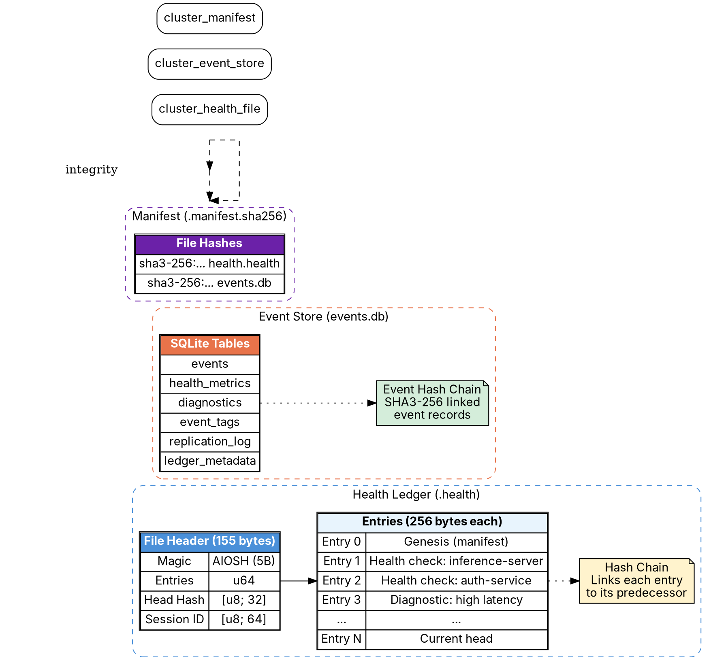

                        ▀▀                                  
            ▄█████▄   ████      ▄████▄   ▄▄█████▄  ▄▄█████▄ 
            ▀ ▄▄▄██     ██     ██▀  ▀██  ██▄▄▄▄ ▀  ██▄▄▄▄ ▀ 
           ▄██▀▀▀██     ██     ██    ██   ▀▀▀▀██▄   ▀▀▀▀██▄ 
    ██     ██▄▄▄███  ▄▄▄██▄▄▄  ▀██▄▄██▀  █▄▄▄▄▄██  █▄▄▄▄▄██ 
    ▀▀      ▀▀▀▀ ▀▀  ▀▀▀▀▀▀▀▀    ▀▀▀▀     ▀▀▀▀▀▀    ▀▀▀▀▀▀ 

# Health Ledger and Events

**AIOSS** includes a dedicated health monitoring subsystem that records system health metrics in a structured, verifiable ledger format. The health ledger extends the core AIOSS format with specialized entries for component health, diagnostics, and telemetry data. This document specifies the `.health` file format, the HealthEntry data structure, the SQLite-based Event Store with hash chain verification, and the StateMachine trait for event replay.

The health ledger serves as the system's "black box" recorder. Every health check, status change, diagnostic event, and telemetry sample is recorded in an append-only, tamper-evident structure. This enables operators to reconstruct system state at any point in time, diagnose failures, and demonstrate compliance with regulatory requirements for system monitoring.

## The .health Format Specification

The `.health` format is a specialized variant of the AIOSS ledger optimized for health monitoring data. It shares the core binary format structure but uses a different magic number, fixed field mappings, and a specialized entry type system.

### File Format

```
┌──────────────────────────────────────────────┐
│              .health File Header              │
│  Magic: b"AIOSH" (5 bytes)                    │
│  Version: 1 (u16)                             │
│  Header Size: 155 (u16)                       │
│  Checksum: u32                                │
│  Entries: u64                                 │
│  Entry Size: 256 (u16)                        │
│  Session ID: [u8; 64]                         │
│  Head Hash: [u8; 32]                          │
│  Created At: u64                              │
│  Completed At: u64                            │
│  Status: u8                                   │
│  Reserved: [u8; 19]                           │
├──────────────────────────────────────────────┤
│              Health Entry 0 (256 bytes)        │
├──────────────────────────────────────────────┤
│              Health Entry 1 (256 bytes)        │
├──────────────────────────────────────────────┤
│              ...                               │
└──────────────────────────────────────────────┘
```

The `.health` binary format is identical to the core AIOSS binary format with one exception: the magic bytes are `b"AIOSH"` (hex: 41 49 4F 53 48) instead of `b"AIOSS"`. This distinction ensures that health ledgers are not confused with general-purpose audit ledgers, while maintaining binary-level compatibility with the same parsing infrastructure.

### Magic Byte Rationale

The magic byte difference (`AIOSH` vs `AIOSS`) serves several purposes:

1. **Type discrimination:** Tools and scripts can identify file type without inspecting content.
2. **Safety:** Prevents accidental use of a health ledger as a general audit ledger.
3. **Parallel processing:** Different pipelines can be dispatched based on file type.
4. **Extensibility:** Future specializations can use their own magic bytes (e.g., `AIOSM` for metrics).

## SHA3-256 with "sha3-256:" Prefix

Health entries store content hashes with a human-readable prefix `sha3-256:` followed by the hex-encoded hash. This prefixed format serves as a self-describing hash identifier, enabling automated tools to detect the hash algorithm without external metadata.

### Hash Format

```
sha3-256:3a9f1b2c3d4e5f6a7b8c9d0e1f2a3b4c5d6e7f8a9b0c1d2e3f4a5b6c7d8e9f0a
```

The format is: `sha3-256:` (9 ASCII bytes) + 64 lowercase hex characters.

### Rust Implementation

```rust
pub fn hash_to_prefixed_string(hash: &[u8; 32]) -> String {
    format!("sha3-256:{}", hex::encode(hash))
}

pub fn prefixed_string_to_hash(s: &str) -> Result<[u8; 32], AiossError> {
    let prefix = "sha3-256:";
    if !s.starts_with(prefix) {
        return Err(AiossError::InvalidHashFormat);
    }
    let hex_str = &s[prefix.len()..];
    let bytes = hex::decode(hex_str)?;
    if bytes.len() != 32 {
        return Err(AiossError::InvalidHashLength);
    }
    let mut hash = [0u8; 32];
    hash.copy_from_slice(&bytes);
    Ok(hash)
}
```

### Why Prefix

The prefixed format provides several advantages over raw hex:

1. **Self-describing:** The hash algorithm is embedded in the string. If AIOSS later supports additional hash algorithms (e.g., SHA3-512, Blake3), the prefix disambiguates.
2. **Validation:** Tools can verify that the hash algorithm matches expectations before attempting verification.
3. **Display:** In logs and UIs, the prefix provides immediate context for what the hexadecimal string represents.
4. **Cross-reference:** External systems that reference AIOSS hashes can verify algorithm compatibility.

## HealthEntry Struct

The `HealthEntry` struct is the core data type for health ledger records. It extends the base `LedgerEntry` with health-specific fields.

### Struct Definition

```rust
#[derive(Debug, Clone, Serialize, Deserialize)]
pub struct HealthEntry {
    // Core ledger fields (inherited from LedgerEntry)
    pub index: u64,
    pub etype: String,
    pub actor: String,
    pub label: String,
    pub timestamp: u64,
    pub content: String,
    pub content_hash: [u8; 32],
    pub parent_hash: [u8; 32],
    pub hash: [u8; 32],
    
    // Health-specific fields
    pub component: String,
    pub status: HealthStatus,
    pub metrics: HealthMetrics,
    pub diagnostics: Option<Diagnostics>,
    pub tags: Vec<String>,
}

#[derive(Debug, Clone, Serialize, Deserialize)]
pub enum HealthStatus {
    Pass,
    Fail,
    Warn,
    Unknown,
}

#[derive(Debug, Clone, Serialize, Deserialize)]
pub struct HealthMetrics {
    pub latency_ms: Option<u64>,
    pub error_rate: Option<f64>,
    pub throughput_rps: Option<f64>,
    pub cpu_usage_pct: Option<f64>,
    pub memory_mb: Option<u64>,
    pub disk_usage_pct: Option<f64>,
    pub uptime_seconds: Option<u64>,
    pub custom: HashMap<String, f64>,
}

#[derive(Debug, Clone, Serialize, Deserialize)]
pub struct Diagnostics {
    pub message: String,
    pub code: String,
    pub stack_trace: Option<String>,
    pub resolution: Option<String>,
}
```

### Field Reference

| Field | Type | Description |
|---|---|---|
| index | u64 | Entry sequence number, starting at 0 |
| etype | String | Entry type (health, diagnostic, telemetry, event) |
| actor | String | Component or system that produced the entry |
| label | String | Human-readable summary |
| timestamp | u64 | Unix timestamp (seconds) |
| content | String | JSON-encoded content payload |
| content_hash | [u8; 32] | SHA3-256 of canonical JSON content |
| parent_hash | [u8; 32] | SHA3-256 of predecessor entry |
| hash | [u8; 32] | SHA3-256 of this entry (with hash field zeroed) |
| component | String | Component identifier (e.g., "inference-server", "auth-service") |
| status | HealthStatus | Health status: Pass, Fail, Warn, or Unknown |
| metrics | HealthMetrics | Structured health metrics |
| diagnostics | Option\<Diagnostics\> | Optional diagnostic information |
| tags | Vec\<String\> | Arbitrary tags for filtering |

### Entry Types

The `.health` format defines the following entry types:

| etype | Description |
|---|---|
| health | Standard health check result |
| diagnostic | Detailed diagnostic information |
| telemetry | Telemetry data sample |
| event | Health-related event (e.g., recovery, degradation) |
| threshold | Threshold crossing alert |
| heartbeat | Periodic liveness indicator |
| manifest | Ledger manifest entry |

### HealthEntry Serialization

Health entries are serialized to canonical JSON for hashing:

```rust
fn canonical_health_entry(entry: &HealthEntry) -> Vec<u8> {
    // Start with core fields in lexicographic order
    let mut map = serde_json::Map::new();
    
    map.insert("actor".to_string(), json!(entry.actor));
    map.insert("component".to_string(), json!(entry.component));
    map.insert("content".to_string(), json!(entry.content));
    map.insert("content_hash".to_string(), json!(hex::encode(entry.content_hash)));
    map.insert("diagnostics".to_string(), json!(entry.diagnostics));
    map.insert("etype".to_string(), json!(entry.etype));
    map.insert("hash".to_string(), json!("0000000000000000000000000000000000000000000000000000000000000000"));
    map.insert("index".to_string(), json!(entry.index));
    map.insert("label".to_string(), json!(entry.label));
    map.insert("metrics".to_string(), json!(entry.metrics));
    map.insert("parent_hash".to_string(), json!(hex::encode(entry.parent_hash)));
    map.insert("status".to_string(), json!(entry.status));
    map.insert("tags".to_string(), json!(entry.tags));
    map.insert("timestamp".to_string(), json!(entry.timestamp));
    
    let canonical = serde_json::to_string(&map).unwrap();
    canonical.into_bytes()
}
```

Note: The hash field is serialized as the zero-hash string during computation, following the same self-referential hash approach used in core entries.

## manifest.sha256 Generation

Every `.health` file should be accompanied by a `manifest.sha256` file that contains the SHA3-256 hash of the entire health ledger file. This provides an additional integrity check at the file level.

### Manifest Format

```
sha3-256:b7e2d4f6a8c0e2f4a6b8c0d2e4f6a8b0c2d4e6f8a0b2c4d6e8f0a2b4c6d8e0f2a  health-ledger-2024-06-10.health
sha3-256:f14a3b5c7d9e1f3a5b7c9d1e3f5a7b9c1d3e5f7a9b1c3d5e7f9a1b3c5d7e9f1b  health-ledger-2024-06-10.events.db
```

### Generation

```rust
pub fn generate_manifest(paths: &[&str]) -> Result<String, AiossError> {
    let mut manifest = String::new();
    
    for path in paths {
        let data = std::fs::read(path)?;
        let hash = compute_sha3_256(&data);
        let filename = std::path::Path::new(path)
            .file_name()
            .unwrap()
            .to_str()
            .unwrap();
        manifest.push_str(&format!("sha3-256:{}  {}\n", hex::encode(hash), filename));
    }
    
    Ok(manifest)
}
```

### Verification

```rust
pub fn verify_manifest(manifest_path: &str) -> Result<bool, AiossError> {
    let manifest = std::fs::read_to_string(manifest_path)?;
    
    for line in manifest.lines() {
        let parts: Vec<&str> = line.split("  ").collect();
        if parts.len() != 2 {
            continue;
        }
        let expected_hash = parts[0].strip_prefix("sha3-256:")
            .ok_or(AiossError::InvalidHashFormat)?;
        let filename = parts[1];
        
        let data = std::fs::read(filename)?;
        let actual_hash = hex::encode(compute_sha3_256(&data));
        
        if expected_hash != actual_hash {
            return Ok(false);
        }
    }
    
    Ok(true)
}
```

### Integration with HealthLedger

```rust
impl HealthLedger {
    pub fn save_manifest(&self) -> Result<(), AiossError> {
        let health_path = self.path();
        let db_path = self.db_path();
        
        let manifest = generate_manifest(&[&health_path, &db_path])?;
        
        let manifest_path = health_path.replace(".health", ".manifest.sha256");
        std::fs::write(&manifest_path, manifest)?;
        
        Ok(())
    }
    
    pub fn verify_integrity(&self) -> Result<bool, AiossError> {
        let manifest_path = self.path().replace(".health", ".manifest.sha256");
        verify_manifest(&manifest_path)
    }
}
```

## HealthLedger Lifecycle

The `HealthLedger` manages the complete lifecycle of health data recording, from initialization through closure and archival.

### Initialization

```rust
pub struct HealthLedgerConfig {
    pub session_id: String,
    pub node_id: String,
    pub environment: String,
    pub retention_days: u64,
    pub auto_flush_interval: Duration,
    pub max_entries_before_flush: u64,
    pub db_path: String,
}

pub struct HealthLedger {
    config: HealthLedgerConfig,
    entries: Vec<HealthEntry>,
    event_store: EventStore,
    head_hash: [u8; 32],
    created_at: u64,
    status: LedgerStatus,
    dirty: bool,
}

impl HealthLedger {
    pub fn initialize(config: HealthLedgerConfig) -> Result<Self, AiossError> {
        let timestamp = current_timestamp();
        
        // Create genesis entry
        let genesis = HealthEntry {
            index: 0,
            etype: "manifest".to_string(),
            actor: "system".to_string(),
            label: format!("Health Ledger Initialization - Node {}", config.node_id),
            timestamp,
            content: serde_json::json!({
                "node_id": config.node_id,
                "environment": config.environment,
                "session_id": config.session_id,
                "event": "health_ledger_initialized"
            }).to_string(),
            content_hash: [0u8; 32],
            parent_hash: [0u8; 32],
            hash: [0u8; 32],
            component: "system".to_string(),
            status: HealthStatus::Pass,
            metrics: HealthMetrics::default(),
            diagnostics: None,
            tags: vec!["initialization".to_string(), config.environment.clone()],
        };
        
        // Compute hashes
        let mut ledger = Self {
            config,
            entries: vec![genesis],
            event_store: EventStore::open(&config.db_path)?,
            head_hash: [0u8; 32],
            created_at: timestamp,
            status: LedgerStatus::Open,
            dirty: true,
        };
        
        // Compute genesis hash
        let genesis_hash = ledger.compute_entry_hash(0);
        ledger.entries[0].hash = genesis_hash;
        ledger.entries[0].content_hash = compute_sha3_256(
            &canonical_json_content(&ledger.entries[0].content)
        );
        ledger.head_hash = genesis_hash;
        
        // Log initialization event
        ledger.event_store.log_event(HealthEvent {
            event_type: "ledger_initialized".to_string(),
            timestamp,
            data: serde_json::json!({
                "node_id": config.node_id,
                "session_id": config.session_id,
                "genesis_hash": hex::encode(genesis_hash),
            }),
        })?;
        
        Ok(ledger)
    }
}
```

### Recording Health Entries

```rust
impl HealthLedger {
    pub fn record_health(
        &mut self,
        component: &str,
        status: HealthStatus,
        metrics: HealthMetrics,
        diagnostics: Option<Diagnostics>,
        tags: Vec<String>,
    ) -> Result<HealthEntry, AiossError> {
        self.ensure_open()?;
        
        let index = self.entries.len() as u64;
        let parent_hash = self.head_hash;
        let timestamp = current_timestamp();
        
        let entry = HealthEntry {
            index,
            etype: "health".to_string(),
            actor: component.to_string(),
            label: format!("Health check: {} - {:?}", component, status),
            timestamp,
            content: serde_json::json!({
                "component": component,
                "status": status,
                "metrics": metrics,
                "timestamp": timestamp,
            }).to_string(),
            content_hash: [0u8; 32],
            parent_hash,
            hash: [0u8; 32],
            component: component.to_string(),
            status,
            metrics,
            diagnostics,
            tags,
        };
        
        self.entries.push(entry);
        self.dirty = true;
        
        // Compute hashes for the new entry
        let last_idx = self.entries.len() - 1;
        let entry_hash = self.compute_entry_hash(last_idx);
        self.entries[last_idx].hash = entry_hash;
        self.entries[last_idx].content_hash = compute_sha3_256(
            &canonical_json_content(&self.entries[last_idx].content)
        );
        self.head_hash = entry_hash;
        
        // Log event
        self.event_store.log_event(HealthEvent {
            event_type: "entry_appended".to_string(),
            timestamp,
            data: serde_json::json!({
                "index": index,
                "component": component,
                "status": format!("{:?}", status),
                "hash": hex::encode(entry_hash),
            }),
        })?;
        
        // Auto-flush if needed
        if self.entries.len() as u64 >= self.config.max_entries_before_flush {
            self.flush()?;
        }
        
        Ok(self.entries[last_idx].clone())
    }
}
```

### Flush

```rust
impl HealthLedger {
    pub fn flush(&mut self) -> Result<(), AiossError> {
        if !self.dirty {
            return Ok(());
        }
        
        // Write binary format
        let path = self.health_file_path();
        write_binary_health_ledger(&path, self)?;
        
        // Update manifest
        self.save_manifest()?;
        
        self.dirty = false;
        
        Ok(())
    }
    
    pub fn flush_async(&self) -> JoinHandle<Result<(), AiossError>> {
        // For non-blocking flush in async contexts
        let path = self.health_file_path();
        let entries = self.entries.clone();
        let config = self.config.clone();
        
        tokio::spawn(async move {
            tokio::task::spawn_blocking(move || {
                write_binary_health_ledger(&path, &entries, &config)
            }).await?
        })
    }
}
```

### Close

```rust
impl HealthLedger {
    pub fn close(&mut self) -> Result<(), AiossError> {
        self.ensure_open()?;
        
        // Final flush
        self.flush()?;
        
        // Update status
        self.status = LedgerStatus::Closed;
        let timestamp = current_timestamp();
        
        // Append closure entry
        let closure_entry = HealthEntry {
            index: self.entries.len() as u64,
            etype: "event".to_string(),
            actor: "system".to_string(),
            label: "Health Ledger Closed".to_string(),
            timestamp,
            content: serde_json::json!({
                "event": "health_ledger_closed",
                "total_entries": self.entries.len(),
                "duration_seconds": timestamp - self.created_at,
            }).to_string(),
            content_hash: [0u8; 32],
            parent_hash: self.head_hash,
            hash: [0u8; 32],
            component: "system".to_string(),
            status: HealthStatus::Pass,
            metrics: HealthMetrics::default(),
            diagnostics: None,
            tags: vec!["closure".to_string()],
        };
        
        self.entries.push(closure_entry);
        let last_idx = self.entries.len() - 1;
        let entry_hash = self.compute_entry_hash(last_idx);
        self.entries[last_idx].hash = entry_hash;
        self.head_hash = entry_hash;
        
        // Final write
        self.flush()?;
        
        // Log closure event
        self.event_store.log_event(HealthEvent {
            event_type: "ledger_closed".to_string(),
            timestamp,
            data: serde_json::json!({
                "total_entries": self.entries.len(),
                "head_hash": hex::encode(self.head_hash),
            }),
        })?;
        
        Ok(())
    }
}
```

## SQLite Event Store Table Schema

The Event Store is an SQLite database that records every event in the health ledger lifecycle. It provides efficient querying, replay support, and cross-referencing with the binary health file.

### Schema

```sql
-- Event Store Schema for AIOSS Health Ledger
-- File: events.db

-- Primary event table
CREATE TABLE IF NOT EXISTS events (
    id              INTEGER PRIMARY KEY AUTOINCREMENT,
    event_type      TEXT NOT NULL,
    event_hash      TEXT NOT NULL UNIQUE,
    timestamp       INTEGER NOT NULL,
    entry_index     INTEGER,
    component       TEXT,
    status          TEXT,
    data            TEXT,
    previous_hash   TEXT,
    created_at      INTEGER DEFAULT (strftime('%s', 'now'))
);

-- Indexes for common queries
CREATE INDEX IF NOT EXISTS idx_events_type ON events(event_type);
CREATE INDEX IF NOT EXISTS idx_events_timestamp ON events(timestamp);
CREATE INDEX IF NOT EXISTS idx_events_component ON events(component);
CREATE INDEX IF NOT EXISTS idx_events_entry_index ON events(entry_index);

-- Health metrics table (for time-series analysis)
CREATE TABLE IF NOT EXISTS health_metrics (
    id              INTEGER PRIMARY KEY AUTOINCREMENT,
    event_id        INTEGER NOT NULL,
    component       TEXT NOT NULL,
    status          TEXT NOT NULL,
    latency_ms      INTEGER,
    error_rate      REAL,
    throughput_rps  REAL,
    cpu_usage_pct   REAL,
    memory_mb       INTEGER,
    disk_usage_pct  REAL,
    uptime_seconds  INTEGER,
    recorded_at     INTEGER NOT NULL,
    FOREIGN KEY (event_id) REFERENCES events(id)
);

CREATE INDEX IF NOT EXISTS idx_health_metrics_component ON health_metrics(component);
CREATE INDEX IF NOT EXISTS idx_health_metrics_recorded_at ON health_metrics(recorded_at);

-- Diagnostics table
CREATE TABLE IF NOT EXISTS diagnostics (
    id              INTEGER PRIMARY KEY AUTOINCREMENT,
    event_id        INTEGER NOT NULL,
    code            TEXT NOT NULL,
    message         TEXT NOT NULL,
    stack_trace     TEXT,
    resolution      TEXT,
    FOREIGN KEY (event_id) REFERENCES events(id)
);

-- Tags table (many-to-many)
CREATE TABLE IF NOT EXISTS event_tags (
    event_id        INTEGER NOT NULL,
    tag             TEXT NOT NULL,
    PRIMARY KEY (event_id, tag),
    FOREIGN KEY (event_id) REFERENCES events(id)
);

CREATE INDEX IF NOT EXISTS idx_event_tags_tag ON event_tags(tag);

-- Replication tracking
CREATE TABLE IF NOT EXISTS replication_log (
    id              INTEGER PRIMARY KEY AUTOINCREMENT,
    target_node     TEXT NOT NULL,
    last_event_id   INTEGER NOT NULL,
    last_sync_at    INTEGER NOT NULL,
    status          TEXT NOT NULL DEFAULT 'pending'
);

-- Ledger metadata
CREATE TABLE IF NOT EXISTS ledger_metadata (
    key             TEXT PRIMARY KEY,
    value           TEXT NOT NULL,
    updated_at      INTEGER NOT NULL
);

-- Insert initial metadata
INSERT OR IGNORE INTO ledger_metadata (key, value, updated_at)
VALUES ('schema_version', '1', strftime('%s', 'now'));
```

### Table Descriptions

**events:** The primary event log. Every operation on the health ledger produces an event record. The `event_hash` column stores the SHA3-256 hash of the serialized event, enabling hash chain verification within the event store itself. The `previous_hash` column links events in chronological order.

**health_metrics:** Time-series storage for numeric health metrics. Designed for efficient range queries (e.g., "average latency over the last hour"). The foreign key to `events` maintains the link between metric samples and their corresponding event records.

**diagnostics:** Stores detailed diagnostic information for health failures. Separate from the main events table because diagnostic data can be arbitrarily large and is queried less frequently.

**event_tags:** Many-to-many relationship between events and tags. Enables filtering events by arbitrary tag values.

**replication_log:** Tracks cross-node replication state. Each row records the last event synchronized to a target node, supporting incremental replication.

**ledger_metadata:** Key-value store for ledger-level metadata such as schema version, node ID, and environment.

### Event Store Implementation

```rust
use rusqlite::{Connection, params};

pub struct EventStore {
    conn: Connection,
    last_hash: [u8; 32],
}

impl EventStore {
    pub fn open(path: &str) -> Result<Self, AiossError> {
        let conn = Connection::open(path)?;
        
        // Enable WAL mode for concurrent reads
        conn.execute_batch("PRAGMA journal_mode=WAL;")?;
        conn.execute_batch("PRAGMA synchronous=NORMAL;")?;
        
        // Create schema
        conn.execute_batch(SCHEMA_SQL)?;
        
        // Get last event hash for chain continuity
        let last_hash: Option<String> = conn
            .query_row(
                "SELECT event_hash FROM events ORDER BY id DESC LIMIT 1",
                [],
                |row| row.get(0),
            )
            .optional()?
            .flatten();
        
        let last_hash = match last_hash {
            Some(h) => prefixed_string_to_hash(&h)?,
            None => [0u8; 32],
        };
        
        Ok(Self { conn, last_hash })
    }
    
    pub fn log_event(&self, event: HealthEvent) -> Result<i64, AiossError> {
        let timestamp = event.timestamp;
        let event_type = &event.event_type;
        let data = event.data.to_string();
        
        // Compute event hash (includes previous hash for chaining)
        let mut hasher = Sha3_256::new();
        hasher.update(event_type.as_bytes());
        hasher.update(&timestamp.to_le_bytes());
        hasher.update(data.as_bytes());
        hasher.update(&self.last_hash);
        let event_hash = hasher.finalize();
        let event_hash_str = hash_to_prefixed_string(&event_hash.into());
        
        // Insert event
        self.conn.execute(
            "INSERT INTO events (event_type, event_hash, timestamp, data, previous_hash)
             VALUES (?1, ?2, ?3, ?4, ?5)",
            params![
                event_type,
                event_hash_str,
                timestamp,
                data,
                hash_to_prefixed_string(&self.last_hash),
            ],
        )?;
        
        Ok(self.conn.last_insert_rowid())
    }
}
```

## Event Hash Chain Verification

The Event Store maintains its own hash chain, independent of the core ledger's hash chain. This provides dual-layer integrity protection: any inconsistency between the events database and the health ledger file is detectable.

### Chain Structure

Each event record in SQLite contains:

- `event_hash`: SHA3-256 of `event_type | timestamp | data | previous_hash`
- `previous_hash`: The `event_hash` of the preceding event (32 zero bytes for the first event)

```rust
pub fn verify_event_chain(store: &EventStore) -> Result<bool, AiossError> {
    let mut stmt = store.conn.prepare(
        "SELECT id, event_type, timestamp, data, event_hash, previous_hash
         FROM events ORDER BY id ASC"
    )?;
    
    let events: Vec<EventRow> = stmt
        .query_map([], |row| {
            Ok(EventRow {
                id: row.get(0)?,
                event_type: row.get(1)?,
                timestamp: row.get(2)?,
                data: row.get(3)?,
                event_hash: row.get(4)?,
                previous_hash: row.get(5)?,
            })
        })?
        .collect::<Result<Vec<_>, _>>()?;
    
    let mut expected_previous = "sha3-256:0000000000000000000000000000000000000000000000000000000000000000".to_string();
    
    for event in &events {
        // Check previous hash linkage
        if event.previous_hash != expected_previous {
            return Ok(false);
        }
        
        // Recompute event hash
        let previous_hash_bytes = prefixed_string_to_hash(&event.previous_hash)?;
        
        // Extract the data bytes from the stored event
        let mut hasher = Sha3_256::new();
        hasher.update(event.event_type.as_bytes());
        hasher.update(&event.timestamp.to_le_bytes());
        hasher.update(event.data.as_bytes());
        hasher.update(&previous_hash_bytes);
        let computed_hash = hash_to_prefixed_string(&hasher.finalize().into());
        
        if computed_hash != event.event_hash {
            return Ok(false);
        }
        
        expected_previous = event.event_hash.clone();
    }
    
    Ok(true)
}
```

### Cross-Verification with Health Ledger

The event store can be cross-verified against the binary health ledger file:

```rust
pub fn cross_verify(health_path: &str, db_path: &str) -> Result<bool, AiossError> {
    // Verify health file hash chain
    let health_ledger = read_binary_health_ledger(health_path)?;
    let health_valid = verify_health_chain(&health_ledger);
    
    // Verify event chain
    let event_store = EventStore::open(db_path)?;
    let events_valid = verify_event_chain(&event_store)?;
    
    // Verify counts match
    let health_count = health_ledger.entries.len();
    let event_count: i64 = event_store.conn
        .query_row("SELECT COUNT(*) FROM events", [], |row| row.get(0))?;
    
    // The event store has more events (initialization, closure, etc.)
    if event_count < health_count as i64 {
        return Ok(false);
    }
    
    // Verify that every health entry index in the event store matches
    let mut stmt = event_store.conn.prepare(
        "SELECT COUNT(*) FROM events WHERE event_type = 'entry_appended'"
    )?;
    let appended_count: i64 = stmt.query_row([], |row| row.get(0))?;
    
    // Genesis + closure + appended entries
    if appended_count + 2 != health_count as i64 {
        return Ok(false);
    }
    
    Ok(health_valid && events_valid)
}
```

## Replay Support via StateMachine Trait

The `StateMachine` trait enables deterministic event replay, allowing operators to reconstruct the health ledger state at any point in time.

### StateMachine Trait

```rust
pub trait StateMachine {
    /// The state type produced by replaying events
    type State: Clone + Default + Serialize + DeserializeOwned;
    
    /// The event type consumed during replay
    type Event: Serialize + DeserializeOwned;
    
    /// Apply a single event to the state
    fn apply(state: &mut Self::State, event: &Self::Event);
    
    /// Initial state before any events
    fn initial_state() -> Self::State;
    
    /// Replay all events to produce the final state
    fn replay(events: &[Self::Event]) -> Self::State {
        let mut state = Self::initial_state();
        for event in events {
            Self::apply(&mut state, event);
        }
        state
    }
    
    /// Replay events from a specific point
    fn replay_from(events: &[Self::Event], from_index: usize) -> Self::State {
        let mut state = Self::initial_state();
        for event in &events[from_index..] {
            Self::apply(&mut state, event);
        }
        state
    }
}
```

### HealthStateMachine Implementation

```rust
#[derive(Debug, Clone, Default, Serialize, Deserialize)]
pub struct HealthLedgerState {
    pub entries: Vec<HealthEntrySummary>,
    pub component_states: HashMap<String, HealthStatus>,
    pub metrics_window: VecDeque<MetricsSample>,
    pub uptime_start: Option<u64>,
    pub total_entries: u64,
    pub last_status_change: Option<u64>,
    pub warnings: Vec<WarningRecord>,
    pub failures: Vec<FailureRecord>,
}

impl StateMachine for HealthLedgerState {
    type State = HealthLedgerState;
    type Event = HealthEntry;
    
    fn initial_state() -> Self::State {
        HealthLedgerState::default()
    }
    
    fn apply(state: &mut Self::State, entry: &Self::Event) {
        state.total_entries += 1;
        
        // Record component state
        state.component_states.insert(entry.component.clone(), entry.status);
        
        // Track uptime
        if state.uptime_start.is_none() && entry.status == HealthStatus::Pass {
            state.uptime_start = Some(entry.timestamp);
        }
        
        // Collect metrics
        state.metrics_window.push_back(MetricsSample {
            timestamp: entry.timestamp,
            component: entry.component.clone(),
            latency_ms: entry.metrics.latency_ms,
            error_rate: entry.metrics.error_rate,
            throughput_rps: entry.metrics.throughput_rps,
        });
        
        // Maintain window size
        if state.metrics_window.len() > 1000 {
            state.metrics_window.pop_front();
        }
        
        // Track status changes
        if let Some(diag) = &entry.diagnostics {
            match entry.status {
                HealthStatus::Fail => {
                    state.failures.push(FailureRecord {
                        timestamp: entry.timestamp,
                        component: entry.component.clone(),
                        code: diag.code.clone(),
                        message: diag.message.clone(),
                        resolution: diag.resolution.clone(),
                    });
                    state.last_status_change = Some(entry.timestamp);
                }
                HealthStatus::Warn => {
                    state.warnings.push(WarningRecord {
                        timestamp: entry.timestamp,
                        component: entry.component.clone(),
                        message: diag.message.clone(),
                    });
                    state.last_status_change = Some(entry.timestamp);
                }
                _ => {}
            }
        }
        
        // Store entry summary
        state.entries.push(HealthEntrySummary {
            index: entry.index,
            component: entry.component.clone(),
            status: entry.status.clone(),
            timestamp: entry.timestamp,
            label: entry.label.clone(),
        });
    }
}
```

### Using Replay for Diagnostics

```rust
/// Replay the health ledger to find the state at a specific time
pub fn state_at_time(
    ledger: &HealthLedger,
    timestamp: u64,
) -> HealthLedgerState {
    let mut state = HealthLedgerState::initial_state();
    
    for entry in &ledger.entries {
        if entry.timestamp > timestamp {
            break;
        }
        HealthLedgerState::apply(&mut state, entry);
    }
    
    state
}

/// Find the root cause of a failure by replaying from the last known good state
pub fn diagnose_failure(
    ledger: &HealthLedger,
    failed_component: &str,
    failure_time: u64,
) -> DiagnosticsReport {
    let mut state = HealthLedgerState::initial_state();
    let mut last_good_timestamp = 0u64;
    let mut failure_events = Vec::new();
    
    for entry in &ledger.entries {
        HealthLedgerState::apply(&mut state, entry);
        
        if entry.component == failed_component {
            match entry.status {
                HealthStatus::Pass => {
                    last_good_timestamp = entry.timestamp;
                    failure_events.clear();
                }
                HealthStatus::Fail | HealthStatus::Warn => {
                    if entry.timestamp <= failure_time {
                        failure_events.push(entry.clone());
                    }
                }
                _ => {}
            }
        }
    }
    
    DiagnosticsReport {
        component: failed_component.to_string(),
        failure_time,
        last_good_timestamp,
        time_to_failure: if last_good_timestamp > 0 {
            Some(failure_time - last_good_timestamp)
        } else {
            None
        },
        events_leading_to_failure: failure_events,
        component_state_at_failure: state.component_states.clone(),
    }
}
```

### Replay Performance

For a health ledger with 1,000,000 entries:

| Operation | Time | Memory |
|---|---|---|
| Full replay | ~500 ms | ~50 MB |
| Partial replay (last 1000) | ~500 µs | ~50 KB |
| State at time T | ~250 ms average | ~50 MB peak |
| Cross-verify | ~750 ms | ~100 MB peak |

## Health Ledger Structure Diagram



## Observability Integration

The health ledger integrates with standard observability tooling:

### Prometheus Export

```rust
impl HealthLedger {
    pub fn export_prometheus(&self) -> String {
        let mut output = String::new();
        
        for entry in &self.entries {
            let component = sanitize_metric_name(&entry.component);
            let status_val = match entry.status {
                HealthStatus::Pass => 1.0,
                HealthStatus::Fail => 0.0,
                HealthStatus::Warn => 0.5,
                HealthStatus::Unknown => -1.0,
            };
            
            output.push_str(&format!(
                "# HELP aioss_health_status Health status for component {}\n",
                component
            ));
            output.push_str(&format!(
                "# TYPE aioss_health_status gauge\n"
            ));
            output.push_str(&format!(
                "aioss_health_status{{component=\"{}\",session=\"{}\"}} {}\n",
                component, self.config.session_id, status_val
            ));
            
            if let Some(latency) = entry.metrics.latency_ms {
                output.push_str(&format!(
                    "aioss_health_latency_ms{{component=\"{}\"}} {}\n",
                    component, latency
                ));
            }
        }
        
        output
    }
}
```

### OpenTelemetry Integration

```rust
#[cfg(feature = "opentelemetry")]
impl HealthLedger {
    pub fn record_otel_span(&self, entry: &HealthEntry) {
        use opentelemetry::{
            trace::{Span, SpanBuilder, Tracer},
            KeyValue,
        };
        
        let tracer = global::tracer("aioss-health");
        let mut span = tracer.start("health check");
        
        span.set_attribute(KeyValue::new("component", entry.component.clone()));
        span.set_attribute(KeyValue::new("status", format!("{:?}", entry.status)));
        
        if let Some(latency) = entry.metrics.latency_ms {
            span.set_attribute(KeyValue::new("latency_ms", latency as i64));
        }
        
        if entry.status == HealthStatus::Fail {
            span.set_status(opentelemetry::trace::Status::error("Health check failed"));
        }
        
        span.end();
    }
}
```

## References

1. National Institute of Standards and Technology. "FIPS PUB 202: SHA-3 Standard: Permutation-Based Hash and Extendable-Output Functions." *U.S. Department of Commerce* (2015).

2. Haber, Stuart, and W. Scott Stornetta. "How to Time-Stamp a Digital Document." *Journal of Cryptology* 3, no. 2 (1991): 99–111.

3. Newman, Chris. "Event Tracing for Windows (ETW)." *Microsoft Developer Network* (2007).

4. Sigelman, Benjamin H., Luiz Andre Barroso, Mike Burrows, Pat Stephenson, Manoj Plakal, Donald Beaver, Saul Jaspan, and Chandan Shanbhag. "Dapper, a Large-Scale Distributed Systems Tracing Infrastructure." *Google Technical Report* (2010).

5. Toader, Lucian, and Alexandru Butoi. "Health Monitoring in Distributed Systems." *IEEE International Conference on Automation, Quality and Testing, Robotics* (2018): 1–6.

6. European Parliament. "Regulation (EU) 2016/679 (General Data Protection Regulation)." *Official Journal of the European Union* (2016).

7. European Commission. "Regulation (EU) 2024/1689 (EU AI Act)." *Official Journal of the European Union* (2024).

8. Kreps, Jay, Neha Narkhede, and Jun Rao. "Kafka: A Distributed Messaging System for Log Processing." *ACM SIGMOD Workshop on Networking Meets Databases* (2011).

9. Dean, Jeffrey, and Sanjay Ghemawat. "MapReduce: Simplified Data Processing on Large Clusters." *Communications of the ACM* 51, no. 1 (2008): 107–113.

10. Kleppmann, Martin. "Designing Data-Intensive Applications." *O'Reilly Media* (2017).

(c) 2026 Lois-Kleinner and 0-1.gg
