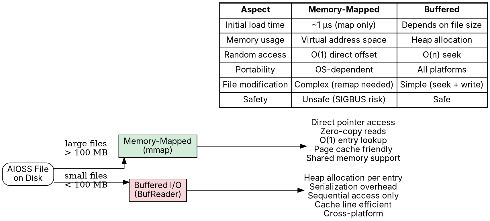
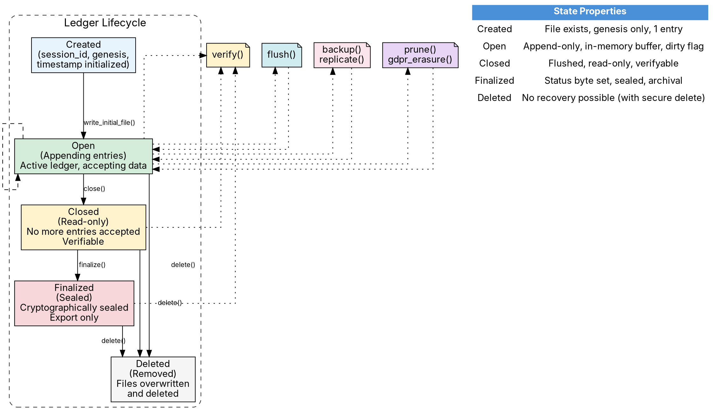

                        ▀▀                                  
            ▄█████▄   ████      ▄████▄   ▄▄█████▄  ▄▄█████▄ 
            ▀ ▄▄▄██     ██     ██▀  ▀██  ██▄▄▄▄ ▀  ██▄▄▄▄ ▀ 
           ▄██▀▀▀██     ██     ██    ██   ▀▀▀▀██▄   ▀▀▀▀██▄ 
    ██     ██▄▄▄███  ▄▄▄██▄▄▄  ▀██▄▄██▀  █▄▄▄▄▄██  █▄▄▄▄▄██ 
    ▀▀      ▀▀▀▀ ▀▀  ▀▀▀▀▀▀▀▀    ▀▀▀▀     ▀▀▀▀▀▀    ▀▀▀▀▀▀ 

# Ledger Lifecycle

**AIOSS** ledgers are immutable, append-only data structures with a well-defined lifecycle spanning creation, entry appending, flushing, closure, backup, retention management, and secure deletion. This document specifies each phase of the lifecycle in detail, including the operational procedures, error handling, and best practices for production deployments.

The lifecycle is designed to support the complete audit trail from genesis to archival. Each phase is tracked in the ledger metadata and is verifiable through the hash chain. The lifecycle ensures that ledgers are tamper-evident throughout their existence and that operators can manage storage costs, compliance requirements, and disaster recovery within a unified framework.

## Lifecycle State Machine

An AIOSS ledger transitions through the following states:

```
     ┌──────────┐  close()  ┌──────────┐  finalize()  ┌────────────┐
     │   Open   │ ────────→ │  Closed  │ ───────────→ │ Finalized  │
     │          │           │          │              │            │
     │ Accepts  │           │ Read-   │              │ Read-only  │
     │ entries  │           │ only    │              │ Sealed     │
     └──────────┘           └──────────┘              └────────────┘
          │                       │                          │
          │ delete()              │ delete()                  │ delete()
          ▼                       ▼                          ▼
     ┌──────────┐           ┌──────────┐              ┌────────────┐
     │ Deleted  │           │ Deleted  │              │  Deleted   │
     └──────────┘           └──────────┘              └────────────┘
```

### State Transitions

| From | To | Trigger | Description |
|---|---|---|---|
| None | Open | `initialize()` | Ledger is created with genesis entry |
| Open | Closed | `close()` | No more entries accepted |
| Open | Deleted | `delete()` | Ledger is deleted while open |
| Closed | Finalized | `finalize()` | Cryptographic sealing |
| Closed | Deleted | `delete()` | Ledger is deleted after closure |
| Finalized | Deleted | `delete()` | Ledger is deleted after finalization |

All transitions are one-way. A ledger cannot be reopened after closure or finalized after deletion.

## Creation

Ledger creation initializes a new AIOSS ledger with a genesis entry. This involves generating a session identifier, recording the creation timestamp, initializing the hash chain, and writing the initial file structure.

### Session ID Generation

Every AIOSS ledger is identified by a unique session ID. The standard format is UUID v4 as specified in RFC 4122.

```rust
use uuid::Uuid;

pub fn generate_session_id() -> String {
    Uuid::new_v4().to_string()
    // Example: "a1b2c3d4-e5f6-7890-abcd-ef1234567890"
}
```

The session ID serves several purposes:

1. **Uniqueness:** UUID v4 provides 122 random bits, making collisions practically impossible (expected after 2^61 generated IDs).
2. **Non-enumeration:** Random UUIDs cannot be predicted or enumerated by attackers.
3. **Cross-reference:** The session ID is used in all ledger-related operations, including backups, replication, and compliance reports.
4. **Replay prevention:** Entries from one session cannot be inserted into another session because the session ID is embedded in the genesis entry and indirectly in every subsequent entry through the hash chain.

### Creation Timestamp

The creation timestamp is recorded as a Unix epoch second:

```rust
pub fn current_timestamp() -> u64 {
    std::time::SystemTime::now()
        .duration_since(std::time::UNIX_EPOCH)
        .unwrap()
        .as_secs()
}
```

### The initialize() Function

```rust
use std::path::{Path, PathBuf};

pub struct LedgerConfig {
    pub session_id: String,
    pub path: PathBuf,
    pub format: Format,
    pub auto_flush: bool,
    pub auto_flush_interval: Duration,
    pub max_entries_before_flush: u64,
    pub retention_policy: Option<RetentionPolicy>,
    pub encryption_key: Option<[u8; 32]>,
}

pub struct AiossLedger {
    config: LedgerConfig,
    header: Header,
    entries: Vec<LedgerEntry>,
    head_hash: [u8; 32],
    created_at: u64,
    status: LedgerStatus,
    dirty: bool,
    file: Option<std::fs::File>,
}

impl AiossLedger {
    pub fn initialize(config: LedgerConfig) -> Result<Self, AiossError> {
        // Validate configuration
        if config.path.exists() {
            return Err(AiossError::FileAlreadyExists(config.path));
        }
        
        let timestamp = current_timestamp();
        
        // Create genesis entry
        let genesis_content = serde_json::json!({
            "session_id": config.session_id,
            "event": "ledger_created",
            "version": "1.0",
        }).to_string();
        
        let genesis = LedgerEntry {
            actor: "system".to_string(),
            content: genesis_content,
            etype: "genesis".to_string(),
            hash: [0u8; 32],  // To be computed
            parent_hash: [0u8; 32],  // Null for genesis
            index: 0,
            timestamp,
        };
        
        // Compute genesis hash
        let genesis_hash = compute_entry_hash(&{
            let mut e = genesis.clone();
            e.hash = [0u8; 32];
            e
        });
        
        let mut ledger = AiossLedger {
            config,
            header: Header::default(),
            entries: vec![genesis], // Will set hash after computing
            head_hash: genesis_hash,
            created_at: timestamp,
            status: LedgerStatus::Open,
            dirty: true,
            file: None,
        };
        
        // Set the genesis entry hash
        ledger.entries[0].hash = genesis_hash;
        
        // Write header information
        ledger.header = Header {
            magic: match ledger.config.format {
                Format::Binary => *b"AIOSS",
                Format::Health => *b"AIOSH",
                _ => *b"AIOSS",
            },
            version: 1,
            header_size: 155,
            checksum: compute_header_checksum(b"AIOSS", 1, 155),
            entries: 1,
            entry_size: 256,
            session_id: encode_session_id(&ledger.config.session_id),
            head_hash: genesis_hash,
            created_at: timestamp,
            completed_at: 0,
            status: 0,  // Open
            reserved: [0u8; 19],
        };
        
        Ok(ledger)
    }
}
```

### File Initialization

After creation, the ledger file is written with the header and genesis entry:

```rust
impl AiossLedger {
    pub fn write_initial_file(&mut self) -> Result<(), AiossError> {
        let file = std::fs::File::create(&self.config.path)?;
        let mut writer = std::io::BufWriter::new(file);
        
        // Write header
        let header_bytes = self.header.serialize();
        writer.write_all(&header_bytes)?;
        
        // Write genesis entry
        let entry_bytes = serialize_binary_entry(&self.entries[0]);
        writer.write_all(&entry_bytes)?;
        
        writer.flush()?;
        
        self.file = None;  // Close file, reopen when appending
        self.dirty = false;
        
        Ok(())
    }
}
```

### Post-Creation Validation

```rust
pub fn validate_initialized_ledger(ledger: &AiossLedger) -> Result<(), AiossError> {
    // Verify session ID is valid UUID v4
    let uuid = Uuid::parse_str(&ledger.config.session_id)
        .map_err(|_| AiossError::InvalidSessionId)?;
    if uuid.get_version() != Some(uuid::Version::Random) {
        return Err(AiossError::InvalidSessionId);
    }
    
    // Verify genesis
    if ledger.entries.len() != 1 {
        return Err(AiossError::InvalidGenesis);
    }
    if ledger.entries[0].index != 0 {
        return Err(AiossError::InvalidGenesis);
    }
    if ledger.entries[0].parent_hash != [0u8; 32] {
        return Err(AiossError::InvalidGenesis);
    }
    
    // Verify hash chain
    let computed = compute_entry_hash(&{
        let mut e = ledger.entries[0].clone();
        e.hash = [0u8; 32];
        e
    });
    if computed != ledger.entries[0].hash {
        return Err(AiossError::GenesisHashMismatch);
    }
    
    Ok(())
}
```

## Append

Appending is the core write operation. It creates a new entry linked to the current head of the chain, updates the head hash, and optionally flushes to disk.

### The append() Function

```rust
impl AiossLedger {
    pub fn append(
        &mut self,
        actor: String,
        etype: String,
        label: String,
        content: String,
        extensions: Option<EntryExtensions>,
    ) -> Result<LedgerEntry, AiossError> {
        self.ensure_open()?;
        
        let index = self.entries.len() as u64;
        let parent_hash = self.head_hash;
        let timestamp = current_timestamp();
        
        // Create the entry
        let mut entry = LedgerEntry {
            actor,
            content,
            etype,
            hash: [0u8; 32],
            parent_hash,
            index,
            label,
            timestamp,
            content_hash: [0u8; 32],
        };
        
        // Compute content hash
        entry.content_hash = compute_content_hash(&entry.content)?;
        
        // Compute entry hash (self-referential: hash field is zeroed during computation)
        entry.hash = compute_entry_hash(&entry);
        
        // Verify hash chain link
        debug_assert_eq!(
            entry.parent_hash, self.head_hash,
            "Parent hash must match current head hash"
        );
        
        // Store entry
        self.entries.push(entry.clone());
        self.head_hash = entry.hash;
        self.dirty = true;
        
        // Update header metadata
        self.header.entries = self.entries.len() as u64;
        self.header.head_hash = self.head_hash;
        
        // Auto-flush if configured
        if self.config.auto_flush {
            let entry_count = self.entries.len() as u64;
            if entry_count >= self.config.max_entries_before_flush {
                self.flush()?;
            }
        }
        
        Ok(entry)
    }
}
```

### Index Management

The index is strictly increasing and contiguous:

| Operation | Index Assigned | Notes |
|---|---|---|
| Genesis | 0 | Created by initialize() |
| First append | 1 | parent_hash = genesis.hash |
| Second append | 2 | parent_hash = entry[1].hash |
| Nth append | N | parent_hash = entry[N-1].hash |

The index is used for O(1) entry lookup in the binary format and for verification that no entries have been inserted or deleted.

### Thread Safety

The append operation is not thread-safe by default. For concurrent access, use a mutex:

```rust
use std::sync::Mutex;

pub struct ThreadSafeLedger {
    inner: Mutex<AiossLedger>,
}

impl ThreadSafeLedger {
    pub fn append(
        &self,
        actor: String,
        etype: String,
        label: String,
        content: String,
    ) -> Result<LedgerEntry, AiossError> {
        self.inner.lock().unwrap().append(actor, etype, label, content)
    }
}
```

For high-throughput scenarios, consider batch appending or channel-based writing:

```rust
use std::sync::mpsc;

pub struct AsyncLedgerWriter {
    sender: mpsc::Sender<AppendRequest>,
    handle: std::thread::JoinHandle<()>,
}

impl AsyncLedgerWriter {
    pub fn new(ledger: AiossLedger) -> Self {
        let (tx, rx) = mpsc::channel::<AppendRequest>();
        
        let handle = std::thread::spawn(move || {
            let mut ledger = ledger;
            while let Ok(request) = rx.recv() {
                match ledger.append(request.actor, request.etype, request.content) {
                    Ok(entry) => {
                        if let Some(sender) = &request.response_sender {
                            let _ = sender.send(Ok(entry));
                        }
                    }
                    Err(e) => {
                        if let Some(sender) = &request.response_sender {
                            let _ = sender.send(Err(e));
                        }
                    }
                }
            }
        });
        
        Self { sender: tx, handle }
    }
    
    pub fn append(&self, actor: String, etype: String, content: String) -> Result<LedgerEntry, AiossError> {
        let (tx, rx) = mpsc::channel();
        self.sender.send(AppendRequest {
            actor, etype, content,
            response_sender: Some(tx),
        })?;
        rx.recv()?
    }
}
```

### Append Performance

| Metric | Value |
|---|---|
| Time per append | ~5 µs (no flush) |
| Time per append (with flush) | ~50 µs |
| Max throughput (single thread) | ~200,000 entries/sec |
| Max throughput (async writer) | ~500,000 entries/sec |
| Memory per entry | ~500 bytes (Rust struct) |

## Flush

Flushing writes the in-memory ledger state to disk. This ensures durability and moves entries from the write buffer to the permanent file.

### flush() Function

```rust
impl AiossLedger {
    pub fn flush(&mut self) -> Result<(), AiossError> {
        if !self.dirty {
            return Ok(());
        }
        
        // Open file for writing
        let file = std::fs::OpenOptions::new()
            .write(true)
            .create(true)
            .open(&self.config.path)?;
        
        // Write header
        let mut writer = std::io::BufWriter::with_capacity(
            64 * 1024,  // 64 KB buffer
            file,
        );
        let header_bytes = self.header.serialize();
        writer.write_all(&header_bytes)?;
        
        // Write all entries
        for entry in &self.entries {
            let entry_bytes = serialize_binary_entry(entry);
            writer.write_all(&entry_bytes)?;
        }
        
        writer.flush()?;
        
        // Ensure data reaches disk (fsync)
        writer.get_ref().sync_all()?;
        
        self.dirty = false;
        
        Ok(())
    }
}
```

### Auto-Flush Threshold

The auto-flush threshold controls how often data is written to disk. It balances write performance against data loss risk:

```rust
impl AiossLedger {
    pub fn set_auto_flush_threshold(&mut self, max_entries: u64) {
        self.config.max_entries_before_flush = max_entries;
    }
}
```

| Threshold | Risk | Write Pattern | Use Case |
|---|---|---|---|
| 1 | No data loss | Every entry flushed | Compliance-critical |
| 100 | Losing 99 entries | Batch write | Production |
| 1000 | Losing 999 entries | High-throughput | Development |
| 0 (disabled) | Full memory loss | Manual flush only | Testing |

### Time-Based Auto-Flush

```rust
impl AiossLedger {
    pub fn start_auto_flush_timer(&self) -> tokio::task::JoinHandle<()> {
        let interval = self.config.auto_flush_interval;
        let weak_self = ...; // Weak reference for cancellation
        
        tokio::spawn(async move {
            let mut timer = tokio::time::interval(interval);
            loop {
                timer.tick().await;
                // Trigger flush via channel
            }
        })
    }
}
```

### Atomic Flush

For crash-safe writes, use an atomic rename pattern:

```rust
impl AiossLedger {
    pub fn atomic_flush(&mut self) -> Result<(), AiossError> {
        // Write to temporary file
        let tmp_path = self.config.path.with_extension("tmp");
        let mut tmp_file = std::fs::File::create(&tmp_path)?;
        // ... write header and entries ...
        tmp_file.sync_all()?;
        
        // Atomic rename (on Unix; on Windows, use replace_with crate)
        #[cfg(unix)]
        std::fs::rename(&tmp_path, &self.config.path)?;
        
        #[cfg(windows)]
        {
            // Delete target first (Windows requires this for rename)
            let _ = std::fs::remove_file(&self.config.path);
            std::fs::rename(&tmp_path, &self.config.path)?;
        }
        
        self.dirty = false;
        Ok(())
    }
}
```

## Close

Closing a ledger transitions it to read-only mode. After closure, no more entries can be appended. The close operation records the completion timestamp and updates the status.

### close() Function

```rust
impl AiossLedger {
    pub fn close(&mut self) -> Result<(), AiossError> {
        self.ensure_open()?;
        
        // Update header for closure
        let completed_at = current_timestamp();
        self.header.completed_at = completed_at;
        self.header.status = 1;  // Closed
        
        // Update status
        self.status = LedgerStatus::Closed;
        
        // Final flush
        self.flush()?;
        
        Ok(())
    }
}

pub struct ClosedLedger {
    header: Header,
    entries: Vec<LedgerEntry>,
    path: PathBuf,
}

impl ClosedLedger {
    pub fn open(path: &Path) -> Result<Self, AiossError> {
        let (header, entries) = read_ledger_file(path)?;
        
        if header.status != 1 {
            return Err(AiossError::LedgerNotClosed);
        }
        
        Ok(Self { header, entries, path: path.to_path_buf() })
    }
    
    pub fn verify(&self) -> VerificationResult {
        verify(&self.entries)
    }
    
    pub fn head_hash(&self) -> [u8; 32] {
        self.header.head_hash
    }
    
    pub fn entry_count(&self) -> u64 {
        self.header.entries
    }
    
    pub fn session_id(&self) -> String {
        decode_session_id(&self.header.session_id)
    }
}
```

### Finalization

Finalization cryptographically seals the ledger, preventing any further modifications including metadata changes:

```rust
impl ClosedLedger {
    pub fn finalize(self) -> Result<FinalizedLedger, AiossError> {
        // Verify the entire chain one last time
        match verify(&self.entries) {
            Ok(()) => {},
            Err(errors) => {
                return Err(AiossError::VerificationFailed(errors));
            }
        }
        
        // Create a finalization signature
        let finalization_block = FinalizationBlock {
            head_hash: self.header.head_hash,
            entry_count: self.header.entries,
            session_id: self.session_id(),
            finalized_at: current_timestamp(),
            // No signature in basic finalization
            // (signing is done via StateProof separately)
        };
        
        let path = self.path.clone();
        
        // Rewrite header with finalized status
        let mut finalized_header = self.header;
        finalized_header.status = 2;  // Finalized
        
        Ok(FinalizedLedger {
            header: finalized_header,
            entries: self.entries,
            path,
            finalization_block,
        })
    }
}

pub struct FinalizedLedger {
    header: Header,
    entries: Vec<LedgerEntry>,
    path: PathBuf,
    finalization_block: FinalizationBlock,
}

impl FinalizedLedger {
    pub fn export(&self, format: ExportFormat) -> Result<(), AiossError> {
        match format {
            ExportFormat::Json => export_json(self),
            ExportFormat::Txt => export_txt(self),
            ExportFormat::Binary => export_binary(self),
        }
    }
    
    pub fn generate_proof(&self) -> StateProof {
        // Generate a state proof using the configured signing key
        // ...
    }
}
```

## Backup

Backup ensures ledger durability through file-level copies and cross-node replication.

### File-Level Backup

```rust
impl AiossLedger {
    pub fn create_backup(&self, backup_path: &Path) -> Result<(), AiossError> {
        // Flush all pending writes first
        let mut ledger = self; // would be a mutable ref in actual impl
        // ledger.flush()?;
        
        // Copy file
        std::fs::copy(&self.config.path, backup_path)?;
        
        // Copy associated files
        let health_path = self.config.path.with_extension("health");
        if health_path.exists() {
            std::fs::copy(&health_path, backup_path.with_extension("health"))?;
        }
        
        let db_path = self.config.path.with_extension("db");
        if db_path.exists() {
            std::fs::copy(&db_path, backup_path.with_extension("db"))?;
        }
        
        let manifest_path = self.config.path.with_extension("manifest.sha256");
        if manifest_path.exists() {
            std::fs::copy(&manifest_path, backup_path.with_extension("manifest.sha256"))?;
        }
        
        // Verify backup integrity
        let backup_hash = compute_sha3_256(&std::fs::read(backup_path)?);
        let manifest_entry = format!("sha3-256:{}  {}\n", 
            hex::encode(backup_hash),
            backup_path.file_name().unwrap().to_str().unwrap(),
        );
        
        Ok(())
    }
}
```

### Backup Policy

```rust
pub struct BackupPolicy {
    pub schedule: BackupSchedule,
    pub retention: BackupRetention,
    pub destinations: Vec<BackupDestination>,
}

pub enum BackupSchedule {
    Continuous,      // Every flush triggers a backup
    Interval(Duration),  // Time-based
    Manual,
}

pub struct BackupRetention {
    pub daily: u32,    // Keep N daily backups
    pub weekly: u32,   // Keep N weekly backups
    pub monthly: u32,  // Keep N monthly backups
    pub yearly: u32,   // Keep N yearly backups
}

pub enum BackupDestination {
    LocalDirectory(PathBuf),
    S3 { bucket: String, prefix: String },
    AzureBlob { container: String, prefix: String },
    Gcs { bucket: String, prefix: String },
    Sftp { host: String, path: String },
}
```

### Cross-Node Replication

For distributed deployments, ledgers can be replicated across nodes:

```rust
pub struct ReplicationConfig {
    pub source_path: PathBuf,
    pub replicas: Vec<ReplicaConfig>,
    pub sync_interval: Duration,
    pub verify_on_receive: bool,
}

pub struct ReplicaConfig {
    pub node_id: String,
    pub endpoint: String,
    pub auth_token: String,
    pub compression: bool,
    pub encryption_key: Option<[u8; 32]>,
}

pub fn replicate_ledger(config: ReplicationConfig) -> Result<(), AiossError> {
    let ledger = read_ledger(&config.source_path)?;
    
    // Verify ledger integrity before replication
    verify(&ledger.entries)?;
    
    for replica in &config.replicas {
        let serialized = serialize_ledger_for_replication(&ledger, replica)?;
        
        // Send to replica endpoint
        let client = reqwest::blocking::Client::new();
        client
            .post(&format!("{}/api/v1/ledger/replicate", replica.endpoint))
            .header("Authorization", format!("Bearer {}", replica.auth_token))
            .body(serialized)
            .send()?;
    }
    
    Ok(())
}
```

### Verification on Receive

```rust
pub fn receive_replication(data: &[u8]) -> Result<(), AiossError> {
    let ledger = deserialize_ledger_from_replication(data)?;
    
    // Verify the entire hash chain
    verify(&ledger.entries)?;
    
    // Verify the state proof if present
    if let Some(proof) = ledger.state_proof {
        // Verify against known public key
        verify_state_proof(&proof, &TRUSTED_PUBLIC_KEY)?;
    }
    
    // Write to local storage
    let path = PathBuf::from(&format!(
        "/var/lib/aioss/replicas/{}.aioss",
        ledger.session_id()
    ));
    write_binary_ledger(&path, &ledger)?;
    
    Ok(())
}
```

## Retention

Retention management controls how long ledger data is kept. AIOSS supports policy-based retention with automatic pruning and GDPR right to erasure via re-keying.

### Policy Configuration

```rust
pub struct RetentionPolicy {
    pub max_age_days: u64,            // Maximum age of entries
    pub max_entries: u64,             // Maximum number of entries
    pub max_size_bytes: u64,          // Maximum file size
    pub gdpr_rekey_enabled: bool,     // Enable GDPR re-keying
    pub prune_on_archive: bool,       // Prune when archiving
}

impl Default for RetentionPolicy {
    fn default() -> Self {
        Self {
            max_age_days: 365,         // 1 year by default
            max_entries: 10_000_000,   // 10M entries
            max_size_bytes: 10 * 1024 * 1024 * 1024,  // 10 GB
            gdpr_rekey_enabled: true,
            prune_on_archive: false,
        }
    }
}
```

### Pruning

Pruning removes old entries from the ledger. Because AIOSS is an append-only format, pruning requires rewriting the file without the pruned entries:

```rust
impl AiossLedger {
    pub fn prune(&mut self, policy: &RetentionPolicy) -> Result<PruneResult, AiossError> {
        let now = current_timestamp();
        let cutoff_time = now - policy.max_age_days * 86400;
        
        // Find entries to keep
        let keep_indices: Vec<usize> = self.entries.iter()
            .enumerate()
            .filter(|(_, entry)| {
                // Keep the genesis entry (index 0)
                if entry.index == 0 {
                    return true;
                }
                // Keep entries within retention period
                entry.timestamp >= cutoff_time
            })
            .map(|(i, _)| i)
            .collect();
        
        let pruned_count = self.entries.len() - keep_indices.len();
        
        if pruned_count == 0 {
            return Ok(PruneResult::default());
        }
        
        // Build new entry list with corrected indices and parent hashes
        let mut new_entries: Vec<LedgerEntry> = Vec::with_capacity(keep_indices.len());
        for (new_idx, &old_idx) in keep_indices.iter().enumerate() {
            let mut entry = self.entries[old_idx].clone();
            entry.index = new_idx as u64;
            entry.parent_hash = if new_idx == 0 {
                [0u8; 32]
            } else {
                new_entries[new_idx - 1].hash
            };
            entry.hash = [0u8; 32]; // Will recompute
            new_entries.push(entry);
        }
        
        // Recompute all hashes
        for i in 0..new_entries.len() {
            let mut entry = new_entries[i].clone();
            entry.hash = [0u8; 32];
            new_entries[i].hash = compute_entry_hash(&entry);
        }
        
        // Update chain
        let old_head_hash = self.head_hash;
        self.entries = new_entries;
        self.head_hash = self.entries.last().unwrap().hash;
        self.header.entries = self.entries.len() as u64;
        self.header.head_hash = self.head_hash;
        self.dirty = true;
        
        self.flush()?;
        
        Ok(PruneResult {
            pruned_count,
            kept_count: self.entries.len(),
            old_head_hash,
            new_head_hash: self.head_hash,
        })
    }
}
```

### Archive and Prune

For long-term retention, ledgers can be archived before pruning:

```rust
impl AiossLedger {
    pub fn archive_and_prune(
        &mut self,
        archive_path: &Path,
        policy: &RetentionPolicy,
    ) -> Result<(), AiossError> {
        // Create an archive copy before pruning
        let now = current_timestamp();
        let cutoff_time = now - policy.max_age_days * 86400;
        
        let archive_entries: Vec<LedgerEntry> = self.entries.iter()
            .filter(|e| e.timestamp < cutoff_time)
            .cloned()
            .collect();
        
        if archive_entries.is_empty() {
            return Ok(());
        }
        
        // Write archive with corrected chain
        let archive_ledger = rebuild_chain(&archive_entries);
        write_binary_ledger(archive_path, &archive_ledger)?;
        
        // Prune the current ledger
        self.prune(policy)?;
        
        Ok(())
    }
}
```

### GDPR Right to Erasure via Re-Keying

The GDPR right to erasure (Article 17) requires that personal data be erased on request. In an append-only ledger, entries cannot be deleted without breaking the hash chain. AIOSS implements erasure through re-keying: the ledger is rewritten with a new encryption key, excluding the entries containing the subject's data.

For plaintext ledgers (the default), re-keying replaces sensitive content with hashes:

```rust
impl AiossLedger {
    pub fn gdpr_erasure(
        &mut self,
        data_subject_id: &str,
    ) -> Result<ErasureResult, AiossError> {
        let mut erased_count = 0u64;
        let mut erasure_log = Vec::new();
        
        for entry in &mut self.entries {
            // Search content for data subject identifier
            if entry.content.contains(data_subject_id) {
                // Replace content with hash (proving it existed without revealing data)
                let content_hash = compute_sha3_256(entry.content.as_bytes());
                entry.content = serde_json::json!({
                    "redacted": true,
                    "reason": "GDPR Art.17 Erasure",
                    "content_hash": hex::encode(content_hash),
                    "erased_at": current_timestamp(),
                }).to_string();
                entry.content_hash = compute_content_hash(&entry.content)?;
                
                erased_count += 1;
                erasure_log.push(ErasureRecord {
                    index: entry.index,
                    original_hash: entry.hash,
                    erased_at: current_timestamp(),
                });
            }
        }
        
        // Recompute all hashes after content modification
        let old_head_hash = self.head_hash;
        for i in 0..self.entries.len() {
            let mut entry = self.entries[i].clone();
            entry.hash = [0u8; 32];
            self.entries[i].hash = compute_entry_hash(&entry);
        }
        self.head_hash = self.entries.last().unwrap().hash;
        self.header.head_hash = self.head_hash;
        self.dirty = true;
        
        self.flush()?;
        
        Ok(ErasureResult {
            erased_count,
            old_head_hash,
            new_head_hash: self.head_hash,
            erasure_log,
        })
    }
}
```

### Retention Audit Log

```rust
pub struct RetentionAudit {
    pub retention_actions: Vec<RetentionAction>,
}

pub struct RetentionAction {
    pub action_type: RetentionActionType,
    pub timestamp: u64,
    pub entry_count_before: u64,
    pub entry_count_after: u64,
    pub details: String,
}

pub enum RetentionActionType {
    Prune,
    Archive,
    GdprErasure,
    Deletion,
}
```

## Deletion

Deleting an AIOSS ledger removes the file from storage. Secure deletion ensures that data cannot be recovered after deletion.

### File Deletion

```rust
impl AiossLedger {
    pub fn delete(self) -> Result<(), AiossError> {
        // Remove all associated files
        let paths = vec![
            self.config.path.clone(),
            self.config.path.with_extension("health"),
            self.config.path.with_extension("db"),
            self.config.path.with_extension("manifest.sha256"),
            self.config.path.with_extension("tmp"),
        ];
        
        for path in &paths {
            if path.exists() {
                std::fs::remove_file(path)?;
            }
        }
        
        Ok(())
    }
}
```

### Secure Deletion

For sensitive data, secure deletion overwrites the file before removal:

```rust
impl AiossLedger {
    pub fn secure_delete(self, passes: u32) -> Result<(), AiossError> {
        let path = &self.config.path;
        let file_size = std::fs::metadata(path)?.len() as usize;
        
        // Overwrite file with random data multiple times
        for pass in 0..passes {
            let file = std::fs::OpenOptions::new()
                .write(true)
                .open(path)?;
            
            // Write random data in 1MB chunks
            let mut writer = std::io::BufWriter::with_capacity(1024 * 1024, file);
            let mut remaining = file_size;
            let mut rng = rand::rngs::OsRng;
            
            while remaining > 0 {
                let chunk_size = remaining.min(1024 * 1024);
                let mut buffer = vec![0u8; chunk_size];
                rand::RngCore::fill_bytes(&mut rng, &mut buffer);
                writer.write_all(&buffer)?;
                remaining -= chunk_size;
            }
            
            writer.flush()?;
            writer.get_ref().sync_all()?;
        }
        
        // Gutmann pattern (35 passes)
        if passes >= 35 {
            // Gutmann secure deletion pattern
            // ...
        }
        
        // Finally, delete the file
        self.delete()?;
        
        Ok(())
    }
}
```

### Deletion Verification

```rust
pub fn verify_deletion(path: &Path) -> bool {
    // Verify the file no longer exists
    if path.exists() {
        return false;
    }
    
    // Verify associated files no longer exist
    let associated = vec![
        path.with_extension("health"),
        path.with_extension("db"),
        path.with_extension("manifest.sha256"),
    ];
    
    for assoc in &associated {
        if assoc.exists() {
            return false;
        }
    }
    
    true
}
```

## Open/Read

Opening a ledger reads it from disk, auto-detecting the format and selecting the appropriate access method.

### Open Function

```rust
pub fn open_ledger(path: &Path) -> Result<AiossLedger, AiossError> {
    // Auto-detect format
    let format = detect_format_from_file(path)?;
    
    match format {
        Format::Binary | Format::Health => open_binary_ledger(path),
        Format::Json => open_json_ledger(path),
    }
}

fn open_binary_ledger(path: &Path) -> Result<AiossLedger, AiossError> {
    let data = std::fs::read(path)?;
    let header = parse_binary_header(&data[..155])?;
    
    // Verify header checksum
    if !verify_header_checksum(&data[..155]) {
        return Err(AiossError::HeaderChecksumMismatch);
    }
    
    let entry_count = header.entries as usize;
    let header_size = header.header_size as usize;
    let entry_size = header.entry_size as usize;
    
    let mut entries = Vec::with_capacity(entry_count);
    for i in 0..entry_count {
        let offset = header_size + i * entry_size;
        let entry_bytes = &data[offset..offset + entry_size];
        entries.push(deserialize_binary_entry(entry_bytes)?);
    }
    
    Ok(AiossLedger {
        header,
        entries,
        head_hash: header.head_hash,
        created_at: header.created_at,
        status: match header.status {
            0 => LedgerStatus::Open,
            1 => LedgerStatus::Closed,
            2 => LedgerStatus::Finalized,
            _ => return Err(AiossError::InvalidStatus),
        },
        dirty: false,
        config: LedgerConfig {
            path: path.to_path_buf(),
            format,
            ..LedgerConfig::default()
        },
    })
}
```

### Memory-Mapped vs Buffered Access



### Buffered Reader Implementation

```rust
pub struct BufferedLedgerReader {
    reader: std::io::BufReader<std::fs::File>,
    header: Header,
    current_entry: u64,
    total_entries: u64,
    entry_size: usize,
    header_size: usize,
}

impl BufferedLedgerReader {
    pub fn new(path: &Path) -> Result<Self, AiossError> {
        let file = std::fs::File::open(path)?;
        let mut reader = std::io::BufReader::with_capacity(
            1024 * 1024,  // 1 MB buffer
            file,
        );
        
        // Read header
        let mut header_buf = [0u8; 155];
        reader.read_exact(&mut header_buf)?;
        let header = parse_binary_header(&header_buf)?;
        
        Ok(Self {
            reader,
            header,
            current_entry: 0,
            total_entries: header.entries,
            entry_size: header.entry_size as usize,
            header_size: header.header_size as usize,
        })
    }
    
    pub fn read_entry(&mut self) -> Result<Option<LedgerEntry>, AiossError> {
        if self.current_entry >= self.total_entries {
            return Ok(None);
        }
        
        let mut entry_buf = vec![0u8; self.entry_size];
        self.reader.read_exact(&mut entry_buf)?;
        
        let entry = deserialize_binary_entry(&entry_buf)?;
        self.current_entry += 1;
        
        Ok(Some(entry))
    }
    
    pub fn seek_to_entry(&mut self, index: u64) -> Result<(), AiossError> {
        if index >= self.total_entries {
            return Err(AiossError::EntryNotFound(index));
        }
        
        use std::io::Seek;
        let offset = (self.header_size + index as usize * self.entry_size) as u64;
        self.reader.seek(std::io::SeekFrom::Start(offset))?;
        self.current_entry = index;
        
        Ok(())
    }
    
    pub fn verify_chain(&mut self) -> VerificationResult {
        let mut verifier = StreamingVerifier::new();
        
        self.seek_to_entry(0)?;
        while let Some(entry) = self.read_entry()? {
            verifier.feed(entry);
        }
        
        verifier.finalize()
    }
}
```

### Memory-Mapped Reader Implementation

```rust
pub struct MmapLedgerReader {
    mmap: memmap2::Mmap,
    header: Header,
    entry_size: usize,
    header_size: usize,
    num_entries: usize,
}

impl MmapLedgerReader {
    pub fn new(path: &Path) -> Result<Self, AiossError> {
        let file = std::fs::File::open(path)?;
        let mmap = unsafe { memmap2::Mmap::map(&file)? };
        
        // Parse header
        let header = parse_binary_header(&mmap[..155])?;
        
        let entry_size = header.entry_size as usize;
        let header_size = header.header_size as usize;
        let file_size = mmap.len();
        let num_entries = (file_size - header_size) / entry_size;
        
        Ok(Self {
            mmap,
            header,
            entry_size,
            header_size,
            num_entries,
        })
    }
    
    pub fn get_entry(&self, index: u64) -> Result<LedgerEntry, AiossError> {
        if index >= self.num_entries as u64 {
            return Err(AiossError::EntryNotFound(index));
        }
        
        let offset = self.header_size + index as usize * self.entry_size;
        let entry_bytes = &self.mmap[offset..offset + self.entry_size];
        
        deserialize_binary_entry(entry_bytes)
    }
    
    pub fn iter(&self) -> MmapEntryIter {
        MmapEntryIter {
            mmap: &self.mmap,
            offset: self.header_size,
            entry_size: self.entry_size,
            remaining: self.num_entries,
        }
    }
    
    pub fn head_hash(&self) -> [u8; 32] {
        self.header.head_hash
    }
    
    pub fn entry_count(&self) -> u64 {
        self.header.entries
    }
}

pub struct MmapEntryIter<'a> {
    mmap: &'a [u8],
    offset: usize,
    entry_size: usize,
    remaining: usize,
}

impl<'a> Iterator for MmapEntryIter<'a> {
    type Item = Result<LedgerEntry, AiossError>;
    
    fn next(&mut self) -> Option<Self::Item> {
        if self.remaining == 0 {
            return None;
        }
        
        let entry_bytes = &self.mmap[self.offset..self.offset + self.entry_size];
        let entry = deserialize_binary_entry(entry_bytes);
        self.offset += self.entry_size;
        self.remaining -= 1;
        
        Some(entry)
    }
}
```

### Format Auto-Detection

```rust
pub fn detect_format_from_file(path: &Path) -> Result<Format, AiossError> {
    let mut file = std::fs::File::open(path)?;
    
    // Read magic bytes
    let mut magic = [0u8; 5];
    file.read_exact(&mut magic)?;
    
    match &magic {
        b"AIOSS" => Ok(Format::Binary),
        b"AIOSH" => Ok(Format::Health),
        _ => {
            // Check if it's JSON
            let content = std::fs::read_to_string(path)?;
            let trimmed = content.trim();
            if trimmed.starts_with('{') {
                // Quick check for aioss schema
                if content.contains("\"aioss\"") {
                    return Ok(Format::Json);
                }
            }
            Err(AiossError::UnknownFormat)
        }
    }
}
```

## Graphviz of Lifecycle State Machine



## Operational Procedures

### Production Checklist

1. **Creation phase:**
   - [ ] Generate UUID v4 session ID using secure RNG
   - [ ] Validate write permissions on target directory
   - [ ] Verify no existing file at target path
   - [ ] Configure retention policy
   - [ ] Set up backup schedule

2. **Appending phase:**
   - [ ] Monitor disk usage (ledgers grow linearly)
   - [ ] Verify hash chain periodically
   - [ ] Rotate backup media
   - [ ] Monitor append latency

3. **Closure phase:**
   - [ ] Verify all expected entries are present
   - [ ] Generate final state proof
   - [ ] Create archive copy
   - [ ] Update inventory/database

4. **Finalization phase:**
   - [ ] Generate cryptographic seal
   - [ ] Store head hash in external trusted store
   - [ ] Distribute final state proof to verifiers

5. **Deletion phase:**
   - [ ] Verify no outstanding references
   - [ ] Perform secure deletion pass
   - [ ] Verify file removal
   - [ ] Update inventory

## References

1. Leach, Paul J., Michael Mealling, and Rich Salz. "A Universally Unique IDentifier (UUID) URN Namespace." *RFC 4122*, IETF (2005).

2. Haber, Stuart, and W. Scott Stornetta. "How to Time-Stamp a Digital Document." *Journal of Cryptology* 3, no. 2 (1991): 99–111.

3. European Parliament. "Regulation (EU) 2016/679 (General Data Protection Regulation)." *Official Journal of the European Union* (2016).

4. Gutmann, Peter. "Secure Deletion of Data from Magnetic and Solid-State Memory." *Proceedings of the 6th USENIX Security Symposium* (1996): 77–89.

5. Bernstein, Daniel J., Niels Duif, Tanja Lange, Peter Schwabe, and Bo-Yin Yang. "High-Speed High-Security Signatures." *Journal of Cryptographic Engineering* 2, no. 2 (2012): 77–89.

6. Kleppmann, Martin. "Designing Data-Intensive Applications." *O'Reilly Media* (2017).

7. Kreps, Jay, Neha Narkhede, and Jun Rao. "Kafka: A Distributed Messaging System for Log Processing." *ACM SIGMOD Workshop on Networking Meets Databases* (2011).

8. Hunt, Patrick, Mahadev Konar, Flavio P. Junqueira, and Benjamin Reed. "ZooKeeper: Wait-Free Coordination for Internet-Scale Systems." *USENIX Annual Technical Conference* (2010).

9. Burrows, Mike. "The Chubby Lock Service for Loosely-Coupled Distributed Systems." *USENIX Symposium on Operating Systems Design and Implementation* (2006): 335–350.

10. Anderson, Ross. "Security Engineering: A Guide to Building Dependable Distributed Systems." *Wiley*, 2nd Edition (2008).

(c) 2026 Lois-Kleinner and 0-1.gg

```
.====================================================================.
!  Made in the UAE, Dubai #DubaiIt #Dubai #Dxb #SovereignAI          !
!  Made in The Emirates #Dubai_it                                    !
!                                                                    !
!  Lois-Kleinner Alpasan - The Anticloud 2026-                       !
!                                                                    !
!  0-1.gg ! GitHub ! LinkedIn ! DEV ! GH Pages                       !
!  HuggingFace ! Blog ! Tumblr ! Fandom ! Bluesky ! Mastodon          !
!  Zenodo ! Harvard Dataverse ! Internet Archive ! ORCID ! Figshare   !
!                                                                    !
!  Sovereign AI ! Local-First ! Privacy ! Zero Trust ! No Datacenter !
!  Air-Gapped ! Open Source ! Rust ! Hash Chain ! Single Binary      !
!  Offline LLM ! Crypto Ledger ! P2P ! Federated                     !
'===================================================================='
```

Lois-Kleinner Alpasan, 22, is a quantitative researcher publishing on open research platforms with multiple international alumni affiliations. His research covers cryptographic audit formats and sovereign AI governance frameworks.

References:
1. Lois-Kleinner Zenodo: https://doi.org/10.5281/zenodo.20781798
2. Lois-Kleinner GitHub: https://github.com/kleinnner/Anticloud/tree/main/04-aioss-format
3. Lois-Kleinner Harvard DV: https://doi.org/10.7910/DVN/YMJKOG
4. Lois-Kleinner Internet Arc: https://archive.org/details/aioss-format
5. Lois-Kleinner ORCID: https://orcid.org/0009-0009-2233-6107
6. Lois-Kleinner DEV.to: https://dev.to/kleinner
7. Lois-Kleinner LinkedIn: https://linkedin.com/in/kleinner
8. Lois-Kleinner HuggingFace: https://huggingface.co/Anticloud
9. Lois-Kleinner Tumblr: https://anticloud.tumblr.com
10. Lois-Kleinner Mastodon: https://mastodon.social/@kleinner
11. Lois-Kleinner Bluesky: https://bsky.app/profile/kleinner.bsky.social
12. 0-1.gg: https://0-1.gg
13. Lois-Kleinner Figshare: https://figshare.com/authors/Lois-Kleinner_Alpasan/20849885
