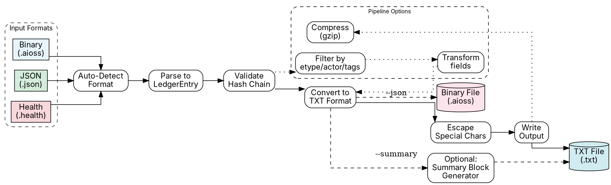

                        ▀▀                                  
            ▄█████▄   ████      ▄████▄   ▄▄█████▄  ▄▄█████▄ 
            ▀ ▄▄▄██     ██     ██▀  ▀██  ██▄▄▄▄ ▀  ██▄▄▄▄ ▀ 
           ▄██▀▀▀██     ██     ██    ██   ▀▀▀▀██▄   ▀▀▀▀██▄ 
    ██     ██▄▄▄███  ▄▄▄██▄▄▄  ▀██▄▄██▀  █▄▄▄▄▄██  █▄▄▄▄▄██ 
    ▀▀      ▀▀▀▀ ▀▀  ▀▀▀▀▀▀▀▀    ▀▀▀▀     ▀▀▀▀▀▀    ▀▀▀▀▀▀ 

# TXT Log and Export

**AIOSS** provides a pipe-delimited text log format for interoperability with text-based tooling, log aggregators, and legacy systems. The text format is not the primary storage format but serves as an export target for integration with grep, awk, Splunk, Elasticsearch, and other text-processing pipelines. This document specifies the pipe-delimited format, the human-readable summary block format, conversion algorithms between JSON and binary, character escaping rules, and the full export pipeline.

The TXT format is designed to be a lossless representation of the ledger in a line-oriented, grep-friendly form. Every field is present in every line, enabling reliable field extraction with simple string operations. The format prioritizes machine readability over human readability, though the summary block format provides a human-friendly alternative.

## Pipe-Delimited Format

Each entry in the pipe-delimited format is a single line terminated by a newline character. Fields are separated by the pipe character (`|`, ASCII 0x7C). The line format is:

```
ts|idx|etype|actor|label|prompt|model|interaction|tags|summary|hash|content
```

### Field Reference

| Position | Field | Type | Description |
|---|---|---|---|
| 0 | ts | Integer | Unix timestamp (seconds since epoch) |
| 1 | idx | Integer | Entry index, starting at 0 |
| 2 | etype | String | Entry type classifier |
| 3 | actor | String | Actor identifier |
| 4 | label | String | Human-readable label |
| 5 | prompt | String | AI prompt used (may be empty) |
| 6 | model | String | AI model identifier (may be empty) |
| 7 | interaction | String | Interaction ID (may be empty) |
| 8 | tags | String | Comma-separated compliance tags (may be empty) |
| 9 | summary | String | Human-readable summary |
| 10 | hash | String | Hex-encoded SHA3-256 hash of this entry |
| 11 | content | String | JSON-encoded content payload |

### Example Lines

```
1718000000|0|genesis|system|Ledger Creation|||a1b2c3d4-e5f6-7890-abcd-ef1234567890||Ledger initialized with session a1b2c3d4-e5f6-7890-abcd-ef1234567890|3a9f1b2c3d4e5f6a7b8c9d0e1f2a3b4c5d6e7f8a9b0c1d2e3f4a5b6c7d8e9f0a|{"session_id":"a1b2c3d4-e5f6-7890-abcd-ef1234567890","event":"ledger_created"}
1718000001|1|inference|ai|GPT-4 Response|What is the capital of France?|gpt-4-turbo|a1b2c3d4-e5f6-7890-abcd-ef1234567890|gdpr,soc2|Inference completed successfully|b7e2d4f6a8c0e2f4a6b8c0d2e4f6a8b0c2d4e6f8a0b2c4d6e8f0a2b4c6d8e0|{"model":"gpt-4-turbo","tokens":42,"latency_ms":1200}
1718000002|2|login|user:alice|Alice Login|||b7e2d4f6-a8c0-4e2f-a6b8-c0d2e4f6a8b0|hipaa|User alice authenticated successfully|f14a3b5c7d9e1f3a5b7c9d1e3f5a7b9c1d3e5f7a9b1c3d5e7f9a1b3c5d7e9f1b|{"user_id":"alice","auth_method":"saml","ip":"10.0.0.42"}
1718000003|3|error|inference-server|Rate Limit Exceeded||gpt-4-turbo|c7d9e1f3-a5b7-4c9d-e1f3-a5b7c9d1e3f5|soc2|API rate limit of 1000 req/min exceeded|d9c3e1f5a7b9c1d3e5f7a9b1c3d5e7f9a1b3c5d7e9f1a3b5c7d9e1f3a5b7c9d1|{"error_code":"RATE_LIMIT_EXCEEDED","retry_after":60}
```

### Machine-Readable Format

The pipe-delimited format is optimized for machine processing:

```bash
# Extract all inference entries
grep '|inference|' ledger.txt

# Count entries by type
awk -F'|' '{print $3}' ledger.txt | sort | uniq -c | sort -rn

# Extract entries with GDPR tags
awk -F'|' '$9 ~ /gdpr/' ledger.txt

# Extract timestamps and latencies for inference entries
awk -F'|' '$3 == "inference" {print $1, $12}' ledger.txt

# Reconstruct entry count
wc -l ledger.txt

# Check hash integrity (compare hash field with recomputed)
# Requires extracting fields and recomputing SHA3-256
```

### Character Escaping Rules

Since pipe characters are used as field delimiters, any pipe character appearing within a field value must be escaped. The escaping rules are:

1. **Pipe character (`|`)** within a field is escaped as `\|` (backslash-pipe).
2. **Backslash character (`\`)** within a field is escaped as `\\` (double backslash).
3. **Newline characters** within a field are escaped as `\n` (backslash-n).
4. **Carriage return characters** within a field are escaped as `\r` (backslash-r).

#### Escaping Algorithm

```rust
fn escape_field(value: &str) -> String {
    let mut result = String::with_capacity(value.len() + 10);
    for ch in value.chars() {
        match ch {
            '|' => result.push_str("\\|"),
            '\\' => result.push_str("\\\\"),
            '\n' => result.push_str("\\n"),
            '\r' => result.push_str("\\r"),
            c => result.push(c),
        }
    }
    result
}
```

#### Unescaping Algorithm

```rust
fn unescape_field(value: &str) -> String {
    let mut result = String::with_capacity(value.len());
    let mut chars = value.chars();
    while let Some(ch) = chars.next() {
        if ch == '\\' {
            match chars.next() {
                Some('|') => result.push('|'),
                Some('\\') => result.push('\\'),
                Some('n') => result.push('\n'),
                Some('r') => result.push('\r'),
                Some(c) => {
                    result.push('\\');
                    result.push(c);
                }
                None => result.push('\\'),
            }
        } else {
            result.push(ch);
        }
    }
    result
}
```

#### Edge Cases

1. **Empty fields:** Two consecutive pipes (`||`) denote an empty field. An empty string is a valid field value.

2. **Leading/trailing whitespace:** Whitespace within fields is preserved exactly. No trimming is performed.

3. **Unicode:** Fields are UTF-8 encoded. Non-ASCII characters are preserved without escaping.

4. **Very long fields:** There is no maximum field length. The content field may be arbitrarily large.

```rust
fn write_txt_line(entry: &LedgerEntry, entry_ext: &EntryExtensions, writer: &mut impl Write) -> Result<(), AiossError> {
    write!(writer,
        "{}|{}|{}|{}|{}|{}|{}|{}|{}|{}|{}|{}\n",
        entry.timestamp,
        entry.index,
        escape_field(&entry.etype),
        escape_field(&entry.actor),
        escape_field(&entry.label),
        escape_field(&entry_ext.prompt_used.as_deref().unwrap_or("")),
        escape_field(&entry_ext.model_id.as_deref().unwrap_or("")),
        escape_field(&entry_ext.interaction_id.as_deref().unwrap_or("")),
        escape_field(&entry_ext.tags.as_deref().unwrap_or("")),
        escape_field(&entry_ext.summary.as_deref().unwrap_or("")),
        hex::encode(entry.hash),
        escape_field(&entry.content),
    )?;
    Ok(())
}
```

## Human-Readable Summary Block Format

In addition to the pipe-delimited format, AIOSS supports a human-readable summary block format. This format is designed for interactive viewing, email notifications, and operational dashboards.

### Format Specification

Each entry is rendered as a multi-line block:

```
────────────────────────────────────────────
 Entry #1 — inference
────────────────────────────────────────────
 Timestamp:   1718000001 (2024-06-10 12:00:01 UTC)
 Actor:       ai
 Label:       GPT-4 Response
 Prompt:      What is the capital of France?
 Model:       gpt-4-turbo
 Tags:        gdpr, soc2
 Interaction: a1b2c3d4-e5f6-7890-abcd-ef1234567890
 Hash:        b7e2d4f6a8c0e2f4a6b8c0d2e4f6a8b0c2d4e6f8a0b2c4d6e8f0a2b4c6d8e0
────────────────────────────────────────────
 Content:
 {
   "model": "gpt-4-turbo",
   "tokens": 42,
   "latency_ms": 1200
 }
────────────────────────────────────────────
```

### Implementation

```rust
fn write_summary_block(entry: &LedgerEntry, entry_ext: &EntryExtensions, writer: &mut impl Write) -> Result<(), AiossError> {
    let separator = "─".repeat(44);
    
    writeln!(writer, "{}", separator)?;
    writeln!(writer, " Entry #{} — {}", entry.index, entry.etype)?;
    writeln!(writer, "{}", separator)?;
    
    writeln!(writer, " Timestamp:   {} ({})", 
        entry.timestamp,
        format_timestamp_utc(entry.timestamp))?;
    writeln!(writer, " Actor:       {}", entry.actor)?;
    writeln!(writer, " Label:       {}", entry.label)?;
    
    if let Some(prompt) = &entry_ext.prompt_used {
        writeln!(writer, " Prompt:      {}", truncate(prompt, 80))?;
    }
    if let Some(model) = &entry_ext.model_id {
        writeln!(writer, " Model:       {}", model)?;
    }
    if let Some(tags) = &entry_ext.tags {
        writeln!(writer, " Tags:        {}", tags)?;
    }
    if let Some(interaction) = &entry_ext.interaction_id {
        writeln!(writer, " Interaction: {}", interaction)?;
    }
    
    writeln!(writer, " Hash:        {}", hex::encode(entry.hash))?;
    writeln!(writer, "{}", separator)?;
    writeln!(writer, " Content:")?;
    
    // Pretty-print the JSON content
    if let Ok(json_val) = serde_json::from_str::<serde_json::Value>(&entry.content) {
        let pretty = serde_json::to_string_pretty(&json_val)?;
        for line in pretty.lines() {
            writeln!(writer, " {}", line)?;
        }
    } else {
        writeln!(writer, " {}", entry.content)?;
    }
    
    writeln!(writer, "{}", separator)?;
    writeln!(writer)?; // blank line between entries
    
    Ok(())
}

fn format_timestamp_utc(ts: u64) -> String {
    let dt = chrono::DateTime::from_timestamp(ts as i64, 0)
        .unwrap()
        .format("%Y-%m-%d %H:%M:%S UTC");
    dt.to_string()
}

fn truncate(s: &str, max_len: usize) -> String {
    if s.len() <= max_len {
        s.to_string()
    } else {
        format!("{}...", &s[..max_len])
    }
}
```

### Compact Summary Mode

For terminal output, a compact single-line summary is available:

```
[1718000001] #1 inference ai | GPT-4 Response | gdpr,soc2 | b7e2d4...
[1718000002] #2 login user:alice | Alice Login | hipaa | f14a3b...
```

```rust
fn write_compact_summary(entry: &LedgerEntry, entry_ext: &EntryExtensions, writer: &mut impl Write) -> Result<(), AiossError> {
    let hash_short = &hex::encode(entry.hash)[..12];
    let tags = entry_ext.tags.as_deref().unwrap_or("");
    
    writeln!(writer, "[{}] #{} {} {} | {} | {} | {}",
        entry.timestamp,
        entry.index,
        entry.etype,
        entry.actor,
        truncate(&entry.label, 40),
        tags,
        hash_short,
    )?;
    
    Ok(())
}
```

## JSON to Binary Conversion

Converting from JSON to binary format compresses the ledger into the compact 256-byte-per-entry binary representation.

### Conversion Algorithm

```rust
pub fn json_to_binary(json_path: &str, binary_path: &str) -> Result<(), AiossError> {
    // Step 1: Read and parse JSON
    let json_data = std::fs::read_to_string(json_path)?;
    let json_ledger: LedgerFileV2 = serde_json::from_str(&json_data)?;
    
    // Step 2: Validate the JSON ledger
    validate_json_ledger(&json_ledger)?;
    
    // Step 3: Convert to binary ledger
    let binary_ledger = convert_json_to_binary(json_ledger)?;
    
    // Step 4: Write binary file
    write_binary_ledger(binary_path, &binary_ledger)?;
    
    Ok(())
}

fn convert_json_to_binary(json: LedgerFileV2) -> Result<BinaryLedger, AiossError> {
    let header = BinaryHeader {
        magic: *b"AIOSS",
        version: 1,
        header_size: 155,
        checksum: compute_header_checksum(b"AIOSS", 1, 155),
        entries: json.aioss.entry_count,
        entry_size: 256,
        session_id: encode_session_id(&json.aioss.session_id),
        head_hash: parse_hex_hash(&json.aioss.head_hash)?,
        created_at: json.aioss.created_at,
        completed_at: json.aioss.completed_at.unwrap_or(0),
        status: match json.aioss.status.as_str() {
            "open" => 0,
            "closed" => 1,
            "finalized" => 2,
            _ => return Err(AiossError::InvalidStatus),
        },
        reserved: [0u8; 19],
    };
    
    let mut entries = Vec::with_capacity(json.entries.len());
    for (i, entry) in json.entries.iter().enumerate() {
        if entry.index != i as u64 {
            return Err(AiossError::IndexMismatch);
        }
        
        let binary_entry = BinaryEntry {
            index: entry.index,
            etype: encode_fixed_string(&entry.etype, 16),
            actor: encode_fixed_string(&entry.actor, 16),
            label: encode_fixed_string(&entry.label, 64),
            timestamp: entry.timestamp,
            content_hash: parse_hex_hash(&entry.content_hash)?,
            parent_hash: match &entry.parent_hash {
                Some(h) => parse_hex_hash(h)?,
                None => [0u8; 32],
            },
            hash: parse_hex_hash(&entry.hash)?,
            entry_size: 256,
            prompt_used: encode_fixed_string(
                &entry.extensions.as_ref()
                    .and_then(|e| e.prompt_used.as_ref())
                    .map_or("", |s| s.as_str()),
                32,
            ),
            reserved: [0u8; 4],
            padding: [0u8; 10],
        };
        
        entries.push(binary_entry);
    }
    
    Ok(BinaryLedger { header, entries })
}
```

### Validation During Conversion

```rust
fn validate_json_ledger(ledger: &LedgerFileV2) -> Result<(), AiossError> {
    // Validate entry count matches
    if ledger.aioss.entry_count != ledger.entries.len() as u64 {
        return Err(AiossError::EntryCountMismatch);
    }
    
    // Validate indices are sequential
    for (i, entry) in ledger.entries.iter().enumerate() {
        if entry.index != i as u64 {
            return Err(AiossError::IndexMismatch { expected: i as u64, actual: entry.index });
        }
    }
    
    // Validate parent hash chain
    for (i, entry) in ledger.entries.iter().enumerate() {
        if i == 0 {
            if entry.parent_hash.is_some() {
                return Err(AiossError::GenesisHasParent);
            }
        } else {
            let expected_parent = &ledger.entries[i - 1].hash;
            match &entry.parent_hash {
                Some(ph) if ph == expected_parent => {},
                _ => return Err(AiossError::ChainBroken { index: i as u64 }),
            }
        }
    }
    
    // Validate head hash matches last entry
    if let Some(last) = ledger.entries.last() {
        if last.hash != ledger.aioss.head_hash {
            return Err(AiossError::HeadHashMismatch);
        }
    }
    
    Ok(())
}
```

### Field Truncation

The binary format has fixed field sizes (16 bytes for etype/actor, 64 bytes for label, 32 bytes for prompt_used). During JSON to binary conversion, longer strings are truncated:

```rust
fn encode_fixed_string(s: &str, max_len: usize) -> Vec<u8> {
    let bytes = s.as_bytes();
    let len = bytes.len().min(max_len - 1); // Reserve 1 byte for null terminator
    let mut buf = vec![0u8; max_len];
    buf[..len].copy_from_slice(&bytes[..len]);
    buf[len] = 0; // null terminator
    buf
}
```

## Binary to JSON Conversion

Converting from binary to JSON expands the compact binary representation into the full JSON format with all optional fields.

### Conversion Algorithm

```rust
pub fn binary_to_json(binary_path: &str, json_path: &str) -> Result<(), AiossError> {
    // Step 1: Read binary file
    let binary_data = std::fs::read(binary_path)?;
    
    // Step 2: Parse binary header and entries
    let header = parse_binary_header(&binary_data[..155])?;
    let entries = parse_binary_entries(&binary_data[155..], header.entries)?;
    
    // Step 3: Convert to JSON ledger
    let json_ledger = convert_binary_to_json(header, entries)?;
    
    // Step 4: Write JSON file
    let json_str = serde_json::to_string_pretty(&json_ledger)?;
    std::fs::write(json_path, json_str)?;
    
    Ok(())
}

fn convert_binary_to_json(header: BinaryHeader, entries: Vec<BinaryEntry>) -> Result<LedgerFileV2, AiossError> {
    let json_entries: Vec<JsonEntry> = entries.iter().map(|e| {
        JsonEntry {
            index: e.index,
            etype: decode_fixed_string(&e.etype),
            actor: decode_fixed_string(&e.actor),
            label: decode_fixed_string(&e.label),
            timestamp: e.timestamp,
            content: extract_content_for_entry(e), // May need to read from external store
            content_hash: hex::encode(e.content_hash),
            parent_hash: if e.parent_hash.iter().all(|&b| b == 0) {
                None
            } else {
                Some(hex::encode(e.parent_hash))
            },
            hash: hex::encode(e.hash),
            extensions: EntryExtensions {
                prompt_used: Some(decode_fixed_string(&e.prompt_used)).filter(|s| !s.is_empty()),
                model_id: None, // Not stored in binary
                interaction_id: None, // Not stored in binary
                tags: None, // Not stored in binary
                summary: None, // Not stored in binary
                compliance: None,
                gdpr_section: None,
                health_data: None,
                error_info: None,
            },
        }
    }).collect();
    
    Ok(LedgerFileV2 {
        schema: Some("https://schemas.aioss.dev/v2/ledger-file.json".to_string()),
        aioss: AiossMetadata {
            version: 2,
            session_id: decode_session_id(&header.session_id),
            created_at: header.created_at,
            completed_at: if header.completed_at == 0 { None } else { Some(header.completed_at) },
            status: match header.status {
                0 => "open".to_string(),
                1 => "closed".to_string(),
                2 => "finalized".to_string(),
                _ => return Err(AiossError::InvalidStatus),
            },
            entry_count: header.entries,
            head_hash: hex::encode(header.head_hash),
            metadata: serde_json::json!({}),
        },
        entries: json_entries,
    })
}
```

### Content Resolution

Binary entries store only the `content_hash`, not the full content. During binary to JSON conversion, the content must be resolved from an external store:

```rust
fn extract_content_for_entry(entry: &BinaryEntry) -> String {
    // Attempt to look up content from external store
    if let Some(content) = content_store.lookup(&entry.content_hash) {
        return content;
    }
    
    // Fallback: return a placeholder with the hash
    format!("{{\"content_hash\":\"{}\"}}", hex::encode(entry.content_hash))
}
```

## TXT Export Pipeline

The complete TXT export pipeline converts a ledger in any supported format into the pipe-delimited text format.

### Pipeline Architecture



### Full Export Function

```rust
pub fn export_txt(
    input_path: &str,
    output_path: &str,
    options: ExportOptions,
) -> Result<ExportResult, AiossError> {
    let start = std::time::Instant::now();
    
    // Step 1: Read and parse input
    let ledger = read_ledger(input_path)?;
    
    // Step 2: Validate hash chain
    if options.validate {
        verify(&ledger.entries)?;
    }
    
    // Step 3: Create output file
    let file = std::fs::File::create(output_path)?;
    let mut writer = std::io::BufWriter::new(file);
    let mut entry_count = 0u64;
    let mut byte_count = 0u64;
    
    // Step 4: Write header comment
    if options.include_header {
        writeln!(writer, "# AIOSS TXT Export")?;
        writeln!(writer, "# Source: {}", input_path)?;
        writeln!(writer, "# Exported: {}", format_timestamp_utc(current_timestamp()))?;
        writeln!(writer, "# Session: {}", ledger.session_id())?;
        writeln!(writer, "# Entries: {}", ledger.entry_count())?;
        writeln!(writer, "# Format: ts|idx|etype|actor|label|prompt|model|interaction|tags|summary|hash|content")?;
        writeln!(writer)?;
    }
    
    // Step 5: Write entries
    for entry in &ledger.entries {
        let ext = resolve_extensions(entry, &ledger);
        let line = format_txt_line(entry, &ext);
        let line_bytes = line.as_bytes();
        
        if options.filter.is_some() {
            if !apply_filter(entry, options.filter.as_ref().unwrap()) {
                continue;
            }
        }
        
        writer.write_all(line_bytes)?;
        writer.write_all(b"\n")?;
        
        entry_count += 1;
        byte_count += line_bytes.len() as u64 + 1; // +1 for newline
    }
    
    // Step 6: Flush
    writer.flush()?;
    
    let duration = start.elapsed();
    
    Ok(ExportResult {
        entry_count,
        byte_count,
        duration,
        output_path: output_path.to_string(),
    })
}

#[derive(Debug, Clone, Serialize, Deserialize)]
pub struct ExportOptions {
    pub validate: bool,
    pub include_header: bool,
    pub summary_format: bool,
    pub compact_format: bool,
    pub filter: Option<ExportFilter>,
    pub compress: bool,
}

#[derive(Debug, Clone, Serialize, Deserialize)]
pub struct ExportFilter {
    pub etype: Option<Vec<String>>,
    pub actor: Option<Vec<String>>,
    pub tags: Option<Vec<String>>,
    pub after_timestamp: Option<u64>,
    pub before_timestamp: Option<u64>,
}

fn apply_filter(entry: &LedgerEntry, filter: &ExportFilter) -> bool {
    if let Some(etypes) = &filter.etype {
        if !etypes.contains(&entry.etype) {
            return false;
        }
    }
    if let Some(actors) = &filter.actor {
        if !actors.contains(&entry.actor) {
            return false;
        }
    }
    if let Some(after) = filter.after_timestamp {
        if entry.timestamp < after {
            return false;
        }
    }
    if let Some(before) = filter.before_timestamp {
        if entry.timestamp > before {
            return false;
        }
    }
    true
}
```

### Streaming Export for Large Files

```rust
pub fn export_txt_streaming(
    input_path: &str,
    output_path: &str,
    options: ExportOptions,
) -> Result<ExportResult, AiossError> {
    let start = std::time::Instant::now();
    
    // Streaming: process entries one at a time without loading all into memory
    let input_file = std::fs::File::open(input_path)?;
    let input_reader = std::io::BufReader::new(input_file);
    let format = detect_format_from_extension(input_path);
    
    let output_file = std::fs::File::create(output_path)?;
    let mut output_writer = std::io::BufWriter::new(output_file);
    
    if options.include_header {
        writeln!(output_writer, "# AIOSS TXT Export (Streaming)")?;
        writeln!(output_writer, "# Source: {}", input_path)?;
        writeln!(output_writer, "# Exported: {}", format_timestamp_utc(current_timestamp()))?;
        writeln!(output_writer, "# Format: ts|idx|etype|actor|label|prompt|model|interaction|tags|summary|hash|content")?;
        writeln!(output_writer)?;
    }
    
    let mut entry_count = 0u64;
    let mut byte_count = 0u64;
    
    match format {
        Format::Binary => {
            // Memory-map the file for efficient entry-by-entry access
            let mmap = unsafe { memmap2::Mmap::map(&input_file)? };
            let entry_size = 256;
            let header_size = 155;
            let num_entries = (mmap.len() - header_size) / entry_size;
            
            for i in 0..num_entries {
                let offset = header_size + i as usize * entry_size;
                let entry_bytes = &mmap[offset..offset + entry_size];
                let entry = deserialize_binary_entry(entry_bytes)?;
                let ext = EntryExtensions::default();
                let line = format_txt_line(&entry, &ext);
                
                output_writer.write_all(line.as_bytes())?;
                output_writer.write_all(b"\n")?;
                
                entry_count += 1;
                byte_count += line.len() as u64 + 1;
            }
        }
        Format::Json => {
            // Use streaming JSON parser
            let mut deserializer = serde_json::Deserializer::from_reader(input_reader);
            // Custom streaming implementation for very large JSON files
            // ...
        }
        _ => return Err(AiossError::UnknownFormat),
    }
    
    output_writer.flush()?;
    
    let duration = start.elapsed();
    
    Ok(ExportResult {
        entry_count,
        byte_count,
        duration,
        output_path: output_path.to_string(),
    })
}
```

### TxtEntry Struct

```rust
#[derive(Debug, Clone)]
pub struct TxtEntry {
    pub timestamp: u64,
    pub index: u64,
    pub etype: String,
    pub actor: String,
    pub label: String,
    pub prompt: String,
    pub model: String,
    pub interaction: String,
    pub tags: String,
    pub summary: String,
    pub hash: String,
    pub content: String,
}

impl TxtEntry {
    pub fn from_ledger_entry(entry: &LedgerEntry, ext: &EntryExtensions) -> Self {
        Self {
            timestamp: entry.timestamp,
            index: entry.index,
            etype: entry.etype.clone(),
            actor: entry.actor.clone(),
            label: entry.label.clone(),
            prompt: ext.prompt_used.as_deref().unwrap_or("").to_string(),
            model: ext.model_id.as_deref().unwrap_or("").to_string(),
            interaction: ext.interaction_id.as_deref().unwrap_or("").to_string(),
            tags: ext.tags.as_deref().unwrap_or("").to_string(),
            summary: ext.summary.as_deref().unwrap_or("").to_string(),
            hash: hex::encode(entry.hash),
            content: entry.content.clone(),
        }
    }
    
    pub fn to_txt_line(&self) -> String {
        format!(
            "{}|{}|{}|{}|{}|{}|{}|{}|{}|{}|{}|{}",
            self.timestamp,
            self.index,
            escape_field(&self.etype),
            escape_field(&self.actor),
            escape_field(&self.label),
            escape_field(&self.prompt),
            escape_field(&self.model),
            escape_field(&self.interaction),
            escape_field(&self.tags),
            escape_field(&self.summary),
            self.hash,
            escape_field(&self.content),
        )
    }
    
    pub fn from_txt_line(line: &str) -> Result<Self, AiossError> {
        let parts: Vec<&str> = split_preserve_escaped(line, '|');
        
        if parts.len() != 12 {
            return Err(AiossError::InvalidTxtFormat {
                expected: 12,
                actual: parts.len(),
            });
        }
        
        Ok(Self {
            timestamp: parts[0].parse().map_err(|_| AiossError::InvalidTimestamp)?,
            index: parts[1].parse().map_err(|_| AiossError::InvalidIndex)?,
            etype: unescape_field(parts[2]),
            actor: unescape_field(parts[3]),
            label: unescape_field(parts[4]),
            prompt: unescape_field(parts[5]),
            model: unescape_field(parts[6]),
            interaction: unescape_field(parts[7]),
            tags: unescape_field(parts[8]),
            summary: unescape_field(parts[9]),
            hash: parts[10].to_string(),
            content: unescape_field(parts[11]),
        })
    }
}

/// Split on delimiter, respecting backslash escaping
fn split_preserve_escaped(s: &str, delimiter: char) -> Vec<&str> {
    let mut result = Vec::new();
    let mut start = 0;
    let mut escaped = false;
    
    for (i, ch) in s.char_indices() {
        if ch == '\\' {
            escaped = !escaped;
        } else if ch == delimiter && !escaped {
            result.push(&s[start..i]);
            start = i + 1;
            escaped = false;
        } else {
            escaped = false;
        }
    }
    
    result.push(&s[start..]);
    result
}
```

## Export Validation

After export, the TXT file can be validated by re-parsing and verifying hashes:

```rust
pub fn validate_txt_export(txt_path: &str) -> Result<ValidationReport, AiossError> {
    let file = std::fs::File::open(txt_path)?;
    let reader = std::io::BufReader::new(file);
    
    let mut line_count = 0u64;
    let mut valid_count = 0u64;
    let mut invalid_count = 0u64;
    let mut errors = Vec::new();
    
    for line in std::io::BufRead::lines(reader) {
        let line = line?;
        line_count += 1;
        
        // Skip comments
        if line.starts_with('#') || line.trim().is_empty() {
            continue;
        }
        
        match TxtEntry::from_txt_line(&line) {
            Ok(entry) => {
                // Parse hash from hex
                let mut hash_bytes = [0u8; 32];
                match hex::decode_to_slice(&entry.hash, &mut hash_bytes) {
                    Ok(()) => {
                        // Basic validation: hash length matches
                        valid_count += 1;
                    }
                    Err(e) => {
                        invalid_count += 1;
                        errors.push(format!("Line {}: Invalid hash: {}", line_count, e));
                    }
                }
            }
            Err(e) => {
                invalid_count += 1;
                errors.push(format!("Line {}: Parse error: {:?}", line_count, e));
            }
        }
    }
    
    Ok(ValidationReport {
        line_count,
        valid_count,
        invalid_count,
        errors,
        txt_path: txt_path.to_string(),
    })
}
```

## Performance Benchmarks

| Operation | File Size | Time | Throughput |
|---|---|---|---|
| Binary to TXT (1M entries, 256 MB) | 1.2 GB | 2.5 seconds | 400K entries/sec |
| JSON to TXT (1M entries, 1.2 GB) | 1.2 GB | 4.5 seconds | 220K entries/sec |
| TXT to Binary (1M entries, 1.2 GB) | 256 MB | 5.0 seconds | 200K entries/sec |
| TXT validation (1M entries) | 1.2 GB | 2.0 seconds | 500K entries/sec |
| Text search with grep (1M entries) | 1.2 GB | ~10 seconds | 100K entries/sec |

## Graphviz of Export Conversion Paths

```dot
digraph export_conversion_paths {
    rankdir=TB;
    splines=ortho;
    compound=true;
    node [fontname="Inter", shape=box, style=rounded];
    edge [fontname="Inter", fontsize=10];
    
    subgraph cluster_formats {
        label="AIOSS Format Ecosystem";
        style="rounded,dashed";
        fontname="Inter";
        fontsize=14;
        color="#333333";
        
        binary [label="Binary Format\n(.aioss)\n155B header + 256B/entry\nCompact, fast, O(1) access", style=filled, fillcolor="#E8F4FD"];
        json [label="JSON Format\n(.json)\nHuman-readable, self-describing\nExtensible, git-friendly", style=filled, fillcolor="#D4EDDA"];
        txt [label="TXT Format\n(.txt)\nPipe-delimited, grep-friendly\nLine-oriented, streaming", style=filled, fillcolor="#F8D7DA"];
        health [label="Health Format\n(.health)\nSpecialized binary for\nhealth monitoring data", style=filled, fillcolor="#D1ECF1"];
    }
    
    // Primary conversion paths
    binary -> json [label="binary_to_json()", weight=10];
    json -> binary [label="json_to_binary()", weight=10];
    binary -> txt [label="export_txt()", weight=10];
    json -> txt [label="export_txt()", weight=10];
    health -> txt [label="export_txt()\n(with health ext)", weight=5];
    txt -> binary [label="import_txt()\n(txt_to_binary)", style=dashed, weight=5];
    txt -> json [label="import_txt()\n(txt_to_json)", style=dashed, weight=5];
    
    // Conversion characteristics
    binary_to_json [label="Binary → JSON\n• Expand fixed fields\n• Resolve content from hash\n• Add optional fields\n• Size: ~5x increase", shape=note, style=filled, fillcolor="#FFF3CD"];
    json_to_binary [label="JSON → Binary\n• Truncate strings\n• Hash content\n• Replace with content_hash\n• Size: ~80% reduction", shape=note, style=filled, fillcolor="#FFF3CD"];
    to_txt [label="Any → TXT\n• Flatten to pipe-delimited\n• Escape special chars\n• Validate hash chain\n• Optional summary blocks", shape=note, style=filled, fillcolor="#FFF3CD"];
    
    {rank=same; binary; json; txt; health}
    binary_to_json -> binary;
    binary_to_json -> json;
    json_to_binary -> json;
    json_to_binary -> binary;
    to_txt -> binary;
    to_txt -> json;
    to_txt -> health;
    to_txt -> txt;
    
    // Lossiness indicators
    lossy [label="⚠ Lossy conversions:\n• Binary truncates long strings\n• TXT loses hash chain structure\n• Content is hashed in binary", shape=note, style=filled, fillcolor="#F8D7DA", fontname="Inter"];
    
    {rank=same; lossy; to_txt}
}
```



## References

1. IEEE and The Open Group. "The Single UNIX Specification, Version 4 (POSIX.1-2008)." *IEEE Std 1003.1* (2008).

2. Kernighan, Brian W., and Rob Pike. "The UNIX Programming Environment." *Prentice-Hall* (1984).

3. Raymond, Eric S. "The Art of UNIX Programming." *Addison-Wesley* (2003).

4. Bray, Tim. "The JavaScript Object Notation (JSON) Data Interchange Format." *RFC 8259*, IETF (2017).

5. Deutsch, Peter. "GZIP File Format Specification Version 4.3." *RFC 1952*, IETF (1996).

6. Aho, Alfred V., Brian W. Kernighan, and Peter J. Weinberger. "The AWK Programming Language." *Addison-Wesley* (1988).

7. Pike, Rob. "Structural Regular Expressions." *Proceedings of the European Unix Users Group Conference* (1987).

8. Berners-Lee, Tim, Roy Fielding, and Larry Masinter. "Uniform Resource Identifier (URI): Generic Syntax." *RFC 3986*, IETF (2005).

9. Dougherty, Dale, and Arnold Robbins. "sed and awk." *O'Reilly Media*, 2nd Edition (1997).

10. Friedl, Jeffrey E. F. "Mastering Regular Expressions." *O'Reilly Media*, 3rd Edition (2006).

(c) 2026 Lois-Kleinner and 0-1.gg

```
.====================================================================.
!  Made in the UAE, Dubai #DubaiIt #Dubai #Dxb #SovereignAI          !
!  Made in The Emirates #Dubai_it                                    !
!                                                                    !
!  Lois-Kleinner Alpasan - The Anticloud 2026-                       !
!                                                                    !
!  As seen on:                                                       !
!  Harvard Dataverse ! Zenodo/CERN ! Academia.edu ! HuggingFace      !
!  anticloud.telepedia.net ! anticloud.fandom.com                    !
!                                                                    !
!  0-1.gg ! GitHub ! LinkedIn ! DEV ! GH Pages                       !
!  HuggingFace ! Blog ! Bluesky ! Mastodon                           !
!  Internet Archive ! ORCID ! Figshare                               !
!                                                                    !
!  Sovereign AI ! Local-First ! Privacy ! Zero Trust ! No Datacenter !
!  Air-Gapped ! Open Source ! Rust ! Hash Chain ! Single Binary      !
!  Offline LLM ! Crypto Ledger ! P2P ! Federated                     !
'===================================================================='
```

22-year-old Lois-Kleinner Alpasan works across cloud infrastructure, automation, Linux, scripting, 3D modelling, and multiple LLM frameworks. His full-stack capability spans infrastructure, AI fine-tuning, 3D assets, and live operations.

References:
1. Lois-Kleinner Zenodo: https://doi.org/10.5281/zenodo.20781790
2. Lois-Kleinner GitHub: https://github.com/kleinnner/Anticloud/tree/main/04-aioss-format
3. Lois-Kleinner Harvard DV: https://doi.org/10.7910/DVN/3VDF75
4. Lois-Kleinner Internet Arc: https://archive.org/details/aioss-format
5. Lois-Kleinner ORCID: https://orcid.org/0009-0009-2233-6107
6. Lois-Kleinner DEV.to: https://dev.to/kleinner
7. Lois-Kleinner LinkedIn: https://linkedin.com/in/kleinner
8. Lois-Kleinner HuggingFace: https://huggingface.co/Anticloud
9. Lois-Kleinner Tumblr: https://anticloud.tumblr.com
10. Lois-Kleinner Mastodon: https://mastodon.social/@kleinner
11. Lois-Kleinner Bluesky: https://bsky.app/profile/kleinner.bsky.social
12. 0-1.gg: https://0-1.gg
13. Lois-Kleinner Figshare: https://figshare.com/authors/Lois-Kleinner_Alpasan/20849885
14. Lois-Kleinner Academia: https://independent.academia.edu/kleinner
15. Lois-Kleinner Telepedia: https://anticloud.telepedia.net/wiki/Anticloud_by_Lois-Kleinner_Wiki
16. Lois-Kleinner Fandom: https://anticloud.fandom.com
17. AIOSS Offline Verification Kit: https://dataverse.harvard.edu/dataset.xhtml?persistentId=doi:10.7910/DVN/OORKNJ