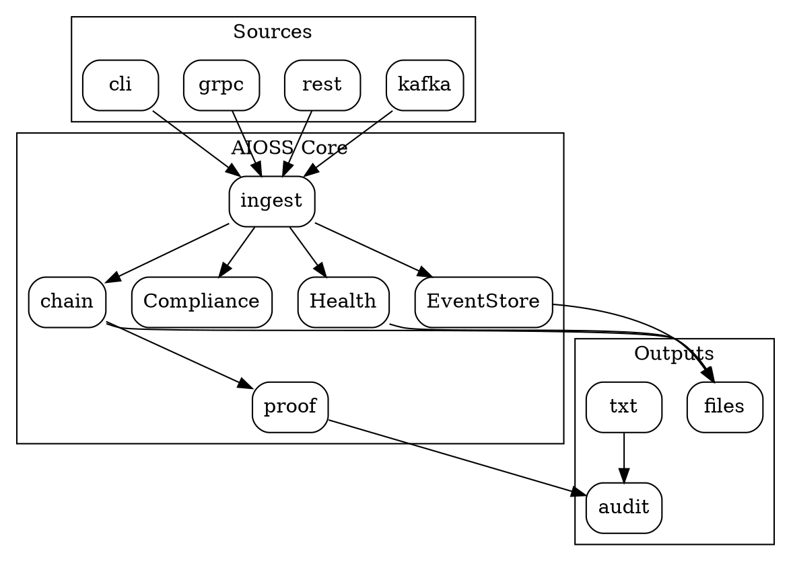

                        ¯¯                                  
            _¦¦¦¦¦_   ¦¦¦¦      _¦¦¦¦_   __¦¦¦¦¦_  __¦¦¦¦¦_ 
            ¯ ___¦¦     ¦¦     ¦¦¯  ¯¦¦  ¦¦____ ¯  ¦¦____ ¯ 
           _¦¦¯¯¯¦¦     ¦¦     ¦¦    ¦¦   ¯¯¯¯¦¦_   ¯¯¯¯¦¦_ 
    ¦¦     ¦¦___¦¦¦  ___¦¦___  ¯¦¦__¦¦¯  ¦_____¦¦  ¦_____¦¦ 
    ¯¯      ¯¯¯¯ ¯¯  ¯¯¯¯¯¯¯¯    ¯¯¯¯     ¯¯¯¯¯¯    ¯¯¯¯¯¯ 

# Developer's Guide to AIOSS


Comprehensive documentation for integrating AIOSS into your applications.

---

## 1. CLI Command Reference

The `aioss` binary provides 10 commands for managing hash-chained ledgers.

### 1.1 `aioss init`
Initialize a new ledger.
```bash
aioss init [DIR] [OPTIONS]
```
| Argument | Default | Description |
|---|---|---|
| `dir` | `./data/ledger` | Output directory |
| `-u, --user` | `system_sovereign` | User name |
| `-f, --format` | `json` | `json` or `binary` |

### 1.2 `aioss append`
Append an entry to an existing ledger.
```bash
aioss append <FILE> [OPTIONS]
```
Flags: --type (required), --actor, --label, --content, --content-from-stdin, --prompt, --model, --interaction, --compliance, --summary

### 1.3 `aioss verify`
Verify hash chain integrity.
```bash
aioss verify <FILE> [OPTIONS]
```
Flags: --verbose

### 1.4 `aioss analyze`
Analyze ledger statistics.
```bash
aioss analyze <FILE> [OPTIONS]
```
Flags: --json

### 1.5 `aioss export`
Convert between formats.
```bash
aioss export <FILE> [OPTIONS]
```
Flags: --format (json/binary/txt), --output

### 1.6 `aioss log`
Continuous log writer from stdin.
```bash
aioss log <FILE> [OPTIONS]
```
Flags: --log-dir, --follow

### 1.7 `aioss proof`
Ed25519 state proof signing/verification.
```bash
aioss proof <FILE> [OPTIONS]
```
Flags: --action (sign/verify), --key, --public-key, --output

### 1.8 `aioss health`
Health diagnostic ledger. Subcommands: init, append, verify.
```bash
aioss health init [DIR]
aioss health append [OPTIONS]
aioss health verify [DIR]
```

### 1.9 `aioss compliance`
List compliance framework mappings.
```bash
aioss compliance [OPTIONS]
```
Flags: --category

### 1.10 `aioss migrate`
Import from external formats.
```bash
aioss migrate <SOURCE> [OPTIONS]
```
Flags: --from (jsonl/csv/txt), --output, --actor


---

## 2. Rust API Reference

### 2.1 Module Structure
The `aioss_core` crate exposes: types, hash_chain, crypto, json, binary, analyzer, health, event_store, txt_log, compliance.

### 2.2 Quick Start
```rust
use aioss_core::*;
use std::path::PathBuf;

fn main() -> anyhow::Result<()> {
    let mut writer = JsonLedgerWriter::new(&PathBuf::from("./ledger"), "dev")?;
    writer.append("msg", "user", "Alice", serde_json::json!({"text":"Hi"}),
        Some("Prompt".into()), Some("gpt-4".into()), None,
        Some(vec!["soc2".into()]), None)?;
    writer.close()?;
    let result = verify_chain(&writer.file.entries);
    assert!(result.verified);
    let (sk, vk) = generate_keypair();
    let mut proof = StateProof {
        head_hash: writer.file.head_hash.clone(),
        timestamp: chrono::Utc::now().to_rfc3339(),
        entry_count: writer.file.entry_count,
        session_id: writer.file.session_id.clone(),
        signature: None,
        public_key: public_key_to_base64(&vk),
        verified: false,
    };
    sign_state_proof(&sk, &mut proof)?;
    Ok(())
}
```

---

## 3. Integration Patterns

### 3.1 GitHub Actions
```yaml
name: AIOSS Verify
on: [push]
jobs:
  verify:
    runs-on: ubuntu-latest
    steps:
      - uses: actions/checkout@v4
      - run: curl -sSfL https://github.com/aioss/aioss-format/releases/latest/download/aioss-x86_64-linux.tar.gz | tar -xz && sudo mv aioss /usr/local/bin/
      - run: for f in $(find . -name '*.aioss'); do aioss verify "$f"; done
      - run: aioss compliance --category core
```

### 3.2 GitLab CI
```yaml
aioss-verify:
  stage: test
  image: aioss/aioss:latest
  script:
    - for f in $(find . -name '*.aioss'); do aioss verify "$f"; done
```

### 3.3 Kafka Integration
```rust
use aioss_core::*;
use rdkafka::consumer::{Consumer, StreamConsumer};
use tokio::sync::Mutex;
use std::sync::Arc;

let consumer: StreamConsumer = ClientConfig::new()
    .set("bootstrap.servers", "localhost:9092")
    .set("group.id", "aioss-ingest")
    .create()?;
consumer.subscribe(&["ai-audit-events"])?;

let writer = Arc::new(Mutex::new(
    JsonLedgerWriter::new(&PathBuf::from("./ledger"), "kafka")?));
```

### 3.4 REST API (axum)
```rust
use axum::{routing::post, Json, Router, extract::State, http::StatusCode};
use std::sync::Arc;
use tokio::sync::Mutex;

async fn append(State(s): State<Arc<Mutex<JsonLedgerWriter>>>, Json(p): Json<Value>) -> Result<Json<Value>, StatusCode> {
    let mut w = s.lock().await;
    let e = w.append("api","system","API",p,None,None,None,None,None).map_err(|_| StatusCode::INTERNAL_SERVER_ERROR)?;
    Ok(Json(json!({"idx": e.index, "hash": e.hash})))
}
```

---

## 4. Error Handling

| Error | Cause | Resolution |
|---|---|---|
| Data too short for header | File < 155 bytes | Not a valid binary .aioss |
| Not a valid .aioss binary | Magic mismatch | File may be JSON |
| --key is required for signing | Missing key | Provide --key |
| Key must be 64 bytes | Wrong key size | Ed25519 key is 64 bytes |
| Unknown format: {fmt} | Invalid --format | Use json/binary/txt |

```rust
use anyhow::{Context, Result};
fn safe_verify(path: &str) -> Result<()> {
    let data = std::fs::read(path).with_context(|| format!("Read fail: {}", path))?;
    match detect_format(&data) {
        FormatType::Json => {
            let f: LedgerFile = serde_json::from_slice(&data)?;
            println!("Verified: {}, entries: {}", verify_chain(&f.entries).verified, f.entries.len());
        }
        FormatType::Binary => {
            let (h, e) = BinaryLedgerWriter::read_binary(&PathBuf::from(path))?;
            println!("Binary: {} entries, head: {:02x?}", e.len(), h.head_hash[..4]);
        }
    }
    Ok(())
}
```

---

## 5. Performance Tips
- JSON flushes every 10 entries by default
- Binary: 256B fixed entries, O(1) random access
- Verify is O(n): 10K entries in ~500ms (JSON), ~200ms (binary)
- Batch flush every 100-1000 entries for optimal I/O
- Single-writer, multiple-reader safe. Use Mutex for multi-writer.
- Works on NTFS, ext4, NFS, S3, any filesystem

| Scenario | Format | Reason |
|---|---|---|
| Human review | JSON | Self-describing |
| High volume | Binary | 256B entries |
| Archival | Binary | 2.5x smaller |
| CI/CD | JSON | Diffable |
| Air-gap | Binary | Faster verify |

---

## 6. Integration Architecture


---

## 7. Language Bindings

### Python
```python
from aioss_core import LedgerFile, verify_chain
writer = LedgerFile.create("./ledger", "python")
entry = writer.append("msg", "user", "App", {"text":"Hi"}, prompt="Hello", model="gpt-4", compliance=["soc2"])
result = verify_chain(writer.entries)
print(f"Verified: {result.verified}")
```

### JavaScript
```javascript
const aioss = require('aioss-core');
const ledger = aioss.LedgerFile.fromFile('./ledger.aioss');
const result = aioss.verifyChain(ledger.entries);
console.log('Verified:', result.verified);
```

### Go
```go
package main
import "github.com/aioss/aioss-core"
func main() {
    ledger, _ := aioss.ReadLedger("./ledger.aioss")
    result := aioss.VerifyChain(ledger.Entries)
    println("Verified:", result.Verified)
}
```


---

## 1. CLI Command Reference (Detailed)

The `aioss` binary is a single self-contained executable with 10 subcommands. Every command supports `--help` for detailed usage. The binary auto-detects JSON vs binary format by checking for the `AIOSS` magic bytes.

### 1.1 `aioss init` - Full Reference

```bash
aioss init [DIR] [OPTIONS]
```

Creates a new ledger in the specified directory. The file is named `{short_session_id}_{timestamp}.aioss`. A genesis entry (index 0) is automatically created with type `system`, actor `system`, and `parent_hash = 0000...0000` (64 hex zeros).

**Options:**
- `-u, --user <NAME>`: Sets the user_name field in the ledger metadata. Defines the data controller identity for GDPR purposes.
- `-f, --format <FMT>`: `json` (default) or `binary`. JSON produces a self-describing human-readable file. Binary produces a 155-byte header with fixed 256-byte entries.

**JSON format details:**
The JSON ledger includes:
- `schema`: `urn:aioss:ledger:v2`
- `version`: `2.0.0`
- `gdpr`: Full GDPR section (schema_url, legal_basis, data_controller, retention_days, processing_purpose, jurisdiction, right_to_erasure, data_portability)
- `regulatory_frameworks`: All 8 frameworks pre-listed
- `data_classification`: `regulated`
- `retention_policy`: `retain_7_years`

**Binary format details:**
| Field | Offset | Size | Description |
|---|---|---|---|
| magic | 0 | 5 | `AIOSS` ASCII |
| version | 5 | 2 | u16 LE, currently 1 |
| header_checksum | 7 | 2 | u16 LE, sum of magic + version + header_size |
| session_id | 9 | 36 | UUID v4 null-padded |
| created_at | 45 | 32 | RFC 3339 timestamp null-padded |
| status | 77 | 1 | 0=active, 1=completed |
| session_type | 78 | 1 | 0=interactive, 1=export |
| entry_count | 79 | 4 | u32 LE, number of entries |
| genesis_hash | 83 | 32 | SHA3-256 of entry[0] |
| head_hash | 115 | 32 | SHA3-256 of entry[n-1] |
| _reserved | 147 | 8 | Zero-padded |

### 1.2 `aioss append` - Full Reference

```bash
aioss append <FILE> -t <TYPE> [OPTIONS]
```

Appends a new entry to an existing ledger. The file format is auto-detected. For JSON format, the entry is added to the in-memory `LedgerFile.entries` vector and flushed to disk every `auto_flush_threshold` entries (default 10). For binary format, the header is updated with the new `head_hash` and `entry_count`, and the entire file is rewritten.

**Entry type conventions:**
- `system`: Genesis entries, system events
- `user_message`: Human-to-AI messages
- `ai_message`: AI-generated responses
- `inference`: AI inference records (non-conversational)
- `deployment`: Model deployment events
- `bdr_decision`: Business Decision Records
- `sbom_manifest`: SBOM reference entries
- `log_entry`: Continuous log entries
- `health_check`: Health diagnostic entries
- `migrated`: Imported from external format

**Content handling:**
- Content is provided as a JSON string via `--content` or piped via stdin with `--content-from-stdin`
- Content is hashed separately via `compute_content_hash()` for binary format
- Content is embedded directly in the entry for JSON format

**Compliance tags:**
Comma-separated list of framework short names: `soc2`, `fedramp`, `iso27001`, `gdpr`, `hipaa`, `euai_act`, `uae_ai_act`, `spasa`. Each tag is stored in the entry's `compliance_tags` array and tracked in compliance analysis.

### 1.3 `aioss verify` - Full Reference

```bash
aioss verify <FILE> [OPTIONS]
```

The verify command performs full cryptographic chain validation:

**JSON verification algorithm:**
1. Parse the file as a `LedgerFile` JSON object
2. For each entry i from 0..n-1:
   a. Compute `expected = SHA3-256(canonical_json(entry_i))`
   b. Assert `expected == entry_i.hash`
   c. If i > 0: assert `entry_i.parent_hash == entry_{i-1}.hash`
   d. If i == 0: assert `entry_i.parent_hash == 0000...0000`
3. Return `VerifyResult{verified, tampered_count, total_entries}`

**Binary verification:**
1. Parse the 155-byte header and validate magic bytes
2. Validate `entry_count` matches file size: `size == 155 + entry_count * 256`
3. Parse each entry at offset `155 + i * 256`

**Exit codes:**
- 0: Chain fully verified
- 1: Chain tampered (exits with error message)

### 1.4 `aioss analyze` - Full Reference

```bash
aioss analyze <FILE> [OPTIONS]
```

Produces a comprehensive analysis report including:
- File metadata: path, format, session ID, created date, status, user, jurisdiction
- Entry statistics: total count, type distribution, actor distribution
- Compliance coverage: unique tags across all entries
- Chain status: verified/tampered, tampered count
- Time range: first/last timestamps, total duration in milliseconds

### 1.5 `aioss export` - Full Reference

```bash
aioss export <FILE> -f <FORMAT> [OPTIONS]
```

Converts between JSON, binary, and TXT formats:
- `--format json`: Binary to JSON. Creates `{stem}.json.aioss`
- `--format binary`: JSON to binary. Creates `{stem}.binary.aioss`
- `--format txt`: Creates pipe-delimited `.log` and summary `.log` files

TXT pipe format: `timestamp|index|type|actor|label|prompt|model|interaction|compliance|summary|hash|content`

### 1.6 `aioss log` - Full Reference

```bash
aioss log <FILE> [OPTIONS]
```

Two modes:
- Default: Read existing `.aioss` file, write all entries to TXT logs
- `--follow`: Continuously read stdin lines, append each as `log_entry` to both .aioss and TXT

### 1.7 `aioss proof` - Full Reference

```bash
aioss proof <FILE> -a <ACTION> [OPTIONS]
```

**Signing** (`-a sign`):
1. Read 64-byte Ed25519 keypair from PEM file (`--key`)
2. Construct message: `head_hash|timestamp|entry_count|session_id`
3. Sign with Ed25519, output `StateProof` JSON
4. Optional `--output` to specify proof file path

**Verification** (`-a verify`):
1. Read proof JSON from `{file}.proof.json` (or `--output` path)
2. Decode base64 public key and hex signature
3. Recompute message, verify signature

### 1.8 `aioss health` - Full Reference

Health ledger for system diagnostics. Health entries use `sha3-256:` prefixed hashes.

```bash
aioss health init [DIR]        # Initialize health ledger directory
aioss health append [OPTIONS] # Append health test result
aioss health verify [DIR]     # Verify all .health files
```

Health append options:
- `-t, --test`: Test name (e.g. `cpu_load`, `memory_check`, `network_latency`)
- `-c, --category`: `hardware`, `software`, `network`, `security`, `system`
- `-s, --status`: `pass`, `warn`, `fail`
- `-d, --duration`: Duration in milliseconds
- `-D, --detail`: Human-readable detail message

### 1.9 `aioss compliance` - Full Reference

```bash
aioss compliance [OPTIONS]
```

Lists compliance framework mappings for 13 categories:
`core`, `graph`, `ledger`, `inference`, `security`, `frontend`, `cli`, `data`, `safety`, `content`, `performance`, `health`, `logging`

Use `--category` to filter a single category. Displays framework, article, status, and detail for each matching tag.

### 1.10 `aioss migrate` - Full Reference

```bash
aioss migrate <SOURCE> -f <FORMAT> [OPTIONS]
```

Imports external data into AIOSS format:
- `jsonl`: JSON Lines format. Auto-detects `text`, `content`, `message` fields
- `csv`: Comma-separated values. First column becomes content
- `txt`: Plain text. Each non-empty line becomes one entry

Use `-a, --actor` to set the actor for all migrated entries (default: `system`).
Output path defaults to `{source}.aioss`.


---

## 2. Rust API Reference (Detailed)

### 2.1 Types Module

The `types` module defines all core data structures used across the AIOSS ecosystem.

```rust
use aioss_core::types::*;

// LedgerFile represents a complete JSON-format ledger
let file = LedgerFile {
    schema: "urn:aioss:ledger:v2".to_string(),
    version: "2.0.0".to_string(),
    session_id: uuid::Uuid::new_v4().to_string(),
    created_at: chrono::Utc::now().to_rfc3339(),
    completed_at: None,
    status: "active".to_string(),
    session_type: "interactive".to_string(),
    user_name: "developer".to_string(),
    gdpr: GdprSection::default(),
    entry_count: 0,
    genesis_hash: String::new(),
    head_hash: String::new(),
    entries: Vec::new(),
    regulatory_frameworks: None,
    data_classification: None,
    retention_policy: None,
};
```

### 2.2 Hash Chain Module

```rust
use aioss_core::hash_chain::*;

// Compute SHA3-256 hash of a ledger entry
let hash = compute_entry_hash(&entry);

// Compute SHA3-256 hash of content only
let content_hash = compute_content_hash(&serde_json::json!({"key": "value"}));

// Verify entire hash chain
let result = verify_chain(&entries);
if result.verified {
    println!("All {} entries intact", result.total_entries);
} else {
    println!("{} tampered entries found", result.tampered_count);
}

// Recompute hash for specific fields
let hash = recompute_hash(
    0, "2026-06-14T12:00:00Z", "system",
    "system", "system", &serde_json::Value::Null,
    "0000...0000",
);
```

### 2.3 Crypto Module

```rust
use aioss_core::crypto::*;

// Generate Ed25519 keypair
let (signing_key, verifying_key) = generate_keypair();

// Sign a state proof
let mut proof = StateProof {
    head_hash: ledger.head_hash.clone(),
    timestamp: chrono::Utc::now().to_rfc3339(),
    entry_count: ledger.entry_count,
    session_id: ledger.session_id.clone(),
    signature: None,
    public_key: public_key_to_base64(&verifying_key),
    verified: false,
};
sign_state_proof(&signing_key, &mut proof)?;

// Verify a state proof
let valid = verify_state_proof(&proof)?;

// Sign arbitrary bytes
let sig = sign_bytes(&signing_key, b"message");
let ok = verify_bytes(&verifying_key, b"message", &sig)?;

// Export key to PEM format
let pem = signing_key_to_pem(&signing_key)?;
```

### 2.4 JSON Writer

```rust
use aioss_core::json::*;

// Create new JSON ledger
let mut writer = JsonLedgerWriter::new(
    &PathBuf::from("./ledgers"),
    "developer",
)?;

// Append an entry with compliance tags
let entry = writer.append(
    "user_message",    // entry type
    "user",            // actor
    "Alice",           // actor label
    serde_json::json!({"text": "Hello AI!"}),  // content
    Some("What is AI?".into()),  // prompt (v2 field)
    Some("gpt-4".into()),        // model_id (v2 field)
    Some("thread-123".into()),   // user_interaction_id
    Some(vec!["soc2".into(), "gdpr".into()]),  // compliance tags
    Some("Session summary".into()),  // session summary
)?;

// Flush to disk
writer.flush()?;

// Close (marks as completed)
writer.close()?;

// Read existing ledger
let file = JsonLedgerWriter::read_json(&PathBuf::from("./ledgers/session.aioss"))?;

// Get file path
let path = writer.file_path().clone();

// Get entry count
let count = writer.entry_count();

// Get head hash
let hash = writer.head_hash();
```

### 2.5 Binary Writer

```rust
use aioss_core::binary::*;

// Create new binary ledger
let writer = BinaryLedgerWriter::new(&PathBuf::from("./bin-ledgers"))?;

// Create and append an entry
let content_hash = compute_content_hash(&serde_json::json!({"data": "test"}));
let entry = AiossEntry::new(
    0,                    // index
    "test_entry",        // entry type (max 20 chars)
    "system",            // actor (max 16 chars)
    "TestRunner",        // actor label (max 24 chars)
    content_hash,        // 32-byte SHA3-256 hash
    [0u8; 32],           // parent_hash (zeros for genesis)
);
writer.append(entry)?;

// Read binary ledger back
let (header, entries) = BinaryLedgerWriter::read_binary(&PathBuf::from("./bin-ledgers/session.aioss"))?;

// Serialize/deserialize manually
let mut buf = Vec::new();
BinaryLedgerWriter::serialize_header(&header, &mut buf);
BinaryLedgerWriter::serialize_entry(&entry, &mut buf);
let parsed_header = BinaryLedgerWriter::deserialize_header(&buf)?;
let parsed_entry = BinaryLedgerWriter::deserialize_entry(&buf, 155)?;
```

### 2.6 Format Detection

```rust
use aioss_core::binary::detect_format;

let data = std::fs::read("./ledger.aioss")?;
match detect_format(&data) {
    FormatType::Binary => println!("Binary format detected"),
    FormatType::Json => println!("JSON format detected"),
}
```

### 2.7 Health Ledger

```rust
use aioss_core::health::*;

let mut ledger = HealthLedger::new(&PathBuf::from("./health"))?;

// Append a health check result
let entry = ledger.append(
    "cpu_temperature",  // test name
    "hardware",         // category
    "pass",             // status: pass, warn, fail
    42,                 // duration in ms
    "CPU temp: 62C within normal range",  // detail
)?;
println!("Health entry hash: {}", entry.hash);

// Verify health files
let (valid, tampered) = HealthLedger::verify_health_file(
    &PathBuf::from("./health/health_20260614_120000.health")
)?;
if valid {
    println!("Health file verified");
}
```

### 2.8 Event Store

```rust
use aioss_core::event_store::*;

let store = EventStore::new(&PathBuf::from("./events.db"))?;

// Append high-frequency events with hash chaining
for i in 0..1000 {
    store.append(
        "ai_inference",     // subsystem
        "model_invocation", // event type
        b"{...}",           // binary data
        "trace-abc",        // trace ID
        1718352000 + i,     // clock time
    )?;
}

// Query by subsystem
let events = store.get_by_subsystem("ai_inference")?;

// Verify event chain integrity
let (valid, tampered) = store.verify_chain()?;
println!("Event store verified: {}, tampered: {}", valid, tampered);

// Get total count
let count = store.count()?;
```

### 2.9 TXT Log Writer

```rust
use aioss_core::txt_log::*;

let log_writer = TxtLogWriter::new(&PathBuf::from("./logs"))?;

// Write pipe-delimited log entry
log_writer.write_entry(&entry, &session_id)?;

// Write human-readable summary block
log_writer.write_summary_block(&entry, &session_id)?;
```

### 2.10 Compliance Engine

```rust
use aioss_core::compliance::*;

let ctx = ComplianceContext::default();

// Get compliance tags for a category
let tags = tags_for_component("system", "core", "pass", &ctx);
for tag in &tags {
    println!("[{}] {}: {}", tag.framework, tag.article, tag.detail);
}

// Generate compliance report
let report = generate_compliance_report("system", &ctx, &tags);

// List all supported frameworks
let frameworks = all_compliance_frameworks();
```

### 2.11 Analyzer

```rust
use aioss_core::analyzer::*;

let data = std::fs::read("./ledger.aioss")?;
let format = detect_format(&data);
let analysis = analyze_ledger(&PathBuf::from("./ledger.aioss"), &data, format)?;

// Access analysis fields
println!("Entry count: {}", analysis.entry_count);
println!("Chain verified: {}", analysis.chain_verified);
println!("Compliance coverage: {:?}", analysis.compliance_coverage);

// Print formatted report
let report = print_analysis(&analysis);
println!("{}", report);

// Or output as JSON
let json = serde_json::to_string_pretty(&analysis)?;
```


### Key Constants

```rust
pub const AIOSS_MAGIC: &[u8; 5] = b"AIOSS";
pub const AIOSS_VERSION: u16 = 1;
pub const AIOSS_HEADER_SIZE: usize = 155;
pub const AIOSS_ENTRY_SIZE: usize = 256;
pub const GENESIS_PARENT_HASH: &str = "0000000000000000000000000000000000000000000000000000000000000000";
```


---

## 3. Integration Patterns (Detailed)

### 3.1 GitHub Actions Pipeline

\\\yaml
name: AIOSS Compliance Pipeline
on: [push, pull_request, deployment]
jobs:
  verify:
    runs-on: ubuntu-latest
    steps:
      - uses: actions/checkout@v4
      - name: Install AIOSS
        run: curl -sSfL https://github.com/aioss/aioss-format/releases/latest/download/aioss-x86_64-linux.tar.gz | tar -xz && sudo mv aioss /usr/local/bin/
      - name: Verify ledgers
        run: |
          for f in \; do
            aioss verify \"\\" || exit 1
          done
      - name: Compliance check
        run: aioss compliance --category core
      - name: Sign proofs
        if: github.event_name == 'deployment'
        run: |
          for f in \; do
            aioss proof \"\\" --action sign --key ./keys/deploy.key
          done
\\\

### 3.2 Kafka Streaming

\\\
ust
use aioss_core::*;
use rdkafka::consumer::{Consumer, StreamConsumer};
use tokio::sync::Mutex;
use std::sync::Arc;

let consumer: StreamConsumer = ClientConfig::new()
    .set(\"bootstrap.servers\", \"localhost:9092\")
    .set(\"group.id\", \"aioss\")
    .create()?;
consumer.subscribe(&[\"ai-audit\"])?;

let writer = Arc::new(Mutex::new(
    JsonLedgerWriter::new(&PathBuf::from(\"./ledger\"), \"kafka\")?
));
\\\

### 3.3 REST API (axum)

\\\
ust
use axum::{routing::post, Json, Router, extract::State, http::StatusCode};
use std::sync::Arc;
use tokio::sync::Mutex;

async fn append(
    State(s): State<Arc<Mutex<JsonLedgerWriter>>>,
    Json(p): Json<serde_json::Value>,
) -> Result<Json<serde_json::Value>, StatusCode> {
    let mut w = s.lock().await;
    let e = w.append(\"api\", \"system\", \"API\", p, None, None, None, None, None)
        .map_err(|_| StatusCode::INTERNAL_SERVER_ERROR)?;
    Ok(Json(serde_json::json!({\"index\": e.index, \"hash\": e.hash})))
}
\\\

---

## 4. Error Handling

| Error | Cause | Resolution |
|---|---|---|
| Data too short for header | File < 155 bytes | Not a valid .aioss binary |
| Not a valid binary | Magic mismatch | File may be JSON |
| --key required | Missing arg | Provide --key |
| Key must be 64 bytes | Wrong key size | Ed25519 key is 64 bytes |
| Unknown format: X | Invalid --format | Use json/binary/txt |

\\\
ust
fn safe_verify(path: &str) -> Result<()> {
    let data = std::fs::read(path)
        .with_context(|| format!(\"Read fail: {}\", path))?;
    match detect_format(&data) {
        FormatType::Json => {
            let f: LedgerFile = serde_json::from_slice(&data)?;
            println!(\"Verified: {}, {} entries\",
                verify_chain(&f.entries).verified, f.entries.len());
        }
        FormatType::Binary => {
            let (h, e) = BinaryLedgerWriter::read_binary(&PathBuf::from(path))?;
            println!(\"Binary: {} entries\", e.len());
        }
    }
    Ok(())
}
\\\

---

## 5. Performance Tips

- JSON auto-flushes every 10 entries. Increase for batch throughput.
- Binary: 256B fixed entries, O(1) random access by index.
- Verify is O(n): 10K entries in ~500ms (JSON), ~200ms (binary).
- Batch flush every 100-1000 entries for optimal I/O.
- Single-writer, multiple-reader safe. Use Mutex for multi-writer.
- Works on NTFS, ext4, NFS, S3, any filesystem.
- Use binary format for high-frequency logging; JSON for human review.

---

## 6. Language Bindings

### Python

\\\python
from aioss_core import LedgerFile, verify_chain, generate_keypair, sign_proof

writer = LedgerFile.create(\"./ledger\", \"python\")
entry = writer.append(\"msg\", \"user\", \"App\", {\"text\":\"Hi\"},
    prompt=\"Hello\", model=\"gpt-4\", compliance=[\"soc2\"])
result = verify_chain(writer.entries)
print(f\"Verified: {result.verified}\")

sk, vk = generate_keypair()
proof = sign_proof(sk, writer.head_hash, writer.session_id)
\\\

### JavaScript

\\\javascript
const aioss = require('aioss-core');
const ledger = aioss.LedgerFile.fromFile('./ledger.aioss');
const result = aioss.verifyChain(ledger.entries);
console.log('Verified:', result.verified);
\\\

### Go

\\\go
package main
import \"github.com/aioss/aioss-core\"
func main() {
    ledger, _ := aioss.ReadLedger(\"./ledger.aioss\")
    result := aioss.VerifyChain(ledger.Entries)
    println(\"Verified:\", result.Verified)
}
\\\

---

(c) 2026 Lois-Kleinner and 0-1.gg

```
.====================================================================.
!  Made in the UAE, Dubai #DubaiIt #Dubai #Dxb #SovereignAI          !
!  Made in The Emirates #Dubai_it                                    !
!                                                                    !
!  Lois-Kleinner Alpasan - The Anticloud 2026-                       !
!                                                                    !
!  As seen on:                                                       !
!  Harvard Dataverse ! Zenodo/CERN ! Academia.edu ! HuggingFace      !
!  anticloud.telepedia.net ! anticloud.fandom.com                    !
!                                                                    !
!  0-1.gg ! GitHub ! LinkedIn ! DEV ! GH Pages                       !
!  HuggingFace ! Blog ! Bluesky ! Mastodon                           !
!  Internet Archive ! ORCID ! Figshare                               !
!                                                                    !
!  Sovereign AI ! Local-First ! Privacy ! Zero Trust ! No Datacenter !
!  Air-Gapped ! Open Source ! Rust ! Hash Chain ! Single Binary      !
!  Offline LLM ! Crypto Ledger ! P2P ! Federated                     !
'===================================================================='
```

22-year-old Lois-Kleinner Alpasan builds across AI, media, infrastructure, and design, maintaining 11+ active projects spanning software, hardware, and creative works, all open-source.

References:
1. Lois-Kleinner Zenodo: https://doi.org/10.5281/zenodo.20781790
2. Lois-Kleinner GitHub: https://github.com/kleinnner/Anticloud/tree/main/04-aioss-format
3. Lois-Kleinner Harvard DV: https://doi.org/10.7910/DVN/3VDF75
4. Lois-Kleinner Internet Arc: https://archive.org/details/aioss-format
5. Lois-Kleinner ORCID: https://orcid.org/0009-0009-2233-6107
6. Lois-Kleinner DEV.to: https://dev.to/kleinner
7. Lois-Kleinner LinkedIn: https://linkedin.com/in/kleinner
8. Lois-Kleinner HuggingFace: https://huggingface.co/Anticloud
9. Lois-Kleinner Tumblr: https://anticloud.tumblr.com
10. Lois-Kleinner Mastodon: https://mastodon.social/@kleinner
11. Lois-Kleinner Bluesky: https://bsky.app/profile/kleinner.bsky.social
12. 0-1.gg: https://0-1.gg
13. Lois-Kleinner Figshare: https://figshare.com/authors/Lois-Kleinner_Alpasan/20849885
14. Lois-Kleinner Academia: https://independent.academia.edu/kleinner
15. Lois-Kleinner Telepedia: https://anticloud.telepedia.net
16. Lois-Kleinner Fandom: https://anticloud.fandom.com