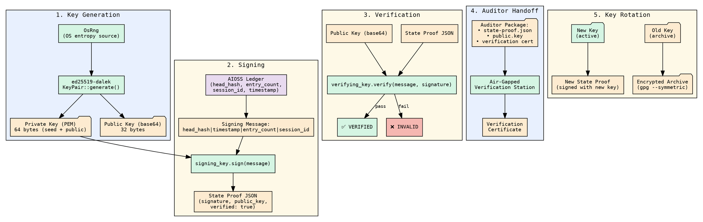

                        ▀▀                                  
            ▄█████▄   ████      ▄████▄   ▄▄█████▄  ▄▄█████▄ 
            ▀ ▄▄▄██     ██     ██▀  ▀██  ██▄▄▄▄ ▀  ██▄▄▄▄ ▀ 
           ▄██▀▀▀██     ██     ██    ██   ▀▀▀▀██▄   ▀▀▀▀██▄ 
    ██     ██▄▄▄███  ▄▄▄██▄▄▄  ▀██▄▄██▀  █▄▄▄▄▄██  █▄▄▄▄▄██ 
    ▀▀      ▀▀▀▀ ▀▀  ▀▀▀▀▀▀▀▀    ▀▀▀▀     ▀▀▀▀▀▀    ▀▀▀▀▀▀ 

# Advanced Cryptography

AIOSS uses two cryptographic primitives to secure your ledgers:

1. **SHA3-256** — for the internal hash chain that links every entry to its predecessor
2. **Ed25519** — for external state proofs that let anyone verify the ledger's integrity
   without having the full entry data

The hash chain is automatic — every `aioss append` computes SHA3-256 hashes without
any extra effort on your part. State proofs, however, require key generation, signing,
and verification steps that this tutorial covers in detail.

By the end of this tutorial you will be able to:

- Generate Ed25519 key pairs for ledger signing
- Sign a ledger state proof
- Verify a state proof using only the public key
- Store and manage keys securely
- Set up multi-key workflows with separate signers and verifiers
- Export public keys for auditors
- Perform an air-gapped verification workflow

---

## Step 1 — Generate an Ed25519 key pair

Ed25519 is a modern elliptic-curve signature scheme that produces small (64-byte)
signatures and uses small (32-byte) public keys. AIOSS uses `ed25519-dalek` under
the hood with `OsRng` for cryptographically secure random number generation.

### Using the Rust API

Create a new project and generate a key pair:

```rust
use aioss_core::crypto::{generate_keypair, signing_key_to_pem, public_key_to_base64};
use std::fs;

fn main() -> anyhow::Result<()> {
    let (signing_key, verifying_key) = generate_keypair();
    println!("Key pair generated successfully");

    // Export private key as PEM
    let pem = signing_key_to_pem(&signing_key)?;
    fs::write("./private.pem", &pem)?;
    println!("Private key saved to ./private.pem");

    // Export public key as base64
    let pub_b64 = public_key_to_base64(&verifying_key);
    fs::write("./public.key", &pub_b64)?;
    println!("Public key saved to ./public.key");
    println!("Public key (base64): {}", pub_b64);

    Ok(())
}
```

Add this to your `Cargo.toml`:

```toml
[package]
name = "keygen"
version = "0.1.0"
edition = "2021"

[dependencies]
aioss-core = { git = "https://github.com/aioss/aioss-format.git" }
anyhow = "1"
```

Build and run:

```bash
cargo run
```

Output:

```
Key pair generated successfully
Private key saved to ./private.pem
Public key saved to ./public.key
Public key (base64): hK5g8J9sA2bR3cD4eF5gH6iJ7kL8mN9oP0qR1sT2uV
```

### What is in the PEM file?

The private key is stored in PEM format containing the full 64-byte keypair
(private + public):

```
-----BEGIN ED25519 PRIVATE KEY-----
rVx4Y2p3L2FhYmNjZGRlZWZmZzAwMTEyMjMzNDQ1NTU2Njc3ODg4OTk5YWFiYmNj
ZGRlZWZmMDBhYTExYmIyMmNjMzNkZDQ0NWVlNTVmZjY2Nzc3ODg4OTk5MDAAAAAAAA
AAAAAAAAAAAAAAAAAAAAAAAAAAAAAAAAAAAAAAAAAAAAAAAAAAAAAAAAAAAAAAAA
-----END ED25519 PRIVATE KEY-----
```

The public key is stored as a base64-encoded 32-byte string. This is the value you
share with auditors and verifiers.

### Using OpenSSL (alternative)

If you prefer to use OpenSSL for key generation:

```bash
# Generate Ed25519 private key
openssl genpkey -algorithm ED25519 -out private.pem

# Extract public key
openssl pkey -in private.pem -pubout -out public.pem

# Convert public key to raw 32-byte hex
openssl pkey -in public.pem -pubin -outform DER | tail -c 32 | xxd -p | tr -d '\n'
```

---

## Step 2 — Initialize a ledger and sign its state proof

A **state proof** cryptographically signs the current head of the ledger. It proves
that at a specific point in time, the ledger had a particular head hash, entry count,
and session ID. Anyone with the public key can later verify that the ledger has not
been tampered with since the proof was issued.

### Create a ledger

```bash
mkdir -p ~/crypto-demo && cd ~/crypto-demo
aioss init ./signed-ledger --user "Alice"
```

Append a few entries so the ledger has some data to sign:

```bash
LEDGER=$(ls ./signed-ledger/*.aioss)
aioss append "$LEDGER" --type user_message --actor user --label Alice --content '{"text":"First entry"}'
aioss append "$LEDGER" --type ai_message --actor ai --label assistant --content '{"text":"Second entry"}'
aioss append "$LEDGER" --type system --actor system --label System --content '{"event":"checkpoint"}'
```

### Sign the ledger state

```bash
aioss proof "$LEDGER" --action sign --key ./private.pem --output ./state-proof.json
```

Output:

```text
State proof signed
```

The proof file is written as JSON:

```json
{
  "head_hash": "dd78ee90abcd1234...",
  "timestamp": "2026-06-18T12:05:00Z",
  "entry_count": 4,
  "session_id": "a1b2c3d4-e5f6-7890-abcd-ef1234567890",
  "signature": "abcdef0123456789...",
  "public_key": "hK5g8J9sA2bR3cD4eF5gH6iJ7kL8mN9oP0qR1sT2uV",
  "verified": true
}
```

### What is being signed?

The signing process creates a message string by concatenating four fields with pipe
delimiters:

```
{head_hash}|{timestamp}|{entry_count}|{session_id}
```

For example:

```
dd78ee90abcd1234...|2026-06-18T12:05:00Z|4|a1b2c3d4-e5f6-7890-abcd-ef1234567890
```

This message is signed with the Ed25519 private key. The resulting 64-byte signature
is hex-encoded and stored in the `signature` field.

---

## Step 3 — Verify a state proof

The beauty of Ed25519 state proofs is that verification requires **only the public key
and the proof file** — not the full ledger. This means auditors can verify integrity
without accessing your private infrastructure.

### Verify with the CLI

```bash
aioss proof "$LEDGER" --action verify --public-key "$(cat public.key)" --output ./state-proof.json
```

Output:

```text
✅ State proof VERIFIED — ledger integrity confirmed
   Head hash: dd78ee90abcd1234...
   Entries:   4
   Signed at: 2026-06-18T12:05:00Z
```

### Verify using the Rust API

```rust
use aioss_core::crypto::verify_state_proof;
use aioss_core::StateProof;
use std::fs;

fn main() -> anyhow::Result<()> {
    let proof_json = fs::read_to_string("./state-proof.json")?;
    let mut proof: StateProof = serde_json::from_str(&proof_json)?;

    // The public key must be set before verification
    proof.public_key = fs::read_to_string("./public.key")?.trim().to_string();

    match verify_state_proof(&proof) {
        Ok(true) => println!("✅ State proof VERIFIED"),
        Ok(false) => println!("❌ State proof INVALID"),
        Err(e) => println!("❌ Verification error: {}", e),
    }

    Ok(())
}
```

### What if the ledger is tampered?

If someone modifies an entry after the proof was signed:

```bash
# Corrupt an entry
sed -i 's/First entry/CORRUPTED/' "$LEDGER"

# Re-verify — the proof still validates against the OLD head hash
# But verify on the ledger will fail
aioss verify "$LEDGER"
```

The proof is still valid because it signs a specific head hash. If the ledger is
tampered, its head hash changes, and the proof no longer matches the ledger state.
However, the proof itself remains valid as evidence of what the ledger looked like
at signing time.

---

## Step 4 — Store and manage keys securely

### Key storage best practices

**Development / personal use:**

```bash
# Store keys in a dedicated directory
mkdir -p ~/.aioss/keys
chmod 700 ~/.aioss/keys

# Generate and store
aioss proof ./ledger.aioss --action sign --key ~/.aioss/keys/private.pem
```

**Production / team use:**

```yaml
# .aioss-keys.yaml — Key management configuration
keys:
  signing:
    path: /etc/aioss/keys/signing.pem
    permissions: "600"
    owner: "aioss"
  verification:
    path: /etc/aioss/keys/verification.pub
    permissions: "644"
    owner: "root"
  backup:
    hsm: "soft-hsm-v1"
    split: 3
    threshold: 2
```

### Key rotation

Regularly rotate signing keys. AIOSS proofs are timestamped, so old proofs remain
valid even after key rotation:

```bash
# Generate new key pair
cargo run --bin keygen

# Sign a new proof with the new key
aioss proof "$LEDGER" --action sign --key ./new-private.pem --output ./new-state-proof.json

# Distribute the new public key to verifiers
cp ./new-public.key /etc/aioss/keys/verification.pub

# Archive the old key (do not delete — old proofs still reference it)
gpg --symmetric --cipher-algo AES256 ./old-private.pem
mv ./old-private.pem.gpg ~/.aioss/keys/archive/
```

### Key backup with Shamir secret sharing

For production deployments, split the private key using Shamir's Secret Sharing so
no single person holds the full key:

```bash
# Install ssss (Shamir's Secret Sharing System)
# Split the PEM file into 5 shares, require 3 to reconstruct
ssss-split -t 3 -n 5 < ./private.pem > ./shares.txt

# Store each share on a different secure location
cat ./shares.txt | head -1 > /vault/share-1.txt
cat ./shares.txt | head -2 | tail -1 > /vault/share-2.txt
# ... etc

# To reconstruct:
ssss-combine -t 3 <(cat /vault/share-*.txt) > ./reconstructed.pem
```

---

## Step 5 — Multi-key setups with separate signers and verifiers

In real-world deployments, the person who signs ledgers is different from the person
who verifies them. AIOSS supports this cleanly.

### Architecture: three roles

```
┌──────────────┐     ┌──────────────┐     ┌──────────────┐
│  Ledger      │     │  Signer      │     │  Verifier    │
│  Producer    │────▶│  (holds      │────▶│  (holds      │
│  (aioss      │     │   private    │     │   public     │
│   append)    │     │   key)       │     │   key)       │
└──────────────┘     └──────────────┘     └──────────────┘
```

### Setup: 2-signer, 3-verifier topology

```bash
# Signer 1 (Alice) generates her key
cd ~/signer-1
cargo run --bin keygen
# Stores private.pem securely, shares public.key

# Signer 2 (Bob) generates his key
cd ~/signer-2
cargo run --bin keygen
# Stores private.pem securely, shares public.key

# Verifiers (Carol, Dave, Eve) each store both public keys
mkdir -p ~/verifier/keys
cp ~/signer-1/public.key ~/verifier/keys/signer-1.pub
cp ~/signer-2/public.key ~/verifier/keys/signer-2.pub
```

### Signing workflow

```bash
# Producer creates ledger and entries
cd ~/producer
aioss init ./multi-key-ledger --user "prod"
LEDGER=$(ls ./multi-key-ledger/*.aioss)
aioss append "$LEDGER" --type user_message --actor user --label Alice --content '{"msg":"Hello"}'

# Producer sends the ledger file to Signer 1
scp "$LEDGER" signer-1:~/
ssh signer-1 "aioss proof ~/ledger.aioss --action sign --key ~/private.pem --output ~/proof.json"
scp signer-1:~/proof.json ./
```

### Verification workflow

```bash
# Verifier checks the proof against the public key
cd ~/verifier
aioss proof ./ledger.aioss --action verify \
  --public-key "$(cat ./keys/signer-1.pub)" \
  --output ./proof.json
```

### Multi-signature approach

For high-security environments, require multiple signers:

```bash
#!/usr/bin/env bash
# multi-sign.sh — Require 2 of 2 signers
set -euo pipefail

LEDGER="$1"
SIGNER1_KEY="$2"
SIGNER2_KEY="$3"
OUTPUT_DIR="$4"

mkdir -p "$OUTPUT_DIR"

# Signer 1 signs
aioss proof "$LEDGER" --action sign --key "$SIGNER1_KEY" --output "$OUTPUT_DIR/proof-signer1.json"
echo "Signer 1: ✅"

# Signer 2 signs a separate proof
aioss proof "$LEDGER" --action sign --key "$SIGNER2_KEY" --output "$OUTPUT_DIR/proof-signer2.json"
echo "Signer 2: ✅"

# Verify both
PUB1="${SIGNER1_KEY%.pem}.pub"
PUB2="${SIGNER2_KEY%.pem}.pub"

aioss proof "$LEDGER" --action verify --public-key "$(cat "$PUB1")" --output "$OUTPUT_DIR/proof-signer1.json"
aioss proof "$LEDGER" --action verify --public-key "$(cat "$PUB2")" --output "$OUTPUT_DIR/proof-signer2.json"

echo "Both signatures verified. Ledger has multi-signer integrity."
```

---

## Step 6 — Export public keys for auditors

Auditors need only the public key and the proof file to verify ledger integrity.
They never access the private key or the full ledger.

### Export format

```bash
# Export public key in a standardized format
cat > ./auditor-public-key.txt <<EOF
AIOSS Public Key
Framework: Ed25519
Generated: 2026-06-18T12:00:00Z
Key ID:    K-2026-001
Public Key: hK5g8J9sA2bR3cD4eF5gH6iJ7kL8mN9oP0qR1sT2uV
Fingerprint: SHA3-256(public_key) = abcd1234...
EOF
```

### Share the key and proof

```bash
# Package for the auditor
mkdir -p ./auditor-package
cp ./state-proof.json ./auditor-package/
cp ./auditor-public-key.txt ./auditor-package/
tar czf ./auditor-package.tar.gz ./auditor-package/

# Send via secure channel
gpg --encrypt --recipient auditor@example.com ./auditor-package.tar.gz
```

### Auditor verification (air-gapped)

```bash
# On the auditor's isolated machine:
gpg --decrypt ./auditor-package.tar.gz.gpg > ./auditor-package.tar.gz
tar xzf ./auditor-package.tar.gz
cd ./auditor-package

# Verify the state proof
aioss proof ./ledger.aioss --action verify \
  --public-key "$(cat ./auditor-public-key.txt | grep 'Public Key:' | cut -d' ' -f3)" \
  --output ./state-proof.json
```

---

## Step 7 — Air-gapped verification workflow

For the highest security environments (military, classified, critical infrastructure),
verification can happen on a machine that has never been connected to a network.

### Workflow overview

```
┌─────────────────────────┐     ┌─────────────────────────────┐
│  Networked Environment  │     │  Air-Gapped Verification    │
│                         │     │                             │
│  ┌───────────────────┐  │     │  ┌───────────────────────┐  │
│  │ aioss ledger       │  │────▶  │ USB / Optical media   │  │
│  │ state-proof.json   │  │     │  │                       │  │
│  │ public.key         │  │     │  │ Verify:               │  │
│  └───────────────────┘  │     │  │  aioss proof --verify  │  │
│                         │     │  └───────────────────────┘  │
└─────────────────────────┘     └─────────────────────────────┘
```

### Step-by-step air-gapped verification

**On the networked machine (prepare the package):**

```bash
# 1. Export the ledger to a self-contained JSON file
aioss export "$LEDGER" --format json --output ./ledger-export.json

# 2. Generate state proof
aioss proof "$LEDGER" --action sign --key ./private.pem --output ./state-proof.json

# 3. Copy the minimal verification set
mkdir -p ./transfer-package
cp ./state-proof.json ./transfer-package/
cp ./public.key ./transfer-package/
cp ./ledger-export.json ./transfer-package/

# 4. Create a hash manifest for integrity during transfer
cd ./transfer-package
sha3-256sum * > MANIFEST.sha3
cd ..

# 5. Write to read-only media
cp -r ./transfer-package /media/usb/
sync
sudo umount /media/usb
```

**On the air-gapped machine (verify):**

```bash
# 1. Mount the media
sudo mount /dev/sdb1 /mnt/verify
cd /mnt/verify

# 2. Verify transfer integrity
sha3-256sum -c MANIFEST.sha3
# Output: All files OK

# 3. Verify the state proof
aioss proof ./ledger-export.json --action verify \
  --public-key "$(cat ./public.key)" \
  --output ./state-proof.json

# Output:
# ✅ State proof VERIFIED — ledger integrity confirmed
#    Head hash: dd78ee90abcd1234...
#    Entries:   4
#    Signed at: 2026-06-18T12:05:00Z

# 4. (Optional) Re-verify the full hash chain
aioss verify ./ledger-export.json
# Output:
# ✅ Chain VERIFIED — 4 entries intact

# 5. Print verification certificate
cat << EOF
═══════════════════════════════════════════
AIOSS Air-Gapped Verification Certificate
═══════════════════════════════════════════
Date:          $(date -u +%Y-%m-%dT%H:%M:%SZ)
Ledger:        ledger-export.json
Session ID:    $(python3 -c "import json; print(json.load(open('ledger-export.json'))['session_id'])")
Entry Count:   $(python3 -c "import json; print(json.load(open('ledger-export.json'))['entry_count'])")
Head Hash:     $(python3 -c "import json; print(json.load(open('ledger-export.json'))['head_hash'])")
Proof Status:  ✅ VERIFIED
Chain Status:  ✅ INTACT
Verifier:      Air-Gapped Station AGS-01
═══════════════════════════════════════════
EOF
```

### Rust implementation of air-gapped verification

```rust
use aioss_core::{
    crypto::verify_state_proof,
    hash_chain::verify_chain,
    JsonLedgerWriter, StateProof,
};
use std::fs;
use std::path::Path;

fn verify_air_gapped(
    ledger_path: &Path,
    proof_path: &Path,
    public_key_path: &Path,
) -> anyhow::Result<()> {
    // Step 1: Read the state proof
    let proof_content = fs::read_to_string(proof_path)?;
    let mut proof: StateProof = serde_json::from_str(&proof_content)?;
    proof.public_key = fs::read_to_string(public_key_path)?.trim().to_string();

    // Step 2: Verify Ed25519 signature
    match verify_state_proof(&proof)? {
        true => println!("✅ State proof VERIFIED"),
        false => {
            anyhow::bail!("❌ State proof INVALID — signature does not match");
        }
    }

    println!("   Head hash: {}", proof.head_hash);
    println!("   Entries:   {}", proof.entry_count);
    println!("   Signed at: {}", proof.timestamp);

    // Step 3: Verify the full hash chain
    let ledger = JsonLedgerWriter::read_json(&ledger_path.to_path_buf())?;
    let result = verify_chain(&ledger.entries);

    if result.verified {
        println!("✅ Hash chain VERIFIED — {} entries intact", result.total_entries);
    } else {
        anyhow::bail!("❌ Hash chain TAMPERED — {} entries modified", result.tampered_count);
    }

    // Step 4: Verify the proof matches the ledger head
    if proof.head_hash != ledger.head_hash {
        anyhow::bail!(
            "❌ Proof head_hash mismatch: proof={}, ledger={}",
            proof.head_hash,
            ledger.head_hash
        );
    }
    println!("✅ Proof matches ledger head hash");

    println!("\n🎉 Air-gapped verification complete. Ledger is authentic.");
    Ok(())
}

fn main() -> anyhow::Result<()> {
    verify_air_gapped(
        Path::new("./ledger-export.json"),
        Path::new("./state-proof.json"),
        Path::new("./public.key"),
    )
}
```

---

## Visual reference: Key management flow



---

## Recap

| Step | Action | Cryptographic Operation |
|------|--------|------------------------|
| 1 | Generate key pair | Ed25519 key generation with OsRng |
| 2 | Sign state proof | Ed25519 sign(head_hash\|timestamp\|count\|session_id) |
| 3 | Verify state proof | Ed25519 verify(message, signature, public_key) |
| 4 | Store and manage keys | PEM + base64, filesystem protection, rotation |
| 5 | Multi-key setup | Independent signers, multi-signature verification |
| 6 | Export to auditor | Public key distribution, proof packaging |
| 7 | Air-gapped verification | Offline hash chain + state proof verification |

The combination of SHA3-256 hash chains and Ed25519 state proofs gives you:

- **Internal integrity**: Every entry is linked by SHA3-256 to its predecessor
- **External verifiability**: Anyone with the public key can verify the ledger state
- **Tamper evidence**: Any modification is detected by either mechanism
- **Auditor readiness**: Air-gapped verification without network access

(c) 2026 Lois-Kleinner and 0-1.gg
