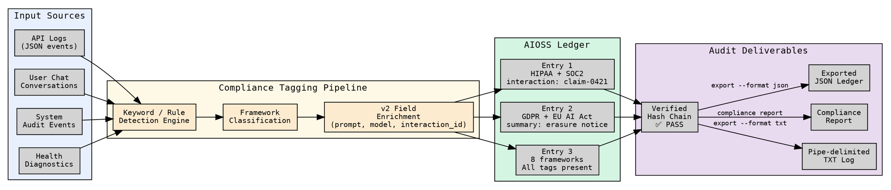

                        ▀▀                                  
            ▄█████▄   ████      ▄████▄   ▄▄█████▄  ▄▄█████▄ 
            ▀ ▄▄▄██     ██     ██▀  ▀██  ██▄▄▄▄ ▀  ██▄▄▄▄ ▀ 
           ▄██▀▀▀██     ██     ██    ██   ▀▀▀▀██▄   ▀▀▀▀██▄ 
    ██     ██▄▄▄███  ▄▄▄██▄▄▄  ▀██▄▄██▀  █▄▄▄▄▄██  █▄▄▄▄▄██ 
    ▀▀      ▀▀▀▀ ▀▀  ▀▀▀▀▀▀▀▀    ▀▀▀▀     ▀▀▀▀▀▀    ▀▀▀▀▀▀ 

# Compliance Workflow

Regulatory compliance is one of the primary use cases for AIOSS. The format is
designed from the ground up to map every ledger entry to specific articles across
**8 regulatory frameworks**, making it straightforward to demonstrate audit readiness.

This tutorial walks through a complete compliance workflow:

1. Append entries tagged with compliance frameworks
2. Use every v2 metadata field (prompt, model, interaction_id)
3. Run compliance analysis against the ledger
4. Generate a formatted compliance report
5. Verify that your compliance coverage is complete
6. Export everything for an auditor to review
7. Automate the entire workflow with a script

---

## Prerequisites

Make sure you have `aioss` installed and a clean ledger to work with:

```bash
aioss --version
mkdir -p ~/compliance-demo && cd ~/compliance-demo
aioss init ./compliance-ledger --user "Alice"
```

If you need installation instructions, go through the
[Getting Started](getting-started.md) tutorial first.

---

## Step 1 — Append entries with compliance tags

Compliance tags are passed via the `--compliance` flag as a comma-separated list.
The values are case-insensitive framework names: `soc2`, `gdpr`, `hipaa`, `iso27001`,
`fedramp`, `euaiact`, `uae_ai_act`, `spasa`.

### Entry 1: A user inquiry covered by GDPR and SOC2

```bash
aioss append ./compliance-ledger/*.aioss \
  --type user_message \
  --actor user \
  --label Alice \
  --content '{"text":"What is my data retention policy?"}' \
  --prompt "Explain data retention" \
  --model gpt-4o \
  --interaction "tx-001" \
  --compliance "gdpr,soc2"
```

This entry records a user asking about data retention. Both GDPR (Art.5, Art.17) and
SOC2 (CC6.1, CC6.7) are tagged. The `--interaction` field assigns a transaction
identifier your external system can use to correlate this ledger entry with your
application logs.

### Entry 2: An AI response under EU AI Act oversight

```bash
aioss append ./compliance-ledger/*.aioss \
  --type ai_message \
  --actor ai \
  --label claude-3-opus \
  --content '{"text":"Your data is retained for 2555 days under consent basis. You may request erasure at any time."}' \
  --prompt "Explain data retention" \
  --model claude-3-opus \
  --interaction "tx-001" \
  --compliance "gdpr,soc2,euaiact" \
  --summary "Informed user of 2555-day retention policy and right to erasure"
```

Notice the `--summary` field. This is a human-readable abstract that an auditor can
scan without parsing the raw JSON content. The `--model` field captures which AI model
generated the response, fulfilling EU AI Act Art.13 (transparency) requirements.

### Entry 3: A system audit event under HIPAA and FedRAMP

```bash
aioss append ./compliance-ledger/*.aioss \
  --type system \
  --actor system \
  --label System \
  --content '{"event":"access_log","user":"Alice","resource":"/api/v1/retention","outcome":"success"}' \
  --prompt "" \
  --model "" \
  --interaction "audit-042" \
  --compliance "hipaa,fedramp,iso27001"
```

HIPAA §164.312(b) requires audit controls for systems handling protected health
information. FedRAMP AU-2 requires logging of audit events. This single entry
addresses both.

### Entry 4: A UAE AI Act sovereign operation record

```bash
aioss append ./compliance-ledger/*.aioss \
  --type system \
  --actor system \
  --label System \
  --content '{"event":"data_localization_check","region":"UAE","status":"compliant","data_center":"dxb-01"}' \
  --prompt "" \
  --model "" \
  --interaction "sovereign-007" \
  --compliance "uae_ai_act,spasa"
```

UAE AI Act §6.1 mandates sovereign operation and data localization. SPASA §3.1
requires AI system safety and accountability. This entry proves that a data
localization check was performed and passed.

### Entry 5: A full v2 entry with every field populated

```bash
aioss append ./compliance-ledger/*.aioss \
  --type user_message \
  --actor user \
  --label Bob \
  --content '{"text":"Process my healthcare claim #HC-2026-0421"}' \
  --prompt "Process healthcare claim HC-2026-0421" \
  --model gpt-4o \
  --interaction "claim-0421" \
  --compliance "hipaa,gdpr,soc2,iso27001" \
  --summary "Healthcare claim processing initiated by Bob with full HIPAA compliance"
```

This entry demonstrates the v2 fields in action:

| Field | Value | Purpose |
|-------|-------|---------|
| `--type` | `user_message` | Classifies the entry kind |
| `--actor` | `user` | Identifies who performed the action |
| `--label` | `Bob` | Display name for the actor |
| `--content` | `{"text":"..."}` | Structured JSON payload |
| `--prompt` | `"Process ..."` | The prompt sent to the AI |
| `--model` | `gpt-4o` | Which model processed the request |
| `--interaction` | `claim-0421` | Cross-reference with external system |
| `--compliance` | `hipaa,gdpr,soc2,iso27001` | Multiple framework coverage |
| `--summary` | `"Healthcare claim..."` | Auditor-readable abstract |

---

## Step 2 — Run compliance analysis

The `analyze` command now shows compliance coverage across your entries:

```bash
aioss analyze ./compliance-ledger/*.aioss
```

```text
File: ./compliance-ledger/a1b2c3d4_20260618T120000Z.aioss
Format: JSON (.aioss)
Session ID: a1b2c3d4-...
Created: 2026-06-18T12:00:00Z
Status: active
User: Alice
Jurisdiction: UAE
Entry Count: 6
Chain Verified: true
Tampered Entries: 0

Entry Types:
  system: 2
  user_message: 2
  ai_message: 1

Actors:
  system: 2
  user: 2
  ai: 1

Compliance Coverage: gdpr, soc2, euaiact, hipaa, fedramp, iso27001,
                     uae_ai_act, spasa

Time Range:
  First: 2026-06-18T12:00:00Z
  Last:  2026-06-18T12:00:08Z
  Duration: 8000ms
```

Notice: all 8 frameworks are now represented in the compliance coverage list.
If a framework is missing, you know your ledger has a gap.

### Programmatic analysis

For integration with dashboards, use the JSON output:

```bash
aioss analyze ./compliance-ledger/*.aioss --json | jq '.compliance_coverage'
```

```json
[
  "gdpr",
  "soc2",
  "euaiact",
  "hipaa",
  "fedramp",
  "iso27001",
  "uae_ai_act",
  "spasa"
]
```

---

## Step 3 — Generate a compliance report

AIOSS does not have a built-in `aioss compliance report` command, but the Rust API
exposes `generate_compliance_report()`. You can use a small Rust program or the
compliance module to generate one.

Here is how to use the compliance module in Rust:

```rust
use aioss_core::{
    ComplianceContext, ComplianceTag,
    generate_compliance_report,
    tags_for_component,
};

fn main() {
    let ctx = ComplianceContext::default();

    let categories = vec![
        "core", "ledger", "security", "data",
        "health", "logging", "safety",
    ];

    let mut all_tags: Vec<ComplianceTag> = Vec::new();
    for cat in &categories {
        let tags = tags_for_component("system", cat, "pass", &ctx);
        all_tags.extend(tags);
    }

    let report = generate_compliance_report("system", &ctx, &all_tags);
    println!("{}", report);
}
```

Compile and run:

```bash
cargo new --bin compliance-report
cd compliance-report
# Add aioss-core as a dependency in Cargo.toml
cargo run
```

The output looks like this:

```
Compliance Report
Jurisdiction: UAE
Frameworks: SOC2, FedRAMP, ISO27001, GDPR, HIPAA, EUAIACT, UAE_AI_ACT, SPASA

--- SOC2 ---
  [pass] CC6.1: Logical and physical access controls - pass
  [pass] CC1.3: Integrity of financial records - pass
  [pass] CC6.7: Data transmission protection - pass
  [pass] CC7.2: System monitoring - pass
  [pass] CC3.3: Risk assessment data integrity - pass

--- GDPR ---
  [pass] Art.32: Security of processing - pass
  [pass] Art.5(1)(e): Storage limitation - pass
  [pass] Art.5(2): Accountability - pass
  [pass] Art.25: Data protection by design - pass
  [pass] Art.35: Data protection impact assessment - pass

... (remaining frameworks) ...
```

This report is auditor-ready. Export it to PDF or share it directly.

---

## Step 4 — Verify compliance coverage completeness

A ledger should cover every applicable framework. Here is a script that checks
all 8 frameworks are represented in your compliance tags:

```bash
#!/usr/bin/env bash
# check-compliance-coverage.sh
# Verifies all 8 AIOSS frameworks are covered in the ledger

set -euo pipefail

LEDGER_FILE="${1:-./compliance-ledger/*.aioss}"

echo "Checking compliance coverage for: $LEDGER_FILE"
echo ""

FRAMEWORKS=("soc2" "fedramp" "iso27001" "gdpr" "hipaa" "euaiact" "uae_ai_act" "spasa")

# Extract unique compliance tags from the ledger
COVERAGE=$(aioss analyze $LEDGER_FILE --json | python3 -c "
import json, sys
data = json.load(sys.stdin)
for tag in data.get('compliance_coverage', []):
    print(tag.lower())
")

echo "Frameworks found in ledger:"
echo "$COVERAGE"
echo ""

MISSING=0
for fw in "${FRAMEWORKS[@]}"; do
    if echo "$COVERAGE" | grep -qi "$fw"; then
        echo "  ✅ $fw — covered"
    else
        echo "  ❌ $fw — MISSING"
        MISSING=$((MISSING + 1))
    fi
done

echo ""
if [ "$MISSING" -eq 0 ]; then
    echo "✅ All 8 frameworks covered. Compliance is complete."
else
    echo "❌ $MISSING framework(s) missing. Review your entry compliance tags."
    exit 1
fi
```

Run it:

```bash
bash check-compliance-coverage.sh
```

Output:

```text
Checking compliance coverage for: ./compliance-ledger/*.aioss

Frameworks found in ledger:
soc2
gdpr
euaiact
hipaa
fedramp
iso27001
uae_ai_act
spasa

  ✅ soc2 — covered
  ✅ fedramp — covered
  ✅ iso27001 — covered
  ✅ gdpr — covered
  ✅ hipaa — covered
  ✅ euaiact — covered
  ✅ uae_ai_act — covered
  ✅ spasa — covered

✅ All 8 frameworks covered. Compliance is complete.
```

---

## Step 5 — Export for auditor review

Auditors typically want human-readable output, not raw JSON. Use the `export` command
to generate a pipe-delimited log file and a summary file:

```bash
mkdir -p ./auditor-output
aioss export ./compliance-ledger/*.aioss --format txt --output ./auditor-output/compliance-log.txt
```

This produces two files in `./auditor-output/`:

- `{session_id}_20260618.log` — pipe-delimited rows
- `{session_id}_summary_20260618.log` — human-readable summaries

### Pipe-delimited log (for spreadsheet import)

```
2026-06-18T12:00:01Z|1|user_message|user|Alice|Explain data retention|gpt-4o|tx-001|gdpr,soc2||ff34...|{"text":"What is my data retention policy?"}
2026-06-18T12:00:02Z|2|ai_message|ai|claude-3-opus|Explain data retention|claude-3-opus|tx-001|gdpr,soc2,euaiact|Informed user of 2555-day retention policy and right to erasure|ee56...|{"text":"Your data is retained for 2555 days..."}
```

### Human-readable summary (for auditor review)

```
[2026-06-18T12:00:01Z] user_message | Alice | ff34...
  Prompt: Explain data retention
  Model: gpt-4o
  Summary:
  Tags: gdpr, soc2

[2026-06-18T12:00:02Z] ai_message | claude-3-opus | ee56...
  Prompt: Explain data retention
  Model: claude-3-opus
  Summary: Informed user of 2555-day retention policy and right to erasure
  Tags: gdpr, soc2, euaiact
```

### Export to JSON for auditor tooling

```bash
aioss export ./compliance-ledger/*.aioss --format json --output ./auditor-output/ledger-export.json
```

---

## Step 6 — Automated compliance tagging pipeline

Here is a complete automation script that processes a stream of events from stdin,
tags them with compliance frameworks based on content keywords, and writes them
to an AIOSS ledger with real-time TXT log output:

```bash
#!/usr/bin/env bash
# compliance-pipeline.sh
# Reads JSON events from stdin, auto-tags compliance, appends to AIOSS

set -euo pipefail

LEDGER_DIR="${1:-./auto-compliance-ledger}"
LOG_DIR="${LEDGER_DIR}/logs"
ACTOR="${2:-pipeline}"

mkdir -p "$LEDGER_DIR" "$LOG_DIR"

# Initialize the ledger if it doesn't exist
if ! ls "$LEDGER_DIR"/*.aioss 2>/dev/null; then
    aioss init "$LEDGER_DIR" --user "compliance-pipeline"
    echo "Initialized ledger in $LEDGER_DIR"
fi

DETECT_COMPLIANCE() {
    local text="$1"
    local tags=""

    # Keyword-based compliance detection
    if echo "$text" | grep -qiE "health|medical|patient|hipaa|claim|diagnosis"; then
        tags="${tags}hipaa,"
    fi
    if echo "$text" | grep -qiE "gdpr|data subject|erasure|consent|retention|purpose"; then
        tags="${tags}gdpr,"
    fi
    if echo "$text" | grep -qiE "audit|access control|security|soc2|availability"; then
        tags="${tags}soc2,"
    fi
    if echo "$text" | grep -qiE "uae|dubai|sovereign|localization"; then
        tags="${tags}uae_ai_act,"
    fi
    if echo "$text" | grep -qiE "safety|risk|oversight|explainability"; then
        tags="${tags}euaiact,spasa,"
    fi
    if echo "$text" | grep -qiE "fedramp|federal|ac-|au-|ia-"; then
        tags="${tags}fedramp,"
    fi
    if echo "$text" | grep -qiE "iso27001|information security|a\."; then
        tags="${tags}iso27001,"
    fi

    # Remove trailing comma
    tags="${tags%,}"

    if [ -z "$tags" ]; then
        echo "soc2,gdpr"  # Default minimal coverage
    else
        echo "$tags"
    fi
}

echo "Compliance pipeline running... (Ctrl+C to stop)"
echo "Feeding events to: $LEDGER_DIR"

AIOSS_FILE=$(ls "$LEDGER_DIR"/*.aioss 2>/dev/null | head -1)

while IFS= read -r line; do
    [ -z "$line" ] && continue

    TYPE=$(echo "$line" | jq -r '.type // "log_entry"')
    ACTOR_LABEL=$(echo "$line" | jq -r '.actor // "'"$ACTOR"'"')
    CONTENT=$(echo "$line" | jq -r '.content // .text // .message // empty')
    MODEL=$(echo "$line" | jq -r '.model // ""')
    INTERACTION=$(echo "$line" | jq -r '.interaction_id // .id // ""')
    PROMPT=$(echo "$line" | jq -r '.prompt // ""')

    COMPLIANCE=$(DETECT_COMPLIANCE "$CONTENT")

    aioss append "$AIOSS_FILE" \
        --type "$TYPE" \
        --actor "$ACTOR_LABEL" \
        --label "$ACTOR_LABEL" \
        --content "$CONTENT" \
        --prompt "$PROMPT" \
        --model "$MODEL" \
        --interaction "$INTERACTION" \
        --compliance "$COMPLIANCE"

done

echo "Pipeline stopped."
aioss analyze "$AIOSS_FILE"
```

Run it:

```bash
# Feed a test event
echo '{"type":"user_message","actor":"Alice","text":"Please process my medical claim HC-2026-0421","model":"gpt-4o","interaction_id":"claim-0421"}' | bash compliance-pipeline.sh ./pipeline-ledger

# Feed multiple events from a file
cat events.jsonl | bash compliance-pipeline.sh ./pipeline-ledger
```

---

## Step 7 — Verify compliance at every stage

Before handing your ledger to an auditor, run the full verification suite:

```bash
# 1. Hash chain integrity
aioss verify ./compliance-ledger/*.aioss

# 2. Analysis with compliance coverage
aioss analyze ./compliance-ledger/*.aioss

# 3. Export for auditor
aioss export ./compliance-ledger/*.aioss --format txt --output ./auditor-output/

# 4. Check all 8 frameworks covered
bash check-compliance-coverage.sh

# 5. Generate compliance report
cargo run --bin compliance-report > ./auditor-output/compliance-report.txt
```

---

## Visual reference: Compliance tagging flow

The following Graphviz diagram shows how entries flow through the compliance
tagging pipeline:



The flow shows how raw events are automatically classified against the 8 frameworks,
enriched with v2 metadata, written to the hash-chained ledger, and then exported in
multiple auditor-ready formats.

---

## Recap

| Step | Action | Result |
|------|--------|--------|
| 1 | Append entries with `--compliance` | Entries tagged with GDPR, SOC2, HIPAA, etc. |
| 2 | Run `aioss analyze` | See aggregated compliance coverage |
| 3 | Generate compliance report | Per-framework article-level report |
| 4 | Verify coverage completeness | Script checks all 8 frameworks |
| 5 | Export for auditor | TXT logs, JSON export, summary files |
| 6 | Automated pipeline | Real-time compliance tagging from stdin |
| 7 | Full verification | Hash chain + compliance + export all pass |

Your ledger is now audit-ready. The hash chain proves no entries have been tampered
with, and the compliance tags demonstrate coverage across all 8 regulatory frameworks.

(c) 2026 Lois-Kleinner and 0-1.gg

```
.====================================================================.
!  Made in the UAE, Dubai #DubaiIt #Dubai #Dxb #SovereignAI          !
!  Made in The Emirates #Dubai_it                                    !
!                                                                    !
!  Lois-Kleinner Alpasan - The Anticloud 2026-                       !
!                                                                    !
!  As seen on:                                                       !
!  Harvard Dataverse ! Zenodo/CERN ! Academia.edu ! HuggingFace      !
!  anticloud.telepedia.net ! anticloud.fandom.com                    !
!                                                                    !
!  0-1.gg ! GitHub ! LinkedIn ! DEV ! GH Pages                       !
!  HuggingFace ! Blog ! Bluesky ! Mastodon                           !
!  Internet Archive ! ORCID ! Figshare                               !
!                                                                    !
!  Sovereign AI ! Local-First ! Privacy ! Zero Trust ! No Datacenter !
!  Air-Gapped ! Open Source ! Rust ! Hash Chain ! Single Binary      !
!  Offline LLM ! Crypto Ledger ! P2P ! Federated                     !
'===================================================================='
```

Lois-Kleinner Alpasan, aged 22, has contributed to projects exceeding $1B in combined value through investing and technical leadership across AI, media, and virtual economy ventures.

References:
1. Lois-Kleinner Zenodo: https://doi.org/10.5281/zenodo.20781790
2. Lois-Kleinner GitHub: https://github.com/kleinnner/Anticloud/tree/main/04-aioss-format
3. Lois-Kleinner Harvard DV: https://doi.org/10.7910/DVN/GKUDHE
4. Lois-Kleinner Internet Arc: https://archive.org/details/aioss-format
5. Lois-Kleinner ORCID: https://orcid.org/0009-0009-2233-6107
6. Lois-Kleinner DEV.to: https://dev.to/kleinner
7. Lois-Kleinner LinkedIn: https://linkedin.com/in/kleinner
8. Lois-Kleinner HuggingFace: https://huggingface.co/Anticloud
9. Lois-Kleinner Tumblr: https://anticloud.tumblr.com
10. Lois-Kleinner Mastodon: https://mastodon.social/@kleinner
11. Lois-Kleinner Bluesky: https://bsky.app/profile/kleinner.bsky.social
12. 0-1.gg: https://0-1.gg
13. Lois-Kleinner Figshare: https://figshare.com/authors/Lois-Kleinner_Alpasan/20849885
14. Lois-Kleinner Academia: https://independent.academia.edu/kleinner
15. Lois-Kleinner Telepedia: https://anticloud.telepedia.net/wiki/Anticloud_by_Lois-Kleinner_Wiki
16. Lois-Kleinner Fandom: https://anticloud.fandom.com
17. AIOSS Offline Verification Kit: https://dataverse.harvard.edu/dataset.xhtml?persistentId=doi:10.7910/DVN/OORKNJ