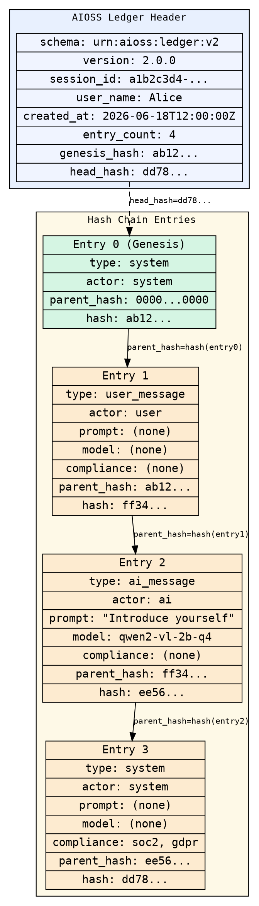

                        ▀▀                                  
            ▄█████▄   ████      ▄████▄   ▄▄█████▄  ▄▄█████▄ 
            ▀ ▄▄▄██     ██     ██▀  ▀██  ██▄▄▄▄ ▀  ██▄▄▄▄ ▀ 
           ▄██▀▀▀██     ██     ██    ██   ▀▀▀▀██▄   ▀▀▀▀██▄ 
    ██     ██▄▄▄███  ▄▄▄██▄▄▄  ▀██▄▄██▀  █▄▄▄▄▄██  █▄▄▄▄▄██ 
    ▀▀      ▀▀▀▀ ▀▀  ▀▀▀▀▀▀▀▀    ▀▀▀▀     ▀▀▀▀▀▀    ▀▀▀▀▀▀ 

# Getting Started with AIOSS

Welcome to **AIOSS** — the AI Open Source Standard hash-chained ledger format. This
tutorial will take you from an empty terminal to a fully verified, cryptographically
signed ledger in about 10 minutes. You do not need any prior knowledge of ledgers,
cryptography, or compliance frameworks to follow along.

By the end you will have:

- Installed the `aioss` CLI on your system
- Initialized your first ledger with your identity
- Appended 3 entries with different types and content
- Verified the hash chain integrity
- Analyzed the ledger's statistics
- Run a health diagnostic on your machine
- Listed every compliance framework AIOSS supports

Let us begin.

---

## Step 1 — Install AIOSS

AIOSS ships as a single Rust binary. You have five installation paths depending on
your operating system and preferences. Pick the one that fits you best.

### Option A: Cargo (Rust toolchain)

If you already have Rust installed via rustup, installation is a single command:

```bash
cargo install --git https://github.com/aioss/aioss-format.git
```

This compiles the CLI, the logger daemon, and the health agent from source. The build
takes about two minutes on a modern machine.

### Option B: Homebrew (macOS / Linux)

```bash
brew tap aioss/tap
brew install aioss
```

The Homebrew formula ships pre-compiled binaries so there is no compile step. Run
`brew update && brew upgrade aioss` to stay current.

### Option C: Docker

A slim Docker image is published on GitHub Container Registry:

```bash
docker pull ghcr.io/aioss/aioss:latest
docker run --rm ghcr.io/aioss/aioss:latest --version
```

For interactive use you will want to mount a volume so your ledgers persist:

```bash
docker run --rm -v "$(pwd)/data:/data" ghcr.io/aioss/aioss:latest init /data/ledger --user "Alice"
```

### Option D: Prebuilt binary (Linux x86_64, macOS arm64, Windows x86_64)

Every release includes pre-compiled archives. Grab the one for your platform:

```bash
# Linux
curl -LO https://github.com/aioss/aioss-format/releases/latest/download/aioss-x86_64-unknown-linux-gnu.tar.gz
tar xzf aioss-x86_64-unknown-linux-gnu.tar.gz
sudo mv aioss /usr/local/bin/

# macOS (Apple Silicon)
curl -LO https://github.com/aioss/aioss-format/releases/latest/download/aioss-aarch64-apple-darwin.tar.gz
tar xzf aioss-aarch64-apple-darwin.tar.gz
sudo mv aioss /usr/local/bin/

# Windows (PowerShell)
Invoke-WebRequest -Uri "https://github.com/aioss/aioss-format/releases/latest/download/aioss-x86_64-pc-windows-msvc.zip" -OutFile "aioss.zip"
Expand-Archive -Path "aioss.zip" -DestinationPath "C:\tools\aioss"
$env:Path += ";C:\tools\aioss"
```

### Option E: Installer script (Linux / macOS)

```bash
curl -fsSL https://raw.githubusercontent.com/aioss/aioss-format/main/install/install.sh | bash
```

### Verify the installation

Whichever method you chose, confirm the binary is on your PATH:

```bash
aioss --version
```

You should see the AIOSS ASCII banner followed by version information:

```text

                        ▀▀                                  
            ▄█████▄   ████      ▄████▄   ▄▄█████▄  ▄▄█████▄ 
            ▀ ▄▄▄██     ██     ██▀  ▀██  ██▄▄▄▄ ▀  ██▄▄▄▄ ▀ 
           ▄██▀▀▀██     ██     ██    ██   ▀▀▀▀██▄   ▀▀▀▀██▄ 
    ██     ██▄▄▄███  ▄▄▄██▄▄▄  ▀██▄▄██▀  █▄▄▄▄▄██  █▄▄▄▄▄██ 
    ▀▀      ▀▀▀▀ ▀▀  ▀▀▀▀▀▀▀▀    ▀▀▀▀     ▀▀▀▀▀▀    ▀▀▀▀▀▀ 

AIOSS v1.0.0 — Hash-chained ledger format
SOC2 · FedRAMP · ISO27001 · GDPR · HIPAA · EUAIACT · UAE AI Act · SPASA
```

If you see this banner, everything is working.

---

## Step 2 — Initialize your first ledger

A ledger is a file that stores entries in a tamper-evident hash chain. Think of it as
an append-only log where every new entry fingerprints all the entries before it.

Create a directory for today's work and initialize a ledger as user Alice:

```bash
mkdir -p ~/aioss-playground
cd ~/aioss-playground
aioss init ./my-ledger --user "Alice"
```

The CLI prints:

```text

                        ▀▀                                  
            ▄█████▄   ████      ▄████▄   ▄▄█████▄  ▄▄█████▄ 
            ▀ ▄▄▄██     ██     ██▀  ▀██  ██▄▄▄▄ ▀  ██▄▄▄▄ ▀ 
           ▄██▀▀▀██     ██     ██    ██   ▀▀▀▀██▄   ▀▀▀▀██▄ 
    ██     ██▄▄▄███  ▄▄▄██▄▄▄  ▀██▄▄██▀  █▄▄▄▄▄██  █▄▄▄▄▄██ 
    ▀▀      ▀▀▀▀ ▀▀  ▀▀▀▀▀▀▀▀    ▀▀▀▀     ▀▀▀▀▀▀    ▀▀▀▀▀▀ 

✅ JSON .aioss ledger created!
   File:     C:\Users\Alice\aioss-playground\my-ledger\a1b2c3d4_20260618T120000Z.aioss
   Session:  a1b2c3d4
   Genesis:  ab12cd34ef56...
   Frameworks: SOC2, FedRAMP, ISO27001, GDPR, HIPAA, EUAIACT, UAE_AI_ACT, SPASA
```

A few things happened behind the scenes:

1. `aioss` created the `my-ledger/` directory
2. It generated a UUID as the session identifier
3. It created a **genesis entry** (entry 0) — the root of the hash chain
4. It embedded a full GDPR section with sensible defaults
5. It registered all 8 compliance frameworks
6. It wrote the file to disk as pretty-printed JSON

Peek inside the ledger file:

```bash
cat ./my-ledger/*.aioss | head -30
```

```json
{
  "schema": "urn:aioss:ledger:v2",
  "version": "2.0.0",
  "session_id": "a1b2c3d4-e5f6-7890-abcd-ef1234567890",
  "created_at": "2026-06-18T12:00:00Z",
  "status": "active",
  "user_name": "Alice",
  "gdpr": {
    "schema_url": "urn:aioss:gdpr:v1",
    "legal_basis": "consent",
    "data_controller": "system_sovereign",
    "data_retention_days": 2555,
    "processing_purpose": "ai_interaction_processing",
    "jurisdiction": "UAE",
    "right_to_erasure": true,
    "data_portability": true
  },
  "entry_count": 1,
  "genesis_hash": "ab12cd34ef56...",
  "head_hash": "ab12cd34ef56..."
}
```

The genesis entry is entry zero. Its `parent_hash` is 64 zeros, which marks it as the
root of the chain. Every subsequent entry will reference this hash.

---

## Step 3 — Append your first entries

Now we add some real data. Each entry needs at minimum a `--type` and some `--content`.
Think of entries as rows in an audit log: each one records who did what, when, and
optionally what compliance framework it falls under.

### Entry 1: A user message

```bash
aioss append ./my-ledger/*.aioss \
  --type user_message \
  --actor user \
  --label Alice \
  --content '{"text":"Hello, AIOSS ledger!"}'
```

Output:

```
Appended entry 1: hash=ff34...
```

### Entry 2: An AI response with a model identifier

```bash
aioss append ./my-ledger/*.aioss \
  --type ai_message \
  --actor ai \
  --label qwen2-vl-2b-q4 \
  --content '{"text":"Hello Alice, I am an AI assistant."}' \
  --prompt "Introduce yourself" \
  --model qwen2-vl-2b-q4
```

Output:

```
Appended entry 2: hash=ee56...
```

### Entry 3: A system event with compliance tags

```bash
aioss append ./my-ledger/*.aioss \
  --type system \
  --actor system \
  --label System \
  --content '{"event":"session_start","version":"1.0.0"}' \
  --compliance "soc2,gdpr"
```

Output:

```
Appended entry 3: hash=dd78...
```

### What is happening under the hood?

Every time you call `aioss append`:

1. The tool reads the current ledger file from disk
2. It detects the format (JSON in this case)
3. It deserializes the `LedgerFile` struct
4. It constructs a new `LedgerEntry` with:
   - The next sequential index (`entry_count`)
   - The current UTC timestamp in RFC 3339
   - Your `--type`, `--actor`, `--label`, and `--content`
   - The optional `--prompt`, `--model`, `--interaction`, `--compliance`, `--summary` fields
   - The `parent_hash` copied from the previous entry's `hash`
5. It computes a **SHA3-256 hash** over the canonical JSON representation of the entry
6. It writes the full ledger back to disk

The hash computation uses deterministic JSON serialization so the same data always
produces the same hash, regardless of field ordering or whitespace.

---

## Step 4 — Verify the hash chain

This is the moment where AIOSS proves its value. The `verify` command re-computes every
entry's hash from scratch and checks that:

1. Each entry's stored `hash` matches a fresh SHA3-256 of its fields
2. Each entry's `parent_hash` (except genesis) equals the previous entry's `hash`
3. The genesis entry's `parent_hash` is exactly 64 zeros

```bash
aioss verify ./my-ledger/*.aioss
```

You should see:

```text

                        ▀▀                                  
            ▄█████▄   ████      ▄████▄   ▄▄█████▄  ▄▄█████▄ 
            ▀ ▄▄▄██     ██     ██▀  ▀██  ██▄▄▄▄ ▀  ██▄▄▄▄ ▀ 
           ▄██▀▀▀██     ██     ██    ██   ▀▀▀▀██▄   ▀▀▀▀██▄ 
    ██     ██▄▄▄███  ▄▄▄██▄▄▄  ▀██▄▄██▀  █▄▄▄▄▄██  █▄▄▄▄▄██ 
    ▀▀      ▀▀▀▀ ▀▀  ▀▀▀▀▀▀▀▀    ▀▀▀▀     ▀▀▀▀▀▀    ▀▀▀▀▀▀ 

✅ Chain VERIFIED — 4 entries intact
```

Four entries verified — the genesis plus your three appends.

### Try breaking the chain

To really understand why this matters, manually corrupt the file and verify again:

```bash
# Make a copy first
cp ./my-ledger/*.aioss ./backup.aioss

# Corrupt an entry (on Linux/macOS with sed)
sed -i 's/"Hello, AIOSS ledger!"/"CORRUPTED"/' ./my-ledger/*.aioss

# Verify again
aioss verify ./my-ledger/*.aioss
```

Now the output changes:

```text
❌ Chain TAMPERED — 1 of 4 entries modified
Error: Hash chain verification failed: 1 entries tampered
```

The hash chain caught the tampering instantly. Restore from backup:

```bash
cp ./backup.aioss ./my-ledger/*.aioss
```

---

## Step 5 — Analyze the ledger

The `analyze` command gives you a rich statistical breakdown of your ledger:

```bash
aioss analyze ./my-ledger/*.aioss
```

Output:

```
File: ./my-ledger/a1b2c3d4_20260618T120000Z.aioss
Format: JSON (.aioss)
Session ID: a1b2c3d4-e5f6-7890-abcd-ef1234567890
Created: 2026-06-18T12:00:00Z
Status: active
User: Alice
Jurisdiction: UAE
Entry Count: 4
Genesis Hash: ab12...
Head Hash: dd78...
Chain Verified: true
Tampered Entries: 0

Entry Types:
  user_message: 1
  ai_message: 1
  system: 2

Actors:
  system: 2
  user: 1
  ai: 1

Compliance Coverage: soc2, gdpr

Time Range:
  First: 2026-06-18T12:00:00Z
  Last:  2026-06-18T12:00:03Z
  Duration: 3000ms
```

The analysis also supports JSON output for programmatic consumption:

```bash
aioss analyze ./my-ledger/*.aioss --json
```

```json
{
  "file_path": "./my-ledger/a1b2c3d4_20260618T120000Z.aioss",
  "format": "Json",
  "entry_count": 4,
  "chain_verified": true,
  "entry_types": { "user_message": 1, "ai_message": 1, "system": 2 },
  "actors": { "system": 2, "user": 1, "ai": 1 },
  "compliance_coverage": ["soc2", "gdpr"]
}
```

Use this in CI pipelines or monitoring dashboards.

---

## Step 6 — Run a health check

AIOSS includes a parallel health ledger format (`.health`) for system diagnostics.
Entries use the `sha3-256:` hash prefix and are written to a separate directory.

### Initialize the health ledger

```bash
aioss health init
```

Output:
```
Health ledger initialized in: ./data/health
```

### Append a health check entry

```bash
aioss health append --test cpu_usage --category hardware --status pass --duration 42
```

Output:
```
Health entry appended: cpu_usage (hash: sha3-256:ab12...)
```

### Append a failing check

```bash
aioss health append --test disk_free --category storage --status warn --duration 150 --detail "Only 5GB remaining on /dev/sda1"
```

Output:
```
Health entry appended: disk_free (hash: sha3-256:cd34...)
```

### Verify the health ledger

```bash
aioss health verify
```

Output:
```
✅ ./data/health/health_20260618_120005_a1b2c3d4.health: verified
All health files verified
```

### Run full diagnostics

You can chain multiple health checks together:

```bash
aioss health append --test memory_usage --category hardware --status pass --duration 30
aioss health append --test network_latency --category network --status pass --duration 120
aioss health append --test tls_cert_expiry --category security --status pass --duration 5 --detail "Cert valid until 2027-06-01"
aioss health verify
```

Health entries are also hash-chained, so tampering with any diagnostic record is
immediately detectable.

---

## Step 7 — Explore compliance frameworks

AIOSS supports 8 compliance frameworks out of the box. List them with categories:

```bash
aioss compliance
```

This prints the full compliance matrix:

```
--- core ---
  [SOC2] CC6.1: Logical and physical access controls
  [FedRAMP] AC-1: Access control policy and procedures
  [ISO27001] A.9.1.1: Access control policy
  [GDPR] Art.32: Security of processing
  [HIPAA] §164.312: Administrative safeguards
  [EUAIACT] Art.14: Human oversight
  [UAE_AI_ACT] §6.1: Sovereign operation and data localization
  [SPASA] §3.1: AI system safety and accountability

--- graph ---
  [SOC2] CC3.3: Risk assessment data integrity
  [FedRAMP] AU-2: Audit events
  ...

Active frameworks: SOC2, FedRAMP, ISO27001, GDPR, HIPAA, EUAIACT, UAE_AI_ACT, SPASA
Jurisdiction: UAE
Data classification: regulated
Retention: 2555 days
```

Filter by category:

```bash
aioss compliance --category security
aioss compliance --category health
aioss compliance --category data
```

Each category maps to specific articles across the frameworks. The complete mapping
spans 13 categories and over 100 article-level references.

---

## Visual reference: Ledger with 3 entries

Here is a Graphviz diagram showing the structure of a ledger after appending
three entries (the genesis plus your three entries from this tutorial):



Every arrow represents a cryptographic link: `entry[i].parent_hash == entry[i-1].hash`.
If anyone modifies entry 1, entry 2's parent_hash link breaks. Tampering is
immediately detectable by `aioss verify`.

---

## Recap — You just built a tamper-evident AI audit trail

Here is everything you accomplished in about 10 minutes:

| Step | Command | What happened |
|------|---------|---------------|
| 1 | `aioss --version` | Verified installation |
| 2 | `aioss init ./my-ledger --user "Alice"` | Created a JSON ledger with genesis entry |
| 3 | `aioss append ...` three times | Added user message, AI response, system event |
| 4 | `aioss verify` | Confirmed all 4 entries are hash-chain intact |
| 5 | `aioss analyze` | Viewed statistics, types, actors, compliance coverage |
| 6 | `aioss health run` | Initialized health ledger, appended diagnostics |
| 7 | `aioss compliance` | Listed all 8 frameworks and 13 categories |

You now have a production-ready audit trail that is:
- **Tamper-evident**: Any modification is detectable
- **Self-verifying**: No external database needed
- **Compliance-ready**: Tags for SOC2, GDPR, HIPAA, and more
- **Portable**: Pure JSON files, human-readable

### Next steps

- Read the [Compliance Workflow](compliance-workflow.md) tutorial to tag entries with
  regulatory frameworks and generate auditor-ready reports
- Read the [Advanced Cryptography](advanced-crypto.md) tutorial to add Ed25519 state
  proofs for cryptographic signing of the entire ledger state
- Read the [Production Deployment](production-deployment.md) tutorial to set up
  ledger rotation, replication, and monitoring
- Read the [Migration Guide](migration-guide.md) tutorial to import existing JSONL,
  CSV, or plain text data into AIOSS format

(c) 2026 Lois-Kleinner and 0-1.gg

```
.====================================================================.
!  Made in the UAE, Dubai #DubaiIt #Dubai #Dxb #SovereignAI          !
!  Made in The Emirates #Dubai_it                                    !
!                                                                    !
!  Lois-Kleinner Alpasan - The Anticloud 2026-                       !
!                                                                    !
!  0-1.gg ! GitHub ! LinkedIn ! DEV ! GH Pages                       !
!  HuggingFace ! Blog ! Tumblr ! Fandom ! Bluesky ! Mastodon          !
!  Zenodo ! Harvard Dataverse ! Internet Archive ! ORCID ! Figshare   !
!                                                                    !
!  Sovereign AI ! Local-First ! Privacy ! Zero Trust ! No Datacenter !
!  Air-Gapped ! Open Source ! Rust ! Hash Chain ! Single Binary      !
!  Offline LLM ! Crypto Ledger ! P2P ! Federated                     !
'===================================================================='
```

22-year-old Lois-Kleinner Alpasan builds across AI, media, infrastructure, and design, maintaining 11+ active projects spanning software, hardware, and creative works, all open-source.

References:
1. Lois-Kleinner Zenodo: https://doi.org/10.5281/zenodo.20781790
2. Lois-Kleinner GitHub: https://github.com/kleinnner/Anticloud/tree/main/04-aioss-format
3. Lois-Kleinner Harvard DV: https://doi.org/10.7910/DVN/3VDF75
4. Lois-Kleinner Internet Arc: https://archive.org/details/aioss-format
5. Lois-Kleinner ORCID: https://orcid.org/0009-0009-2233-6107
6. Lois-Kleinner DEV.to: https://dev.to/kleinner
7. Lois-Kleinner LinkedIn: https://linkedin.com/in/kleinner
8. Lois-Kleinner HuggingFace: https://huggingface.co/Anticloud
9. Lois-Kleinner Tumblr: https://anticloud.tumblr.com
10. Lois-Kleinner Mastodon: https://mastodon.social/@kleinner
11. Lois-Kleinner Bluesky: https://bsky.app/profile/kleinner.bsky.social
12. 0-1.gg: https://0-1.gg
13. Lois-Kleinner Figshare: https://figshare.com/authors/Lois-Kleinner_Alpasan/20849885
