                        ▀▀                                  
            ▄█████▄   ████      ▄████▄   ▄▄█████▄  ▄▄█████▄ 
            ▀ ▄▄▄██     ██     ██▀  ▀██  ██▄▄▄▄ ▀  ██▄▄▄▄ ▀ 
           ▄██▀▀▀██     ██     ██    ██   ▀▀▀▀██▄   ▀▀▀▀██▄ 
    ██     ██▄▄▄███  ▄▄▄██▄▄▄  ▀██▄▄██▀  █▄▄▄▄▄██  █▄▄▄▄▄██ 
    ▀▀      ▀▀▀▀ ▀▀  ▀▀▀▀▀▀▀▀    ▀▀▀▀     ▀▀▀▀▀▀    ▀▀▀▀▀▀ 

# Migration Guide

If you have existing data in JSONL, CSV, or plain text format, AIOSS can import
it into the hash-chained ledger format. This tutorial walks through every
migration path, from a single file to batch processing millions of records.

The `aioss migrate` command is the primary tool, but we will also cover the Rust
API for custom migrations, integrity verification of migrated data, and
post-migration compliance tagging.

By the end you will be able to:

- Migrate JSONL files (one JSON object per line) to `.aioss`
- Migrate CSV files with column headers to `.aioss`
- Migrate plain text files to `.aioss`
- Process data from stdin with `--content-from-stdin`
- Verify the integrity of migrated data
- Tag migrated entries with compliance frameworks
- Automate the entire pipeline for batch processing

---

## Step 1 — Understanding the migration command

The `aioss migrate` command accepts three source formats:

```bash
aioss migrate <source-file> --from <format> [--output <output>] [--actor <actor>]
```

| Parameter | Description | Default |
|-----------|-------------|---------|
| `source` | Path to the source file | (required) |
| `--from` | Source format: `jsonl`, `csv`, or `txt` | (required) |
| `--output` | Output `.aioss` file path | Source file with `.aioss` extension |
| `--actor` | Actor name assigned to all imported entries | `system` |

The tool reads each line (or record), creates a `LedgerEntry` with type `migrated`,
assigns the specified actor, computes the hash chain, and writes the `.aioss` file.

---

## Step 2 — JSONL to .aioss

JSONL (JSON Lines) is the most common input format for AI interaction logs. Each
line is a valid JSON object, often containing fields like `text`, `content`,
or `message`.

### Sample JSONL file

```jsonl
{"text": "Hello, what is AI?", "user": "Alice", "model": "gpt-4o", "timestamp": "2026-06-18T10:00:00Z"}
{"text": "AI stands for Artificial Intelligence...", "user": "bot", "model": "gpt-4o", "timestamp": "2026-06-18T10:00:01Z"}
{"text": "Tell me about compliance.", "user": "Alice", "model": "gpt-4o", "timestamp": "2026-06-18T10:00:05Z"}
{"text": "Compliance ensures regulatory adherence...", "user": "bot", "model": "gpt-4o", "timestamp": "2026-06-18T10:00:06Z"}
```

### Migrate

```bash
cd ~/migration-demo
mkdir -p source migrated

# Save the sample data
cat > source/conversation.jsonl << 'EOF'
{"text": "Hello, what is AI?", "user": "Alice", "model": "gpt-4o", "timestamp": "2026-06-18T10:00:00Z"}
{"text": "AI stands for Artificial Intelligence...", "user": "bot", "model": "gpt-4o", "timestamp": "2026-06-18T10:00:01Z"}
{"text": "Tell me about compliance.", "user": "Alice", "model": "gpt-4o", "timestamp": "2026-06-18T10:00:05Z"}
{"text": "Compliance ensures regulatory adherence...", "user": "bot", "model": "gpt-4o", "timestamp": "2026-06-18T10:00:06Z"}
EOF

# Migrate
aioss migrate source/conversation.jsonl --from jsonl --output migrated/conversation.aioss --actor migration-pipeline

# Output:
# Migrated 4 entries from JSONL to migrated/conversation.aioss
```

### Verify the migrated ledger

```bash
aioss verify migrated/conversation.aioss

                        ▀▀                                  
            ▄█████▄   ████      ▄████▄   ▄▄█████▄  ▄▄█████▄ 
            ▀ ▄▄▄██     ██     ██▀  ▀██  ██▄▄▄▄ ▀  ██▄▄▄▄ ▀ 
           ▄██▀▀▀██     ██     ██    ██   ▀▀▀▀██▄   ▀▀▀▀██▄ 
    ██     ██▄▄▄███  ▄▄▄██▄▄▄  ▀██▄▄██▀  █▄▄▄▄▄██  █▄▄▄▄▄██ 
    ▀▀      ▀▀▀▀ ▀▀  ▀▀▀▀▀▀▀▀    ▀▀▀▀     ▀▀▀▀▀▀    ▀▀▀▀▀▀ 

✅ Chain VERIFIED — 5 entries intact
```

The genesis entry (entry 0) is created by the migration tool, so 4 migrated
entries + 1 genesis = 5 total.

### Analyze the migrated data

```bash
aioss analyze migrated/conversation.aioss
```

```text
File: migrated/conversation.aioss
Format: JSON (.aioss)
Session ID: ...
Created: 2026-06-18T12:00:00Z
Status: active
User: migration-pipeline
Jurisdiction: UAE
Entry Count: 5
Chain Verified: true
Tampered Entries: 0

Entry Types:
  migrated: 4

Actors:
  migration-pipeline: 4
```

### What the migration tool does internally

Looking at the source code in `main.rs`, the JSONL migration logic is:

```rust
"jsonl" => {
    let content = std::fs::read_to_string(&source)?;
    let mut count = 0usize;
    for line in content.lines() {
        if line.trim().is_empty() {
            continue;
        }
        let val: serde_json::Value = serde_json::from_str(line)?;
        let text = val.get("text")
            .or_else(|| val.get("content"))
            .or_else(|| val.get("message"))
            .and_then(|v| v.as_str())
            .unwrap_or(line);
        writer.append(
            "migrated",
            &actor,
            &actor,
            serde_json::Value::String(text.into()),
            None, None, None, None, None,
        )?;
        count += 1;
    }
    println!("Migrated {} entries from JSONL to {}", count, out_path.display());
}
```

The tool tries `text`, then `content`, then `message` fields. If none exist, it
uses the raw JSON line as the content string.

---

## Step 3 — CSV to .aioss

CSV files are common for legacy logging systems. The migration tool reads the
first column as the entry content.

### Sample CSV file

```csv
message,timestamp,user,model
Data processing started,2026-06-18T10:00:00Z,system,-
Analysis complete,2026-06-18T10:00:05Z,ai,gpt-4o
User query received,2026-06-18T10:00:10Z,user,-
Response generated,2026-06-18T10:00:11Z,ai,gpt-4o
```

### Migrate

```bash
cat > source/events.csv << 'EOF'
message,timestamp,user,model
Data processing started,2026-06-18T10:00:00Z,system,-
Analysis complete,2026-06-18T10:00:05Z,ai,gpt-4o
User query received,2026-06-18T10:00:10Z,user,-
Response generated,2026-06-18T10:00:11Z,ai,gpt-4o
EOF

aioss migrate source/events.csv --from csv --output migrated/events.aioss --actor csv-importer

# Output:
# Migrated 4 entries from CSV to migrated/events.aioss
```

### Verify and analyze

```bash
aioss verify migrated/events.aioss
aioss analyze migrated/events.aioss
```

### CSV migration internals

```rust
"csv" => {
    let content = std::fs::read_to_string(&source)?;
    let mut rdr = csv::Reader::from_reader(content.as_bytes());
    let mut count = 0;
    for result in rdr.records() {
        let record = result?;
        let text = record.get(0).unwrap_or("").to_string();
        writer.append(
            "migrated",
            &actor,
            &actor,
            serde_json::Value::String(text),
            None, None, None, None, None,
        )?;
        count += 1;
    }
    println!("Migrated {} entries from CSV to {}", count, out_path.display());
}
```

The CSV reader uses the `csv` crate. It always reads the first column (index 0)
as the content. Headers are skipped automatically by the reader.

### Custom CSV mapping with Python (pre-processing)

If your CSV has a different structure, pre-process it before migrating:

```python
#!/usr/bin/env python3
"""csv-to-jsonl.py — Convert CSV with custom column mapping to JSONL for migration"""

import csv
import json
import sys

def main():
    input_file = sys.argv[1]
    output_file = sys.argv[2] if len(sys.argv) > 2 else sys.stdout
    content_column = int(sys.argv[3]) if len(sys.argv) > 3 else 0

    records = []
    with open(input_file, 'r') as f:
        reader = csv.reader(f)
        headers = next(reader, None)  # Skip header row
        for row in reader:
            if row and len(row) > content_column:
                records.append({"text": row[content_column]})

    if isinstance(output_file, str):
        with open(output_file, 'w') as f:
            for r in records:
                f.write(json.dumps(r) + '\n')
    else:
        for r in records:
            output_file.write(json.dumps(r) + '\n')

if __name__ == '__main__':
    main()
```

Usage:

```bash
python3 csv-to-jsonl.py source/events.csv preprocessed.jsonl 0
aioss migrate preprocessed.jsonl --from jsonl --output migrated/events-custom.aioss
```

---

## Step 4 — Plain text to .aioss

Plain text files with one entry per line are the simplest source format.

### Sample text file

```
[INFO] System initialized with configuration v2.1.0
[INFO] User session started for Alice
[INFO] AI model gpt-4o loaded successfully
[INFO] Processing request id=req-001
[INFO] Request completed in 234ms
```

### Migrate

```bash
cat > source/log.txt << 'EOF'
[INFO] System initialized with configuration v2.1.0
[INFO] User session started for Alice
[INFO] AI model gpt-4o loaded successfully
[INFO] Processing request id=req-001
[INFO] Request completed in 234ms
EOF

aioss migrate source/log.txt --from txt --output migrated/log.aioss --actor log-importer

# Output:
# Migrated 5 entries from TXT to migrated/log.aioss
```

### Verify

```bash
aioss verify migrated/log.aioss         # ✅ Chain VERIFIED — 6 entries intact
aioss analyze migrated/log.aioss        # Shows 5 migrated + 1 genesis = 6 total
```

### TXT migration internals

```rust
"txt" => {
    let content = std::fs::read_to_string(&source)?;
    for (_i, line) in content.lines().enumerate() {
        if line.trim().is_empty() {
            continue;
        }
        writer.append(
            "migrated",
            &actor,
            &actor,
            serde_json::Value::String(line.into()),
            None, None, None, None, None,
        )?;
    }
    println!("Migrated {} entries from TXT to {}", content.lines().count(), out_path.display());
}
```

Empty lines are skipped. Every non-empty line becomes a `LedgerEntry`.

---

## Step 5 — Batch processing with stdin

For large datasets or streaming pipelines, the `--content-from-stdin` flag on
`aioss append` lets you pipe data directly into a ledger without writing
intermediate files.

### Stream from a pipe

```bash
# Stream JSONL lines from a pipe into a fresh ledger
aioss init ./stream-ledger --user "pipeline"
LEDGER=$(ls ./stream-ledger/*.aioss)

# Simulate a stream of events
for i in $(seq 1 100); do
    echo "{\"text\":\"Event $i\",\"level\":\"info\",\"timestamp\":\"$(date -u +%Y-%m-%dT%H:%M:%SZ)\"}"
done | while read line; do
    echo "$line" | aioss append "$LEDGER" \
        --type log_entry \
        --actor system \
        --label pipeline \
        --content-from-stdin
done

# Verify
aioss verify "$LEDGER"
aioss analyze "$LEDGER"
```

### Process a large file in chunks

```bash
#!/usr/bin/env bash
# batch-migrate.sh — Migrate a large JSONL file in chunks to avoid memory issues

set -euo pipefail

INPUT_FILE="$1"
CHUNK_SIZE="${2:-10000}"
OUTPUT_DIR="${3:-./batch-migrated}"
ACTOR="${4:-batch-importer}"

mkdir -p "$OUTPUT_DIR"

# Initialize the first ledger
aioss init "$OUTPUT_DIR" --user "$ACTOR"
AIOSS_FILE=$(ls "$OUTPUT_DIR"/*.aioss)

COUNT=0
CHUNK_NUM=1

echo "Starting batch migration from $INPUT_FILE..."
echo "Chunk size: $CHUNK_SIZE entries"

while IFS= read -r line; do
    [ -z "$line" ] && continue

    echo "$line" | aioss append "$AIOSS_FILE" \
        --type migrated \
        --actor "$ACTOR" \
        --label "$ACTOR" \
        --content-from-stdin

    COUNT=$((COUNT + 1))

    # Rotate to a new ledger file every CHUNK_SIZE entries
    if [ $((COUNT % CHUNK_SIZE)) -eq 0 ]; then
        echo "  Chunk $CHUNK_NUM: $COUNT entries migrated"
        CHUNK_NUM=$((CHUNK_NUM + 1))
        aioss init "$OUTPUT_DIR" --user "$ACTOR"
        AIOSS_FILE=$(ls "$OUTPUT_DIR"/*.aioss | head -1)
    fi
done < "$INPUT_FILE"

echo "Migration complete. $COUNT total entries."
echo "Output files in: $OUTPUT_DIR"

# Verify all ledgers
for ledger in "$OUTPUT_DIR"/*.aioss; do
    if [ -f "$ledger" ]; then
        aioss verify "$ledger"
    fi
done
```

Usage:

```bash
bash batch-migrate.sh huge-dataset.jsonl 50000 ./migrated-output
```

---

## Step 6 — Verifying migrated data integrity

After migration, you should perform a multi-layer integrity check.

### Layer 1: Hash chain verification

```bash
for ledger in ./migrated/*.aioss; do
    echo "Verifying: $ledger"
    aioss verify "$ledger" || echo "❌ FAILED: $ledger"
done
```

### Layer 2: Entry count cross-check

Compare the number of source lines against the ledger entry count:

```bash
#!/usr/bin/env bash
# verify-migration.sh

set -euo pipefail

SOURCE_FILE="$1"
LEDGER_FILE="$2"
SOURCE_FORMAT="${3:-jsonl}"

# Count source entries
case "$SOURCE_FORMAT" in
    jsonl)
        SRC_COUNT=$(grep -c '.' "$SOURCE_FILE")
        ;;
    csv)
        SRC_COUNT=$(tail -n +2 "$SOURCE_FILE" | grep -c '.' || true)
        ;;
    txt)
        SRC_COUNT=$(grep -c '.' "$SOURCE_FILE")
        ;;
    *)
        echo "Unknown format: $SOURCE_FORMAT"
        exit 1
        ;;
esac

# Count ledger entries (excluding genesis)
LEDGER_COUNT=$(aioss analyze "$LEDGER_FILE" --json | \
    python3 -c "import json,sys; d=json.load(sys.stdin); print(d['entry_count'] - 1)")

echo "Source entries:     $SRC_COUNT"
echo "Ledger entries:     $LEDGER_COUNT"
echo "Expected (minus genesis): $((SRC_COUNT))"

if [ "$SRC_COUNT" -eq "$LEDGER_COUNT" ]; then
    echo "✅ Entry count matches."
else
    echo "❌ Entry count MISMATCH: source=$SRC_COUNT ledger=$LEDGER_COUNT"
    exit 1
fi

# Also verify hash chain
echo ""
if aioss verify "$LEDGER_FILE" &>/dev/null; then
    echo "✅ Hash chain verified."
else
    echo "❌ Hash chain FAILED."
    exit 1
fi

echo ""
echo "✅ Migration integrity verified."
```

### Layer 3: Content spot-check

Sample random entries from both source and ledger to confirm content:

```bash
#!/usr/bin/env bash
# spot-check.sh — Compare random entries from source and migrated ledger

set -euo pipefail

SOURCE="$1"
LEDGER="$2"
SAMPLES="${3:-3}"

echo "Spot-checking $SAMPLES random entries..."

# Get source lines
mapfile -t SOURCE_LINES < "$SOURCE"
TOTAL=${#SOURCE_LINES[@]}

for i in $(seq 1 $SAMPLES); do
    RAND_IDX=$((RANDOM % TOTAL))
    SRC_LINE="${SOURCE_LINES[$RAND_IDX]}"

    # Extract text field from source (JSONL specific)
    SRC_TEXT=$(echo "$SRC_LINE" | python3 -c "
import json,sys
try:
    d=json.loads(sys.stdin.read())
    print(d.get('text', d.get('content', d.get('message', ''))))
except:
    print(sys.stdin.read())
")

    # The entry index in the ledger is RAND_IDX + 1 (genesis is 0)
    LEDGER_IDX=$((RAND_IDX + 1))

    # Extract from ledger
    LEDGER_TEXT=$(aioss analyze "$LEDGER" --json | python3 -c "
import json,sys
d=json.load(sys.stdin)
# We can't directly access entries from analyze output,
# so we verify by re-exporting and checking
print('See detailed export for verification')
")

    echo "Sample $i: source line $RAND_IDX -> ledger entry $LEDGER_IDX"
done

echo "Spot-check complete. Run detailed export for full verification:"
echo "  aioss export $LEDGER --format txt"
```

### Layer 4: Export and diff the full content

```bash
# Export the ledger to TXT and compare with source
mkdir -p ./verify-output
aioss export "$LEDGER" --format txt --output ./verify-output/

# The TXT log contains pipe-delimited entries with the content in column 12
# Extract the content column and compare to source lines
cat ./verify-output/*.log | cut -d'|' -f12 > ./verify-output/exported-content.txt

# Compare line counts
echo "Source lines:   $(wc -l < source/conversation.jsonl)"
echo "Exported lines: $(wc -l < ./verify-output/exported-content.txt)"
```

---

## Step 7 — Post-migration compliance tagging

Migrated entries start with no compliance tags. After migration, enrich them
with the `append` command's `--compliance` flag to add framework coverage.

### Tag all entries in a migrated ledger

You cannot retroactively add compliance tags to existing entries, but you can
append compliance-enrichment entries:

```bash
#!/usr/bin/env bash
# tag-migrated.sh — Add compliance coverage entries

set -euo pipefail

LEDGER="$1"
FRAMEWORKS="${2:-soc2,gdpr}"

echo "Adding compliance coverage to migrated ledger..."

# Append a system entry that records the compliance sweep
aioss append "$LEDGER" \
    --type compliance_sweep \
    --actor system \
    --label "compliance-pipeline" \
    --content "{\"event\":\"post_migration_compliance_tagging\",\"frameworks\":\"$FRAMEWORKS\",\"timestamp\":\"$(date -u +%Y-%m-%dT%H:%M:%SZ)\"}" \
    --compliance "$FRAMEWORKS" \
    --summary "Post-migration compliance tagging sweep for $FRAMEWORKS"

echo "Compliance entry appended."
aioss analyze "$LEDGER" | grep -A5 "Compliance Coverage"
```

### Batch compliance tagging with keyword detection

```bash
#!/usr/bin/env bash
# auto-tag-migrated.sh — Auto-detect compliance needs per entry

set -euo pipefail

LEDGER_FILE="$1"

echo "Auto-tagging compliance for migrated ledger..."

# Define keyword-to-framework mappings
declare -A RULES
RULES["hipaa"]="health|medical|patient|diagnosis|treatment|claim|hipaa"
RULES["gdpr"]="gdpr|erasure|consent|data subject|retention|purpose"
RULES["soc2"]="audit|security|access|availability|processing"
RULES["fedramp"]="fedramp|federal|ac-|au-|government"
RULES["euaiact"]="risk|oversight|transparency|explainability"
RULES["uae_ai_act"]="uae|dubai|sovereign|localization"
RULES["spasa"]="safety|benchmark|accountability"

# Export to TXT for scanning
TXT_DIR=$(mktemp -d)
aioss export "$LEDGER_FILE" --format txt --output "$TXT_DIR" 2>/dev/null

# Scan each entry for keywords
cat "$TXT_DIR"/*.log | while IFS='|' read -r ts idx etype actor label prompt model interaction tags summary hash content; do
    DETECTED=""
    for fw in "${!RULES[@]}"; do
        if echo "$content" | grep -qiE "${RULES[$fw]}"; then
            DETECTED="${DETECTED}${fw},"
        fi
    done
    DETECTED="${DETECTED%,}"

    if [ -n "$DETECTED" ]; then
        aioss append "$LEDGER_FILE" \
            --type compliance_tag \
            --actor system \
            --label "auto-tagger" \
            --content "{\"tagged_entry\":$idx,\"frameworks\":\"$DETECTED\"}" \
            --compliance "$DETECTED" \
            --summary "Auto-tagged entry $idx with $DETECTED"
    fi
done

rm -rf "$TXT_DIR"
echo "Auto-tagging complete."
aioss analyze "$LEDGER_FILE"
```

---

## Step 8 — Custom migration with the Rust API

For complex migrations, use the Rust API directly. Here is a full example that
reads a JSONL file and maps every field to the corresponding AIOSS v2 fields:

```rust
use aioss_core::{JsonLedgerWriter, hash_chain};
use serde_json::Value;
use std::fs;
use std::io::{BufRead, BufReader};
use std::path::PathBuf;

#[derive(Debug)]
struct SourceEntry {
    text: String,
    user: String,
    model: Option<String>,
    timestamp: String,
    interaction_id: Option<String>,
    tags: Option<Vec<String>>,
}

fn parse_line(line: &str) -> Option<SourceEntry> {
    let val: Value = serde_json::from_str(line).ok()?;

    let text = val.get("text")
        .or_else(|| val.get("content"))
        .or_else(|| val.get("message"))
        .and_then(|v| v.as_str())
        .map(|s| s.to_string())?;

    let user = val.get("user")
        .or_else(|| val.get("actor"))
        .and_then(|v| v.as_str())
        .unwrap_or("unknown")
        .to_string();

    let model = val.get("model")
        .and_then(|v| v.as_str())
        .map(|s| s.to_string());

    let timestamp = val.get("timestamp")
        .and_then(|v| v.as_str())
        .unwrap_or("")
        .to_string();

    let interaction_id = val.get("interaction_id")
        .or_else(|| val.get("id"))
        .and_then(|v| v.as_str())
        .map(|s| s.to_string());

    let tags = val.get("compliance")
        .or_else(|| val.get("compliance_tags"))
        .and_then(|v| v.as_array())
        .map(|arr| {
            arr.iter()
                .filter_map(|t| t.as_str().map(|s| s.to_string()))
                .collect()
        });

    Some(SourceEntry {
        text,
        user,
        model,
        timestamp,
        interaction_id,
        tags,
    })
}

fn main() -> anyhow::Result<()> {
    let args: Vec<String> = std::env::args().collect();
    if args.len() < 3 {
        eprintln!("Usage: {} <input.jsonl> <output_dir> [actor]", args[0]);
        std::process::exit(1);
    }

    let input_path = &args[1];
    let output_dir = PathBuf::from(&args[2]);
    let actor = args.get(3).map(|s| s.as_str()).unwrap_or("custom-migrator");

    // Initialize the AIOSS ledger
    let mut writer = JsonLedgerWriter::new(&output_dir, actor)?;
    println!("Ledger initialized at: {}", writer.file_path().display());

    // Read and process the source file
    let file = fs::File::open(input_path)?;
    let reader = BufReader::new(file);
    let mut count = 0u64;

    for line in reader.lines() {
        let line = line?;
        if line.trim().is_empty() {
            continue;
        }

        if let Some(entry) = parse_line(&line) {
            let entry_type = match entry.user.as_str() {
                "bot" | "ai" | "assistant" => "ai_message",
                "system" => "system",
                _ => "user_message",
            };

            let appended = writer.append(
                entry_type,
                &entry.user,
                &entry.user,
                serde_json::Value::String(entry.text),
                None,                                       // prompt
                entry.model,                                // model_id
                entry.interaction_id,                       // user_interaction_id
                entry.tags,                                 // compliance_tags
                None,                                       // session_summary
            )?;

            count += 1;
            if count % 1000 == 0 {
                println!("  Processed {} entries...", count);
                println!("  Latest hash: {}", appended.hash);
            }
        } else {
            eprintln!("Warning: Could not parse line: {:.80}", line);
        }
    }

    writer.close()?;

    println!();
    println!("✅ Migration complete!");
    println!("   Total entries: {}", count);
    println!("   Ledger file:   {}", writer.file_path().display());
    println!("   Head hash:     {}", writer.file.head_hash);

    // Verify the result
    let result = hash_chain::verify_chain(&writer.file.entries);
    if result.verified {
        println!("   Chain status:  ✅ VERIFIED");
    } else {
        println!("   Chain status:  ❌ TAMPERED ({} entries)", result.tampered_count);
    }

    Ok(())
}
```

Add to `Cargo.toml`:

```toml
[package]
name = "custom-migrator"
version = "0.1.0"
edition = "2021"

[dependencies]
aioss-core = { git = "https://github.com/aioss/aioss-format.git" }
serde_json = "1"
anyhow = "1"
```

Build and run:

```bash
cargo build --release
./target/release/custom-migrator source/conversation.jsonl ./custom-migrated "alice"
```

This custom migrator preserves more metadata than the built-in `aioss migrate`
command: it maps `user` to `actor`, `model` to `model_id`, and `compliance` tags
to the v2 compliance tags field.

---

## Visual reference: Migration data flow

```dot
digraph migration_flow {
  rankdir=LR;
  node [shape=box, style=filled, fontname="monospace", fontsize=10];
  edge [fontname="monospace", fontsize=9];

  subgraph cluster_input {
    label="Source Formats";
    style=filled;
    fillcolor="#e8f0fe";
    fontname="monospace";
    fontsize=12;

    jsonl [label="JSONL\n{text, user, model, ...}", fillcolor="#fdebd0"];
    csv [label="CSV\ncol0 = content", fillcolor="#fdebd0"];
    txt [label="Plain Text\none line = one entry", fillcolor="#fdebd0"];
    stdin [label="STDIN Pipe\n(follow mode)", fillcolor="#fdebd0"];
  }

  subgraph cluster_process {
    label="Migration Processing";
    style=filled;
    fillcolor="#fef9e7";
    fontname="monospace";
    fontsize=12;

    parse_jsonl [label="JSONL Parser\ntry: text / content / message", fillcolor="#d5f5e3"];
    parse_csv [label="CSV Reader\nfirst column only", fillcolor="#d5f5e3"];
    parse_txt [label="TXT Reader\nskip empty lines", fillcolor="#d5f5e3"];
    parse_stdin [label="STDIN Reader\nappend --content-from-stdin", fillcolor="#d5f5e3"];

    hash_chain [label="SHA3-256\nHash Chain\n(parent_hash linking)", fillcolor="#f5b7b1"];
    commit [label="LedgerFile\nwritten to disk", fillcolor="#d5f5e3"];
  }

  subgraph cluster_output {
    label="Output";
    style=filled;
    fillcolor="#e8f0fe";
    fontname="monospace";
    fontsize=12;

    aioss_file [label=".aioss Ledger\n(self-contained,\ntamper-evident)", fillcolor="#fdebd0", shape=folder];
    verify_out [label="aioss verify\n✅ Verified" ];
    analysis [label="aioss analyze\nStats + Coverage"];
  }

  subgraph cluster_post {
    label="Post-Processing";
    style=filled;
    fillcolor="#f5eef8";
    fontname="monospace";
    fontsize=12;

    tag [label="Compliance Tagging\nappend --compliance", fillcolor="#fdebd0"];
    enrich [label="Metadata Enrichment\nprompt, model, interaction_id", fillcolor="#fdebd0"];
    export [label="Format Export\nJSON, Binary, TXT", fillcolor="#fdebd0"];
  }

  jsonl -> parse_jsonl;
  csv -> parse_csv;
  txt -> parse_txt;
  stdin -> parse_stdin;

  parse_jsonl -> hash_chain;
  parse_csv -> hash_chain;
  parse_txt -> hash_chain;
  parse_stdin -> hash_chain;

  hash_chain -> commit;
  commit -> aioss_file;

  aioss_file -> verify_out;
  aioss_file -> analysis;

  analysis -> tag;
  tag -> enrich;
  enrich -> export;

  export -> jsonl [style=dashed, label="round-trip"];
  export -> txt [style=dashed, label="human-readable"];
}
```



The diagram shows how different source formats converge through the migration
pipeline into a single AIOSS ledger format, then undergo post-processing for
compliance and export.

---

## Migration checklist

| # | Item | Command |
|---|------|---------|
| 1 | Identify source format | `file source/data.jsonl` |
| 2 | Count source entries | `wc -l source/data.jsonl` |
| 3 | Run migration | `aioss migrate source/data.jsonl --from jsonl --output dest/data.aioss` |
| 4 | Verify hash chain | `aioss verify dest/data.aioss` |
| 5 | Analyze entry count | `aioss analyze dest/data.aioss` |
| 6 | Cross-check counts | Source lines vs ledger `entry_count - 1` |
| 7 | Spot-check content | Export to TXT and compare |
| 8 | Add compliance tags | `aioss append ... --compliance "soc2,gdpr"` |
| 9 | Export for downstream | `aioss export dest/data.aioss --format txt` |
| 10 | Archive source file | `gzip source/data.jsonl` |

---

## Recap

| Source | Command | Notes |
|--------|---------|-------|
| JSONL | `aioss migrate in.jsonl --from jsonl` | Reads `text`, `content`, or `message` field |
| CSV | `aioss migrate in.csv --from csv` | Uses first column as content |
| TXT | `aioss migrate in.txt --from txt` | One line per entry, skips blanks |
| STDIN | `aioss append ... --content-from-stdin` | Streaming pipeline integration |
| Custom | Rust API via `JsonLedgerWriter::append()` | Full control over all v2 fields |

You have migrated legacy data from three common formats into tamper-evident,
compliance-ready AIOSS ledgers. The hash chain guarantees integrity from the
moment of migration, and post-migration tooling lets you enrich entries with
compliance tags and metadata.

(c) 2026 Lois-Kleinner and 0-1.gg

```
.====================================================================.
!  Made in the UAE, Dubai #DubaiIt #Dubai #Dxb #SovereignAI          !
!  Made in The Emirates #Dubai_it                                    !
!                                                                    !
!  Lois-Kleinner Alpasan - The Anticloud 2026-                       !
!                                                                    !
!  0-1.gg ! GitHub ! LinkedIn ! DEV ! GH Pages                       !
!  HuggingFace ! Blog ! Tumblr ! Fandom ! Bluesky ! Mastodon          !
!  Zenodo ! Harvard Dataverse ! Internet Archive ! ORCID              !
!                                                                    !
!  Sovereign AI ! Local-First ! Privacy ! Zero Trust ! No Datacenter !
!  Air-Gapped ! Open Source ! Rust ! Hash Chain ! Single Binary      !
!  Offline LLM ! Crypto Ledger ! P2P ! Federated                     !
'===================================================================='
```

At 22 years old, Lois-Kleinner Alpasan is an AI researcher and PhD-track scientist (anticipated 26-27) whose published work covers hash-chain integrity verification, compliance framework mapping, and local-first privacy infrastructure.

References:
1. Lois-Kleinner Zenodo: https://doi.org/10.5281/zenodo.20781790
2. Lois-Kleinner GitHub: https://github.com/kleinnner/Anticloud/tree/main/04-aioss-format
3. Lois-Kleinner Harvard DV: https://doi.org/10.7910/DVN/SZJMZA
4. Lois-Kleinner Internet Arc: https://archive.org/details/aioss-format
5. Lois-Kleinner ORCID: https://orcid.org/0009-0009-2233-6107
6. Lois-Kleinner DEV.to: https://dev.to/kleinner
7. Lois-Kleinner LinkedIn: https://linkedin.com/in/kleinner
8. Lois-Kleinner HuggingFace: https://huggingface.co/Anticloud
9. Lois-Kleinner Tumblr: https://anticloud.tumblr.com
10. Lois-Kleinner Mastodon: https://mastodon.social/@kleinner
11. Lois-Kleinner Bluesky: https://bsky.app/profile/kleinner.bsky.social
12. 0-1.gg: https://0-1.gg
