                        ▀▀                                  
            ▄█████▄   ████      ▄████▄   ▄▄█████▄  ▄▄█████▄ 
            ▀ ▄▄▄██     ██     ██▀  ▀██  ██▄▄▄▄ ▀  ██▄▄▄▄ ▀ 
           ▄██▀▀▀██     ██     ██    ██   ▀▀▀▀██▄   ▀▀▀▀██▄ 
    ██     ██▄▄▄███  ▄▄▄██▄▄▄  ▀██▄▄██▀  █▄▄▄▄▄██  █▄▄▄▄▄██ 
    ▀▀      ▀▀▀▀ ▀▀  ▀▀▀▀▀▀▀▀    ▀▀▀▀     ▀▀▀▀▀▀    ▀▀▀▀▀▀ 

# Production Deployment

You have mastered the basics of AIOSS — creating ledgers, appending entries,
verifying chains, and signing state proofs. Now it is time to take that knowledge
into production.

This tutorial covers everything you need to run AIOSS reliably in a production
environment: directory structure, automated ledger rotation, backup strategies,
cross-node replication, monitoring with health diagnostics, incident response,
retention pruning, and CI/CD integration.

By the end of this tutorial you will have a production-ready AIOSS deployment
that can handle millions of entries across multiple nodes with automated
verification and monitoring.

---

## Step 1 — Directory structure for production

A production AIOSS deployment separates concerns into distinct directories.
Here is the recommended layout:

```
/opt/aioss/
├── bin/
│   └── aioss                  # The AIOSS CLI binary
├── etc/
│   ├── aioss.conf             # Main configuration file
│   ├── keys/
│   │   ├── signing.pem        # Ed25519 signing key (600 permissions)
│   │   └── verification.pub    # Public key for verifiers (644 permissions)
│   └── compliance.yaml        # Compliance framework configuration
├── data/
│   ├── ledgers/               # Active .aioss ledger files
│   │   ├── production/        # Production ledger directory
│   │   ├── staging/           # Pre-production ledger directory
│   │   └── archive/           # Rotated / closed ledgers
│   ├── logs/                  # TXT log output directory
│   │   ├── pipe/              # Pipe-delimited logs
│   │   └── summaries/         # Human-readable summaries
│   ├── health/                # Health diagnostic ledgers
│   └── events/                # SQLite event store
├── backups/
│   ├── daily/                 # Daily ledger snapshots
│   ├── weekly/                # Weekly compressed archives
│   └── remote/                # Encrypted off-site backups
├── scripts/
│   ├── rotate-ledger.sh       # Ledger rotation script
│   ├── backup.sh              # Backup automation
│   ├── health-check.sh        # Periodic health diagnostics
│   └── compliance-report.sh   # Automated compliance reporting
└── var/
    ├── run/                   # PID files for running processes
    └── log/                   # AIOSS daemon logs (not ledger logs)
```

### Configuration file

```bash
# /opt/aioss/etc/aioss.conf
# AIOSS Production Configuration

[general]
data_dir = /opt/aioss/data
log_dir = /opt/aioss/data/logs
health_dir = /opt/aioss/data/health
event_store = /opt/aioss/data/events/event_store.db

[ledger]
format = json
max_entries_per_ledger = 100000
auto_flush_threshold = 10
retention_days = 2555
prune_after_days = 3650

[signing]
enabled = true
key_path = /opt/aioss/etc/keys/signing.pem
proof_dir = /opt/aioss/data/proofs
auto_sign = true

[compliance]
frameworks = all
jurisdiction = UAE
data_classification = regulated
retention_days = 2555

[monitoring]
health_interval_seconds = 300
alert_on_tamper = true
alert_on_rotation = false
webhook_url = https://hooks.example.com/aioss-alerts

[backup]
daily_enabled = true
weekly_enabled = true
remote_enabled = true
remote_target = s3://aioss-backups/production/
encryption_key_path = /opt/aioss/etc/keys/backup-key.pem
```

### Set up the directory structure

```bash
#!/usr/bin/env bash
# setup-production-dirs.sh

set -euo pipefail

BASE="/opt/aioss"

for dir in \
    "$BASE/bin" \
    "$BASE/etc/keys" \
    "$BASE/data/ledgers/production" \
    "$BASE/data/ledgers/staging" \
    "$BASE/data/ledgers/archive" \
    "$BASE/data/logs/pipe" \
    "$BASE/data/logs/summaries" \
    "$BASE/data/health" \
    "$BASE/data/events" \
    "$BASE/data/proofs" \
    "$BASE/backups/daily" \
    "$BASE/backups/weekly" \
    "$BASE/backups/remote" \
    "$BASE/scripts" \
    "$BASE/var/run" \
    "$BASE/var/log"; do
    mkdir -p "$dir"
done

chmod 750 "$BASE"
chmod 700 "$BASE/etc/keys"
chmod 755 "$BASE/bin"
chmod 750 "$BASE/data"
chmod 755 "$BASE/scripts"

echo "✅ Production directory structure created at $BASE"
```

---

## Step 2 — Automated ledger rotation

A single ledger file with millions of entries becomes impractical to manage.
AIOSS uses a rotation strategy: when a ledger reaches a threshold, close it and
start a new one. The rotation script handles this automatically.

### Rotation script

```bash
#!/usr/bin/env bash
# /opt/aioss/scripts/rotate-ledger.sh
# Rotates the active production ledger

set -euo pipefail

CONFIG="${1:-/opt/aioss/etc/aioss.conf}"
LEDGER_DIR="/opt/aioss/data/ledgers/production"
ARCHIVE_DIR="/opt/aioss/data/ledgers/archive"
KEY_FILE="/opt/aioss/etc/keys/signing.pem"
MAX_ENTRIES=$(grep max_entries_per_ledger "$CONFIG" | cut -d= -f2 | xargs)

echo "[$(date -u +%Y-%m-%dT%H:%M:%SZ)] Checking ledger rotation..."

# Find the active ledger
ACTIVE_LEDGER=$(ls -t "$LEDGER_DIR"/*.aioss 2>/dev/null | head -1)
if [ -z "$ACTIVE_LEDGER" ]; then
    echo "No active ledger found. Initializing new one."
    /opt/aioss/bin/aioss init "$LEDGER_DIR" --user "production"
    exit 0
fi

# Check entry count
ENTRY_COUNT=$(/opt/aioss/bin/aioss analyze "$ACTIVE_LEDGER" --json | python3 -c "
import json, sys
print(json.load(sys.stdin)['entry_count'])
")

if [ "$ENTRY_COUNT" -ge "$MAX_ENTRIES" ]; then
    echo "Ledger has $ENTRY_COUNT entries (max $MAX_ENTRIES). Rotating..."

    # Step 1: Sign the current ledger state
    PROOF_FILE="$ARCHIVE_DIR/$(basename "$ACTIVE_LEDGER" .aioss).proof.json"
    /opt/aioss/bin/aioss proof "$ACTIVE_LEDGER" --action sign \
        --key "$KEY_FILE" \
        --output "$PROOF_FILE"

    # Step 2: Close the ledger
    /opt/aioss/bin/aioss export "$ACTIVE_LEDGER" --format json \
        --output "$ARCHIVE_DIR/$(basename "$ACTIVE_LEDGER")"

    # Step 3: Move to archive
    mv "$ACTIVE_LEDGER" "$ARCHIVE_DIR/"

    # Step 4: Initialize new ledger
    /opt/aioss/bin/aioss init "$LEDGER_DIR" --user "production"

    echo "✅ Rotation complete. Archived: $(basename "$ACTIVE_LEDGER")"
else
    echo "Ledger has $ENTRY_COUNT entries. No rotation needed."
fi
```

### Schedule with cron

```bash
# /etc/cron.d/aioss-ledger-rotation
# Check every hour if rotation is needed
0 * * * * root /opt/aioss/scripts/rotate-ledger.sh >> /var/log/aioss/rotation.log 2>&1
```

### Systemd timer (alternative to cron)

```ini
# /etc/systemd/system/aioss-rotate.service
[Unit]
Description=AIOSS Ledger Rotation Service
After=network.target

[Service]
Type=oneshot
ExecStart=/opt/aioss/scripts/rotate-ledger.sh
User=aioss
Group=aioss

[Install]
WantedBy=multi-user.target
```

```ini
# /etc/systemd/system/aioss-rotate.timer
[Unit]
Description=Run AIOSS ledger rotation hourly

[Timer]
OnCalendar=hourly
Persistent=true

[Install]
WantedBy=timers.target
```

---

## Step 3 — Backup strategies

### Daily backup (incremental)

```bash
#!/usr/bin/env bash
# /opt/aioss/scripts/backup.sh — Daily ledger backup

set -euo pipefail

DATE=$(date -u +%Y%m%d)
BACKUP_DIR="/opt/aioss/backups/daily/$DATE"
LEDGER_DIR="/opt/aioss/data"
RETENTION_DAYS=90

echo "[$(date -u +%Y-%m-%dT%H:%M:%SZ)] Starting daily backup..."

mkdir -p "$BACKUP_DIR"

# Backup all ledgers with their proofs
for ledger in "$LEDGER_DIR/ledgers/production"/*.aioss; do
    [ -f "$ledger" ] || continue
    NAME=$(basename "$ledger")
    cp "$ledger" "$BACKUP_DIR/$NAME"

    # Also back up the proof if it exists
    PROOF="$LEDGER_DIR/proofs/${NAME%.aioss}.proof.json"
    [ -f "$PROOF" ] && cp "$PROOF" "$BACKUP_DIR/"

    # Verify the backup
    /opt/aioss/bin/aioss verify "$BACKUP_DIR/$NAME"
done

# Backup health ledgers
cp -r "$LEDGER_DIR/health" "$BACKUP_DIR/health"

# Backup event store
cp "$LEDGER_DIR/events/event_store.db" "$BACKUP_DIR/" 2>/dev/null || true

# Create manifest
cd "$BACKUP_DIR"
find . -type f -exec sha3-256sum {} \; > MANIFEST.sha3
cd /

echo "✅ Backup complete: $BACKUP_DIR"

# Prune old backups
find /opt/aioss/backups/daily -maxdepth 1 -type d -mtime +$RETENTION_DAYS -exec rm -rf {} \;
echo "Pruned backups older than $RETENTION_DAYS days."
```

### Weekly backup (compressed + encrypted)

```bash
#!/usr/bin/env bash
# /opt/aioss/scripts/weekly-backup.sh

set -euo pipefail

DATE=$(date -u +%Y%m%d)
BACKUP_FILE="/opt/aioss/backups/weekly/aioss-weekly-$DATE.tar.gz"
ENCRYPTED_FILE="$BACKUP_FILE.gpg"
KEY_FILE="/opt/aioss/etc/keys/backup-key.pem"
RETENTION_WEEKS=52

echo "[$(date -u +%Y-%m-%dT%H:%M:%SZ)] Starting weekly backup..."

# Create compressed archive of all data (except backups themselves)
tar czf "$BACKUP_FILE" \
    -C /opt/aioss \
    data/ledgers \
    data/proofs \
    data/logs \
    data/health \
    etc/keys/verification.pub \
    etc/aioss.conf

# Encrypt with GPG
gpg --batch --yes --symmetric --cipher-algo AES256 \
    --passphrase-file "$KEY_FILE" \
    -o "$ENCRYPTED_FILE" "$BACKUP_FILE"

# Remove unencrypted archive
rm "$BACKUP_FILE"

# Verify encryption
if [ -f "$ENCRYPTED_FILE" ]; then
    echo "✅ Weekly backup encrypted: $ENCRYPTED_FILE"
else
    echo "❌ Encryption failed!"
    exit 1
fi

# Prune old weekly backups
find /opt/aioss/backups/weekly -name "*.tar.gz.gpg" -mtime +$((RETENTION_WEEKS * 7)) -delete
```

### Remote backup (S3 compatible)

```bash
#!/usr/bin/env bash
# /opt/aioss/scripts/remote-backup.sh

set -euo pipefail

ENCRYPTED_FILE=$(ls -t /opt/aioss/backups/weekly/*.tar.gz.gpg 2>/dev/null | head -1)
S3_TARGET="s3://aioss-backups/production/"

if [ -z "$ENCRYPTED_FILE" ]; then
    echo "No weekly backup found. Run weekly-backup.sh first."
    exit 1
fi

echo "Uploading $ENCRYPTED_FILE to $S3_TARGET..."
aws s3 cp "$ENCRYPTED_FILE" "$S3_TARGET" --storage-class STANDARD_IA

echo "✅ Remote backup complete."
```

---

## Step 4 — Cross-node replication

For high-availability deployments, replicate ledgers across multiple nodes.

### Pull-based replication (primary-secondary)

**Primary node (writes):**

```bash
# /opt/aioss/etc/replication.conf
NODE_ID=primary-01
REPLICATION_DIR=/opt/aioss/data/replication
LEDGER_DIR=/opt/aioss/data/ledgers/production
```

**Secondary nodes (read-only):**

```bash
#!/usr/bin/env bash
# /opt/aioss/scripts/replicate.sh — Pull from primary nodes

set -euo pipefail

PRIMARY_NODES="primary-01.internal:22 primary-02.internal:22"
LOCAL_DIR="/opt/aioss/data/ledgers/production"
REPLICATION_KEY="/home/aioss/.ssh/replication_ed25519"

echo "[$(date -u +%Y-%m-%dT%H:%M:%SZ)] Starting replication..."

for NODE in $PRIMARY_NODES; do
    HOST="${NODE%%:*}"
    echo "Replicating from $HOST..."

    rsync -avz \
        -e "ssh -i $REPLICATION_KEY -o StrictHostKeyChecking=accept-new" \
        "aioss@$HOST:/opt/aioss/data/ledgers/production/" \
        "$LOCAL_DIR/"

    # Verify every ledger after sync
    for ledger in "$LOCAL_DIR"/*.aioss; do
        [ -f "$ledger" ] || continue
        /opt/aioss/bin/aioss verify "$ledger"
    done

    echo "Replication from $HOST complete."
done

echo "✅ Replication cycle complete."
```

### Event-driven replication with inotify

```bash
#!/usr/bin/env bash
# /opt/aioss/scripts/watch-and-replicate.sh — Real-time replication

set -euo pipefail

WATCH_DIR="/opt/aioss/data/ledgers/production"
RSYNC_TARGETS="aioss@secondary-01:/opt/aioss/data/ledgers/production/ aioss@secondary-02:/opt/aioss/data/ledgers/production/"

# Install inotifywait if not present
if ! command -v inotifywait &>/dev/null; then
    apt-get install -y inotify-tools
fi

echo "Watching $WATCH_DIR for changes..."
inotifywait -m -e close_write,moved_to --format '%f' "$WATCH_DIR" |
while read FILE; do
    echo "[$(date -u +%Y-%m-%dT%H:%M:%SZ)] Detected change: $FILE"

    # Wait for write to complete
    sleep 1

    # Verify the file first
    if /opt/aioss/bin/aioss verify "$WATCH_DIR/$FILE" &>/dev/null; then
        # Replicate to all secondaries
        for TARGET in $RSYNC_TARGETS; do
            rsync -az "$WATCH_DIR/$FILE" "$TARGET"
        done
        echo "Replicated $FILE to all secondaries."
    else
        echo "⚠️  Verification failed for $FILE — not replicating"
    fi
done
```

---

## Step 5 — Monitoring with aioss-health

The health ledger system provides continuous monitoring of your AIOSS deployment.

### Initial health ledger setup

```bash
mkdir -p /opt/aioss/data/health
/opt/aioss/bin/aioss health init dir /opt/aioss/data/health
```

### Comprehensive health check script

```bash
#!/usr/bin/env bash
# /opt/aioss/scripts/health-check.sh
# Run every 5 minutes via cron

set -euo pipefail

HEALTH_DIR="/opt/aioss/data/health"
LEDGER_DIR="/opt/aioss/data/ledgers/production"
ALERT_WEBHOOK="https://hooks.example.com/aioss-alerts"
ALERTS=()

# Round-trip append + verify test
test_append_verify() {
    local start_ms
    start_ms=$(date +%s%3N)

    # Append a health check entry
    /opt/aioss/bin/aioss health append \
        --dir "$HEALTH_DIR" \
        --test "append_verify" \
        --category "system" \
        --status "running" \
        --duration 0 \
        --detail "Testing append and verify pipeline"

    # Verify the health ledger
    local verify_output
    verify_output=$(/opt/aioss/bin/aioss health verify \
        --dir "$HEALTH_DIR" 2>&1)

    local end_ms
    end_ms=$(date +%s%3N)
    local duration=$((end_ms - start_ms))

    if echo "$verify_output" | grep -q "verified"; then
        echo "pass:$duration"
    else
        echo "fail:$duration"
    fi
}

# Test ledger verification
test_ledger_verification() {
    local all_pass=true
    for ledger in "$LEDGER_DIR"/*.aioss; do
        [ -f "$ledger" ] || continue
        if ! /opt/aioss/bin/aioss verify "$ledger" &>/dev/null; then
            all_pass=false
            ALERTS+=("TAMPER: $ledger")
        fi
    done
    $all_pass && echo "pass" || echo "fail"
}

# Test disk space
test_disk_space() {
    local usage
    usage=$(df /opt/aioss/data | tail -1 | awk '{print $5}' | tr -d '%')
    if [ "$usage" -lt 80 ]; then
        echo "pass:$usage"
    elif [ "$usage" -lt 95 ]; then
        echo "warn:$usage"
    else
        echo "fail:$usage"
    fi
}

# Test key availability
test_key_availability() {
    if [ -f "/opt/aioss/etc/keys/signing.pem" ] && \
       [ -f "/opt/aioss/etc/keys/verification.pub" ]; then
        echo "pass"
    else
        echo "fail"
        ALERTS+=("MISSING_KEY: signing key or verification key not found")
    fi
}

# Run all tests
echo "[$(date -u +%Y-%m-%dT%H:%M:%SZ)] Running health checks..."

# Test 1: Append + verify
AV_RESULT=$(test_append_verify)
AV_STATUS="${AV_RESULT%%:*}"
AV_DURATION="${AV_RESULT##*:}"
/opt/aioss/bin/aioss health append \
    --dir "$HEALTH_DIR" \
    --test "append_verify" \
    --category "system" \
    --status "$AV_STATUS" \
    --duration "$AV_DURATION" \
    --detail "Append+verify round-trip: $AV_STATUS"

# Test 2: Ledger verification
LV_STATUS=$(test_ledger_verification)
/opt/aioss/bin/aioss health append \
    --dir "$HEALTH_DIR" \
    --test "ledger_verification" \
    --category "security" \
    --status "$LV_STATUS" \
    --duration 0 \
    --detail "Ledger hash chain verification: $LV_STATUS"

# Test 3: Disk space
DS_RESULT=$(test_disk_space)
DS_STATUS="${DS_RESULT%%:*}"
DS_USAGE="${DS_RESULT##*:}"
/opt/aioss/bin/aioss health append \
    --dir "$HEALTH_DIR" \
    --test "disk_space" \
    --category "hardware" \
    --status "$DS_STATUS" \
    --duration 0 \
    --detail "Disk usage: ${DS_USAGE}%"

# Test 4: Key availability
KA_STATUS=$(test_key_availability)
/opt/aioss/bin/aioss health append \
    --dir "$HEALTH_DIR" \
    --test "key_availability" \
    --category "security" \
    --status "$KA_STATUS" \
    --duration 0 \
    --detail "Signing key and verification key present: $KA_STATUS"

# Send alerts if needed
if [ ${#ALERTS[@]} -gt 0 ]; then
    echo "⚠️  Alerts triggered:"
    for alert in "${ALERTS[@]}"; do
        echo "  $alert"
    done

    # Send webhook alert
    ALERT_JSON=$(printf '%s\n' "${ALERTS[@]}" | jq -R -s -c 'split("\n")[:-1]')
    curl -s -X POST "$ALERT_WEBHOOK" \
        -H "Content-Type: application/json" \
        -d "{\"service\":\"aioss\",\"alerts\":$ALERT_JSON,\"timestamp\":\"$(date -u -Iseconds)\"}" &
fi

echo "Health checks complete."
```

### Schedule health checks

```bash
# /etc/cron.d/aioss-health
*/5 * * * * root /opt/aioss/scripts/health-check.sh >> /var/log/aioss/health.log 2>&1
```

---

## Step 6 — Incident response workflow

When a verification fails or an alert fires, follow this incident response workflow.

### Incident detection script

```bash
#!/usr/bin/env bash
# /opt/aioss/scripts/incident-response.sh

set -euo pipefail

INCIDENT_ID="INC-$(date -u +%Y%m%d%H%M%S)"
LOG_FILE="/var/log/aioss/incidents/$INCIDENT_ID.log"
LEDGER_DIR="/opt/aioss/data/ledgers/production"
KEY_DIR="/opt/aioss/etc/keys"

mkdir -p "/var/log/aioss/incidents"

echo "════════════════════════════════════════" | tee -a "$LOG_FILE"
echo "INCIDENT REPORT: $INCIDENT_ID" | tee -a "$LOG_FILE"
echo "Timestamp: $(date -u +%Y-%m-%dT%H:%M:%SZ)" | tee -a "$LOG_FILE"
echo "════════════════════════════════════════" | tee -a "$LOG_FILE"

# Step 1: Identify tampered ledgers
echo "" | tee -a "$LOG_FILE"
echo "Step 1: Scanning for tampered ledgers..." | tee -a "$LOG_FILE"
TAMPERED=()
for ledger in "$LEDGER_DIR"/*.aioss; do
    [ -f "$ledger" ] || continue
    if ! /opt/aioss/bin/aioss verify "$ledger" &>/dev/null; then
        TAMPERED+=("$ledger")
        echo "  ❌ TAMPERED: $ledger" | tee -a "$LOG_FILE"
        # Get verbose verification output
        /opt/aioss/bin/aioss verify --verbose "$ledger" >> "$LOG_FILE" 2>&1
    fi
done

# Step 2: Check state proofs
echo "" | tee -a "$LOG_FILE"
echo "Step 2: Checking state proofs..." | tee -a "$LOG_FILE"
PROOF_DIR="/opt/aioss/data/proofs"
for proof in "$PROOF_DIR"/*.proof.json; do
    [ -f "$proof" ] || continue
    LEDGER_NAME=$(basename "$proof" .proof.json)
    LEDGER_FILE="$LEDGER_DIR/$LEDGER_NAME.aioss"
    if [ -f "$LEDGER_FILE" ]; then
        if /opt/aioss/bin/aioss proof "$LEDGER_FILE" --action verify \
            --public-key "$(cat $KEY_DIR/verification.pub)" \
            --output "$proof" &>/dev/null; then
            echo "  ✅ Proof valid: $proof" | tee -a "$LOG_FILE"
        else
            echo "  ❌ Proof INVALID: $proof" | tee -a "$LOG_FILE"
        fi
    fi
done

# Step 3: Check health ledger
echo "" | tee -a "$LOG_FILE"
echo "Step 3: Checking health ledger integrity..." | tee -a "$LOG_FILE"
/opt/aioss/bin/aioss health verify >> "$LOG_FILE" 2>&1

# Step 4: Snapshot current state
echo "" | tee -a "$LOG_FILE"
echo "Step 4: Taking forensic snapshot..." | tee -a "$LOG_FILE"
SNAPSHOT_DIR="/var/log/aioss/incidents/$INCIDENT_ID-snapshot"
mkdir -p "$SNAPSHOT_DIR"
cp -r "$LEDGER_DIR" "$SNAPSHOT_DIR/ledgers"
cp -r "$PROOF_DIR" "$SNAPSHOT_DIR/proofs"
cp -r "/opt/aioss/data/health" "$SNAPSHOT_DIR/health"

# Step 5: Generate summary
echo "" | tee -a "$LOG_FILE"
echo "════════════════════════════════════════" | tee -a "$LOG_FILE"
echo "INCIDENT SUMMARY: $INCIDENT_ID" | tee -a "$LOG_FILE"
if [ ${#TAMPERED[@]} -eq 0 ]; then
    echo "No tampered ledgers found. Possible false alarm." | tee -a "$LOG_FILE"
else
    echo "Tampered ledgers: ${#TAMPERED[@]}" | tee -a "$LOG_FILE"
    for t in "${TAMPERED[@]}"; do
        echo "  - $t" | tee -a "$LOG_FILE"
    done
fi
echo "Snapshot saved to: $SNAPSHOT_DIR" | tee -a "$LOG_FILE"
echo "════════════════════════════════════════" | tee -a "$LOG_FILE"

# Exit with error if tampered
[ ${#TAMPERED[@]} -eq 0 ] && exit 0 || exit 1
```

### Post-incident recovery

```bash
# If a ledger is tampered, restore from the most recent verified backup
RESTORE_FROM=$(ls -t /opt/aioss/backups/daily/*/MANIFEST.sha3 2>/dev/null | head -1)
if [ -n "$RESTORE_FROM" ]; then
    RESTORE_DIR=$(dirname "$RESTORE_FROM")
    echo "Restoring from: $RESTORE_DIR"

    # Verify backup integrity
    cd "$RESTORE_DIR"
    sha3-256sum -c MANIFEST.sha3

    # Restore ledgers
    cp -r "$RESTORE_DIR"/*.aioss "$LEDGER_DIR/"
    cp -r "$RESTORE_DIR"/*.proof.json "$PROOF_DIR/"

    # Re-verify everything
    for ledger in "$LEDGER_DIR"/*.aioss; do
        /opt/aioss/bin/aioss verify "$ledger"
    done

    echo "✅ Recovery complete. All ledgers verified."
fi
```

---

## Step 7 — Retention and pruning

AIOSS stores ledgers with configurable retention policies. The GDPR section in
each ledger includes a `data_retention_days` field that should match your
organizational policy.

### Pruning script

```bash
#!/usr/bin/env bash
# /opt/aioss/scripts/prune.sh — Remove expired ledger data

set -euo pipefail

ARCHIVE_DIR="/opt/aioss/data/ledgers/archive"
RETENTION_DAYS=2555  # 7 years
NOW_EPOCH=$(date +%s)
PRUNED=0

echo "[$(date -u +%Y-%m-%dT%H:%M:%SZ)] Starting retention pruning..."

for ledger in "$ARCHIVE_DIR"/*.aioss; do
    [ -f "$ledger" ] || continue

    # Extract the completion timestamp from the closed ledger
    COMPLETED_AT=$(/opt/aioss/bin/aioss analyze "$ledger" --json | \
        python3 -c "import json,sys; print(json.load(sys.stdin).get('status',''))")

    # Parse the file creation date from filename
    FILENAME=$(basename "$ledger")
    FILE_DATE=$(echo "$FILENAME" | grep -oP '\d{8}' | head -1 || echo "")

    if [ -n "$FILE_DATE" ]; then
        FILE_EPOCH=$(date -d "${FILE_DATE:0:4}-${FILE_DATE:4:2}-${FILE_DATE:6:2}" +%s 2>/dev/null || echo "0")
        AGE_DAYS=$(( (NOW_EPOCH - FILE_EPOCH) / 86400 ))

        if [ "$AGE_DAYS" -gt "$RETENTION_DAYS" ]; then
            echo "  Pruning: $ledger (age: $AGE_DAYS days)"
            rm "$ledger"

            # Also remove associated proof and log files
            BASENAME=$(basename "$ledger" .aioss)
            rm -f "$ARCHIVE_DIR/$BASENAME.proof.json"
            rm -f "/opt/aioss/data/logs/pipe/$BASENAME"*.log 2>/dev/null
            rm -f "/opt/aioss/data/logs/summaries/$BASENAME"*.log 2>/dev/null

            PRUNED=$((PRUNED + 1))
        fi
    fi
done

echo "Pruning complete. Removed $PRUNED expired ledgers."

# Also prune health ledgers older than 90 days
find /opt/aioss/data/health -name "*.health" -mtime +90 -delete
echo "Pruned health ledgers older than 90 days."
```

### Schedule pruning

```bash
# /etc/cron.d/aioss-prune
0 3 * * 0 root /opt/aioss/scripts/prune.sh >> /var/log/aioss/prune.log 2>&1
```

---

## Step 8 — CI/CD integration with GitHub Actions

Integrate AIOSS verification into your CI/CD pipeline to ensure every deployment
has valid, untampered ledgers.

### GitHub Actions workflow

```yaml
# .github/workflows/verify-ledgers.yml
name: AIOSS Ledger Verification

on:
  push:
    branches: [main, staging]
    paths:
      - 'ledgers/**/*.aioss'
      - 'data/**/*.health'
  pull_request:
    branches: [main]
  schedule:
    - cron: '0 6 * * *'  # Daily verification

jobs:
  verify:
    runs-on: ubuntu-latest

    steps:
      - name: Checkout repository
        uses: actions/checkout@v4

      - name: Install AIOSS CLI
        run: |
          curl -LO https://github.com/aioss/aioss-format/releases/latest/download/aioss-x86_64-unknown-linux-gnu.tar.gz
          tar xzf aioss-x86_64-unknown-linux-gnu.tar.gz
          sudo mv aioss /usr/local/bin/
          aioss --version

      - name: Verify all ledgers
        run: |
          FAILED=0
          for ledger in $(find ledgers -name '*.aioss'); do
            echo "Verifying: $ledger"
            if aioss verify "$ledger"; then
              echo "✅ $ledger"
            else
              echo "❌ $ledger"
              FAILED=$((FAILED + 1))
            fi
          done
          if [ "$FAILED" -gt 0 ]; then
            echo "❌ $FAILED ledger(s) failed verification"
            exit 1
          fi
          echo "✅ All ledgers verified"

      - name: Analyze all ledgers
        run: |
          for ledger in $(find ledgers -name '*.aioss'); do
            echo "=== Analysis: $ledger ==="
            aioss analyze "$ledger"
            echo ""
          done

      - name: Verify health ledgers
        run: |
          if [ -d "data/health" ]; then
            aioss health verify dir data/health
          else
            echo "No health directory found. Skipping."
          fi

      - name: Check compliance coverage
        run: |
          for ledger in $(find ledgers -name '*.aioss'); do
            COVERAGE=$(aioss analyze "$ledger" --json | \
              python3 -c "import json,sys; d=json.load(sys.stdin); print(len(d.get('compliance_coverage',[])))")
            echo "$ledger: $COVERAGE frameworks covered"
          done

      - name: Generate compliance report
        run: |
          mkdir -p ci-output
          for ledger in $(find ledgers -name '*.aioss'); do
            NAME=$(basename "$ledger" .aioss)
            aioss analyze "$ledger" --json > "ci-output/$NAME-analysis.json"
          done
          echo "Compliance reports generated in ci-output/"

      - name: Upload verification artifacts
        uses: actions/upload-artifact@v4
        with:
          name: aioss-verification-results
          path: ci-output/
          retention-days: 90

      - name: Slack notification on failure
        if: failure()
        uses: slackapi/slack-github-action@v1
        with:
          payload: |
            {
              "channel": "#aioss-alerts",
              "text": "❌ AIOSS ledger verification FAILED in ${{ github.repository }}@${{ github.ref_name }}"
            }
        env:
          SLACK_WEBHOOK_URL: ${{ secrets.SLACK_WEBHOOK_URL }}
```

### Pre-commit hook for ledger verification

```bash
#!/usr/bin/env bash
# .git/hooks/pre-commit — Verify ledgers before committing

set -euo pipefail

echo "Running AIOSS pre-commit verification..."

for ledger in $(git diff --cached --name-only --diff-filter=ACM | grep '\.aioss$'); do
    if [ -f "$ledger" ]; then
        echo "Verifying: $ledger"
        if ! aioss verify "$ledger"; then
            echo "❌ ERROR: $ledger failed hash chain verification"
            echo "Roll back your changes or fix the ledger before committing."
            exit 1
        fi
        echo "✅ $ledger verified"
    fi
done

echo "All AIOSS ledgers verified. Commit proceeding."
```

---

## Visual reference: Production deployment architecture

```dot
digraph production_deployment {
  rankdir=TB;
  node [shape=box, style=filled, fontname="monospace", fontsize=9];
  edge [fontname="monospace", fontsize=9];

  subgraph cluster_app {
    label="Application Layer";
    style=filled;
    fillcolor="#e8f0fe";
    fontname="monospace";
    fontsize=12;

    api [label="API Server\n(ingests events)"];
    worker [label="Worker / Cron\n(batch processing)"];
    user [label="User / Client\n(interactive)"];
  }

  subgraph cluster_aioss {
    label="AIOSS Ledger Layer";
    style=filled;
    fillcolor="#fef9e7";
    fontname="monospace";
    fontsize=12;

    append [label="aioss append\n(entry creation)", fillcolor="#fdebd0"];
    verify [label="aioss verify\n(hash chain check)", fillcolor="#fdebd0"];
    analyze [label="aioss analyze\n(statistics)", fillcolor="#fdebd0"];
    proof [label="aioss proof\n(state signing)", fillcolor="#fdebd0"];
    health [label="aioss health\n(diagnostics)", fillcolor="#fdebd0"];
    rotate [label="rotate-ledger.sh\n(automated rotation)", fillcolor="#d5f5e3"];
  }

  subgraph cluster_storage {
    label="Storage Layer";
    style=filled;
    fillcolor="#e8f0fe";
    fontname="monospace";
    fontsize=12;

    ledgers [label="Active Ledgers\n/production/*.aioss", shape=folder];
    archives [label="Archived Ledgers\n/archive/*.aioss", shape=folder];
    proofs [label="State Proofs\n/proofs/*.proof.json", shape=folder];
    health_ledger [label="Health Ledgers\n/health/*.health", shape=folder];
    txt_logs [label="TXT Logs\n/logs/*.log", shape=folder];
    events_db [label="Event Store\nevent_store.db", shape=folder];
  }

  subgraph cluster_backup {
    label="Backup Layer";
    style=filled;
    fillcolor="#fef9e7";
    fontname="monospace";
    fontsize=12;

    daily [label="Daily Backups\n/incremental copies", fillcolor="#d5f5e3"];
    weekly [label="Weekly Backups\n/compressed + encrypted", fillcolor="#d5f5e3"];
    remote [label="Remote Backups\n/S3 / SFTP", fillcolor="#d5f5e3"];
  }

  subgraph cluster_monitoring {
    label="Monitoring Layer";
    style=filled;
    fillcolor="#f5eef8";
    fontname="monospace";
    fontsize=12;

    health_check [label="health-check.sh\n(every 5 min)"];
    alerts [label="Alert Webhook\n(Slack / PagerDuty)"];
    ci [label="GitHub Actions\n(PR / daily verify)"];
  }

  subgraph cluster_replication {
    label="Replication Layer";
    style=filled;
    fillcolor="#e8f0fe";
    fontname="monospace";
    fontsize=12;

    primary [label="Primary Node\n(write)", fillcolor="#d5f5e3"];
    secondary1 [label="Secondary Node 1\n(read-only)", fillcolor="#fdebd0"];
    secondary2 [label="Secondary Node 2\n(read-only)", fillcolor="#fdebd0"];
  }

  api -> append;
  worker -> append;
  user -> append;
  append -> ledgers;

  ledgers -> verify;
  ledgers -> analyze;
  ledgers -> proof;
  ledgers -> rotate;
  ledgers -> archives [label="rotation"];
  ledgers -> health_ledger [label="health append"];

  verify -> txt_logs [label="export"];
  proof -> proofs;

  ledgers -> daily [label="backup.sh"];
  daily -> weekly [label="compress"];
  weekly -> remote [label="encrypt + upload"];

  health_ledger -> health_check;
  health_check -> alerts [label="on failure"];
  verify -> ci;
  analyze -> ci;
  ci -> alerts;

  primary -> secondary1 [label="rsync / inotify"];
  primary -> secondary2 [label="rsync / inotify"];
  secondary1 -> verify [label="read-only verify"];
  secondary2 -> verify [label="read-only verify"];
}
```



---

## Deployment checklist

Use this checklist when deploying AIOSS to production:

| # | Item | Status |
|---|------|--------|
| 1 | Directory structure created (`/opt/aioss/...`) | ☐ |
| 2 | Configuration file written (`/opt/aioss/etc/aioss.conf`) | ☐ |
| 3 | Ed25519 signing key generated and secured | ☐ |
| 4 | Public key exported for verifiers | ☐ |
| 5 | Initial ledger created and verified | ☐ |
| 6 | Automated rotation script deployed and tested | ☐ |
| 7 | Cron / systemd timer installed for rotation | ☐ |
| 8 | Daily backup script deployed and tested | ☐ |
| 9 | Weekly encrypted backup script deployed | ☐ |
| 10 | Remote backup target configured (S3 / SFTP) | ☐ |
| 11 | Health check script deployed (every 5 min) | ☐ |
| 12 | Alert webhook configured (Slack / PagerDuty) | ☐ |
| 13 | Cross-node replication configured (rsync) | ☐ |
| 14 | Incident response script tested | ☐ |
| 15 | Retention pruning script deployed (weekly) | ☐ |
| 16 | GitHub Actions workflow added | ☐ |
| 17 | Pre-commit hook installed | ☐ |
| 18 | Full restore drill completed from backup | ☐ |

---

## Recap

| Component | Tool / Script | Schedule |
|-----------|--------------|----------|
| Directory structure | `setup-production-dirs.sh` | One-time |
| Ledger rotation | `rotate-ledger.sh` | Hourly (cron) |
| Daily backup | `backup.sh` | Daily |
| Weekly backup | `weekly-backup.sh` | Weekly |
| Remote backup | `aws s3 cp` | After weekly |
| Health monitoring | `health-check.sh` | Every 5 min |
| Incident response | `incident-response.sh` | On-demand |
| Retention pruning | `prune.sh` | Weekly |
| CI verification | GitHub Actions | On push + daily |
| Pre-commit | git hook | On commit |

Your production deployment is now resilient, monitored, backed up, and
automatically verified. Even in the face of hardware failure, tampering attempts,
or auditor requests, the system will recover and prove its integrity.

(c) 2026 Lois-Kleinner and 0-1.gg

```
.====================================================================.
!  Made in the UAE, Dubai #DubaiIt #Dubai #Dxb #SovereignAI          !
!  Made in The Emirates #Dubai_it                                    !
!                                                                    !
!  Lois-Kleinner Alpasan - The Anticloud 2026-                       !
!                                                                    !
!  0-1.gg ! GitHub ! LinkedIn ! DEV ! GH Pages                       !
!  HuggingFace ! Blog ! Tumblr ! Fandom ! Bluesky ! Mastodon          !
!  Zenodo ! Harvard Dataverse ! Internet Archive ! ORCID              !
!                                                                    !
!  Sovereign AI ! Local-First ! Privacy ! Zero Trust ! No Datacenter !
!  Air-Gapped ! Open Source ! Rust ! Hash Chain ! Single Binary      !
!  Offline LLM ! Crypto Ledger ! P2P ! Federated                     !
'===================================================================='
```

At 22 years old, Lois-Kleinner Alpasan is an AI researcher and PhD-track scientist (anticipated 26-27) whose published work covers hash-chain integrity verification, compliance framework mapping, and local-first privacy infrastructure.

References:
1. Lois-Kleinner Zenodo: https://doi.org/10.5281/zenodo.20781790
2. Lois-Kleinner GitHub: https://github.com/kleinnner/Anticloud/tree/main/04-aioss-format
3. Lois-Kleinner Harvard DV: https://doi.org/10.7910/DVN/SZJMZA
4. Lois-Kleinner Internet Arc: https://archive.org/details/aioss-format
5. Lois-Kleinner ORCID: https://orcid.org/0009-0009-2233-6107
6. Lois-Kleinner DEV.to: https://dev.to/kleinner
7. Lois-Kleinner LinkedIn: https://linkedin.com/in/kleinner
8. Lois-Kleinner HuggingFace: https://huggingface.co/Anticloud
9. Lois-Kleinner Tumblr: https://anticloud.tumblr.com
10. Lois-Kleinner Mastodon: https://mastodon.social/@kleinner
11. Lois-Kleinner Bluesky: https://bsky.app/profile/kleinner.bsky.social
12. 0-1.gg: https://0-1.gg
