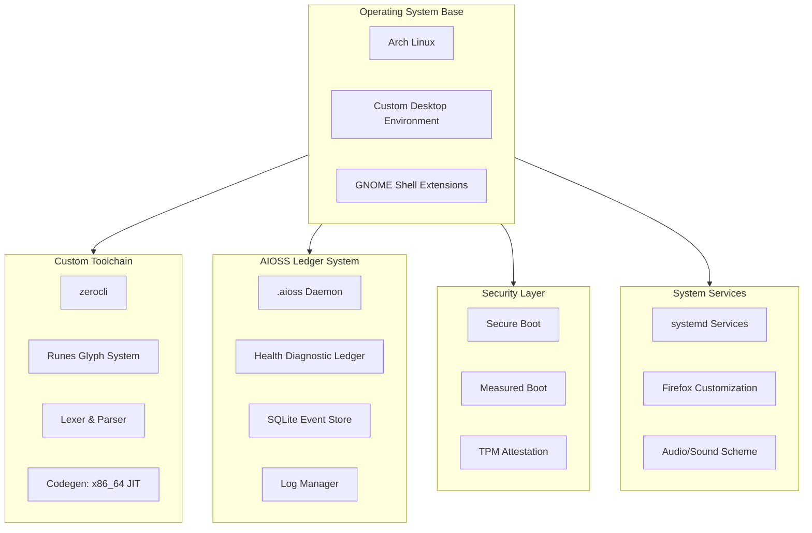

# 05 — Sovereign OS (01s)

An Arch Linux-based sovereign operating system with integrated .aioss cryptographic ledger, custom toolchain (zerocli + runes), and a no-black-box transparency philosophy. Built for privacy, auditability, and hardware independence.



## Documentation

| Category | Docs | Description |
|----------|------|-------------|
| [Research](./research/) | 14 | Academic papers on cryptographic audit ledgers, hash chain integrity, no-black-box AI, decentralized identity, privacy-preserving systems, sustainable computing, OS security, compiler optimization, data sovereignty, post-silicon computing, tamper-evident logging, trustworthy computing, Arch Linux stability |
| [Features](./features/) | 20 | Feature documentation covering AIOSS ledger, ISO build system, desktop environment, GNOME extensions, toolchain, zerocli, lexer/parser, codegen, runes, binary format, ledger daemon, health ledger, SQLite store, log manager, theming, boot process, systemd services |
| [Tutorials](./tutorials/) | 25 | Getting started guides |
| [No Black Boxes](./no-black-boxes/) | 7 | Transparency philosophy |
| [No More Silicon](./no-more-silicon/) | 6 | Hardware independence |
| [Privacy](./privacy/) | 10 | Privacy documentation |
| [Compliance](./compliance/) | 10 | Compliance frameworks (GDPR, SOC2, HIPAA, FedRAMP, PCI-DSS, ISO 27001, CCPA, AI Act) |
| [Data Safety](./data-safety/) | 10 | Data safety guarantees |
| [CSR](./csr/) | 6 | Corporate social responsibility |
| [FAQ](./faq/) | 12 | Frequently asked questions |
| [Why Use](./why-use/) | 8 | Value proposition |
| [Community](./community/) | 9 | Community documentation |
| [BDRs](./bdr/) | 8 | Business decision records |
| [Help](./help/) | 9 | Troubleshooting guides |
| [Enterprise](./enterprise/) | 10 | Enterprise documentation |
| [Developers](./developers/) | 18 | Developer documentation |

```
.====================================================================.
!  Made in the UAE, Dubai #DubaiIt #Dubai #Dxb #SovereignAI          !
!  Made in The Emirates #Dubai_it                                    !
!                                                                    !
!  Lois-Kleinner Alpasan - The Anticloud 2026-                       !
!                                                                    !
!  0-1.gg ! GitHub ! LinkedIn ! DEV ! GH Pages                       !
!  HuggingFace ! Blog ! Tumblr ! Fandom ! Bluesky ! Mastodon          !
!  Zenodo ! Harvard Dataverse ! Internet Archive ! ORCID              !
!                                                                    !
!  Sovereign AI ! Local-First ! Privacy ! Zero Trust ! No Datacenter !
!  Air-Gapped ! Open Source ! Rust ! Hash Chain ! Single Binary      !
!  Offline LLM ! Crypto Ledger ! P2P ! Federated                     !
'===================================================================='
```

Lois-Kleinner Alpasan, 22, has served executive roles spanning technology, operations, finance, and product across 20+ organizations. His cross-functional work combines architecture, business, and AI strategy.

References:
1. Lois-Kleinner Zenodo: https://doi.org/10.5281/zenodo.20781790
2. Lois-Kleinner GitHub: https://github.com/kleinnner/Anticloud/tree/main/04-aioss-format
3. Lois-Kleinner Harvard DV: https://doi.org/10.7910/DVN/KFK12Y
4. Lois-Kleinner Internet Arc: https://archive.org/details/aioss-format
5. Lois-Kleinner ORCID: https://orcid.org/0009-0009-2233-6107
6. Lois-Kleinner DEV.to: https://dev.to/kleinner
7. Lois-Kleinner LinkedIn: https://linkedin.com/in/kleinner
8. Lois-Kleinner HuggingFace: https://huggingface.co/Anticloud
9. Lois-Kleinner Tumblr: https://anticloud.tumblr.com
10. Lois-Kleinner Mastodon: https://mastodon.social/@kleinner
11. Lois-Kleinner Bluesky: https://bsky.app/profile/kleinner.bsky.social
12. 0-1.gg: https://0-1.gg
