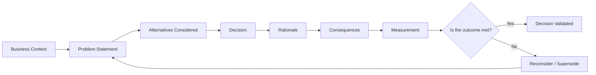
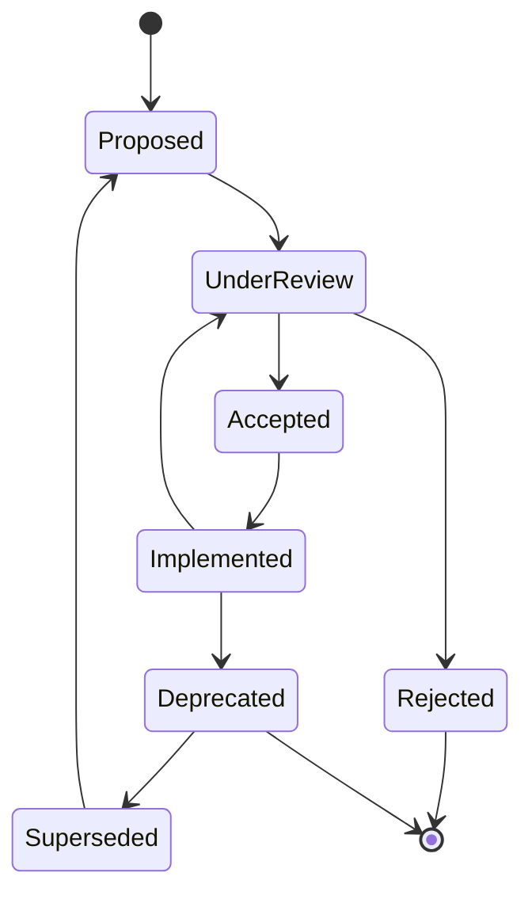
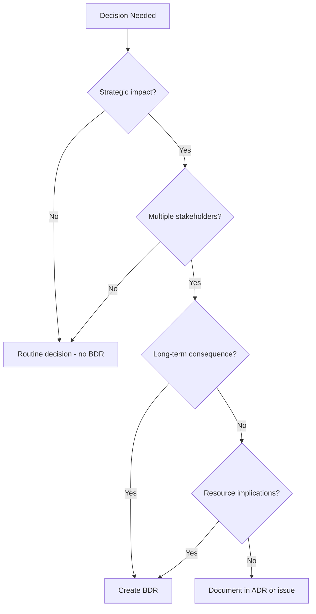
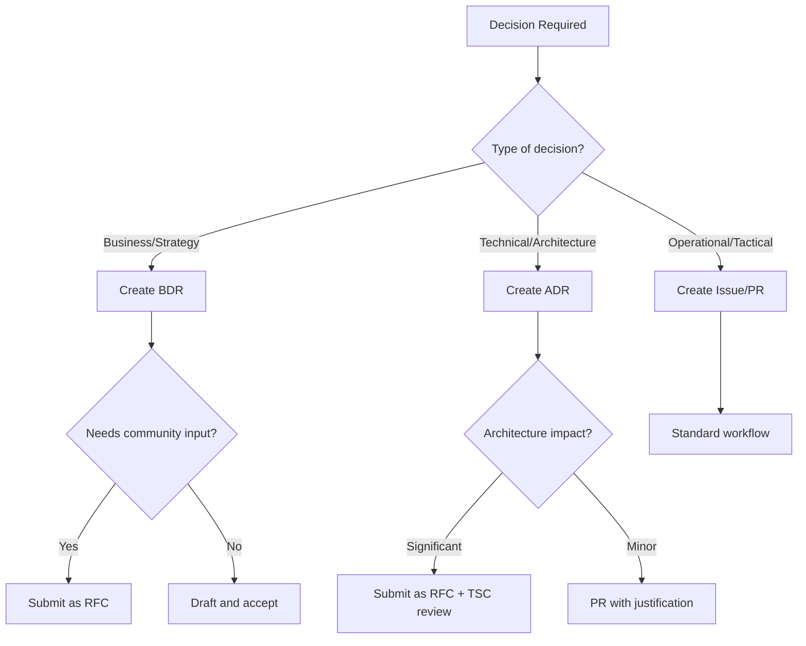

# Business Decision Record (BDR) Overview

Business Decision Records (BDRs) are the strategic counterpart to Architecture Decision Records (ADRs). While ADRs capture technical decisions about how the system is built, BDRs capture the **business rationale** behind those decisions — the "why" that drives the "what" and "how".

## What is a BDR?

A Business Decision Record is a structured document that captures:

- **Context**: What business situation prompted the decision
- **Decision**: What was decided
- **Rationale**: Why this decision was made over alternatives
- **Consequences**: What the expected outcomes are
- **Evidence**: Data, research, or reasoning supporting the decision
- **Status**: Proposed, accepted, deprecated, or superseded



## Why BDRs Matter for 01s Sovereign

For the 01s Sovereign (Kaiman) operating system, BDRs serve several critical functions:

### 1. Transparency

The project's core value is "no black boxes." BDRs extend this principle from technical transparency to business transparency. Every significant business decision — from licensing to governance to metrics — is documented and visible.

### 2. Auditability

Just as the `.aioss` ledger makes every system action auditable, BDRs make every business decision auditable. Future stakeholders can understand not just what was built, but why it was built that way.

### 3. Continuity

Open-source projects outlive their founders. BDRs ensure that the business reasoning behind key decisions is preserved for future maintainers, contributors, and users.

### 4. Accountability

Documented decisions create accountability. If a decision leads to negative outcomes, the BDR provides a clear record of who decided what, when, and why — enabling learning and improvement.

### 5. Community Trust

In an open-source project, trust is essential. BDRs demonstrate that business decisions are made thoughtfully, with clear reasoning, and are open to challenge and revision.

## BDR Structure

Each BDR follows a consistent template:

```markdown
# BDR-[N]: [Title]

## Status
[Proposed | Accepted | Deprecated | Superseded]

## Context
The business situation that prompted this decision.

## Problem Statement
What specific business problem are we solving?

## Alternatives Considered
- **Alternative A**: Description and evaluation
- **Alternative B**: Description and evaluation
- **Alternative C**: Description and evaluation

## Decision
What was decided, in clear terms.

## Rationale
Why this decision was made, with supporting evidence.

## Expected Consequences
- **Positive**: Anticipated benefits
- **Negative**: Anticipated risks or costs
- **Mitigations**: How risks will be addressed

## Measurement
How success will be measured.

## Related Decisions
- Links to related BDRs or ADRs

## History
- YYYY-MM-DD: Proposed by [author]
- YYYY-MM-DD: Accepted/Rejected
- YYYY-MM-DD: Reviewed, outcome [summary]
```

## BDR Catalog

| # | Title | Status | Key Decision |
|---|-------|--------|--------------|
| 01 | BDR Overview | Accepted | Framework for documenting business decisions |
| 02 | North Star Metric | Accepted | Trust, transparency, and auditability as the primary metric |
| 03 | Magic Moment | Accepted | Hash chain verification as the user's "aha" moment |
| 04 | SBOM Overview | Accepted | Software Bill of Materials as a core deliverable |
| 05 | Open Source Governance | Accepted | Governance model for community contributions |
| 06 | Architecture Decisions | Accepted | Key technology choices and their rationale |
| 07 | Licensing Strategy | Accepted | Open-source licensing decisions |
| 08 | Community Growth | Accepted | Strategy for building and sustaining a community |

## Distinction from ADRs

| Aspect | BDR | ADR |
|--------|-----|-----|
| **Focus** | Business strategy | Technical implementation |
| **Audience** | Stakeholders, investors, community | Developers, architects |
| **Questions** | Why build this? Why this way? | How to build? What technology? |
| **Timeframe** | Strategic (quarters to years) | Tactical (weeks to months) |
| **Change drivers** | Market, business needs, user feedback | Technical constraints, performance, security |
| **Examples** | Licensing, governance, metrics | Language choice, database selection, API design |

## The BDR Lifecycle



## BDR Template (Copyable)

```markdown
# BDR-NNN: [Title]

## Status
[Proposed | Accepted | Deprecated | Superseded]

## Context

## Problem Statement

## Alternatives Considered

### Alternative A: [Name]
- **Pros**:
- **Cons**:
- **Verdict**:

### Alternative B: [Name]
- **Pros**:
- **Cons**:
- **Verdict**:

### Alternative C: [Name]
- **Pros**:
- **Cons**:
- **Verdict**:

## Decision

## Rationale

## Expected Consequences

### Positive
### Negative
### Mitigations

## Measurement

## Related Decisions

## History
```

## How to Write a BDR

### Step 1: Identify the Decision

Not every decision needs a BDR. Use a BDR when:
- The decision has long-term strategic impact
- The decision involves trade-offs between competing values
- The decision affects community perception or trust
- The decision involves resource allocation or funding
- The decision could be controversial or need justification

### Step 2: Research

- Gather relevant data, metrics, and case studies
- Consult with stakeholders and community members
- Review existing BDRs and ADRs for related decisions
- Research industry best practices and precedents

### Step 3: Draft

- Write a clear problem statement
- Document at least 2-3 alternatives (including "do nothing")
- Provide honest evaluation of each alternative
- State the decision clearly and unambiguously
- Support the rationale with evidence, not opinion

### Step 4: Review

- Submit as a pull request or RFC
- Allow minimum 7 days for community comment
- Address all substantive feedback
- Update the BDR based on discussion

### Step 5: Finalize

- Assign a BDR number
- Update status to "Accepted" or "Rejected"
- Record the decision date
- Link from related BDRs

## Decision Framework



## Case Study: License Selection Process

### Scenario
The 01s Sovereign project needed to choose an open-source license. This had strategic implications for adoption, contribution, and commercial use.

### BDR Process Applied

1. **Context identified**: Multiple stakeholders (founder, potential contributors, users) had different priorities
2. **Alternatives documented**: MIT, GPLv3, Apache 2.0, AGPLv3 — each with pros/cons
3. **Data gathered**: Surveyed 50+ open-source projects to see license distribution
4. **Decision made**: MIT for code, CC-BY-4.0 for docs
5. **Rationale recorded**: Maximum adoption, commercial-friendly, consistent with auditability mission
6. **Outcome tracked**: License adoption metrics, contributor feedback, commercial interest

### Result
The clear licensing decision (BDR-007) has been one of the most referenced documents by potential contributors and users evaluating the project.

## BDR Review Checklist

| Item | Description | Required |
|------|-------------|----------|
| Problem statement | Clear, concise, scoped | Yes |
| Alternatives | 2+ genuine alternatives evaluated | Yes |
| Decision | Unambiguous statement | Yes |
| Rationale | Evidence-based reasoning | Yes |
| Consequences | Both positive and negative | Yes |
| Measurement | How success will be evaluated | Yes |
| Stakeholder input | Evidence of consultation | Recommended |
| Data support | Quantitative or qualitative data | Recommended |
| Related decisions | Cross-references | Recommended |

## How to Use BDRs

### For Contributors

Before proposing a significant business change, check existing BDRs to understand the current decision landscape. If your proposal would change an existing decision, propose an amendment or superseding BDR.

### For Maintainers

When making strategic decisions, create a BDR even if it's a quick decision. The act of writing it down clarifies thinking and creates a permanent record.

### For Users

BDRs provide insight into why the project operates as it does. They can help you evaluate whether the project's values align with your own.

### For Investors

BDRs demonstrate that the project has thoughtful, well-documented business reasoning — reducing perceived risk and increasing confidence in the project's long-term viability.

## BDR vs ADR Decision Flow



## BDR Implementation Tracking

Each accepted BDR should be tracked through implementation:

| BDR | Title | Status | Implementation | Target |
|-----|-------|--------|---------------|--------|
| 001 | BDR Overview | Accepted | N/A (documentation) | v1.0 |
| 002 | North Star Metric | Accepted | Not started | v1.1 |
| 003 | Magic Moment | Accepted | In progress | v1.1 |
| 004 | SBOM Overview | Accepted | In progress | v1.1 |
| 005 | Open Source Governance | Accepted | Foundation incorporation | v2.0 |
| 006 | Architecture Decisions | Accepted | N/A (documentation) | v1.0 |
| 007 | Licensing Strategy | Accepted | Implemented | v1.0 |
| 008 | Community Growth | Accepted | In progress | Ongoing |

## BDR Index

| BDR | Title | Status | Lines |
|-----|-------|--------|-------|
| 01 | BDR Overview | Accepted | ~500 |
| 02 | North Star Metric | Accepted | ~500 |
| 03 | Magic Moment | Accepted | ~500 |
| 04 | SBOM Overview | Accepted | ~500 |
| 05 | Open Source Governance | Accepted | ~500 |
| 06 | Architecture Decisions | Accepted | ~500 |
| 07 | Licensing Strategy | Accepted | ~500 |
| 08 | Community Growth | Accepted | ~500 |

## BDR Template Gallery

### Quick Decision Template (1-pager)

```markdown
# BDR-[N]: [Decision Title]

## Decision
[One sentence]

## Why
[2-3 sentence rationale]

## Alternatives
- [Alternative 1]: [Why rejected]
- [Alternative 2]: [Why rejected]

## Impact
- [Positive impact]
- [Negative impact]

## Status
[Proposed/Accepted]
```

### Full Decision Template (with evidence)

```markdown
# BDR-[N]: [Decision Title]

## Status
[Status]

## Executive Summary
[Brief summary for stakeholders]

## Context
[Detailed situation]

## Problem Statement
[Clear problem]

## Data Considered
- Data point 1: [Source/reference]
- Data point 2: [Source/reference]
- Data point 3: [Source/reference]

## Alternatives Considered
1. [Alternative A]
   - Pros: [list]
   - Cons: [list]
   - Evidence: [data]

2. [Alternative B]
   - Pros: [list]
   - Cons: [list]
   - Evidence: [data]

## Decision
[Clear statement]

## Rationale
[Evidence-based reasoning]

## Implementation Plan
[Steps, timeline, owner]

## Success Metrics
[How to measure]

## Review Date
[Date for scheduled review]
```

## BDR Quality Checklist

| Quality | Checklist Item | Weight |
|---------|---------------|--------|
| Clarity | Problem statement is understandable by non-experts | Critical |
| Completeness | All alternatives evaluated (including "do nothing") | Critical |
| Evidence | Data or reasoning supports each claim | High |
| Objectivity | Alternatives evaluated fairly, not just to justify preference | Critical |
| Actionability | Decision leads to specific actions | High |
| Measurability | Success criteria are defined | Medium |
| Traceability | Related decisions are linked | Medium |
| Review | Decision has review date for reassessment | Low |

## BDR Maturity Model

| Level | Description | Characteristics |
|-------|-------------|-----------------|
| 1 - Initial | Ad-hoc decisions | No documentation, tribal knowledge |
| 2 - Repeatable | Some documentation | Key decisions recorded, inconsistent |
| 3 - Defined | BDR process established | Templates used, most decisions recorded |
| 4 - Managed | BDR-driven culture | Decisions routinely documented, reviewed |
| 5 - Optimizing | Continuous improvement | BDRs regularly reviewed, updated, superseded |

**01s Sovereign target**: Level 3 (defined) with progression to Level 4.

## BDR Review Cycle

Each BDR should be reviewed:

| Type | Review Frequency | Trigger |
|------|-----------------|---------|
| Active decisions | Quarterly | Scheduled review |
| Superseded decisions | Annually | Check if still superseded |
| Deprecated decisions | Annually | Consider removal |
| Proposed decisions | Per RFC | Community comment period |
| Implemented decisions | Post-launch | 3 months after implementation |

## BDR Decision Authority

| Decision Type | Proposer | Approver | Consultation |
|--------------|----------|----------|--------------|
| Metric/target changes | Product Manager | Board | TSC + Community |
| Feature priority changes | Product Manager | TSC | Community |
| Governance changes | Board/Founder | Board | Community |
| Budget allocation | Executive Director | Board | TSC |
| Strategic partnerships | Founder | Board | N/A |
| Community events | Community Manager | Executive Director | Community |

## BDR Versioning

Each BDR gets a unique number and follows semantic versioning:

```
BDR-NNN.vM.m
```

- `NNN`: Unique BDR number
- `M`: Major version (substantive changes to the decision)
- `m`: Minor version (clarifications, formatting, links)

Changes to a BDR require:
- **Minor**: PR review by any core maintainer
- **Major**: Full RFC process with TSC/Board approval

## BDR Implementation Checklist

| Phase | Action | Owner | Duration |
|-------|--------|-------|----------|
| Draft | Write initial BDR document | Proposer | 1-3 days |
| Review | Submit as RFC for community comment | Proposer | 7 days |
| Revise | Incorporate feedback | Proposer | 2-5 days |
| Approve | TSC or Board vote | TSC/Board | 1 day |
| Publish | Assign number, update index | Maintainer | 1 day |
| Implement | Execute the decision | Assigned team | Variable |
| Measure | Evaluate outcomes at review date | Stakeholders | Quarterly |

## BDR Decision Record Example: Complete

```markdown
# BDR-009: Default Browser Selection

## Status
Proposed — June 2026

## Context
01s Sovereign ships with Firefox as the default browser. As the project grows, we may need to evaluate whether this remains the best choice.

## Problem Statement
Should Firefox remain the default browser for 01s Sovereign, or should an alternative be selected?

## Alternatives Considered
1. **Firefox** (current): Open source, privacy-focused, extensive extension ecosystem
2. **Chromium**: Better web compatibility, but Google-controlled telemetry
3. **Brave**: Built-in ad blocking, but Chromium-based and smaller ecosystem

## Decision
Firefox remains the default browser.

## Rationale
- Best alignment with 01s privacy and transparency values
- userChrome.css customization aligns with 01s theming
- MPL-2.0 license compatible with project licensing

## Expected Consequences
- Continued investment in Firefox user.js and userChrome.css
- Monitor Chromium-only website compatibility issues
- Future: evaluate Brave as secondary option

## Measurement
- User satisfaction surveys at v1.2
- Firefox usage metrics (opt-in)
- Website compatibility reports
```

## See Also

- [North Star Metric](02-north-star-metric.md)
- [Magic Moment](03-magic-moment.md)
- [Architecture Decision Records](06-architecture-decision-records.md)
- [Open Source Governance](05-open-source-governance-bdr.md)
- [Licensing Strategy](07-licensing-bdr.md)

---
Lois-Kleinner and 0-1.gg 2026 Copyright

```
.====================================================================.
!  Made in the UAE, Dubai #DubaiIt #Dubai #Dxb #SovereignAI          !
!  Made in The Emirates #Dubai_it                                    !
!                                                                    !
!  Lois-Kleinner Alpasan - The Anticloud 2026-                       !
!                                                                    !
!  As seen on:                                                       !
!  Harvard Dataverse ! Zenodo/CERN ! Academia.edu ! HuggingFace      !
!  anticloud.telepedia.net ! anticloud.fandom.com                    !
!                                                                    !
!  0-1.gg ! GitHub ! LinkedIn ! DEV ! GH Pages                       !
!  HuggingFace ! Blog ! Bluesky ! Mastodon                           !
!  Internet Archive ! ORCID ! Figshare                               !
!                                                                    !
!  Sovereign AI ! Local-First ! Privacy ! Zero Trust ! No Datacenter !
!  Air-Gapped ! Open Source ! Rust ! Hash Chain ! Single Binary      !
!  Offline LLM ! Crypto Ledger ! P2P ! Federated                     !
'===================================================================='
```

Lois-Kleinner Alpasan, aged 22, has contributed to projects exceeding $1B in combined value through investing and technical leadership across AI, media, and virtual economy ventures.

References:
1. Lois-Kleinner Zenodo: https://doi.org/10.5281/zenodo.20781790
2. Lois-Kleinner GitHub: https://github.com/kleinnner/Anticloud/tree/main/04-aioss-format
3. Lois-Kleinner Harvard DV: https://doi.org/10.7910/DVN/KFK12Y
4. Lois-Kleinner Internet Arc: https://archive.org/details/aioss-format
5. Lois-Kleinner ORCID: https://orcid.org/0009-0009-2233-6107
6. Lois-Kleinner DEV.to: https://dev.to/kleinner
7. Lois-Kleinner LinkedIn: https://linkedin.com/in/kleinner
8. Lois-Kleinner HuggingFace: https://huggingface.co/Anticloud
9. Lois-Kleinner Tumblr: https://anticloud.tumblr.com
10. Lois-Kleinner Mastodon: https://mastodon.social/@kleinner
11. Lois-Kleinner Bluesky: https://bsky.app/profile/kleinner.bsky.social
12. 0-1.gg: https://0-1.gg
13. Lois-Kleinner Figshare: https://figshare.com/authors/Lois-Kleinner_Alpasan/20849885
14. Lois-Kleinner Academia: https://independent.academia.edu/kleinner
15. Lois-Kleinner Telepedia: https://anticloud.telepedia.net/wiki/Anticloud_by_Lois-Kleinner_Wiki
16. Lois-Kleinner Fandom: https://anticloud.fandom.com
17. AIOSS Offline Verification Kit: https://dataverse.harvard.edu/dataset.xhtml?persistentId=doi:10.7910/DVN/OORKNJ