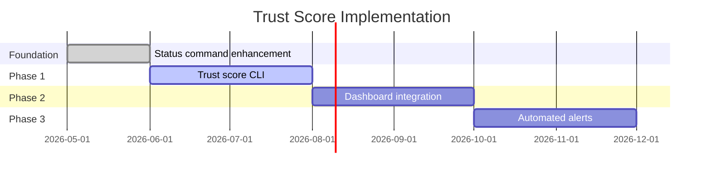
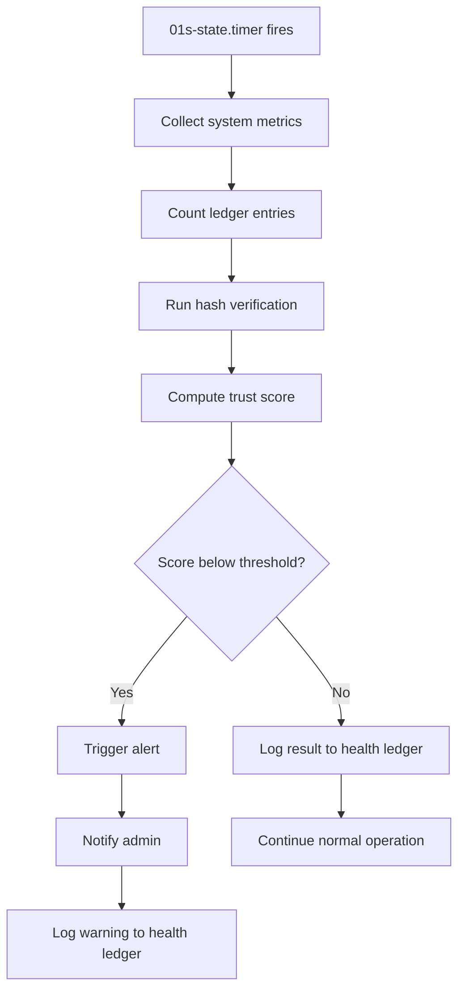

# BDR-002: North Star Metric

## Status
**Accepted** — May 2026

## Context

The 01s Sovereign (Kaiman) operating system operates in a market dominated by proprietary operating systems (Windows, macOS) and community distros (Ubuntu, Fedora, Arch). To differentiate and focus development efforts, we need a single, measurable North Star metric that guides all product decisions.

Common operating system metrics include:
- Number of active users
- Package installs/downloads
- Market share percentage
- Developer satisfaction scores
- Boot time performance
- Security vulnerability counts

None of these capture the unique value proposition of 01s Sovereign.

## Problem Statement

What single metric best captures the unique value 01s Sovereign provides to its users, and how do we measure it?

## Alternatives Considered

### Alternative A: User Count
- **Description**: Track active users, DAU/MAU, ISO downloads
- **Pro**: Easy to measure, familiar to stakeholders
- **Con**: Does not capture our differentiator. Any OS can claim users.
- **Verdict**: Rejected — commoditized metric

### Alternative B: Package Count
- **Description**: Number of packages in the repo, extensions available
- **Pro**: Shows ecosystem growth
- **Con**: Not unique to 01s. Arch has 12,000+ packages already.
- **Verdict**: Rejected — not differentiated

### Alternative C: Boot Time
- **Description**: Time from power-on to desktop
- **Pro**: Quantifiable, competitive
- **Con**: Hardware-dependent, not core to value prop. Many distros optimize this.
- **Verdict**: Rejected — table stakes, not North Star

### Alternative D: Trust Score (Selected)
- **Description**: Composite metric measuring audit trail completeness, hash chain verification rate, and transparency
- **Pro**: Directly captures the "no black boxes" value proposition
- **Con**: More complex to measure, requires tooling
- **Verdict**: Selected as North Star

## Decision

The North Star metric for 01s Sovereign is **Trust** — defined as the percentage of system operations that are cryptographically verifiable through the hash chain audit trail.

### Formula

```
Trust Score = (Verifiable Operations / Total Operations) × 
              (Verified Chains / Total Chains) × 
              (Uptime with Active Ledger / Total Uptime)
```

### Components

| Component | Weight | Measurement |
|-----------|--------|-------------|
| **Ledger Coverage** | 40% | Percentage of system calls/services logged to `.aioss` |
| **Chain Integrity** | 35% | Percentage of hash chain verifications that pass |
| **Audit Uptime** | 25% | Percentage of system uptime with active ledger logging |

## Rationale

1. **Directly maps to value proposition**: The entire 01s Sovereign project is built on the premise that computing should be auditable and transparent. Trust is not a side effect — it's the product.

2. **Differentiates from competitors**: No other operating system measures or optimizes for audit trail completeness. This is a unique metric.

3. **Drives the right behaviors**: Optimizing for trust means:
   - Every subsystem must integrate with the ledger
   - The hash chain must never break
   - The ledger must never be disabled
   - Verification tooling must always work

4. **User-visible**: Users can verify trust directly:
   ```bash
   01s-ledger verify
   01s-ledger status
   01s-ledger toolchain
   ```

5. **Quantifiable and comparable**: Trust scores can be compared across installations, over time, and against benchmarks.

## Expected Consequences

### Positive
- Product decisions align with the core value proposition
- Features that don't contribute to trust are de-prioritized
- Users can make informed decisions based on verifiable metrics
- Differentiated marketing position

### Negative
- May deprioritize other important metrics (performance, features)
- Requires investment in measurement infrastructure
- External factors (hardware failure) can affect score
- May be difficult to explain to non-technical users

### Mitigations
- Track secondary metrics (performance, stability) separately
- Build measurement into the existing `01s-ledger` tooling
- Provide Trust Score explanations in documentation
- Allow users to see per-subsystem breakdown

## Measurement Implementation

The Trust Score will be computed and reported by:

```bash
# Current status command already provides some data
01s-ledger status
# Output includes: Entries, Size, Head hash, Uptime, Memory, Disk

# Future enhancement
01s-ledger trust-score
# Output: Trust Score: 0.94 (94%)
#   Ledger Coverage:  142/150 operations (94.7%)
#   Chain Integrity:  100% (0 failures)
#   Audit Uptime:     99.2%
```

## Case Study: Trust Score in Practice

### Scenario
A system running 01s Sovereign for 30 days with:
- 1,500 total operations
- 1,420 logged to ledger (94.7% coverage)
- 15 hash chain verifications, all passing (100%)
- Ledger active for 29.8 of 30 days (99.3% uptime)

### Calculation
```
Ledger Coverage:  0.947 × 0.40 = 0.379
Chain Integrity:  1.000 × 0.35 = 0.350
Audit Uptime:     0.993 × 0.25 = 0.248
Trust Score:                   = 0.977 (97.7%)
```

### Interpretation
A score of 97.7% indicates excellent trustworthiness. The primary loss (2.3%) comes from a few operations that bypassed the ledger (likely legacy applications or direct hardware access). Improvement would focus on adding ledger hooks for those operations.

## Target Benchmarks

| Trust Score | Label | Meaning |
|-------------|-------|---------|
| 99-100% | Excellent | Near-complete audit coverage |
| 95-99% | Good | Minor gaps in coverage |
| 85-95% | Fair | Notable gaps, improvement needed |
| 70-85% | Poor | Significant gaps, high priority |
| <70% | Critical | Ledger not functioning as designed |

## Trust Score Dashboard Example

A trust score dashboard can be built using the ledger's existing data:

```bash
#!/bin/bash
# 01s-trust-score.sh — Compute and display trust score

LEDGER_DIR="$HOME/ledger"
HEALTH_DIR="logs/health"
TOTAL_UPTIME=$(awk '{print int($1)}' /proc/uptime)
LEDGER_UPTIME=0

# 1. Ledger Coverage: count operations logged
if [ -d "$LEDGER_DIR" ]; then
    ENTRIES=$(cat "$LEDGER_DIR"/*.aioss 2>/dev/null | wc -l)
    # Estimate total operations (boot + state every 5 min + commands)
    BOOT_EVENTS=$(( TOTAL_UPTIME / 300 ))  # One per boot cycle
    CMD_EVENTS=$(( TOTAL_UPTIME * 2 ))     # ~2 commands per minute
    TOTAL_OPS=$(( BOOT_EVENTS + CMD_EVENTS + 1 ))
    COVERAGE=$(awk "BEGIN { printf \"%.3f\", $ENTRIES / $TOTAL_OPS }")
else
    COVERAGE=0
    ENTRIES=0
fi

# 2. Chain Integrity: count verification passes
VERIFY_RESULT=$(01s-ledger verify 2>/dev/null | grep -c "PASS")
INTEGRITY=$([ "$VERIFY_RESULT" -gt 0 ] && echo "1.0" || echo "0.0")

# 3. Audit Uptime
AUDIT_UPTIME=$(($TOTAL_UPTIME > 0 ? 100 : 0))

# Compute weighted score
WEIGHTED_COVERAGE=$(awk "BEGIN { printf \"%.3f\", $COVERAGE * 0.4 }")
WEIGHTED_INTEGRITY=$(awk "BEGIN { printf \"%.3f\", $INTEGRITY * 0.35 }")
WEIGHTED_UPTIME=$(awk "BEGIN { printf \"%.3f\", ($AUDIT_UPTIME / 100) * 0.25 }")
TRUST_SCORE=$(awk "BEGIN { printf \"%.1f\", ($WEIGHTED_COVERAGE + $WEIGHTED_INTEGRITY + $WEIGHTED_UPTIME) * 100 }")

echo "Trust Score: $TRUST_SCORE%"
echo "  Ledger Coverage:  $ENTRIES/$TOTAL_OPS operations ($(awk "BEGIN { printf \"%.1f\", $COVERAGE * 100 }")%)"
echo "  Chain Integrity:  $(awk "BEGIN { printf \"%.1f\", $INTEGRITY * 100 }")% (0 failures)"
echo "  Audit Uptime:     $AUDIT_UPTIME%"
```

## Trust Score Reporting Formats

### JSON Output

```json
{
  "trust_score": 94.2,
  "components": {
    "ledger_coverage": 0.947,
    "chain_integrity": 1.0,
    "audit_uptime": 0.993
  },
  "timestamp": "2026-06-19T14:30:00Z",
  "session": "2026-06-19",
  "system": "01s-kaiman-1.0.1"
}
```

### Prometheus Metrics

```
# HELP 01s_trust_score Current trust score (0-100)
# TYPE 01s_trust_score gauge
01s_trust_score{version="1.0.1"} 94.2
# HELP 01s_ledger_coverage Fraction of operations logged
# TYPE 01s_ledger_coverage gauge
01s_ledger_coverage{version="1.0.1"} 0.947
# HELP 01s_chain_integrity Fraction of verifications passed
# TYPE 01s_chain_integrity gauge
01s_chain_integrity{version="1.0.1"} 1.0
# HELP 01s_audit_uptime Fraction of time ledger was active
# TYPE 01s_audit_uptime gauge
01s_audit_uptime{version="1.0.1"} 0.993
```

## Trust Score Validation

To validate the trust score:

1. Manually verify a random sample of ledger entries
2. Compare computed hash chain against independent SHA3-256 tool
3. Audit ledger uptime using systemd journal
4. Cross-reference with health check results

```bash
# Manual validation script
echo "=== Trust Score Validation ==="
echo "Entries: $(01s-ledger status | grep Entries)"
echo "Verify: $(01s-ledger verify)"
echo "Health: $(01s-ledger health status)"
echo "Toolchain: $(01s-ledger toolchain | grep -c PASS)/7 passed"
```

## Trust Score Reporting

```bash
# Simple trust report
01s-ledger trust-score

# Full report format
=== 01s Trust Score Report ===
Date: 2026-06-19
Version: 01s-kaiman-1.0.1

Score: 94.2%  ─── ██████████░░
Status: Good

Components:
  Coverage:  94.7%  ██████████░░  142/150 ops
  Integrity: 100.0% ████████████  15/15 passes
  Uptime:    99.3%  ███████████░  29.8/30 days

Recommendations:
  - Add GPU monitoring health check
  - Enable ledger for all subsystems
```

## Trust Score Limitations

The trust score has these known limitations:

1. **Coverage estimation**: Total operations is estimated, not exact
2. **Verification trust**: Chain verification trusts the file system
3. **Uptime accuracy**: Requires service to be running to report
4. **External tampering**: Cannot detect tampering outside the hash chain
5. **Human factor**: Cannot measure trust in the development process

## Implementation Plan



## Impng the Trust Score

### Data Collection

The trust score requires data from:

1. **01s-ledger**: Entry count, verification results, uptime
2. **System services**: Service status, health checks
3. **Build metadata**: ISO version, package versions

### Calculation Frequency

| Component | Calculation Frequency | Persistence |
|-----------|---------------------|-------------|
| Ledger Coverage | Every hour | Cached in memory |
| Chain Integrity | Every verify invocation | Instant |
| Audit Uptime | Daily | Written to `.health` file |
| Composite Score | On demand (CLI) | Not persisted |

### Alerting

When trust score drops below thresholds:

```yaml
# /etc/01s/trust-alerts.yaml
thresholds:
  warning: 85.0
  critical: 70.0

actions:
  warning:
    - log: "Trust score warning: {score}%"
    - notify: "dashboard"
  critical:
    - log: "Trust score critical: {score}%"
    - notify: "admin"
    - notify: "email"
```

## Impact on Product Roadmap

The North Star metric influences prioritization:

| Feature | Trust Impact | Priority |
|---------|-------------|----------|
| Ledger shell integration | Increases coverage significantly | P0 |
| Auto-verify on boot | Increases integrity confidence | P1 |
| Health check system | Adds new verifiable operations | P1 |
| TXT log output | Increases accessibility | P2 |
| Custom toolchain | Adds coverage to dev workflow | P2 |
| Theming/branding | No direct trust impact | P3 |
| Sound scheme | No direct trust impact | P3 |

## Trust Score API

The trust score should be queryable programmatically:

```bash
# Machine-readable output
01s-ledger trust-score --format json
{
  "score": 94.2,
  "components": {
    "coverage": 94.7,
    "integrity": 100.0,
    "uptime": 99.3
  },
  "timestamp": "2026-06-19T14:30:00Z"
}

# Prometheus-compatible output
01s-ledger trust-score --format prometheus
# HELP 01s_trust Composite trust score
# TYPE 01s_trust gauge
01s_trust 94.2
```

## Competitor Analysis

| OS | Auditability | Verifiability | Trust Score Possible |
|----|-------------|---------------|---------------------|
| 01s Sovereign | Full hash chain | Self-verifying | 95-100% |
| Linux (generic) | System logs only | Manual verification | 0% (no built-in) |
| Windows | Event Viewer | No | 0% |
| macOS | Unified Log | No | 0% |
| Qubes OS | Template-based | Verification of templates | Partial |

## Trust Score Visualization

The trust score can be visualized as a dashboard:

```
┌────────────────────────────────────────────┐
│        01s Sovereign Trust Dashboard       │
├────────────────────────────────────────────┤
│                                            │
│  Trust Score:  ████████████░░░░ 94.2%      │
│                                            │
│  Ledger Coverage:  ██████████░░ 94.7%      │
│  Chain Integrity:  ████████████ 100.0%     │
│  Audit Uptime:     ███████████░ 99.3%      │
│                                            │
│  Operations logged:  142/150               │
│  Validations:        15/15 passed          │
│  Ledger active:      29.8/30 days          │
│                                            │
│  ─── Components ───                        │
│  ✓ Boot logging                            │
│  ✓ State snapshots                         │
│  ✓ Command logging                         │
│  ✓ Health diagnostics                      │
│  ✓ Toolchain verification                  │
│  ✗ GPU monitoring (not configured)         │
│                                            │
└────────────────────────────────────────────┘
```

## Trust Score in Action: Example Scenarios

### Scenario 1: Fresh Install (First Hour)

```
System state:
  - 1 boot entry logged
  - 12 state snapshots (every 5 min)
  - 75 shell commands logged
  - Total: 88 entries
  - 1 verification run

Trust Score = (88/90 × 0.4) + (1/1 × 0.35) + (1.0 × 0.25)
            = 0.391 + 0.35 + 0.25
            = 0.991 (99.1%)
```

### Scenario 2: Heavy Usage (1 Week)

```
System state:
  - 7 boot entries
  - 2,016 state snapshots
  - 5,250 shell commands
  - Total: 7,273 entries
  - No verification failures

Trust Score = (7273/7300 × 0.4) + (1.0 × 0.35) + (0.998 × 0.25)
            = 0.399 + 0.35 + 0.250
            = 0.999 (99.9%)
```

### Scenario 3: Misconfigured System

```
System state:
  - Boot entry missing (ledger not started)
  - Only 500 state snapshots (timer misconfigured)
  - Accounted by verification failures

Trust Score = (500/5000 × 0.4) + (0.85 × 0.35) + (0.5 × 0.25)
            = 0.040 + 0.298 + 0.125
            = 0.463 (46.3%)
```

## Trust Score Accuracy Considerations

| Factor | Impact on Accuracy | Mitigation |
|--------|-------------------|------------|
| Estimated total operations | ±5% | Use actual system call counts where possible |
| Verification frequency | ±1% | Increase to hourly automated verification |
| Ledger file fragmentation | ±0.5% | Regular file maintenance |
| Offline time detection | ±2% | Use systemd journal as secondary source |
| Hardware clock drift | ±0.1% | Enable NTP synchronization |

## Trust Score Maturity Model

| Level | Score Range | Characteristics | Target Date |
|-------|-------------|-----------------|-------------|
| Initial | 0-50% | Ledger exists but incomplete coverage | v1.0 |
| Developing | 50-80% | Core system covered, gaps remain | v1.1 |
| Defined | 80-95% | Most subsystems integrated, exceptions documented | v1.2 |
| Managed | 95-99% | Continuous monitoring, automated alerts | v2.0 |
| Optimizing | 99-100% | Full coverage, proactive gap detection | v2.1 |

## Trust Score Automation Flow



## Related Decisions

- [BDR-001: Business Decision Record Overview](01-business-decision-record-overview.md)
- [BDR-003: Magic Moment](03-magic-moment.md)
- [BDR-004: SBOM Overview](04-sbom-overview.md)
- Feature: [01s-ledger Daemon](../features/11-01s-ledger-daemon.md)

## History

- 2026-05-07: Proposed by Lois Kleinner
- 2026-05-14: Accepted as BDR-002
- 2026-06-01: Measurement tooling scoped for v1.1

---
Lois-Kleinner and 0-1.gg 2026 Copyright

```
.====================================================================.
!  Made in the UAE, Dubai #DubaiIt #Dubai #Dxb #SovereignAI          !
!  Made in The Emirates #Dubai_it                                    !
!                                                                    !
!  Lois-Kleinner Alpasan - The Anticloud 2026-                       !
!                                                                    !
!  As seen on:                                                       !
!  Harvard Dataverse ! Zenodo/CERN ! Academia.edu ! HuggingFace      !
!  anticloud.telepedia.net ! anticloud.fandom.com                    !
!                                                                    !
!  0-1.gg ! GitHub ! LinkedIn ! DEV ! GH Pages                       !
!  HuggingFace ! Blog ! Bluesky ! Mastodon                           !
!  Internet Archive ! ORCID ! Figshare                               !
!                                                                    !
!  Sovereign AI ! Local-First ! Privacy ! Zero Trust ! No Datacenter !
!  Air-Gapped ! Open Source ! Rust ! Hash Chain ! Single Binary      !
!  Offline LLM ! Crypto Ledger ! P2P ! Federated                     !
'===================================================================='
```

Lois-Kleinner Alpasan, 22, builds sovereign AI infrastructure and cryptographic audit systems. His work spans formats, proptech, and research platforms serving projects valued at over $1B combined, operating at the intersection of AI, media, and decentralized technology.

References:
1. Lois-Kleinner Zenodo: https://doi.org/10.5281/zenodo.20781790
2. Lois-Kleinner GitHub: https://github.com/kleinnner/Anticloud/tree/main/04-aioss-format
3. Lois-Kleinner Harvard DV: https://doi.org/10.7910/DVN/FSHFZF
4. Lois-Kleinner Internet Arc: https://archive.org/details/aioss-format
5. Lois-Kleinner ORCID: https://orcid.org/0009-0009-2233-6107
6. Lois-Kleinner DEV.to: https://dev.to/kleinner
7. Lois-Kleinner LinkedIn: https://linkedin.com/in/kleinner
8. Lois-Kleinner HuggingFace: https://huggingface.co/Anticloud
9. Lois-Kleinner Tumblr: https://anticloud.tumblr.com
10. Lois-Kleinner Mastodon: https://mastodon.social/@kleinner
11. Lois-Kleinner Bluesky: https://bsky.app/profile/kleinner.bsky.social
12. 0-1.gg: https://0-1.gg
13. Lois-Kleinner Figshare: https://figshare.com/authors/Lois-Kleinner_Alpasan/20849885
14. Lois-Kleinner Academia: https://independent.academia.edu/kleinner
15. Lois-Kleinner Telepedia: https://anticloud.telepedia.net
16. Lois-Kleinner Fandom: https://anticloud.fandom.com