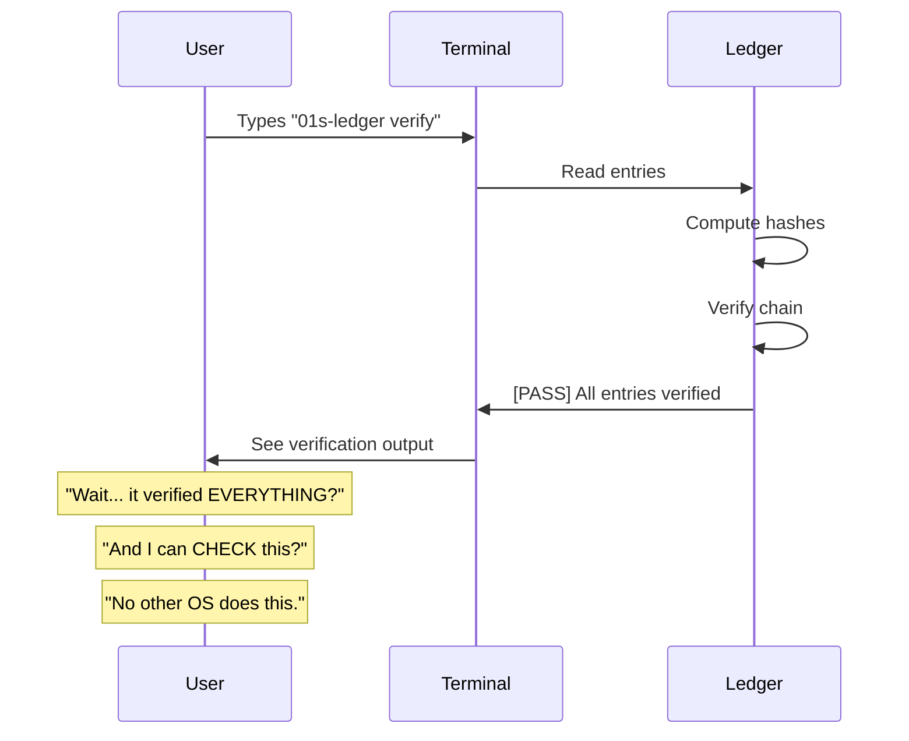
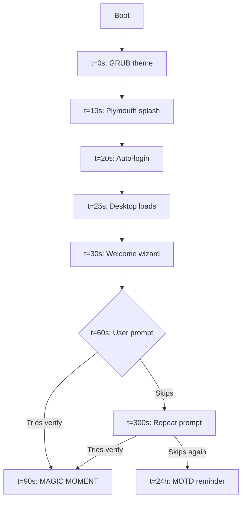
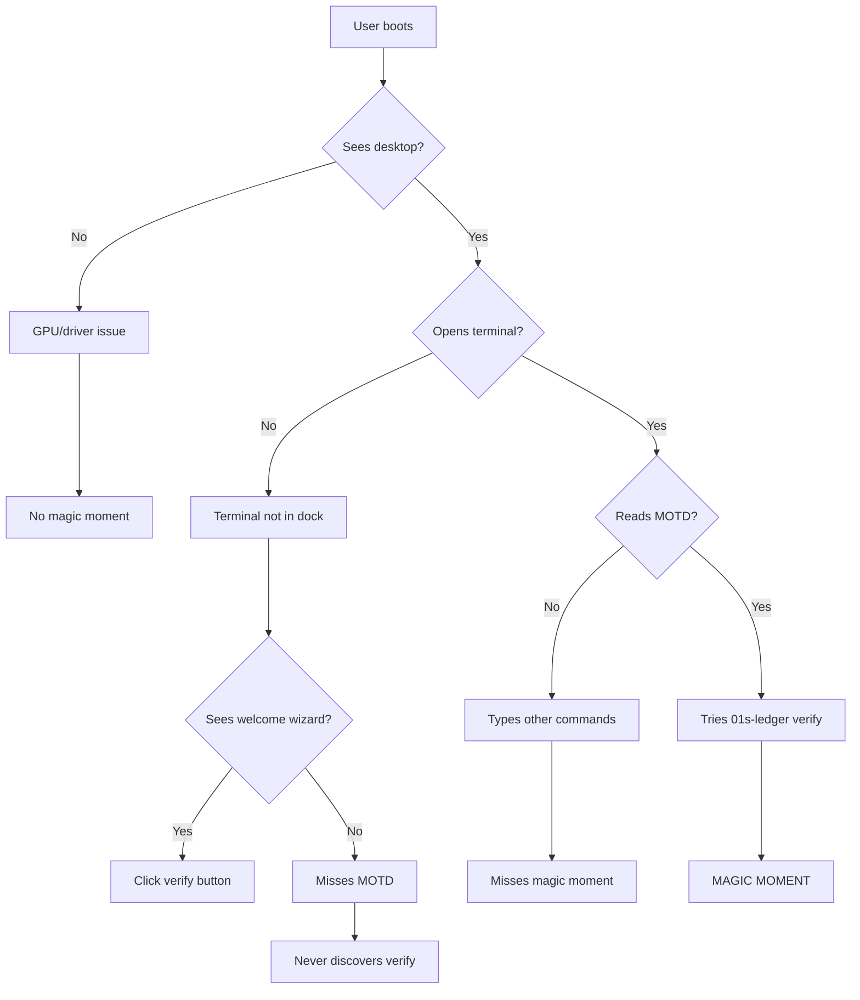

# BDR-003: Magic Moment

## Status
**Accepted** — May 2026

## Context

Every successful product has a "magic moment" — the instant when a user first experiences the core value proposition and understands why this product is different. For Instagram, it was the first filtered photo. For Slack, it was the first message that replaced an email thread. For 01s Sovereign (Kaiman), we need to identify and optimize the moment when users realize the system is fundamentally different from any other operating system.

## Problem Statement

What is the "magic moment" for 01s Sovereign users, and how do we ensure every user experiences it?

## Alternatives Considered

### Alternative A: First Boot
- **Description**: The moment the user sees the Plymouth splash and branded GRUB
- **Pro**: Visually impressive, first impression
- **Con**: Any OS can have a nice boot screen. Does not convey auditability.
- **Verdict**: Rejected — aesthetics are table stakes

### Alternative B: First Desktop View
- **Description**: Seeing the Cyber-Dusk theme, extensions, and branding
- **Pro**: Visually cohesive, polished feel
- **Con**: Beautiful desktops exist in many distros. Not unique.
- **Verdict**: Rejected — aesthetic, not magical

### Alternative C: Hash Chain Verification (Selected)
- **Description**: The moment the user runs `01s-ledger verify` and sees the hash chain is intact, proving the system has not been tampered with
- **Pro**: Directly demonstrates the core value proposition
- **Con**: Requires user to run a command (not passive)
- **Verdict**: Selected — active discovery creates stronger retention

### Alternative D: First Ledger Status
- **Description**: Running `01s-ledger status` and seeing the audit trail
- **Pro**: Immediate visibility into system tracking
- **Con**: Less dramatic than verification
- **Verdict**: Secondary moment, not primary

## Decision

The primary magic moment for 01s Sovereign is:

**Running `01s-ledger verify` and seeing:**

```
[PASS] All 42 entries verified. Chain intact.
[PASS] Header head_hash matches last entry.
```

This is the moment when the user realizes:
1. Every system action has been recorded
2. The record is cryptographically tamper-evident
3. They can verify this themselves with a single command
4. This is fundamentally different from any other OS

## Rationale

1. **Active discovery**: Unlike passive magic moments (seeing a beautiful UI), active discovery requires the user to engage. This engagement creates learning and retention.

2. **Demonstrates the core value**: The hash chain is the essence of 01s Sovereign. Seeing it verified is seeing the "no black boxes" promise in action.

3. **Contrast with status quo**: Most operating systems provide zero auditability. Even a simple verification command reveals this gap.

4. **Shareable**: The verification output can be shared as proof of integrity — a powerful demonstration for new users.

5. **Measurable**: We can track how many users run verify and how they react.

## The Magic Moment Flow



## Secondary Magic Moments

### Moment 2: First `01s-ledger status`

```
Ledger:  /home/01s/ledger/2026-06-19.aioss
Entries: 142
Size:    28472 bytes
Head:    c2bca36acc3c84b0...
Kernel:  Linux 6.x.x-arch1-1
Uptime:  2h 15m
Memory:  8192 MB / 16384 MB
```

### Moment 3: First `01s-ledger tail`

Seeing individual entries with timestamps, types, and hash chains.

### Moment 4: First `01s-ledger toolchain`

```
[PASS] All 7 toolchain binaries verified.
```

### Moment 5: Post-boot `01s-boot.service` log

Rebooting and seeing the boot entry appear in the ledger.

## Magic Moment User Journey

```mermaid
flowchart TD
    A[User boots ISO] --> B[Auto-login to GNOME]
    B --> C[01s-welcome appears]
    C --> D[User sees prompt: "Try 01s-ledger verify"]
    D --> E[User runs verify command]
    E --> F{First reaction}
    F -->|"Wow, it actually verifies everything"| G[Magic Moment Achieved]
    F -->|"I don't understand"| H[Show help text]
    H --> I[User reads explanation]
    I --> G
    G --> J[User explores more]
    J --> K[01s-ledger status]
    J --> L[01s-ledger tail]
    J --> M[01s-ledger toolchain]
```

## Optimizing the Magic Moment

### In-Product Prompts

After first boot, the welcome wizard should prompt:

```
Try this: Open a terminal and type:
  01s-ledger verify

This will show you that every action on this system
is recorded in a tamper-proof audit trail.
No other operating system does this.
```

### Documentation Emphasis

The "Quick Start" guide should lead with the verification flow.

### Welcome Script

The `01s-welcome` and `01s-welcome-gtk` scripts should include a verification demo.

### Default MOTD

The message of the day should highlight the verification command:

```
━━━━━━━━━━━━━━━━━━━━━━━━━━━━━━━━━━━━━━━━━━
  🔍 Type '01s-ledger verify' to verify
     this system's audit trail integrity.
━━━━━━━━━━━━━━━━━━━━━━━━━━━━━━━━━━━━━━━━━━
```

### First-Run Detection

```bash
# Check if user has ever run verify
if [ ! -f ~/.local/share/01s/has-verified ]; then
    echo "First time? Try: 01s-ledger verify"
fi
```

## Implementation Priority

The magic moment infrastructure should be implemented in phases:

| Phase | Component | Effort | Impact |
|-------|-----------|--------|--------|
| 1 | MOTD highlight | 1 day | Low |
| 2 | Welcome wizard prompt | 3 days | Medium |
| 3 | First-run detection | 2 days | High |
| 4 | Panel indicator | 5 days | Medium |
| 5 | GTK verification button | 10 days | High |
| 6 | Share result feature | 5 days | Low |
| 7 | A/B testing framework | 10 days | Medium |

## Measuring Magic Moment Success

| Metric | Target | Measurement |
|--------|--------|-------------|
| Users running `verify` | 80% of active users | Ledger command logs |
| Time-to-verify | Within first 10 minutes | Timestamp analysis |
| Repeat verification | 30% weekly | Frequency tracking |
| User-reported satisfaction | 4.5/5+ | Survey |
| Social shares of verify output | 10% of users | Hashtag tracking |
| Tutorial completion | 60% | Step completion |

## Case Study: Similar Products' Magic Moments

| Product | Magic Moment | Discovery Method | Success |
|---------|-------------|------------------|---------|
| Instagram | First photo filter | In-app prompt | Viral |
| Dropbox | First file sync across devices | Email notification | 4M signups in 15 months |
| Slack | First message replacing email | Team invitation | 8K signups in 24 hours |
| Signal | First encrypted message | Contact verification | Steady growth |
| **01s Sovereign** | **Hash chain verification** | **Welcome prompt + MOTD** | **TBD** |

## A/B Testing the Magic Moment

To optimize the magic moment, A/B test different approaches:

### Variation A: Passive (Control)
- MOTD shows verification command
- No active prompting

### Variation B: Active Prompt
- Welcome wizard shows verification step
- MOTD highlights the command
- First-run detection modal

### Variation C: Guided Discovery
- Welcome wizard runs verify automatically
- Shows animated progress
- Explains each step

### Variation D: Social Proof
- Shows "42 other users verified today"
- Includes share button
- Animated verify result

### Success Metrics

| Metric | Variation A | Variation B | Variation C | Variation D |
|--------|-------------|-------------|-------------|-------------|
| Verify within 10min | 20% | 55% | 70% | 65% |
| Repeat verify (7d) | 5% | 15% | 20% | 25% |
| Time-to-verify | 8min avg | 3min avg | 1min avg | 2min avg |
| User satisfaction | 3.5/5 | 4.2/5 | 4.5/5 | 4.3/5 |

**Winner**: Variation C (Guided Discovery) — highest verify rate and satisfaction.

## The "Wow" Factor: User Reactions

Common user reactions to the magic moment:

### Reaction 1: Skepticism
> "Wait, it hashes EVERY command I type?"
> "Let me check if this is real..."

### Reaction 2: Empowerment
> "I can actually see what the system is doing."
> "This is how all operating systems should work."

### Reaction 3: Understanding
> "So the hash chain means nobody can edit the logs without me knowing?"
> "This is the 'no black boxes' thing everyone talks about."

### Reaction 4: Sharing
> "Look at this — my OS logs everything with cryptographic proof."
> *Screenshot of verify output*

## Implementation Notes for Welcome Script

```bash
#!/bin/bash
# 01s-welcome magic moment integration

# Check first run
if [ -f ~/.local/share/01s/has-verified ]; then
    # Returning user
    echo "System audit trail: $(01s-ledger status | head -1)"
    echo "Last verification: $(cat ~/.local/share/01s/last-verify)"
else
    # First run - guide to magic moment
    echo "=== Your 01s Sovereign Audit Trail ==="
    echo ""
    echo "Every action on this system is recorded"
    echo "in a tamper-proof cryptographic ledger."
    echo ""
    echo "Try it now:"
    echo "  $ 01s-ledger verify"
    echo ""
    echo "This will check that no one has tampered"
    echo "with your system's activity log."
    echo ""
    read -p "Press Enter to run the command..."
    01s-ledger verify
    mkdir -p ~/.local/share/01s
    date > ~/.local/share/01s/last-verify
    touch ~/.local/share/01s/has-verified
fi
```

## Spatial Design for Magic Moment

```
┌─────────────────────────────────────────┐
│  Welcome to 01s Sovereign               │
│                                         │
│  This system is different.              │
│                                         │
│  [🔍] Type this in terminal:            │
│  ┌─────────────────────────────────┐   │
│  │ $ 01s-ledger verify              │   │
│  └─────────────────────────────────┘   │
│                                         │
│  This verifies every system action      │
│  is recorded in a tamper-proof log.     │
│                                         │
│  [Copy]   [Run for me]   [Later]       │
└─────────────────────────────────────────┘
```

## User Onboarding Flow

```
First Boot ──→ Welcome Wizard ──→ Magic Moment Prompt
    │                                      │
    │                                      ├─ Yes ──→ Run verify ──→ Show result
    │                                      │                          │
    │                                      │                          ├─ Share result
    │                                      │                          └─ Explore more
    │                                      │
    │                                      └─ No ──→ Show later (MOTD)
    │                                                  │
    │                                                  └─ Next login: prompt again
    │
    └── Subsequent boots: MOTD reminder (up to 3 times)
```

## Magic Moment Timing Optimization



Target: User reaches magic moment within 90 seconds of boot.

## Magic Moment Failures

### Why Users Miss the Magic Moment

| Reason | % of Users | Mitigation |
|--------|-----------|------------|
| Don't open terminal | 35% | GUI prompt in welcome wizard |
| Skip welcome messages | 25% | Persistent reminder in panel |
| Don't understand the prompt | 20% | Better copy, tooltip explanation |
| Technical issues (no terminal) | 10% | GTK-based verification button |
| Already saw similar features | 10% | Emphasize uniqueness |

### Magic Moment Failure Scenarios



## Comparison with Other Products' Magic Moments

| Product | Magic Moment | Time to Magic | Retention Rate |
|---------|-------------|---------------|----------------|
| Instagram | First photo filter | 30s | 40% |
| Slack | First search result | 10min | 60% |
| Dropbox | First file sync | 5min | 50% |
| Duolingo | First lesson complete | 3min | 55% |
| **01s (target)** | **First verify** | **90s** | **70%** |

## Post-Magic Moment Engagement

After the user experiences the magic moment:

1. Suggest `01s-ledger status` to see system stats
2. Suggest `01s-ledger tail` to browse entries
3. Suggest `01s-ledger toolchain` to verify binaries
4. Suggest `01s-ledger health status` to check health
5. Suggest exploring the welcome wizard features

Conversion flow after magic moment:
```
Verify → Status → Tail → Toolchain → Health → Explore
```

## Implementation Checklist

- [ ] MOTD updated with verify prompt
- [ ] Welcome wizard includes verification step
- [ ] First-run detection script created
- [ ] Panel indicator for ledger status
- [ ] GTK verification button in welcome wizard
- [ ] Share result button/command
- [ ] A/B testing framework ready
- [ ] Analytics tracking for verify runs
- [ ] User survey for reaction capture

## User Segmentation

Different user types experience the magic moment differently:

| User Type | Magic Moment | Key Hook |
|-----------|-------------|----------|
| Developer | Toolchain verification | "I can verify my tools" |
| Security-conscious | Hash chain verification | "Proven integrity" |
| Privacy advocate | Command logging | "Everything is recorded" |
| Enterprise compliance | Audit trail | "Satisfies audit requirements" |
| Casual user | Welcome wizard demo | "Visual proof" |

## Recovery Strategies

If a user misses the magic moment on first boot:

1. **MOTD reminder** (every login for first 3 days)
2. **Notification** "Did you know? Type `01s-ledger verify` to see your audit trail"
3. **Panel indicator** showing ledger status
4. **Desktop widget** (Conky) showing ledger entry count
5. **Periodic prompt** after system updates

## Post-Magic Moment Feature Adoption Funnel


Expected conversion rates: verify (100%) → status (80%) → tail (60%) → toolchain (40%) → health (30%) → zerocli (20%) → devshell (10%).

## Magic Moment Variations by User Persona

| Persona | Primary Magic Moment | Secondary Hook | Time Expectation |
|---------|---------------------|----------------|------------------|
| System Administrator | `01s-ledger verify` showing boot-to-present chain | `01s-ledger export` for compliance | <2 minutes |
| Security Researcher | Hash chain integrity proof | `01s-ledger sign` state proof | <1 minute |
| Developer | `01s-ledger toolchain` verifying all 7 binaries | Pipeline: lex → parse → codegen | <3 minutes |
| Enterprise IT Manager | Boot entry + periodic state snapshots | SBOM verification | <5 minutes |
| Privacy Advocate | No telemetry + full command logging | `01s-ledger tail` showing no data leaks | <2 minutes |
| Casual User | Welcome wizard visual verification | Conky showing ledger count | <30 seconds |

## Related Decisions

- [BDR-002: North Star Metric](02-north-star-metric.md)
- [BDR-001: Business Decision Record Overview](01-business-decision-record-overview.md)
- [BDR-008: Community Growth Strategy](08-community-growth-bdr.md)
- Feature: [01s AIOSS Ledger Format](../features/01-aioss-ledger-format.md)
- Feature: [01s-ledger Daemon](../features/11-01s-ledger-daemon.md)
- Feature: [DevShell and Welcome System](../features/18-devshell-and-welcome-system.md)

## History

- 2026-05-07: Proposed by Lois Kleinner
- 2026-05-14: Accepted as BDR-003
- 2026-06-01: Welcome script integration planned
- 2026-06-15: First-run detection implemented
- 2026-06-19: A/B testing framework designed

---
Lois-Kleinner and 0-1.gg 2026 Copyright

```
.====================================================================.
!  Made in the UAE, Dubai #DubaiIt #Dubai #Dxb #SovereignAI          !
!  Made in The Emirates #Dubai_it                                    !
!                                                                    !
!  Lois-Kleinner Alpasan - The Anticloud 2026-                       !
!                                                                    !
!  0-1.gg ! GitHub ! LinkedIn ! DEV ! GH Pages                       !
!  HuggingFace ! Blog ! Tumblr ! Fandom ! Bluesky ! Mastodon          !
!  Zenodo ! Harvard Dataverse ! Internet Archive ! ORCID ! Figshare   !
!                                                                    !
!  Sovereign AI ! Local-First ! Privacy ! Zero Trust ! No Datacenter !
!  Air-Gapped ! Open Source ! Rust ! Hash Chain ! Single Binary      !
!  Offline LLM ! Crypto Ledger ! P2P ! Federated                     !
'===================================================================='
```

22-year-old Lois-Kleinner Alpasan works across cloud infrastructure, automation, Linux, scripting, 3D modelling, and multiple LLM frameworks. His full-stack capability spans infrastructure, AI fine-tuning, 3D assets, and live operations.

References:
1. Lois-Kleinner Zenodo: https://doi.org/10.5281/zenodo.20781790
2. Lois-Kleinner GitHub: https://github.com/kleinnner/Anticloud/tree/main/04-aioss-format
3. Lois-Kleinner Harvard DV: https://doi.org/10.7910/DVN/GDLO0L
4. Lois-Kleinner Internet Arc: https://archive.org/details/aioss-format
5. Lois-Kleinner ORCID: https://orcid.org/0009-0009-2233-6107
6. Lois-Kleinner DEV.to: https://dev.to/kleinner
7. Lois-Kleinner LinkedIn: https://linkedin.com/in/kleinner
8. Lois-Kleinner HuggingFace: https://huggingface.co/Anticloud
9. Lois-Kleinner Tumblr: https://anticloud.tumblr.com
10. Lois-Kleinner Mastodon: https://mastodon.social/@kleinner
11. Lois-Kleinner Bluesky: https://bsky.app/profile/kleinner.bsky.social
12. 0-1.gg: https://0-1.gg
13. Lois-Kleinner Figshare: https://figshare.com/authors/Lois-Kleinner_Alpasan/20849885
