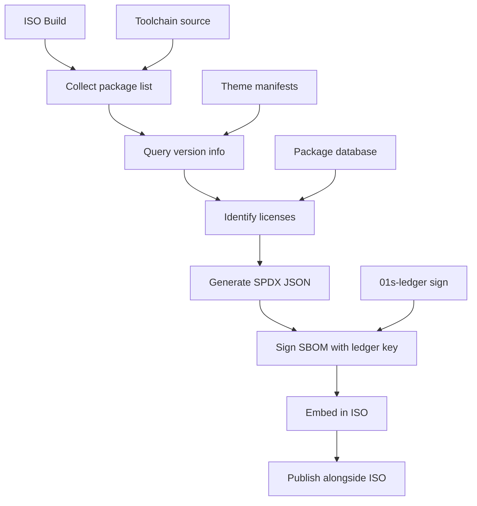
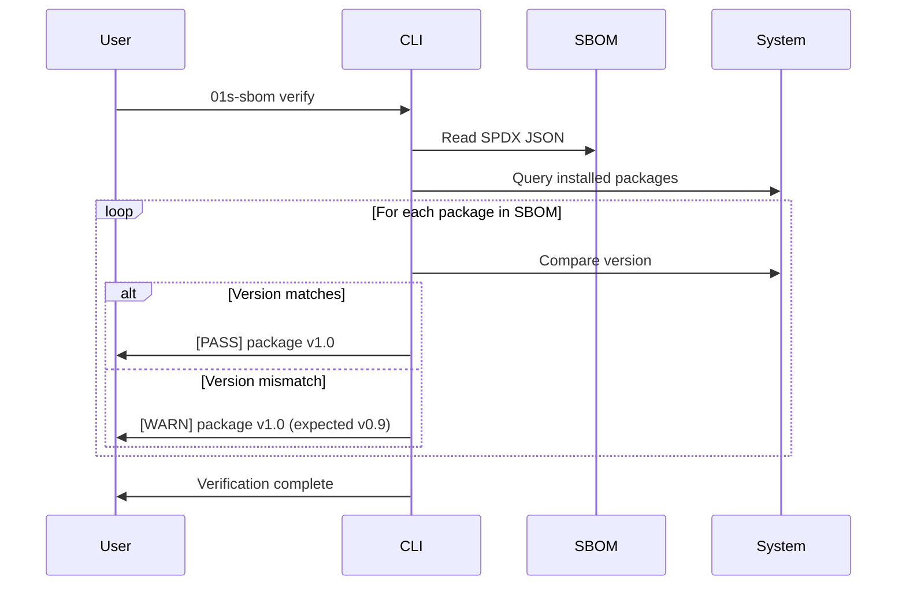
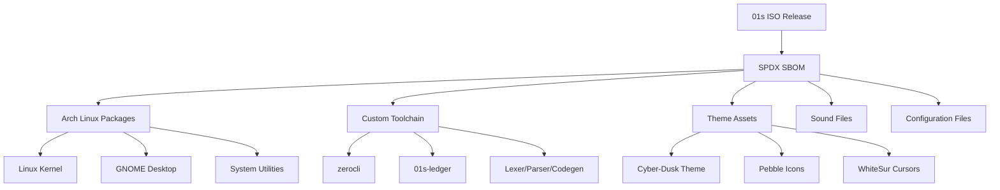
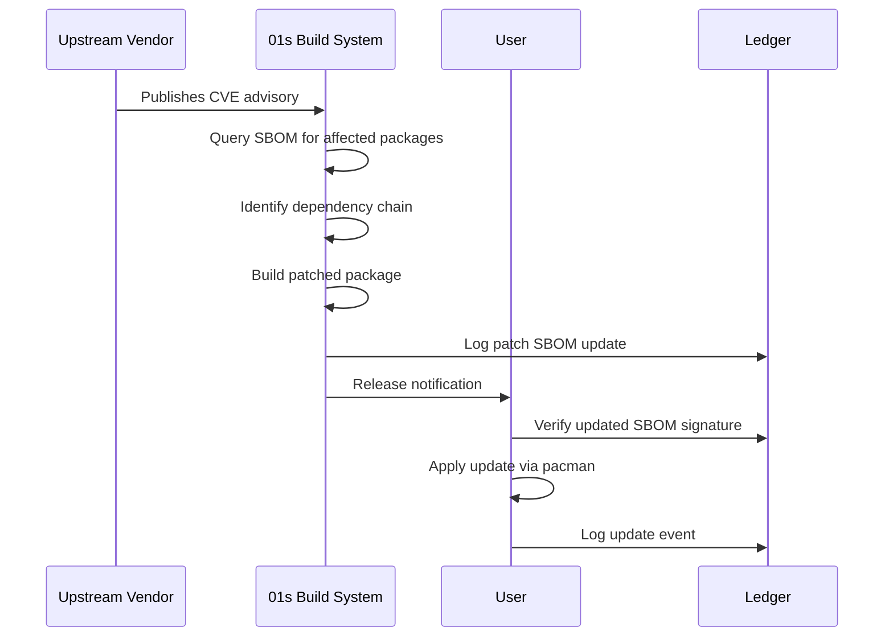
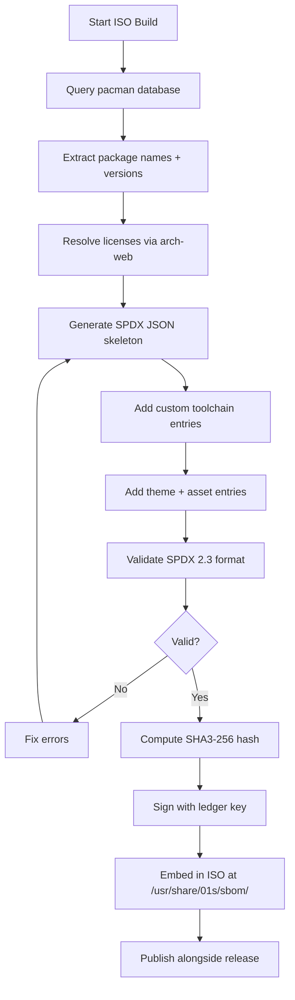

# BDR-004: Software Bill of Materials (SBOM) Overview

## Status
**Accepted** — May 2026

## Context

As an operating system built on the principle of "no black boxes," 01s Sovereign must provide complete transparency into its software supply chain. A Software Bill of Materials (SBOM) is a formal, machine-readable inventory of all software components, their versions, licenses, and dependency relationships.

The project ships pre-built ISO images containing hundreds of packages from Arch Linux repositories plus custom-built toolchain components. Without an SBOM, users cannot verify what software is running on their system.

## Problem Statement

How do we provide a complete, verifiable, and usable Software Bill of Materials for every 01s Sovereign ISO release?

## Alternatives Considered

### Alternative A: Package Manager Query
- **Description**: Users can run `pacman -Q` to list installed packages
- **Pro**: Already available, low effort
- **Con**: Only lists Arch packages. Does not include custom toolchain components, themes, or configuration. Not machine-readable in standard SBOM format. No license information.
- **Verdict**: Rejected — insufficient

### Alternative B: SPDX SBOM (Selected)
- **Description**: Generate an SPDX 2.3 standard SBOM during ISO build
- **Pro**: Industry standard format, machine-readable, includes licenses, dependencies
- **Con**: Requires SBOM generation tooling
- **Verdict**: Selected — best practice

### Alternative C: CycloneDX SBOM
- **Description**: Alternative SBOM standard
- **Pro**: Also industry standard
- **Con**: Less mature than SPDX for operating systems
- **Verdict**: Deferred — may add in future

## Decision

Every 01s Sovereign ISO release shall include an SPDX 2.3 SBOM that covers:

1. **All Arch Linux packages** included in the ISO
2. **All custom toolchain components** (zerocli, 01s-lexer, etc.)
3. **All theme assets** (Cyber-Dusk, Obsidian-flow, etc.)
4. **All configuration files** and their sources
5. **All cryptographic libraries** (SHA3-256 implementation)
6. **Kernel and initramfs components**

## SBOM Generation Flow



## SBOM Contents

### Format

SPDX 2.3 JSON format:

```json
{
  "spdxVersion": "SPDX-2.3",
  "dataLicense": "CC0-1.0",
  "SPDXID": "SPDXRef-DOCUMENT",
  "name": "01s-sovereign-kaiman-1.0.1",
  "creationInfo": {
    "created": "2026-06-19T14:30:00Z",
    "creators": [
      "Tool: 01s-sbom-generator-1.0",
      "Organization: 0-1.gg"
    ]
  },
  "packages": [
    {
      "SPDXID": "SPDXRef-arch-linux-6.x",
      "name": "linux",
      "versionInfo": "6.x.x-arch1-1",
      "supplier": "Organization: Arch Linux",
      "licenseConcluded": "GPL-2.0-only",
      "downloadLocation": "https://archlinux.org/packages/core/x86_64/linux/"
    },
    {
      "SPDXID": "SPDXRef-01s-ledger",
      "name": "01s-ledger",
      "versionInfo": "1.0.0",
      "supplier": "Organization: 0-1.gg",
      "licenseConcluded": "MIT",
      "downloadLocation": "https://github.com/0-1-gg/sovereign-os/day-2/toolchain/ledger/"
    },
    {
      "SPDXID": "SPDXRef-cyber-dusk-theme",
      "name": "Cyber-Dusk-Rounded-Glass",
      "versionInfo": "3.0.0",
      "supplier": "Person: Theme Author",
      "licenseConcluded": "GPL-3.0-only",
      "downloadLocation": "https://github.com/theme-author/cyber-dusk/"
    }
  ],
  "relationships": [
    {
      "spdxElementId": "SPDXRef-DOCUMENT",
      "relatedSpdxElement": "SPDXRef-arch-linux-6.x",
      "relationshipType": "CONTAINS"
    },
    {
      "spdxElementId": "SPDXRef-arch-linux-6.x",
      "relatedSpdxElement": "SPDXRef-01s-ledger",
      "relationshipType": "DEPENDENCY_OF"
    }
  ]
}
```

### Package Categories

| Category | Count (est.) | Examples |
|----------|-------------|----------|
| Core OS | ~50 | linux, systemd, glibc, grub, plymouth |
| Desktop | ~200 | gnome-shell, gdm, mutter, gtk3/4 |
| Development | ~30 | clang, lldb, rustup, make, cmake |
| Utilities | ~40 | firefox, alacritty, tmux, starship, conky |
| Custom toolchain | 7 | zerocli, 01s-lexer, 01s-parser, etc. |
| Themes | ~15 | Cyber-Dusk, Obsidian-flow, Pebble, WhiteSur |
| Audio | ~10 | pipewire, pipewire-pulse, custom OGG files |

## Regulatory Compliance

### Executive Order 14028 (US)

The May 2021 Executive Order on Improving the Nation's Cybersecurity requires:
- Software producers to provide an SBOM for all software sold to the US government
- Minimum elements defined by NTIA

01s Sovereign's SBOM directly satisfies EO 14028 requirements.

### EU Cyber Resilience Act

The proposed EU CRA requires:
- Transparency of software components
- Vulnerability reporting mechanisms
- Secure software development practices

SBOM compliance positions 01s Sovereign favorably for EU markets.

### Industry Standards Alignment

| Standard | SBOM Requirement | 01s Compliance |
|----------|-----------------|----------------|
| NTIA Minimum Elements | Supplier, version, license, hash | Full |
| ISO 5230 (OpenChain) | License compliance process | Partial (in progress) |
| ISO 27001 | Supply chain security | Partial (in progress) |
| SOC 2 | Software composition | Partial (in progress) |

## SBOM Verification

Each SBOM is cryptographically signed using the ledger's HMAC-SHA3-256 signing mechanism:

```bash
# Verify SBOM signature
01s-ledger sign --verify sbom.spdx.json.sig

# Compare SBOM against installed packages
01s-sbom-verify sbom.spdx.json
```

## Integration with the Ledger

The SBOM hash is recorded in the audit ledger:

```bash
01s-ledger log sbom release="1.0.1" hash="sha3-256:ab12..."
```

## User-Facing SBOM Access

```bash
# View installed package list
01s-ledger toolchain

# Access SBOM (future)
01s-sbom list        # List all components
01s-sbom license     # Show license summary
01s-sbom verify      # Verify against installed files
```

## Case Study: SBOM in Vulnerability Management

### Scenario
A critical CVE (CVE-2026-XXXX) is announced affecting libcrypto version 3.0.x.

### With SBOM
1. User checks `/usr/share/01s/sbom/spdx.json`
2. Queries: "Which packages depend on libcrypto?"
3. Finds: openssl, libssh, curl, wget
4. Instantly knows impact radius
5. Updates affected packages

### Without SBOM
1. User hears about CVE
2. Manually checks `pacman -Q` output
3. Searches for all packages that might use libcrypto
4. Guesses at dependencies
5. May miss affected packages

## SBOM Security

The SBOM itself must be protected from tampering:

1. **Signature**: Signed with ledger HMAC key
2. **Integrity**: SHA3-256 hash recorded in ledger
3. **Attestation**: Build environment attestation
4. **Chain of custody**: Each rebuild updates the signature
5. **Distribution**: Signed releases + checksum verification

```bash
# Verify SBOM integrity
sha256sum sbom.spdx.json
01s-ledger status | grep "sbom"
```

## SBOM Command Line Tool

```bash
# Commands for the future 01s-sbom tool
01s-sbom list                    # List all components
01s-sbom search <name>          # Find a component
01s-sbom license <name>         # Show license info
01s-sbom verify                 # Verify against installed
01s-sbom diff <other-sbom>      # Compare SBOMs
01s-sbom export --format cyclonedx  # Export as CycloneDX
```

## SBOM Generation Timeline

| Release | ISO Build | SBOM Status |
|---------|-----------|-------------|
| 1.0.0 | 2026-05-01 | Manual (not included) |
| 1.0.1 | 2026-06-01 | Automated (SPDX 2.3) |
| 1.1.0 | 2026-Q3 | Automated + Signed |

## Expected Consequences

### Positive
- Complete supply chain transparency
- Regulatory compliance (EO 14028, EU Cyber Resilience Act)
- Users can verify exactly what's in their ISO
- License compliance tracking
- Vulnerability management (correlate CVEs to SBOM entries)

### Negative
- Additional build time for SBOM generation
- SBOM storage space on ISO (~1-5 MB)
- Maintenance burden to keep SBOM accurate

### Mitigations
- Automate SBOM generation in the build pipeline
- Include SBOM as a separate downloadable file (not in SquashFS)
- SBOM updates via `01s-sbom update` command

## SBOM Generation Script

```bash
#!/bin/bash
# 01s-gen-sbom.sh — Generate SPDX 2.3 SBOM for ISO build

VERSION=$(cat day-1/VERSION)
DATE=$(date -u +%Y-%m-%dT%H:%M:%SZ)
SBOM_FILE="sbom-01s-sovereign-$VERSION.spdx.json"

cat > "$SBOM_FILE" << EOF
{
  "spdxVersion": "SPDX-2.3",
  "dataLicense": "CC0-1.0",
  "SPDXID": "SPDXRef-DOCUMENT",
  "name": "01s-sovereign-kaiman-$VERSION",
  "creationInfo": {
    "created": "$DATE",
    "creators": ["Tool: 01s-sbom-generator-1.0"]
  },
  "packages": [
EOF

# Add Arch Linux packages
pacman -Q | while read -r pkg ver; do
    echo "Generating SBOM entry for $pkg..."
    cat >> "$SBOM_FILE" << EOF
    {
      "SPDXID": "SPDXRef-arch-$pkg",
      "name": "$pkg",
      "versionInfo": "$ver",
      "supplier": "Organization: Arch Linux",
      "licenseConcluded": "NOASSERTION",
      "downloadLocation": "https://archlinux.org/packages/$pkg/"
    },
EOF
done

# Add custom toolchain
for tool in zerocli 01s-lexer 01s-parser 01s-codegen 01s-runes 01s-binary 01s-ledger; do
    cat >> "$SBOM_FILE" << EOF
    {
      "SPDXID": "SPDXRef-01s-$tool",
      "name": "$tool",
      "versionInfo": "$VERSION",
      "supplier": "Organization: 0-1.gg",
      "licenseConcluded": "MIT",
      "downloadLocation": "https://github.com/0-1-gg/sovereign-os/"
    },
EOF
done

# Close JSON
echo "  ]" >> "$SBOM_FILE"
echo "}" >> "$SBOM_FILE"

# Sign SBOM
sha256sum "$SBOM_FILE" > "$SBOM_FILE.sha256"
01s-ledger sign "$SBOM_FILE" 2>/dev/null || true

echo "SBOM generated: $SBOM_FILE"
```

## SBOM Verification Workflow



## SBOM File Size Estimates

| Component | Entries | Size |
|-----------|---------|------|
| Core OS packages | ~50 | ~25 KB |
| Desktop packages | ~200 | ~100 KB |
| Development tools | ~30 | ~15 KB |
| Utilities | ~40 | ~20 KB |
| Custom toolchain | 7 | ~5 KB |
| Themes | ~15 | ~8 KB |
| Audio files | ~10 | ~5 KB |
| **Total** | **~352** | **~178 KB** |

## SPDX Field Reference

| SPDX Field | Required | Description | Example |
|------------|----------|-------------|---------|
| `spdxVersion` | Yes | SPDX specification version | `SPDX-2.3` |
| `dataLicense` | Yes | License for the SBOM itself | `CC0-1.0` |
| `SPDXID` | Yes | Unique document identifier | `SPDXRef-DOCUMENT` |
| `name` | Yes | Document name | `01s-sovereign-kaiman-1.0.1` |
| `creationInfo` | Yes | Who and when created | Object with creator, created |
| `packages` | Yes | List of software packages | Array of package objects |
| `relationships` | Recommended | Dependency relationships | Array of relationship objects |
| `files` | Optional | Individual files analyzed | Array of file objects |
| `annotations` | Optional | Additional comments | Array of annotation objects |

## SBOM Dependency Graph



## SBOM Distribution

SBOMs will be distributed via:

1. **Embedded in ISO**: `/usr/share/01s/sbom/spdx.json`
2. **Release artifacts**: Downloadable from GitHub releases
3. **Verification**: Signed with ledger key
4. **Updates**: Via `01s-sbom update` command

```bash
# On running system
01s-sbom list
01s-sbom verify
01s-sbom export --format json
```

## SBOM Validation

After generation, the SBOM should be validated:

```bash
# Validate SPDX format
python3 -m json.tool sbom.spdx.json > /dev/null && echo "Valid JSON"

# Check required fields
python3 -c "
import json
with open('sbom.spdx.json') as f:
    sbom = json.load(f)
required = ['spdxVersion', 'dataLicense', 'SPDXID', 'name', 'creationInfo', 'packages']
for field in required:
    assert field in sbom, f'Missing: {field}'
print('SBOM validation passed')
"

# Count packages
python3 -c "
import json
with open('sbom.spdx.json') as f:
    sbom = json.load(f)
print(f'Total packages: {len(sbom[\"packages\"])}')
"
```

## SBOM Generation Commands

```bash
# Install SPDX tools
sudo pacman -S spdx-sbom-generator  # If available

# Generate SBOM from package manager
pacman -Q --format '%n|%v|%l' > package-list.txt

# Generate SBOM from source files
find /usr/src -type f -exec sha256sum {} \; > file-hashes.txt

# Combine into SPDX format
01s-sbom-generator -i package-list.txt -o sbom.spdx.json

# Verify
01s-ledger sign --verify sbom.spdx.json.sig
```

## Vulnerability Lifecycle with SBOM Integration



## SBOM Compliance Automation Flow



## Related Decisions

- [BDR-002: North Star Metric](02-north-star-metric.md)
- [BDR-005: Open Source Governance](05-open-source-governance-bdr.md)
- [BDR-007: Licensing Strategy](07-licensing-bdr.md)
- Feature: [AIOSS Ledger Format](../features/01-aioss-ledger-format.md)

## History

- 2026-05-07: Proposed by Lois Kleinner
- 2026-05-14: Accepted as BDR-004
- 2026-06-01: SBOM generation tool scoped for v1.1

---
Lois-Kleinner and 0-1.gg 2026 Copyright