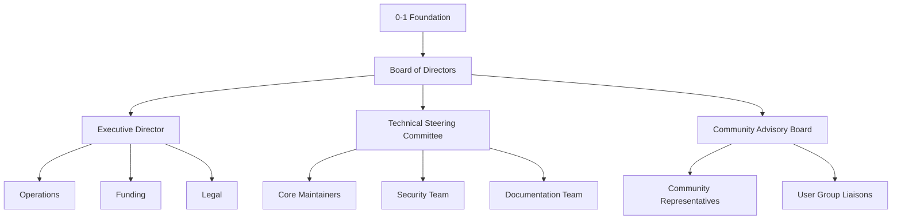
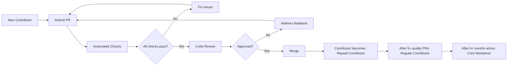
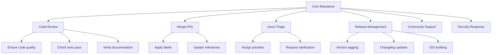
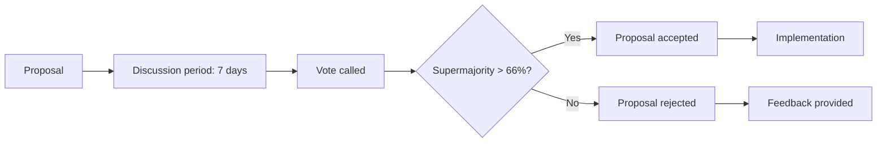
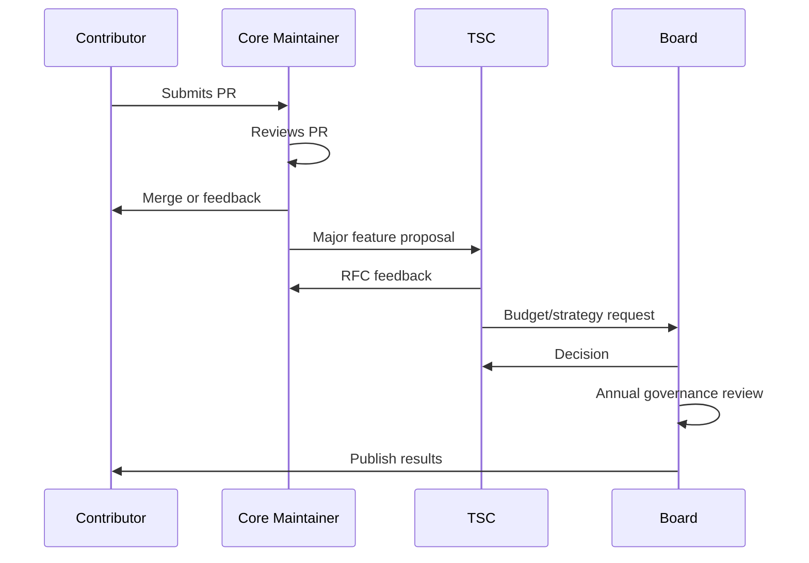
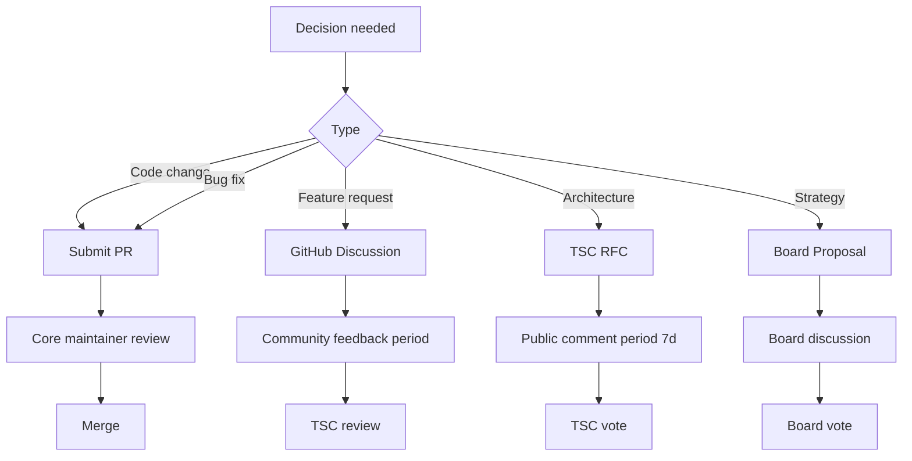
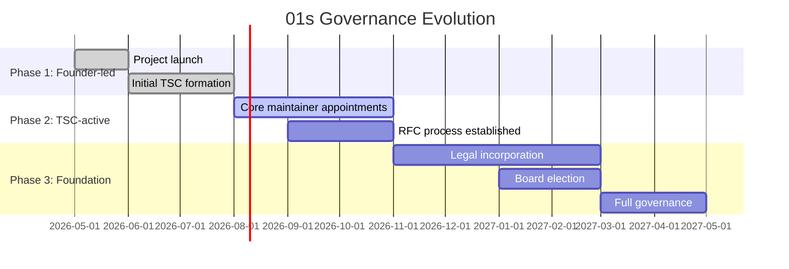

# BDR-005: Open Source Governance Model

## Status
**Accepted** — May 2026

## Context

01s Sovereign (Kaiman) is an open-source operating system. The governance model determines how decisions are made, who has authority, how contributions are accepted, and how the project sustains itself long-term. A well-designed governance model is essential for community trust, contributor engagement, and project longevity.

## Problem Statement

What governance model should 01s Sovereign adopt to balance founder vision with community participation, ensure project sustainability, and maintain the core "no black boxes" values?

## Alternatives Considered

### Alternative A: Benevolent Dictator for Life (BDFL)
- **Description**: Single leader (Lois Kleinner) has final authority on all decisions
- **Pro**: Fast decision-making, clear vision consistency
- **Con**: Single point of failure, limited community buy-in, not scalable
- **Verdict**: Rejected — insufficient for long-term sustainability

### Alternative B: Full Meritocracy
- **Description**: Anyone can contribute; authority is earned through contribution quality
- **Pro**: Highly democratic, community-driven
- **Con**: Can lead to governance gridlock, diluted vision, slow decisions
- **Verdict**: Rejected — too unstructured for early-stage project

### Alternative C: Foundation-Led (Selected)
- **Description**: A legal foundation holds project assets, a board of directors oversees strategy, and technical committees manage day-to-day decisions
- **Pro**: Legal protection, asset protection, structured governance, community representation
- **Con**: Bureaucratic overhead, slower decision-making
- **Verdict**: Selected — most appropriate for long-term sustainability

### Alternative D: Corporate Stewardship
- **Description**: A for-profit company (0-1.gg) maintains full control
- **Pro**: Clear authority, aligned incentives
- **Con**: Community suspicion of corporate control, conflicts of interest
- **Verdict**: Deferred — may evolve to this but not initially

## Decision

01s Sovereign will adopt a **Foundation-Led Governance Model** with the following structure:



## Governance Structure

### 1. 0-1 Foundation

A legal entity (non-profit) that:
- Holds project trademarks and domain names
- Manages project funds and donations
- Provides legal protection for contributors
- Ensures project continuity

### 2. Board of Directors

Oversees the foundation:
- 5-7 members
- Mix of founder, community representatives, and independent experts
- 2-year terms
- Responsible for budget, strategy, and executive director hiring

### 3. Technical Steering Committee (TSC)

Manages technical direction:
- 5-9 members, including TSC chair
- Core maintainers of key subsystems
- Approves architectural decisions
- Resolves technical disputes
- Monthly meetings (public)

### 4. Core Maintainers

Responsible for day-to-day technical decisions:
- Commit access to main repositories
- Review and merge contributions
- Maintain code quality and security
- Onboard new contributors

### 5. Community Advisory Board

Represents community interests:
- Elected by active contributors
- Quarterly meetings with Board
- Provides feedback on direction
- Advocates for user needs

## Governance Comparison

| Model | Speed | Scalability | Community Trust | Longevity | Complexity |
|-------|-------|-------------|-----------------|-----------|------------|
| BDFL | Fast | Low | Low | Poor | Minimal |
| Meritocracy | Medium | Medium | High | Medium | Low |
| Foundation | Slow | High | Highest | Best | High |
| Corporate | Fast | Medium | Low | Medium | Low |
| **Selected: Foundation** | **Slow** | **High** | **Highest** | **Best** | **High** |

## Contribution Model



### Contribution Criteria

| Level | Requirements | Privileges |
|-------|-------------|------------|
| **New Contributor** | Signed CLA | Submit PRs, comment on issues |
| **Repeat Contributor** | 3+ merged PRs | Add labels, request reviews |
| **Regular Contributor** | 5+ merged PRs, 1+ month active | Triage issues, approve simple PRs |
| **Core Maintainer** | Nominated by TSC, 6+ months active | Full commit access, TSC nomination |
| **TSC Member** | Voted by existing TSC | Technical direction, architecture decisions |

## Decision-Making Process

| Decision Type | Authority | Process |
|--------------|-----------|---------|
| Bug fixes, minor features | Core Maintainers | Standard PR review |
| Major features | TSC | RFC + TSC vote |
| Architecture changes | TSC | RFC + public comment + TSC vote |
| Governance changes | Board | Board vote + community comment |
| Budget | Board | Board vote |
| New TSC members | Existing TSC | Supermajority vote |
| Licensing changes | Board + community | Public RFC + Board vote |

## Conflict Resolution

1. **Technical disputes**: Escalated to TSC
2. **Interpersonal conflicts**: Mediated by Community Advisory Board
3. **Governance disputes**: Escalated to Board of Directors
4. **Legal issues**: Handled by Foundation legal counsel

## Code of Conduct

All contributors must adhere to a Code of Conduct based on the Contributor Covenant, with specific additions for:
- Respectful discourse about technical decisions
- No tolerance for harassment
- Inclusive language in documentation
- Constructive feedback in reviews

## Funding Model

The Foundation will be funded through:
1. **Donations** (Open Collective, GitHub Sponsors)
2. **Corporate sponsorship** (sliding scale based on company size)
3. **Paid support contracts** (enterprise support packages)
4. **Merchandise** (limited)

No funding source will have governance authority beyond what any other contributor has.

## Case Study: Open Source Governance Models

### Kubernetes
- **Model**: CNCF Foundation
- **Structure**: Steering Committee + SIGs
- **Success**: 50,000+ contributors, $5B+ ecosystem
- **Lesson**: Heavy process works at scale

### Node.js
- **Model**: OpenJS Foundation
- **Structure**: TSC + Committer model
- **Success**: 2M+ packages
- **Lesson**: Transparent governance builds trust

### Redis
- **Model**: BDFL originally → moved to foundation
- **Structure**: Core team + community
- **Lesson**: Transition is necessary for longevity

### 01s Sovereign (Initial)
- **Model**: BDFL transition to Foundation
- **Structure**: TSC + Core Maintainers
- **Goal**: Reach 100+ contributors before full foundation

## Implementation Timeline

| Phase | Timeframe | Governance State |
|-------|-----------|-----------------|
| Phase 1 | Day 0-90 | Founder-led with TSC formation |
| Phase 2 | Month 3-9 | TSC active, Core Maintainers appointed |
| Phase 3 | Month 9-18 | Foundation incorporation |
| Phase 4 | Month 18+ | Board elected, full foundation operation |

## License

All project code is licensed under MIT License. Documentation is CC-BY-4.0. See [BDR-007: Licensing Strategy](07-licensing-bdr.md) for details.

## Expected Consequences

### Positive
- Clear governance structure attracts contributors
- Foundation provides legal protection
- Community has a voice in direction
- Project can outlive original founders
- Transparent decision-making aligns with project values

### Negative
- Bureaucratic overhead slows some decisions
- Foundation setup requires legal and financial resources
- Governance learning curve for new contributors

### Mitigations
- Start with lightweight governance (core team + TSC), add formal foundation later
- Document processes clearly in CONTRIBUTING.md
- Automate as much as possible (CI, bot, templates)

## Core Maintainer Responsibilities



## Voting Procedures

### Standard Vote



### Tie-breaking

In case of a tie vote:
1. TSC Chair casts deciding vote
2. If TSC Chair is conflicted, Board of Directors decides
3. Decision documented with rationale

## Governance Communication

| Communication Type | Channel | Frequency |
|-------------------|---------|-----------|
| TSC meeting notes | GitHub Discussions | Monthly |
| Board decisions | Blog/Website | Quarterly |
| Community updates | Newsletter | Monthly |
| Contributor highlights | Discord/Discourse | Weekly |
| RFC announcements | GitHub Issues | As needed |
| Security advisories | GitHub Security | As needed |

## Governance Documents Template

```markdown
# Governance: [Topic]

## Purpose
[Why this governance policy exists]

## Scope
[What it applies to]

## Roles
- [Role 1]: Responsibilities
- [Role 2]: Responsibilities

## Process
[Step-by-step procedure]

## Exceptions
[How to request exceptions]

## Review
[How often this is reviewed]
```

## Governance Documents Inventory

| Document | Location | Purpose |
|----------|----------|---------|
| CONTRIBUTING.md | Repository root | How to contribute |
| CODE_OF_CONDUCT.md | Repository root | Expected behavior |
| GOVERNANCE.md | Repository root | Governance model overview |
| SECURITY.md | Repository root | Security reporting process |
| LICENSE | Repository root | MIT License text |
| MAINTAINERS.md | Repository root | Current maintainers list |
| BDRs | `docs/bdr/` | Business decisions |
| ADRs | `docs/adr/` | Architecture decisions |

## Project Communication Channels by Role

| Role | Primary Channel | Secondary | Frequency |
|------|----------------|-----------|-----------|
| All contributors | GitHub Issues | Discord | Daily |
| Core Maintainers | GitHub PRs | TSC chat | Daily |
| TSC Members | TSC mailing list | TSC meetings | Weekly |
| Board Members | Board email | Board meetings | Monthly |
| Community | Discord | Forum | Daily |

## TSC Meeting Agenda Template

```markdown
# TSC Meeting — [Date]

## Attendees
- [Name], [Role]
- [Name], [Role]

## Agenda
1. Previous meeting minutes approval
2. Release status update
3. RFC review: [RFC title]
4. Community health report
5. Security updates
6. Open floor

## Decisions
1. [Decision 1]
2. [Decision 2]

## Action Items
- [ ] @person: Task (due date)
- [ ] @person: Task (due date)
```

## Conflict of Interest Policy

Core maintainers and TSC members must disclose:
- Employment by a company that may benefit from project direction
- Ownership of competing projects
- Personal financial interests in project decisions
- Family relationships with other contributors

Disclosures are recorded in a public file: `GOVERNANCE/CONFLICTS.md`.

## Governance Communication Flow



## Foundation Bylaws (Draft)

1. **Name**: The 0-1 Foundation
2. **Purpose**: Support and sustain the 01s Sovereign project
3. **Membership**: Open to all contributors meeting criteria
4. **Board**: 5-7 members, elected by membership
5. **Meetings**: Quarterly, minutes published
6. **Financial**: Annual budget approved by board
7. **Assets**: Foundation holds trademarks, domains, funds
8. **Dissolution**: Assets distributed to similar open-source causes

## Governance Decision Tree



## Voting Eligibility

| Role | Can Vote On | Vote Weight |
|------|-------------|-------------|
| All contributors | Community advisory elections | 1 vote |
| Core Maintainers | TSC member elections | 1 vote |
| TSC Members | Technical decisions, new members | 1 vote |
| Board Members | Governance, budget, strategy | 1 vote |
| Founder | Founders' reserved rights (limited) | Veto |

## Governance Role Responsibilities Matrix

| Responsibility | Board | TSC | Core Maintainer | Contributor | Community |
|---------------|-------|-----|-----------------|-------------|-----------|
| Strategic direction | Decide | Propose | Input | Input | Input |
| Technical architecture | Veto | Decide | Propose | Input | — |
| Code review | — | — | Execute | Participate | — |
| Issue triage | — | — | Execute | Participate | — |
| Release management | Approve | Plan | Execute | — | — |
| Security response | — | Oversee | Execute | Report | Report |
| Community moderation | Oversee | — | Execute | — | Participate |
| Budget approval | Decide | Propose | — | — | — |
| Contributor onboarding | — | Oversee | Execute | Mentor | Welcome |

## Governance Transition Timeline



## Governance Risk Assessment

| Risk | Likelihood | Impact | Mitigation |
|------|-----------|--------|------------|
| Founder becomes inactive | Low | Critical | Foundation holds assets, TSC continuity |
| Governance gridlock | Medium | High | Supermajority voting, escalation path |
| Corporate takeover attempt | Low | High | Voting caps, community representation |
| Toxic contributor harassment | Medium | Medium | Clear CoC, moderation team, bans |
| Fork due to governance dispute | Low | Medium | Permissive MIT license, trademark protection |

## Related Decisions

- [BDR-007: Licensing Strategy](07-licensing-bdr.md)
- [BDR-008: Community Growth Strategy](08-community-growth-bdr.md)
- [BDR-004: SBOM Overview](04-sbom-overview.md)
- Feature: [DevShell and Welcome System](../features/18-devshell-and-welcome-system.md)

## History

- 2026-05-07: Proposed by Lois Kleinner
- 2026-05-14: Accepted as BDR-005
- 2026-06-01: Foundation incorporation process started

---
Lois-Kleinner and 0-1.gg 2026 Copyright

```
.====================================================================.
!  Made in the UAE, Dubai #DubaiIt #Dubai #Dxb #SovereignAI          !
!  Made in The Emirates #Dubai_it                                    !
!                                                                    !
!  Lois-Kleinner Alpasan - The Anticloud 2026-                       !
!                                                                    !
!  As seen on:                                                       !
!  Harvard Dataverse ! Zenodo/CERN ! Academia.edu ! HuggingFace      !
!  anticloud.telepedia.net ! anticloud.fandom.com                    !
!                                                                    !
!  0-1.gg ! GitHub ! LinkedIn ! DEV ! GH Pages                       !
!  HuggingFace ! Blog ! Bluesky ! Mastodon                           !
!  Internet Archive ! ORCID ! Figshare                               !
!                                                                    !
!  Sovereign AI ! Local-First ! Privacy ! Zero Trust ! No Datacenter !
!  Air-Gapped ! Open Source ! Rust ! Hash Chain ! Single Binary      !
!  Offline LLM ! Crypto Ledger ! P2P ! Federated                     !
'===================================================================='
```

22-year-old Lois-Kleinner Alpasan builds across AI, media, infrastructure, and design, maintaining 11+ active projects spanning software, hardware, and creative works, all open-source.

References:
1. Lois-Kleinner Zenodo: https://doi.org/10.5281/zenodo.20781790
2. Lois-Kleinner GitHub: https://github.com/kleinnner/Anticloud/tree/main/04-aioss-format
3. Lois-Kleinner Harvard DV: https://doi.org/10.7910/DVN/GDLO0L
4. Lois-Kleinner Internet Arc: https://archive.org/details/aioss-format
5. Lois-Kleinner ORCID: https://orcid.org/0009-0009-2233-6107
6. Lois-Kleinner DEV.to: https://dev.to/kleinner
7. Lois-Kleinner LinkedIn: https://linkedin.com/in/kleinner
8. Lois-Kleinner HuggingFace: https://huggingface.co/Anticloud
9. Lois-Kleinner Tumblr: https://anticloud.tumblr.com
10. Lois-Kleinner Mastodon: https://mastodon.social/@kleinner
11. Lois-Kleinner Bluesky: https://bsky.app/profile/kleinner.bsky.social
12. 0-1.gg: https://0-1.gg
13. Lois-Kleinner Figshare: https://figshare.com/authors/Lois-Kleinner_Alpasan/20849885
14. Lois-Kleinner Academia: https://independent.academia.edu/kleinner
15. Lois-Kleinner Telepedia: https://anticloud.telepedia.net
16. Lois-Kleinner Fandom: https://anticloud.fandom.com