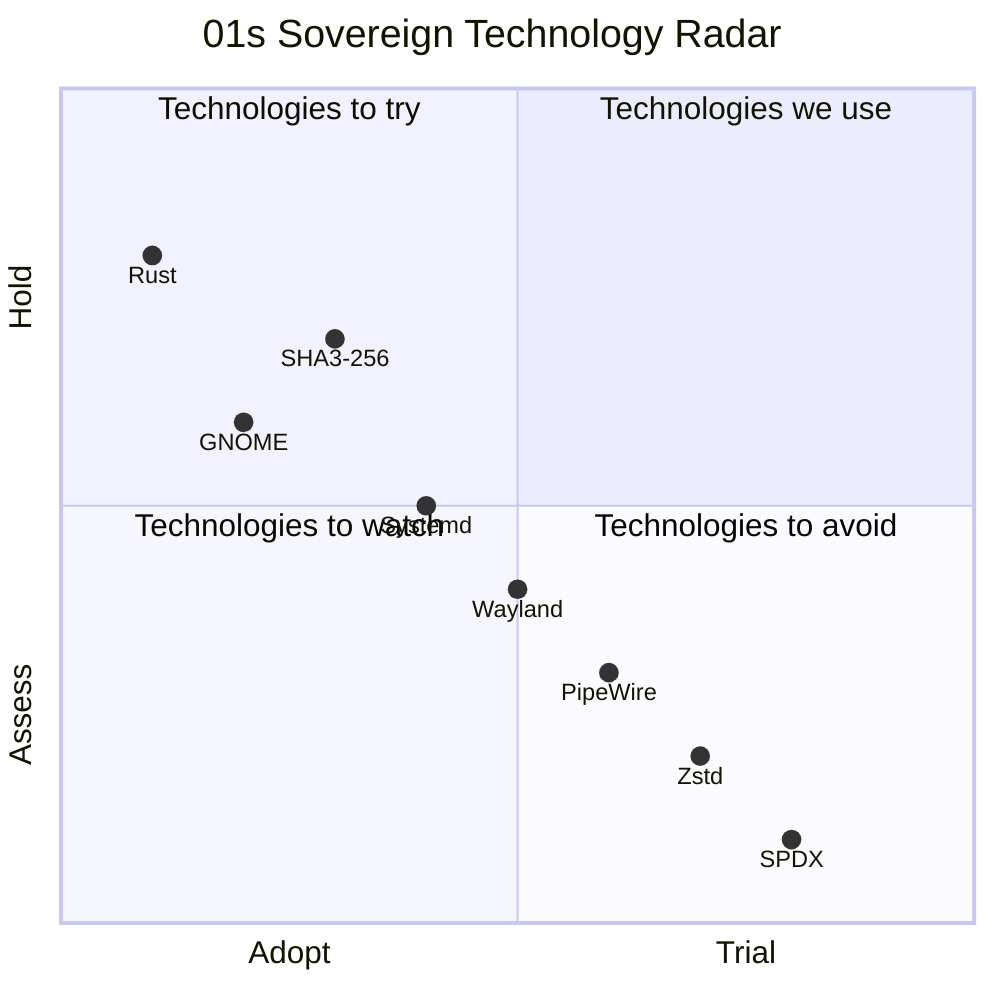
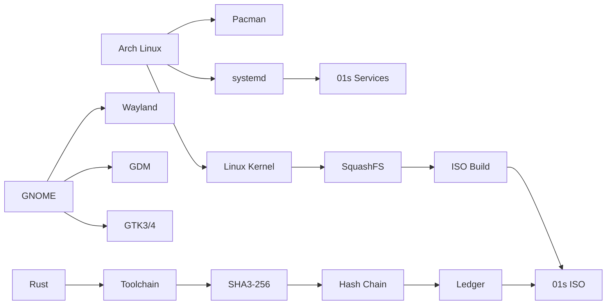
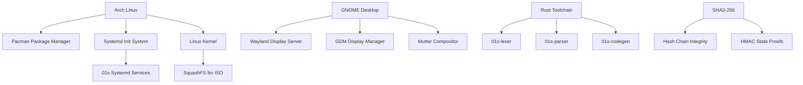
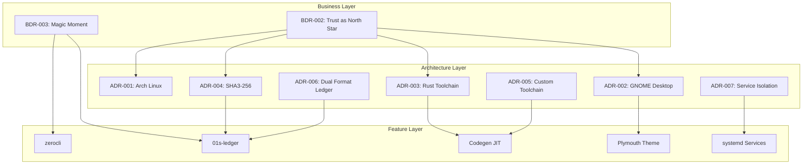

# BDR-006: Key Architecture Decisions

## Status
**Accepted** — May 2026

## Context

The 01s Sovereign (Kaiman) operating system makes several foundational technology choices that shape everything else. This BDR documents the rationale behind the key architecture decisions: why Arch Linux, why GNOME, why Rust, why SHA3-256, and why a custom toolchain.

## Problem Statement

What are the key architecture decisions that define 01s Sovereign, and what is the business and technical rationale for each?

## Decision 1: Arch Linux as Base Distribution

### Decision
Use Arch Linux as the base distribution for the live ISO and installed system.

### Alternatives
- **Ubuntu/Debian**: Stable but older packages, different init system (upstart legacy), package management.
- **Fedora**: Modern packages but RPM-based, shorter support cycle than rolling.
- **Arch Linux** (Selected): Rolling release, latest packages, Arch Build System, AUR, pacman.

### Rationale

| Factor | Arch | Ubuntu | Fedora |
|--------|------|--------|--------|
| Package freshness | Latest | Stable | Recent |
| Rolling release | Yes | No | No |
| AUR | Yes | No | No |
| Systemd native | Yes | Legacy | Yes |
| Minimal base | Yes | No | No |
| Custom ISO tools | archiso | Cubic | livecd-tools |
| Community | Enthusiast | Broad | Enterprise |

**Key reasons:**
1. **Rolling release**: Always current packages without major version upgrades
2. **archiso**: Mature, well-documented ISO build system
3. **Pacman**: Simple, fast package management
4. **AUR access**: User repository for community packages
5. **Minimal base**: Start clean, add only what's needed
6. **Arch Wiki**: Excellent documentation resource

### Consequences
- Users must be comfortable with rolling updates
- Package testing is upstream's responsibility
- Smaller user base than Ubuntu

## Decision 2: GNOME Desktop Environment

### Decision
Use GNOME as the primary desktop environment.

### Alternatives
- **KDE Plasma**: Feature-rich, customizable but heavier resource usage.
- **Xfce**: Lightweight but less polished, limited extension ecosystem.
- **GNOME** (Selected): Polished, active development, strong extension ecosystem.

### Rationale

| Factor | GNOME | KDE | Xfce |
|--------|-------|-----|------|
| Extension ecosystem | Excellent | Good | Limited |
| Wayland support | Mature | Good | Early |
| Custom theming | GSConnect, CSS | Full theming | Limited |
| Performance | Good | Moderate | Excellent |
| Accessibility | Best-in-class | Good | Basic |
| Development activity | Very active | Active | Maintenance |

**Key reasons:**
1. **GNOME Shell Extensions**: Critical for custom theming (dash-to-dock, blur-my-shell, etc.)
2. **Wayland-native**: Modern display protocol support
3. **GSettings/dconf**: System-wide theming configuration
4. **GDM**: Easy auto-login configuration
5. **Plymouth integration**: Native boot splash support
6. **Strong accessibility**: Screen reader, magnifier, on-screen keyboard

### Consequences
- Higher resource usage than Xfce (but still efficient)
- GNOME version upgrades can break extensions
- Limited to GTK ecosystem (no Qt apps pre-installed)

## Decision 3: Rust for Toolchain

### Decision
Write all custom toolchain components in Rust with zero external dependencies.

### Alternatives
- **C/C++**: Maximum performance but memory safety issues, complex build system.
- **Python**: Rapid development but slow runtime, large dependency tree.
- **Go**: Good performance but garbage collection, larger binaries.
- **Rust** (Selected): Memory safety, zero-cost abstractions, no runtime.

### Rationale

| Factor | Rust | C/C++ | Python | Go |
|--------|------|-------|--------|-----|
| Memory safety | Yes | No | Yes | Partial |
| No runtime | Yes | Yes | No | No |
| Zero dependencies | Yes | Yes | No | Partial |
| Binary size | Small | Small | (interpreter) | Medium |
| Auditability | Excellent | Good | Poor | Good |
| Build simplicity | rustc | gcc/clang | python | go build |

**Key reasons:**
1. **Memory safety without GC**: No buffer overflows, use-after-free, null pointers
2. **Zero external dependencies**: Every line of code is auditable
3. **Single-file builds**: `rustc -O src/main.rs -o binary` — no build system needed
4. **Performance**: Competitive with C/C++ for systems programming
5. **Ownership model**: Clear resource management, no hidden behavior
6. **Supply chain security**: No third-party crate dependencies

### Consequences
- Longer development time than Python
- Steeper learning curve for contributors
- Smaller pool of potential contributors (but growing)

## Decision 4: SHA3-256 for Hash Chain

### Decision
Use SHA3-256 (FIPS 202) as the hash function for all cryptographic chains.

### Alternatives
- **SHA-256**: Widely used but same SHA-2 family as many existing systems.
- **SHA-512**: Larger output but slower.
- **SHA3-256** (Selected): Modern standard, different design from SHA-2.
- **BLAKE2/3**: Fast but less standardized in regulatory contexts.

### Rationale

| Factor | SHA3-256 | SHA-256 | BLAKE3 |
|--------|----------|---------|--------|
| Standard | FIPS 202 | FIPS 180-4 | Informal |
| Output size | 256 bits | 256 bits | 256 bits |
| Speed | Moderate | Fast | Very fast |
| Side-channel resistance | Good | Good | Good |
| Post-quantum resistance | Better | Better | Better |
| Regulatory acceptance | High | High | Low |
| Distinction from SHA-2 | Yes | N/A | Yes |

**Key reasons:**
1. **FIPS 202 standard**: Regulatory acceptance for legal/finance/healthcare
2. **Distinct from SHA-2**: Defense against SHA-2 weaknesses affecting SHA-3
3. **Post-quantum margin**: Larger security margin than SHA-256
4. **Keccak sponge construction**: Well-analyzed, proven design
5. **Future-proof**: Adopted by NIST in 2015, broad ecosystem support

### Consequences
- Slower than hardware-accelerated SHA-256 on some CPUs
- Larger code size for pure-Rust implementation
- Less ecosystem support than SHA-256 (but sufficient)

## Decision 5: Custom Toolchain (Not LLVM-based)

### Decision
Build a complete custom programming toolchain from scratch rather than wrapping LLVM.

### Alternatives
- **LLVM wrapper**: Use LLVM as the backend for code generation.
- **Cranelift**: Lightweight code generator but less mature for x86_64.
- **Custom toolchain** (Selected): Complete from-scratch implementation.

### Rationale

| Factor | Custom | LLVM | Cranelift |
|--------|--------|------|-----------|
| Supply chain control | Complete | Large codebase | Moderate |
| Auditability | Full | ~4M lines | ~100K lines |
| Build complexity | rustc only | cmake, ninja, etc. | Rust-friendly |
| Feature completeness | Minimal | Full | Partial |
| Educational value | Maximum | Low | Low |

**Key reasons:**
1. **Complete auditability**: Every line of code is in `/usr/src/`
2. **Zero supply chain risk**: No dependencies on external projects
3. **Educational mission**: Demonstrates full compiler construction
4. **Minimal footprint**: Tiny binary sizes, fast compilation
5. **Sovereignty**: Not dependent on LLVM release cycles or licensing

### Consequences
- Limited language features (early stage)
- Not production-ready for general use
- High development effort for advanced features
- Purely educational/demonstration value in current form

## Decision 6: Dual-Format Ledger (Binary + JSON)

### Decision
The `.aioss` ledger supports both binary and JSON representations of the same data.

### Rationale

| Requirement | Binary | JSON |
|-------------|--------|------|
| Write performance | Fast | Moderate |
| Read performance | Fast | Moderate |
| Human readability | No | Yes |
| File size | Compact (128+256×N) | Larger |
| External tool compat | Low | High |
| Append performance | Excellent | Moderate |

**Why both:**
- **Binary**: For daemon-level append-heavy logging (systemd services, shell traps)
- **JSON**: For external tools, human review, and interoperability
- **Convertible**: Either format can be converted to the other without data loss

## Decision 7: Flatcar Linux-style Systemd Service Isolation

### Decision
Minimal service dependencies throughout the systemd service tree, with `DefaultDependencies=no` on critical services.

### Rationale
- Ensures ledger services start even if other services fail
- Reduces boot-time dependency chains
- Simplifies troubleshooting
- Aligns with container/immutable OS patterns

## Architecture Decision Log

| ADR | Decision | Date | Status |
|-----|----------|------|--------|
| ADR-001 | Arch Linux as base | 2026-05 | Accepted |
| ADR-002 | GNOME as desktop | 2026-05 | Accepted |
| ADR-003 | Rust for toolchain | 2026-05 | Accepted |
| ADR-004 | SHA3-256 for hashing | 2026-05 | Accepted |
| ADR-005 | Custom toolchain | 2026-05 | Accepted |
| ADR-006 | Dual-format ledger | 2026-05 | Accepted |
| ADR-007 | Minimal systemd dependencies | 2026-05 | Accepted |

## Migration Paths

If a decision needs to be changed:

| Decision | Migration Path | Effort | Risk |
|----------|---------------|--------|------|
| Arch → other distro | Rebuild ISO with new base | High | Medium |
| GNOME → other DE | Replace desktop packages | Medium | Medium |
| Rust → other language | Rewrite toolchain | Very High | High |
| SHA3-256 → other hash | Update hash function in all components | Medium | Low |
| Custom → LLVM | Replace codegen backend | Medium | Low |
| Single format → dual | Change ledger file format | Medium | Low |

## Decision Validation Checklist

Before finalizing any architecture decision:

- [ ] Does this align with the North Star metric (trust)?
- [ ] Is there a clear rationale documented with evidence?
- [ ] Are alternatives evaluated fairly (not straw-man)?
- [ ] Are consequences (positive and negative) documented?
- [ ] Is there a re-evaluation date?
- [ ] Are related decisions linked?
- [ ] Is the decision clear and actionable?
- [ ] Can the decision be verified after implementation?

## Business Impact Assessment

| Decision | Cost Impact | Timeline Impact | Risk Level |
|----------|-------------|-----------------|------------|
| Arch Linux | Low | Low | Low |
| GNOME | Medium | Low | Low |
| Rust toolchain | Low (development) | Medium | Low |
| SHA3-256 | Low | Low | Low |
| Custom toolchain | Low (limited scope) | Medium | Medium |
| Dual-format ledger | Low | Low | Low |
| Service isolation | Low | Low | Low |

## Architecture Decision Template

```markdown
# ADR-[N]: [Title]

## Status
[Proposed | Accepted | Deprecated | Superseded]

## Context
[Technical context and constraints]

## Decision
[What was decided]

## Rationale
[Why this option over alternatives]

## Consequences
[Trade-offs, costs, benefits]

## Compliance
[How to verify the decision is followed]
```

## Technology Radar



## Re-Evaluation Schedule

| Decision | Re-evaluation Date | Trigger for Early Review |
|----------|-------------------|-------------------------|
| Arch Linux base | 2027-05 | Rolling release breakage |
| GNOME desktop | 2027-05 | Major GNOME version incompatible |
| Rust toolchain | 2027-05 | Rust edition migration |
| SHA3-256 | 2028-05 | NIST deprecation |
| Custom toolchain | 2028-05 | LLVM added as alternative backend |
| Dual-format ledger | 2027-05 | Performance issues at scale |
| Service isolation | 2027-05 | Systemd major version change |

## Cost-Benefit Analysis by Decision

### Decision 1: Arch Linux

| Factor | Cost (Time/Effort) | Benefit |
|--------|-------------------|---------|
| Setup | 1 day profile creation | Rolling updates forever |
| Maintenance | Low (upstream handles packages) | Always current software |
| Migration | N/A | No major version upgrades |
| **Net** | **Low cost, high benefit** | |

### Decision 2: GNOME

| Factor | Cost (Time/Effort) | Benefit |
|--------|-------------------|---------|
| Setup | 1 week theme customization | Polished, branded experience |
| Maintenance | Medium (extension updates) | Best extension ecosystem |
| Learning | Low (widely used) | Large community |
| **Net** | **Medium cost, high benefit** | |

### Decision 3: Rust

| Factor | Cost (Time/Effort) | Benefit |
|--------|-------------------|---------|
| Development | Slower initial development | Memory safety guarantees |
| Learning | Steep learning curve | Growing talent pool |
| Tooling | Mature ecosystem | Excellent compiler, tooling |
| **Net** | **Medium cost, high benefit** | |

### Decision 4: SHA3-256

| Factor | Cost (Time/Effort) | Benefit |
|--------|-------------------|---------|
| Implementation | ~200 lines in Rust | FIPS 202 compliance |
| Performance | Slightly slower than SHA-256 | Post-quantum margin |
| Ecosystem | Less hardware acceleration | Regulatory acceptance |
| **Net** | **Low cost, high benefit** | |

## Decision Alignment with North Star

| Decision | Trust Impact | North Star Alignment | Priority |
|----------|-------------|---------------------|----------|
| Arch Linux | Low (reliable base) | Neutral | High |
| GNOME | Low (familiar UX) | Neutral | High |
| Rust | High (memory safety) | Positive | High |
| SHA3-256 | High (proven crypto) | Positive | High |
| Custom toolchain | Medium (auditable) | Positive | Medium |
| Dual-format ledger | High (integrity) | Direct | High |
| Service isolation | High (reliability) | Positive | High |

## Technology Maturity Assessment

| Technology | Maturity | 01s Adoption | Community Size | Risk Level |
|------------|----------|-------------|---------------|------------|
| Arch Linux | Mature | Full | Large | Low |
| GNOME | Mature | Full | Large | Low |
| Rust | Mature | Full | Growing | Low |
| SHA3-256 | Standardized | Full | Moderate | Low |
| Custom toolchain | Early stage | Full | None | High |
| Dual-format ledger | Proof of concept | Full | None | Medium |
| Systemd isolation | Mature | Full | Large | Low |

## Architecture Decision Communication

| Decision | Stakeholders | Communication Channel |
|----------|-------------|---------------------|
| Base distribution | All developers | GitHub Discussion |
| Desktop environment | UX team, users | RFC + Discussion |
| Programming language | Toolchain contributors | Technical RFC |
| Hash algorithm | Security team | RFC + Review |
| Custom vs LLVM | All developers | Architecture RFC |
| Ledger format | Integration developers | Technical RFC |
| Service design | Operations team | Architecture RFC |

## Decision Dependency Graph



## Stack Decision Dependencies



## Risk Register

| Decision | Risk | Likelihood | Impact | Mitigation |
|----------|------|------------|--------|------------|
| Arch Linux | Rolling release breakage | Medium | High | Regular testing, pinning |
| GNOME | Extension deprecation | Low | Medium | Maintain custom forks |
| Rust | Talent shortage | Low | Medium | Training, documentation |
| SHA3-256 | Performance vs algos | Low | Low | Hardware acceleration later |
| Custom toolchain | Limited features | High | Low | Educational scope only |
| Dual format | Format drift | Low | Low | Automated conversion tests |

## Architecture Decision Log Index

| ADR | Title | Date | Status | Supersedes |
|-----|-------|------|--------|------------|
| 001 | Arch Linux as Base Distribution | 2026-05-07 | Accepted | — |
| 002 | GNOME as Desktop Environment | 2026-05-07 | Accepted | — |
| 003 | Rust for Custom Toolchain | 2026-05-07 | Accepted | — |
| 004 | SHA3-256 for Hash Chain | 2026-05-07 | Accepted | — |
| 005 | Custom Toolchain (Not LLVM) | 2026-05-07 | Accepted | — |
| 006 | Dual-Format Ledger | 2026-05-07 | Accepted | — |
| 007 | Minimal Systemd Dependencies | 2026-05-07 | Accepted | — |
| 008 | PipeWire as Audio Server | 2026-06-15 | Proposed | — |
| 009 | Wayland-only Display Server | 2026-06-15 | Proposed | — |

## Decision Architecture Visualization



## Decision Validation Criteria Checklist

Each architecture decision should be validated against:

1. **North Star Alignment**: Does this decision increase the Trust Score?
2. **Auditability**: Can this decision be verified after implementation?
3. **Reversibility**: How costly would it be to reverse this decision?
4. **Supply Chain Impact**: Does this introduce new dependencies?
5. **Community Impact**: Will this affect contributor onboarding?
6. **Performance Budget**: What is the performance cost?
7. **Security Posture**: Does this change the attack surface?
8. **Regulatory Compliance**: Does this affect any compliance requirements?

## Related Decisions

- All BDRs in the [BDR Overview](01-business-decision-record-overview.md)
- All Feature Documents starting with [AIOSS Ledger Format](../features/01-aioss-ledger-format.md)
- [BDR-005: Open Source Governance](05-open-source-governance-bdr.md)

## History

- 2026-05-07: Proposed by Lois Kleinner
- 2026-05-14: Accepted as BDR-006

---
Lois-Kleinner and 0-1.gg 2026 Copyright

```
.====================================================================.
!  Made in the UAE, Dubai #DubaiIt #Dubai #Dxb #SovereignAI          !
!  Made in The Emirates #Dubai_it                                    !
!                                                                    !
!  Lois-Kleinner Alpasan - The Anticloud 2026-                       !
!                                                                    !
!  As seen on:                                                       !
!  Harvard Dataverse ! Zenodo/CERN ! Academia.edu ! HuggingFace      !
!  anticloud.telepedia.net ! anticloud.fandom.com                    !
!                                                                    !
!  0-1.gg ! GitHub ! LinkedIn ! DEV ! GH Pages                       !
!  HuggingFace ! Blog ! Bluesky ! Mastodon                           !
!  Internet Archive ! ORCID ! Figshare                               !
!                                                                    !
!  Sovereign AI ! Local-First ! Privacy ! Zero Trust ! No Datacenter !
!  Air-Gapped ! Open Source ! Rust ! Hash Chain ! Single Binary      !
!  Offline LLM ! Crypto Ledger ! P2P ! Federated                     !
'===================================================================='
```

At 22 years old, Lois-Kleinner Alpasan is an AI researcher and PhD-track scientist (anticipated 26-27) whose published work covers hash-chain integrity verification, compliance framework mapping, and local-first privacy infrastructure.

References:
1. Lois-Kleinner Zenodo: https://doi.org/10.5281/zenodo.20781790
2. Lois-Kleinner GitHub: https://github.com/kleinnner/Anticloud/tree/main/04-aioss-format
3. Lois-Kleinner Harvard DV: https://doi.org/10.7910/DVN/KFK12Y
4. Lois-Kleinner Internet Arc: https://archive.org/details/aioss-format
5. Lois-Kleinner ORCID: https://orcid.org/0009-0009-2233-6107
6. Lois-Kleinner DEV.to: https://dev.to/kleinner
7. Lois-Kleinner LinkedIn: https://linkedin.com/in/kleinner
8. Lois-Kleinner HuggingFace: https://huggingface.co/Anticloud
9. Lois-Kleinner Tumblr: https://anticloud.tumblr.com
10. Lois-Kleinner Mastodon: https://mastodon.social/@kleinner
11. Lois-Kleinner Bluesky: https://bsky.app/profile/kleinner.bsky.social
12. 0-1.gg: https://0-1.gg
13. Lois-Kleinner Figshare: https://figshare.com/authors/Lois-Kleinner_Alpasan/20849885
14. Lois-Kleinner Academia: https://independent.academia.edu/kleinner
15. Lois-Kleinner Telepedia: https://anticloud.telepedia.net/wiki/Anticloud_by_Lois-Kleinner_Wiki
16. Lois-Kleinner Fandom: https://anticloud.fandom.com