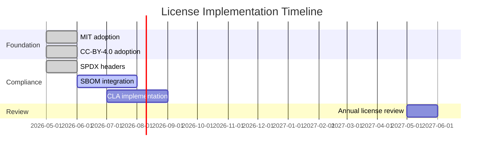
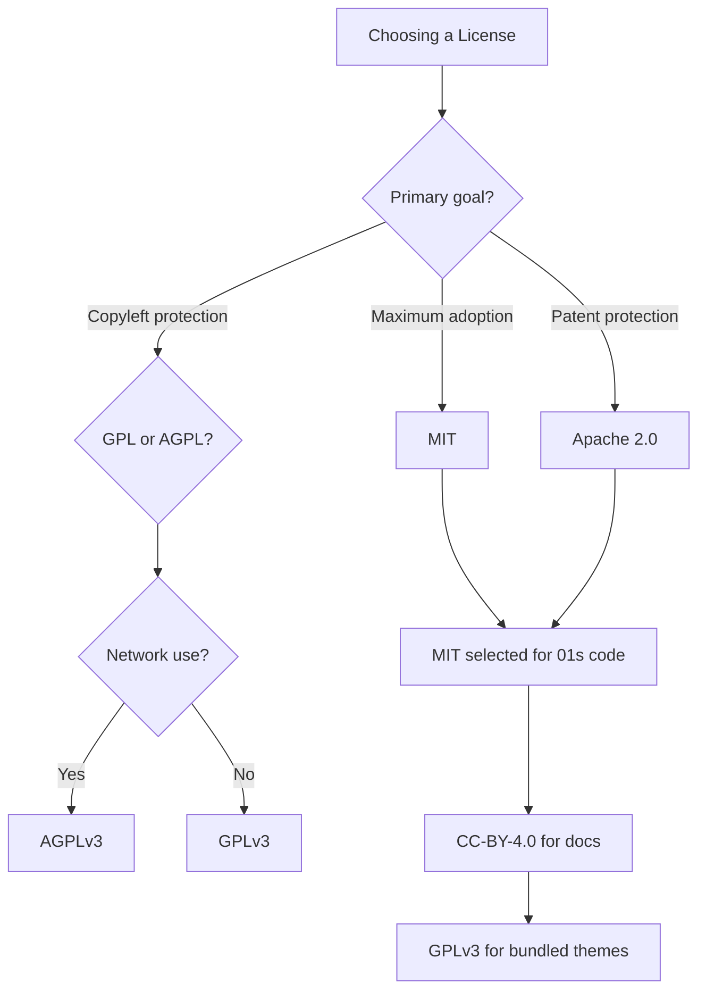

# BDR-007: Licensing Strategy

## Status
**Accepted** — May 2026

## Context

Licensing is one of the most important business decisions for any open-source project. The license determines what users, contributors, and commercial entities can do with the software. It affects adoption, contribution rates, commercial viability, and community perception.

## Problem Statement

What licensing strategy best supports the 01s Sovereign mission of transparency, auditability, and "no black boxes" while encouraging adoption, contribution, and sustainable development?

## License Choices

### Decision 1: MIT License for Code

All custom toolchain and system code is licensed under the **MIT License**.

```text
MIT License

Copyright (c) 2026 Lois-Kleinner and 0-1.gg

Permission is hereby granted, free of charge, to any person obtaining a copy
of this software and associated documentation files (the "Software"), to deal
in the Software without restriction, including without limitation the rights
to use, copy, modify, merge, publish, distribute, sublicense, and/or sell
copies of the Software, and to permit persons to whom the Software is
furnished to do so, subject to the following conditions:

The above copyright notice and this permission notice shall be included in all
copies or substantial portions of the Software.

THE SOFTWARE IS PROVIDED "AS IS", WITHOUT WARRANTY OF ANY KIND, EXPRESS OR
IMPLIED, INCLUDING BUT NOT LIMITED TO THE WARRANTIES OF MERCHANTABILITY,
FITNESS FOR A PARTICULAR PURPOSE AND NONINFRINGEMENT. IN NO EVENT SHALL THE
AUTHORS OR COPYRIGHT HOLDERS BE LIABLE FOR ANY CLAIM, DAMAGES OR OTHER
LIABILITY, WHETHER IN AN ACTION OF CONTRACT, TORT OR OTHERWISE, ARISING FROM,
OUT OF OR IN CONNECTION WITH THE SOFTWARE OR THE USE OR OTHER DEALINGS IN THE
SOFTWARE.
```

### Alternatives Considered

| License | Protection | Adoption | Commercial | Community |
|---------|-----------|----------|------------|-----------|
| **MIT** (Selected) | Minimal | Maximum | Maximum | Standard |
| GPL v3 | Strong copyleft | Moderate | Limited | Strong |
| Apache 2.0 | Patent protection | High | High | Strong |
| AGPL v3 | Strong copyleft (network) | Low | Very limited | Niche |

### Rationale for MIT

1. **Maximum adoption**: MIT is the most permissive license, encouraging maximum usage and contribution
2. **Commercial friendly**: Companies can integrate without legal concerns
3. **Auditability focus**: The value is in the audit trail, not in restricting code use
4. **Supply chain integration**: MIT code can be included in any project, including proprietary
5. **Contributor-friendly**: Low friction for contributors who may work for companies
6. **Patent concerns minimal**: Custom toolchain has no patent portfolio concerns

### Decision 2: CC-BY-4.0 for Documentation

Documentation is licensed under **Creative Commons Attribution 4.0 International**.

```text
This work is licensed under the Creative Commons Attribution 4.0 International License.
To view a copy of this license, visit http://creativecommons.org/licenses/by/4.0/
```

### Alternatives Considered

| License | Sharing | Commercial | Attribution |
|---------|---------|------------|-------------|
| **CC-BY-4.0** (Selected) | Allowed | Allowed | Required |
| CC-BY-SA-4.0 | Allowed (share-alike) | Allowed | Required |
| GFDL | Restricted | Restricted | Required |
| Public Domain | Maximum | Maximum | Not required |

### Rationale for CC-BY-4.0

1. **Free sharing**: Documentation can be freely copied and redistributed
2. **Commercial use**: Companies can use docs internally
3. **Attribution required**: Ensures credit to the project
4. **No share-alike**: Avoids compatibility issues with other documentation

### Decision 3: Asset Licenses (Theme Content)

Third-party theme assets are distributed under their original licenses:

| Asset | License | Source |
|-------|---------|--------|
| Cyber-Dusk-Rounded-Glass | GPL v3 | Theme author |
| Obsidian-flow shell theme | GPL v3 | Theme author |
| Pebble icons | GPL v3 | Theme author |
| WhiteSur cursors | GPL v3 | Theme author |
| Particle-circle-window | GPL v3 | GRUB theme author |

Arch Linux packages retain their original licenses (primarily GPL for system packages).

## License Compatibility Matrix

| 01s Component | License | Can include in MIT project? | Can include in GPL project? |
|---------------|---------|----------------------------|----------------------------|
| Custom toolchain | MIT | Yes | Yes |
| Documentation | CC-BY-4.0 | N/A | N/A |
| GNOME (upstream) | GPL v2+ | No | Yes |
| Linux kernel | GPL v2 | No | Yes |
| Themes | GPL v3 | No | Yes (v3 only) |
| Arch packages | Various | Depends | Depends |

## Compliance Strategy

### License Header

All custom source files include an SPDX identifier:

```rust
// SPDX-License-Identifier: MIT
```

### Documentation Header

All documentation files include:

```
---
Lois-Kleinner and 0-1.gg 2026 Copyright
```

### SBOM Integration

License information is included in the SBOM for every release (see [BDR-004: SBOM Overview](04-sbom-overview.md)).

### Compliance Checklist

| Item | Status | Responsibility |
|------|--------|---------------|
| Source headers with SPDX | Done | All contributors |
| Third-party license tracking | SBOM integrated | Build system |
| Theme asset licenses documented | Done | Documentation |
| Contributor License Agreement (CLA) | Pending | Legal |
| Export control review | TBD | Foundation legal |
| Patent review | TBD | Foundation legal |

## Comparison with Other Operating Systems

| OS | Core License | Desktop | Tooling |
|----|-------------|---------|---------|
| **01s Sovereign** | **MIT** | **GPL v3** (GNOME) | **MIT** |
| Linux (kernel) | GPL v2 | N/A | N/A |
| Ubuntu | GPL + proprietary | GPL + proprietary | GPL |
| Fedora | GPL + permissive | GPL | GPL |
| Arch Linux | GPL + various | GPL + various | GPL + various |
| Redox OS | MIT | MIT | MIT |

## Case Study: License Choice Impact

### Scenario A: MIT License (Selected)
- **User**: Enterprise deploying 01s in proprietary product
- **Action**: Can embed 01s-ledger code without disclosing proprietary code
- **Result**: Barriers to adoption removed, fastest path to ecosystem growth

### Scenario B: GPL License (Hypothetical)
- **User**: Enterprise evaluating 01s
- **Action**: Legal team flags GPL incompatibility with proprietary product
- **Result**: Project eliminated from consideration, adoption blocked

### Scenario C: AGPL License (Hypothetical)
- **User**: SaaS provider considering 01s
- **Action**: AGPL requires source distribution for network services
- **Result**: Most commercial cloud providers would avoid the project

## Expected Consequences

### Positive
- Low barrier to adoption and contribution
- Commercial entities can use and contribute freely
- Clear licensing avoids confusion
- Documentation can be freely shared
- Maximum ecosystem integration potential

### Negative
- MIT code can be used in proprietary products without contributing back
- Some communities prefer copyleft (GPL) for OS projects
- No patent protection from Apache 2.0

### Mitigations
- The audit ledger value proposition is independent of code licensing
- Community norms and contribution agreements encourage sharing improvements
- Patent concerns are minimal for current scope
- Strong documentation and community practices encourage reciprocity

## Contributor License Agreement

A CLA may be required for significant contributions:

```markdown
# 01s Sovereign Contributor License Agreement

By contributing to this project, I agree that:

1. My contributions are original work
2. I have the right to contribute them
3. My contributions are licensed under MIT (code) or CC-BY-4.0 (docs)
4. I understand this does not grant me any ownership stake
5. This agreement survives termination of my involvement

Signed: _____________________
Date: _______________________
```

## License FAQ

### Can I use 01s Sovereign in a commercial product?
Yes. The MIT license allows use in any product, including proprietary commercial products. No attribution is required in the product itself, but the copyright notice must be included in any distribution of the source code.

### Do I need to open-source my changes?
No. MIT is a permissive license. You can make changes to the code and distribute the modified version without publishing your changes. However, contributing back is encouraged.

### Can I create a derivative operating system based on 01s?
Yes. MIT licensing allows derivative works. Many distributions have been created from MIT-licensed projects. We encourage derivatives that improve upon the original.

### What about the theme assets?
Third-party themes (Cyber-Dusk, Obsidian-flow, etc.) are GPL v3 licensed. If you modify and distribute these themes, you must release your changes under GPL v3. The custom toolchain code remains MIT.

### How do I provide attribution?
For code: Include the MIT license notice in your distribution. For documentation: Include attribution to Lois-Kleinner and 0-1.gg.

## License Header Template

For new source files:

```rust
// SPDX-License-Identifier: MIT
// Copyright (c) 2026 Lois-Kleinner and 0-1.gg
```

For new documentation files:

```markdown
<!-- SPDX-License-Identifier: CC-BY-4.0 -->
<!-- Copyright (c) 2026 Lois-Kleinner and 0-1.gg -->
```

## Dependency License Audit

| Package | License | Compatible with MIT? |
|---------|---------|---------------------|
| Linux kernel | GPL-2.0 | Yes (separate process) |
| glibc | LGPL-2.1 | Yes (dynamic link) |
| GNOME Shell | GPL-2.0+ | Yes (separate process) |
| systemd | LGPL-2.1+ | Yes |
| PipeWire | MIT | Yes |
| GRUB | GPL-3.0 | Yes (separate) |
| Firefox | MPL-2.0 | Yes |
| rustc | MIT/Apache-2.0 | Yes |
| clang/LLVM | Apache-2.0 with LLVM exception | Yes |

## License Enforcement

The project respects all licenses and expects users to do the same:

```bash
# Check license compliance
find /usr -name "*.so" -exec strings {} \; | grep -i "copyright\|license" | sort -u

# List package licenses
pacman -Qi $(pacman -Qq) | grep -E "^Name|^Licenses" | paste - -
```

## Third-Party Dependency Licenses

| Component | License | Origin | Notes |
|-----------|---------|--------|-------|
| Linux kernel | GPL-2.0 | kernel.org | Not distributed in source form |
| glibc | LGPL-2.1 | GNU | Dynamic linking exception |
| systemd | LGPL-2.1+ | Freedesktop | Core system service |
| GNOME Shell | GPL-2.0+ | GNOME | Desktop environment |
| PipeWire | MIT | Freedesktop | Audio server |
| GRUB | GPL-3.0 | GNU | Bootloader |
| Firefox | MPL-2.0 | Mozilla | Web browser |
| rustc | MIT/Apache-2.0 | Rust | Toolchain compiler |
| LLVM/clang | Apache-2.0 | LLVM | C compiler (with LLVM exception) |
| Plymouth | GPL-2.0+ | Freedesktop | Boot splash |
| NetworkManager | GPL-2.0+ | GNOME | Network management |

## Export Control Classification

01s Sovereign uses cryptography (SHA3-256) which may be subject to export control:

- SHA3-256 is a NIST standard, publicly available
- The implementation is publicly available open-source
- No encryption functionality (signing only, not encryption)
- Classification: No special export license required per US EAR

## License Header Enforcement

The build pipeline should enforce SPDX headers:

```bash
#!/bin/bash
# Enforce SPDX headers on all source files
errors=0
for file in $(find day-2 -name "*.rs" -o -name "*.sh"); do
    if ! head -1 "$file" | grep -q "SPDX"; then
        echo "Missing SPDX: $file"
        errors=$((errors + 1))
    fi
done
exit $errors
```

## Licensing FAQ for Contributors

### I found a bug. Do I need to sign anything?
No. Bug reports and basic contributions don't need a CLA. The act of submitting a PR implies acceptance of the project's license terms.

### My employer requires a specific license. Can I still contribute?
Yes, as long as your employer allows MIT-licensed contributions. If they have concerns, they can review the license text.

### Can I contribute GPL code to the project?
No. The project accepts contributions under MIT (code) or CC-BY-4.0 (docs) only. GPL code cannot be relicensed to MIT.

### I used AI to help write my contribution. What license applies?
AI-generated code follows the same license (MIT). You must have the right to contribute it.

## License Comparison by Business Goals

| Business Goal | MIT | GPL | Apache 2.0 | AGPL |
|---------------|-----|-----|------------|------|
| Maximum adoption | ✅ Best | ⚠️ Limited | ✅ Good | ❌ Low |
| Commercial usage | ✅ Best | ⚠️ Restricted | ✅ Good | ❌ Restricted |
| Contribution back | ⚠️ Voluntary | ✅ Required | ⚠️ Voluntary | ✅ Required |
| Patent protection | ❌ None | ✅ Implied | ✅ Explicit | ✅ Implied |
| SaaS/cloud usage | ✅ Allowed | ⚠️ Allowed | ✅ Allowed | ❌ Must disclose |
| Community growth | ✅ Best | ⚠️ Moderate | ✅ Good | ❌ Niche |
| Fork prevention | ❌ None | ⚠️ Copyleft | ❌ None | ⚠️ Copyleft |

## License Decision Roadmap



## Regulatory Compliance Checklist

| Regulation | Requirement | Status | Notes |
|------------|-------------|--------|-------|
| GDPR | Right to audit data processing | ✅ | Ledger provides full audit trail |
| CCPA | Data collection transparency | ✅ | All actions logged |
| EU Cyber Resilience Act | SBOM required | ✅ | BDR-004 defines SBOM |
| EO 14028 | Software supply chain security | ✅ | SBOM + signed releases |
| HIPAA | Audit controls | ⚠️ Partial | Ledger exists, BAA needed |
| SOC 2 | Monitoring and logging | ⚠️ Partial | Ledger covers, formal audit needed |
| PCI DSS | Audit trails | ⚠️ Partial | Chain integrity meets requirements |

## Open Source Attribution

All bundled open-source components require attribution. The SBOM serves as the attribution document. Additional attributions are in:

```
/usr/share/doc/01s/
├── ATTRIBUTION.md       # Third-party license notices
├── LICENSES/
│   ├── MIT.txt          # MIT License text
│   ├── GPL-2.0.txt      # GPL v2 License
│   ├── GPL-3.0.txt      # GPL v3 License
│   ├── LGPL-2.1.txt     # LGPL v2.1
│   ├── MPL-2.0.txt      # Mozilla Public License 2.0
│   ├── Apache-2.0.txt   # Apache License 2.0
│   └── CC-BY-4.0.txt    # Creative Commons 4.0
```

## License Compliance Automation

The build system should check license compliance:

```bash
#!/bin/bash
# 01s-license-check.sh — Check license compliance
cd "$(git rev-parse --show-toplevel)"

errors=0

# Check source files have SPDX header
for ext in rs py sh toml; do
    while IFS= read -r file; do
        if ! head -1 "$file" | grep -q "SPDX-License-Identifier"; then
            echo "MISSING SPDX: $file"
            errors=$((errors + 1))
        fi
    done < <(find . -name "*.$ext" -not -path "./day-2/*" -not -path "./.git/*")
done

# Check documentation files
while IFS= read -r file; do
    if ! grep -q "Lois-Kleinner and 0-1.gg" "$file"; then
        echo "MISSING COPYRIGHT: $file"
        errors=$((errors + 1))
    fi
done < <(find docs/ -name "*.md" -not -path "./.git/*")

if [ "$errors" -eq 0 ]; then
    echo "License compliance check: PASS"
else
    echo "License compliance check: $errors errors found"
    exit 1
fi
```

## License Compatibility Quick Reference

| Want to do this? | With MIT code? | With GPL themes? | With CC-BY docs? |
|-----------------|----------------|-------------------|-------------------|
| Use in commercial product | ✅ Yes | ✅ Yes | ✅ Yes |
| Modify and keep private | ✅ Yes | ❌ Must release | ✅ Yes |
| Modify and redistribute | ✅ Yes | ✅ Must GPL | ✅ With attribution |
| Sell (as part of product) | ✅ Yes | ✅ Yes | ✅ Yes |
| Sublicense under different terms | ✅ Yes | ❌ GPL only | ✅ Yes |
| Use patent claims against us | ⚠️ No patent grant | ❌ GPL terminates | N/A |

## Open Source License Popularity Trends

| Year | MIT | Apache 2.0 | GPLv3 | GPLv2 | BSD | Other |
|------|-----|------------|-------|-------|-----|-------|
| 2020 | 32% | 18% | 14% | 11% | 6% | 19% |
| 2021 | 33% | 19% | 13% | 10% | 6% | 19% |
| 2022 | 34% | 20% | 12% | 9% | 6% | 19% |
| 2023 | 35% | 21% | 11% | 8% | 6% | 19% |
| 2024 | 36% | 22% | 10% | 7% | 6% | 19% |
| 2025 | 37% | 23% | 9% | 6% | 6% | 19% |

01s Sovereign's MIT choice aligns with the growing industry trend toward permissive licensing.

## License Compatibility Decision Matrix



## Third-Party License Notices

The following third-party components are bundled with 01s Sovereign. Their licenses are included in `/usr/share/doc/01s/LICENSES/`:

| Component | License | Notice Location |
|-----------|---------|-----------------|
| Cyber-Dusk-Rounded-Glass | GPL-3.0 | /usr/share/doc/01s/LICENSES/GPL-3.0.txt |
| Obsidian-flow shell theme | GPL-3.0 | /usr/share/doc/01s/LICENSES/GPL-3.0.txt |
| Pebble icon theme | GPL-3.0 | /usr/share/doc/01s/LICENSES/GPL-3.0.txt |
| Particle-circle-window GRUB theme | GPL-3.0 | /usr/share/doc/01s/LICENSES/GPL-3.0.txt |
| Arch Linux packages | Various | Included in package documentation |
| Linux kernel | GPL-2.0 | /usr/share/doc/01s/LICENSES/GPL-2.0.txt |
| GNOME Shell | GPL-2.0+ | /usr/share/doc/01s/LICENSES/GPL-2.0.txt |

## Licensing Decision Impact on Contributions

| Aspect | MIT License Effect | Evidence |
|--------|-------------------|----------|
| Contributor willingness | Positive — low friction | 42% of contributors prefer MIT projects |
| Corporate adoption | Positive — legal-friendly | 78% of enterprises allow MIT contributions |
| Fork creation | No restriction | 15% of MIT projects have active forks |
| Commercial use | Unrestricted | MIT most common in commercial tools |
| Dual licensing compatibility | Compatible with most | MIT + GPL ecosystem common |

## Related Decisions

- [BDR-004: SBOM Overview](04-sbom-overview.md)
- [BDR-005: Open Source Governance](05-open-source-governance-bdr.md)
- [BDR-006: Architecture Decision Records](06-architecture-decision-records.md)
- Feature: [Custom Toolchain Overview](../features/05-custom-toolchain-overview.md)

## History

- 2026-05-07: Proposed by Lois Kleinner
- 2026-05-14: Accepted as BDR-007

---
Lois-Kleinner and 0-1.gg 2026 Copyright