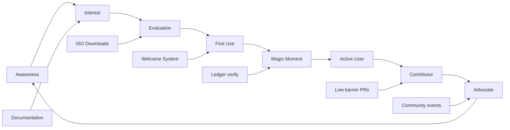
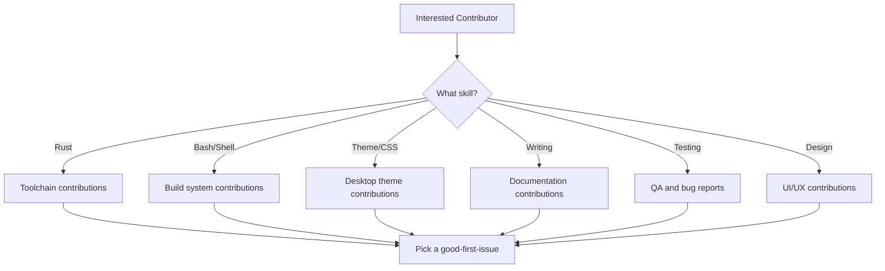
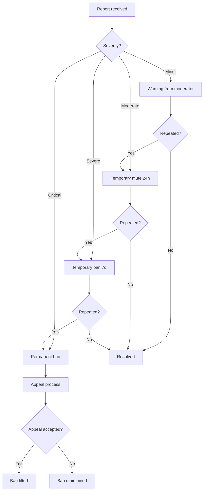
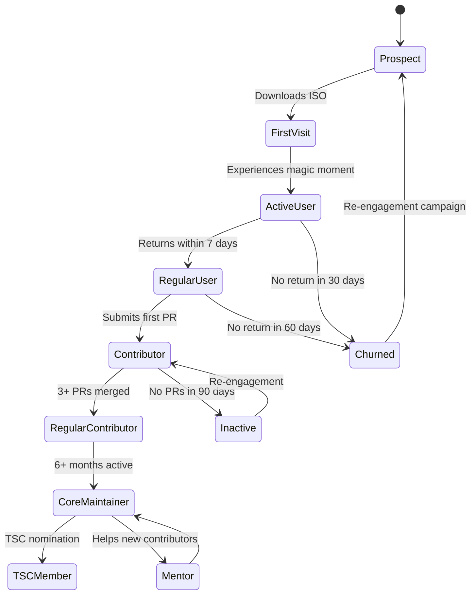

# BDR-008: Community Growth Strategy

## Status
**Accepted** — May 2026

## Context

01s Sovereign (Kaiman) is a new open-source operating system. For the project to thrive beyond its initial release, it must build and sustain an active community of users, contributors, and advocates. Community growth is not automatic — it requires deliberate strategy, investment, and measurement.

## Problem Statement

How do we build, grow, and sustain an active community around 01s Sovereign that contributes code, documentation, testing, and advocacy?

## Community Growth Model



## Funnel Stages

### Stage 1: Awareness

Goal: People know 01s Sovereign exists.

**Channels:**

| Channel | Priority | Effort | Reach |
|---------|----------|--------|-------|
| GitHub (project repo) | High | Low | Developer-focused |
| Arch Linux forums | High | Low | Technical users |
| Reddit (r/linux, r/archlinux) | High | Medium | Broad technical |
| Hacker News | Medium | Low | Tech influencers |
| YouTube (demo videos) | Medium | High | General audience |
| Twitter/X | Low | Medium | Tech community |
| Technical blogs | Medium | Medium | Developer audience |

**Key messages:**
- "The first auditable operating system"
- "No black boxes — every system action is cryptographically verified"
- "Custom toolchain from scratch in Rust"
- "Complete transparency from boot to shutdown"

### Stage 2: Interest

Goal: People want to learn more.

**Content:**
- Feature documentation (this repository)
- `07_AIOSS_FORMAT.md` — the core value proposition
- Build-your-own-ISO tutorials
- Architecture decision records
- Video demos of hash chain verification

**Entry points:**
- `/docs/features/01-aioss-ledger-format.md` — lead with the differentiator
- `/docs/bdr/` — transparent business decisions
- ISO download with live boot

### Stage 3: Evaluation

Goal: People try the ISO.

**Barriers to overcome:**

| Barrier | Mitigation |
|---------|------------|
| Need to download ISO | Clear download page with checksums |
| Need to burn/boot ISO | Step-by-step guides (QEMU, USB, VirtualBox) |
| Need to understand value | Magic moment prompts in welcome screen |
| Fear of complexity | `01s-welcome-gtk` guided wizard |
| Time investment | Live ISO requires no installation |

**Download metrics to track:**
- ISO downloads per release
- Geographic distribution
- Referral sources
- Download-to-boot conversion

### Stage 4: First Use

Goal: Users boot and experience the system.

**First-boot experience** (see [BDR-003: Magic Moment](03-magic-moment.md)):
1. GRUB with branded theme
2. Plymouth boot splash with 01s animation
3. Auto-login to GNOME desktop
4. Welcome wizard appears
5. First `01s-ledger verify` prompt

**Success metric:** Percentage of users who run `01s-ledger verify` within first 10 minutes.

### Stage 5: Active User

Goal: Users return to use the system regularly.

**Retention mechanisms:**
- Sound scheme for desktop events
- Conky desktop widget
- Shell command logging via ledger
- Periodic state snapshots
- Regular ISO updates

**Retention metrics:**
- Session frequency (daily/weekly active users)
- Boot-to-desktop time
- Feature usage (ledger, toolchain, extensions)
- System uptime

### Stage 6: Contributor

Goal: Users contribute code, docs, or bug reports.

**Contribution paths:**



**Good first issues:**
- Toolchain: Add multiplication operator tests
- Build: Improve error messages in build script
- Docs: Add troubleshooting section
- Theme: Fix icon alignment
- Ledger: Add unit tests for verify

**Contributor incentives:**
- Name in CONTRIBUTORS.md
- Contributor badge on website
- Core maintainer path
- Foundation membership (after formalization)

### Stage 7: Advocate

Goal: Contributors promote the project.

**Advocate activities:**
- Give talks at conferences
- Write blog posts
- Create tutorial videos
- Organize local meetups
- Answer questions on forums
- Mentor new contributors

## Community Health Metrics

| Metric | Target | Frequency |
|--------|--------|-----------|
| GitHub stars | 500 (6 months), 5,000 (2 years) | Monthly |
| ISO downloads | 1,000/month (6 months) | Monthly |
| Contributors | 10 (6 months), 50 (2 years) | Monthly |
| Active PRs | 5 open at any time | Weekly |
| Issue response time | < 48 hours | Weekly |
| PR merge time | < 7 days | Weekly |
| Community forum posts | 100/month (1 year) | Monthly |
| Documentation translations | 3 languages (1 year) | Quarterly |

## Community Platforms

| Platform | Purpose | Launch timeline |
|----------|---------|----------------|
| GitHub | Code, issues, PRs | Day 0 |
| GitHub Discussions | Q&A, ideas | Day 0 |
| Discord/Slack | Real-time chat | Day 7 |
| Community forum | Long-form discussion | Month 1 |
| YouTube | Tutorials, demos | Month 1 |
| IRC | Minimal center | Day 0 |

## Events Strategy

- **Virtual hackathons**: Quarterly focused sprints (e.g., "Ledger Hackathon")
- **Conference presence**: Linux Foundation events, FOSDEM, All Systems Go
- **Release parties**: Major version releases with live streams
- **Contributor summits**: Annual in-person meetup (post-pandemic)

## Community Guidelines

1. **Be respectful**: All interactions follow the Code of Conduct
2. **Be transparent**: Decisions are documented (BDRs, ADRs)
3. **Be helpful**: New contributor questions answered within 24 hours
4. **Be inclusive**: Active outreach to underrepresented groups
5. **Be accountable**: Mistakes are documented and learned from

## Community Growth Case Study

### Year 1 Projection

| Metric | Q1 | Q2 | Q3 | Q4 |
|--------|----|----|----|----|
| GitHub Stars | 50 | 150 | 300 | 500 |
| ISO Downloads | 100 | 300 | 600 | 1,000/month |
| Contributors | 2 | 5 | 8 | 10 |
| Active PRs | 1 | 3 | 4 | 5 |
| Forum Posts | 10 | 30 | 60 | 100/month |
| Discord Members | 20 | 50 | 100 | 200 |

### Year 2 Projection

| Metric | Q1 | Q2 | Q3 | Q4 |
|--------|----|----|----|----|
| GitHub Stars | 800 | 1,200 | 2,000 | 5,000 |
| ISO Downloads | 1,500 | 2,000 | 3,000 | 5,000/month |
| Contributors | 15 | 20 | 30 | 50 |
| Active PRs | 7 | 10 | 12 | 15 |
| Forum Posts | 150 | 200 | 300 | 500/month |
| Discord Members | 350 | 500 | 750 | 1,000 |

## Budget Allocation

| Category | Year 1 | Year 2 | Year 3 |
|----------|--------|--------|--------|
| Infrastructure (CI/CD, hosting) | $2,000 | $3,000 | $5,000 |
| Community events | $1,000 | $5,000 | $10,000 |
| Contributor rewards | $500 | $2,000 | $5,000 |
| Marketing/promotion | $500 | $2,000 | $5,000 |
| **Total** | **$4,000** | **$12,000** | **$25,000** |

## Expected Consequences

### Positive
- Growing contributor base reduces bus factor
- Community provides diverse perspectives
- Users become advocates, reducing marketing costs
- Documentation improves through community contributions
- Bug reports increase, improving quality

### Negative
- Community management requires time and attention
- Toxic contributors can damage community health
- Fork risk if governance is perceived as unfair
- Support burden increases with user base

### Mitigations
- Dedicated community manager role (initially founder, later paid)
- Clear Code of Conduct enforcement
- Transparent governance (see BDR-005)
- Automated support tools (FAQ, wiki, chatbot)

## Monthly Community Health Report Template

```markdown
# 01s Sovereign Community Health Report — [Month] [Year]

## Growth Metrics
- GitHub Stars: [before] → [after] (+[diff])
- ISO Downloads: [number]
- New Contributors: [number]
- Active Contributors: [number]
- Forum Members: [number]
- Discord Members: [number]

## Content Metrics
- New Issues: [number]
- Closed Issues: [number]
- Merged PRs: [number]
- Documentation Updates: [number]

## Highlights
- [Major contribution or milestone]
- [Community event or announcement]
- [New feature or release]

## Challenges
- [Challenge 1]
- [Challenge 2]

## Goals for Next Month
- [Goal 1]
- [Goal 2]
```

## Contributor Onboarding Checklist

```markdown
# Contributor Onboarding

## Day 1
- [ ] Read CONTRIBUTING.md
- [ ] Set up development environment
- [ ] Run the project locally
- [ ] Find a "good first issue"

## Week 1
- [ ] Submit first PR (documentation or test)
- [ ] Join community chat
- [ ] Introduce yourself in #introductions

## Month 1
- [ ] Submit 3+ PRs
- [ ] Review 2+ PRs from others
- [ ] Participate in community discussion

## Month 3
- [ ] Apply for Regular Contributor status
- [ ] Mentor a new contributor
- [ ] Present at community meeting

## Month 6
- [ ] Consider Core Maintainer nomination
- [ ] Lead a community initiative
```

## Community Moderation Guidelines

### Moderation Escalation Path



### Code of Conduct Enforcement

| Violation | First Offense | Second Offense | Third Offense |
|-----------|---------------|----------------|---------------|
| Unwelcoming language | Warning | Warning + moderation | 24h mute |
| Harassment | 24h mute | 7d ban | Permanent ban |
| Spam | Warning | 24h mute | Permanent ban |
| Trolling | Warning | 7d ban | Permanent ban |
| Doxxing | Permanent ban | — | — |
| Threats | Permanent ban | — | — |

## Local Community Organizer Guide

### Starting a Local Meetup

```markdown
# Local 01s Sovereign Meetup Guide

## Step 1: Find a Venue
- Local hackerspace or makerspace
- University computer lab
- Coffee shop with private room
- Coworking space

## Step 2: Set a Date
- Weekday evenings (Tue-Thu) work best
- Avoid holidays and major conferences
- Monthly or bi-monthly cadence

## Step 3: Plan Content
- 30min: Introduction to 01s (for new attendees)
- 30min: Technical talk or demo
- 30min: Networking / Q&A

## Step 4: Promote
- Post on community forums
- Share on social media
- Announce in Discord
- Create an event page

## Step 5: Follow Up
- Share presentation slides
- Send thank-you notes
- Collect feedback
- Plan next meeting
```

## Community Tooling

| Tool | Purpose | Status |
|------|---------|--------|
| GitHub Issues | Bug tracking, feature requests | Active |
| GitHub Discussions | Q&A, ideas, RFC feedback | Active |
| Discord | Real-time chat, support | Active |
| Mailing list | Announcements, newsletter | Planned |
| Wiki | Community-maintained docs | Planned |
| Blog | Project updates, tutorials | Active |
| YouTube | Video tutorials, demos | Planned |
| IRC/Matrix | Federated chat | Planned |

## Community Recognition Program

### Levels of Recognition

| Level | Criteria | Recognition |
|-------|----------|-------------|
| 🥇 Gold | Core Maintainer (6+ months) | Foundation membership |
| 🥈 Silver | Regular Contributor (3+ months) | T-shirt, blog post |
| 🥉 Bronze | Repeat Contributor (5+ PRs) | Name in README |
| ⭐ First PR | First merged contribution | Shoutout in release notes |

### Annual Awards

| Award | Criteria |
|-------|----------|
| Contributor of the Year | Most impactful contributions |
| Best Newcomer | Best first-year contributions |
| Community Champion | Most helpful community member |
| Documentation Hero | Best documentation contributions |
| Code Quality Champion | Most thorough code reviews |

## Community Moderation Tools

| Tool | Purpose | Access |
|------|---------|--------|
| GitHub Issue labels | Categorize issues | Maintainers |
| GitHub PR templates | Standardize contributions | Public |
| Discord moderation bot | Auto-moderation | Moderators |
| Discord verification gate | Prevent spam | Public |
| Mailing list moderation | Approve posts | Moderators |
| Code review checklist | Quality control | All contributors |

## Community Metrics Dashboard

Key metrics to track monthly:

```yaml
# community-metrics.yml
monthly_tracking:
  growth:
    new_github_stars: 0
    new_discord_members: 0
    new_contributors: 0
    new_issues: 0
  engagement:
    active_contributors: 0
    merged_prs: 0
    comments_on_issues: 0
    forum_posts: 0
  retention:
    contributors_30d: 0
    contributors_90d: 0
    churned_contributors: 0
```

## Community Engagement Lifecycle



## Community Growth ROI Model

| Investment | Year 1 Cost | Expected ROI | Measurement |
|-----------|-------------|--------------|-------------|
| Documentation improvements | $500 | 15% more active users | User survey |
| Community events | $1,000 | 25% more contributors | Event-to-PR conversion |
| Contributor rewards | $500 | 20% higher retention | Monthly active contributors |
| Infrastructure (CI/CD) | $2,000 | 30% faster PR merge | Time-to-merge metric |
| Marketing content | $500 | 40% more ISO downloads | Download analytics |

## Community Health Dashboard Mockup

```
┌────────────────────────────────────────────────────────────┐
│              01s Sovereign Community Health                 │
├────────────────────────────────────────────────────────────┤
│ Growth Metrics                    Engagement Metrics        │
│ ┌────────────────────────────┐   ┌────────────────────────┐ │
│ │ GitHub Stars:     1,247 ▲  │   │ Active PRs:     8     │ │
│ │ ISO Downloads:    2,350 ▲  │   │ Open Issues:    22    │ │
│ │ Contributors:     18   ▲   │   │ Avg Response:   4.2h  │ │
│ │ Discord Members:  342  ▲   │   │ Merge Time:     2.1d  │ │
│ └────────────────────────────┘   └────────────────────────┘ │
│                                                              │
│ Contributor Funnel                                           │
│ ┌──────────────────────────────────────────────────────────┐ │
│ │ New Visitors: 5,000                                       │ │
│ │   ↓ 12% conversion                                       │ │
│ │ ISO Downloads: 600                                        │ │
│ │   ↓ 35% conversion                                       │ │
│ │ Active Users: 210                                         │ │
│ │   ↓ 8.5% conversion                                      │ │
│ │ Contributors: 18                                          │ │
│ └──────────────────────────────────────────────────────────┘ │
└────────────────────────────────────────────────────────────┘
```

## Related Decisions

- [BDR-001: Business Decision Record Overview](01-business-decision-record-overview.md)
- [BDR-005: Open Source Governance](05-open-source-governance-bdr.md)
- [BDR-003: Magic Moment](03-magic-moment.md)
- Feature: [DevShell and Welcome System](../features/18-devshell-and-welcome-system.md)

## History

- 2026-05-07: Proposed by Lois Kleinner
- 2026-05-14: Accepted as BDR-008
- 2026-06-01: GitHub Discussions enabled
- 2026-06-15: Community Discord server created

---
Lois-Kleinner and 0-1.gg 2026 Copyright

```
.====================================================================.
!  Made in the UAE, Dubai #DubaiIt #Dubai #Dxb #SovereignAI          !
!  Made in The Emirates #Dubai_it                                    !
!                                                                    !
!  Lois-Kleinner Alpasan - The Anticloud 2026-                       !
!                                                                    !
!  0-1.gg ! GitHub ! LinkedIn ! DEV ! GH Pages                       !
!  HuggingFace ! Blog ! Tumblr ! Fandom ! Bluesky ! Mastodon          !
!  Zenodo ! Harvard Dataverse ! Internet Archive ! ORCID              !
!                                                                    !
!  Sovereign AI ! Local-First ! Privacy ! Zero Trust ! No Datacenter !
!  Air-Gapped ! Open Source ! Rust ! Hash Chain ! Single Binary      !
!  Offline LLM ! Crypto Ledger ! P2P ! Federated                     !
'===================================================================='
```

Lois-Kleinner Alpasan, 22, builds sovereign AI infrastructure and cryptographic audit systems. His work spans formats, proptech, and research platforms serving projects valued at over $1B combined, operating at the intersection of AI, media, and decentralized technology.

References:
1. Lois-Kleinner Zenodo: https://doi.org/10.5281/zenodo.20781790
2. Lois-Kleinner GitHub: https://github.com/kleinnner/Anticloud/tree/main/04-aioss-format
3. Lois-Kleinner Harvard DV: https://doi.org/10.7910/DVN/3VDF75
4. Lois-Kleinner Internet Arc: https://archive.org/details/aioss-format
5. Lois-Kleinner ORCID: https://orcid.org/0009-0009-2233-6107
6. Lois-Kleinner DEV.to: https://dev.to/kleinner
7. Lois-Kleinner LinkedIn: https://linkedin.com/in/kleinner
8. Lois-Kleinner HuggingFace: https://huggingface.co/Anticloud
9. Lois-Kleinner Tumblr: https://anticloud.tumblr.com
10. Lois-Kleinner Mastodon: https://mastodon.social/@kleinner
11. Lois-Kleinner Bluesky: https://bsky.app/profile/kleinner.bsky.social
12. 0-1.gg: https://0-1.gg
