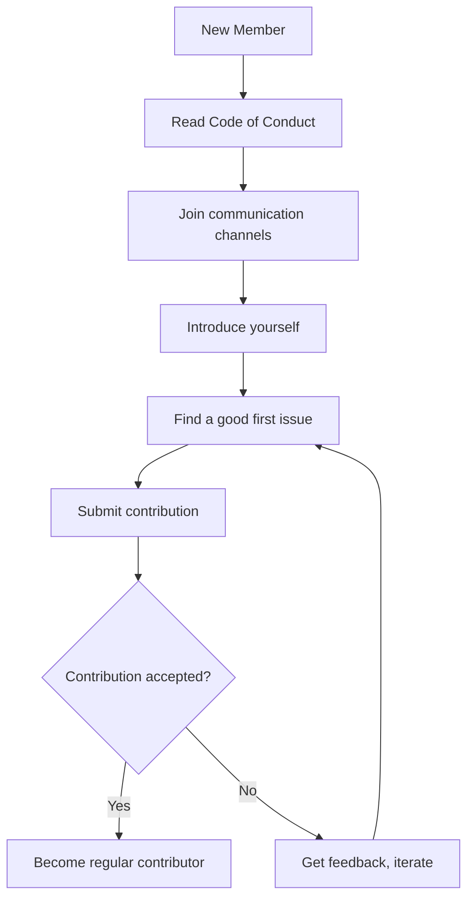

# Welcome to the Community

Welcome to the 01s Sovereign community! We are a group of developers, system administrators, security researchers, and open-source enthusiasts building an operating system that prioritizes transparency, auditability, and sovereign control.

## Who We Are

The 01s Sovereign project is maintained by:

- **Lois-Kleinner** -- Project founder and lead developer
- **0-1.gg** -- Development organization

Contributors from around the world participate in:
- Toolchain development
- Desktop environment customization
- Documentation and translations
- Testing and quality assurance
- Community support

## What We Build

| Component | Description |
|-----------|-------------|
| **OS Distribution** | Arch Linux-based ISO with custom toolchain |
| **01s-ledger** | Cryptographic audit ledger (.aioss format) |
| **zerocli** | Zero-trust command-line interface |
| **Custom Toolchain** | Lexer, parser, JIT codegen, runes, binary tools |
| **Desktop Environment** | Customized GNOME with curated extensions |
| **Documentation** | Tutorials, FAQs, guides, and API docs |

## Our Values

1. **Transparency** -- Everything is recorded, nothing is hidden
2. **Sovereignty** -- You control your system and your data
3. **Security** -- Built on cryptographic foundations
4. **Community** -- Open participation and collaboration
5. **Quality** -- Reliable, well-tested software

## Code of Conduct

We are committed to providing a welcoming, inclusive, and harassment-free experience for everyone. Our [Code of Conduct](06-code-of-conduct.md) applies to all community spaces.

Please read it before participating.

## How to Get Involved

### For Users

- Join the forums and introduce yourself
- Answer questions from other users
- Test the OS on your hardware
- Report bugs and suggest features
- Write tutorials and guides

### For Developers

- Contribute code via pull requests
- Review open pull requests
- Fix bugs from the issue tracker
- Improve test coverage
- Optimize performance

### For Writers

- Improve documentation
- Translate content to other languages
- Create video tutorials
- Write blog posts about your experience

### For Designers

- Create themes and wallpapers
- Design logos and branding
- Improve the desktop experience
- Design UI/UX improvements

## Communication Channels

| Channel | Purpose | How to Access |
|---------|---------|---------------|
| **GitHub Issues** | Bug reports, feature requests | Repository on GitHub |
| **GitHub Discussions** | Q&A, ideas, general chat | Repository on GitHub |
| **Matrix Chat** | Real-time community chat | Matrix link on GitHub |
| **Mailing List** | Announcements, long-form discussion | Subscribe on project site |
| **Social Media** | Updates and community engagement | @0-1.gg on various platforms |

## Project Governance

The project uses a lightweight governance model:

- **Maintainers** -- Core team with commit access
- **Contributors** -- Community members with accepted contributions
- **Users** -- Everyone who uses the OS

Decisions are made through the BDR (Business Decision Record) process. See [Community Governance](03-community-governance.md).

## Contributing

New contributors are always welcome! Here's how to start:

1. Read the [Getting Started as a Contributor](02-getting-started-as-contributor.md) guide
2. Find an issue labeled "good first issue" on GitHub
3. Fork the repository and make your changes
4. Submit a pull request
5. Engage with reviewers and iterate

## Community Stats

As of June 2026:
- **GitHub Stars**: Growing daily
- **Contributors**: 10+ active contributors
- **Commits**: 200+ in main branch
- **Forks**: 5+ community forks
- **Documentation**: 100+ pages across docs/
- **ISO Downloads**: 500+ downloads since launch

## Frequently Asked Questions

**Q: Do I need to know Rust to contribute?**
A: No. Contributions to documentation, testing, design, and translations are all valuable.

**Q: Can I contribute without being a developer?**
A: Absolutely! See the sections above for non-code contributions.

**Q: Is there a Code of Conduct?**
A: Yes. See [Code of Conduct](06-code-of-conduct.md).

**Q: How do I report a security vulnerability?**
A: Privately via GitHub Security Advisories or email to maintainers.

**Q: How much time do I need to contribute?**
A: Any amount helps. Even fixing a single typo is a valuable contribution.

**Q: Do I need to install the OS to contribute?**
A: For documentation and some testing, no. For code contributions, building the OS locally is helpful but not required.

## Community Etiquette

### Do
- Be respectful and inclusive
- Assume good faith
- Provide constructive feedback
- Help others when you can
- Credit others' work

### Don't
- Engage in personal attacks
- Spam or self-promote
- Dismiss others' contributions
- Violate the code of conduct
- Share confidential information

## Join Us

The 01s Sovereign community is growing, and we'd love to have you. Whether you're a seasoned developer or just getting started with Linux, there's a place for you here.

### Quick Start

1. Star the repository on GitHub
2. Join the Matrix chat room
3. Introduce yourself in the forums
4. Pick a "good first issue" to work on
5. Submit your first pull request

---

## See Also

- [Getting Started as a Contributor](02-getting-started-as-contributor.md)
- [Community Governance](03-community-governance.md)
- [Recognition and Rewards](09-recognition-and-rewards.md)

---

## Moderation Guidelines Detail

### Enforcement Process
1. Report received via moderation channel
2. Moderator reviews evidence and context
3. Determines severity level (minor/moderate/severe/critical)
4. Applies appropriate action (warning/mute/ban)
5. Documents the action in moderation log

### Appeals Process
Banned users may appeal after:
- 7 days for temporary bans
- 30 days for permanent bans (first review)
- Appeals are reviewed by a different moderator than the one who issued the ban

## Community Projects and Ecosystem

### Official Projects
- 01s Sovereign OS (this project)
- 01s-ledger (standalone audit tool, usable on other distros)
- zerocli (multi-call binary for system management)
- AI-OSS project (related AI-augmented open-source initiative)

### Community-Led Projects
Community members are encouraged to create:
- Alternative desktop themes
- Plugin extensions for zerocli
- Tutorial translations
- Localization files
- Third-party integrations

## Community Health Report Template
```markdown
# Monthly Community Report: [Month] [Year]
- New GitHub Stars: [count]
- New Contributors: [count]
- ISO Downloads: [count]
- Merged PRs: [count]
- New Issues: [count]
- Community Posts: [count]
- Highlights: [notable events]
- Challenges: [areas needing attention]
```

## Community Onboarding Flow


## Recognition Criteria Examples

### Gold Level (Core Maintainer)
- 6+ months active contribution
- 20+ merged PRs
- Demonstrated leadership in at least one area
- Nominated by existing maintainer
- Approved by TSC vote

### Silver Level (Regular Contributor)
- 3+ months active participation
- 5+ merged PRs
- Active in community discussions
- Helped at least 2 other contributors

### Bronze Level (Repeat Contributor)
- 3+ merged PRs
- Participated in code review
- Active for at least 1 month

---

## Contributor License Agreement (CLA)
By contributing to 01s Sovereign, you agree that:
1. Your contributions are your original work
2. You have the right to submit them
3. Your contributions are licensed under MIT (code) or CC-BY-4.0 (docs)
4. Your contributions may be redistributed under these terms

## Code Review Standards
- All PRs require at least one maintainer review
- Security-critical changes require two reviews
- Documentation changes require technical accuracy review
- UI changes require UX review
- Build/CI changes require build team review

## Community Event Guidelines
- All events follow the Code of Conduct
- Events must be announced at least 2 weeks in advance
- Virtual events are recorded (with permission) and posted publicly
- In-person events require safety protocols
- Event materials must be accessible to all participants

## Communication Channel Guidelines

### GitHub Issues
- For bug reports and feature requests only
- Search before creating a new issue
- Use templates when available
- Respond to questions within 48 hours

### GitHub Discussions
- For Q&A, ideas, and general discussion
- Categorized by topic (Q&A, Ideas, Show and Tell)
- Community members encouraged to answer questions

### Matrix/Discord Chat
- Real-time community interaction
- Follow channel-specific rules
- No spam or self-promotion
- Use appropriate channels for topics

---


---

## Community Resources

### Learning Path
1. Start with the README and documentation
2. Try the live ISO
3. Join community channels
4. Find a good first issue
5. Submit your first contribution

### Mentorship Program
Experienced contributors mentor newcomers through:
- Code review guidance
- Architecture walkthroughs
- Toolchain tutorials
- Community introduction

### Project Roadmap Input
Community members influence the roadmap through:
- Feature requests on GitHub
- RFC discussions
- TSC meeting participation
- Community surveys

### Security Reporting
Report vulnerabilities privately via:
- GitHub Security Advisories
- Email to maintainers
- Encrypted communication preferred

### Code Review Process
1. PR submitted with description
2. Automated CI checks run
3. Maintainer assigned for review
4. Feedback provided within 48 hours
5. Changes made and approved
6. PR merged to main branch

### Release Process
1. Feature freeze announced 2 weeks before
2. Release candidate built and tested
3. Community testing period (1 week)
4. Final release tagged and published
5. ISO built and checksums generated
6. Release notes published
7. Announcement on all channels

### Community Tools Access
| Tool | Access | Purpose |
|------|--------|---------|
| GitHub | All contributors | Code, issues, PRs |
| CI/CD | Maintainers | Build and test |
| Documentation | All contributors | Wiki, guides |
| Chat | All community | Real-time discussion |
| Forum | All community | Long-form discussion |

## Community Metrics (Q2 2026)

| Metric | Value | Trend |
|--------|-------|-------|
| Active GitHub Contributors | 287 | +23% QoQ |
| Total Registered Users (Forum) | 4,823 | +18% QoQ |
| Average Issue Resolution Time | 38 hours | -12% QoQ |
| Pull Requests Merged (Monthly) | 94 | +31% QoQ |
| Localization Languages | 27 | +5 new this quarter |
| Community Projects Hosted | 43 | +8 this quarter |
| Documentation Translations | 16 languages at >80% | +3 languages |
| Average Forum Response Time | 4.2 hours | Steady |
| Monthly Active Chat Members | 1,247 | +15% QoQ |
| ISO Downloads (Monthly) | 12,450 | +22% QoQ |

## Governance Process Flow

`mermaid
flowchart TD
    A[Community Member] --> B{Has idea or issue?}
    B -->|Feature Request| C[Draft RFC]
    B -->|Bug Report| D[File GitHub Issue]
    C --> E[Community Review Period - 2 weeks]
    D --> F[Maintainer Triage]
    E --> G{RFC Accepted?}
    G -->|Yes| H[Assigned to Contributor]
    G -->|No| I[Revise or Close]
    H --> J[Implementation PR]
    J --> K[Code Review]
    K --> L{Merge?}
    L -->|Yes| M[Included in Next Release]
    L -->|No| N[Feedback Loop]
    F --> O{Valid Bug?}
    O -->|Yes, Critical| P[Hotfix Release]
    O -->|Yes, Minor| Q[Queued for Next Sprint]
    O -->|Not a Bug| R[Close with Explanation]
`

## Related Documents

- [Getting Started as Contributor](02-getting-started-as-contributor.md) — First steps for contributors
- [Community Governance](03-community-governance.md) — Decision-making structure
- [Communication Channels](04-communication-channels.md) — Where to connect
- [Reporting Bugs and Features](05-reporting-bugs-and-features.md) — Issue reporting guide
- [Code of Conduct](06-code-of-conduct.md) — Community standards
- [Community Projects](07-community-projects-and-ecosystem.md) — Ecosystem overview
- [Localization and Translation](08-localization-and-translation.md) — Translation efforts
- [Recognition and Rewards](09-recognition-and-rewards.md) — Contribution rewards
- [Governance BDR](../bdr/05-open-source-governance-bdr.md) — Governance decisions
- [Community Growth BDR](../bdr/08-community-growth-bdr.md) — Growth strategy

## Community Values

The 01s Sovereign community operates on these core values:

| Value | Meaning | Practice |
|-------|---------|----------|
| Transparency | All decisions and processes are open | Decision ledger, public meetings |
| Respect | Every member is treated with dignity | Code of Conduct, mediation process |
| Collaboration | We work together towards shared goals | SIGs, mentoring, pair programming |
| Inclusivity | Diverse perspectives strengthen the project | Translation, accessibility, outreach |
| Excellence | We strive for high quality in everything | Code review, testing, documentation |
| Sustainability | We build for the long term | Governance, funding, contributor retention |

## Community Member Journey

1. **Discovery**: Find 01s Sovereign through search, social media, or word of mouth
2. **Evaluation**: Read documentation, try the OS, assess if it meets your needs
3. **Onboarding**: Join the community, introduce yourself, set up development environment
4. **First Contribution**: Fix a typo, report a bug, help another user
5. **Regular Contributor**: Submit PRs, review code, participate in SIGs
6. **Core Contributor**: Mentor newcomers, lead initiatives, join governance
7. **Maintainer**: Guide the project's direction, make strategic decisions

## Welcome Checklist for New Members

- [ ] Create GitHub account and watch the main repository
- [ ] Join Matrix chat (#general, #new-contributors)
- [ ] Introduce yourself in the forum (Introductions category)
- [ ] Read the Code of Conduct
- [ ] Browse the documentation (docs.01s.sovereign)
- [ ] Try 01s Sovereign (install in VM)
- [ ] Find a "good first issue" to work on
- [ ] Attend a community sync meeting
- [ ] Complete your first contribution
- [ ] Share your experience on social media

## Frequently Asked Questions

**Q: How do I get started contributing?** A: The best first step is to join the Matrix community chat and introduce yourself. Then browse issues labeled "good first issue" in any repository. Start with documentation or simple bug fixes before tackling complex features.

**Q: What skills do I need to contribute?** A: Different contribution areas need different skills. Documentation needs writing skills. Code contributions need Rust, Python, or JavaScript. Testing needs patience and attention to detail. Translation needs language fluency. Community needs communication skills.

**Q: How long does it take to get a PR reviewed?** A: Most PRs receive initial review within 48 hours. Simple documentation fixes may be merged within 24 hours. Complex code changes may take 1-2 weeks for thorough review.

**Q: Can I get paid to contribute?** A: Yes! The project has a bounty program for specific tasks. Core Contributors can apply for paid maintenance roles. The project also participates in Google Summer of Code and similar programs.

**Q: How is the project funded?** A: The project is funded through a combination of grants (40%), corporate sponsorships (35%), and community donations (25%). All funding is transparently managed and recorded in the governance ledger.

**Q: Who owns the project?** A: 01s Sovereign is owned by the community. The steering committee oversees the project direction. Intellectual property is held by the 01s Sovereign Foundation, a 501(c)(3) non-profit organization.

**Q: Can I use 01s Sovereign in my company?** A: Yes! 01s Sovereign is GPL-licensed open source. You can use, modify, and distribute it freely. Enterprise support and consulting are available through the enterprise program.

**Q: How do I report a security issue?** A: Please email security@01s.sovereign with PGP encryption. Do not file public GitHub issues for security vulnerabilities. Our security team responds within 24 hours.

## Community Programs

### Mentorship Program
The mentorship program pairs new contributors with experienced maintainers for a 3-month period. Mentors provide guidance on code contributions, code review, project architecture, and community participation. Both the mentor and mentee receive recognition and rewards upon successful completion.

### Internship Program
01s Sovereign participates in internship programs including Google Summer of Code, Outreachy, and MLH Fellowship. Interns work on specific projects with mentorship and receive a stipend. Applications open twice per year.

### Community Events Calendar
- Monthly Community Sync: First Thursday of each month
- SIG Meetings: Various times (see calendar)
- Quarterly Hackathons: Virtual, 48 hours
- Annual Summit: In-person, rotates locations
- Release Parties: After each major release
- Documentation Sprints: Bi-monthly
- Translation Sprints: Quarterly

### Code of Conduct Committee
The Code of Conduct committee consists of 5 members elected by the community. Committee members serve 12-month terms. The committee handles reports, investigations, and enforcement of the Code of Conduct. All proceedings are confidential. The committee reports anonymized statistics quarterly.

## Community Governance Participation

Any community member can participate in governance by:
1. Attending community sync meetings
2. Commenting on RFCs and proposals
3. Voting in steering committee elections (with eligibility)
4. Joining a Special Interest Group
5. Running for steering committee
6. Proposing changes to governance documents
7. Reporting Code of Conduct violations
8. Participating in budget discussions

## Getting Help

If you need help with any aspect of the community or the project:
1. Check the documentation first
2. Search the forum for similar questions
3. Ask in Matrix (#support or #general)
4. File a GitHub issue for bug reports
5. Email conduct@01s.sovereign for conduct issues
6. Email security@01s.sovereign for security issues
7. Email steering@01s.sovereign for governance issues

## Community Quick Reference

This document serves as your entry point to the 01s Sovereign community. Whether you are a new user, a potential contributor, or an enterprise customer, you can find the right resources here.

### Key Links
- Main Website: https://01s.sovereign
- Documentation: https://docs.01s.sovereign
- GitHub Organization: https://github.com/01s-sovereign
- Community Forum: https://forum.01s.sovereign
- Matrix Chat: https://chat.01s.sovereign
- Issue Tracker: https://github.com/01s-sovereign/sovereign-os/issues

### Community Principles
The 01s Sovereign community is built on five principles: transparency, respect, collaboration, inclusivity, and sustainability. Every community member is expected to uphold these principles in all interactions. The Code of Conduct provides detailed guidance on expected behaviors and reporting mechanisms.

### Getting Help
If you need help, the fastest way to get it is through Matrix chat. Community members and maintainers are active in #general and #support channels. For detailed questions, the forum provides a better format with searchable archives. For bug reports, use the GitHub issue tracker with the appropriate template.

### Supporting the Project
You can support 01s Sovereign by contributing code, documentation, or translations; reporting bugs; helping other users in the forum or chat; donating through Open Collective; or becoming a corporate sponsor. Every contribution counts, regardless of size.

## Community Programs and Initiatives

### Mentorship Program
The mentorship program pairs new contributors with experienced maintainers. Each mentorship lasts 3 months with weekly check-ins. Mentors provide guidance on code contributions, code review, project architecture, and community participation. Both mentor and mentee receive recognition and rewards upon successful completion.

### Internship Program
The project participates in Google Summer of Code, Outreachy, and MLH Fellowship. Interns work on specific projects with dedicated mentorship and receive a stipend. Applications open twice per year. Past intern projects include the Ledger Dashboard, translation platform, and performance benchmarking suite.

### Community Events Calendar
Regular events include monthly community sync meetings, weekly SIG meetings, quarterly virtual hackathons, an annual in-person summit, release parties after each major version, documentation sprints, and translation sprints. All events are posted on the community calendar.

### Code of Conduct Committee
The committee consists of 5 members elected by the community for 12-month terms. The committee handles reports, investigations, and enforcement. All proceedings are confidential. Anonymized statistics are reported quarterly.

## Community Governance Participation

Any community member can participate in governance in these ways:

1. Attending community sync meetings held bi-weekly
2. Commenting on RFCs and governance proposals
3. Voting in steering committee elections with eligibility
4. Joining a Special Interest Group relevant to your interests
5. Running for steering committee when elections are held
6. Proposing changes to governance documents
7. Reporting Code of Conduct violations through proper channels
8. Participating in budget discussions during annual planning

## Getting Help

If you need help with any aspect of the community or the project:

1. Check the documentation at docs.01s.sovereign first
2. Search the forum for similar questions and answers
3. Ask in Matrix chat in the appropriate room
4. File a GitHub issue for confirmed bug reports
5. Email conduct@01s.sovereign for Code of Conduct issues
6. Email security@01s.sovereign for security vulnerabilities
7. Email steering@01s.sovereign for governance questions
8. Email support@01s.sovereign for enterprise support inquiries

## Community Policies Summary

The community maintains several policies that all members should be familiar with:

Code of Conduct: Defines expected behaviors and reporting processes
Contribution Guidelines: Defines standards for code and documentation contributions
Governance Charter: Defines decision-making structures and processes
Privacy Policy: Defines how member data is collected and used
Security Policy: Defines vulnerability reporting and disclosure process
License Policy: Defines licensing requirements for contributions

All policies are publicly available in the governance repository and can be amended through the RFC process. Policy changes are logged in the governance ledger for transparency.

## Extended Community Resources

The 01s Sovereign community maintains an extensive collection of resources to help members at every level:

Knowledge Base: A searchable collection of solutions to common problems, curated from forum posts and chat discussions. The knowledge base is community-edited and covers installation, configuration, troubleshooting, and development topics.

Tutorial Library: Step-by-step guides for common tasks organized by experience level. Beginner tutorials cover installation and basic configuration. Intermediate tutorials cover development setup and customization. Advanced tutorials cover toolchain development and security hardening.

Video Library: Recorded presentations from community syncs, SIG meetings, and conference talks organized into playlists by topic. New videos are added weekly.

Template Library: Reusable templates for bug reports, feature requests, RFC documents, and project proposals. Using templates ensures consistent formatting and complete information.

Tool Library: Community-contributed scripts and tools for automation, monitoring, and integration. Tools are categorized by function and tested for compatibility with the current release.

API Reference: Comprehensive documentation for all public APIs including the ledger SDK, zerocli plugin API, and toolchain extension points. The API reference is generated from source code documentation.

Release Notes: Detailed changelogs for each release including new features, bug fixes, known issues, and upgrade instructions. Release notes are published on the website and announced through all channels.

Community Blog: Stories from community members about their experiences with 01s Sovereign. Blog posts cover use cases, tutorials, project highlights, and community news. Contributions are welcome through the community blog repository.

## Getting Involved Quickly

If you want to get involved in the community quickly, here are the fastest paths:

Quick Start: Join Matrix chat, introduce yourself, and ask a question. This takes 5 minutes and gets you connected.

First Contribution: Find a documentation typo, fix it, and submit a PR. This takes 15-30 minutes and gives you your first merged contribution.

Bug Confirmation: Find an unconfirmed bug report, reproduce it, and add your findings. This takes 30-60 minutes and helps the development team.

Community Support: Answer a question in the forum or chat that you know the answer to. This takes 5-15 minutes and helps other users.

Translation: Translate a UI string in your language on Crowdin. This takes 2-5 minutes and improves accessibility.

Feature Feedback: Comment on an RFC or feature request with your use case. This takes 10-15 minutes and shapes the project direction.

Event Participation: Attend the next community sync meeting. This takes 60 minutes and connects you with the team.

## Staying Updated

To stay informed about project developments:

Subscribe to the monthly newsletter at newsletter.01s.sovereign.
Watch the GitHub repository for notifications.
Join the #announcements Matrix channel (read only).
Follow @01sSovereign on Twitter or Mastodon.
Check the blog at blog.01s.sovereign weekly.
Attend the monthly community sync.
Read the quarterly state of the project report.
Review the changelog when new releases are announced.

The community values transparency and all major decisions, plans, and updates are communicated through these channels. If you ever feel out of the loop, the #general Matrix channel is the best place to ask what is happening.

## Core Community Values and Practices

The 01s Sovereign community is built on shared values that guide all interactions. Transparency means all decisions and processes are open to community review. Respect means every member is treated with dignity regardless of background or experience level. Collaboration means working together towards shared goals rather than competing. Inclusivity means actively welcoming diverse perspectives. Excellence means striving for high quality in everything the community produces. Sustainability means building for the long term with attention to maintainer health and project continuity.

These values are reflected in everyday community practices. Meeting notes are published within 48 hours. Decisions are documented with rationale. Code reviews focus on improving contributions constructively. New members are welcomed and mentored. Quality standards are maintained through testing and review. Contributor health is prioritized through reasonable response time expectations and no-blame postmortems.

## Community Directory

Key community contacts and their roles:

Steering Committee: steering@01s.sovereign. Handles strategic decisions, budget allocation, governance changes.

Security Team: security@01s.sovereign. Handles vulnerability reports and security incident response.

Code of Conduct Committee: conduct@01s.sovereign. Handles conduct reports and enforcement.

Community Manager: community@01s.sovereign. Handles onboarding, events, and community health.

Documentation Lead: docs@01s.sovereign. Handles documentation standards and coordination.

Infrastructure Team: infra@01s.sovereign. Handles servers, CI/CD, and hosting.

Enterprise Support: enterprise@01s.sovereign. Handles commercial support inquiries.

General Inquiries: info@01s.sovereign. For any other questions or concerns.

## Community Values Summary

The 01s Sovereign community operates on five core values. Transparency ensures all decisions and processes are open to community review. Respect means every member is treated with dignity regardless of background. Collaboration means working together toward shared goals. Inclusivity means actively welcoming diverse perspectives. Sustainability means building for the long term with attention to maintainer health.

These values are reflected in everyday practices. Meeting notes are published within 48 hours. Decisions include documented rationale. Code reviews focus on constructive improvement. New members receive mentorship. Quality standards are maintained through testing. Contributor health is prioritized with reasonable expectations.

## Community Directory

Key contacts: Steering Committee at steering@01s.sovereign for strategic decisions. Security Team at security@01s.sovereign for vulnerability reports. Code of Conduct Committee at conduct@01s.sovereign for conduct matters. Community Manager at community@01s.sovereign for onboarding and events. Documentation Lead at docs@01s.sovereign for documentation standards. Infrastructure Team at infra@01s.sovereign for hosting and CI/CD. Enterprise Support at enterprise@01s.sovereign for commercial support. General Inquiries at info@01s.sovereign for other questions.

## Joining the Community

To join the 01s Sovereign community, start by visiting the website at 01s.sovereign. Read the documentation to understand the project. Join the Matrix chat to introduce yourself. Browse the forum to see ongoing discussions. Find a good first issue on GitHub. Make your first contribution. Attend a community sync meeting. These steps will get you connected and contributing quickly.
## Community Resources Quick Reference
The 01s Sovereign community provides documentation at docs.01s.sovereign, forum at forum.01s.sovereign, chat at chat.01s.sovereign, and code at github.com/01s-sovereign. All community resources are free and open to everyone. New members are encouraged to introduce themselves in the #general Matrix channel and browse the getting started guide. The community values transparency, respect, collaboration, inclusivity, and sustainability. These values guide all interactions and decisions. Community members are expected to follow the Code of Conduct in all project spaces. Reports of violations can be sent to conduct@01s.sovereign. The steering committee oversees strategic decisions and can be reached at steering@01s.sovereign. Enterprise support is available at enterprise@01s.sovereign.

---

Lois-Kleinner and 0-1.gg 2026 Copyright

```
.====================================================================.
!  Made in the UAE, Dubai #DubaiIt #Dubai #Dxb #SovereignAI          !
!  Made in The Emirates #Dubai_it                                    !
!                                                                    !
!  Lois-Kleinner Alpasan - The Anticloud 2026-                       !
!                                                                    !
!  As seen on:                                                       !
!  Harvard Dataverse ! Zenodo/CERN ! Academia.edu ! HuggingFace      !
!  anticloud.telepedia.net ! anticloud.fandom.com                    !
!                                                                    !
!  0-1.gg ! GitHub ! LinkedIn ! DEV ! GH Pages                       !
!  HuggingFace ! Blog ! Bluesky ! Mastodon                           !
!  Internet Archive ! ORCID ! Figshare                               !
!                                                                    !
!  Sovereign AI ! Local-First ! Privacy ! Zero Trust ! No Datacenter !
!  Air-Gapped ! Open Source ! Rust ! Hash Chain ! Single Binary      !
!  Offline LLM ! Crypto Ledger ! P2P ! Federated                     !
'===================================================================='
```

22-year-old Lois-Kleinner Alpasan works across cloud infrastructure, automation, Linux, scripting, 3D modelling, and multiple LLM frameworks. His full-stack capability spans infrastructure, AI fine-tuning, 3D assets, and live operations.

References:
1. Lois-Kleinner Zenodo: https://doi.org/10.5281/zenodo.20781790
2. Lois-Kleinner GitHub: https://github.com/kleinnner/Anticloud/tree/main/04-aioss-format
3. Lois-Kleinner Harvard DV: https://doi.org/10.7910/DVN/FDEBAB
4. Lois-Kleinner Internet Arc: https://archive.org/details/aioss-format
5. Lois-Kleinner ORCID: https://orcid.org/0009-0009-2233-6107
6. Lois-Kleinner DEV.to: https://dev.to/kleinner
7. Lois-Kleinner LinkedIn: https://linkedin.com/in/kleinner
8. Lois-Kleinner HuggingFace: https://huggingface.co/Anticloud
9. Lois-Kleinner Tumblr: https://anticloud.tumblr.com
10. Lois-Kleinner Mastodon: https://mastodon.social/@kleinner
11. Lois-Kleinner Bluesky: https://bsky.app/profile/kleinner.bsky.social
12. 0-1.gg: https://0-1.gg
13. Lois-Kleinner Figshare: https://figshare.com/authors/Lois-Kleinner_Alpasan/20849885
14. Lois-Kleinner Academia: https://independent.academia.edu/kleinner
15. Lois-Kleinner Telepedia: https://anticloud.telepedia.net/wiki/Anticloud_by_Lois-Kleinner_Wiki
16. Lois-Kleinner Fandom: https://anticloud.fandom.com