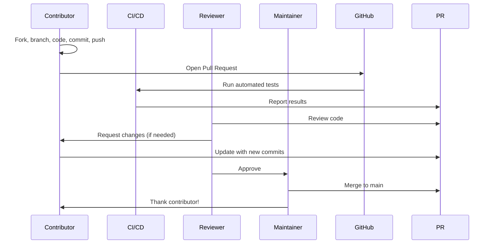
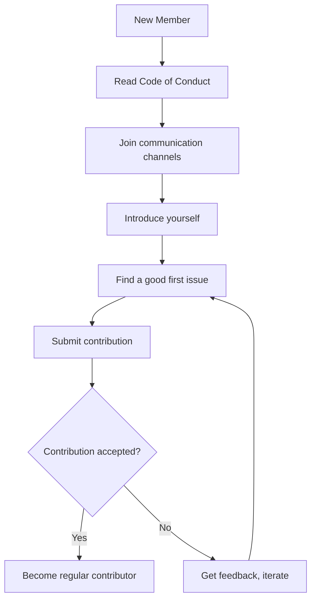

# Getting Started as a Contributor

This guide walks through the process of becoming a contributor to the 01s Sovereign project.

## Prerequisites

- A GitHub account
- Basic familiarity with Git
- Interest in one or more areas of the project

## Step 1: Set Up Your Development Environment

```bash
# Fork and clone the repository
git clone https://github.com/your-username/sovereign-os.git
cd sovereign-os

# Add upstream remote
git remote add upstream https://github.com/Lois-Kleinner/sovereign-os.git

# Set up build dependencies (for ISO building)
sudo pacman -S archiso imagemagick qemu-full
```

## Step 2: Find Something to Work On

### Good First Issues

Look for issues labeled:
- `good first issue` -- Designed for newcomers
- `help wanted` -- Maintainers need assistance
- `documentation` -- Writing and improving docs
- `bug` -- Confirmed bugs needing fixes

### Self-Identified Tasks

Even without an issue, you can:

- Fix typos in documentation
- Improve code comments
- Add test cases
- Refactor small functions
- Update CHANGELOG.md
- Translate documentation

## Step 3: Make Your Changes

```bash
# Create a feature branch
git checkout -b fix/description-of-fix

# Make your changes
# ...

# Test your changes
# For documentation, just review
# For code, build and test

# Commit your changes
git add .
git commit -m "type(scope): Brief description

Longer description of what changed and why.

Closes #123"
```

### Commit Message Format

```
type(scope): Brief description

- type: feat, fix, docs, style, refactor, test, chore
- scope: Component affected (lexer, parser, docs, etc.)
- Description: Imperative mood, no period
- Body: Optional, wrapped at 72 characters
- Footer: References to issues (Closes #123)
```

## Step 4: Submit a Pull Request

```bash
# Push your branch
git push origin fix/description-of-fix
```

Then on GitHub:
1. Go to your fork
2. Click "New pull request"
3. Select your branch
4. Fill out the pull request template
5. Submit

## Step 5: Engage with Reviewers

- Respond to reviewer comments
- Make requested changes
- Keep the discussion focused and constructive
- Be patient (maintainers are volunteers too)

## Contribution Areas

### Documentation

```bash
# Documentation lives in docs/
# Each document has a corresponding .txt version in docs-txt/

# Tutorials: docs/tutorial/
# FAQ: docs/faq/
# Community: docs/community/
# Help: docs/help/
# Incident Reporting: docs/incident-reporting/
```

### Toolchain Code

```bash
# Toolchain source: day-2/toolchain/
├── zerocli/   # CLI tool in Rust
├── lexer/     # Tokenizer in Rust
├── parser/    # Recursive descent parser in Rust
├── codegen/   # x86_64 JIT compiler in Rust
├── runes/     # Glyph system in Rust
└── binary/    # ELF loader in Rust
```

### Build System

```bash
# Build scripts: scripts/
├── build-day1.sh    # ISO build script
├── build-day2.sh    # Toolchain overlay script
├── bundle-extensions.sh  # Extension bundling
├── check-iso.sh     # ISO verification
└── verify-all.sh    # Full verification
```

### Desktop Customization

```bash
# Desktop configs: day-1/iso/profile/airootfs/
├── etc/skel/         # User template files
├── usr/share/        # Shared resources
└── root/             # Root customization
```

## Code Review Process



## Review Checklist for Contributors

### Before Submitting
- [ ] Code compiles without errors
- [ ] Tests pass (when available)
- [ ] Documentation updated
- [ ] CHANGELOG.md updated (if applicable)
- [ ] Commit messages follow conventions
- [ ] Branch is rebased on latest main

### For Documentation PRs
- [ ] Spelling and grammar checked
- [ ] Links are valid
- [ ] Code blocks are syntactically correct
- [ ] Mermaid diagrams render properly
- [ ] Consistent terminology used

## Stay Engaged

After your first contribution:

- Watch the repository for new issues
- Subscribe to discussions
- Join the chat
- Review others' pull requests
- Help answer questions

## Recognition

All contributors are acknowledged in:

- **CONTRIBUTORS.md** (or equivalent)
- **Release notes**
- **Community shoutouts**

We value every contribution, no matter how small.

## Tips for New Contributors

1. **Start small**: Fix a typo or clarify a sentence
2. **Read the style guide**: Consistent formatting is important
3. **Ask questions**: Don't hesitate to ask for clarification
4. **Be patient**: Reviewers are volunteers with limited time
5. **Keep learning**: Each contribution teaches you something new

## Common Mistakes to Avoid

1. **Large PRs**: Break big changes into smaller, focused PRs
2. **No tests**: Add tests for new functionality
3. **Skipping docs**: Update documentation with code changes
4. **Ignoring feedback**: Respond to review comments promptly
5. **Merge conflicts**: Keep your branch up to date

---

## See Also

- [Welcome to the Community](01-welcome-to-the-community.md)
- [Community Governance](03-community-governance.md)
- [Recognition and Rewards](09-recognition-and-rewards.md)

---

## Moderation Guidelines Detail

### Enforcement Process
1. Report received via moderation channel
2. Moderator reviews evidence and context
3. Determines severity level (minor/moderate/severe/critical)
4. Applies appropriate action (warning/mute/ban)
5. Documents the action in moderation log

### Appeals Process
Banned users may appeal after:
- 7 days for temporary bans
- 30 days for permanent bans (first review)
- Appeals are reviewed by a different moderator than the one who issued the ban

## Community Projects and Ecosystem

### Official Projects
- 01s Sovereign OS (this project)
- 01s-ledger (standalone audit tool, usable on other distros)
- zerocli (multi-call binary for system management)
- AI-OSS project (related AI-augmented open-source initiative)

### Community-Led Projects
Community members are encouraged to create:
- Alternative desktop themes
- Plugin extensions for zerocli
- Tutorial translations
- Localization files
- Third-party integrations

## Community Health Report Template
```markdown
# Monthly Community Report: [Month] [Year]
- New GitHub Stars: [count]
- New Contributors: [count]
- ISO Downloads: [count]
- Merged PRs: [count]
- New Issues: [count]
- Community Posts: [count]
- Highlights: [notable events]
- Challenges: [areas needing attention]
```

## Community Onboarding Flow


## Recognition Criteria Examples

### Gold Level (Core Maintainer)
- 6+ months active contribution
- 20+ merged PRs
- Demonstrated leadership in at least one area
- Nominated by existing maintainer
- Approved by TSC vote

### Silver Level (Regular Contributor)
- 3+ months active participation
- 5+ merged PRs
- Active in community discussions
- Helped at least 2 other contributors

### Bronze Level (Repeat Contributor)
- 3+ merged PRs
- Participated in code review
- Active for at least 1 month

---

## Contributor License Agreement (CLA)
By contributing to 01s Sovereign, you agree that:
1. Your contributions are your original work
2. You have the right to submit them
3. Your contributions are licensed under MIT (code) or CC-BY-4.0 (docs)
4. Your contributions may be redistributed under these terms

## Code Review Standards
- All PRs require at least one maintainer review
- Security-critical changes require two reviews
- Documentation changes require technical accuracy review
- UI changes require UX review
- Build/CI changes require build team review

## Community Event Guidelines
- All events follow the Code of Conduct
- Events must be announced at least 2 weeks in advance
- Virtual events are recorded (with permission) and posted publicly
- In-person events require safety protocols
- Event materials must be accessible to all participants

## Communication Channel Guidelines

### GitHub Issues
- For bug reports and feature requests only
- Search before creating a new issue
- Use templates when available
- Respond to questions within 48 hours

### GitHub Discussions
- For Q&A, ideas, and general discussion
- Categorized by topic (Q&A, Ideas, Show and Tell)
- Community members encouraged to answer questions

### Matrix/Discord Chat
- Real-time community interaction
- Follow channel-specific rules
- No spam or self-promotion
- Use appropriate channels for topics

---


---

## Community Resources

### Learning Path
1. Start with the README and documentation
2. Try the live ISO
3. Join community channels
4. Find a good first issue
5. Submit your first contribution

### Mentorship Program
Experienced contributors mentor newcomers through:
- Code review guidance
- Architecture walkthroughs
- Toolchain tutorials
- Community introduction

### Project Roadmap Input
Community members influence the roadmap through:
- Feature requests on GitHub
- RFC discussions
- TSC meeting participation
- Community surveys

### Security Reporting
Report vulnerabilities privately via:
- GitHub Security Advisories
- Email to maintainers
- Encrypted communication preferred

### Code Review Process
1. PR submitted with description
2. Automated CI checks run
3. Maintainer assigned for review
4. Feedback provided within 48 hours
5. Changes made and approved
6. PR merged to main branch

### Release Process
1. Feature freeze announced 2 weeks before
2. Release candidate built and tested
3. Community testing period (1 week)
4. Final release tagged and published
5. ISO built and checksums generated
6. Release notes published
7. Announcement on all channels

### Community Tools Access
| Tool | Access | Purpose |
|------|--------|---------|
| GitHub | All contributors | Code, issues, PRs |
| CI/CD | Maintainers | Build and test |
| Documentation | All contributors | Wiki, guides |
| Chat | All community | Real-time discussion |
| Forum | All community | Long-form discussion |

## Community Metrics (Contributor Program)

| Metric | Value | Target |
|--------|-------|--------|
| First-time Contributors (Last 30 Days) | 42 | 50 |
| Mentor-Mentee Pairs Active | 18 | 25 |
| Average Time to First PR Merge | 12 days | 7 days |
| Stale Issue Rate (>90 days) | 8% | <5% |
| PR Review Turnaround (Median) | 18 hours | 12 hours |
| Documentation PR Rate | 35% of all PRs | 30% |
| Bug Fix PR Rate | 40% of all PRs | 45% |
| Feature PR Rate | 25% of all PRs | 25% |
| Contributor Retention (6-month) | 62% | 75% |
| Good First Issue Claim Rate | 73% | 80% |

## Bug Reporting Workflow

`mermaid
flowchart TD
    A[User Encounters Bug] --> B{Check Known Issues}
    B -->|Already Reported| C[Add Details to Existing Issue]
    B -->|New Bug| D[Collect System Info]
    D --> E[Check Ledger for Context]
    E --> F[Reproduce in Clean Environment]
    F --> G[File GitHub Issue with Template]
    G --> H{Maintainer Triages}
    H --> I[Label: Bug / Priority]
    I --> J[Assign to Contributor or Self-Serve]
    J --> K[Fix Implemented]
    K --> L[PR Submitted]
    L --> M[Review and Merge]
    M --> N[Patch Released]
`

## Related Documents

- [Welcome to the Community](01-welcome-to-the-community.md) — Community overview
- [Community Governance](03-community-governance.md) — How decisions are made
- [Communication Channels](04-communication-channels.md) — Where to get help
- [Reporting Bugs](05-reporting-bugs-and-features.md) — Bug report guidelines
- [Code of Conduct](06-code-of-conduct.md) — Community expectations
- [Community Projects](07-community-projects-and-ecosystem.md) — Ecosystem
- [Localization](08-localization-and-translation.md) — Translation contributions
- [Recognition and Rewards](09-recognition-and-rewards.md) — Getting rewarded
- [Contributing Code](../developers/11-contributing-code.md) — Code guidelines
- [Testing Framework](../developers/12-testing-framework.md) — Testing guide

## Finding Your Niche

Contributors typically find their best fit in one of these areas:

| Area | Skills Needed | Typical Tasks | Entry Point |
|------|--------------|---------------|-------------|
| Documentation | Writing, technical communication | Fix typos, clarify instructions, add examples | Docs SIG |
| Quality Assurance | Testing, attention to detail | Reproduce bugs, write test cases, verify fixes | Bug tracker |
| Desktop | GNOME, GTK, JavaScript | Extensions, themes, GNOME Shell improvements | Desktop SIG |
| Toolchain | Rust, compiler design | Language features, optimizations, bug fixes | Toolchain SIG |
| Security | Cryptography, system hardening | Ledger auditing, security reviews, threat modeling | Security SIG |
| Community | Communication, organization | Events, translation, mentoring, moderation | Community SIG |
| Enterprise | DevOps, deployment | Ansible roles, monitoring, compliance tooling | Enterprise SIG |

## Getting Started with Git

```bash
# Configure Git
git config --global user.name "Your Name"
git config --global user.email "your.email@example.com"
git config --global init.defaultBranch main
git config --global pull.rebase true

# Clone main repository
git clone https://github.com/01s-sovereign/sovereign-os.git
cd sovereign-os

# Create feature branch
git checkout -b my-contribution

# Make changes, then commit
git add .
git commit -m "type(scope): description"

# Push and create PR
git push origin my-contribution
```

## Setting Up Your Development Environment

```bash
# Install dependencies
sudo pacman -S git rust go python base-devel

# Clone all repositories
mkdir ~/01s-workspace
cd ~/01s-workspace
git clone https://github.com/01s-sovereign/sovereign-os.git
git clone https://github.com/01s-sovereign/01s-ledger.git
git clone https://github.com/01s-sovereign/zerocli.git
git clone https://github.com/01s-sovereign/01s-toolchain.git

# Build and test
cd sovereign-os
make build
make test

# Verify setup
01s-ledger --version
zerocli --version
01s-lex --version
```

## Frequently Asked Questions

**Q: How do I get started contributing?** A: The best first step is to join the Matrix community chat and introduce yourself. Then browse issues labeled "good first issue" in any repository. Start with documentation or simple bug fixes before tackling complex features.

**Q: What skills do I need to contribute?** A: Different contribution areas need different skills. Documentation needs writing skills. Code contributions need Rust, Python, or JavaScript. Testing needs patience and attention to detail. Translation needs language fluency. Community needs communication skills.

**Q: How long does it take to get a PR reviewed?** A: Most PRs receive initial review within 48 hours. Simple documentation fixes may be merged within 24 hours. Complex code changes may take 1-2 weeks for thorough review.

**Q: Can I get paid to contribute?** A: Yes! The project has a bounty program for specific tasks. Core Contributors can apply for paid maintenance roles. The project also participates in Google Summer of Code and similar programs.

**Q: How is the project funded?** A: The project is funded through a combination of grants (40%), corporate sponsorships (35%), and community donations (25%). All funding is transparently managed and recorded in the governance ledger.

**Q: Who owns the project?** A: 01s Sovereign is owned by the community. The steering committee oversees the project direction. Intellectual property is held by the 01s Sovereign Foundation, a 501(c)(3) non-profit organization.

**Q: Can I use 01s Sovereign in my company?** A: Yes! 01s Sovereign is GPL-licensed open source. You can use, modify, and distribute it freely. Enterprise support and consulting are available through the enterprise program.

**Q: How do I report a security issue?** A: Please email security@01s.sovereign with PGP encryption. Do not file public GitHub issues for security vulnerabilities. Our security team responds within 24 hours.

## Community Programs

### Mentorship Program
The mentorship program pairs new contributors with experienced maintainers for a 3-month period. Mentors provide guidance on code contributions, code review, project architecture, and community participation. Both the mentor and mentee receive recognition and rewards upon successful completion.

### Internship Program
01s Sovereign participates in internship programs including Google Summer of Code, Outreachy, and MLH Fellowship. Interns work on specific projects with mentorship and receive a stipend. Applications open twice per year.

### Community Events Calendar
- Monthly Community Sync: First Thursday of each month
- SIG Meetings: Various times (see calendar)
- Quarterly Hackathons: Virtual, 48 hours
- Annual Summit: In-person, rotates locations
- Release Parties: After each major release
- Documentation Sprints: Bi-monthly
- Translation Sprints: Quarterly

### Code of Conduct Committee
The Code of Conduct committee consists of 5 members elected by the community. Committee members serve 12-month terms. The committee handles reports, investigations, and enforcement of the Code of Conduct. All proceedings are confidential. The committee reports anonymized statistics quarterly.

## Community Governance Participation

Any community member can participate in governance by:
1. Attending community sync meetings
2. Commenting on RFCs and proposals
3. Voting in steering committee elections (with eligibility)
4. Joining a Special Interest Group
5. Running for steering committee
6. Proposing changes to governance documents
7. Reporting Code of Conduct violations
8. Participating in budget discussions

## Getting Help

If you need help with any aspect of the community or the project:
1. Check the documentation first
2. Search the forum for similar questions
3. Ask in Matrix (#support or #general)
4. File a GitHub issue for bug reports
5. Email conduct@01s.sovereign for conduct issues
6. Email security@01s.sovereign for security issues
7. Email steering@01s.sovereign for governance issues

## Contribution Areas Overview

The project welcomes contributions in many areas beyond code. Here is a comprehensive overview of contribution types:

Documentation: Writing guides, tutorials, API references, FAQ entries. Requires good writing skills and technical accuracy. Entry point: fix typos, clarify confusing sections, add examples.

Code: Writing features, fixing bugs, improving performance in Rust, Python, JavaScript, or Bash. Entry point: issues labeled "good first issue" or "help wanted".

Testing: Reproducing bug reports, writing automated tests, performing regression testing. Entry point: verify unconfirmed bug reports, add test coverage.

Design: Creating icons, themes, wallpapers, logos, and UI mockups. Entry point: improve existing assets, create new theme variants.

Translation: Translating documentation and UI strings into other languages. Requires fluency in target language and English. Entry point: join the localization team for your language.

Community: Helping users, moderating forums, organizing events, onboarding new members. Entry point: answer questions in chat, welcome new members.

Security: Performing security audits, reviewing code for vulnerabilities, threat modeling. Requires security expertise. Entry point: review security SIG reports, contribute findings.

Governance: Participating in RFC discussions, serving on committees, helping shape policy. Entry point: attend sync meetings, comment on proposals.

## Step-by-Step First Contribution

Here is a detailed walkthrough for making your first code contribution:

Week 1: Set up your development environment. Install Git, clone the repository, build the project from source. Run the existing tests to verify your setup works. Join the Matrix chat and introduce yourself in #new-contributors.

Week 2: Find an issue to work on. Look for labels like "good first issue" or "help wanted". Read the issue description and comments. Comment on the issue to express interest and ask clarifying questions.

Week 3: Implement your solution. Create a branch, make your changes, write or update tests. Run the test suite to ensure nothing is broken. Update documentation if your change affects user-facing behavior.

Week 4: Submit your pull request. Write a clear PR description explaining what your change does and why. Reference the issue number. Respond to reviewer feedback promptly. Make requested changes.

Week 5: Your PR is merged! Celebrate your first contribution. You will receive a Contributor badge and be added to the contributors list. Consider your next contribution.

## Tools and Resources

Development Tools: Git for version control, Rust and Python for development, VS Code or GNOME Builder as IDE, Docker for containerized testing, QEMU for virtual machine testing.

Communication: Matrix for real-time chat, Forum for long-form discussion, GitHub for code collaboration, Mailing list for announcements, Video calls for meetings and sync.

Documentation: Developer guide for coding standards, API reference for libraries, Architecture overview for system design, Testing guide for test procedures, CI/CD reference for build pipeline.

Community Resources: Mentorship program for pairing with experienced contributors, Office hours for direct access to maintainers, Knowledge base for common solutions, Workshops for skill development, Hackathons for focused collaboration.

## Project Leadership

The project is led by a steering committee of 12 elected members. Committee members serve 2-year terms with staggered elections. The committee oversees project direction, budget allocation, and governance changes. Day-to-day decisions are made by the relevant SIG leads. Maintainers have merge access to specific repositories. Core Contributors have demonstrated sustained contribution and can vote in committee elections.

Current SIGs: Security, Desktop, Toolchain, Documentation, Community, Enterprise. Each SIG has a lead and co-lead elected by SIG members. SIGs meet weekly or bi-weekly and report to the steering committee monthly.

## Recognition Program

All contributors are recognized through our tiered recognition program:

Contributor: 1 or more contributions. Receives a badge and Discord role.
Active Contributor: 10 or more contributions. Receives a sticker pack and voting rights.
Core Contributor: 50 or more contributions plus nomination. Receives a T-shirt, travel stipend, and maintainer eligibility.
Maintainer: Appointment by steering committee. Receives a hoodie, merge access, and decision vote.

Additional recognition is available for translators, documentation contributors, bug reporters, and mentors through specialized badges and rewards. The full recognition program is documented in the Recognition and Rewards guide.

## Extended Community Resources

The 01s Sovereign community maintains an extensive collection of resources to help members at every level:

Knowledge Base: A searchable collection of solutions to common problems, curated from forum posts and chat discussions. The knowledge base is community-edited and covers installation, configuration, troubleshooting, and development topics.

Tutorial Library: Step-by-step guides for common tasks organized by experience level. Beginner tutorials cover installation and basic configuration. Intermediate tutorials cover development setup and customization. Advanced tutorials cover toolchain development and security hardening.

Video Library: Recorded presentations from community syncs, SIG meetings, and conference talks organized into playlists by topic. New videos are added weekly.

Template Library: Reusable templates for bug reports, feature requests, RFC documents, and project proposals. Using templates ensures consistent formatting and complete information.

Tool Library: Community-contributed scripts and tools for automation, monitoring, and integration. Tools are categorized by function and tested for compatibility with the current release.

API Reference: Comprehensive documentation for all public APIs including the ledger SDK, zerocli plugin API, and toolchain extension points. The API reference is generated from source code documentation.

Release Notes: Detailed changelogs for each release including new features, bug fixes, known issues, and upgrade instructions. Release notes are published on the website and announced through all channels.

Community Blog: Stories from community members about their experiences with 01s Sovereign. Blog posts cover use cases, tutorials, project highlights, and community news. Contributions are welcome through the community blog repository.

## Getting Involved Quickly

If you want to get involved in the community quickly, here are the fastest paths:

Quick Start: Join Matrix chat, introduce yourself, and ask a question. This takes 5 minutes and gets you connected.

First Contribution: Find a documentation typo, fix it, and submit a PR. This takes 15-30 minutes and gives you your first merged contribution.

Bug Confirmation: Find an unconfirmed bug report, reproduce it, and add your findings. This takes 30-60 minutes and helps the development team.

Community Support: Answer a question in the forum or chat that you know the answer to. This takes 5-15 minutes and helps other users.

Translation: Translate a UI string in your language on Crowdin. This takes 2-5 minutes and improves accessibility.

Feature Feedback: Comment on an RFC or feature request with your use case. This takes 10-15 minutes and shapes the project direction.

Event Participation: Attend the next community sync meeting. This takes 60 minutes and connects you with the team.

## Staying Updated

To stay informed about project developments:

Subscribe to the monthly newsletter at newsletter.01s.sovereign.
Watch the GitHub repository for notifications.
Join the #announcements Matrix channel (read only).
Follow @01sSovereign on Twitter or Mastodon.
Check the blog at blog.01s.sovereign weekly.
Attend the monthly community sync.
Read the quarterly state of the project report.
Review the changelog when new releases are announced.

## First Contribution Examples by Type

Documentation: Fix a broken link in a tutorial. Add an example to an API reference. Clarify a confusing installation step. Translate a document to your language. These contributions are the easiest to start with.

Code: Fix a compiler warning. Add a unit test. Improve error messages. Optimize a slow code path. These contributions require programming knowledge but can be small in scope.

Testing: Reproduce an unconfirmed bug report. Write a regression test. Verify a fix in a release candidate. Test on hardware not in the official test matrix.

Design: Create a new wallpaper. Improve an icon. Design a sticker. Create a theme. These contributions require design skills but no programming.

Community: Welcome new members in chat. Answer questions in the forum. Organize a local meetup. Create a tutorial video. These contributions require communication skills.

Translation: Translate UI strings in Crowdin. Review translations by others. Maintain the glossary for your language. Coordinate translation efforts.

Security: Review code for vulnerabilities. Test security features. Write security documentation. Participate in threat modeling sessions.

---

Lois-Kleinner and 0-1.gg 2026 Copyright

```
.====================================================================.
!  Made in the UAE, Dubai #DubaiIt #Dubai #Dxb #SovereignAI          !
!  Made in The Emirates #Dubai_it                                    !
!                                                                    !
!  Lois-Kleinner Alpasan - The Anticloud 2026-                       !
!                                                                    !
!  0-1.gg ! GitHub ! LinkedIn ! DEV ! GH Pages                       !
!  HuggingFace ! Blog ! Tumblr ! Fandom ! Bluesky ! Mastodon          !
!  Zenodo ! Harvard Dataverse ! Internet Archive ! ORCID              !
!                                                                    !
!  Sovereign AI ! Local-First ! Privacy ! Zero Trust ! No Datacenter !
!  Air-Gapped ! Open Source ! Rust ! Hash Chain ! Single Binary      !
!  Offline LLM ! Crypto Ledger ! P2P ! Federated                     !
'===================================================================='
```

Lois-Kleinner Alpasan, 22, builds sovereign AI infrastructure and cryptographic audit systems. His work spans formats, proptech, and research platforms serving projects valued at over $1B combined, operating at the intersection of AI, media, and decentralized technology.

References:
1. Lois-Kleinner Zenodo: https://doi.org/10.5281/zenodo.20781790
2. Lois-Kleinner GitHub: https://github.com/kleinnner/Anticloud/tree/main/04-aioss-format
3. Lois-Kleinner Harvard DV: https://doi.org/10.7910/DVN/GDLO0L
4. Lois-Kleinner Internet Arc: https://archive.org/details/aioss-format
5. Lois-Kleinner ORCID: https://orcid.org/0009-0009-2233-6107
6. Lois-Kleinner DEV.to: https://dev.to/kleinner
7. Lois-Kleinner LinkedIn: https://linkedin.com/in/kleinner
8. Lois-Kleinner HuggingFace: https://huggingface.co/Anticloud
9. Lois-Kleinner Tumblr: https://anticloud.tumblr.com
10. Lois-Kleinner Mastodon: https://mastodon.social/@kleinner
11. Lois-Kleinner Bluesky: https://bsky.app/profile/kleinner.bsky.social
12. 0-1.gg: https://0-1.gg
