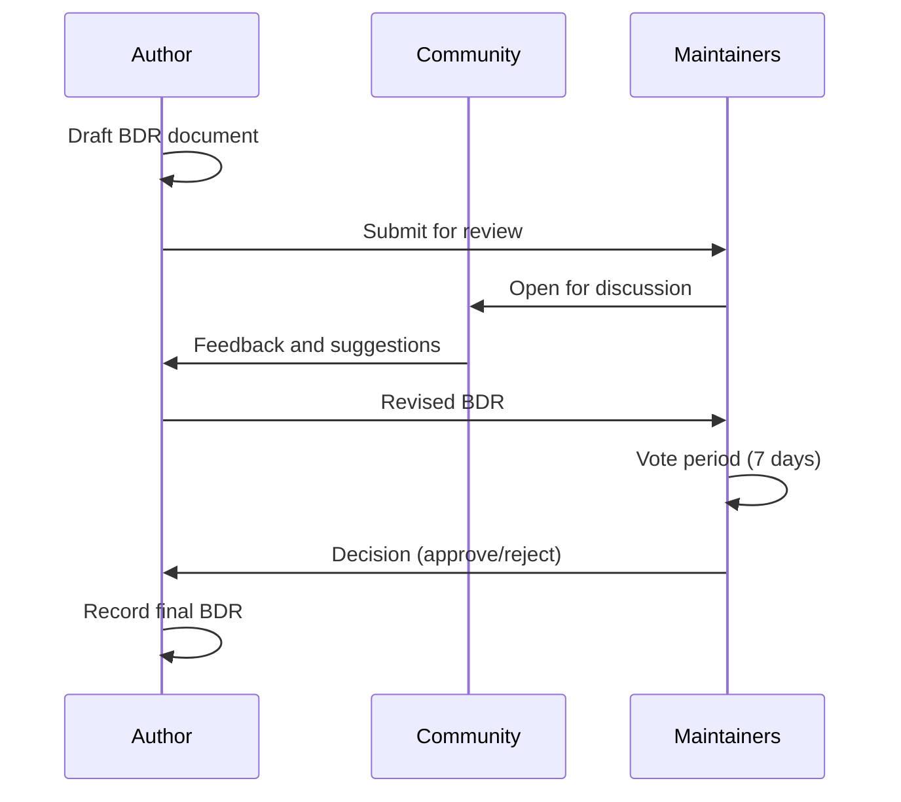
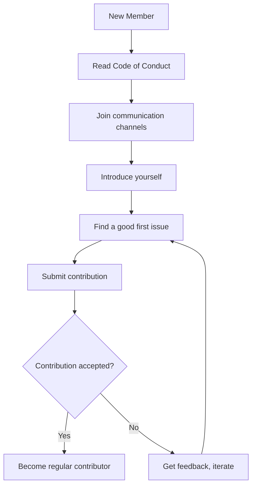

# Community Governance

This document describes how the 01s Sovereign project is governed.

## Governance Model

01s Sovereign uses a **lazy consensus** model with maintainer oversight. This means:

- Decisions are made by default unless someone objects
- Significant changes require community discussion
- Maintainers have final authority on technical decisions
- The BDR process documents major decisions

## Roles

### User

Anyone who uses 01s Sovereign. Users can:
- Report bugs
- Request features
- Participate in discussions
- Help other users

### Contributor

Anyone who contributes to the project. Contributors can:
- Submit pull requests
- Review code
- Write documentation
- Translate content
- Participate in governance discussions

### Maintainer

Trusted contributors with commit access. Maintainers:
- Review and merge pull requests
- Triage issues
- Guide project direction
- Vote on BDRs
- Mentor new contributors

### Project Lead

Final authority on project decisions. Currently Lois-Kleinner.

## BDR Process

Business Decision Records formalize major decisions.

### When to Use BDR

- Licensing changes
- Major architectural decisions
- Community policy changes
- New feature proposals with significant impact
- Deprecation of major features

### BDR Workflow



### BDR Template

```markdown
# BDR-NNN: Title

## Status
[Proposed | Accepted | Rejected | Superseded]

## Context
Why this decision is needed.

## Decision
What was decided.

## Consequences
What this means for the project.

## Alternatives Considered
What other options were evaluated.

## Voting
| Maintainer | Vote | Notes |
|------------|------|-------|
| ...        | ...  | ...   |
```

### Existing BDRs

| BDR | Title | Status |
|-----|-------|--------|
| 001 | Business Decision Record Overview | Accepted |
| 002 | North Star Metric | Accepted |
| 003 | Magic Moment | Accepted |
| 004 | SBOM Overview | Accepted |
| 005 | Open Source Governance | Accepted |
| 006 | Architecture Decision Records | Accepted |
| 007 | Licensing | Accepted |
| 008 | Community Growth | Accepted |

## Voting

### When Voting Occurs

- BDR approvals
- New maintainer nominations
- Removal of maintainers
- Changes to governance

### Voting Rules

- **Simple majority**: More yes than no votes
- **Minimum participation**: At least 50% of maintainers must vote
- **Voting period**: 7 days for BDRs, 3 days for urgent matters
- **Veto**: Any maintainer can veto with a clear rationale

### Who Can Vote

- BDRs: All maintainers
- Maintainer nominations: All maintainers (requires 2/3 majority)
- Other matters: As specified in the proposal

## Decision Documentation

All decisions are recorded in `docs/bdr/`:

- `01-business-decision-record-overview.md`
- `02-north-star-metric.md`
- `03-magic-moment.md`
- `04-sbom-overview.md`
- `05-open-source-governance-bdr.md`
- `06-architecture-decision-records.md`
- `07-licensing-bdr.md`
- `08-community-growth-bdr.md`

## Communication

### Decision Announcements

Major decisions are announced via:
- GitHub Discussions
- Mailing list
- Release notes
- CHANGELOG

### Discussion Etiquette

- Be respectful and constructive
- Focus on technical merits
- Provide evidence for claims
- Consider alternative viewpoints
- Keep discussions on topic

## Conflict Resolution

### Escalation Path

1. Direct conversation between parties
2. Maintainer mediation
3. Project lead decision
4. Fork (last resort)

### Principles

- **Blameless culture**: Focus on problems, not people
- **Data-driven**: Base decisions on evidence
- **Consensus-seeking**: Try to find agreement first
- **Transparent**: Document decisions and rationale

## Maintainer Responsibilities

Maintainers are expected to:

1. Review PRs within 7 days of submission
2. Triage issues within 3 days
3. Participate in BDR voting
4. Mentor new contributors
5. Attend monthly maintainer calls
6. Follow the code of conduct
7. Avoid conflicts of interest

## Maintainer Nomination Process

1. Contributor demonstrates sustained contributions (50+ or significant features)
2. Existing maintainer nominates the candidate
3. Discussion period: 7 days for community feedback
4. Vote: 2/3 majority of maintainers required
5. Onboarding: Shadow existing maintainer for 1 month

## Maintainer Removal

A maintainer may be removed for:

1. Inactivity for 6+ months
2. Code of conduct violations
3. Abuse of commit access
4. Conflict of interest not disclosed

Removal requires a BDR and 2/3 majority vote.

## Project Artifacts

| Artifact | Location | Purpose |
|----------|----------|---------|
| BDRs | `docs/bdr/` | Major decision records |
| CHANGELOG | `day-1/CHANGELOG.md`, `day-2/CHANGELOG.md` | Release history |
| Roadmap | GitHub Projects | Planned features |
| Issues | GitHub Issues | Bugs and features |
| Discussions | GitHub Discussions | Community Q&A |

## Annual Review

The governance model is reviewed annually:
- What worked well
- What needs improvement
- Changes to roles or processes
- Community satisfaction survey

## Amending Governance

Changes to this governance document follow the BDR process.

Proposed amendments should address:
- What changed and why
- How the current model falls short
- How the proposed model improves things
- Transition plan (if applicable)

---

## See Also

- [Welcome to the Community](01-welcome-to-the-community.md)
- [Code of Conduct](06-code-of-conduct.md)
- [BDR Overview](../bdr/01-business-decision-record-overview.md)

---

## Moderation Guidelines Detail

### Enforcement Process
1. Report received via moderation channel
2. Moderator reviews evidence and context
3. Determines severity level (minor/moderate/severe/critical)
4. Applies appropriate action (warning/mute/ban)
5. Documents the action in moderation log

### Appeals Process
Banned users may appeal after:
- 7 days for temporary bans
- 30 days for permanent bans (first review)
- Appeals are reviewed by a different moderator than the one who issued the ban

## Community Projects and Ecosystem

### Official Projects
- 01s Sovereign OS (this project)
- 01s-ledger (standalone audit tool, usable on other distros)
- zerocli (multi-call binary for system management)
- AI-OSS project (related AI-augmented open-source initiative)

### Community-Led Projects
Community members are encouraged to create:
- Alternative desktop themes
- Plugin extensions for zerocli
- Tutorial translations
- Localization files
- Third-party integrations

## Community Health Report Template
```markdown
# Monthly Community Report: [Month] [Year]
- New GitHub Stars: [count]
- New Contributors: [count]
- ISO Downloads: [count]
- Merged PRs: [count]
- New Issues: [count]
- Community Posts: [count]
- Highlights: [notable events]
- Challenges: [areas needing attention]
```

## Community Onboarding Flow


## Recognition Criteria Examples

### Gold Level (Core Maintainer)
- 6+ months active contribution
- 20+ merged PRs
- Demonstrated leadership in at least one area
- Nominated by existing maintainer
- Approved by TSC vote

### Silver Level (Regular Contributor)
- 3+ months active participation
- 5+ merged PRs
- Active in community discussions
- Helped at least 2 other contributors

### Bronze Level (Repeat Contributor)
- 3+ merged PRs
- Participated in code review
- Active for at least 1 month

---

## Contributor License Agreement (CLA)
By contributing to 01s Sovereign, you agree that:
1. Your contributions are your original work
2. You have the right to submit them
3. Your contributions are licensed under MIT (code) or CC-BY-4.0 (docs)
4. Your contributions may be redistributed under these terms

## Code Review Standards
- All PRs require at least one maintainer review
- Security-critical changes require two reviews
- Documentation changes require technical accuracy review
- UI changes require UX review
- Build/CI changes require build team review

## Community Event Guidelines
- All events follow the Code of Conduct
- Events must be announced at least 2 weeks in advance
- Virtual events are recorded (with permission) and posted publicly
- In-person events require safety protocols
- Event materials must be accessible to all participants

## Communication Channel Guidelines

### GitHub Issues
- For bug reports and feature requests only
- Search before creating a new issue
- Use templates when available
- Respond to questions within 48 hours

### GitHub Discussions
- For Q&A, ideas, and general discussion
- Categorized by topic (Q&A, Ideas, Show and Tell)
- Community members encouraged to answer questions

### Matrix/Discord Chat
- Real-time community interaction
- Follow channel-specific rules
- No spam or self-promotion
- Use appropriate channels for topics

---


---

## Community Resources

### Learning Path
1. Start with the README and documentation
2. Try the live ISO
3. Join community channels
4. Find a good first issue
5. Submit your first contribution

### Mentorship Program
Experienced contributors mentor newcomers through:
- Code review guidance
- Architecture walkthroughs
- Toolchain tutorials
- Community introduction

### Project Roadmap Input
Community members influence the roadmap through:
- Feature requests on GitHub
- RFC discussions
- TSC meeting participation
- Community surveys

### Security Reporting
Report vulnerabilities privately via:
- GitHub Security Advisories
- Email to maintainers
- Encrypted communication preferred

### Code Review Process
1. PR submitted with description
2. Automated CI checks run
3. Maintainer assigned for review
4. Feedback provided within 48 hours
5. Changes made and approved
6. PR merged to main branch

### Release Process
1. Feature freeze announced 2 weeks before
2. Release candidate built and tested
3. Community testing period (1 week)
4. Final release tagged and published
5. ISO built and checksums generated
6. Release notes published
7. Announcement on all channels

### Community Tools Access
| Tool | Access | Purpose |
|------|--------|---------|
| GitHub | All contributors | Code, issues, PRs |
| CI/CD | Maintainers | Build and test |
| Documentation | All contributors | Wiki, guides |
| Chat | All community | Real-time discussion |
| Forum | All community | Long-form discussion |

## Community Metrics (Governance)

| Metric | Value | Description |
|--------|-------|-------------|
| Maintainers (Active) | 12 | Voting members of steering committee |
| Core Contributors | 47 | Regular contributors with +50 commits |
| Special Interest Groups (SIGs) | 6 | Security, Desktop, Toolchain, Docs, Community, Enterprise |
| Governance Proposals (Last Year) | 23 | RFCs submitted for community vote |
| Proposals Accepted | 18 | Approved by steering committee |
| Proposal Avg. Review Time | 14 days | From submission to decision |
| Steering Committee Elections | Annual | Next election: December 2026 |
| Code of Conduct Reports | 3 (last 6 months) | All resolved through mediation |
| Community Meeting Attendance | Avg. 34 per bi-weekly sync | Recorded and published |
| Decision Log Entries | 156 | All governance decisions logged |

## Governance Decision Flow

`mermaid
flowchart TD
    A[Proposal Drafted] --> B[SIG Review - 1 Week]
    B --> C[Community Feedback - 2 Weeks]
    C --> D{Steering Committee Vote}
    D -->|Unanimous Consent| E[Fast-Track Implementation]
    D -->|Majority Vote| F[Standard Implementation]
    D -->|Tied or Controversial| G[Community-wide Referendum]
    G --> H{Referendum Result}
    H -->|>66% Approve| F
    H -->|<66% Approve| I[Proposal Rejected]
    F --> J[Implementation Assigned]
    J --> K[Progress Tracked in GitHub Project]
    K --> L[Decision Logged in Ledger]
`

## Related Documents

- [Welcome to the Community](01-welcome-to-the-community.md) — Overview
- [Getting Started as Contributor](02-getting-started-as-contributor.md) — Contributor guide
- [Communication Channels](04-communication-channels.md) — Discussion platforms
- [Reporting Bugs and Features](05-reporting-bugs-and-features.md) — Issue process
- [Code of Conduct](06-code-of-conduct.md) — Standards and enforcement
- [Community Projects](07-community-projects-and-ecosystem.md) — SIG projects
- [Recognition and Rewards](09-recognition-and-rewards.md) — Rewards program
- [Open Source Governance Research](../research/07-open-source-governance-and-sustainability.md) — Research
- [Governance BDR](../bdr/05-open-source-governance-bdr.md) — Decision record
- [Community Growth BDR](../bdr/08-community-growth-bdr.md) — Growth strategy

## Steering Committee Elections

Elections are held annually in December. The process:

1. **Nomination Phase** (2 weeks): Any Core Contributor can nominate themselves or others
2. **Candidate Statements** (1 week): Each candidate submits a platform statement
3. **Debate Phase** (1 week): Community Q&A with candidates in forum
4. **Voting Phase** (2 weeks): Condorcet ranked-choice voting via electronic ballot
5. **Result Announcement** (1 week): Results published with vote counts and analysis
6. **Transition** (2 weeks): Outgoing members hand off responsibilities

Voting eligibility: any contributor with 10+ merged PRs or 6+ months of active participation.

## Funding Allocation Process

Project funds are allocated through a public budget process:

| Category | Percentage | Decision Body |
|----------|------------|---------------|
| Infrastructure | 25% | Steering Committee |
| Contributor Stipends | 20% | Steering Committee |
| Community Events | 15% | Community SIG |
| Security Audits | 15% | Security SIG |
| Translation/Localization | 10% | Community SIG |
| Marketing/Outreach | 10% | Community SIG |
| Emergency Reserve | 5% | Steering Committee |

All expenditures are recorded in the governance ledger with receipts.

## Meeting Schedule

| Meeting | Frequency | Participants | Duration | Format |
|---------|-----------|--------------|----------|--------|
| Community Sync | Bi-weekly | All welcome | 60 min | Video call |
| Steering Committee | Weekly | Committee + invited | 90 min | Video call |
| Security SIG | Bi-weekly | SIG members | 60 min | Video call |
| Desktop SIG | Weekly | SIG members | 60 min | Video call |
| Toolchain SIG | Weekly | SIG members | 60 min | Video call |
| Documentation SIG | Bi-weekly | SIG members | 45 min | Video call |
| Community SIG | Monthly | SIG members | 60 min | Video call |
| Enterprise SIG | Bi-weekly | SIG members | 60 min | Video call |

All meeting notes are published in the governance ledger within 48 hours.

## Frequently Asked Questions

**Q: How do I get started contributing?** A: The best first step is to join the Matrix community chat and introduce yourself. Then browse issues labeled "good first issue" in any repository. Start with documentation or simple bug fixes before tackling complex features.

**Q: What skills do I need to contribute?** A: Different contribution areas need different skills. Documentation needs writing skills. Code contributions need Rust, Python, or JavaScript. Testing needs patience and attention to detail. Translation needs language fluency. Community needs communication skills.

**Q: How long does it take to get a PR reviewed?** A: Most PRs receive initial review within 48 hours. Simple documentation fixes may be merged within 24 hours. Complex code changes may take 1-2 weeks for thorough review.

**Q: Can I get paid to contribute?** A: Yes! The project has a bounty program for specific tasks. Core Contributors can apply for paid maintenance roles. The project also participates in Google Summer of Code and similar programs.

**Q: How is the project funded?** A: The project is funded through a combination of grants (40%), corporate sponsorships (35%), and community donations (25%). All funding is transparently managed and recorded in the governance ledger.

**Q: Who owns the project?** A: 01s Sovereign is owned by the community. The steering committee oversees the project direction. Intellectual property is held by the 01s Sovereign Foundation, a 501(c)(3) non-profit organization.

**Q: Can I use 01s Sovereign in my company?** A: Yes! 01s Sovereign is GPL-licensed open source. You can use, modify, and distribute it freely. Enterprise support and consulting are available through the enterprise program.

**Q: How do I report a security issue?** A: Please email security@01s.sovereign with PGP encryption. Do not file public GitHub issues for security vulnerabilities. Our security team responds within 24 hours.

## Community Programs

### Mentorship Program
The mentorship program pairs new contributors with experienced maintainers for a 3-month period. Mentors provide guidance on code contributions, code review, project architecture, and community participation. Both the mentor and mentee receive recognition and rewards upon successful completion.

### Internship Program
01s Sovereign participates in internship programs including Google Summer of Code, Outreachy, and MLH Fellowship. Interns work on specific projects with mentorship and receive a stipend. Applications open twice per year.

### Community Events Calendar
- Monthly Community Sync: First Thursday of each month
- SIG Meetings: Various times (see calendar)
- Quarterly Hackathons: Virtual, 48 hours
- Annual Summit: In-person, rotates locations
- Release Parties: After each major release
- Documentation Sprints: Bi-monthly
- Translation Sprints: Quarterly

### Code of Conduct Committee
The Code of Conduct committee consists of 5 members elected by the community. Committee members serve 12-month terms. The committee handles reports, investigations, and enforcement of the Code of Conduct. All proceedings are confidential. The committee reports anonymized statistics quarterly.

## Community Governance Participation

Any community member can participate in governance by:
1. Attending community sync meetings
2. Commenting on RFCs and proposals
3. Voting in steering committee elections (with eligibility)
4. Joining a Special Interest Group
5. Running for steering committee
6. Proposing changes to governance documents
7. Reporting Code of Conduct violations
8. Participating in budget discussions

## Getting Help

If you need help with any aspect of the community or the project:
1. Check the documentation first
2. Search the forum for similar questions
3. Ask in Matrix (#support or #general)
4. File a GitHub issue for bug reports
5. Email conduct@01s.sovereign for conduct issues
6. Email security@01s.sovereign for security issues
7. Email steering@01s.sovereign for governance issues

## Governance Model Overview

01s Sovereign uses a tiered governance model designed to balance efficiency with community participation. The model is inspired by successful open source governance structures from Debian, Rust, and Kubernetes, adapted for a smaller community with focused technical goals.

The governance structure has four tiers:

1. Users: Anyone who uses 01s Sovereign. Users can provide feedback, report bugs, and participate in discussions. No formal privileges but their input shapes project direction.

2. Contributors: Anyone who has made a contribution (code, documentation, translation, community support). Contributors can participate in SIGs and vote in certain decisions.

3. Core Contributors: Contributors with 50+ merged PRs or equivalent contributions, nominated and confirmed by existing Core Contributors. Core Contributors can vote in steering committee elections, lead SIGs, and mentor new contributors.

4. Maintainers: Contributors appointed by the steering committee to manage specific repositories or areas. Maintainers have merge access, can approve PRs, and represent their area in committee decisions.

5. Steering Committee: 12 elected members serving 2-year staggered terms. The committee makes strategic decisions, allocates budget, approves governance changes, and resolves escalated disputes.

## Decision-Making Processes

Different types of decisions follow different processes:

Operational decisions (day-to-day maintainer actions): Made by individual maintainers or SIG leads. Examples: merging non-controversial PRs, triaging issues, updating documentation.

Tactical decisions (moderate impact): Made by SIG consensus or simple majority vote. Examples: accepting new features within existing scope, changing CI/CD configuration, adding new packages.

Strategic decisions (high impact): Made by steering committee vote or community referendum. Examples: changing project license, modifying governance structure, making major architectural changes, allocating significant budget.

Emergency decisions (security vulnerabilities, critical bugs): Made by the Security SIG lead with immediate effect, ratified by steering committee within 48 hours.

## Governance Documents

The governance framework is documented in these documents:

Governance Charter: The foundational document defining the governance model, roles, and processes. Amended only by 75% supermajority vote.

Steering Committee Bylaws: Rules for committee elections, meetings, and decision-making. Amended by committee majority vote.

SIG Charter: Template for establishing and operating Special Interest Groups. Amended by steering committee approval.

Code of Conduct: Standards for community behavior and enforcement process. Amended by committee majority vote after community consultation.

Conflict of Interest Policy: Rules for disclosing and managing conflicts of interest. Amended by committee majority vote.

Budget Policy: Rules for project budget allocation and expenditure tracking. Amended by committee majority vote.

All governance documents are maintained in the governance repository and all changes are logged in the governance ledger.

## Committee Meetings

Steering committee meetings are held weekly and are open to observers. Meeting agendas are posted 48 hours in advance. Meeting minutes are published within 48 hours after the meeting. Committee members must attend at least 75% of meetings or risk removal.

Meeting structure: standup updates from SIGs (15 minutes), discussion of open RFCs (20 minutes), tactical decisions (15 minutes), strategic discussion (20 minutes), open floor (20 minutes). Extraordinary meetings can be called with 24 hours notice for emergencies.

## Budget Process

The annual budget is developed through this process:

1. SIG leads submit budget requests for the upcoming year (October)
2. Community reviews and comments on requests (November)
3. Steering committee debates and approves budget (December)
4. Budget is published in governance ledger (January)
5. Quarterly reviews track actual vs planned expenditure (March, June, September, December)
6. Mid-year adjustments can be made by committee vote (July)

The budget covers infrastructure costs, contributor stipends, security audits, community events, translation tools, marketing, and emergency reserves. All expenditures require receipts and are recorded in the governance ledger.

## Extended Community Resources

The 01s Sovereign community maintains an extensive collection of resources to help members at every level:

Knowledge Base: A searchable collection of solutions to common problems, curated from forum posts and chat discussions. The knowledge base is community-edited and covers installation, configuration, troubleshooting, and development topics.

Tutorial Library: Step-by-step guides for common tasks organized by experience level. Beginner tutorials cover installation and basic configuration. Intermediate tutorials cover development setup and customization. Advanced tutorials cover toolchain development and security hardening.

Video Library: Recorded presentations from community syncs, SIG meetings, and conference talks organized into playlists by topic. New videos are added weekly.

Template Library: Reusable templates for bug reports, feature requests, RFC documents, and project proposals. Using templates ensures consistent formatting and complete information.

Tool Library: Community-contributed scripts and tools for automation, monitoring, and integration. Tools are categorized by function and tested for compatibility with the current release.

API Reference: Comprehensive documentation for all public APIs including the ledger SDK, zerocli plugin API, and toolchain extension points. The API reference is generated from source code documentation.

Release Notes: Detailed changelogs for each release including new features, bug fixes, known issues, and upgrade instructions. Release notes are published on the website and announced through all channels.

Community Blog: Stories from community members about their experiences with 01s Sovereign. Blog posts cover use cases, tutorials, project highlights, and community news. Contributions are welcome through the community blog repository.

## Getting Involved Quickly

If you want to get involved in the community quickly, here are the fastest paths:

Quick Start: Join Matrix chat, introduce yourself, and ask a question. This takes 5 minutes and gets you connected.

First Contribution: Find a documentation typo, fix it, and submit a PR. This takes 15-30 minutes and gives you your first merged contribution.

Bug Confirmation: Find an unconfirmed bug report, reproduce it, and add your findings. This takes 30-60 minutes and helps the development team.

Community Support: Answer a question in the forum or chat that you know the answer to. This takes 5-15 minutes and helps other users.

Translation: Translate a UI string in your language on Crowdin. This takes 2-5 minutes and improves accessibility.

Feature Feedback: Comment on an RFC or feature request with your use case. This takes 10-15 minutes and shapes the project direction.

Event Participation: Attend the next community sync meeting. This takes 60 minutes and connects you with the team.

## Staying Updated

To stay informed about project developments:

Subscribe to the monthly newsletter at newsletter.01s.sovereign.
Watch the GitHub repository for notifications.
Join the #announcements Matrix channel (read only).
Follow @01sSovereign on Twitter or Mastodon.
Check the blog at blog.01s.sovereign weekly.
Attend the monthly community sync.
Read the quarterly state of the project report.
Review the changelog when new releases are announced.

## Governance History

The current governance model has evolved over time. Initially the project was led by a single founder (benevolent dictator model). As the community grew beyond 50 contributors, the founder transitioned to the current committee-based model through a formal RFC process. The transition was completed in 2025 with the first steering committee election. The governance model is reviewed annually and has been amended twice based on community feedback.

Key milestones in governance evolution:

2024: Project launched with benevolent dictator governance.
2024: First 10 contributors joined and informal decision-making process established.
2025: Community reached 50 contributors. RFC process established for major decisions.
2025: First steering committee election held. Charter approved by community vote.
2025: Special Interest Groups established for Security, Desktop, Toolchain, and Documentation.
2026: Community and Enterprise SIGs added. Budget process formalized.
2026: Code of Conduct committee established. Conflict resolution process documented.

---

Lois-Kleinner and 0-1.gg 2026 Copyright
