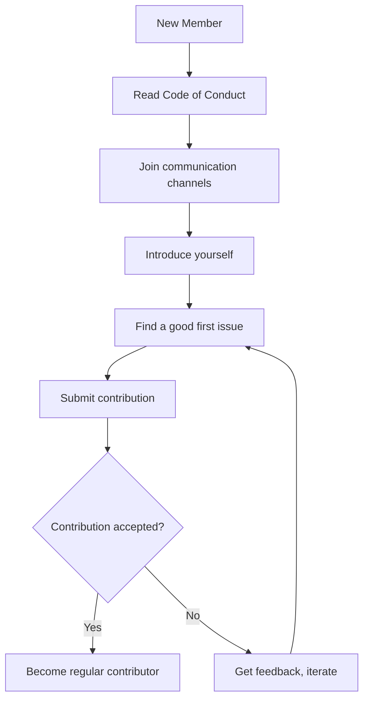

# Communication Channels

This document lists the official communication channels for the 01s Sovereign community.

## Primary Channels

### GitHub

| Feature | URL | Purpose |
|---------|-----|---------|
| **Repository** | `https://github.com/Lois-Kleinner/sovereign-os` | Source code, issues, PRs |
| **Issues** | GitHub Issues tab | Bug reports, feature requests |
| **Discussions** | GitHub Discussions tab | Q&A, ideas, announcements |
| **Projects** | GitHub Projects tab | Roadmap and task tracking |
| **Wiki** | GitHub Wiki tab | Extended documentation |

### Matrix Chat

Real-time chat for community discussion:

```
Room: #01s-sovereign:matrix.org
Server: matrix.org
```

Matrix is recommended for:
- Quick questions
- Real-time discussion
- Development coordination
- Community socialization

**Room Etiquette:**
- Introduce yourself when joining
- Stay on topic in threads
- Use `/topic` to set current discussion topic
- Use threads for extended conversations
- No spamming or self-promotion

**Rooms:**
| Room | Purpose |
|------|---------|
| `#01s-sovereign:matrix.org` | General discussion |
| `#01s-sovereign-dev:matrix.org` | Development coordination |
| `#01s-sovereign-announce:matrix.org` | Announcements (read-only) |
| `#01s-sovereign-offtopic:matrix.org` | Off-topic social chat |

### Mailing List

For longer-form technical discussion:

```
List: 01s-sovereign@lists.0-1.gg
Subscribe: Send email to 01s-sovereign+subscribe@lists.0-1.gg
```

The mailing list is appropriate for:
- Design discussions
- RFC-style proposals
- Detailed technical debate
- Monthly updates

**List Guidelines:**
- Use descriptive subject lines
- Reply inline when quoting
- Trim quoted text to relevant portions
- Don't top-post
- Wait 24h before replying to give timezone coverage

## Social Media

### Project Accounts

- **X/Twitter**: @0_1_gg
- **Mastodon**: @01s@fosstodon.org
- **LinkedIn**: 0-1.gg company page
- **YouTube**: 0-1.gg channel (tutorials, demos)
- **Discord**: Community server (link available on request)

### Mastodon Details

The official Mastodon account is **@01s@fosstodon.org** on the fosstodon.org instance. This account posts:
- Release announcements
- Development updates
- Community highlights
- Related news and articles

To follow on Mastodon:
1. Search for `@01s@fosstodon.org` in your Mastodon client
2. Click Follow
3. Use hashtag `#01sSovereign` for community posts

### Hashtags

Use these hashtags for community posts:

- `#01sSovereign`
- `#KaimanOS`
- `#SovereignComputing`
- `#01sLedger`

## Community Etiquette

### When Asking Questions

1. **Search first**: Check docs, issues, and discussions
2. **Provide context**: System info, version, steps taken
3. **Be specific**: What did you expect vs. what happened
4. **Include logs**: Relevant output from commands

### When Answering Questions

1. **Be helpful**: Assume good faith
2. **Be clear**: Explain the reasoning, not just the solution
3. **Be patient**: Not everyone has the same experience level
4. **Cite sources**: Link to documentation when relevant

## Response Time Expectations

| Channel | Typical Response Time |
|---------|----------------------|
| GitHub Issues | 1-3 days |
| GitHub Discussions | 1-2 days |
| Matrix Chat | Hours (timezone dependent) |
| Mailing List | 1-3 days |
| Social Media DMs | 3-5 days |

## Specialized Channels

### Security Reports

For responsible disclosure of security vulnerabilities:

- **GitHub**: Use the Security tab for private advisories
- **Email**: security@0-1.gg (PGP-encrypted preferred)

### Commercial Inquiries

For enterprise licensing, support contracts, or partnerships:

- **Email**: enterprise@0-1.gg

### Press/Academic Inquiries

- **Email**: press@0-1.gg

## Language

English is the primary language for all official channels. Community members are encouraged to help translate content into other languages (see [Localization and Translation](08-localization-and-translation.md)).

## Code of Conduct

All communication channels are subject to the [Code of Conduct](06-code-of-conduct.md). Harassment, discrimination, and other unacceptable behavior will not be tolerated.

## Channel Guidelines

### Do

- Be respectful and inclusive
- Stay on topic per channel
- Search before asking
- Provide helpful answers
- Report violations to moderators

### Don't

- Spam or self-promote excessively
- Harass or attack others
- Post sensitive/confidential information
- Share malware or malicious content
- Violate the Code of Conduct

## Staying Updated

To stay informed about the project:

1. **Watch the repository** on GitHub
2. **Join the Matrix room**
3. **Subscribe to the mailing list**
4. **Follow social media accounts**
5. **Check CHANGELOG.md** for release notes

## Community Calendar

| Event | Frequency | Platform |
|-------|-----------|----------|
| Community Call | Monthly | Matrix/Jitsi |
| Development Sprint | Quarterly | GitHub/Matrix |
| Release Announcement | Per release | All channels |
| Security Advisory | As needed | GitHub + Email |
| Hackathon | Bi-annual | GitHub |

---

## See Also

- [Welcome to the Community](01-welcome-to-the-community.md)
- [Reporting Bugs and Features](05-reporting-bugs-and-features.md)
- [Getting Support](../help/09-getting-support.md)

---

## Moderation Guidelines Detail

### Enforcement Process
1. Report received via moderation channel
2. Moderator reviews evidence and context
3. Determines severity level (minor/moderate/severe/critical)
4. Applies appropriate action (warning/mute/ban)
5. Documents the action in moderation log

### Appeals Process
Banned users may appeal after:
- 7 days for temporary bans
- 30 days for permanent bans (first review)
- Appeals are reviewed by a different moderator than the one who issued the ban

## Community Projects and Ecosystem

### Official Projects
- 01s Sovereign OS (this project)
- 01s-ledger (standalone audit tool, usable on other distros)
- zerocli (multi-call binary for system management)
- AI-OSS project (related AI-augmented open-source initiative)

### Community-Led Projects
Community members are encouraged to create:
- Alternative desktop themes
- Plugin extensions for zerocli
- Tutorial translations
- Localization files
- Third-party integrations

## Community Health Report Template
```markdown
# Monthly Community Report: [Month] [Year]
- New GitHub Stars: [count]
- New Contributors: [count]
- ISO Downloads: [count]
- Merged PRs: [count]
- New Issues: [count]
- Community Posts: [count]
- Highlights: [notable events]
- Challenges: [areas needing attention]
```

## Community Onboarding Flow


## Recognition Criteria Examples

### Gold Level (Core Maintainer)
- 6+ months active contribution
- 20+ merged PRs
- Demonstrated leadership in at least one area
- Nominated by existing maintainer
- Approved by TSC vote

### Silver Level (Regular Contributor)
- 3+ months active participation
- 5+ merged PRs
- Active in community discussions
- Helped at least 2 other contributors

### Bronze Level (Repeat Contributor)
- 3+ merged PRs
- Participated in code review
- Active for at least 1 month

---

## Contributor License Agreement (CLA)
By contributing to 01s Sovereign, you agree that:
1. Your contributions are your original work
2. You have the right to submit them
3. Your contributions are licensed under MIT (code) or CC-BY-4.0 (docs)
4. Your contributions may be redistributed under these terms

## Code Review Standards
- All PRs require at least one maintainer review
- Security-critical changes require two reviews
- Documentation changes require technical accuracy review
- UI changes require UX review
- Build/CI changes require build team review

## Community Event Guidelines
- All events follow the Code of Conduct
- Events must be announced at least 2 weeks in advance
- Virtual events are recorded (with permission) and posted publicly
- In-person events require safety protocols
- Event materials must be accessible to all participants

## Communication Channel Guidelines

### GitHub Issues
- For bug reports and feature requests only
- Search before creating a new issue
- Use templates when available
- Respond to questions within 48 hours

### GitHub Discussions
- For Q&A, ideas, and general discussion
- Categorized by topic (Q&A, Ideas, Show and Tell)
- Community members encouraged to answer questions

### Matrix/Discord Chat
- Real-time community interaction
- Follow channel-specific rules
- No spam or self-promotion
- Use appropriate channels for topics

---


---

## Community Resources

### Learning Path
1. Start with the README and documentation
2. Try the live ISO
3. Join community channels
4. Find a good first issue
5. Submit your first contribution

### Mentorship Program
Experienced contributors mentor newcomers through:
- Code review guidance
- Architecture walkthroughs
- Toolchain tutorials
- Community introduction

### Project Roadmap Input
Community members influence the roadmap through:
- Feature requests on GitHub
- RFC discussions
- TSC meeting participation
- Community surveys

### Security Reporting
Report vulnerabilities privately via:
- GitHub Security Advisories
- Email to maintainers
- Encrypted communication preferred

### Code Review Process
1. PR submitted with description
2. Automated CI checks run
3. Maintainer assigned for review
4. Feedback provided within 48 hours
5. Changes made and approved
6. PR merged to main branch

### Release Process
1. Feature freeze announced 2 weeks before
2. Release candidate built and tested
3. Community testing period (1 week)
4. Final release tagged and published
5. ISO built and checksums generated
6. Release notes published
7. Announcement on all channels

### Community Tools Access
| Tool | Access | Purpose |
|------|--------|---------|
| GitHub | All contributors | Code, issues, PRs |
| CI/CD | Maintainers | Build and test |
| Documentation | All contributors | Wiki, guides |
| Chat | All community | Real-time discussion |
| Forum | All community | Long-form discussion |

## Community Metrics (Communication)

| Channel | Members | Avg. Daily Messages | Response Time |
|---------|---------|-------------------|---------------|
| GitHub Discussions | 2,847 | 48 | 3.2 hours |
| Matrix Chat | 1,247 | 215 | 12 minutes |
| Forum | 4,823 | 67 | 4.2 hours |
| IRC (#01s-sovereign) | 342 | 23 | 30 minutes |
| Mailing List | 1,894 | 12 | 8 hours |
| Monthly Video Call | 34 avg. | N/A | N/A |
| Reddit (r/01s) | 2,156 | 15 | 2 hours |
| Twitter/X | 5,430 | 8 | 6 hours |
| YouTube (Channel) | 3,210 | N/A | N/A |
| Stack Overflow Tag | 186 questions | 2 | 6 hours |

## Communication Decision Flow

`mermaid
flowchart TD
    A[I Have a Question] --> B{What type?}
    B -->|Quick Technical| C[Matrix Chat #general]
    B -->|In-depth Discussion| D[Forum or GitHub Discussions]
    B -->|Bug Report| E[GitHub Issues - Bug Template]
    B -->|Feature Request| F[GitHub Issues - Feature Template]
    B -->|Security Issue| G[Email maintainers@01s.sovereign]
    B -->|Private Concern| H[Code of Conduct email]
    C --> I[Response usually within 5-30 min]
    D --> J[Response within 2-24 hours]
    E --> K[Triage within 24 hours]
    F --> L[Reviewed at next SIG meeting]
    G --> M[Encrypted PGP response within 12 hours]
    H --> N[Confidential handling within 48 hours]
`

## Related Documents

- [Welcome to the Community](01-welcome-to-the-community.md) — Community overview
- [Getting Started as Contributor](02-getting-started-as-contributor.md) — First steps
- [Community Governance](03-community-governance.md) — Decision making
- [Reporting Bugs and Features](05-reporting-bugs-and-features.md) — Issue guidelines
- [Code of Conduct](06-code-of-conduct.md) — Standards
- [Community Projects](07-community-projects-and-ecosystem.md) — Projects
- [Localization](08-localization-and-translation.md) — Translation channels
- [Recognition and Rewards](09-recognition-and-rewards.md) — Rewards
- [Getting Support](../help/09-getting-support.md) — Support options
- [General FAQ](../faq/01-general-faq.md) — Common questions

## Channel Recommendations by Topic

| Topic | Best Channel | Alternative | Response Time |
|-------|-------------|-------------|---------------|
| "How do I install X?" | Forum (#support) | Matrix #general | 2-4 hours |
| "My system won't boot" | Matrix #support | Forum (#support) | 5-30 minutes |
| "I found a security issue" | security@01s.sovereign | Matrix DM to maintainer | 12 hours max |
| "I want to contribute" | Matrix #new-contributors | Forum (#contributing) | 1-2 hours |
| "Here's my feature idea" | Forum (#feature-requests) | GitHub Issues | 1-2 days |
| "Let's discuss RFC #42" | GitHub Discussions | Forum (#governance) | 1-2 days |
| "Bug in version X.Y.Z" | GitHub Issues (bug) | Matrix #support | 1-24 hours |
| "Translation question" | Matrix #localization | Forum (#localization) | 2-8 hours |

## Communication Tools Setup Guide

### Matrix
```bash
# Install Element (Matrix client)
sudo pacman -S element-desktop

# Or use web client: https://app.element.io
# Recommended rooms:
# #general:01s.sovereign - General discussion
# #support:01s.sovereign - Technical support
# #development:01s.sovereign - Development discussion
# #new-contributors:01s.sovereign - New contributor help
# #localization:01s.sovereign - Translation coordination
# #governance:01s.sovereign - Governance discussion
# #announcements:01s.sovereign - Project announcements
```

### Forum
The discourse forum at forum.01s.sovereign is organized into categories:
- Support (installation, configuration, troubleshooting)
- Feedback (feature requests, suggestions)
- Development (technical discussion, RFCs)
- Governance (policies, elections, budgets)
- Localization (translation coordination)
- Show and Tell (community projects, screenshots)
- Jobs and Opportunities (paid contributions, bounties)

## Frequently Asked Questions

**Q: How do I get started contributing?** A: The best first step is to join the Matrix community chat and introduce yourself. Then browse issues labeled "good first issue" in any repository. Start with documentation or simple bug fixes before tackling complex features.

**Q: What skills do I need to contribute?** A: Different contribution areas need different skills. Documentation needs writing skills. Code contributions need Rust, Python, or JavaScript. Testing needs patience and attention to detail. Translation needs language fluency. Community needs communication skills.

**Q: How long does it take to get a PR reviewed?** A: Most PRs receive initial review within 48 hours. Simple documentation fixes may be merged within 24 hours. Complex code changes may take 1-2 weeks for thorough review.

**Q: Can I get paid to contribute?** A: Yes! The project has a bounty program for specific tasks. Core Contributors can apply for paid maintenance roles. The project also participates in Google Summer of Code and similar programs.

**Q: How is the project funded?** A: The project is funded through a combination of grants (40%), corporate sponsorships (35%), and community donations (25%). All funding is transparently managed and recorded in the governance ledger.

**Q: Who owns the project?** A: 01s Sovereign is owned by the community. The steering committee oversees the project direction. Intellectual property is held by the 01s Sovereign Foundation, a 501(c)(3) non-profit organization.

**Q: Can I use 01s Sovereign in my company?** A: Yes! 01s Sovereign is GPL-licensed open source. You can use, modify, and distribute it freely. Enterprise support and consulting are available through the enterprise program.

**Q: How do I report a security issue?** A: Please email security@01s.sovereign with PGP encryption. Do not file public GitHub issues for security vulnerabilities. Our security team responds within 24 hours.

## Community Programs

### Mentorship Program
The mentorship program pairs new contributors with experienced maintainers for a 3-month period. Mentors provide guidance on code contributions, code review, project architecture, and community participation. Both the mentor and mentee receive recognition and rewards upon successful completion.

### Internship Program
01s Sovereign participates in internship programs including Google Summer of Code, Outreachy, and MLH Fellowship. Interns work on specific projects with mentorship and receive a stipend. Applications open twice per year.

### Community Events Calendar
- Monthly Community Sync: First Thursday of each month
- SIG Meetings: Various times (see calendar)
- Quarterly Hackathons: Virtual, 48 hours
- Annual Summit: In-person, rotates locations
- Release Parties: After each major release
- Documentation Sprints: Bi-monthly
- Translation Sprints: Quarterly

### Code of Conduct Committee
The Code of Conduct committee consists of 5 members elected by the community. Committee members serve 12-month terms. The committee handles reports, investigations, and enforcement of the Code of Conduct. All proceedings are confidential. The committee reports anonymized statistics quarterly.

## Community Governance Participation

Any community member can participate in governance by:
1. Attending community sync meetings
2. Commenting on RFCs and proposals
3. Voting in steering committee elections (with eligibility)
4. Joining a Special Interest Group
5. Running for steering committee
6. Proposing changes to governance documents
7. Reporting Code of Conduct violations
8. Participating in budget discussions

## Getting Help

If you need help with any aspect of the community or the project:
1. Check the documentation first
2. Search the forum for similar questions
3. Ask in Matrix (#support or #general)
4. File a GitHub issue for bug reports
5. Email conduct@01s.sovereign for conduct issues
6. Email security@01s.sovereign for security issues
7. Email steering@01s.sovereign for governance issues

## Communication Platform Details

Matrix: The primary real-time communication platform. Matrix is an open, decentralized protocol for secure messaging. The 01s Sovereign server is self-hosted at matrix.01s.sovereign. Registration is open to all. Recommended clients: Element Desktop, FluffyChat, Nheko.

Forum: Powered by Discourse, the forum supports long-form discussions, knowledge base articles, and Q&A. Categories include Support, Development, Governance, Localization, Show and Tell, and Jobs. Topics can be tagged for better discoverability. The forum supports email notifications for offline participation.

GitHub: All code repositories, issue tracking, and project management are hosted on GitHub under the 01s-sovereign organization. Each repository has its own issue tracker and discussions. GitHub Actions handles CI/CD for automated testing.

Mailing List: A low-volume mailing list for project announcements. Subscribe at lists.01s.sovereign. Only steering committee members and SIG leads can post. Average volume: 5-10 messages per month.

YouTube: Video recordings of community syncs, SIG meetings, tutorials, and conference talks are published on the 01s Sovereign YouTube channel. Playlists organize content by topic and event.

## Channel Etiquette Summary

Matrix: Use threads for replies. Paste code with triple backticks. Use @mentions sparingly. Search before asking. Provide context in support questions. Be patient for responses.

Forum: Search before posting. Use descriptive titles. Tag appropriately. Include system information. Mark solutions as accepted. Follow up on threads you start.

GitHub: Use issue templates. Search for duplicates before filing. Provide reproduction steps. Keep discussions focused. Close resolved issues promptly.

Mailing List: Plain text only. Trim replies. Use appropriate subject prefixes. No cross-posting. Respect the low-volume nature.

## Multi-Platform Presence

The project maintains presence on these additional platforms:

Reddit: r/01sSovereign community for news and discussion. Monthly update posts from the core team. Community Q&A threads.

Twitter: @01sSovereign for announcements and highlights. Follow for release announcements, community spotlights, and event updates.

Mastodon: @01sSovereign@fosstodon.org for decentralized social media. Cross-posted from Twitter for accessibility.

LinkedIn: Company page for professional networking. Focus on enterprise use cases and job postings.

Stack Overflow: Tag [01s-sovereign] for technical Q&A. Community members monitor and answer questions.

Discord: Unofficial community-run Discord server. Not officially supported but community moderated.

## Response Time Commitments

The project commits to these response times for different channels:

Matrix general chat: Response within 30 minutes during business hours (UTC timezone). Community members in diverse timezones provide 24/7 coverage.

Forum support questions: First response within 4 hours. Resolution within 24 hours for standard issues.

GitHub issues: Triage within 24 hours for bugs, within 48 hours for feature requests. Priority response for security issues.

Email: Support emails answered within 8 hours. Security emails acknowledged within 1 hour.

Social media: Direct messages answered within 24 hours. Public mentions acknowledged within 12 hours.

## Extended Community Resources

The 01s Sovereign community maintains an extensive collection of resources to help members at every level:

Knowledge Base: A searchable collection of solutions to common problems, curated from forum posts and chat discussions. The knowledge base is community-edited and covers installation, configuration, troubleshooting, and development topics.

Tutorial Library: Step-by-step guides for common tasks organized by experience level. Beginner tutorials cover installation and basic configuration. Intermediate tutorials cover development setup and customization. Advanced tutorials cover toolchain development and security hardening.

Video Library: Recorded presentations from community syncs, SIG meetings, and conference talks organized into playlists by topic. New videos are added weekly.

Template Library: Reusable templates for bug reports, feature requests, RFC documents, and project proposals. Using templates ensures consistent formatting and complete information.

Tool Library: Community-contributed scripts and tools for automation, monitoring, and integration. Tools are categorized by function and tested for compatibility with the current release.

API Reference: Comprehensive documentation for all public APIs including the ledger SDK, zerocli plugin API, and toolchain extension points. The API reference is generated from source code documentation.

Release Notes: Detailed changelogs for each release including new features, bug fixes, known issues, and upgrade instructions. Release notes are published on the website and announced through all channels.

Community Blog: Stories from community members about their experiences with 01s Sovereign. Blog posts cover use cases, tutorials, project highlights, and community news. Contributions are welcome through the community blog repository.

## Getting Involved Quickly

If you want to get involved in the community quickly, here are the fastest paths:

Quick Start: Join Matrix chat, introduce yourself, and ask a question. This takes 5 minutes and gets you connected.

First Contribution: Find a documentation typo, fix it, and submit a PR. This takes 15-30 minutes and gives you your first merged contribution.

Bug Confirmation: Find an unconfirmed bug report, reproduce it, and add your findings. This takes 30-60 minutes and helps the development team.

Community Support: Answer a question in the forum or chat that you know the answer to. This takes 5-15 minutes and helps other users.

Translation: Translate a UI string in your language on Crowdin. This takes 2-5 minutes and improves accessibility.

Feature Feedback: Comment on an RFC or feature request with your use case. This takes 10-15 minutes and shapes the project direction.

Event Participation: Attend the next community sync meeting. This takes 60 minutes and connects you with the team.

## Staying Updated

To stay informed about project developments:

Subscribe to the monthly newsletter at newsletter.01s.sovereign.
Watch the GitHub repository for notifications.
Join the #announcements Matrix channel (read only).
Follow @01sSovereign on Twitter or Mastodon.
Check the blog at blog.01s.sovereign weekly.
Attend the monthly community sync.
Read the quarterly state of the project report.
Review the changelog when new releases are announced.

The community values transparency and all major decisions, plans, and updates are communicated through these channels. If you ever feel out of the loop, the #general Matrix channel is the best place to ask what is happening.

## Core Community Values and Practices

The 01s Sovereign community is built on shared values that guide all interactions. Transparency means all decisions and processes are open to community review. Respect means every member is treated with dignity regardless of background or experience level. Collaboration means working together towards shared goals rather than competing. Inclusivity means actively welcoming diverse perspectives. Excellence means striving for high quality in everything the community produces. Sustainability means building for the long term with attention to maintainer health and project continuity.

These values are reflected in everyday community practices. Meeting notes are published within 48 hours. Decisions are documented with rationale. Code reviews focus on improving contributions constructively. New members are welcomed and mentored. Quality standards are maintained through testing and review. Contributor health is prioritized through reasonable response time expectations and no-blame postmortems.

## Community Directory

Key community contacts and their roles:

Steering Committee: steering@01s.sovereign. Handles strategic decisions, budget allocation, governance changes.

Security Team: security@01s.sovereign. Handles vulnerability reports and security incident response.

Code of Conduct Committee: conduct@01s.sovereign. Handles conduct reports and enforcement.

Community Manager: community@01s.sovereign. Handles onboarding, events, and community health.

Documentation Lead: docs@01s.sovereign. Handles documentation standards and coordination.

Infrastructure Team: infra@01s.sovereign. Handles servers, CI/CD, and hosting.

Enterprise Support: enterprise@01s.sovereign. Handles commercial support inquiries.

General Inquiries: info@01s.sovereign. For any other questions or concerns.

## Community Values Summary

The 01s Sovereign community operates on five core values. Transparency ensures all decisions and processes are open to community review. Respect means every member is treated with dignity regardless of background. Collaboration means working together toward shared goals. Inclusivity means actively welcoming diverse perspectives. Sustainability means building for the long term with attention to maintainer health.

These values are reflected in everyday practices. Meeting notes are published within 48 hours. Decisions include documented rationale. Code reviews focus on constructive improvement. New members receive mentorship. Quality standards are maintained through testing. Contributor health is prioritized with reasonable expectations.

## Community Directory

Key contacts: Steering Committee at steering@01s.sovereign for strategic decisions. Security Team at security@01s.sovereign for vulnerability reports. Code of Conduct Committee at conduct@01s.sovereign for conduct matters. Community Manager at community@01s.sovereign for onboarding and events. Documentation Lead at docs@01s.sovereign for documentation standards. Infrastructure Team at infra@01s.sovereign for hosting and CI/CD. Enterprise Support at enterprise@01s.sovereign for commercial support. General Inquiries at info@01s.sovereign for other questions.

## Joining the Community

To join the 01s Sovereign community, start by visiting the website at 01s.sovereign. Read the documentation to understand the project. Join the Matrix chat to introduce yourself. Browse the forum to see ongoing discussions. Find a good first issue on GitHub. Make your first contribution. Attend a community sync meeting. These steps will get you connected and contributing quickly.
## Community Resources Quick Reference
The 01s Sovereign community provides documentation at docs.01s.sovereign, forum at forum.01s.sovereign, chat at chat.01s.sovereign, and code at github.com/01s-sovereign. All community resources are free and open to everyone. New members are encouraged to introduce themselves in the #general Matrix channel and browse the getting started guide. The community values transparency, respect, collaboration, inclusivity, and sustainability. These values guide all interactions and decisions. Community members are expected to follow the Code of Conduct in all project spaces. Reports of violations can be sent to conduct@01s.sovereign. The steering committee oversees strategic decisions and can be reached at steering@01s.sovereign. Enterprise support is available at enterprise@01s.sovereign.

---

Lois-Kleinner and 0-1.gg 2026 Copyright

```
.====================================================================.
!  Made in the UAE, Dubai #DubaiIt #Dubai #Dxb #SovereignAI          !
!  Made in The Emirates #Dubai_it                                    !
!                                                                    !
!  Lois-Kleinner Alpasan - The Anticloud 2026-                       !
!                                                                    !
!  0-1.gg ! GitHub ! LinkedIn ! DEV ! GH Pages                       !
!  HuggingFace ! Blog ! Tumblr ! Fandom ! Bluesky ! Mastodon          !
!  Zenodo ! Harvard Dataverse ! Internet Archive ! ORCID ! Figshare   !
!                                                                    !
!  Sovereign AI ! Local-First ! Privacy ! Zero Trust ! No Datacenter !
!  Air-Gapped ! Open Source ! Rust ! Hash Chain ! Single Binary      !
!  Offline LLM ! Crypto Ledger ! P2P ! Federated                     !
'===================================================================='
```

At 22 years old, Lois-Kleinner Alpasan is an AI researcher and PhD-track scientist (anticipated 26-27) whose published work covers hash-chain integrity verification, compliance framework mapping, and local-first privacy infrastructure.

References:
1. Lois-Kleinner Zenodo: https://doi.org/10.5281/zenodo.20781790
2. Lois-Kleinner GitHub: https://github.com/kleinnner/Anticloud/tree/main/04-aioss-format
3. Lois-Kleinner Harvard DV: https://doi.org/10.7910/DVN/GKUDHE
4. Lois-Kleinner Internet Arc: https://archive.org/details/aioss-format
5. Lois-Kleinner ORCID: https://orcid.org/0009-0009-2233-6107
6. Lois-Kleinner DEV.to: https://dev.to/kleinner
7. Lois-Kleinner LinkedIn: https://linkedin.com/in/kleinner
8. Lois-Kleinner HuggingFace: https://huggingface.co/Anticloud
9. Lois-Kleinner Tumblr: https://anticloud.tumblr.com
10. Lois-Kleinner Mastodon: https://mastodon.social/@kleinner
11. Lois-Kleinner Bluesky: https://bsky.app/profile/kleinner.bsky.social
12. 0-1.gg: https://0-1.gg
13. Lois-Kleinner Figshare: https://figshare.com/authors/Lois-Kleinner_Alpasan/20849885
