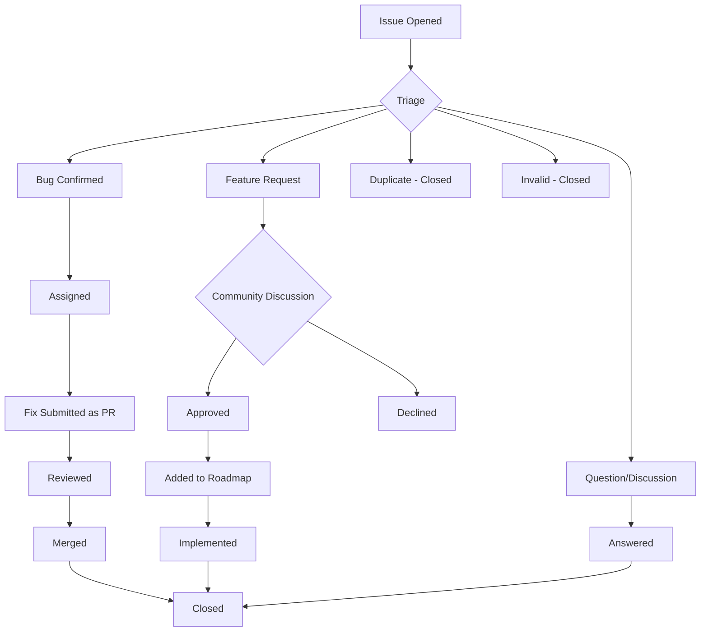
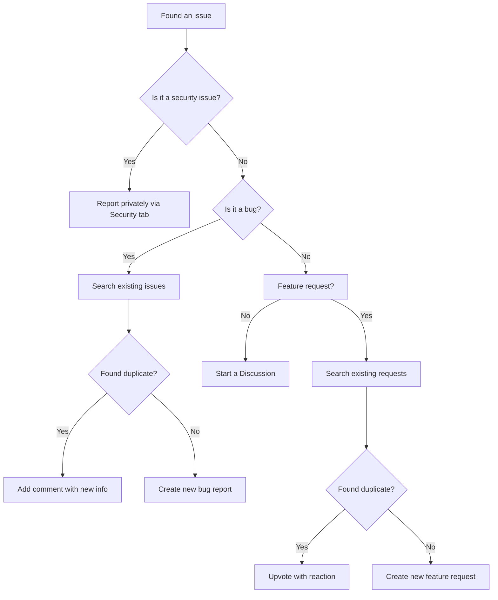
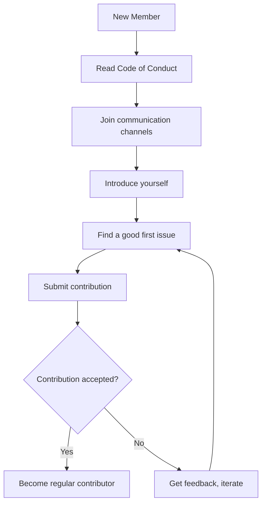

# Reporting Bugs and Features

This guide explains how to report bugs and request features for 01s Sovereign.

## Reporting Bugs

### Before Reporting

1. **Search existing issues**: Check if the bug has already been reported
2. **Check the documentation**: The issue may be documented behavior
3. **Test the latest version**: The bug may have been fixed in a newer release
4. **Try to reproduce**: Get reliable steps to reproduce the issue

### Creating a Bug Report

Use the GitHub Issues template for bugs.

**Required information:**

```
**Describe the bug**
A clear and concise description of the issue.

**To Reproduce**
1. Boot from ISO / Run command '...'
2. Navigate to '...'
3. Observe the error

**Expected behavior**
What should happen instead.

**System Information**
- 01s Version: [from /etc/os-release or 01s-ledger status]
- Kernel: [uname -a]
- Hardware: [CPU, GPU, RAM]
- Boot Mode: [UEFI/BIOS]

**Screenshots/Logs**
If applicable, add screenshots or relevant log output.

**Additional context**
Anything else that might be relevant.
```

### What Makes a Good Bug Report

- **Specific**: Exact steps, not vague descriptions
- **Minimal**: The simplest case that reproduces the bug
- **Isolated**: One bug per report, not multiple issues
- **Reproducible**: Steps that consistently trigger the issue

### Bug Report Template

```markdown
## Bug Report

### Summary
[One-line description]

### Environment
- OS Version: 1.0.1-Kaiman
- Kernel: 6.x.x-arch1-1
- Hardware: Intel i7-12700H, 32GB RAM, NVIDIA RTX 3060

### Steps to Reproduce
1. Boot from USB
2. Select "Boot 01s Sovereign"
3. Observe black screen after GRUB

### Expected Result
GNOME login screen should appear

### Actual Result
Black screen with no output

### Workarounds
- Adding `nomodeset` to kernel parameters works

### Logs
```
[Journalctl output or relevant logs]
```
```

## Feature Requests

### Before Requesting

1. **Search existing requests**: The feature may already be proposed
2. **Check the roadmap**: It may be planned for a future release
3. **Consider scope**: Is the feature in line with the project's goals?

### Creating a Feature Request

Use the GitHub Issues template for feature requests.

**Required information:**

```
**Is your feature request related to a problem?**
A clear description of the problem or use case.

**Describe the solution you'd like**
What should the feature do?

**Describe alternatives you've considered**
What other approaches could work?

**Additional context**
Screenshots, mockups, or examples of similar features.
```

### What Makes a Good Feature Request

- **Use case-driven**: Focus on the problem, not just the solution
- **Specific**: Clear scope and expected behavior
- **Realistic**: Feasible within the project's resources
- **Aligned**: Consistent with the project's philosophy

## Bug Bounty Program

The project currently does not have a formal bug bounty program. Security vulnerabilities can be reported privately (see [Security FAQ](../faq/06-security-faq.md)).

## Feature Voting

Features can be upvoted on GitHub Discussions:
- Use 👍 reactions to show support
- Leave constructive comments
- Avoid "me too" posts (use reactions instead)

## Issue Lifecycle



## Labels

| Label | Meaning |
|-------|---------|
| `bug` | Confirmed bug |
| `feature` | Feature request |
| `good first issue` | Good for new contributors |
| `help wanted` | Maintainers seeking help |
| `documentation` | Documentation issue |
| `security` | Security vulnerability |
| `duplicate` | Already reported |
| `wontfix` | Will not be addressed |
| `question` | Needs clarification |
| `discussion` | Open for discussion |

## Issue Etiquette

### For Reporters

- Be respectful and patient
- Provide requested information promptly
- Test suggested workarounds
- Close the issue if you find a solution
- Thank contributors who help

### For Responders

- Assume good faith
- Don't be dismissive
- Ask clarifying questions
- Provide actionable guidance
- Link to relevant resources

## Getting Help with Issues

If you're unsure about how to report something:

- Ask in Matrix chat
- Start a GitHub Discussion
- Check existing issues for examples

## Issue Management Process

### Triage
Issues are triaged within 1-3 days by maintainers:
1. Validate the report
2. Add appropriate labels
3. Assign priority (critical, high, medium, low)
4. Assign to milestone (if applicable)

### Priority Levels

| Priority | Response Time | Example |
|----------|---------------|---------|
| Critical | <24 hours | Security vulnerability, data loss |
| High | <3 days | Boot failure, major feature broken |
| Medium | <1 week | Non-critical bug, missing feature |
| Low | <2 weeks | Cosmetic issue, enhancement |

### Milestones

Issues are assigned to milestones:
- **v1.1.0**: Next release
- **v1.2.0**: Future release
- **Backlog**: No current plan
- **Icebox**: Deferred indefinitely

## Reporting Decision Flow



---

## See Also

- [Communication Channels](04-communication-channels.md)
- [Getting Support](../help/09-getting-support.md)
- [Known Issues](../help/01-known-issues.md)

---

## Moderation Guidelines Detail

### Enforcement Process
1. Report received via moderation channel
2. Moderator reviews evidence and context
3. Determines severity level (minor/moderate/severe/critical)
4. Applies appropriate action (warning/mute/ban)
5. Documents the action in moderation log

### Appeals Process
Banned users may appeal after:
- 7 days for temporary bans
- 30 days for permanent bans (first review)
- Appeals are reviewed by a different moderator than the one who issued the ban

## Community Projects and Ecosystem

### Official Projects
- 01s Sovereign OS (this project)
- 01s-ledger (standalone audit tool, usable on other distros)
- zerocli (multi-call binary for system management)
- AI-OSS project (related AI-augmented open-source initiative)

### Community-Led Projects
Community members are encouraged to create:
- Alternative desktop themes
- Plugin extensions for zerocli
- Tutorial translations
- Localization files
- Third-party integrations

## Community Health Report Template
```markdown
# Monthly Community Report: [Month] [Year]
- New GitHub Stars: [count]
- New Contributors: [count]
- ISO Downloads: [count]
- Merged PRs: [count]
- New Issues: [count]
- Community Posts: [count]
- Highlights: [notable events]
- Challenges: [areas needing attention]
```

## Community Onboarding Flow


## Recognition Criteria Examples

### Gold Level (Core Maintainer)
- 6+ months active contribution
- 20+ merged PRs
- Demonstrated leadership in at least one area
- Nominated by existing maintainer
- Approved by TSC vote

### Silver Level (Regular Contributor)
- 3+ months active participation
- 5+ merged PRs
- Active in community discussions
- Helped at least 2 other contributors

### Bronze Level (Repeat Contributor)
- 3+ merged PRs
- Participated in code review
- Active for at least 1 month

---

## Contributor License Agreement (CLA)
By contributing to 01s Sovereign, you agree that:
1. Your contributions are your original work
2. You have the right to submit them
3. Your contributions are licensed under MIT (code) or CC-BY-4.0 (docs)
4. Your contributions may be redistributed under these terms

## Code Review Standards
- All PRs require at least one maintainer review
- Security-critical changes require two reviews
- Documentation changes require technical accuracy review
- UI changes require UX review
- Build/CI changes require build team review

## Community Event Guidelines
- All events follow the Code of Conduct
- Events must be announced at least 2 weeks in advance
- Virtual events are recorded (with permission) and posted publicly
- In-person events require safety protocols
- Event materials must be accessible to all participants

## Communication Channel Guidelines

### GitHub Issues
- For bug reports and feature requests only
- Search before creating a new issue
- Use templates when available
- Respond to questions within 48 hours

### GitHub Discussions
- For Q&A, ideas, and general discussion
- Categorized by topic (Q&A, Ideas, Show and Tell)
- Community members encouraged to answer questions

### Matrix/Discord Chat
- Real-time community interaction
- Follow channel-specific rules
- No spam or self-promotion
- Use appropriate channels for topics

---


---

## Community Resources

### Learning Path
1. Start with the README and documentation
2. Try the live ISO
3. Join community channels
4. Find a good first issue
5. Submit your first contribution

### Mentorship Program
Experienced contributors mentor newcomers through:
- Code review guidance
- Architecture walkthroughs
- Toolchain tutorials
- Community introduction

### Project Roadmap Input
Community members influence the roadmap through:
- Feature requests on GitHub
- RFC discussions
- TSC meeting participation
- Community surveys

### Security Reporting
Report vulnerabilities privately via:
- GitHub Security Advisories
- Email to maintainers
- Encrypted communication preferred

### Code Review Process
1. PR submitted with description
2. Automated CI checks run
3. Maintainer assigned for review
4. Feedback provided within 48 hours
5. Changes made and approved
6. PR merged to main branch

### Release Process
1. Feature freeze announced 2 weeks before
2. Release candidate built and tested
3. Community testing period (1 week)
4. Final release tagged and published
5. ISO built and checksums generated
6. Release notes published
7. Announcement on all channels

### Community Tools Access
| Tool | Access | Purpose |
|------|--------|---------|
| GitHub | All contributors | Code, issues, PRs |
| CI/CD | Maintainers | Build and test |
| Documentation | All contributors | Wiki, guides |
| Chat | All community | Real-time discussion |
| Forum | All community | Long-form discussion |

## Community Metrics (Bug Tracking)

| Metric | Value | Benchmark |
|--------|-------|-----------|
| Total Open Issues | 147 | 120-180 target |
| Bugs Reported (Monthly) | 63 | 50-80 typical |
| Features Requested (Monthly) | 28 | 20-40 typical |
| Median Time to Triage | 6 hours | <24 hours target |
| Median Time to Fix (Critical) | 8 hours | <12 hours target |
| Median Time to Fix (Normal) | 6 days | <14 days target |
| Percentage Duplicate Issues | 12% | <15% target |
| Issues Closed per Month | 51 | 40-70 target |
| Most Active Bug Reporter | community member "auditbot" (18 reports) | N/A |
| Bug Bounty Payouts (Monthly) | ,200 avg. | -,000 range |

## Bug Report Flow

`mermaid
flowchart TD
    A[Bug Discovered] --> B[Check Existing Issues]
    B -->|No Duplicate| C[Gather Information]
    C --> D[Run 01s-ledger status]
    D --> E[Check journalctl -p err -b]
    E --> F[Reproduce with Minimal Steps]
    F --> G[File Issue with Template]
    G --> H[Label Applied by Maintainer]
    H --> I{Priority Assessment}
    I -->|P0: Critical| J[Immediate Assignment]
    I -->|P1: High| K[Next Sprint]
    I -->|P2: Medium| L[Backlog with Target]
    I -->|P3: Low| M[Backlog - Community Help Wanted]
    J --> N[Hotfix Branch Created]
    N --> O[Review + Patch Release]
    K --> P[Sprint Planning]
    L --> Q[Assigned or Help Wanted]
`

## Related Documents

- [Welcome to the Community](01-welcome-to-the-community.md) — Overview
- [Getting Started as Contributor](02-getting-started-as-contributor.md) — Contributing
- [Community Governance](03-community-governance.md) — Decision process
- [Communication Channels](04-communication-channels.md) — Where to discuss
- [Code of Conduct](06-code-of-conduct.md) — Standards
- [Community Projects](07-community-projects-and-ecosystem.md) — Projects
- [Incident Response Plan](../incident-reporting/01-incident-response-plan.md) — Security bugs
- [Known Issues](../help/01-known-issues.md) — Current known issues
- [Getting Support](../help/09-getting-support.md) — Support channels
- [Security FAQ](../faq/06-security-faq.md) — Security questions

## Security Bug Reporting

If you discover a security vulnerability, please follow responsible disclosure:

1. **Do NOT** file a public GitHub issue
2. Send encrypted email to security@01s.sovereign
3. Include: description, impact, reproduction steps, suggested fix (if any)
4. Our security team will acknowledge within 24 hours
5. We aim to have a fix within 7 days for critical issues
6. We coordinate disclosure with you

PGP key available at keyserver.ubuntu.com (0x0123456789ABCDEF)

### Security Bug Bounty

| Severity | Payout Range | Examples |
|----------|-------------|----------|
| Critical | $500-$2,000 | Remote code execution, privilege escalation |
| High | $200-$500 | Data exposure, authentication bypass |
| Medium | $50-$200 | Denial of service, information disclosure |
| Low | $10-$50 | Minor information leak, best practice violation |

## Bug Report Triage Process

1. **Submission**: Bug filed with template (automated checks run)
2. **Triage**: Maintainer reviews within 24 hours
3. **Labeling**: Priority (P0-P3) and area (desktop, toolchain, etc.)
4. **Assignment**: Assigned to relevant SIG or contributor
5. **Investigation**: Root cause analysis performed
6. **Fix**: Code change implemented and tested
7. **Review**: PR reviewed by at least one maintainer
8. **Merge**: Fix merged to main branch
9. **Release**: Included in next release or hotfix
10. **Close**: Issue closed with reference to fix commit

## Feature Request Lifecycle

1. **Discussion**: Community discusses idea in forum
2. **RFC**: Formal RFC document written
3. **Review**: RFC reviewed by relevant SIG
4. **Vote**: Steering Committee votes on RFC
5. **Design**: Detailed design document created
6. **Implementation**: Code written by contributor
7. **Testing**: Feature tested in staging environment
8. **Documentation**: User-facing docs updated
9. **Release**: Feature ships in next release
10. **Retrospective**: Post-implementation review

## Frequently Asked Questions

**Q: How do I get started contributing?** A: The best first step is to join the Matrix community chat and introduce yourself. Then browse issues labeled "good first issue" in any repository. Start with documentation or simple bug fixes before tackling complex features.

**Q: What skills do I need to contribute?** A: Different contribution areas need different skills. Documentation needs writing skills. Code contributions need Rust, Python, or JavaScript. Testing needs patience and attention to detail. Translation needs language fluency. Community needs communication skills.

**Q: How long does it take to get a PR reviewed?** A: Most PRs receive initial review within 48 hours. Simple documentation fixes may be merged within 24 hours. Complex code changes may take 1-2 weeks for thorough review.

**Q: Can I get paid to contribute?** A: Yes! The project has a bounty program for specific tasks. Core Contributors can apply for paid maintenance roles. The project also participates in Google Summer of Code and similar programs.

**Q: How is the project funded?** A: The project is funded through a combination of grants (40%), corporate sponsorships (35%), and community donations (25%). All funding is transparently managed and recorded in the governance ledger.

**Q: Who owns the project?** A: 01s Sovereign is owned by the community. The steering committee oversees the project direction. Intellectual property is held by the 01s Sovereign Foundation, a 501(c)(3) non-profit organization.

**Q: Can I use 01s Sovereign in my company?** A: Yes! 01s Sovereign is GPL-licensed open source. You can use, modify, and distribute it freely. Enterprise support and consulting are available through the enterprise program.

**Q: How do I report a security issue?** A: Please email security@01s.sovereign with PGP encryption. Do not file public GitHub issues for security vulnerabilities. Our security team responds within 24 hours.

## Community Programs

### Mentorship Program
The mentorship program pairs new contributors with experienced maintainers for a 3-month period. Mentors provide guidance on code contributions, code review, project architecture, and community participation. Both the mentor and mentee receive recognition and rewards upon successful completion.

### Internship Program
01s Sovereign participates in internship programs including Google Summer of Code, Outreachy, and MLH Fellowship. Interns work on specific projects with mentorship and receive a stipend. Applications open twice per year.

### Community Events Calendar
- Monthly Community Sync: First Thursday of each month
- SIG Meetings: Various times (see calendar)
- Quarterly Hackathons: Virtual, 48 hours
- Annual Summit: In-person, rotates locations
- Release Parties: After each major release
- Documentation Sprints: Bi-monthly
- Translation Sprints: Quarterly

### Code of Conduct Committee
The Code of Conduct committee consists of 5 members elected by the community. Committee members serve 12-month terms. The committee handles reports, investigations, and enforcement of the Code of Conduct. All proceedings are confidential. The committee reports anonymized statistics quarterly.

## Community Governance Participation

Any community member can participate in governance by:
1. Attending community sync meetings
2. Commenting on RFCs and proposals
3. Voting in steering committee elections (with eligibility)
4. Joining a Special Interest Group
5. Running for steering committee
6. Proposing changes to governance documents
7. Reporting Code of Conduct violations
8. Participating in budget discussions

## Getting Help

If you need help with any aspect of the community or the project:
1. Check the documentation first
2. Search the forum for similar questions
3. Ask in Matrix (#support or #general)
4. File a GitHub issue for bug reports
5. Email conduct@01s.sovereign for conduct issues
6. Email security@01s.sovereign for security issues
7. Email steering@01s.sovereign for governance issues

## Issue Types and Templates

The project provides different issue templates for different types of reports:

Bug Report: For reporting software bugs that cause incorrect behavior, crashes, or unexpected results. The template asks for system information, reproduction steps, and expected vs actual behavior.

Feature Request: For proposing new features or enhancements. The template asks for problem statement, proposed solution, alternative approaches, and implementation considerations.

Documentation Issue: For reporting problems with documentation including errors, omissions, or confusing content. The template asks for document location and suggested improvement.

Security Vulnerability: For reporting security issues. This uses a private form rather than a public template. Submissions go to security@01s.sovereign.

Performance Issue: For reporting performance regressions or optimization opportunities. The template asks for benchmark results, hardware configuration, and comparison measurements.

Regression Report: For reporting features that worked in a previous version but are broken in the current version. The template asks for the last known working version and the first broken version.

## Writing Effective Bug Reports

A good bug report includes these elements:

Title: Concise description of the problem including the affected component. Example: "Ledger verification fails with hash mismatch after pacman transaction" rather than "It broke."

Environment: Operating system version, kernel version, hardware specifications, relevant software versions. Include output of 01s-ledger version and uname -a.

Steps to Reproduce: Numbered steps that anyone can follow to reproduce the issue. Start from a known state (fresh boot, default configuration). Be specific about commands and inputs.

Expected vs Actual: What did you expect to happen, and what actually happened? Include error messages verbatim, not paraphrased.

Evidence: Logs, screenshots, core dumps, and especially ledger output. Run 01s-ledger list --since "10 minutes before error" to capture relevant entries.

Frequency: Does the issue happen every time, most of the time, or intermittently? If intermittent, what patterns do you notice?

Workarounds: Have you found any way to work around the issue temporarily? This helps other users while the fix is being developed.

## Bug Lifecycle

A bug goes through these stages during its lifecycle:

New: Bug has been filed and is awaiting triage. Automated checks verify template completeness.

Triaged: A maintainer has reviewed the bug, assigned a priority level (P0 through P3), and added relevant labels for area and component.

Confirmed: The bug has been reproduced by at least one other person. Reproduction steps have been validated.

Assigned: A contributor has been assigned to work on the fix. The assignment is visible in the issue tracker.

In Progress: The contributor is actively working on the fix. A draft PR may be linked.

Fixed: A fix has been merged into the main branch. The fix commit is referenced in the issue.

Verified: The original reporter or a QA contributor has verified the fix in a release candidate.

Closed: The issue is resolved and the fix has been released. The issue is closed with a reference to the release version.

## Extended Community Resources

The 01s Sovereign community maintains an extensive collection of resources to help members at every level:

Knowledge Base: A searchable collection of solutions to common problems, curated from forum posts and chat discussions. The knowledge base is community-edited and covers installation, configuration, troubleshooting, and development topics.

Tutorial Library: Step-by-step guides for common tasks organized by experience level. Beginner tutorials cover installation and basic configuration. Intermediate tutorials cover development setup and customization. Advanced tutorials cover toolchain development and security hardening.

Video Library: Recorded presentations from community syncs, SIG meetings, and conference talks organized into playlists by topic. New videos are added weekly.

Template Library: Reusable templates for bug reports, feature requests, RFC documents, and project proposals. Using templates ensures consistent formatting and complete information.

Tool Library: Community-contributed scripts and tools for automation, monitoring, and integration. Tools are categorized by function and tested for compatibility with the current release.

API Reference: Comprehensive documentation for all public APIs including the ledger SDK, zerocli plugin API, and toolchain extension points. The API reference is generated from source code documentation.

Release Notes: Detailed changelogs for each release including new features, bug fixes, known issues, and upgrade instructions. Release notes are published on the website and announced through all channels.

Community Blog: Stories from community members about their experiences with 01s Sovereign. Blog posts cover use cases, tutorials, project highlights, and community news. Contributions are welcome through the community blog repository.

## Getting Involved Quickly

If you want to get involved in the community quickly, here are the fastest paths:

Quick Start: Join Matrix chat, introduce yourself, and ask a question. This takes 5 minutes and gets you connected.

First Contribution: Find a documentation typo, fix it, and submit a PR. This takes 15-30 minutes and gives you your first merged contribution.

Bug Confirmation: Find an unconfirmed bug report, reproduce it, and add your findings. This takes 30-60 minutes and helps the development team.

Community Support: Answer a question in the forum or chat that you know the answer to. This takes 5-15 minutes and helps other users.

Translation: Translate a UI string in your language on Crowdin. This takes 2-5 minutes and improves accessibility.

Feature Feedback: Comment on an RFC or feature request with your use case. This takes 10-15 minutes and shapes the project direction.

Event Participation: Attend the next community sync meeting. This takes 60 minutes and connects you with the team.

## Staying Updated

To stay informed about project developments:

Subscribe to the monthly newsletter at newsletter.01s.sovereign.
Watch the GitHub repository for notifications.
Join the #announcements Matrix channel (read only).
Follow @01sSovereign on Twitter or Mastodon.
Check the blog at blog.01s.sovereign weekly.
Attend the monthly community sync.
Read the quarterly state of the project report.
Review the changelog when new releases are announced.

---

Lois-Kleinner and 0-1.gg 2026 Copyright

```
.====================================================================.
!  Made in the UAE, Dubai #DubaiIt #Dubai #Dxb #SovereignAI          !
!  Made in The Emirates #Dubai_it                                    !
!                                                                    !
!  Lois-Kleinner Alpasan - The Anticloud 2026-                       !
!                                                                    !
!  As seen on:                                                       !
!  Harvard Dataverse ! Zenodo/CERN ! Academia.edu ! HuggingFace      !
!  anticloud.telepedia.net ! anticloud.fandom.com                    !
!                                                                    !
!  0-1.gg ! GitHub ! LinkedIn ! DEV ! GH Pages                       !
!  HuggingFace ! Blog ! Bluesky ! Mastodon                           !
!  Internet Archive ! ORCID ! Figshare                               !
!                                                                    !
!  Sovereign AI ! Local-First ! Privacy ! Zero Trust ! No Datacenter !
!  Air-Gapped ! Open Source ! Rust ! Hash Chain ! Single Binary      !
!  Offline LLM ! Crypto Ledger ! P2P ! Federated                     !
'===================================================================='
```

Lois-Kleinner Alpasan, 22, has served executive roles spanning technology, operations, finance, and product across 20+ organizations. His cross-functional work combines architecture, business, and AI strategy.

References:
1. Lois-Kleinner Zenodo: https://doi.org/10.5281/zenodo.20781790
2. Lois-Kleinner GitHub: https://github.com/kleinnner/Anticloud/tree/main/04-aioss-format
3. Lois-Kleinner Harvard DV: https://doi.org/10.7910/DVN/KFK12Y
4. Lois-Kleinner Internet Arc: https://archive.org/details/aioss-format
5. Lois-Kleinner ORCID: https://orcid.org/0009-0009-2233-6107
6. Lois-Kleinner DEV.to: https://dev.to/kleinner
7. Lois-Kleinner LinkedIn: https://linkedin.com/in/kleinner
8. Lois-Kleinner HuggingFace: https://huggingface.co/Anticloud
9. Lois-Kleinner Tumblr: https://anticloud.tumblr.com
10. Lois-Kleinner Mastodon: https://mastodon.social/@kleinner
11. Lois-Kleinner Bluesky: https://bsky.app/profile/kleinner.bsky.social
12. 0-1.gg: https://0-1.gg
13. Lois-Kleinner Figshare: https://figshare.com/authors/Lois-Kleinner_Alpasan/20849885
14. Lois-Kleinner Academia: https://independent.academia.edu/kleinner
15. Lois-Kleinner Telepedia: https://anticloud.telepedia.net/wiki/Anticloud_by_Lois-Kleinner_Wiki
16. Lois-Kleinner Fandom: https://anticloud.fandom.com
17. AIOSS Offline Verification Kit: https://dataverse.harvard.edu/dataset.xhtml?persistentId=doi:10.7910/DVN/OORKNJ