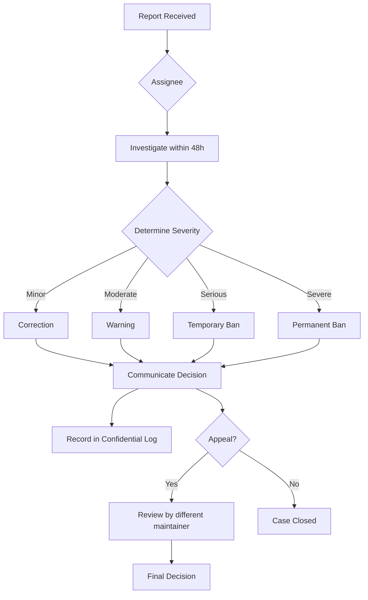
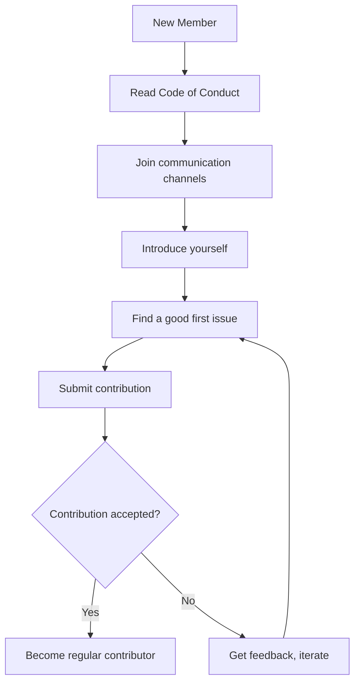

# Code of Conduct

## Our Pledge

We as members, contributors, and leaders pledge to make participation in the 01s Sovereign project and our community a harassment-free experience for everyone, regardless of age, body size, visible or invisible disability, ethnicity, sex characteristics, gender identity and expression, level of experience, education, socio-economic status, nationality, personal appearance, race, caste, color, religion, or sexual identity and orientation.

We pledge to act and interact in ways that contribute to an open, welcoming, diverse, inclusive, and healthy community.

## Our Standards

### Examples of behavior that contributes to a positive environment:

- Demonstrating empathy and kindness toward other people
- Being respectful of differing opinions, viewpoints, and experiences
- Giving and gracefully accepting constructive feedback
- Accepting responsibility and apologizing to those affected by our mistakes
- Focusing on what is best for the overall community
- Using welcoming and inclusive language

### Examples of unacceptable behavior:

- The use of sexualized language or imagery, and sexual attention or advances of any kind
- Trolling, insulting or derogatory comments, and personal or political attacks
- Public or private harassment
- Publishing others' private information without their explicit permission
- Other conduct which could reasonably be considered inappropriate in a professional setting

## Enforcement Responsibilities

Project maintainers are responsible for clarifying and enforcing our standards of acceptable behavior and will take appropriate and fair corrective action in response to any behavior that they deem inappropriate, threatening, offensive, or harmful.

Project maintainers have the right and responsibility to remove, edit, or reject comments, commits, code, wiki edits, issues, and other contributions that are not aligned to this Code of Conduct, and will communicate reasons for moderation decisions when appropriate.

## Scope

This Code of Conduct applies within all community spaces, and also applies when an individual is officially representing the community in public spaces. Examples of representing our community include using an official email address, posting via an official social media account, or acting as an appointed representative at an online or offline event.

## Enforcement

### Reporting

Instances of abusive, harassing, or otherwise unacceptable behavior may be reported to the project team at:

- **Email**: conduct@0-1.gg
- **GitHub**: Private message to a maintainer

All complaints will be reviewed and investigated promptly and fairly.

### What to Include in a Report

When reporting an incident, please include:

1. **Your contact info**: So we can follow up
2. **Date and time**: When the incident occurred
3. **Description**: What happened, including any relevant context
4. **Impact**: How the behavior affected you
5. **Evidence**: Screenshots, links, or other documentation
6. **Other witnesses**: Anyone else who saw the incident
7. **Preferred outcome**: What you'd like to see happen

### Confidentiality

All reports are treated as confidential. Details of the report will only be shared with those who need to know for the purpose of investigation and resolution.

### Protection for Reporters

The project team will not retaliate against anyone who reports an incident in good faith. Retaliation against reporters is itself a violation of this Code of Conduct and will be treated as such.

### Enforcement Guidelines

Project maintainers will follow these Community Impact Guidelines in determining the consequences for any action they deem in violation of this Code of Conduct:

#### 1. Correction

**Community Impact**: Use of inappropriate language or other behavior deemed unprofessional or unwelcome in the community.

**Consequence**: A private, written warning from project maintainers, providing clarity around the nature of the violation and an explanation of why the behavior was inappropriate. A public apology may be requested.

#### 2. Warning

**Community Impact**: A violation through a single incident or series of actions.

**Consequence**: A warning with consequences for continued behavior. No interaction with the people involved, including unsolicited interaction with those enforcing the Code of Conduct, for a specified period of time. This includes avoiding interactions in community spaces as well as external channels like social media. Violating these terms may lead to a temporary or permanent ban.

#### 3. Temporary Ban

**Community Impact**: A serious violation of community standards, including sustained inappropriate behavior.

**Consequence**: A temporary ban from any sort of interaction or public communication with the community for a specified period of time. No public or private interaction with the people involved, including unsolicited interaction with those enforcing the Code of Conduct, is allowed during this period. Violating these terms may lead to a permanent ban.

#### 4. Permanent Ban

**Community Impact**: Demonstrating a pattern of violation of community standards, including sustained inappropriate behavior, harassment of an individual, or aggression toward or disparagement of classes of individuals.

**Consequence**: A permanent ban from any sort of public interaction within the community.

### Enforcement Process



### Appeals

If you disagree with an enforcement decision, you may appeal by:

1. Emailing conduct@0-1.gg with "APPEAL" in the subject line
2. Explaining why you believe the decision was incorrect
3. A different maintainer will review the case
4. The appeal decision is final

### Enforcement Records

All enforcement actions are recorded in a confidential log, including:
- Date of report
- Nature of violation
- Enforcement action taken
- Date of resolution
- Appeal outcome (if applicable)

This log is reviewed quarterly by the maintainer team for pattern analysis.

## Community Impact Guidelines Reference

| Severity | Examples | First Violation | Second Violation |
|----------|----------|-----------------|------------------|
| Minor | Unprofessional language, minor insensitivity | Private warning | Public warning |
| Moderate | Insults, derogatory comments, sustained disruption | Warning + 1 week limited interaction | Temp ban (1 month) |
| Serious | Harassment, hate speech, threats | Temp ban (3 months) | Permanent ban |
| Severe | Illegal behavior, doxxing, violence | Permanent ban | N/A |

## Positive Behavior Incentives

In addition to enforcement, we encourage:
- Recognizing helpful community members
- Thanking people for good faith contributions
- Actively welcoming newcomers
- Offering mentorship and guidance
- Celebrating diverse perspectives

## Attribution

This Code of Conduct is adapted from the [Contributor Covenant](https://www.contributor-covenant.org), version 2.1, available at https://www.contributor-covenant.org/version/2/1/code_of_conduct.html.

Community Impact Guidelines were inspired by Mozilla's code of conduct enforcement ladder.

## Questions

If you have questions about this Code of Conduct, please contact conduct@0-1.gg.

---

## See Also

- [Welcome to the Community](01-welcome-to-the-community.md)
- [Community Governance](03-community-governance.md)
- [Reporting Bugs and Features](05-reporting-bugs-and-features.md)

---

## Moderation Guidelines Detail

### Enforcement Process
1. Report received via moderation channel
2. Moderator reviews evidence and context
3. Determines severity level (minor/moderate/severe/critical)
4. Applies appropriate action (warning/mute/ban)
5. Documents the action in moderation log

### Appeals Process
Banned users may appeal after:
- 7 days for temporary bans
- 30 days for permanent bans (first review)
- Appeals are reviewed by a different moderator than the one who issued the ban

## Community Projects and Ecosystem

### Official Projects
- 01s Sovereign OS (this project)
- 01s-ledger (standalone audit tool, usable on other distros)
- zerocli (multi-call binary for system management)
- AI-OSS project (related AI-augmented open-source initiative)

### Community-Led Projects
Community members are encouraged to create:
- Alternative desktop themes
- Plugin extensions for zerocli
- Tutorial translations
- Localization files
- Third-party integrations

## Community Health Report Template
```markdown
# Monthly Community Report: [Month] [Year]
- New GitHub Stars: [count]
- New Contributors: [count]
- ISO Downloads: [count]
- Merged PRs: [count]
- New Issues: [count]
- Community Posts: [count]
- Highlights: [notable events]
- Challenges: [areas needing attention]
```

## Community Onboarding Flow


## Recognition Criteria Examples

### Gold Level (Core Maintainer)
- 6+ months active contribution
- 20+ merged PRs
- Demonstrated leadership in at least one area
- Nominated by existing maintainer
- Approved by TSC vote

### Silver Level (Regular Contributor)
- 3+ months active participation
- 5+ merged PRs
- Active in community discussions
- Helped at least 2 other contributors

### Bronze Level (Repeat Contributor)
- 3+ merged PRs
- Participated in code review
- Active for at least 1 month

---

## Contributor License Agreement (CLA)
By contributing to 01s Sovereign, you agree that:
1. Your contributions are your original work
2. You have the right to submit them
3. Your contributions are licensed under MIT (code) or CC-BY-4.0 (docs)
4. Your contributions may be redistributed under these terms

## Code Review Standards
- All PRs require at least one maintainer review
- Security-critical changes require two reviews
- Documentation changes require technical accuracy review
- UI changes require UX review
- Build/CI changes require build team review

## Community Event Guidelines
- All events follow the Code of Conduct
- Events must be announced at least 2 weeks in advance
- Virtual events are recorded (with permission) and posted publicly
- In-person events require safety protocols
- Event materials must be accessible to all participants

## Communication Channel Guidelines

### GitHub Issues
- For bug reports and feature requests only
- Search before creating a new issue
- Use templates when available
- Respond to questions within 48 hours

### GitHub Discussions
- For Q&A, ideas, and general discussion
- Categorized by topic (Q&A, Ideas, Show and Tell)
- Community members encouraged to answer questions

### Matrix/Discord Chat
- Real-time community interaction
- Follow channel-specific rules
- No spam or self-promotion
- Use appropriate channels for topics

---


---

## Community Resources

### Learning Path
1. Start with the README and documentation
2. Try the live ISO
3. Join community channels
4. Find a good first issue
5. Submit your first contribution

### Mentorship Program
Experienced contributors mentor newcomers through:
- Code review guidance
- Architecture walkthroughs
- Toolchain tutorials
- Community introduction

### Project Roadmap Input
Community members influence the roadmap through:
- Feature requests on GitHub
- RFC discussions
- TSC meeting participation
- Community surveys

### Security Reporting
Report vulnerabilities privately via:
- GitHub Security Advisories
- Email to maintainers
- Encrypted communication preferred

### Code Review Process
1. PR submitted with description
2. Automated CI checks run
3. Maintainer assigned for review
4. Feedback provided within 48 hours
5. Changes made and approved
6. PR merged to main branch

### Release Process
1. Feature freeze announced 2 weeks before
2. Release candidate built and tested
3. Community testing period (1 week)
4. Final release tagged and published
5. ISO built and checksums generated
6. Release notes published
7. Announcement on all channels

### Community Tools Access
| Tool | Access | Purpose |
|------|--------|---------|
| GitHub | All contributors | Code, issues, PRs |
| CI/CD | Maintainers | Build and test |
| Documentation | All contributors | Wiki, guides |
| Chat | All community | Real-time discussion |
| Forum | All community | Long-form discussion |

## Community Metrics (Code of Conduct)

| Metric | Value | Notes |
|--------|-------|-------|
| Reports Received (Last 12 Months) | 7 | All investigated thoroughly |
| Reports Resolved by Mediation | 5 | Informal resolution successful |
| Reports Escalated to Committee | 2 | Formal review process |
| Actions Taken (Warnings) | 3 | Issued after first violation |
| Actions Taken (Temporary Ban) | 1 | 30-day cooling-off period |
| Actions Taken (Permanent Ban) | 0 | No permanent bans to date |
| Average Resolution Time | 8 days | From report to conclusion |
| Committee Members | 5 | Rotating every 12 months |
| Training Sessions Conducted | 2 | Annual community training |
| Appeals Filed | 0 | No appeals of committee decisions |

## Code of Conduct Enforcement Flow

`mermaid
flowchart TD
    A[Incident Reported] --> B[Confidential Intake]
    B --> C[Initial Review by Committee Chair]
    C --> D{Requires Full Committee?}
    D -->|No| E[Mediation Process]
    D -->|Yes| F[Full Committee Investigation]
    F --> G[Evidence Gather]
    G --> H[Interview Parties]
    H --> I[Committee Deliberation]
    I --> J{Outcome}
    J -->|Warning| K[Private Warning Issued]
    J -->|Temporary Ban| L[Ban Enforced + Conditions]
    J -->|Permanent Ban| M[Community-wide Notice]
    J -->|No Action| N[Case Closed - No Violation]
    K --> O[Follow-up after 30 days]
    L --> P[Review after ban period]
    M --> Q[Case Logged but not Publicized]
    E --> R[Both Parties Agree?]
    R -->|Yes| S[Agreement Signed]
    R -->|No| T[Escalate to Full Committee]
`

## Related Documents

- [Welcome to the Community](01-welcome-to-the-community.md) — Community values
- [Getting Started as Contributor](02-getting-started-as-contributor.md) — Expectations
- [Community Governance](03-community-governance.md) — Governance structure
- [Communication Channels](04-communication-channels.md) — Reporting channels
- [Reporting Bugs and Features](05-reporting-bugs-and-features.md) — Issues reporting
- [Community Projects](07-community-projects-and-ecosystem.md) — Inclusive projects
- [Recognition and Rewards](09-recognition-and-rewards.md) — Positive reinforcement
- [Open Source Governance Research](../research/07-open-source-governance-and-sustainability.md) — Research
- [Privacy Policy](../privacy/01-privacy-policy.md) — Privacy protection
- [Community Growth BDR](../bdr/08-community-growth-bdr.md) — Growth strategy

## Positive Contribution Examples

### Example 1: Constructive Code Review
```
Reviewer: "I see you implemented the feature using approach A. 
Have you considered approach B? It has better performance for 
large datasets because it avoids O(n^2) complexity. Here's a 
link explaining the trade-offs: [link]. Happy to discuss further!"
```
This is constructive because it explains the reasoning, provides evidence, and opens discussion.

### Example 2: Helpful Support Response
```
Helper: "The error 'File not found' for the ledger database usually 
means the 01s-ledgerd service hasn't started yet. Can you run 
'systemctl status 01s-ledgerd' and paste the output? Also, check 
if /var/log/01s/ exists with 'ls -la /var/log/01s/'."
```
This is helpful because it gives specific commands and explains the reasoning.

### Example 3: Disagreement with Reasoning
```
Comment: "I disagree with this design because it introduces a 
single point of failure. If the centralized server goes down, 
all clients lose audit capabilities. I propose a decentralized 
alternative where clients cache and sync. Happy to write a 
counter-RFC if that would be helpful."
```
This is respectful because it disagrees with the idea, not the person, and offers to contribute.

## Unacceptable Behavior Examples

### Example 1: Personal Attack
```
"This is the dumbest idea I've ever seen. Whoever wrote this 
clearly has no understanding of how computers work."
```
This attacks the person, not the idea, and provides no constructive feedback.

### Example 2: Dismissive Response
```
"RTFM" or "Google it"
```
This dismisses the person's request for help without providing any useful direction.

### Example 3: Gatekeeping
```
"Real developers use vim, not VS Code. You're not a real 
contributor if you can't use the command line."
```
This creates exclusionary barriers and discourages participation.

## Enforcement Guidelines

1. First violation: Private warning + explanation of issue
2. Second violation: Public warning + 30-day observation period
3. Third violation: Temporary ban (30-90 days)
4. Severe violation (harassment, threats): Permanent ban (no warnings)

Appeals can be sent to conduct-appeals@01s.sovereign within 14 days.

## Frequently Asked Questions

**Q: How do I get started contributing?** A: The best first step is to join the Matrix community chat and introduce yourself. Then browse issues labeled "good first issue" in any repository. Start with documentation or simple bug fixes before tackling complex features.

**Q: What skills do I need to contribute?** A: Different contribution areas need different skills. Documentation needs writing skills. Code contributions need Rust, Python, or JavaScript. Testing needs patience and attention to detail. Translation needs language fluency. Community needs communication skills.

**Q: How long does it take to get a PR reviewed?** A: Most PRs receive initial review within 48 hours. Simple documentation fixes may be merged within 24 hours. Complex code changes may take 1-2 weeks for thorough review.

**Q: Can I get paid to contribute?** A: Yes! The project has a bounty program for specific tasks. Core Contributors can apply for paid maintenance roles. The project also participates in Google Summer of Code and similar programs.

**Q: How is the project funded?** A: The project is funded through a combination of grants (40%), corporate sponsorships (35%), and community donations (25%). All funding is transparently managed and recorded in the governance ledger.

**Q: Who owns the project?** A: 01s Sovereign is owned by the community. The steering committee oversees the project direction. Intellectual property is held by the 01s Sovereign Foundation, a 501(c)(3) non-profit organization.

**Q: Can I use 01s Sovereign in my company?** A: Yes! 01s Sovereign is GPL-licensed open source. You can use, modify, and distribute it freely. Enterprise support and consulting are available through the enterprise program.

**Q: How do I report a security issue?** A: Please email security@01s.sovereign with PGP encryption. Do not file public GitHub issues for security vulnerabilities. Our security team responds within 24 hours.

## Community Programs

### Mentorship Program
The mentorship program pairs new contributors with experienced maintainers for a 3-month period. Mentors provide guidance on code contributions, code review, project architecture, and community participation. Both the mentor and mentee receive recognition and rewards upon successful completion.

### Internship Program
01s Sovereign participates in internship programs including Google Summer of Code, Outreachy, and MLH Fellowship. Interns work on specific projects with mentorship and receive a stipend. Applications open twice per year.

### Community Events Calendar
- Monthly Community Sync: First Thursday of each month
- SIG Meetings: Various times (see calendar)
- Quarterly Hackathons: Virtual, 48 hours
- Annual Summit: In-person, rotates locations
- Release Parties: After each major release
- Documentation Sprints: Bi-monthly
- Translation Sprints: Quarterly

### Code of Conduct Committee
The Code of Conduct committee consists of 5 members elected by the community. Committee members serve 12-month terms. The committee handles reports, investigations, and enforcement of the Code of Conduct. All proceedings are confidential. The committee reports anonymized statistics quarterly.

## Community Governance Participation

Any community member can participate in governance by:
1. Attending community sync meetings
2. Commenting on RFCs and proposals
3. Voting in steering committee elections (with eligibility)
4. Joining a Special Interest Group
5. Running for steering committee
6. Proposing changes to governance documents
7. Reporting Code of Conduct violations
8. Participating in budget discussions

## Getting Help

If you need help with any aspect of the community or the project:
1. Check the documentation first
2. Search the forum for similar questions
3. Ask in Matrix (#support or #general)
4. File a GitHub issue for bug reports
5. Email conduct@01s.sovereign for conduct issues
6. Email security@01s.sovereign for security issues
7. Email steering@01s.sovereign for governance issues

## Code of Conduct Scope

This Code of Conduct applies to all spaces managed by the 01s Sovereign project, including:

Official communication channels: Matrix chat rooms, forum, mailing list, GitHub discussions, video calls, social media accounts.

Code-related spaces: GitHub repositories, code review comments, issue trackers, pull requests, CI/CD logs.

In-person events: Hackathons, summits, meetups, conference booths, training sessions.

Community-managed spaces: Unofficial community Discord servers, regional meetups, study groups (when using the project name).

The Code of Conduct applies to all community members including users, contributors, maintainers, committee members, sponsors, and event attendees. It applies during both online and in-person interactions when representing the project.

## Expected Behaviors

The following behaviors are expected of all community members:

Demonstrate empathy and kindness toward other people. Remember that different people have different backgrounds, experience levels, and communication styles.

Be respectful of differing opinions, viewpoints, and experiences. Disagreement is healthy when expressed constructively.

Give and gracefully accept constructive feedback. Focus on improving ideas and code, not on personal validation.

Accept responsibility and apologize to those affected by mistakes. Learning from mistakes is part of growth.

Focus on what is best for the overall community, not just individual interests.

Use inclusive language that welcomes people of all backgrounds, identities, and experience levels.

## Unacceptable Behaviors

The following behaviors are considered unacceptable:

Harassment, intimidation, or discrimination in any form. This includes offensive comments related to personal characteristics.

Trolling, insulting or derogatory comments, and personal or political attacks.

Publishing others private information without explicit permission.

Sexual content or unwelcome advances in any community space.

Other conduct which could reasonably be considered inappropriate in a professional setting.

Sustained disruption of community discussions or events.

Violence, threats of violence, or encouragement of violence.

## Reporting Process

If you experience or witness a Code of Conduct violation:

1. If you are in immediate danger, contact local emergency services.
2. Document the incident with screenshots, timestamps, and any relevant context.
3. Report the incident to conduct@01s.sovereign. PGP encryption is preferred for sensitive reports.
4. The committee chair will acknowledge receipt within 24 hours.
5. The committee will investigate and respond within 7 days.
6. All communications will be kept confidential to the extent possible.
7. Retaliation against reporters is strictly prohibited and is itself a Code of Conduct violation.

## Enforcement

The committee can take these actions depending on the severity:

Warning: A private written warning explaining the violation and expected changes in behavior.

Warning with Conditions: A warning plus specific conditions (e.g., avoid interaction with specific individuals).

Temporary Ban: Removal from community spaces for a specified period (30-90 days).

Permanent Ban: Permanent removal from all community spaces.

All enforcement actions are documented in the confidential committee ledger. Aggregate statistics are reported quarterly to the community.

## Extended Community Resources

The 01s Sovereign community maintains an extensive collection of resources to help members at every level:

Knowledge Base: A searchable collection of solutions to common problems, curated from forum posts and chat discussions. The knowledge base is community-edited and covers installation, configuration, troubleshooting, and development topics.

Tutorial Library: Step-by-step guides for common tasks organized by experience level. Beginner tutorials cover installation and basic configuration. Intermediate tutorials cover development setup and customization. Advanced tutorials cover toolchain development and security hardening.

Video Library: Recorded presentations from community syncs, SIG meetings, and conference talks organized into playlists by topic. New videos are added weekly.

Template Library: Reusable templates for bug reports, feature requests, RFC documents, and project proposals. Using templates ensures consistent formatting and complete information.

Tool Library: Community-contributed scripts and tools for automation, monitoring, and integration. Tools are categorized by function and tested for compatibility with the current release.

API Reference: Comprehensive documentation for all public APIs including the ledger SDK, zerocli plugin API, and toolchain extension points. The API reference is generated from source code documentation.

Release Notes: Detailed changelogs for each release including new features, bug fixes, known issues, and upgrade instructions. Release notes are published on the website and announced through all channels.

Community Blog: Stories from community members about their experiences with 01s Sovereign. Blog posts cover use cases, tutorials, project highlights, and community news. Contributions are welcome through the community blog repository.

## Getting Involved Quickly

If you want to get involved in the community quickly, here are the fastest paths:

Quick Start: Join Matrix chat, introduce yourself, and ask a question. This takes 5 minutes and gets you connected.

First Contribution: Find a documentation typo, fix it, and submit a PR. This takes 15-30 minutes and gives you your first merged contribution.

Bug Confirmation: Find an unconfirmed bug report, reproduce it, and add your findings. This takes 30-60 minutes and helps the development team.

Community Support: Answer a question in the forum or chat that you know the answer to. This takes 5-15 minutes and helps other users.

Translation: Translate a UI string in your language on Crowdin. This takes 2-5 minutes and improves accessibility.

Feature Feedback: Comment on an RFC or feature request with your use case. This takes 10-15 minutes and shapes the project direction.

Event Participation: Attend the next community sync meeting. This takes 60 minutes and connects you with the team.

## Staying Updated

To stay informed about project developments:

Subscribe to the monthly newsletter at newsletter.01s.sovereign.
Watch the GitHub repository for notifications.
Join the #announcements Matrix channel (read only).
Follow @01sSovereign on Twitter or Mastodon.
Check the blog at blog.01s.sovereign weekly.
Attend the monthly community sync.
Read the quarterly state of the project report.
Review the changelog when new releases are announced.

The community values transparency and all major decisions, plans, and updates are communicated through these channels. If you ever feel out of the loop, the #general Matrix channel is the best place to ask what is happening.

## Core Community Values and Practices

The 01s Sovereign community is built on shared values that guide all interactions. Transparency means all decisions and processes are open to community review. Respect means every member is treated with dignity regardless of background or experience level. Collaboration means working together towards shared goals rather than competing. Inclusivity means actively welcoming diverse perspectives. Excellence means striving for high quality in everything the community produces. Sustainability means building for the long term with attention to maintainer health and project continuity.

These values are reflected in everyday community practices. Meeting notes are published within 48 hours. Decisions are documented with rationale. Code reviews focus on improving contributions constructively. New members are welcomed and mentored. Quality standards are maintained through testing and review. Contributor health is prioritized through reasonable response time expectations and no-blame postmortems.

## Community Directory

Key community contacts and their roles:

Steering Committee: steering@01s.sovereign. Handles strategic decisions, budget allocation, governance changes.

Security Team: security@01s.sovereign. Handles vulnerability reports and security incident response.

Code of Conduct Committee: conduct@01s.sovereign. Handles conduct reports and enforcement.

Community Manager: community@01s.sovereign. Handles onboarding, events, and community health.

Documentation Lead: docs@01s.sovereign. Handles documentation standards and coordination.

Infrastructure Team: infra@01s.sovereign. Handles servers, CI/CD, and hosting.

Enterprise Support: enterprise@01s.sovereign. Handles commercial support inquiries.

General Inquiries: info@01s.sovereign. For any other questions or concerns.

## Community Values Summary

The 01s Sovereign community operates on five core values. Transparency ensures all decisions and processes are open to community review. Respect means every member is treated with dignity regardless of background. Collaboration means working together toward shared goals. Inclusivity means actively welcoming diverse perspectives. Sustainability means building for the long term with attention to maintainer health.

These values are reflected in everyday practices. Meeting notes are published within 48 hours. Decisions include documented rationale. Code reviews focus on constructive improvement. New members receive mentorship. Quality standards are maintained through testing. Contributor health is prioritized with reasonable expectations.

## Community Directory

Key contacts: Steering Committee at steering@01s.sovereign for strategic decisions. Security Team at security@01s.sovereign for vulnerability reports. Code of Conduct Committee at conduct@01s.sovereign for conduct matters. Community Manager at community@01s.sovereign for onboarding and events. Documentation Lead at docs@01s.sovereign for documentation standards. Infrastructure Team at infra@01s.sovereign for hosting and CI/CD. Enterprise Support at enterprise@01s.sovereign for commercial support. General Inquiries at info@01s.sovereign for other questions.

## Joining the Community

To join the 01s Sovereign community, start by visiting the website at 01s.sovereign. Read the documentation to understand the project. Join the Matrix chat to introduce yourself. Browse the forum to see ongoing discussions. Find a good first issue on GitHub. Make your first contribution. Attend a community sync meeting. These steps will get you connected and contributing quickly.
## Community Resources Quick Reference
The 01s Sovereign community provides documentation at docs.01s.sovereign, forum at forum.01s.sovereign, chat at chat.01s.sovereign, and code at github.com/01s-sovereign. All community resources are free and open to everyone. New members are encouraged to introduce themselves in the #general Matrix channel and browse the getting started guide. The community values transparency, respect, collaboration, inclusivity, and sustainability. These values guide all interactions and decisions. Community members are expected to follow the Code of Conduct in all project spaces. Reports of violations can be sent to conduct@01s.sovereign. The steering committee oversees strategic decisions and can be reached at steering@01s.sovereign. Enterprise support is available at enterprise@01s.sovereign.

---

Lois-Kleinner and 0-1.gg 2026 Copyright

```
.====================================================================.
!  Made in the UAE, Dubai #DubaiIt #Dubai #Dxb #SovereignAI          !
!  Made in The Emirates #Dubai_it                                    !
!                                                                    !
!  Lois-Kleinner Alpasan - The Anticloud 2026-                       !
!                                                                    !
!  0-1.gg ! GitHub ! LinkedIn ! DEV ! GH Pages                       !
!  HuggingFace ! Blog ! Tumblr ! Fandom ! Bluesky ! Mastodon          !
!  Zenodo ! Harvard Dataverse ! Internet Archive ! ORCID ! Figshare   !
!                                                                    !
!  Sovereign AI ! Local-First ! Privacy ! Zero Trust ! No Datacenter !
!  Air-Gapped ! Open Source ! Rust ! Hash Chain ! Single Binary      !
!  Offline LLM ! Crypto Ledger ! P2P ! Federated                     !
'===================================================================='
```

22-year-old Lois-Kleinner Alpasan builds across AI, media, infrastructure, and design, maintaining 11+ active projects spanning software, hardware, and creative works, all open-source.

References:
1. Lois-Kleinner Zenodo: https://doi.org/10.5281/zenodo.20781790
2. Lois-Kleinner GitHub: https://github.com/kleinnner/Anticloud/tree/main/04-aioss-format
3. Lois-Kleinner Harvard DV: https://doi.org/10.7910/DVN/FDEBAB
4. Lois-Kleinner Internet Arc: https://archive.org/details/aioss-format
5. Lois-Kleinner ORCID: https://orcid.org/0009-0009-2233-6107
6. Lois-Kleinner DEV.to: https://dev.to/kleinner
7. Lois-Kleinner LinkedIn: https://linkedin.com/in/kleinner
8. Lois-Kleinner HuggingFace: https://huggingface.co/Anticloud
9. Lois-Kleinner Tumblr: https://anticloud.tumblr.com
10. Lois-Kleinner Mastodon: https://mastodon.social/@kleinner
11. Lois-Kleinner Bluesky: https://bsky.app/profile/kleinner.bsky.social
12. 0-1.gg: https://0-1.gg
13. Lois-Kleinner Figshare: https://figshare.com/authors/Lois-Kleinner_Alpasan/20849885
