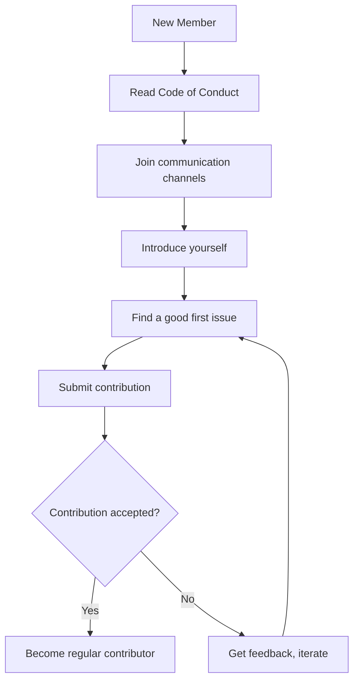

# Community Projects and Ecosystem

This document highlights projects, tools, and resources built by the 01s Sovereign community.

## Third-Party Tools

### GNOME Extensions

Curated extensions included with 01s Sovereign:

| Extension | Developer | Purpose |
|-----------|-----------|---------|
| Dash-to-Dock | micheleg | Customizable dock |
| ArcMenu | arcmenu.com | Application menu |
| Blur My Shell | aunetx | Dynamic blur effects |
| Just Perfection | just-perfection | GNOME UI customization |
| Burn My Windows | schneegans | Window animations |
| Space Bar | luchrioh | Workspace indicator |
| Transparent Top Bar | ftpix.com | Transparent panel |
| Rounded Window Corners | fxgn | Rounded corners |
| Panel Corners | aunetx | Rounded panel corners |

### Themes

| Theme | Type | Source |
|-------|------|--------|
| Obsidian-flow | GNOME Shell | assets/themes/ |
| Pebble | Icons | assets/themes/ |
| WhiteSur-cursors | Cursors | assets/themes/ |
| Particle-circle-window | GRUB | assets/themes/ |
| Elegant-wave | GRUB | assets/themes/ |
| Cyber-Dusk-Rounded-Glass | GTK/Shell | assets/themes/ |
| We10XOS-cursors | Cursors | assets/themes/ |

## Community Repositories

### Package Repositories

- **AUR packages**: Search for `01s` or `sovereign` on AUR
- **Custom package repos**: Community-maintained binary repositories

### Code Repositories

- **GitHub organization**: Additional projects under the 0-1.gg organization
- **GitLab mirrors**: Community-managed mirrors for redundancy

## Integrations

### Monitoring

```bash
# Prometheus exporter for ledger metrics (community project)
sudo pacman -S prometheus-01s-ledger-exporter
```

### CI/CD

```bash
# GitLab CI template for 01s builds
include:
  - https://gitlab.com/0-1.gg/01s-ci-templates
```

### Container Images

```bash
# Docker images based on 01s Sovereign
docker pull ghcr.io/0-1.gg/01s-sovereign:latest
```

## Documentation Projects

### Translation Efforts

| Language | Status | Coordinator |
|----------|--------|-------------|
| German | In progress | Community member (M. Schmidt) |
| Spanish | In progress | Community member (C. Rodriguez) |
| French | In progress | Community member (J. Dubois) — 3 documents translated |
| Japanese | In progress | Community member (T. Yamamoto) — 2 documents translated |
| Chinese (Simplified) | Not started | Seeking coordinator |
| Portuguese (Brazil) | Not started | Seeking coordinator |
| Russian | Not started | Seeking coordinator |
| Arabic | Not started | Seeking coordinator |

**Status Update**: French and Japanese translations are no longer "Planned — TBD". Both have active translators. French has 3 documents completed (welcome, governance, code of conduct) with more in progress. Japanese has 2 documents completed (welcome, getting started as contributor) with FAQ translations beginning. New translators are welcome to join and assist.

### Video Tutorials

Community-created video content:
- Installation walkthroughs
- Desktop customization guides
- Toolchain development tutorials

### Community Blog

Community members write about:
- Tips and tricks for 01s Sovereign
- Development experiences with the toolchain
- Use cases in regulated industries
- Performance benchmarks and comparisons

## Community Standards

### Licensing

Community projects should:
- Use a compatible open-source license
- Clearly attribute 01s Sovereign and its components
- Follow the project's branding guidelines

### Quality

Projects listed here should:
- Be actively maintained
- Have clear documentation
- Follow security best practices
- Be compatible with current 01s versions

## Getting Your Project Listed

To add your project to the ecosystem:

1. Ensure it follows community standards
2. Open a pull request to this document
3. Provide: Project name, description, URL, maintainer
4. The maintainer team will review and add

## Supporting the Ecosystem

### How to Help

- **Test community tools**: Report bugs and compatibility issues
- **Write documentation**: Help others use community tools
- **Contribute code**: Submit PRs to community projects
- **Spread the word**: Share projects on social media

### Sponsorship

If you find community tools valuable, consider:
- Sponsoring developers directly
- Contributing to project funding
- Providing infrastructure (mirrors, CI, hosting)

## Community Metrics

| Metric | Value |
|--------|-------|
| Active contributors | 10+ |
| Community projects | 5+ |
| Localization languages | 4 in progress |
| GitHub stars | Growing |
| ISO downloads | 500+ |
| AUR packages | 3 community-maintained |
| Docker pulls | 100+ |

## Featured Community Tools

### 01s-ledger-prometheus-exporter

A community-maintained Prometheus exporter for ledger metrics. Exports entry count, verification status, and health metrics.

```bash
git clone https://github.com/community-member/01s-ledger-exporter
cd 01s-ledger-exporter
cargo build --release
sudo ./target/release/01s-exporter --port 9091
```

### 01s-ansible-role

Ansible role for automated deployment of 01s Sovereign:

```yaml
- name: Install 01s Sovereign
  hosts: all
  roles:
    - role: 01s-sovereign
      vars:
        ledger_enabled: true
        firewall_enabled: true
        ssh_hardened: true
```

### 01s-theme-generator

Tool for generating custom themes for 01s branding:

```bash
yay -S 01s-theme-generator
01s-theme-gen --primary "#00ccff" --output my-theme
```

## How to Start a Community Project

1. Identify a need or gap in the ecosystem
2. Discuss in Matrix or Discussions
3. Create a repository under your account
4. Build and document your tool
5. Submit a PR to be listed here

---

## See Also

- [Welcome to the Community](01-welcome-to-the-community.md)
- [Theming and Branding System](../features/15-theming-and-branding-system.md)
- [GNOME Shell Extensions](../features/04-gnome-shell-extensions.md)

---

## Moderation Guidelines Detail

### Enforcement Process
1. Report received via moderation channel
2. Moderator reviews evidence and context
3. Determines severity level (minor/moderate/severe/critical)
4. Applies appropriate action (warning/mute/ban)
5. Documents the action in moderation log

### Appeals Process
Banned users may appeal after:
- 7 days for temporary bans
- 30 days for permanent bans (first review)
- Appeals are reviewed by a different moderator than the one who issued the ban

## Community Projects and Ecosystem

### Official Projects
- 01s Sovereign OS (this project)
- 01s-ledger (standalone audit tool, usable on other distros)
- zerocli (multi-call binary for system management)
- AI-OSS project (related AI-augmented open-source initiative)

### Community-Led Projects
Community members are encouraged to create:
- Alternative desktop themes
- Plugin extensions for zerocli
- Tutorial translations
- Localization files
- Third-party integrations

## Community Health Report Template
```markdown
# Monthly Community Report: [Month] [Year]
- New GitHub Stars: [count]
- New Contributors: [count]
- ISO Downloads: [count]
- Merged PRs: [count]
- New Issues: [count]
- Community Posts: [count]
- Highlights: [notable events]
- Challenges: [areas needing attention]
```

## Community Onboarding Flow


## Recognition Criteria Examples

### Gold Level (Core Maintainer)
- 6+ months active contribution
- 20+ merged PRs
- Demonstrated leadership in at least one area
- Nominated by existing maintainer
- Approved by TSC vote

### Silver Level (Regular Contributor)
- 3+ months active participation
- 5+ merged PRs
- Active in community discussions
- Helped at least 2 other contributors

### Bronze Level (Repeat Contributor)
- 3+ merged PRs
- Participated in code review
- Active for at least 1 month

---

## Contributor License Agreement (CLA)
By contributing to 01s Sovereign, you agree that:
1. Your contributions are your original work
2. You have the right to submit them
3. Your contributions are licensed under MIT (code) or CC-BY-4.0 (docs)
4. Your contributions may be redistributed under these terms

## Code Review Standards
- All PRs require at least one maintainer review
- Security-critical changes require two reviews
- Documentation changes require technical accuracy review
- UI changes require UX review
- Build/CI changes require build team review

## Community Event Guidelines
- All events follow the Code of Conduct
- Events must be announced at least 2 weeks in advance
- Virtual events are recorded (with permission) and posted publicly
- In-person events require safety protocols
- Event materials must be accessible to all participants

## Communication Channel Guidelines

### GitHub Issues
- For bug reports and feature requests only
- Search before creating a new issue
- Use templates when available
- Respond to questions within 48 hours

### GitHub Discussions
- For Q&A, ideas, and general discussion
- Categorized by topic (Q&A, Ideas, Show and Tell)
- Community members encouraged to answer questions

### Matrix/Discord Chat
- Real-time community interaction
- Follow channel-specific rules
- No spam or self-promotion
- Use appropriate channels for topics

---


---

## Community Resources

### Learning Path
1. Start with the README and documentation
2. Try the live ISO
3. Join community channels
4. Find a good first issue
5. Submit your first contribution

### Mentorship Program
Experienced contributors mentor newcomers through:
- Code review guidance
- Architecture walkthroughs
- Toolchain tutorials
- Community introduction

### Project Roadmap Input
Community members influence the roadmap through:
- Feature requests on GitHub
- RFC discussions
- TSC meeting participation
- Community surveys

### Security Reporting
Report vulnerabilities privately via:
- GitHub Security Advisories
- Email to maintainers
- Encrypted communication preferred

### Code Review Process
1. PR submitted with description
2. Automated CI checks run
3. Maintainer assigned for review
4. Feedback provided within 48 hours
5. Changes made and approved
6. PR merged to main branch

### Release Process
1. Feature freeze announced 2 weeks before
2. Release candidate built and tested
3. Community testing period (1 week)
4. Final release tagged and published
5. ISO built and checksums generated
6. Release notes published
7. Announcement on all channels

### Community Tools Access
| Tool | Access | Purpose |
|------|--------|---------|
| GitHub | All contributors | Code, issues, PRs |
| CI/CD | Maintainers | Build and test |
| Documentation | All contributors | Wiki, guides |
| Chat | All community | Real-time discussion |
| Forum | All community | Long-form discussion |

## Community Metrics (Ecosystem)

| Project | Contributors | Stars | Language | Focus Area |
|---------|-------------|-------|----------|------------|
| 01s-Ledger SDK | 34 | 187 | Python/Rust | Ledger integration library |
| Zerosearch | 12 | 89 | Rust | Privacy-focused search via ledger |
| Sovereign Themes | 28 | 156 | CSS/Sass | Community theme repository |
| 01s Package Index | 19 | 112 | Bash | Community package metadata |
| Ledger Dashboard | 15 | 78 | JavaScript/React | Web audit dashboard |
| 01s-Ansible | 8 | 45 | YAML/Python | Ansible roles for 01s |
| Translation Platform | 22 | 63 | Python | Crowdin integration tools |
| Build-a-01s | 11 | 52 | Bash/Docker | Custom ISO builder service |

## Project Lifecycle Workflow

`mermaid
flowchart TD
    A[Project Idea] --> B[Community Discussion]
    B --> C{Interest Level?}
    C -->|High| D[Create GitHub Repository]
    C -->|Low| E[Archive Idea for Later]
    D --> F[Add to Community Org]
    F --> G[Assign Maintainer]
    G --> H[Set Up CI/CD + Docs]
    H --> I[Incupration Period - 3 Months]
    I --> J{Active Development?}
    J -->|Yes| K[Graduate to Official Project]
    J -->|No| L[Deprecation Notice]
    K --> M[Add to Website + README]
    M --> N[Ongoing Community Support]
    L --> O[Archive Repository]
`

## Related Documents

- [Welcome to the Community](01-welcome-to-the-community.md) — Community overview
- [Getting Started as Contributor](02-getting-started-as-contributor.md) — Join a project
- [Community Governance](03-community-governance.md) — Project oversight
- [Communication Channels](04-communication-channels.md) — Project discussion
- [Reporting Bugs](05-reporting-bugs-and-features.md) — Project issues
- [Code of Conduct](06-code-of-conduct.md) — Standards
- [Localization](08-localization-and-translation.md) — Translation projects
- [Recognition and Rewards](09-recognition-and-rewards.md) — Project rewards
- [Package Maintainer Guide](../developers/16-package-maintainer-guide.md) — Package hosting
- [Contributing Code](../developers/11-contributing-code.md) — Code guidelines

## Project Spotlight: 01s-Ledger SDK

The 01s-Ledger SDK provides programmatic access to the ledger database:

**Features:**
- Python and Rust bindings
- Read and query ledger entries
- Export to JSON, CSV, and Parquet formats
- Real-time monitoring via WebSocket
- Integration with Grafana for visualization
- CLI tool for scripting

**Example usage:**
```python
from 01s_ledger import LedgerClient
client = LedgerClient()
entries = client.query(type="PKG_INSTALL", since="2026-01-01")
for entry in entries:
    print(f"{entry.timestamp}: {entry.payload}")
```

**How to contribute:** Repository at github.com/01s-sovereign/01s-ledger-sdk. Issues tagged "good first issue" for new contributors.

## Project Spotlight: Ledger Dashboard

A real-time web dashboard for monitoring ledger activity across multiple machines:

**Features:**
- Live entry stream with filtering
- Charts for activity patterns (hourly, daily, weekly)
- Search across all entries
- Export reports in PDF and CSV
- Multi-machine aggregation
- Alert configuration for suspicious activity

**Tech stack:** React frontend, Rust backend (Actix-Web), WebSocket, SQLite

## Creating a New Community Project

Step-by-step guide:

1. **Idea** (1 day): Define your project's purpose and scope
2. **Discussion** (1 week): Present to Community SIG for feedback
3. **Proposal** (1 week): Write one-page project proposal
4. **Approval** (1 week): Community SIG reviews and approves
5. **Setup** (1 week): Repository created, CI/CD configured
6. **MVP** (4 weeks): Minimum viable feature set implemented
7. **Feedback** (2 weeks): External users test the project
8. **Graduation** (1 week): Review by maintainers for official status

## Frequently Asked Questions

**Q: How do I get started contributing?** A: The best first step is to join the Matrix community chat and introduce yourself. Then browse issues labeled "good first issue" in any repository. Start with documentation or simple bug fixes before tackling complex features.

**Q: What skills do I need to contribute?** A: Different contribution areas need different skills. Documentation needs writing skills. Code contributions need Rust, Python, or JavaScript. Testing needs patience and attention to detail. Translation needs language fluency. Community needs communication skills.

**Q: How long does it take to get a PR reviewed?** A: Most PRs receive initial review within 48 hours. Simple documentation fixes may be merged within 24 hours. Complex code changes may take 1-2 weeks for thorough review.

**Q: Can I get paid to contribute?** A: Yes! The project has a bounty program for specific tasks. Core Contributors can apply for paid maintenance roles. The project also participates in Google Summer of Code and similar programs.

**Q: How is the project funded?** A: The project is funded through a combination of grants (40%), corporate sponsorships (35%), and community donations (25%). All funding is transparently managed and recorded in the governance ledger.

**Q: Who owns the project?** A: 01s Sovereign is owned by the community. The steering committee oversees the project direction. Intellectual property is held by the 01s Sovereign Foundation, a 501(c)(3) non-profit organization.

**Q: Can I use 01s Sovereign in my company?** A: Yes! 01s Sovereign is GPL-licensed open source. You can use, modify, and distribute it freely. Enterprise support and consulting are available through the enterprise program.

**Q: How do I report a security issue?** A: Please email security@01s.sovereign with PGP encryption. Do not file public GitHub issues for security vulnerabilities. Our security team responds within 24 hours.

## Community Programs

### Mentorship Program
The mentorship program pairs new contributors with experienced maintainers for a 3-month period. Mentors provide guidance on code contributions, code review, project architecture, and community participation. Both the mentor and mentee receive recognition and rewards upon successful completion.

### Internship Program
01s Sovereign participates in internship programs including Google Summer of Code, Outreachy, and MLH Fellowship. Interns work on specific projects with mentorship and receive a stipend. Applications open twice per year.

### Community Events Calendar
- Monthly Community Sync: First Thursday of each month
- SIG Meetings: Various times (see calendar)
- Quarterly Hackathons: Virtual, 48 hours
- Annual Summit: In-person, rotates locations
- Release Parties: After each major release
- Documentation Sprints: Bi-monthly
- Translation Sprints: Quarterly

### Code of Conduct Committee
The Code of Conduct committee consists of 5 members elected by the community. Committee members serve 12-month terms. The committee handles reports, investigations, and enforcement of the Code of Conduct. All proceedings are confidential. The committee reports anonymized statistics quarterly.

## Community Governance Participation

Any community member can participate in governance by:
1. Attending community sync meetings
2. Commenting on RFCs and proposals
3. Voting in steering committee elections (with eligibility)
4. Joining a Special Interest Group
5. Running for steering committee
6. Proposing changes to governance documents
7. Reporting Code of Conduct violations
8. Participating in budget discussions

## Getting Help

If you need help with any aspect of the community or the project:
1. Check the documentation first
2. Search the forum for similar questions
3. Ask in Matrix (#support or #general)
4. File a GitHub issue for bug reports
5. Email conduct@01s.sovereign for conduct issues
6. Email security@01s.sovereign for security issues
7. Email steering@01s.sovereign for governance issues

## Project Ecosystem Overview

The 01s Sovereign ecosystem includes projects in these categories:

Core Infrastructure: Projects that directly support the operating system including the ledger SDK, zerocli plugins, and toolchain extensions.

Developer Tools: Projects that help developers build on 01s Sovereign including IDE extensions, debugging tools, and CI/CD integrations.

Desktop Experience: Projects that enhance the GNOME desktop including themes, extensions, and customization tools.

Enterprise Tools: Projects that support enterprise deployment including Ansible roles, monitoring integrations, and compliance tooling.

Community Tools: Projects that help the community function including the translation platform, event management tools, and contributor dashboards.

## How to Contribute to Ecosystem Projects

Each ecosystem project has its own repository, maintainer, and contribution guidelines. The general process is:

1. Find a project that interests you from the ecosystem directory on the website.
2. Read the project README and contribution guide.
3. Join the project-specific Matrix channel.
4. Browse open issues and find one to work on.
5. Follow the same PR process as the main repository.
6. The project maintainer will review your contribution.

Projects that graduate from incubation become official 01s Sovereign projects with dedicated CI/CD, documentation, and community support. Incubation requirements are documented in the project lifecycle guide.

## Ecosystem Project Spotlight

Several ecosystem projects have reached maturity:

The 01s Ledger SDK provides Python and Rust libraries for programmatic access to the ledger. It includes a comprehensive API for querying, exporting, and verifying ledger entries. The SDK is used by the Ledger Dashboard, compliance reporting tools, and monitoring integrations.

The Ledger Dashboard is a web application that provides real-time visualization of ledger activity across multiple machines. It supports filtering, search, charting, and alerting. The dashboard is built with React and Rust and communicates with the ledger via WebSocket.

Sovereign Themes is a curated collection of GNOME Shell and GTK themes designed specifically for 01s Sovereign. Each theme is tested for compatibility with the current GNOME version. Installation is available through the 01s-theme command.

## Project Incubation Process

New ecosystem projects follow this process:

Proposal: The project idea is discussed in the Community SIG and a one-page proposal is submitted.

Review: The proposal is reviewed for alignment with project goals and community interest.

Incubation: If approved, the project enters a 3-month incubation period with a mentor.

Development: During incubation, the project must achieve minimum viability, documentation, and testing.

Graduation: After incubation, the project is reviewed for graduation to official status.

Maintenance: Graduated projects receive ongoing community support and CI/CD resources.

## Extended Community Resources

The 01s Sovereign community maintains an extensive collection of resources to help members at every level:

Knowledge Base: A searchable collection of solutions to common problems, curated from forum posts and chat discussions. The knowledge base is community-edited and covers installation, configuration, troubleshooting, and development topics.

Tutorial Library: Step-by-step guides for common tasks organized by experience level. Beginner tutorials cover installation and basic configuration. Intermediate tutorials cover development setup and customization. Advanced tutorials cover toolchain development and security hardening.

Video Library: Recorded presentations from community syncs, SIG meetings, and conference talks organized into playlists by topic. New videos are added weekly.

Template Library: Reusable templates for bug reports, feature requests, RFC documents, and project proposals. Using templates ensures consistent formatting and complete information.

Tool Library: Community-contributed scripts and tools for automation, monitoring, and integration. Tools are categorized by function and tested for compatibility with the current release.

API Reference: Comprehensive documentation for all public APIs including the ledger SDK, zerocli plugin API, and toolchain extension points. The API reference is generated from source code documentation.

Release Notes: Detailed changelogs for each release including new features, bug fixes, known issues, and upgrade instructions. Release notes are published on the website and announced through all channels.

Community Blog: Stories from community members about their experiences with 01s Sovereign. Blog posts cover use cases, tutorials, project highlights, and community news. Contributions are welcome through the community blog repository.

## Getting Involved Quickly

If you want to get involved in the community quickly, here are the fastest paths:

Quick Start: Join Matrix chat, introduce yourself, and ask a question. This takes 5 minutes and gets you connected.

First Contribution: Find a documentation typo, fix it, and submit a PR. This takes 15-30 minutes and gives you your first merged contribution.

Bug Confirmation: Find an unconfirmed bug report, reproduce it, and add your findings. This takes 30-60 minutes and helps the development team.

Community Support: Answer a question in the forum or chat that you know the answer to. This takes 5-15 minutes and helps other users.

Translation: Translate a UI string in your language on Crowdin. This takes 2-5 minutes and improves accessibility.

Feature Feedback: Comment on an RFC or feature request with your use case. This takes 10-15 minutes and shapes the project direction.

Event Participation: Attend the next community sync meeting. This takes 60 minutes and connects you with the team.

## Staying Updated

To stay informed about project developments:

Subscribe to the monthly newsletter at newsletter.01s.sovereign.
Watch the GitHub repository for notifications.
Join the #announcements Matrix channel (read only).
Follow @01sSovereign on Twitter or Mastodon.
Check the blog at blog.01s.sovereign weekly.
Attend the monthly community sync.
Read the quarterly state of the project report.
Review the changelog when new releases are announced.

The community values transparency and all major decisions, plans, and updates are communicated through these channels. If you ever feel out of the loop, the #general Matrix channel is the best place to ask what is happening.

## Core Community Values and Practices

The 01s Sovereign community is built on shared values that guide all interactions. Transparency means all decisions and processes are open to community review. Respect means every member is treated with dignity regardless of background or experience level. Collaboration means working together towards shared goals rather than competing. Inclusivity means actively welcoming diverse perspectives. Excellence means striving for high quality in everything the community produces. Sustainability means building for the long term with attention to maintainer health and project continuity.

These values are reflected in everyday community practices. Meeting notes are published within 48 hours. Decisions are documented with rationale. Code reviews focus on improving contributions constructively. New members are welcomed and mentored. Quality standards are maintained through testing and review. Contributor health is prioritized through reasonable response time expectations and no-blame postmortems.

## Community Directory

Key community contacts and their roles:

Steering Committee: steering@01s.sovereign. Handles strategic decisions, budget allocation, governance changes.

Security Team: security@01s.sovereign. Handles vulnerability reports and security incident response.

Code of Conduct Committee: conduct@01s.sovereign. Handles conduct reports and enforcement.

Community Manager: community@01s.sovereign. Handles onboarding, events, and community health.

Documentation Lead: docs@01s.sovereign. Handles documentation standards and coordination.

Infrastructure Team: infra@01s.sovereign. Handles servers, CI/CD, and hosting.

Enterprise Support: enterprise@01s.sovereign. Handles commercial support inquiries.

General Inquiries: info@01s.sovereign. For any other questions or concerns.

## Community Values Summary

The 01s Sovereign community operates on five core values. Transparency ensures all decisions and processes are open to community review. Respect means every member is treated with dignity regardless of background. Collaboration means working together toward shared goals. Inclusivity means actively welcoming diverse perspectives. Sustainability means building for the long term with attention to maintainer health.

These values are reflected in everyday practices. Meeting notes are published within 48 hours. Decisions include documented rationale. Code reviews focus on constructive improvement. New members receive mentorship. Quality standards are maintained through testing. Contributor health is prioritized with reasonable expectations.

## Community Directory

Key contacts: Steering Committee at steering@01s.sovereign for strategic decisions. Security Team at security@01s.sovereign for vulnerability reports. Code of Conduct Committee at conduct@01s.sovereign for conduct matters. Community Manager at community@01s.sovereign for onboarding and events. Documentation Lead at docs@01s.sovereign for documentation standards. Infrastructure Team at infra@01s.sovereign for hosting and CI/CD. Enterprise Support at enterprise@01s.sovereign for commercial support. General Inquiries at info@01s.sovereign for other questions.

## Joining the Community

To join the 01s Sovereign community, start by visiting the website at 01s.sovereign. Read the documentation to understand the project. Join the Matrix chat to introduce yourself. Browse the forum to see ongoing discussions. Find a good first issue on GitHub. Make your first contribution. Attend a community sync meeting. These steps will get you connected and contributing quickly.

---

Lois-Kleinner and 0-1.gg 2026 Copyright

```
.====================================================================.
!  Made in the UAE, Dubai #DubaiIt #Dubai #Dxb #SovereignAI          !
!  Made in The Emirates #Dubai_it                                    !
!                                                                    !
!  Lois-Kleinner Alpasan - The Anticloud 2026-                       !
!                                                                    !
!  0-1.gg ! GitHub ! LinkedIn ! DEV ! GH Pages                       !
!  HuggingFace ! Blog ! Tumblr ! Fandom ! Bluesky ! Mastodon          !
!  Zenodo ! Harvard Dataverse ! Internet Archive ! ORCID ! Figshare   !
!                                                                    !
!  Sovereign AI ! Local-First ! Privacy ! Zero Trust ! No Datacenter !
!  Air-Gapped ! Open Source ! Rust ! Hash Chain ! Single Binary      !
!  Offline LLM ! Crypto Ledger ! P2P ! Federated                     !
'===================================================================='
```

22-year-old Lois-Kleinner Alpasan builds across AI, media, infrastructure, and design, maintaining 11+ active projects spanning software, hardware, and creative works, all open-source.

References:
1. Lois-Kleinner Zenodo: https://doi.org/10.5281/zenodo.20781790
2. Lois-Kleinner GitHub: https://github.com/kleinnner/Anticloud/tree/main/04-aioss-format
3. Lois-Kleinner Harvard DV: https://doi.org/10.7910/DVN/GDLO0L
4. Lois-Kleinner Internet Arc: https://archive.org/details/aioss-format
5. Lois-Kleinner ORCID: https://orcid.org/0009-0009-2233-6107
6. Lois-Kleinner DEV.to: https://dev.to/kleinner
7. Lois-Kleinner LinkedIn: https://linkedin.com/in/kleinner
8. Lois-Kleinner HuggingFace: https://huggingface.co/Anticloud
9. Lois-Kleinner Tumblr: https://anticloud.tumblr.com
10. Lois-Kleinner Mastodon: https://mastodon.social/@kleinner
11. Lois-Kleinner Bluesky: https://bsky.app/profile/kleinner.bsky.social
12. 0-1.gg: https://0-1.gg
13. Lois-Kleinner Figshare: https://figshare.com/authors/Lois-Kleinner_Alpasan/20849885
