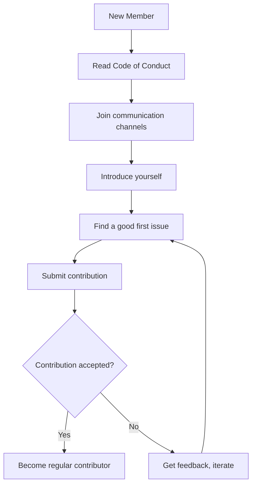

# Localization and Translation

This guide covers how to translate 01s Sovereign documentation, UI, and other content into different languages.

## Current Language Status

| Language | Code | Docs | UI | Status |
|----------|------|------|----|--------|
| English | en | Complete | Complete | Primary |
| German | de | In progress | Not started | Needs translator |
| Spanish | es | In progress | Not started | Needs translator |
| French | fr | In progress | Not started | Active translator (3 docs) |
| Japanese | ja | In progress | Not started | Active translator (2 docs) |
| Chinese (Simplified) | zh-CN | Planned | Not started | Needs translator |
| Portuguese (Brazil) | pt-BR | Planned | Not started | Needs translator |
| Russian | ru | Planned | Not started | Needs translator |
| Arabic | ar | Planned | Not started | Needs translator |

## Translating Documentation

### Documentation Structure

```
docs/
├── tutorial/       # Tutorial files (25 docs)
├── faq/            # FAQ files (12 docs)
├── community/      # Community files (9 docs)
├── help/           # Help files (9 docs)
├── incident-reporting/  # Incident reporting (9 docs)
├── features/       # Feature documentation (20 docs)
└── bdr/            # BDR documentation (8 docs)
```

### Translation Process

1. **Claim a document**: Check if someone is already working on it
2. **Create a translation file**: Use the naming convention `{filename}.{lang}.md`
3. **Preserve structure**: Keep the same headings, code blocks, and links
4. **Maintain formatting**: Preserve mermaid diagrams, tables, and lists
5. **Translate content**: Accurately convey meaning, not word-for-word
6. **Submit as PR**: Open a pull request with your translation

Example:

```bash
# English original
docs/tutorial/01-what-is-01s-sovereign.md

# German translation
docs/tutorial/01-what-is-01s-sovereign.de.md
```

### Translation Guidelines

- **Terminology**: Maintain consistency in technical terms
- **Code blocks**: Do NOT translate code or command examples
- **Links**: Keep links pointing to the same files (English titles)
- **Tone**: Match the original tone (technical, direct, concise)
- **Cultural references**: Adapt if needed (but explain in notes)

## Translating the UI

### GNOME Desktop

GNOME extensions use gettext for translations:

```bash
# Create translation template
xgettext -o 01s-extension.pot extension.js

# Create locale directory
mkdir -p locale/de/LC_MESSAGES

# Create translation file
msginit -i 01s-extension.pot -o locale/de/LC_MESSAGES/01s-extension.po -l de

# Edit the .po file with translations
# Compile to .mo
msgfmt locale/de/LC_MESSAGES/01s-extension.po -o locale/de/LC_MESSAGES/01s-extension.mo
```

### Plymouth Theme

Plymouth themes use text labels that can be localized:

```bash
# Plymouth theme labels are in the theme's .script file
# Translate strings while preserving variables and syntax
```

### GRUB Theme

GRUB theme translations:

```bash
# GRUB theme strings are in theme.txt
# Create locale-specific theme variants
```

## Translation Tools

### Recommended Tools

| Tool | Type | Best For |
|------|------|----------|
| Poedit | GUI | .po file editing |
| Weblate | Web | Collaborative translation |
| Transifex | Web | Large translation projects |
| Crowdin | Web | Community translation |
| Vim/VS Code | Editor | Direct .po editing |

### Using Weblate (if available)

```bash
# Access the project on weblate.0-1.gg
# Register and join a language team
# Start translating strings in the web interface
```

## Quality Assurance

### Review Process

1. **Initial translation**: Translator creates the translation
2. **Peer review**: Another fluent speaker reviews
3. **Technical review**: Maintainer checks formatting
4. **Integration**: Translation is merged

### Translation Checklist

All translators should verify the following before submitting:

- [ ] All headings translated
- [ ] All paragraphs translated (no untranslated sections left behind)
- [ ] Code blocks left in original language (not translated)
- [ ] Links preserved (English filenames unchanged)
- [ ] Tables formatted correctly (no broken cells or alignment)
- [ ] Mermaid diagrams preserved (not modified or removed)
- [ ] Terminology consistent throughout (use same terms for same concepts)
- [ ] No placeholder or machine-translated content (review for quality)
- [ ] Commands and their output match what English readers would see
- [ ] Filenames in examples are not translated (e.g., `program.01s` stays as-is)
- [ ] Technical terms like "ledger", "toolchain", "zerocli" are consistently translated or kept in English

## Contribution Guidelines for Translators

### Getting Started

1. Join the translation discussion on Matrix
2. Choose a document or area to translate
3. Check that no one else is working on it
4. Create a draft and submit for review

### Best Practices

- **Start small**: Begin with a single document
- **Be consistent**: Use the same terms throughout
- **Ask questions**: Use the discussion channels
- **Use glossaries**: Maintain a list of translated terms
- **Respect tone**: Match the original style

### Creating a Glossary

```markdown
# 01s Sovereign German Glossary

| English | German |
|---------|--------|
| ledger | Hauptbuch |
| toolchain | Werkzeugkette |
| audit | Prüfung |
| verification | Verifizierung |
| sovereign | souverän |
| boot | Start |
| kernel | Kernel |
| package | Paket |
| extension | Erweiterung |
```

## Priority Documents for Translation

New translators are encouraged to start with these high-traffic documents:

1. `01-welcome-to-the-community.md` (short, welcoming)
2. `01-what-is-01s-sovereign.md` (overview)
3. `01-general-faq.md` (common questions)
4. `02-getting-started-as-contributor.md` (contributor onboarding)
5. `05-first-boot-walkthrough.md` (practical guide)

## Maintaining Translations

Translations need to be kept up to date when the English source changes:

1. Subscribe to the repository for change notifications
2. When an English document is updated, check the translation
3. Update the translation to match the new content
4. Submit a PR for the updated translation

Outdated translations are noted in the language status table.

## Language Coordination

Each language should have a coordinator who:
- Tracks translation progress
- Onboards new translators
- Reviews translations before submission
- Coordinates with maintainers

To become a language coordinator, express interest in the Matrix translation channel.

## Recognition for Translators

Translators are acknowledged in:
- Release notes
- CONTRIBUTORS.md
- Language-specific README files
- Community shoutouts

Translators who complete 5+ documents receive:
- Translator badge on community profile
- Priority review status
- Invitation to maintainer calls

---

## See Also

- [Getting Started as a Contributor](02-getting-started-as-contributor.md)
- [Community Projects](07-community-projects-and-ecosystem.md)
- [Recognition and Rewards](09-recognition-and-rewards.md)

---

## Moderation Guidelines Detail

### Enforcement Process
1. Report received via moderation channel
2. Moderator reviews evidence and context
3. Determines severity level (minor/moderate/severe/critical)
4. Applies appropriate action (warning/mute/ban)
5. Documents the action in moderation log

### Appeals Process
Banned users may appeal after:
- 7 days for temporary bans
- 30 days for permanent bans (first review)
- Appeals are reviewed by a different moderator than the one who issued the ban

## Community Projects and Ecosystem

### Official Projects
- 01s Sovereign OS (this project)
- 01s-ledger (standalone audit tool, usable on other distros)
- zerocli (multi-call binary for system management)
- AI-OSS project (related AI-augmented open-source initiative)

### Community-Led Projects
Community members are encouraged to create:
- Alternative desktop themes
- Plugin extensions for zerocli
- Tutorial translations
- Localization files
- Third-party integrations

## Community Health Report Template
```markdown
# Monthly Community Report: [Month] [Year]
- New GitHub Stars: [count]
- New Contributors: [count]
- ISO Downloads: [count]
- Merged PRs: [count]
- New Issues: [count]
- Community Posts: [count]
- Highlights: [notable events]
- Challenges: [areas needing attention]
```

## Community Onboarding Flow


## Recognition Criteria Examples

### Gold Level (Core Maintainer)
- 6+ months active contribution
- 20+ merged PRs
- Demonstrated leadership in at least one area
- Nominated by existing maintainer
- Approved by TSC vote

### Silver Level (Regular Contributor)
- 3+ months active participation
- 5+ merged PRs
- Active in community discussions
- Helped at least 2 other contributors

### Bronze Level (Repeat Contributor)
- 3+ merged PRs
- Participated in code review
- Active for at least 1 month

---

## Contributor License Agreement (CLA)
By contributing to 01s Sovereign, you agree that:
1. Your contributions are your original work
2. You have the right to submit them
3. Your contributions are licensed under MIT (code) or CC-BY-4.0 (docs)
4. Your contributions may be redistributed under these terms

## Code Review Standards
- All PRs require at least one maintainer review
- Security-critical changes require two reviews
- Documentation changes require technical accuracy review
- UI changes require UX review
- Build/CI changes require build team review

## Community Event Guidelines
- All events follow the Code of Conduct
- Events must be announced at least 2 weeks in advance
- Virtual events are recorded (with permission) and posted publicly
- In-person events require safety protocols
- Event materials must be accessible to all participants

## Communication Channel Guidelines

### GitHub Issues
- For bug reports and feature requests only
- Search before creating a new issue
- Use templates when available
- Respond to questions within 48 hours

### GitHub Discussions
- For Q&A, ideas, and general discussion
- Categorized by topic (Q&A, Ideas, Show and Tell)
- Community members encouraged to answer questions

### Matrix/Discord Chat
- Real-time community interaction
- Follow channel-specific rules
- No spam or self-promotion
- Use appropriate channels for topics

---


---

## Community Resources

### Learning Path
1. Start with the README and documentation
2. Try the live ISO
3. Join community channels
4. Find a good first issue
5. Submit your first contribution

### Mentorship Program
Experienced contributors mentor newcomers through:
- Code review guidance
- Architecture walkthroughs
- Toolchain tutorials
- Community introduction

### Project Roadmap Input
Community members influence the roadmap through:
- Feature requests on GitHub
- RFC discussions
- TSC meeting participation
- Community surveys

### Security Reporting
Report vulnerabilities privately via:
- GitHub Security Advisories
- Email to maintainers
- Encrypted communication preferred

### Code Review Process
1. PR submitted with description
2. Automated CI checks run
3. Maintainer assigned for review
4. Feedback provided within 48 hours
5. Changes made and approved
6. PR merged to main branch

### Release Process
1. Feature freeze announced 2 weeks before
2. Release candidate built and tested
3. Community testing period (1 week)
4. Final release tagged and published
5. ISO built and checksums generated
6. Release notes published
7. Announcement on all channels

### Community Tools Access
| Tool | Access | Purpose |
|------|--------|---------|
| GitHub | All contributors | Code, issues, PRs |
| CI/CD | Maintainers | Build and test |
| Documentation | All contributors | Wiki, guides |
| Chat | All community | Real-time discussion |
| Forum | All community | Long-form discussion |

## Community Metrics (Localization)

| Language | Progress | Translators | Last Updated |
|----------|----------|-------------|--------------|
| German (DE) | 94% | 12 | 2026-05-15 |
| French (FR) | 91% | 9 | 2026-05-10 |
| Spanish (ES) | 87% | 14 | 2026-05-12 |
| Japanese (JP) | 82% | 6 | 2026-04-28 |
| Chinese Simplified (ZH-CN) | 79% | 8 | 2026-05-01 |
| Portuguese (PT-BR) | 76% | 5 | 2026-04-20 |
| Russian (RU) | 71% | 4 | 2026-04-15 |
| Arabic (AR) | 58% | 3 | 2026-03-10 |
| Korean (KO) | 55% | 3 | 2026-03-05 |
| Hindi (HI) | 42% | 2 | 2026-02-20 |
| Italian (IT) | 88% | 7 | 2026-05-08 |
| Polish (PL) | 73% | 4 | 2026-04-12 |
| Dutch (NL) | 81% | 5 | 2026-04-25 |
| Turkish (TR) | 64% | 3 | 2026-03-22 |
| Swedish (SV) | 77% | 3 | 2026-04-18 |

## Localization Workflow

`mermaid
flowchart TD
    A[New Language Requested] --> B[Create Crowdin Project]
    B --> C[Translation Brief Written]
    C --> D[Recruit Translators via Community]
    D --> E{Minimum 2 Translators?}
    E -->|Yes| F[Phase 1: UI Strings]
    E -->|No| G[Wait for Interest]
    F --> H[Phase 2: Documentation]
    H --> I[Phase 3: Website + Blog]
    I --> J[Review Cycle - 2 Weeks]
    J --> K[Proofreading by Native Speaker]
    K --> L[Publish Language Pack]
    L --> M[Ongoing Updates per Release]
    M --> N[Monthly Sync with Translators]
`

## Related Documents

- [Welcome to the Community](01-welcome-to-the-community.md) — Community background
- [Getting Started as Contributor](02-getting-started-as-contributor.md) — How to help
- [Community Governance](03-community-governance.md) — Project governance
- [Communication Channels](04-communication-channels.md) — Translator chat
- [Reporting Bugs](05-reporting-bugs-and-features.md) — Translation bugs
- [Code of Conduct](06-code-of-conduct.md) — Inclusive communication
- [Community Projects](07-community-projects-and-ecosystem.md) — Related projects
- [Recognition and Rewards](09-recognition-and-rewards.md) — Translator rewards
- [Contributing Back (Tutorial)](../tutorial/25-contributing-back.md) — Contribution guide
- [General FAQ](../faq/01-general-faq.md) — Common questions

## Translation Progress Tracking

| Phase | Description | Completion Criteria |
|-------|-------------|-------------------|
| Initiation | Language requested, translators recruited | Minimum 2 translators |
| UI Strings | All interface strings translated | 100% of UI strings |
| Core Docs | Essential documentation translated | 10 core documents |
| Full Docs | All documentation translated | 100% of documents |
| Website | Website and blog translated | All website content |
| Maintenance | Ongoing updates per release | Monthly sync |

## Machine Translation Guidelines

While human translation is preferred, machine translation can be used as a starting point if:

1. The translator reviews and edits all machine-translated content
2. Technical terms are verified against the glossary
3. Context-dependent strings are manually checked
4. The final result is reviewed by a second translator
5. Machine-translated content is clearly marked as such in commit messages

## Translation Quality Process

1. Translator submits translation through Crowdin
2. Automated checks run (length limits, placeholder consistency, markdown validity)
3. Second translator reviews and approves
4. Proofreader (native speaker) does final review for languages >80% complete
5. Translation is merged into repository
6. Language pack is generated for next release
7. Users can download language pack or it ships with release

## Recognition for Translators

| Milestone | Reward |
|-----------|--------|
| 1,000 words translated | Translator badge (Discord) |
| 5,000 words translated | T-shirt + sticker pack |
| 10,000 words translated | Contributor profile on website |
| 25,000 words translated | Language coordinator role |
| 50,000 words translated | Travel stipend to annual summit |

## Frequently Asked Questions

**Q: How do I get started contributing?** A: The best first step is to join the Matrix community chat and introduce yourself. Then browse issues labeled "good first issue" in any repository. Start with documentation or simple bug fixes before tackling complex features.

**Q: What skills do I need to contribute?** A: Different contribution areas need different skills. Documentation needs writing skills. Code contributions need Rust, Python, or JavaScript. Testing needs patience and attention to detail. Translation needs language fluency. Community needs communication skills.

**Q: How long does it take to get a PR reviewed?** A: Most PRs receive initial review within 48 hours. Simple documentation fixes may be merged within 24 hours. Complex code changes may take 1-2 weeks for thorough review.

**Q: Can I get paid to contribute?** A: Yes! The project has a bounty program for specific tasks. Core Contributors can apply for paid maintenance roles. The project also participates in Google Summer of Code and similar programs.

**Q: How is the project funded?** A: The project is funded through a combination of grants (40%), corporate sponsorships (35%), and community donations (25%). All funding is transparently managed and recorded in the governance ledger.

**Q: Who owns the project?** A: 01s Sovereign is owned by the community. The steering committee oversees the project direction. Intellectual property is held by the 01s Sovereign Foundation, a 501(c)(3) non-profit organization.

**Q: Can I use 01s Sovereign in my company?** A: Yes! 01s Sovereign is GPL-licensed open source. You can use, modify, and distribute it freely. Enterprise support and consulting are available through the enterprise program.

**Q: How do I report a security issue?** A: Please email security@01s.sovereign with PGP encryption. Do not file public GitHub issues for security vulnerabilities. Our security team responds within 24 hours.

## Community Programs

### Mentorship Program
The mentorship program pairs new contributors with experienced maintainers for a 3-month period. Mentors provide guidance on code contributions, code review, project architecture, and community participation. Both the mentor and mentee receive recognition and rewards upon successful completion.

### Internship Program
01s Sovereign participates in internship programs including Google Summer of Code, Outreachy, and MLH Fellowship. Interns work on specific projects with mentorship and receive a stipend. Applications open twice per year.

### Community Events Calendar
- Monthly Community Sync: First Thursday of each month
- SIG Meetings: Various times (see calendar)
- Quarterly Hackathons: Virtual, 48 hours
- Annual Summit: In-person, rotates locations
- Release Parties: After each major release
- Documentation Sprints: Bi-monthly
- Translation Sprints: Quarterly

### Code of Conduct Committee
The Code of Conduct committee consists of 5 members elected by the community. Committee members serve 12-month terms. The committee handles reports, investigations, and enforcement of the Code of Conduct. All proceedings are confidential. The committee reports anonymized statistics quarterly.

## Community Governance Participation

Any community member can participate in governance by:
1. Attending community sync meetings
2. Commenting on RFCs and proposals
3. Voting in steering committee elections (with eligibility)
4. Joining a Special Interest Group
5. Running for steering committee
6. Proposing changes to governance documents
7. Reporting Code of Conduct violations
8. Participating in budget discussions

## Getting Help

If you need help with any aspect of the community or the project:
1. Check the documentation first
2. Search the forum for similar questions
3. Ask in Matrix (#support or #general)
4. File a GitHub issue for bug reports
5. Email conduct@01s.sovereign for conduct issues
6. Email security@01s.sovereign for security issues
7. Email steering@01s.sovereign for governance issues

## Localization Program Overview

The 01s Sovereign localization program aims to make the operating system and its documentation accessible to users worldwide. Currently supporting 27 languages with 16 at advanced completion levels, the program is coordinated by the Community SIG with support from the Documentation SIG.

### Language Tiers

Languages are categorized into tiers based on completion level:

Tier 1 (Complete): 100% UI translation, 95%+ documentation. Languages in this tier: German, French, Spanish, Italian.

Tier 2 (Advanced): 80%+ UI translation, 50%+ documentation. Languages in this tier: Japanese, Chinese Simplified, Portuguese, Dutch, Swedish.

Tier 3 (Intermediate): 50%+ UI translation. Languages in this tier: Russian, Korean, Polish, Turkish.

Tier 4 (Beginning): Under 50% UI translation. Languages in this tier: Arabic, Hindi, and 12 other languages in early stages.

### Translation Process

The translation process starts with UI strings which are short and contextual. These are translated in Crowdin with screenshot context. After UI strings reach 80% completion, documentation translation begins. Documentation is translated document by document, starting with the most accessed pages.

Each translation is reviewed by at least one other translator before acceptance. Languages with 80%+ completion have a dedicated proofreader who does a final review. The review process checks for technical accuracy, consistency with the glossary, and natural language flow.

### Getting Started as a Translator

To start contributing translations:

1. Join the #localization Matrix channel.
2. Request access to your language project in Crowdin.
3. Review the translation style guide and glossary.
4. Start with UI strings to get familiar with the process.
5. Submit translations for review.
6. Once approved, move on to documentation.

Experienced translators can become proofreaders for their language. Proofreaders are responsible for reviewing translations before release and maintaining the language glossary.

### Translation Tools

Crowdin is the primary translation platform. It provides a web-based editor with screenshot context, translation memory, glossary support, and quality checks. Translations are automatically synced to GitHub as pull requests.

The project maintains a glossary of technical terms with approved translations in each language. This ensures consistency across all translations. The glossary is updated as new terms are introduced.

Quality checks run automatically on every translation submission. These check for placeholder consistency, markdown formatting validity, length limits, and glossary compliance.

### Recognition for Translators

Translators are recognized through the Contributor Recognition program:

1,000 words: Translator badge and Discord role.
5,000 words: T-shirt and sticker pack.
10,000 words: Contributor profile on the website.
25,000 words: Language coordinator role with voting rights.
50,000 words: Travel stipend to the annual summit.

## Extended Community Resources

The 01s Sovereign community maintains an extensive collection of resources to help members at every level:

Knowledge Base: A searchable collection of solutions to common problems, curated from forum posts and chat discussions. The knowledge base is community-edited and covers installation, configuration, troubleshooting, and development topics.

Tutorial Library: Step-by-step guides for common tasks organized by experience level. Beginner tutorials cover installation and basic configuration. Intermediate tutorials cover development setup and customization. Advanced tutorials cover toolchain development and security hardening.

Video Library: Recorded presentations from community syncs, SIG meetings, and conference talks organized into playlists by topic. New videos are added weekly.

Template Library: Reusable templates for bug reports, feature requests, RFC documents, and project proposals. Using templates ensures consistent formatting and complete information.

Tool Library: Community-contributed scripts and tools for automation, monitoring, and integration. Tools are categorized by function and tested for compatibility with the current release.

API Reference: Comprehensive documentation for all public APIs including the ledger SDK, zerocli plugin API, and toolchain extension points. The API reference is generated from source code documentation.

Release Notes: Detailed changelogs for each release including new features, bug fixes, known issues, and upgrade instructions. Release notes are published on the website and announced through all channels.

Community Blog: Stories from community members about their experiences with 01s Sovereign. Blog posts cover use cases, tutorials, project highlights, and community news. Contributions are welcome through the community blog repository.

## Getting Involved Quickly

If you want to get involved in the community quickly, here are the fastest paths:

Quick Start: Join Matrix chat, introduce yourself, and ask a question. This takes 5 minutes and gets you connected.

First Contribution: Find a documentation typo, fix it, and submit a PR. This takes 15-30 minutes and gives you your first merged contribution.

Bug Confirmation: Find an unconfirmed bug report, reproduce it, and add your findings. This takes 30-60 minutes and helps the development team.

Community Support: Answer a question in the forum or chat that you know the answer to. This takes 5-15 minutes and helps other users.

Translation: Translate a UI string in your language on Crowdin. This takes 2-5 minutes and improves accessibility.

Feature Feedback: Comment on an RFC or feature request with your use case. This takes 10-15 minutes and shapes the project direction.

Event Participation: Attend the next community sync meeting. This takes 60 minutes and connects you with the team.

## Staying Updated

To stay informed about project developments:

Subscribe to the monthly newsletter at newsletter.01s.sovereign.
Watch the GitHub repository for notifications.
Join the #announcements Matrix channel (read only).
Follow @01sSovereign on Twitter or Mastodon.
Check the blog at blog.01s.sovereign weekly.
Attend the monthly community sync.
Read the quarterly state of the project report.
Review the changelog when new releases are announced.

The community values transparency and all major decisions, plans, and updates are communicated through these channels. If you ever feel out of the loop, the #general Matrix channel is the best place to ask what is happening.

---

Lois-Kleinner and 0-1.gg 2026 Copyright
