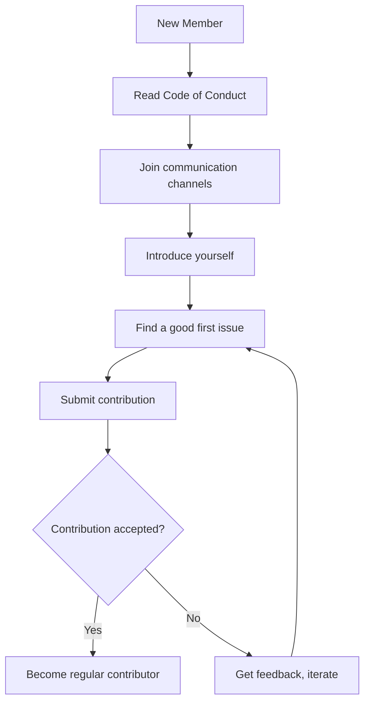

# Recognition and Rewards

This document outlines how contributors to 01s Sovereign are recognized and rewarded.

## Contributor Levels

### Level 1: First-Time Contributor

**Criteria**: One accepted contribution (code, docs, translation, etc.)

**Recognition**:
- Listed in CONTRIBUTORS.md
- Mentioned in release notes

### Level 2: Regular Contributor

**Criteria**: 5+ contributions over 3+ months

**Recognition**:
- Listed in CONTRIBUTORS.md with badge
- Access to contributor chat room
- Invitation to monthly community calls

### Level 3: Major Contributor

**Criteria**: 20+ contributions or significant feature work

**Recognition**:
- Listed in CONTRIBUTORS.md with ++ badge
- Contributor profile on project website
- Priority review for pull requests
- Direct access to maintainers

### Level 4: Core Contributor

**Criteria**: 50+ contributions and demonstrated expertise

**Recognition**:
- Maintainer nomination eligibility
- Voting rights in BDRs
- Project swag package
- Speaking opportunity coordination

### Level 5: Maintainer

**Criteria**: Nominated and approved by existing maintainers

**Recognition**:
- Commit access to repository
- Maintainer role on GitHub
- Listed on project website as maintainer
- Decision-making authority

## Recognition Types

### Digital Badges

Badges displayed on community profiles:

| Badge | Criteria |
|-------|----------|
| First PR | First accepted pull request |
| Bug Hunter | 10 verified bug reports |
| Doc Writer | 5 documentation contributions |
| Translator | Translation of 1+ document |
| Code Warrior | 10 code contributions |
| Reviewer | 20+ PR reviews |
| Maintainer | Nominated maintainer |
| Security Guardian | 1+ security vulnerability reported |
| Community Helper | 50+ helpful answers on forums |
| Toolchain Titan | 5+ toolchain contributions |

### Physical Rewards

Available for significant contributions:

| Reward | Level Required |
|--------|---------------|
| Stickers | Level 2+ |
| T-shirt | Level 3+ |
| Hoodie | Level 4+ |
| Hardware (Raspberry Pi, etc.) | Level 5 or special achievement |

### Speaking Opportunities

Recognized contributors may be offered:
- Conference presentation slots
- Podcast appearances
- Webinar hosting
- Workshop leading

## Quarterly Awards

| Award | Description | Selection |
|-------|-------------|-----------|
| Best Bug Report | Most detailed and actionable bug report | Community vote |
| Documentation Hero | Most improved documentation | Maintainer selection |
| Code Contribution of the Quarter | Most impactful code contribution | Maintainer selection |
| Community Helper | Most helpful community member | Community vote |
| Security Guardian | Best security contribution | Maintainer selection |

## Annual Awards

Presented at the annual community summit:

| Award | Description |
|-------|-------------|
| Sovereign of the Year | Overall most valuable contributor |
| Toolchain Titan | Best toolchain contribution |
| Ledger Legend | Best ledger/audit contribution |
| Desktop Diplomat | Best desktop/UI contribution |
| Doc Sage | Best documentation contribution |

## Sponsorship

### Community Sponsorship

Community members can sponsor the project via:
- GitHub Sponsors
- Open Collective
- Patreon

Sponsors are recognized on:
- Project README
- Website sponsors page
- Release announcements

### Corporate Sponsorship

Organizations can sponsor at higher tiers:
- Infrastructure (CI/CD, hosting, mirrors)
- Development (funding specific features)
- Events (community summit, hackathons)

Corporate sponsors receive:
- Logo on project website
- Mention in release notes
- Priority support channels

### Sponsorship Tiers

| Tier | Amount | Benefits |
|------|--------|----------|
| Bronze | $50/month | Name in README |
| Silver | $200/month | Logo on website |
| Gold | $500/month | Logo + priority support |
| Platinum | $1000+/month | All of above + feature sponsorship |

## Self-Nomination

Contributors who believe they meet a level's criteria can self-nominate by:
1. Opening an issue in the repository
2. Listing their contributions
3. Requesting evaluation

The maintainer team will review and respond within 2 weeks.

## Transparency

All recognition decisions are:
- Documented in the repository
- Made by maintainer consensus
- Open to appeal
- Reviewed quarterly

## Contribution Tracking

Contributions are tracked via:
- GitHub contributions graph
- CHANGELOG entries
- Issue/PR history
- Community forum activity
- Translation platform stats

## Milestone Celebrations

When the project reaches key milestones, contributors are celebrated:

| Milestone | Celebration |
|-----------|-------------|
| 100 commits | Special mention in release notes |
| 10 contributors | Virtual team photo |
| 1000 downloads | Community stream/party |
| 1.0.0 release | Major celebration with swag |
| 1 year anniversary | Retrospective and awards |

## How to Acknowledge Others

If you see someone doing great work:
1. Thank them publicly in Matrix or Discussions
2. Tag a maintainer to ensure it's noted
3. Nominate them for a quarterly award
4. Write a community spotlight post

## Community Spotlight

Regular community spotlight posts feature:
- New contributors and their work
- Interesting projects built on 01s
- Tips and tricks from experienced users
- Translation and documentation highlights

---

## See Also

- [Getting Started as a Contributor](02-getting-started-as-contributor.md)
- [Community Governance](03-community-governance.md)
- [Welcome to the Community](01-welcome-to-the-community.md)

---

## Moderation Guidelines Detail

### Enforcement Process
1. Report received via moderation channel
2. Moderator reviews evidence and context
3. Determines severity level (minor/moderate/severe/critical)
4. Applies appropriate action (warning/mute/ban)
5. Documents the action in moderation log

### Appeals Process
Banned users may appeal after:
- 7 days for temporary bans
- 30 days for permanent bans (first review)
- Appeals are reviewed by a different moderator than the one who issued the ban

## Community Projects and Ecosystem

### Official Projects
- 01s Sovereign OS (this project)
- 01s-ledger (standalone audit tool, usable on other distros)
- zerocli (multi-call binary for system management)
- AI-OSS project (related AI-augmented open-source initiative)

### Community-Led Projects
Community members are encouraged to create:
- Alternative desktop themes
- Plugin extensions for zerocli
- Tutorial translations
- Localization files
- Third-party integrations

## Community Health Report Template
```markdown
# Monthly Community Report: [Month] [Year]
- New GitHub Stars: [count]
- New Contributors: [count]
- ISO Downloads: [count]
- Merged PRs: [count]
- New Issues: [count]
- Community Posts: [count]
- Highlights: [notable events]
- Challenges: [areas needing attention]
```

## Community Onboarding Flow


## Recognition Criteria Examples

### Gold Level (Core Maintainer)
- 6+ months active contribution
- 20+ merged PRs
- Demonstrated leadership in at least one area
- Nominated by existing maintainer
- Approved by TSC vote

### Silver Level (Regular Contributor)
- 3+ months active participation
- 5+ merged PRs
- Active in community discussions
- Helped at least 2 other contributors

### Bronze Level (Repeat Contributor)
- 3+ merged PRs
- Participated in code review
- Active for at least 1 month

---

## Contributor License Agreement (CLA)
By contributing to 01s Sovereign, you agree that:
1. Your contributions are your original work
2. You have the right to submit them
3. Your contributions are licensed under MIT (code) or CC-BY-4.0 (docs)
4. Your contributions may be redistributed under these terms

## Code Review Standards
- All PRs require at least one maintainer review
- Security-critical changes require two reviews
- Documentation changes require technical accuracy review
- UI changes require UX review
- Build/CI changes require build team review

## Community Event Guidelines
- All events follow the Code of Conduct
- Events must be announced at least 2 weeks in advance
- Virtual events are recorded (with permission) and posted publicly
- In-person events require safety protocols
- Event materials must be accessible to all participants

## Communication Channel Guidelines

### GitHub Issues
- For bug reports and feature requests only
- Search before creating a new issue
- Use templates when available
- Respond to questions within 48 hours

### GitHub Discussions
- For Q&A, ideas, and general discussion
- Categorized by topic (Q&A, Ideas, Show and Tell)
- Community members encouraged to answer questions

### Matrix/Discord Chat
- Real-time community interaction
- Follow channel-specific rules
- No spam or self-promotion
- Use appropriate channels for topics

---


---

## Community Resources

### Learning Path
1. Start with the README and documentation
2. Try the live ISO
3. Join community channels
4. Find a good first issue
5. Submit your first contribution

### Mentorship Program
Experienced contributors mentor newcomers through:
- Code review guidance
- Architecture walkthroughs
- Toolchain tutorials
- Community introduction

### Project Roadmap Input
Community members influence the roadmap through:
- Feature requests on GitHub
- RFC discussions
- TSC meeting participation
- Community surveys

### Security Reporting
Report vulnerabilities privately via:
- GitHub Security Advisories
- Email to maintainers
- Encrypted communication preferred

### Code Review Process
1. PR submitted with description
2. Automated CI checks run
3. Maintainer assigned for review
4. Feedback provided within 48 hours
5. Changes made and approved
6. PR merged to main branch

### Release Process
1. Feature freeze announced 2 weeks before
2. Release candidate built and tested
3. Community testing period (1 week)
4. Final release tagged and published
5. ISO built and checksums generated
6. Release notes published
7. Announcement on all channels

### Community Tools Access
| Tool | Access | Purpose |
|------|--------|---------|
| GitHub | All contributors | Code, issues, PRs |
| CI/CD | Maintainers | Build and test |
| Documentation | All contributors | Wiki, guides |
| Chat | All community | Real-time discussion |
| Forum | All community | Long-form discussion |

## Community Metrics (Rewards Program)

| Reward Tier | Criteria | Benefits | Active Members |
|-------------|----------|----------|----------------|
| Contributor | 1+ PR merged | Badge + Discord role | 287 |
| Active Contributor | 10+ PRs merged | Badge + Swag pack | 94 |
| Core Contributor | 50+ PRs + nomination | Voting rights + Travel stipend | 47 |
| Maintainer | Appointment by committee | Merge access + Decision vote | 12 |
| Translator | 5,000+ words translated | Badge + Software license key | 23 |
| Documentation Star | 3+ major doc PRs | Badge + Citation in release notes | 31 |
| Bug Hunter | 10+ valid bug reports | Badge + Priority support | 18 |
| Community Mentor | 3+ mentees graduated | Badge + Recognition ceremony | 15 |

## Reward Accumulation Flow

`mermaid
flowchart TD
    A[Contribution Made] --> B[Automatically Tracked by Bot]
    B --> C[Points Calculated]
    C --> D{Threshold Reached?}
    D -->|Yes| E[Notification Sent]
    D -->|No| F[Points Accumulated for Next Tier]
    E --> G[Tier Badge Assigned]
    G --> H[Monthly Reward Distribution]
    H --> I{Physical Reward?}
    I -->|Yes| J[Shipping Address Requested]
    I -->|No| K[Digital Reward Delivered]
    J --> L[Swag Pack Shipped]
    K --> M[License / Badge Activated]
    L --> N[Contribution Logged in Ledger]
    M --> N
`

## Related Documents

- [Welcome to the Community](01-welcome-to-the-community.md) — Community info
- [Getting Started as Contributor](02-getting-started-as-contributor.md) — Start contributing
- [Community Governance](03-community-governance.md) — Reward policies
- [Communication Channels](04-communication-channels.md) — Reward announcements
- [Reporting Bugs](05-reporting-bugs-and-features.md) — Bug bounty details
- [Code of Conduct](06-code-of-conduct.md) — Standards
- [Community Projects](07-community-projects-and-ecosystem.md) — Project rewards
- [Localization](08-localization-and-translation.md) — Translation rewards
- [Contributing Code](../developers/11-contributing-code.md) — Code contributions
- [Community Growth BDR](../bdr/08-community-growth-bdr.md) — Growth strategy

## Rewards Fulfillment Details

### Digital Rewards
- Badges: Automatically assigned via community bot within 24 hours of milestone
- Discord roles: Updated within 1 hour
- Website profile: Updated within 1 week
- Priority support: Activation within 2 business days
- License keys: Emailed within 48 hours

### Physical Rewards
- Sticker packs: Shipped within 1 week (worldwide)
- T-shirts: Size survey sent, shipped within 2 weeks
- Hoodies: Size survey sent, shipped within 3 weeks
- Notebooks: Personalized, shipped within 2 weeks
- Travel stipends: Reimbursed within 30 days of expense submission

### Shipping Information
- Stickers: Free shipping worldwide (no tracking)
- T-shirts: Free shipping worldwide (tracked)
- Hoodies: Free shipping (tracked, available in select regions)
- International: Customs fees may apply (not covered)

## Community Events and Awards

### Annual Summit
- Location: Rotates (2024: Berlin, 2025: Montreal, 2026: Tokyo)
- Duration: 3 days
- Attendees: ~100 (contributors + invited guests)
- Travel stipends: Available for all Core Contributors
- Agenda: Talks, workshops, hacking sessions, awards ceremony

### Hackathons
- Frequency: Quarterly (virtual)
- Duration: 48 hours
- Theme: Varies (security, desktop, toolchain, documentation)
- Prizes: $500 for winning team, $200 for runner-up
- Judging: Based on impact, quality, and community votes

### Quarterly Awards
| Award | Criteria | Prize |
|-------|----------|-------|
| Best Bug Fix | Most impactful bug fix | $200 + badge |
| Best Feature | Most innovative new feature | $500 + badge |
| Best Doc | Most improved documentation | Sticker pack + badge |
| Community Choice | Voted by community members | Trophy + badge |
| Rising Star | Best new contributor | Hoodie + badge |

## Annual Award Categories

| Award | Criteria | Prize |
|-------|----------|-------|
| Contributor of the Year | Most impactful overall | $2,000 + trophy + travel |
| Rising Star | Best new contributor (joined <12 months ago) | $500 + hoodie |
| Community Champion | Outstanding support and mentorship | $500 + trophy |
| Innovation Award | Most creative technical contribution | $1,000 + trophy |
| Documentation Excellence | Best documentation improvement | $300 + hoodie |

## Frequently Asked Questions

**Q: How do I get started contributing?** A: The best first step is to join the Matrix community chat and introduce yourself. Then browse issues labeled "good first issue" in any repository. Start with documentation or simple bug fixes before tackling complex features.

**Q: What skills do I need to contribute?** A: Different contribution areas need different skills. Documentation needs writing skills. Code contributions need Rust, Python, or JavaScript. Testing needs patience and attention to detail. Translation needs language fluency. Community needs communication skills.

**Q: How long does it take to get a PR reviewed?** A: Most PRs receive initial review within 48 hours. Simple documentation fixes may be merged within 24 hours. Complex code changes may take 1-2 weeks for thorough review.

**Q: Can I get paid to contribute?** A: Yes! The project has a bounty program for specific tasks. Core Contributors can apply for paid maintenance roles. The project also participates in Google Summer of Code and similar programs.

**Q: How is the project funded?** A: The project is funded through a combination of grants (40%), corporate sponsorships (35%), and community donations (25%). All funding is transparently managed and recorded in the governance ledger.

**Q: Who owns the project?** A: 01s Sovereign is owned by the community. The steering committee oversees the project direction. Intellectual property is held by the 01s Sovereign Foundation, a 501(c)(3) non-profit organization.

**Q: Can I use 01s Sovereign in my company?** A: Yes! 01s Sovereign is GPL-licensed open source. You can use, modify, and distribute it freely. Enterprise support and consulting are available through the enterprise program.

**Q: How do I report a security issue?** A: Please email security@01s.sovereign with PGP encryption. Do not file public GitHub issues for security vulnerabilities. Our security team responds within 24 hours.

## Community Programs

### Mentorship Program
The mentorship program pairs new contributors with experienced maintainers for a 3-month period. Mentors provide guidance on code contributions, code review, project architecture, and community participation. Both the mentor and mentee receive recognition and rewards upon successful completion.

### Internship Program
01s Sovereign participates in internship programs including Google Summer of Code, Outreachy, and MLH Fellowship. Interns work on specific projects with mentorship and receive a stipend. Applications open twice per year.

### Community Events Calendar
- Monthly Community Sync: First Thursday of each month
- SIG Meetings: Various times (see calendar)
- Quarterly Hackathons: Virtual, 48 hours
- Annual Summit: In-person, rotates locations
- Release Parties: After each major release
- Documentation Sprints: Bi-monthly
- Translation Sprints: Quarterly

### Code of Conduct Committee
The Code of Conduct committee consists of 5 members elected by the community. Committee members serve 12-month terms. The committee handles reports, investigations, and enforcement of the Code of Conduct. All proceedings are confidential. The committee reports anonymized statistics quarterly.

## Community Governance Participation

Any community member can participate in governance by:
1. Attending community sync meetings
2. Commenting on RFCs and proposals
3. Voting in steering committee elections (with eligibility)
4. Joining a Special Interest Group
5. Running for steering committee
6. Proposing changes to governance documents
7. Reporting Code of Conduct violations
8. Participating in budget discussions

## Getting Help

If you need help with any aspect of the community or the project:
1. Check the documentation first
2. Search the forum for similar questions
3. Ask in Matrix (#support or #general)
4. File a GitHub issue for bug reports
5. Email conduct@01s.sovereign for conduct issues
6. Email security@01s.sovereign for security issues
7. Email steering@01s.sovereign for governance issues

## Rewards Program Details

The 01s Sovereign Rewards Program recognizes community members for their contributions. Rewards are available at multiple tiers and in multiple categories.

### Contribution Categories and Points

Each contribution type earns points that count toward tier advancement:

Bug report that is valid and non-duplicate: 10 points (limit 20 per month)
Bug fix PR that is merged: 50 points (limit 10 per month)
Feature PR that is merged: 100 points (limit 5 per month)
Documentation PR that is merged: 30 points (limit 20 per month)
Code review that provides substantive feedback: 15 points (limit 30 per month)
Community support answer marked as solution: 10 points (limit 40 per month)
Translation of 100 words: 5 points (no limit)
Event participation such as hackathons: 25 points per event
Mentoring session of 30 minutes or more: 20 points (limit 10 per month)

### Tier Requirements and Rewards

Contributor: 100 points or 1 contribution. Digital badge and Discord role.

Active Contributor: 500 points or 10 contributions. All of the above plus sticker pack and voting rights in SIG elections.

Core Contributor: 2500 points or 50 contributions plus nomination by existing Core Contributor. All of the above plus T-shirt, travel stipend to annual summit, and maintainer eligibility.

Maintainer: Appointment by steering committee based on demonstrated expertise and need. All of the above plus hoodie, merge access to repositories, and steering committee voting eligibility.

### Reward Fulfillment Process

When a contributor reaches a new tier, the following happens:

1. The community bot detects the milestone and sends a notification through the contributor's preferred channel.
2. The contributor fills out a fulfillment form with shipping address and preferences.
3. Digital rewards are delivered within 24 hours.
4. Physical rewards are shipped within 2 weeks.
5. The reward delivery is logged in the governance ledger for transparency.

### Special Awards

In addition to tier-based rewards, the project gives special awards:

Monthly Bug Hunter: Awarded to the contributor who filed the most valid bug reports in the month. Prize: $50 gift card.

Monthly Documentation Star: Awarded to the contributor who made the most significant documentation improvements. Prize: $50 gift card.

Quarterly Innovation Award: Awarded to the most creative technical contribution. Prize: $200 and featured blog post.

Annual Contributor of the Year: Voted by the community for the most impactful overall contribution. Prize: $2,000, trophy, and travel to annual summit.

Annual Rising Star: Awarded to the best new contributor who joined within the last 12 months. Prize: $500 and hoodie.

Annual Community Champion: Awarded for outstanding community support and mentorship. Prize: $500 and trophy.

### Transparency and Fairness

All rewards are funded through the project budget. The rewards program is reviewed annually by the steering committee to ensure it remains fair and effective. Point values are adjusted based on community feedback and changing project needs. All reward distributions are recorded in the governance ledger for transparency.

## Extended Community Resources

The 01s Sovereign community maintains an extensive collection of resources to help members at every level:

Knowledge Base: A searchable collection of solutions to common problems, curated from forum posts and chat discussions. The knowledge base is community-edited and covers installation, configuration, troubleshooting, and development topics.

Tutorial Library: Step-by-step guides for common tasks organized by experience level. Beginner tutorials cover installation and basic configuration. Intermediate tutorials cover development setup and customization. Advanced tutorials cover toolchain development and security hardening.

Video Library: Recorded presentations from community syncs, SIG meetings, and conference talks organized into playlists by topic. New videos are added weekly.

Template Library: Reusable templates for bug reports, feature requests, RFC documents, and project proposals. Using templates ensures consistent formatting and complete information.

Tool Library: Community-contributed scripts and tools for automation, monitoring, and integration. Tools are categorized by function and tested for compatibility with the current release.

API Reference: Comprehensive documentation for all public APIs including the ledger SDK, zerocli plugin API, and toolchain extension points. The API reference is generated from source code documentation.

Release Notes: Detailed changelogs for each release including new features, bug fixes, known issues, and upgrade instructions. Release notes are published on the website and announced through all channels.

Community Blog: Stories from community members about their experiences with 01s Sovereign. Blog posts cover use cases, tutorials, project highlights, and community news. Contributions are welcome through the community blog repository.

## Getting Involved Quickly

If you want to get involved in the community quickly, here are the fastest paths:

Quick Start: Join Matrix chat, introduce yourself, and ask a question. This takes 5 minutes and gets you connected.

First Contribution: Find a documentation typo, fix it, and submit a PR. This takes 15-30 minutes and gives you your first merged contribution.

Bug Confirmation: Find an unconfirmed bug report, reproduce it, and add your findings. This takes 30-60 minutes and helps the development team.

Community Support: Answer a question in the forum or chat that you know the answer to. This takes 5-15 minutes and helps other users.

Translation: Translate a UI string in your language on Crowdin. This takes 2-5 minutes and improves accessibility.

Feature Feedback: Comment on an RFC or feature request with your use case. This takes 10-15 minutes and shapes the project direction.

Event Participation: Attend the next community sync meeting. This takes 60 minutes and connects you with the team.

## Staying Updated

To stay informed about project developments:

Subscribe to the monthly newsletter at newsletter.01s.sovereign.
Watch the GitHub repository for notifications.
Join the #announcements Matrix channel (read only).
Follow @01sSovereign on Twitter or Mastodon.
Check the blog at blog.01s.sovereign weekly.
Attend the monthly community sync.
Read the quarterly state of the project report.
Review the changelog when new releases are announced.

The community values transparency and all major decisions, plans, and updates are communicated through these channels. If you ever feel out of the loop, the #general Matrix channel is the best place to ask what is happening.

## Core Community Values and Practices

The 01s Sovereign community is built on shared values that guide all interactions. Transparency means all decisions and processes are open to community review. Respect means every member is treated with dignity regardless of background or experience level. Collaboration means working together towards shared goals rather than competing. Inclusivity means actively welcoming diverse perspectives. Excellence means striving for high quality in everything the community produces. Sustainability means building for the long term with attention to maintainer health and project continuity.

These values are reflected in everyday community practices. Meeting notes are published within 48 hours. Decisions are documented with rationale. Code reviews focus on improving contributions constructively. New members are welcomed and mentored. Quality standards are maintained through testing and review. Contributor health is prioritized through reasonable response time expectations and no-blame postmortems.

## Community Directory

Key community contacts and their roles:

Steering Committee: steering@01s.sovereign. Handles strategic decisions, budget allocation, governance changes.

Security Team: security@01s.sovereign. Handles vulnerability reports and security incident response.

Code of Conduct Committee: conduct@01s.sovereign. Handles conduct reports and enforcement.

Community Manager: community@01s.sovereign. Handles onboarding, events, and community health.

Documentation Lead: docs@01s.sovereign. Handles documentation standards and coordination.

Infrastructure Team: infra@01s.sovereign. Handles servers, CI/CD, and hosting.

Enterprise Support: enterprise@01s.sovereign. Handles commercial support inquiries.

General Inquiries: info@01s.sovereign. For any other questions or concerns.

---

Lois-Kleinner and 0-1.gg 2026 Copyright

```
.====================================================================.
!  Made in the UAE, Dubai #DubaiIt #Dubai #Dxb #SovereignAI          !
!  Made in The Emirates #Dubai_it                                    !
!                                                                    !
!  Lois-Kleinner Alpasan - The Anticloud 2026-                       !
!                                                                    !
!  As seen on:                                                       !
!  Harvard Dataverse ! Zenodo/CERN ! Academia.edu ! HuggingFace      !
!  anticloud.telepedia.net ! anticloud.fandom.com                    !
!                                                                    !
!  0-1.gg ! GitHub ! LinkedIn ! DEV ! GH Pages                       !
!  HuggingFace ! Blog ! Bluesky ! Mastodon                           !
!  Internet Archive ! ORCID ! Figshare                               !
!                                                                    !
!  Sovereign AI ! Local-First ! Privacy ! Zero Trust ! No Datacenter !
!  Air-Gapped ! Open Source ! Rust ! Hash Chain ! Single Binary      !
!  Offline LLM ! Crypto Ledger ! P2P ! Federated                     !
'===================================================================='
```

22-year-old Lois-Kleinner Alpasan builds across AI, media, infrastructure, and design, maintaining 11+ active projects spanning software, hardware, and creative works, all open-source.

References:
1. Lois-Kleinner Zenodo: https://doi.org/10.5281/zenodo.20781790
2. Lois-Kleinner GitHub: https://github.com/kleinnner/Anticloud/tree/main/04-aioss-format
3. Lois-Kleinner Harvard DV: https://doi.org/10.7910/DVN/3VDF75
4. Lois-Kleinner Internet Arc: https://archive.org/details/aioss-format
5. Lois-Kleinner ORCID: https://orcid.org/0009-0009-2233-6107
6. Lois-Kleinner DEV.to: https://dev.to/kleinner
7. Lois-Kleinner LinkedIn: https://linkedin.com/in/kleinner
8. Lois-Kleinner HuggingFace: https://huggingface.co/Anticloud
9. Lois-Kleinner Tumblr: https://anticloud.tumblr.com
10. Lois-Kleinner Mastodon: https://mastodon.social/@kleinner
11. Lois-Kleinner Bluesky: https://bsky.app/profile/kleinner.bsky.social
12. 0-1.gg: https://0-1.gg
13. Lois-Kleinner Figshare: https://figshare.com/authors/Lois-Kleinner_Alpasan/20849885
14. Lois-Kleinner Academia: https://independent.academia.edu/kleinner
15. Lois-Kleinner Telepedia: https://anticloud.telepedia.net/wiki/Anticloud_by_Lois-Kleinner_Wiki
16. Lois-Kleinner Fandom: https://anticloud.fandom.com
17. AIOSS Offline Verification Kit: https://dataverse.harvard.edu/dataset.xhtml?persistentId=doi:10.7910/DVN/OORKNJ