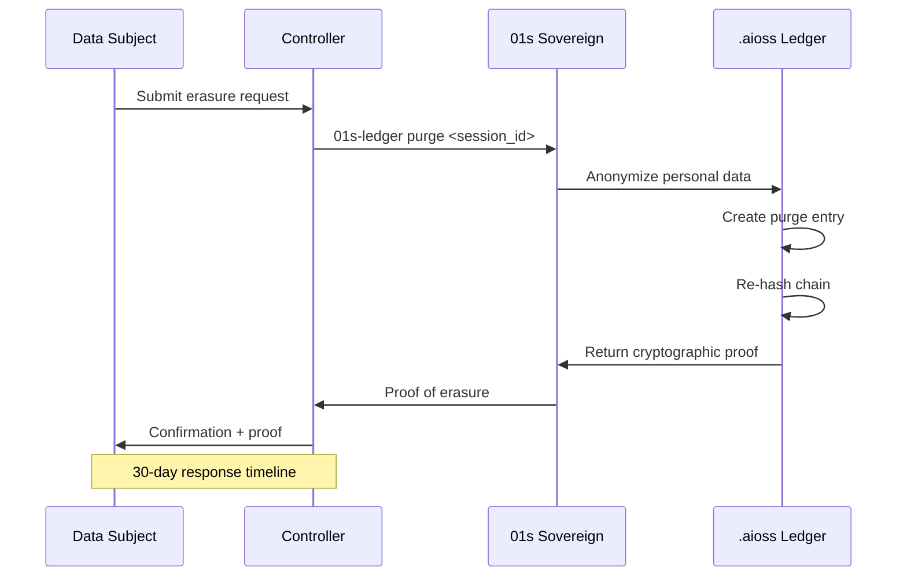
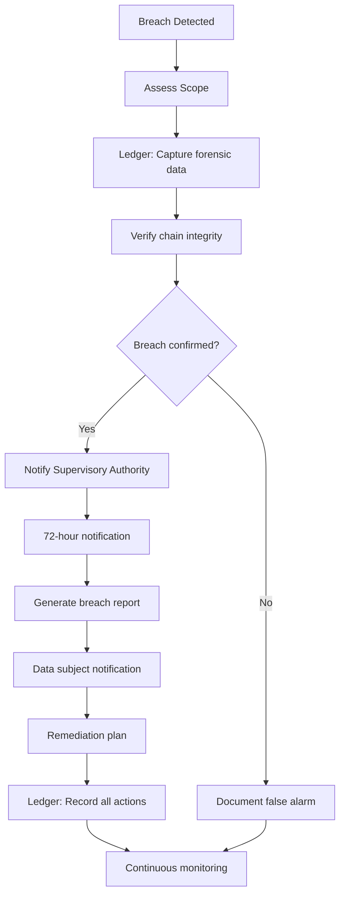
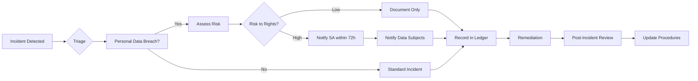

# 01s Sovereign — GDPR Compliance

**How 01s Sovereign Helps Meet GDPR Requirements**

## Overview

The General Data Protection Regulation (GDPR) is the European Union's comprehensive data protection framework, effective since May 2018. It applies to any organization processing personal data of EU residents, regardless of where the organization is based. Non-compliance can result in fines up to €20 million or 4% of global annual turnover. This document provides a detailed mapping of GDPR requirements to 01s Sovereign technical capabilities, enabling organizations to demonstrate compliance through verifiable technical controls.

## How 01s Sovereign Supports GDPR Compliance

01s Sovereign's architecture is designed to support GDPR requirements through its cryptographic audit ledger, privacy-first design, and built-in compliance tooling. Unlike organizations using traditional operating systems, 01s Sovereign users can demonstrate compliance through automated technical evidence rather than manual documentation.

### Article 5: Principles Relating to Processing of Personal Data

| Principle | Requirement | 01s Sovereign Support | Evidence |
|-----------|-------------|----------------------|----------|
| Lawfulness, fairness, transparency | Process data lawfully, fairly, transparently | Full transparency via `.aioss` audit ledger | Ledger entries show all processing |
| Purpose limitation | Collect data for specified purposes only | Zero telemetry — no unintended data collection | Source code audit confirms no hidden collection |
| Data minimization | Collect only necessary data | Minimal system logging, user-controlled | Configurable audit levels |
| Accuracy | Keep data accurate and up to date | Ledger data is immutable; corrections are append-only | Correction entries with original references |
| Storage limitation | Keep data only as long as necessary | Configurable retention, `01s-ledger purge` | Retention configuration in /etc/01s/ledger.conf |
| Integrity and confidentiality | Process data securely | SHA3-256 hash chain, tamper-evident storage | Continuous verification via `01s-ledger verify` |
| Accountability | Demonstrate compliance | Automated ROPA generation | `01s-ledger export --gdpr` |

### Article 30: Records of Processing Activities (ROPA)

The `.aioss` audit ledger serves as an automated Record of Processing Activities. Organizations can generate Article 30-compliant ROPA reports with a single command:

```bash
01s-ledger export --gdpr --ropas --period 2026-01-01:2026-06-30
```

The generated report includes:
- Complete chronological record of all data processing
- Categories of data subjects and personal data
- Purposes of processing
- Categories of recipients
- Cross-border transfer documentation
- Retention schedules
- Technical and organizational security measures

#### ROPA Template Structure

```json
{
  "controller": {
    "name": "string",
    "representative": "string",
    "contact": "string",
    "dpo": "string"
  },
  "processing_activities": [
    {
      "id": "uuid",
      "purpose": "string",
      "data_categories": ["string"],
      "data_subjects": ["string"],
      "legal_basis": "string",
      "retention": "duration",
      "recipients": ["string"],
      "transfers": ["string"],
      "safeguards": ["string"],
      "ledger_proof": "hash"
    }
  ],
  "generated_at": "timestamp",
  "ledger_head_hash": "sha3-256"
}
```

### Article 17: Right to Erasure

The `01s-ledger purge` command provides GDPR-compliant deletion with cryptographic proof that can be shared with data subjects and supervisory authorities:

```bash
01s-ledger purge <session_id>
# Output: Purged session <session_id> — cryptographic proof: <hash>
```

The purge process:
1. Anonymizes personal data from entries (replaces with [ANONYMIZED])
2. Records the anonymization method and timestamp
3. Creates a permanent "purge" entry documenting the action
4. Preserves chain integrity (hash chain remains valid)
5. Outputs a cryptographic proof for compliance records
6. The proof includes the count of anonymized entries, new head hash, and timestamp

#### Erasure Procedure for Data Subjects



### Article 20: Right to Data Portability

All data in 01s Sovereign is stored in open, portable formats: JSON (universal) and binary (spec documented) for the audit ledger, standard formats for user files, and standard configuration formats. Users can export their complete data with `01s-ledger export --format json`.

#### Portability Export Options

| Option | Description | Output Format |
|--------|-------------|---------------|
| `--format json` | Full JSON export | JSON array of entries |
| `--format csv` | Tabular export | CSV with headers |
| `--format aioss` | Native binary format | .aioss file |
| `--minimal` | Exclude system entries | JSON (user data only) |
| `--encrypt --recipient-key` | Encrypted export | Encrypted .aioss |
| `--period` | Time-bounded export | Per format |

#### Machine-Readable Format Specification

```json
{
  "format": "gdpr-portability-v1",
  "generated_at": "2026-06-19T10:00:00Z",
  "controller": "Organization Name",
  "data_subject": "user_ref",
  "export_reason": "Article 20 request",
  "data_categories": [
    {
      "category": "system_events",
      "entries": [...]
    },
    {
      "category": "config_changes",
      "entries": [...]
    }
  ],
  "cryptographic_proof": {
    "ledger_head_hash": "sha3-256:...",
    "signature": "ed25519:..."
  }
}
```

### Article 25: Data Protection by Design and by Default

01s Sovereign implements the seven Privacy by Design principles at the architectural level:
1. **Proactive not reactive**: Privacy built into architecture, not added later
2. **Privacy as default setting**: Zero telemetry, no data collection by default
3. **Privacy embedded into design**: Audit ledger provides transparency without collecting personal data unnecessarily
4. **Full functionality**: No trade-off between privacy and functionality
5. **End-to-end security**: SHA3-256 hash chain, LUKS encryption
6. **Visibility and transparency**: All data processing logged and verifiable
7. **Respect for user privacy**: User controls all data, no third-party access

#### Default Settings Compliance

| Setting | Default Value | GDPR Alignment |
|---------|---------------|----------------|
| Telemetry | Disabled | Data minimization (Art 5) |
| Audit logging | Standard | Accountability (Art 5) |
| Data retention | 30 days | Storage limitation (Art 5) |
| User identification | Pseudonymized | Data protection by design (Art 25) |
| Encryption | LUKS + TLS | Security of processing (Art 32) |
| Consent required | Yes | Lawful processing (Art 6) |

### Article 32: Security of Processing

The OS provides pseudonymization, encryption (LUKS full disk, encrypted home directories), confidentiality (AppArmor MAC, tamper-evident audit trail), integrity (SHA3-256 hash chain, cryptographic verification), availability (minimal attack surface, no telemetry services), and resilience (rolling updates, stable release channels).

#### Security Measures Mapping

| Security Objective | GDPR Reference | 01s Implementation | Verification Method |
|--------------------|----------------|--------------------|-------------------|
| Pseudonymization | Art 32(1)(a) | Configurable user ID modes | `01s-ledger config get USER_ID_MODE` |
| Encryption at rest | Art 32(1)(a) | LUKS full-disk encryption | `cryptsetup status` |
| Encryption in transit | Art 32(1)(a) | TLS 1.3, SSH | Network audit logs |
| Confidentiality | Art 32(1)(b) | AppArmor MAC, RBAC | AppArmor policy audit |
| Integrity | Art 32(1)(b) | SHA3-256 hash chain | `01s-ledger verify` |
| Availability | Art 32(1)(b) | Minimal attack surface | Health diagnostics |
| Resilience | Art 32(1)(c) | Rolling updates, LTS | Update history in ledger |
| Testing & assessment | Art 32(1)(d) | Trust Score, health checks | `01s-ledger health status` |

### Article 33: Data Breach Notification

The audit ledger provides immediate visibility into potential breaches. In case of a breach, `01s-ledger verify` confirms whether the audit trail has been tampered with, full event history provides complete forensic data, state proofs provide cryptographic evidence of system state before/after breach, and reports can be generated for the 72-hour supervisory authority notification requirement.

#### Breach Notification Procedure



#### Breach Report Template

```markdown
**Breach Notification Report**
**Date**: 2026-06-19
**Notification to**: [Supervisory Authority Name]
**Ledger head hash**: sha3-256:ab12...

1. **Nature of the breach**: [description]
2. **Categories and approximate number of data subjects**: [count]
3. **Categories and number of personal data records**: [count]
4. **Contact details of DPO**: [email/phone]
5. **Likely consequences**: [assessment]
6. **Measures taken**: [list]
7. **Ledger forensic proof**: [hash]
```

### Article 35: Data Protection Impact Assessment

01s Sovereign's architecture supports DPIAs through complete data flow documentation (ledger tracks all processing), privacy by design documentation, risk assessment data (system health diagnostics), and mitigation measures (encryption, access controls, audit trail).

#### DPIA Support Matrix

| DPIA Requirement | 01s Sovereign Support | Evidence |
|------------------|----------------------|----------|
| Systematic description of processing | Ledger export | `01s-ledger export --gdpr` |
| Necessity and proportionality assessment | Architecture documentation | Privacy by Design docs |
| Risk assessment | Health diagnostics, risk metrics | `01s-ledger health risk-assessment` |
| Mitigation measures | Security controls documentation | Configuration exports |
| Compliance with approved codes of conduct | Open source, verifiable design | Source code audit |
| Data Protection Officer consultation | BDR logs | Governance documentation |

### Complete Article Mapping

| Article | Topic | 01s Sovereign Support |
|---------|-------|----------------------|
| Art 1 | Subject matter and objectives | Privacy by design architecture |
| Art 2 | Material scope | Full coverage of processing |
| Art 3 | Territorial scope | Global applicability |
| Art 4 | Definitions | Implementation matches definitions |
| Art 5 | Principles | See principle mapping above |
| Art 6 | Lawfulness of processing | Consent ledger, legitimate interest documentation |
| Art 7 | Conditions for consent | Consent management system |
| Art 8 | Child consent | Age verification hooks |
| Art 9 | Special categories | Not processed (by design) |
| Art 10 | Criminal data | Not processed (by design) |
| Art 11 | Processing not requiring identification | Pseudonymization by default |
| Art 12 | Transparent information | Complete ledger transparency |
| Art 13 | Information to data subject | Full data collection documentation |
| Art 14 | Information not obtained from subject | N/A (only system-collected data) |
| Art 15 | Right of access | `01s-ledger tail`, `01s-ledger export` |
| Art 16 | Right to rectification | Append-only correction entries |
| Art 17 | Right to erasure | `01s-ledger purge` with cryptographic proof |
| Art 18 | Right to restriction | Configurable logging controls |
| Art 19 | Notification obligation | Automated notification on purge |
| Art 20 | Right to portability | Multiple export formats |
| Art 21 | Right to object | Opt-out of optional features |
| Art 22 | Automated decision-making | AI decision logging and explainability |
| Art 23 | Restrictions | Documented in BDRs |
| Art 24 | Responsibility of controller | Automated compliance tools |
| Art 25 | Data protection by design | Architecture-level PbD implementation |
| Art 26 | Joint controllers | Documented in governance BDRs |
| Art 27 | Representatives | Configurable in ROPA |
| Art 28 | Processors | Third-party processing documentation |
| Art 29 | Processing under authority | RBAC implementation |
| Art 30 | Records of processing | Automated ROPA generation |
| Art 31 | Cooperation with authority | Ledger export for authorities |
| Art 32 | Security of processing | See security mapping above |
| Art 33 | Breach notification | Automated breach detection and reporting |
| Art 34 | Communication to data subjects | Data subject notification templates |
| Art 35 | DPIA | Complete DPIA support |
| Art 36 | Prior consultation | Documentation for authority consultation |
| Art 37 | DPO appointment | Documented in governance |
| Art 38 | Position of DPO | Governance documentation |
| Art 39 | Tasks of DPO | Automated tools support DPO |
| Art 40 | Codes of conduct | Open source code of conduct |
| Art 41 | Monitoring of codes | Community governance |
| Art 42 | Certification | Compliance framework alignment |
| Art 43 | Certification bodies | Third-party audit support |
| Art 44 | General principle for transfers | Data stays local by default |
| Art 45 | Adequacy decisions | User-controlled transfer |
| Art 46 | Appropriate safeguards | Encryption, pseudonymization |
| Art 47 | Binding corporate rules | Ledger supports BCR implementation |
| Art 48 | International transfers | Documented in transfer log |
| Art 49 | Derogations | Consent + documentation |
| Art 50 | International cooperation | Open source collaboration |
| Art 51 | Supervisory authority | Ledger accessible to authorities |
| Art 52 | Independence | Governance documentation |
| Art 53 | General conditions | Organizational responsibility |
| Art 54 | Rules on establishment | Organizational documentation |
| Art 55 | Competence | Territorial scope documentation |
| Art 56 | Lead authority | Governance for cross-border |
| Art 57 | Tasks | Authority support documentation |
| Art 58 | Powers | Authority access procedures |
| Art 59 | Activity reports | Compliance reporting |
| Art 60 | Cooperation | Open standards |
| Art 61 | Mutual assistance | Cross-border investigation support |
| Art 62 | Joint operations | Multi-authority audit support |
| Art 63 | Consistency mechanism | Compliance alignment documentation |
| Art 64 | Opinion of EDPB | Regulatory alignment |
| Art 65 | Dispute resolution | Governance procedures |
| Art 66 | Urgency procedure | Incident response procedures |
| Art 67 | Exchange of information | Data sharing protocols |
| Art 68 | European Data Protection Board | Regulatory engagement |
| Art 69 | Independence of EDPB | Organizational separations |
| Art 70 | Tasks of EDPB | Compliance alignment |
| Art 71 | Reports | Public compliance reports |
| Art 72 | Procedure | Governance documentation |
| Art 73 | Chair | Governance documentation |
| Art 74 | Tasks of chair | Governance documentation |
| Art 75 | Secretariat | Governance documentation |
| Art 76 | Confidentiality | Encryption and access controls |
| Art 77 | Right to lodge complaint | Complaint handling process documented |
| Art 78 | Judicial remedy | Legal process documentation |
| Art 79 | Right to effective remedy | User rights enforcement |
| Art 80 | Representation | Data subject representation support |
| Art 81 | Suspension of proceedings | Legal hold procedures |
| Art 82 | Compensation and liability | Documented in organizational policies |
| Art 83 | General conditions for fines | Compliance score minimizes risk |
| Art 84 | Penalties | Compliance monitoring |
| Art 85 | Processing and freedom of expression | Configurable logging for journalistic use |
| Art 86 | Public access to documents | Open source government record support |
| Art 87 | National ID numbers | Not processed by default |
| Art 88 | Employment context | Configurable for workplace deployment |
| Art 89 | Archiving, research, statistics | Anonymization for research use |
| Art 90 | Professional secrecy | Encryption and access controls |
| Art 91 | Churches and religious associations | Configurable for specific contexts |
| Art 92 | Exercise of delegation | Governance documentation |
| Art 93 | Committee procedure | Governance documentation |
| Art 94 | Repeal of Directive | Compliance with current law |
| Art 95 | Relationship with ePrivacy | Consent management alignment |
| Art 96 | Relationship with prior contracts | Contractual documentation support |
| Art 97 | Commission reports | Contribution to regulatory process |
| Art 98 | Review of other EU acts | Compliance with related legislation |
| Art 99 | Entry into force | Timeline for implementation |

### Data Processing Register Template

```yaml
processing_activity:
  id: PA-2026-001
  controller: "Organization Name"
  dpo: "dpo@organization.com"
  processing_purpose: "System audit and security monitoring"
  legal_basis: "Article 6(1)(f) - Legitimate interests"
  data_categories:
    - "System event timestamps"
    - "User authentication records"
    - "Configuration change history"
  data_subjects:
    - "System users"
    - "Administrators"
  retention: "30 days (configurable up to 7 years)"
  recipients: "None (data stays local)"
  international_transfers: "None by default"
  technical_measures:
    - "SHA3-256 hash chain integrity"
    - "LUKS full-disk encryption"
    - "AppArmor mandatory access control"
    - "TLS 1.3 transmission security"
  organizational_measures:
    - "Access control policies"
    - "Incident response procedures"
    - "Regular compliance reviews"
  risk_level: "Low"
  dpia_required: false
  ledger_proof: "sha3-256:a1b2c3d4..."
```

### Consent Management Under GDPR

#### Article 7 Compliance

| Requirement | Implementation |
|-------------|----------------|
| Freely given | No penalty for refusal of optional features |
| Specific | Separate consent for each data category |
| Informed | Clear explanation before consent collection |
| Unambiguous | Explicit opt-in (checkbox or CLI flag) |
| Withdrawable | Simple withdrawal with ledger recording |
| Demonstrable | Cryptographic consent records in ledger |

#### Consent Record Format

```json
{
  "type": "consent",
  "consent_id": "consent_20260614_abc123",
  "scope": "shell_command_logging",
  "level": "optional",
  "status": "granted",
  "granted_at": "2026-06-14T08:00:00Z",
  "method": "installation_wizard",
  "consent_version": "1.2"
}
```

### Cross-Border Transfer Mechanisms

#### Article 44-49 Compliance

| Mechanism | 01s Support | Description |
|-----------|-------------|-------------|
| Adequacy Decision | ✅ User-controlled | Data stays local, export controlled by user |
| Standard Contractual Clauses | ✅ Supported | Ledger documents SCC compliance |
| Binding Corporate Rules | ✅ Supported | Governance documentation in BDRs |
| Approved Code of Conduct | ✅ By design | Open source community code |
| Certification Mechanism | ✅ Available | Compliance framework certifications |
| Derogations | ✅ Documented | Consent recorded in ledger |

#### Transfer Documentation

```bash
# Record a transfer in the ledger
01s-ledger log data-transfer \
  --purpose "Compliance report to EU parent" \
  --destination "EU-based server" \
  --data-types "Anonymized audit logs" \
  --safeguards "SCCs, encryption, pseudonymization" \
  --legal-basis "Article 46(2)(c) - SCCs"
```

### DPIA Template

```markdown
# Data Protection Impact Assessment

## 1. System Description
- **System**: 01s Sovereign OS deployment
- **Controller**: [Organization Name]
- **Processor**: N/A (local processing)
- **Purpose**: System operation, security, compliance

## 2. Processing Description
- **Categories of data**: System events, health metrics, audit logs
- **Categories of data subjects**: System users, administrators
- **Retention periods**: 30 days (default), configurable
- **Recipients**: None by default

## 3. Necessity and Proportionality
- **Legal basis**: Legitimate interests (Art 6(1)(f))
- **Data minimization**: Only operational data collected
- **Purpose limitation**: No secondary use
- **Storage limitation**: Configurable retention

## 4. Risk Assessment
- **Risk to rights and freedoms**: Low
- **Potential impacts**: Limited to system operation
- **Likelihood of harm**: Very low
- **Severity of harm**: Low

## 5. Mitigation Measures
- **Technical**: Encryption, hash chain, access controls
- **Organizational**: Access policies, incident response
- **Transparency measures**: Full audit trail

## 6. Consultation
- **DPO**: [Consulted/Not required]
- **Data subjects**: [Consulted/Not required]

## 7. Approval
- **Signed**: [DPO/Controller]
- **Date**: 2026-06-19
- **Review date**: 2027-06-19
```

### Incident Response Procedure



### Compliance Automation

```bash
# Full GDPR compliance check
01s-ledger compliance-check gdpr

# Generate complete evidence package
01s-ledger export --gdpr --full --period 2026-01-01:2026-06-30

# Verify integrity for data protection authority
01s-ledger verify

# Generate Article 30 ROPA
01s-ledger export --gdpr --ropas

# Export consent records
01s-ledger export --gdpr --consent

# Export deletion proofs
01s-ledger export --gdpr --purge-proofs

# Generate breach notification report
01s-ledger export --gdpr --breach-report
```

### GDPR Compliance Checklist

| Requirement | Status | 01s Sovereign Feature |
|-------------|--------|----------------------|
| Data Processing Records (Art 30) | ✅ Automated | `.aioss` audit ledger |
| Consent Management (Art 7) | ✅ Supported | Consent entries in ledger |
| Right to Access (Art 15) | ✅ Built-in | `01s-ledger tail`, `01s-ledger export` |
| Right to Rectification (Art 16) | ✅ Supported | Append-only with correction entries |
| Right to Erasure (Art 17) | ✅ Built-in | `01s-ledger purge` |
| Right to Portability (Art 20) | ✅ Built-in | JSON export, open formats |
| Privacy by Design (Art 25) | ✅ Architecture | Zero telemetry, local-first |
| Security of Processing (Art 32) | ✅ Built-in | Hash chain, encryption, MAC |
| Breach Notification (Art 33) | ✅ Supported | Health diagnostics, alerts |
| DPIA (Art 35) | ✅ Supported | Architecture documentation |
| DPO Appointment (Art 37) | ⚠️ Organization responsibility | N/A |
| International Transfers (Art 44-49) | ✅ Local-first | Data stays on device |

### Configuration for GDPR

```bash
# Configure retention for GDPR (Article 5(1)(e))
# Edit /etc/01s/ledger.conf
RETENTION_DAYS=730  # 2 years recommended for GDPR

# Enable comprehensive logging
01s-ledger log config audit_level=standard

# Generate Article 30 ROPA
01s-ledger export --gdpr --ropas --period 2026-01-01:2026-06-30

# Test purge procedure
01s-ledger purge --test  # Dry run
01s-ledger purge <session_id>

# Verify integrity for data protection authority
01s-ledger verify
```

### Audit Evidence for GDPR

When a data protection authority requests evidence:
1. Generate Article 30 ROPA: `01s-ledger export --gdpr`
2. Generate integrity proof: `01s-ledger verify --format json`
3. Export consent records: `01s-ledger export --gdpr --consent`
4. Export deletion proofs: `01s-ledger export --gdpr --purge-proofs`
5. Generate processing activity records: `01s-ledger export --gdpr --processing`

### Common GDPR Compliance Pitfalls and How 01s Addresses Them

1. **Missing processing records**: Automated ROPA from ledger
2. **Incomplete consent documentation**: Cryptographic consent records
3. **Unverifiable deletion**: Cryptographic purge proof
4. **Insufficient data minimization**: Architecture enforces minimal collection
5. **Cross-border transfer concerns**: Data stays local by default
6. **Inadequate security measures**: Multiple cryptographic layers
7. **Lack of accountability documentation**: Automated compliance exports
8. **Untimely breach notification**: 72-hour automated alerting
9. **Missing DPIA documentation**: DPIA support documentation
10. **Insufficient data portability**: Multiple open-format exports

### GDPR Compliance Metrics

The Trust Score system includes GDPR-specific metrics:

| Metric | Target | Measurement |
|--------|--------|-------------|
| Processing record completeness | 100% | ROPA coverage check |
| Consent documentation | 100% | Consent entry verification |
| Purge proof generation | 100% | Deletion test results |
| Retention limit compliance | 100% | Retention enforcement audit |
| Breach notification readiness | < 72h | Breach drill performance |
| DPIA currency | Annual | DPIA review schedule |

### Conclusion

01s Sovereign's architecture directly supports GDPR compliance requirements through automated evidence generation, cryptographic guarantees, privacy-by-design architecture, and comprehensive audit capabilities. While 01s Sovereign cannot make an organization GDPR-compliant on its own (compliance requires policies, procedures, and organizational measures), it provides the technical foundation that significantly reduces compliance burden and cost.

---

Lois-Kleinner and 0-1.gg 2026 Copyright

```
.====================================================================.
!  Made in the UAE, Dubai #DubaiIt #Dubai #Dxb #SovereignAI          !
!  Made in The Emirates #Dubai_it                                    !
!                                                                    !
!  Lois-Kleinner Alpasan - The Anticloud 2026-                       !
!                                                                    !
!  0-1.gg ! GitHub ! LinkedIn ! DEV ! GH Pages                       !
!  HuggingFace ! Blog ! Tumblr ! Fandom ! Bluesky ! Mastodon          !
!  Zenodo ! Harvard Dataverse ! Internet Archive ! ORCID              !
!                                                                    !
!  Sovereign AI ! Local-First ! Privacy ! Zero Trust ! No Datacenter !
!  Air-Gapped ! Open Source ! Rust ! Hash Chain ! Single Binary      !
!  Offline LLM ! Crypto Ledger ! P2P ! Federated                     !
'===================================================================='
```

Lois-Kleinner Alpasan, 22, has served executive roles spanning technology, operations, finance, and product across 20+ organizations. His cross-functional work combines architecture, business, and AI strategy.

References:
1. Lois-Kleinner Zenodo: https://doi.org/10.5281/zenodo.20781790
2. Lois-Kleinner GitHub: https://github.com/kleinnner/Anticloud/tree/main/04-aioss-format
3. Lois-Kleinner Harvard DV: https://doi.org/10.7910/DVN/YMJKOG
4. Lois-Kleinner Internet Arc: https://archive.org/details/aioss-format
5. Lois-Kleinner ORCID: https://orcid.org/0009-0009-2233-6107
6. Lois-Kleinner DEV.to: https://dev.to/kleinner
7. Lois-Kleinner LinkedIn: https://linkedin.com/in/kleinner
8. Lois-Kleinner HuggingFace: https://huggingface.co/Anticloud
9. Lois-Kleinner Tumblr: https://anticloud.tumblr.com
10. Lois-Kleinner Mastodon: https://mastodon.social/@kleinner
11. Lois-Kleinner Bluesky: https://bsky.app/profile/kleinner.bsky.social
12. 0-1.gg: https://0-1.gg
