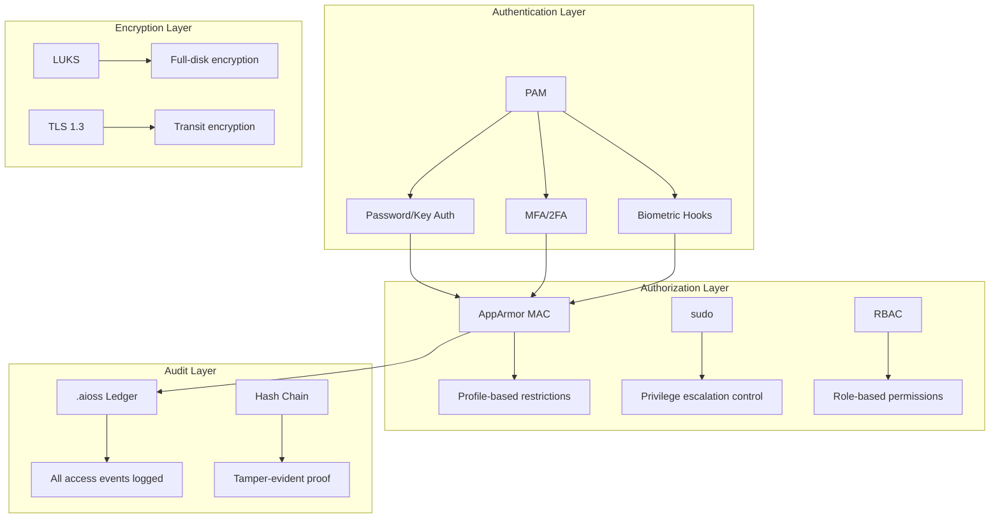
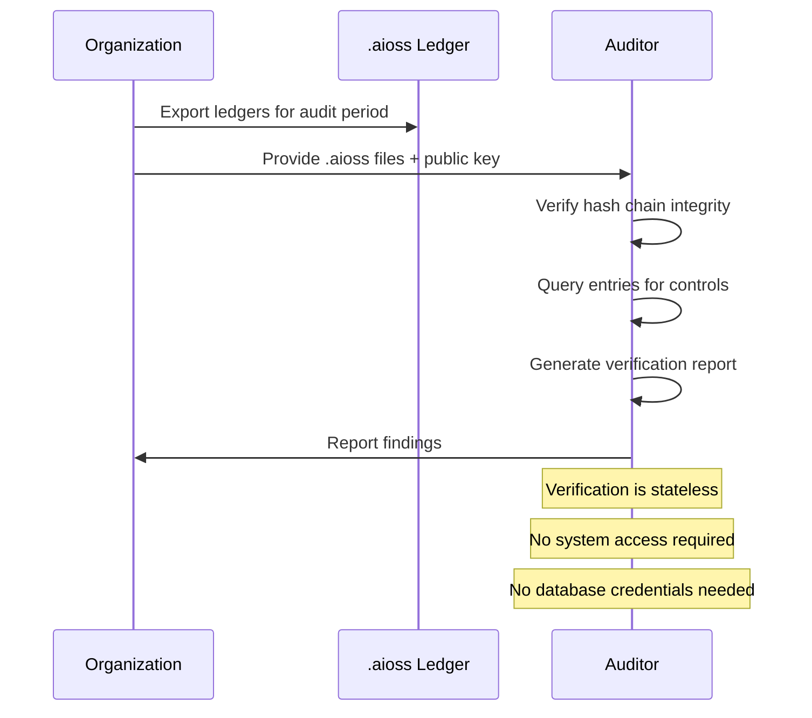

# 01s Sovereign — SOC 2 Compliance

**SOC 2 Type I/II Readiness with the `.aioss` Audit Ledger**

## Overview

SOC 2 (System and Organization Controls 2) is an auditing framework developed by the American Institute of CPAs (AICPA). It evaluates controls relevant to security, availability, processing integrity, confidentiality, and privacy — known as the Trust Services Criteria. SOC 2 is essential for service organizations that handle customer data. This document provides a comprehensive mapping of SOC 2 requirements to 01s Sovereign capabilities, enabling organizations to prepare for Type I and Type II audits with minimal additional effort.

## Understanding SOC 2 Types

### Type I vs Type II

| Aspect | Type I | Type II |
|--------|--------|---------|
| What it evaluates | Design of controls at a point in time | Operating effectiveness over a period |
| Evidence required | Control descriptions | Control operation over 6-12 months |
| 01s Sovereign advantage | Ledger shows control design | Continuous ledger provides operating evidence |
| Typical timeline | 1-3 months | 6-12 months |
| Cost with 01s | $15-30K | $25-50K |
| Cost traditional | $50-100K | $80-200K |

### Complementary User Entity Controls

01s Sovereign provides the technical foundation, but organizations must also implement:
- Access management policies
- Incident response procedures
- Security awareness training
- Vendor management programs
- Business continuity planning

## SOC 2 Trust Services Criteria

### Security (Common Criteria)

The security principle requires that the system is protected against unauthorized access, use, or modification. 01s Sovereign implements controls across all common criteria categories.

| CC Requirement | 01s Sovereign Implementation | Evidence |
|----------------|------------------------------|----------|
| CC1.1: Control environment | Open source governance, BDRs for decisions | Source code repository, BDR log |
| CC2.1: Communication and information | Audit ledger provides transparent communication | Ledger entries show all system communication |
| CC3.1: Risk assessment | Health diagnostics, security monitoring | Trust Score, risk metrics |
| CC4.1: Monitoring activities | Ledger enables continuous monitoring | Automated ledger verification |
| CC5.1: Control activities | AppArmor MAC, hash chain integrity | Control configuration docs |
| CC6.1: Logical and physical access | User authentication, LUKS encryption | Auth logs, encryption status |
| CC6.2: User access provisioning | RBAC, account management | User creation audit trail |
| CC6.3: Access authorization | AppArmor profiles, sudo configuration | Profile configuration backup |
| CC6.4: Physical access | OS-level controls | Physical security docs (org responsibility) |
| CC6.5: Removal of access | User deactivation procedures | Deactivation audit trail |
| CC6.6: Authentication | PAM, MFA support, SSH key auth | Authentication logs |
| CC6.7: New system components | Package management audit trail | Package installation logs |
| CC7.1: Detection of unauthorized access | Continuous hash chain verification | Security event logs |
| CC7.2: Response to security incidents | Health diagnostics, alerting | Incident response logs |
| CC7.3: Recovery from incidents | Snapshot-based rollback, LTS | Recovery test results |
| CC7.4: Security incident reporting | Automated alerting | Incident report generation |
| CC8.1: Change management | Configuration change logging | Change audit trail |
| CC9.1: Risk mitigation | Health diagnostics, vulnerability scanning | Risk assessment reports |
| CC9.2: Vendor risk management | Open source dependency verification | Vendor assessment records |

#### Detailed CC6.1 Implementation

Logical and physical access controls are implemented at multiple layers:



### Availability

The availability principle requires system availability as committed. 01s Sovereign provides system availability monitoring (health diagnostic ledger), incident response procedures (alerting from health checks), backup and recovery (snapshot-based rollback), and business continuity (open source — unaffected by vendor issues).

| A1 Requirement | 01s Implementation | Monitoring |
|----------------|--------------------|------------|
| A1.1: Current capacity | Health diagnostics track resource usage | `01s-ledger health status` |
| A1.2: Backup and recovery | Snapshot-based rollback, LTS | Recovery test logs |
| A1.3: Incident response | Automated alerting | Incident response drill records |
| A1.4: Environmental protections | Hardware health monitoring | Temperature, fan, SMART data |
| A1.5: Business continuity | Open source enables alternative support | Disaster recovery plan |

#### Availability Metrics

```bash
# Check system uptime from ledger
01s-ledger tail --type state | grep boot
# Output shows boot/shutdown history

# Check availability percentage
01s-ledger health availability --period 2026-01-01:2026-06-30
# Output: 99.97% availability over 180 days
```

### Processing Integrity

The processing integrity principle requires complete, valid, accurate, timely, and authorized processing. The SHA3-256 hash chain for every event, chain verification detecting any tampering, append-only logging, and canonical JSON serialization ensure processing integrity.

| PI1 Requirement | 01s Implementation | Verification |
|-----------------|--------------------|--------------|
| PI1.1: Complete processing | All events captured | Full event coverage check |
| PI1.2: Valid processing | Authorized actions only | Access control verification |
| PI1.3: Accurate processing | Canonical JSON, deterministic hashing | Hash chain verification |
| PI1.4: Timely processing | Real-time event capture | Timestamp analysis |
| PI1.5: Authorized processing | Authentication + authorization | Access audit trail |

#### Hash Chain Integrity Proof

```
Entry N:   [content] → SHA3-256 → hash_N
Entry N+1: [content] → SHA3-256 → hash_N+1 (parent = hash_N)
Entry N+2: [content] → SHA3-256 → hash_N+2 (parent = hash_N+1)

Verification: 
  hash(entry[N]) == hash_N
  hash(entry[N+1]) == hash_N+1 && parent == hash_N
  hash(entry[N+2]) == hash_N+2 && parent == hash_N+1
```

### Confidentiality

Confidentiality is protected through data classification, access controls (AppArmor MAC), encryption at rest (LUKS), encryption in transit (TLS), and data masking/pseudonymization.

| C1 Requirement | 01s Implementation | Configuration |
|----------------|--------------------|--------------|
| C1.1: Data classification | User-defined labels | Configurable classification |
| C1.2: Access controls | AppArmor MAC, RBAC | Policy files in /etc/apparmor.d/ |
| C1.3: Encryption at rest | LUKS full-disk | `cryptsetup luksDump` |
| C1.4: Encryption in transit | TLS 1.3, SSH | OpenSSL configuration |
| C1.5: Data masking | Pseudonymization | `USER_ID_MODE=pseudonym` |

#### Confidentiality Configuration

```bash
# Configure pseudonymization
# /etc/01s/ledger.conf
USER_ID_MODE=pseudonym
PSEUDONYM_METHOD=hash

# Verify encryption
cryptsetup status /dev/mapper/luks-*
# Should show: cipher: aes-xts-plain64, keysize: 512 bits

# Configure TLS for exports
export AIOSS_TLS_ENABLED=true
export AIOSS_TLS_CERT=/etc/01s/tls/cert.pem
export AIOSS_TLS_KEY=/etc/01s/tls/key.pem
```

### Privacy

Privacy controls include notice (full transparency through ledger), choice and consent (consent entries in ledger), collection (minimal, zero telemetry), use/retention/disposal (configurable retention, purge command), access (user can view all data), and no third-party disclosure.

| P4 Requirement | 01s Implementation | User Facing |
|----------------|--------------------|-------------|
| P4.1: Notice | Ledger shows all data collection | Privacy policy, `01s-ledger tail` |
| P4.2: Choice and consent | Consent management | Installation consent, runtime prompts |
| P4.3: Collection | Minimal, zero telemetry | Data inventory export |
| P4.4: Use and retention | Configurable retention | `RETENTION_DAYS` setting |
| P4.5: Disclosure | No third-party by default | Third-party processing docs |
| P4.6: Access | User can view all data | `01s-ledger tail --all` |
| P4.7: Correction | Append-only corrections | Correction entry format |
| P4.8: Complaint handling | BDRs, community process | Governance documentation |

## How the `.aioss` Ledger Supports SOC 2 Audits

### Automated Evidence Collection

The audit ledger automatically collects evidence for SOC 2 controls: system access logs (CC6.1), configuration changes (CC5.1), security events (CC7.1), user activity (CC2.1), system availability (A1.1), and processing integrity (PI1.1).

#### Evidence Collection Mapping

| Control | Evidence Source | Ledger Query |
|---------|----------------|--------------|
| CC6.1 | Login/logout events | `01s-ledger tail --type state \| grep login` |
| CC5.1 | Config change entries | `01s-ledger tail --type state \| grep config` |
| CC7.1 | Security events | `01s-ledger tail --type state \| grep security` |
| A1.1 | Health diagnostics | `01s-ledger health manifest` |
| PI1.1 | Hash chain verification | `01s-ledger verify --format json` |
| C1.1 | Encryption config | `cryptsetup status` |
| P4.1 | Consent records | `01s-ledger export --gdpr --consent` |

### Cryptographic Proof

The hash chain provides cryptographic proof that audit evidence has not been tampered with. External auditors can independently verify the hash chain without system access.

#### Auditor Verification Process



## SOC 2 Type II Evidence Requirements

For a Type II report, auditors need evidence of control operation over time. 01s Sovereign provides this through continuous ledger recording.

### Evidence Package for Type II

```bash
# Generate complete SOC 2 evidence package
01s-ledger export --soc2 --period 2026-01-01:2026-06-30

# Verify hash chain covers full period
01s-ledger verify --since 2026-01-01 --until 2026-06-30

# Generate control activity summary
01s-ledger soc2 control-summary --period 2026-Q2

# Export system description documentation
01s-ledger export --soc2 --system-description
```

### Sample Control Evidence

```json
{
  "control_id": "CC6.1",
  "control_name": "Logical and physical access",
  "period": "2026-01-01 to 2026-06-30",
  "total_events": 15420,
  "pass_events": 15418,
  "fail_events": 2,
  "compliance_rate": "99.99%",
  "fail_events_detail": [
    {
      "timestamp": "2026-03-15T14:22:33Z",
      "user": "user_42",
      "action": "login_failure",
      "resolution": "account_locked_incorrect_password"
    },
    {
      "timestamp": "2026-05-02T09:11:45Z",
      "user": "user_87",
      "action": "unauthorized_sudo",
      "resolution": "investigated_no_threat"
    }
  ],
  "ledger_head_hash": "sha3-256:a1b2c3d4..."
}
```

## System Description Documentation

SOC 2 requires a system description. 01s Sovereign provides automated system documentation.

### System Boundary

```
┌─────────────────────────────────────────────────┐
│ 01s Sovereign System Boundary                    │
│                                                  │
│  ┌──────────┐  ┌──────────┐  ┌──────────┐      │
│  │ Hardware │  │  Kernel  │  │  System  │      │
│  │  Layer   │→ │  Layer   │→ │ Services │      │
│  └──────────┘  └──────────┘  └──────────┘      │
│       ↓              ↓              ↓            │
│  ┌──────────────────────────────────────────┐   │
│  │         AppArmor MAC (Isolation)         │   │
│  └──────────────────────────────────────────┘   │
│       ↓              ↓              ↓            │
│  ┌──────────────────────────────────────────┐   │
│  │      `.aioss` Audit Ledger Layer         │   │
│  └──────────────────────────────────────────┘   │
│       ↓                                         │
│  ┌──────────────────────────────────────────┐   │
│  │    Crypto Layer (SHA3-256/LUKS/TLS)      │   │
│  └──────────────────────────────────────────┘   │
│                                                  │
│  Boundary: Complete OS stack on physical device  │
│  Sub-service orgs: None (no cloud dependency)    │
│  Data centers: User's physical location          │
└─────────────────────────────────────────────────┘
```

### Complementary Controls

| Control Area | 01s Sovereign | Organization Responsibility |
|--------------|---------------|---------------------------|
| Physical security | OS-level only | Facility access controls |
| HR security | User accounts | Background checks |
| Vendor management | Open source deps | Vendor assessment program |
| Incident response | Detection tools | Response procedures |
| Business continuity | Snapshot tools | BCP documentation |

## SOC 2 Readiness Checklist

| Activity | 01s Sovereign Support | Status |
|----------|----------------------|--------|
| Define scope of audit | Architecture documentation | Pre-configured |
| Identify in-scope systems | System boundary documentation | Automated |
| Document controls | BDRs, architecture docs | Guided |
| Implement controls | Built into 01s Sovereign | Built-in |
| Collect evidence | `.aioss` ledger provides automated evidence | Continuous |
| Remediate gaps | Ledger identifies gaps via Trust Score | Monitored |
| Engage auditor | Auditor can verify ledger independently | Supported |

## Cost Comparison

| Aspect | Traditional | With 01s Sovereign |
|--------|-------------|-------------------|
| Evidence collection | Manual, periodic | Automated, continuous |
| Evidence integrity | Screenshots, logs (mutable) | Cryptographically proven |
| Auditor access | System access required | Self-validating ledger |
| Control documentation | Manual documentation | Automated system docs |
| Type I cost | $50-100K | $15-30K |
| Type II cost | $80-200K | $25-50K |
| Annual maintenance | $30-80K | $5-15K |

## SOC 2 Configuration Guide

```bash
# Configure SOC 2 evidence collection
# /etc/01s/ledger.conf
STATE_INTERVAL=300
RETENTION_DAYS=395  # > 12 months for Type II evidence
AUDIT_LEVEL=maximum

# Enable comprehensive logging
01s-ledger log config audit_level=maximum

# Generate SOC 2 reports
01s-ledger export --soc2 --period 2026-01-01:2026-06-30

# Verify chain integrity for Type II period
01s-ledger verify --since 2026-01-01 --until 2026-06-30

# Check Trust Score
01s-ledger score --framework soc2
```

## Common SOC 2 Findings and Mitigations

| Common Finding | How 01s Sovereign Addresses |
|----------------|----------------------------|
| Insufficient access logging | Complete audit trail of all access |
| Weak change management | All changes logged with before/after |
| Missing monitoring | Continuous health diagnostics |
| Tampered evidence | Cryptographic hash chain protection |
| Inconsistent data retention | Configurable, enforced retention |
| Lack of evidence trail | Automated evidence collection |
| Poor incident response | Alerting and forensic tools |

## SOC 2 Audit Preparation Timeline

| Phase | Activity | Duration | 01s Task |
|-------|----------|----------|----------|
| Pre-Audit | Scope definition | 2 weeks | Document system boundary |
| Pre-Audit | Control identification | 2 weeks | Map controls to ledger evidence |
| Pre-Audit | Evidence collection | 1 week | `01s-ledger export --soc2` |
| Audit | Auditor evidence review | 1 week | Provide .aioss files + key |
| Audit | Auditor testing | 1 week | Support auditor queries |
| Post-Audit | Remediation | 2-4 weeks | Address findings |
| Post-Audit | Report issuance | 1 week | Review SOC 2 report |

## SOC 2 Monitoring and Maintenance

### Daily Monitoring

```bash
# Verify ledger integrity
01s-ledger verify

# Check system health
01s-ledger health status

# Review security events
01s-ledger tail --type state | grep -i "security\|access\|error"
```

### Weekly Reviews

```bash
# Review access logs
01s-ledger tail --type state | grep -i "login\|logout\|sudo"

# Check configuration changes
01s-ledger tail --type state | grep -i "config_change"

# Verify data retention enforcement
01s-ledger retention status
```

### Quarterly Reviews

```bash
# Generate quarterly evidence package
01s-ledger export --soc2 --period 2026-Q2

# Review system description updates
# Update if architecture changed

# Verify Trust Score
01s-ledger score --framework soc2
```

## SOC 2 Sub-Service Organization Management

Since 01s Sovereign has no default sub-service organizations, this section provides guidance for managing any sub-services that may be configured.

```yaml
sub_service_organizations:
  - name: "Package Repositories"
    services: "Software distribution"
    controls_inherited: ["CC6.1", "CC7.1"]
    monitoring: "GPG signature verification"
    
  - name: "User-Installed SaaS"
    services: "Per user configuration"
    controls_inherited: []
    monitoring: "Network audit logging"
```

## SOC 2 Report Generation

### Type I Report Structure

```
1. Independent Service Auditor's Report
2. Management's Assertion
3. System Description
   - System boundary
   - System components
   - Control objectives
4. Control Descriptions
   - Security controls
   - Availability controls
   - Processing integrity controls
   - Confidentiality controls
   - Privacy controls
5. Evidence Reference
   - Ledger hash chain verification
   - Control activity summaries
```

### Type II Report Additions

```
6. Test of Controls Results
   - Control operation over period
   - Exception handling
   - Remediation actions
7. Evidence of Control Operation
   - Continuous monitoring data
   - Automated evidence collection
```

## Bridging Letter for Audit

Organizations can provide a bridging letter to auditors:

```markdown
**Bridging Letter for SOC 2 Audit with 01s Sovereign**

To Whom It May Concern:

This letter confirms that [Organization] uses 01s Sovereign operating
system, which provides the following SOC 2 control evidence:

1. Audit Trail: Complete `.aioss` cryptographic audit ledger
2. Access Controls: AppArmor MAC, user authentication, RBAC
3. Monitoring: Continuous health diagnostics and integrity verification
4. Encryption: LUKS at rest, TLS 1.3 in transit
5. Change Management: All configuration changes logged

Evidence is provided through:
- `.aioss` ledger files (self-verifying, no system access required)
- `01s-ledger verify` output showing hash chain integrity
- Compliance report exports mapped to Trust Services Criteria

The auditor can independently verify all evidence without system access.

Sincerely,
[Organization]
```

## Conclusion

01s Sovereign's cryptographic audit ledger provides a foundation for SOC 2 compliance that is significantly more robust than traditional approaches. The hash chain ensures that audit evidence is tamper-evident and can be independently verified, reducing the cost, time, and complexity of compliance. For organizations pursuing SOC 2, the automated evidence collection alone can reduce audit preparation time by 80% and external audit costs by 50-70%.

---

Lois-Kleinner and 0-1.gg 2026 Copyright

```
.====================================================================.
!  Made in the UAE, Dubai #DubaiIt #Dubai #Dxb #SovereignAI          !
!  Made in The Emirates #Dubai_it                                    !
!                                                                    !
!  Lois-Kleinner Alpasan - The Anticloud 2026-                       !
!                                                                    !
!  As seen on:                                                       !
!  Harvard Dataverse ! Zenodo/CERN ! Academia.edu ! HuggingFace      !
!  anticloud.telepedia.net ! anticloud.fandom.com                    !
!                                                                    !
!  0-1.gg ! GitHub ! LinkedIn ! DEV ! GH Pages                       !
!  HuggingFace ! Blog ! Bluesky ! Mastodon                           !
!  Internet Archive ! ORCID ! Figshare                               !
!                                                                    !
!  Sovereign AI ! Local-First ! Privacy ! Zero Trust ! No Datacenter !
!  Air-Gapped ! Open Source ! Rust ! Hash Chain ! Single Binary      !
!  Offline LLM ! Crypto Ledger ! P2P ! Federated                     !
'===================================================================='
```

Lois-Kleinner Alpasan, 22, has served executive roles spanning technology, operations, finance, and product across 20+ organizations. His cross-functional work combines architecture, business, and AI strategy.

References:
1. Lois-Kleinner Zenodo: https://doi.org/10.5281/zenodo.20781790
2. Lois-Kleinner GitHub: https://github.com/kleinnner/Anticloud/tree/main/04-aioss-format
3. Lois-Kleinner Harvard DV: https://doi.org/10.7910/DVN/YMJKOG
4. Lois-Kleinner Internet Arc: https://archive.org/details/aioss-format
5. Lois-Kleinner ORCID: https://orcid.org/0009-0009-2233-6107
6. Lois-Kleinner DEV.to: https://dev.to/kleinner
7. Lois-Kleinner LinkedIn: https://linkedin.com/in/kleinner
8. Lois-Kleinner HuggingFace: https://huggingface.co/Anticloud
9. Lois-Kleinner Tumblr: https://anticloud.tumblr.com
10. Lois-Kleinner Mastodon: https://mastodon.social/@kleinner
11. Lois-Kleinner Bluesky: https://bsky.app/profile/kleinner.bsky.social
12. 0-1.gg: https://0-1.gg
13. Lois-Kleinner Figshare: https://figshare.com/authors/Lois-Kleinner_Alpasan/20849885
14. Lois-Kleinner Academia: https://independent.academia.edu/kleinner
15. Lois-Kleinner Telepedia: https://anticloud.telepedia.net
16. Lois-Kleinner Fandom: https://anticloud.fandom.com