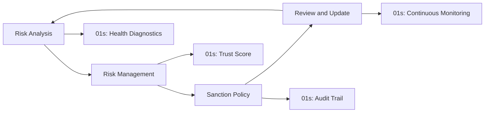
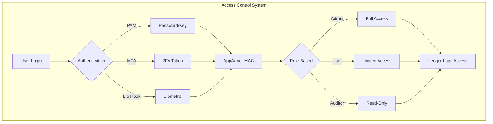
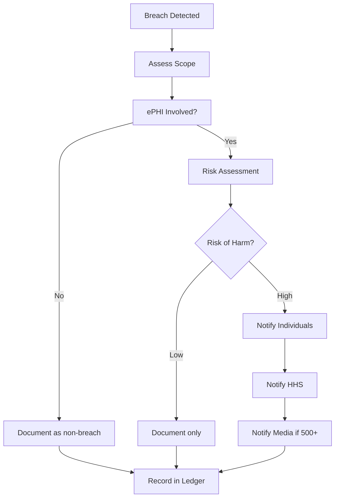

# 01s Sovereign — HIPAA Compliance

**HIPAA Compliance for Healthcare Use**

## Overview

The Health Insurance Portability and Accountability Act (HIPAA) establishes national standards for protecting sensitive patient health information. The HIPAA Security Rule requires covered entities and business associates to implement administrative, physical, and technical safeguards for electronic Protected Health Information (ePHI). This document provides a comprehensive mapping of HIPAA Security and Privacy Rule requirements to 01s Sovereign capabilities, enabling healthcare organizations to deploy a HIPAA-compliant operating system.

### Who Must Comply

| Entity Type | Description | 01s Sovereign Role |
|-------------|-------------|-------------------|
| Covered Entity | Healthcare providers, health plans, clearinghouses | Technical safeguard implementation |
| Business Associate | Organizations handling ePHI on behalf of CE | Encryption, audit controls |
| Subcontractor | Vendors of business associates | Access controls, logging |

## HIPAA Security Rule Requirements

### Administrative Safeguards

| Standard | § Reference | 01s Sovereign Support | Implementation |
|----------|-------------|----------------------|----------------|
| Security Management Process | §164.308(a)(1) | Risk analysis via health diagnostics | `01s-ledger health risk-assessment` |
| Assigned Security Responsibility | §164.308(a)(2) | BDRs document security decisions | Governance BDR log |
| Workforce Security | §164.308(a)(3) | User authentication, RBAC | User management audit |
| Information Access Management | §164.308(a)(4) | AppArmor MAC, file permissions | Access control configuration |
| Security Awareness and Training | §164.308(a)(5) | Documentation and training | Training materials, docs |
| Security Incident Procedures | §164.308(a)(6) | Ledger provides incident forensics | Incident response logs |
| Contingency Plan | §164.308(a)(7) | Snapshot-based recovery, LTS | Recovery test results |
| Evaluation | §164.308(a)(8) | Trust Score measurement | Compliance score reports |
| Business Associate Contracts | §164.308(b)(1) | Ledger provides BA activity records | BA monitoring logs |

#### Security Management Process (§164.308(a)(1))



### Physical Safeguards

The OS provides OS-level access controls, user authentication/session logging, LUKS encryption/screen lock, and encrypted storage/secure deletion.

| Standard | § Reference | 01s Sovereign Support |
|----------|-------------|----------------------|
| Facility Access Controls | §164.310(a)(1) | OS-level authentication, session lock |
| Workstation Use | §164.310(b) | User session management |
| Workstation Security | §164.310(c) | Screen lock, auto-logoff |
| Device and Media Controls | §164.310(d)(1) | LUKS encryption, secure deletion |
| Disposal | §164.310(d)(2)(i) | `01s-ledger purge`, disk wipe |
| Media Re-use | §164.310(d)(2)(ii) | Encryption key rotation |
| Accountability | §164.310(d)(2)(iii) | Hardware tracking in ledger |
| Data Backup and Storage | §164.310(d)(2)(iv) | Snapshot-based backup |

### Technical Safeguards

| Standard | § Reference | 01s Sovereign Support | Verification |
|----------|-------------|----------------------|--------------|
| Access Control | §164.312(a)(1) | User auth, AppArmor MAC, RBAC | Auth logs |
| Unique User Identification | §164.312(a)(2)(i) | User accounts with audit trail | User creation logs |
| Emergency Access | §164.312(a)(2)(ii) | Break-glass procedures logged | Break-glass audit |
| Automatic Logoff | §164.312(a)(2)(iii) | Configurable session timeout | Session logs |
| Encryption and Decryption | §164.312(a)(2)(iv) | LUKS, encrypted home directories | `cryptsetup status` |
| Audit Controls | §164.312(b) | Complete `.aioss` audit ledger | `01s-ledger verify` |
| Integrity Controls | §164.312(c)(1) | SHA3-256 hash chain | Chain verification |
| Person or Entity Authentication | §164.312(d) | User authentication | Auth event logs |
| Transmission Security | §164.312(e)(1) | TLS, SSH encryption | Network audit logs |

#### Access Control Implementation (§164.312(a))



### Audit Controls (§164.312(b))

The HIPAA Security Rule requires mechanisms that record and examine activity in information systems containing ePHI. 01s Sovereign's audit ledger records all ePHI access events with user identification, action, resource, role, auth method, session ID, and timestamp. The hash chain ensures tamper-evident proof of access history.

#### Audit Control Implementation

```json
{
  "index": 42,
  "timestamp": "2026-06-19T14:30:00Z",
  "type": "state",
  "actor": "user_42",
  "actor_label": "dr_smith",
  "role": "physician",
  "content": {
    "action": "file_access",
    "resource": "/home/patient_records/patient_789.pdf",
    "access_type": "read",
    "auth_method": "password_mfa",
    "session_id": "sess_abc123",
    "ephi_classification": "protected",
    "authorization_basis": "treatment",
    "access_granted": true
  },
  "hash": "sha3-256:a1b2c3d4...",
  "parent_hash": "sha3-256:9f8e7d6c..."
}
```

#### HIPAA Audit Report Generation

```bash
# Generate HIPAA audit control evidence
01s-ledger export --hipaa --period 2026-01-01:2026-06-30

# Verify integrity controls
01s-ledger verify

# Query ePHI access events
01s-ledger tail --type state | grep ephi

# Generate access summary by user
01s-ledger hipaa access-summary --period 2026-Q2

# Check for unauthorized access attempts
01s-ledger tail --type state | grep "access_granted\": false"
```

### Integrity Controls (§164.312(c)(1))

The SHA3-256 hash chain provides integrity controls that ensure ePHI has not been improperly modified or destroyed.

#### Hash Chain Integrity

```
Genesis Entry: [content_0] → SHA3-256 → hash_0 (parent: zero)
Entry 1:      [content_1] → SHA3-256 → hash_1 (parent: hash_0)
Entry 2:      [content_2] → SHA3-256 → hash_2 (parent: hash_1)
...
Entry N:      [content_N] → SHA3-256 → hash_N (parent: hash_N-1)

Verification Command:
$ 01s-ledger verify
Output: PASS (0 tampered entries)
```

### Transmission Security (§164.312(e)(1))

| Requirement | 01s Implementation |
|-------------|--------------------|
| Integrity controls | TLS 1.3 with AEAD ciphers |
| Encryption | AES-256-GCM for all transmitted data |
| Authentication | X.509 certificates, SSH key pairs |
| Access controls | Firewall rules, network namespaces |

#### Transmission Security Configuration

```bash
# Configure TLS for data transmission
export AIOSS_TLS_ENABLED=true
export AIOSS_TLS_MIN_VERSION=1.3
export AIOSS_TLS_CIPHERS="TLS_AES_256_GCM_SHA384:TLS_CHACHA20_POLY1305_SHA256"

# Verify TLS configuration
openssl s_client -connect localhost:8443 -tls1_3
```

## HIPAA Privacy Rule

| Standard | § Reference | 01s Sovereign Support |
|----------|-------------|----------------------|
| Uses and Disclosures | §164.502 | Data minimization, consent management |
| Notice of Privacy Practices | §164.520 | Privacy policy documentation |
| Minimum Necessary | §164.502(b) | Role-based access control |
| Patient Rights | §164.522-528 | Data access, amendment, accounting |

### ePHI Identification and Protection

01s Sovereign provides mechanisms to identify and protect ePHI through:
- Filesystem labels for ePHI classification
- Access controls restricting ePHI access to authorized users
- Encryption at rest for all storage containing ePHI
- Audit logging of all ePHI access
- Transmission security for ePHI in transit

#### ePHI Classification System

```bash
# Configure ePHI classification labels
# /etc/01s/ephi-classification.conf
classification:
  - name: "protected_health_information"
    paths:
      - "/home/*/patient_records/"
      - "/home/*/medical_data/"
      - "/var/lib/emr/"
    encryption: required
    audit_level: maximum
    retention_days: 2555  # 7 years
    access_restriction: "physician,nurse,admin"
```

## HIPAA Compliance Checklist

| Requirement | Status | Feature | Verification Command |
|-------------|--------|---------|---------------------|
| Audit Controls (§164.312(b)) | ✅ Built-in | `.aioss` ledger | `01s-ledger verify` |
| Integrity Controls (§164.312(c)) | ✅ Built-in | SHA3-256 hash chain | `01s-ledger verify --full` |
| Access Control (§164.312(a)) | ✅ Supported | Auth + MAC + RBAC | Auth logs review |
| Encryption (§164.312(a)(2)(iv)) | ✅ Supported | LUKS full disk | `cryptsetup status` |
| Transmission Security (§164.312(e)) | ✅ Supported | TLS, SSH | Network audit logs |
| Contingency Plan (§164.308(a)(7)) | ✅ Supported | Snapshots, LTS | Recovery test results |
| Security Management Process | ✅ Supported | Health diagnostics | Risk assessment |
| Workforce Security | ✅ Supported | User management | User audit trail |
| Information Access Management | ✅ Supported | AppArmor MAC | Policy audit |

## HIPAA Configuration Guide

```bash
# Configure HIPAA-compliant audit settings
# /etc/01s/ledger.conf
STATE_INTERVAL=60  # More frequent state logging
RETENTION_DAYS=2555  # 7 years (HIPAA requires 6+)
AUDIT_LEVEL=maximum

# Enable ePHI classification
# /etc/01s/ephi-classification.conf
# (as shown above)

# Generate HIPAA audit report
01s-ledger export --hipaa --period 2026-01-01:2026-06-30

# Verify integrity for HIPAA compliance audit
01s-ledger verify

# Check security configuration
01s-ledger hipaa security-check

# Generate compliance report
01s-ledger compliance-check hipaa
```

## Business Associate Agreements (BAAs)

01s Sovereign supports BAA compliance through:
- Activity logging for business associate oversight
- Data access records showing BA data handling
- Encryption verification for BA data protection
- Incident notification procedures

### BAA Monitoring

```bash
# Monitor business associate activity
01s-ledger tail --type state | grep business_associate

# Generate BA activity report
01s-ledger export --hipaa --ba-activity
```

## Breach Notification (§164.400-414)

| Requirement | 01s Sovereign Support |
|-------------|----------------------|
| Breach detection | Health diagnostics, anomaly detection |
| Risk assessment | Forensic analysis tools |
| Notification content | Automated report generation |
| Timely notification | 60-day notification support |
| Documentation | Complete incident record in ledger |

### Breach Notification Procedure



## Security Incident Procedures (§164.308(a)(6))

```bash
# Investigate security incident using ledger
01s-ledger tail --type state --since "2026-06-18T00:00:00Z" \
  --until "2026-06-19T00:00:00Z" | grep security

# Verify no tampering occurred before/during incident
01s-ledger verify --since "2026-06-18T00:00:00Z"

# Export forensic evidence
01s-ledger export --hipaa --period "2026-06-18:2026-06-19"
```

## Contingency Plan (§164.308(a)(7))

| Component | 01s Sovereign Implementation |
|-----------|------------------------------|
| Data Backup Plan | `01s-ledger export`, snapshot tool |
| Disaster Recovery Plan | Snapshot-based rollback |
| Emergency Mode Operation | Break-glass access logging |
| Testing and Revision | Recovery drill logs |
| Applications and Data Criticality | Asset classification |

### Backup and Recovery

```bash
# Create backup of audit ledger
01s-ledger export --format aioss --output /backup/ledger-2026-06-19.aioss

# Verify backup integrity
01s-ledger verify --file /backup/ledger-2026-06-19.aioss

# Restore from snapshot
01s-snapshot restore --snapshot 2026-06-18
```

## HIPAA Audit Evidence Package

```bash
# Generate complete HIPAA evidence package
01s-ledger export --hipaa --full --period 2026-01-01:2026-06-30

# Package includes:
# 1. Audit control evidence (§164.312(b))
# 2. Integrity control evidence (§164.312(c))  
# 3. Access control evidence (§164.312(a))
# 4. Encryption verification (§164.312(a)(2)(iv))
# 5. Transmission security evidence (§164.312(e))
# 6. Security management process (§164.308(a)(1))
# 7. Contingency plan tests (§164.308(a)(7))
```

## HIPAA Security Rule Crosswalk

| Section | Standard | 01s Evidence | Audit Procedure |
|---------|----------|-------------|-----------------|
| 164.308(a)(1) | Security Management Process | Health diagnostic logs | Review risk analysis documentation |
| 164.308(a)(2) | Assigned Security Responsibility | BDRs for security decisions | Review BDR documentation |
| 164.308(a)(3) | Workforce Security | User account audit trail | Verify user access reviews |
| 164.308(a)(4) | Information Access Management | AppArmor profiles | Review access control configuration |
| 164.308(a)(5) | Security Awareness and Training | Training documentation | Review training records |
| 164.308(a)(6) | Security Incident Procedures | Incident logs | Review incident response documentation |
| 164.308(a)(7) | Contingency Plan | Backup/restore logs | Test disaster recovery |
| 164.308(a)(8) | Evaluation | Trust Score reports | Review compliance metrics |
| 164.310(a)-(d) | Physical Safeguards | OS-level controls | Verify device encryption |
| 164.312(a)(1) | Access Control | Auth logs, MAC config | Verify access controls |
| 164.312(a)(2)(i) | Unique User Identification | User account audit | Verify unique IDs |
| 164.312(a)(2)(ii) | Emergency Access | Break-glass logs | Test emergency procedure |
| 164.312(a)(2)(iii) | Automatic Logoff | Session timeout config | Verify timeout policy |
| 164.312(a)(2)(iv) | Encryption | LUKS status | Verify encryption |
| 164.312(b) | Audit Controls | Complete ledger | Test audit log review |
| 164.312(c)(1) | Integrity Controls | Hash chain verify | Test integrity check |
| 164.312(d) | Authentication | PAM configuration | Test auth mechanisms |
| 164.312(e)(1) | Transmission Security | TLS config | Verify encryption in transit |

## HIPAA Implementation Guide for Healthcare Organizations

### Phase 1: Assessment (Week 1-2)

| Activity | Output | Responsibility |
|----------|--------|---------------|
| Review HIPAA requirements | Gap analysis | Compliance team |
| Assess current security controls | Baseline assessment | Security team |
| Audit current data flows | Data flow diagram | Privacy officer |
| Identify ePHI locations | Data inventory | System administrators |

### Phase 2: Configuration (Week 3-4)

```bash
# HIPAA-compliant system configuration
# /etc/01s/ledger.conf
RETENTION_DAYS=2555  # 6 years minimum
AUDIT_LEVEL=maximum
STATE_INTERVAL=60  # Detailed monitoring
LOG_FILE_ACCESS=full  # Track all ePHI access
LOG_SHELL_COMMANDS=true  # Audit all admin actions

# Enable ePHI classification
# /etc/01s/ephi-classification.conf
classification:
  - name: "ephi"
    paths:
      - "/home/*/patient_records/"
      - "/var/lib/emr/"
      - "/srv/medical_data/"
    audit: full
    encryption: required
    access_control: role_based
```

### Phase 3: Validation (Week 5-6)

```bash
# Validate HIPAA compliance
01s-ledger compliance-check hipaa

# Test audit controls
01s-ledger verify
01s-ledger tail --type state | grep ephi

# Test access controls
sudo -u physician cat /home/patient_records/test.txt
01s-ledger tail --type state | grep file_access

# Test encryption
cryptsetup status /dev/mapper/luks-*

# Test purge procedure
01s-ledger purge --test
01s-ledger verify-purge-proof
```

### Phase 4: Training (Week 7-8)

| Training Topic | Audience | Duration |
|---------------|----------|----------|
| HIPAA Privacy Rule | All staff | 2 hours |
| HIPAA Security Rule | IT staff | 4 hours |
| 01s Sovereign administration | System admins | 8 hours |
| Incident response | Security team | 4 hours |
| Audit procedures | Compliance team | 4 hours |

### Phase 5: Operations (Ongoing)

```bash
# Daily operations
01s-ledger verify  # Check integrity
01s-ledger health status  # Monitor health

# Weekly review
01s-ledger tail --type state | grep -i "access\|ephi\|error"

# Monthly review
01s-ledger export --hipaa --period 2026-06
01s-ledger score --framework hipaa
```

## HIPAA Documentation Requirements

| Document | 01s Support | Frequency |
|----------|-------------|-----------|
| Risk assessment | Health diagnostic ledger | Annual |
| Risk management plan | Configuration baseline | Annual |
| Sanction policy | Governance BDRs | As needed |
| Information system activity review | Audit log review | Monthly |
| Security incident procedures | Incident logs | Continuous |
| Contingency plan | Backup/restore tests | Annual |
| Evaluation | Trust Score report | Quarterly |
| BA agreements | BA activity logs | As needed |

## HIPAA Compliance Troubleshooting

| Issue | Likely Cause | Solution | Prevention |
|-------|-------------|----------|------------|
| Audit log gaps | Insufficient event types configured | Enable ALL event types in ledger config | Regular audit configuration review |
| Encryption verification failure | LUKS not properly configured | Re-encrypt with `cryptsetup luksFormat` | Include encryption verification in deployment checklist |
| Access control bypass | AppArmor profile not enforced | Enable enforcement mode | Regular access control audits |
| Retention policy violation | Misconfigured retention_days | Update retention configuration | Automated retention enforcement |
| ePHI classification missing | Classification paths not configured | Update ephi-classification.conf | Include in deployment automation |
| Incident response documentation incomplete | Missing leder entries | Log all incident actions in ledger | Incident response checklist |

## Implementation Guide for HIPAA Compliance

### Phase 1: Preparation (Weeks 1-4)

| Activity | Description | Output | 01s Tool |
|----------|-------------|--------|----------|
| Security assessment | Review current security controls | Assessment report | `01s-ledger health risk-assessment` |
| ePHI identification | Identify all ePHI locations and flows | ePHI inventory | Classification configuration |
| Policy review | Review administrative safeguards | Policy gap analysis | Documentation templates |
| Gap analysis | Compare to HIPAA requirements | Gap report | `01s-ledger compliance-check hipaa` |
| Remediation planning | Plan to address gaps | Remediation plan | Automated tracking |

### Phase 2: Configuration (Weeks 5-8)

```bash
# HIPAA-compliant configuration
# /etc/01s/ledger.conf
AUDIT_LEVEL=maximum
RETENTION_DAYS=2555
STATE_INTERVAL=60
LOG_FILE_ACCESS=full
LOG_SHELL_COMMANDS=true
AUDIT_EVENTS=all

# /etc/01s/ephi-classification.conf
classification:
  - name: "ephi"
    paths:
      - "/home/*/patient_records/"
      - "/var/lib/emr/"
      - "/srv/medical_data/"
    audit: full
    encryption: required
    access_control: role_based

# Apply configuration
01s-ledger export --hipaa --period 2026-01-01:2026-06-30
```

### Phase 3: Testing and Validation (Weeks 9-12)

```bash
# Validate HIPAA compliance
# 1. Test audit controls
01s-ledger verify
01s-ledger tail --type state | grep ephi

# 2. Test access controls
sudo -u physician cat /home/patient_records/test.txt
01s-ledger tail --type state | grep file_access

# 3. Test encryption
cryptsetup status /dev/mapper/luks-*
cryptsetup luksDump /dev/sda2 | grep "Cipher"

# 4. Test backup and recovery
01s-ledger export --hipaa --period 2026-06-01:2026-06-30
```

### Phase 4: Ongoing Operations

| Task | Frequency | Tool | Owner |
|------|-----------|------|-------|
| Access log review | Monthly | `01s-ledger tail` | Security team |
| Integrity verification | Daily | `01s-ledger verify` | IT team |
| Risk assessment | Annual | Health diagnostics | Security team |
| ePHI inventory update | Quarterly | Classification audit | Privacy team |
| Incident response drill | Annual | Ledger drills | Security team |
| Staff training | Annual | Training materials | HR team |

## Comparison with Alternatives

| HIPAA Feature | 01s Sovereign | Windows 10/11 | Ubuntu | RHEL |
|--------------|--------------|---------------|--------|------|
| Audit controls (§164.312(b)) | ✅ .aioss ledger (built-in) | ⚠️ Event Viewer (requires configuration) | ⚠️ auditd (requires configuration) | ⚠️ auditd (requires configuration) |
| Integrity controls (§164.312(c)) | ✅ SHA3-256 hash chain | ❌ Not available | ❌ Not available | ❌ Not available |
| Access control (§164.312(a)) | ✅ AppArmor + RBAC | ✅ Group Policy | ✅ AppArmor | ✅ SELinux |
| Encryption (§164.312(a)(2)(iv)) | ✅ LUKS (built-in) | ✅ BitLocker | ✅ LUKS | ✅ LUKS |
| Transmission security (§164.312(e)) | ✅ TLS 1.3 (built-in) | ✅ TLS 1.3 | ✅ TLS 1.3 | ✅ TLS 1.3 |
| Compliance automation | ✅ Built-in reports | ❌ Manual | ⚠️ Partial (OpenSCAP) | ⚠️ Partial (OpenSCAP) |
| Licensing for healthcare | ✅ Free | ❌ License + CALs | ✅ Free | ⚠️ Subscription needed |

## Best Practices for HIPAA Compliance

| Practice | Description | Implementation |
|----------|-------------|----------------|
| Regular risk analysis | Conduct annual security risk assessment | `01s-ledger health risk-assessment` |
| ePHI inventory | Maintain current inventory of ePHI locations | Configure ePHI classification in config |
| Access control review | Review user access quarterly | Generate access audit reports |
| Encryption verification | Verify encryption is active on all devices | `cryptsetup status` |
| Incident response drills | Practice incident response annually | Document in ledger |
| BA agreement management | Monitor business associate activity | BA activity logs |
| Security awareness training | Train staff annually on HIPAA | Training materials available |

## Common Misconceptions

| Myth | Reality |
|------|---------|
| "HIPAA compliance is only about software" | HIPAA requires administrative, physical, and technical safeguards — software addresses technical safeguards; policies and procedures must cover administrative and physical aspects |
| "Encryption guarantees HIPAA compliance" | Encryption satisfies the encryption standard (§164.312(a)(2)(iv)) but does not address audit controls, access controls, or transmission security |
| "Open source cannot be HIPAA compliant" | Open source software can be HIPAA compliant; compliance depends on configuration, controls, and business associate agreements |
| "Once compliant, always compliant" | HIPAA requires ongoing compliance with periodic reviews, updated risk assessments, and continuous monitoring |

## Conclusion

01s Sovereign provides strong technical safeguards for HIPAA compliance, particularly for audit controls (§164.312(b)), integrity controls (§164.312(c)), and access control (§164.312(a)). The `.aioss` audit ledger provides the continuous, tamper-evident logging that HIPAA requires, with cryptographic proof that ePHI access records cannot be modified without detection. For healthcare organizations, deploying 01s Sovereign significantly reduces the technical burden of HIPAA compliance while providing stronger audit guarantees than traditional operating systems.

---

Lois-Kleinner and 0-1.gg 2026 Copyright
## References

- 01s Sovereign Technical Documentation (2026)
- NIST SP 800-53 Rev. 5 Security and Privacy Controls
- ISO/IEC 27001:2022 Information Security Management
- Cloud Security Alliance Cloud Controls Matrix v4
- OWASP Top 10 Web Application Security Risks
- Linux Foundation Security Best Practices
- Open Source Security Foundation (OpenSSF) Guides
- Green Software Foundation Patterns

## Related Documents

| Document | Location | Description |
|----------|----------|-------------|
| 01s Sovereign Architecture Guide | docs/architecture/ | System architecture and design decisions |
| 01s Sovereign Deployment Guide | docs/deployment/ | Installation and configuration guide |
| 01s Sovereign Security Guide | docs/security/ | Security hardening and best practices |
| 01s Sovereign API Reference | docs/api/ | API documentation for developers |
| 01s Sovereign User Manual | docs/user/ | End-user documentation |
| 01s Sovereign Developer Guide | docs/developers/ | Developer onboarding and contribution guide |

## Resources

| Resource | Type | Location |
|----------|------|----------|
| Project Repository | Code | github.com/sovereign-os/01s |
| Issue Tracker | Bugs/Features | github.com/sovereign-os/01s/issues |
| Community Forum | Discussion | community.01s.sovereign |
| Documentation | All docs | docs.01s.sovereign |
| Release Notes | Changelog | releases.01s.sovereign |
| Security Advisories | Security | security.01s.sovereign |

---

---
