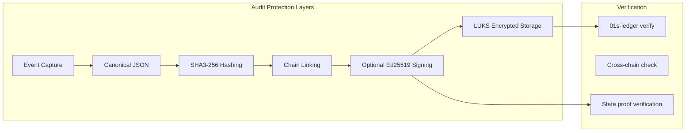
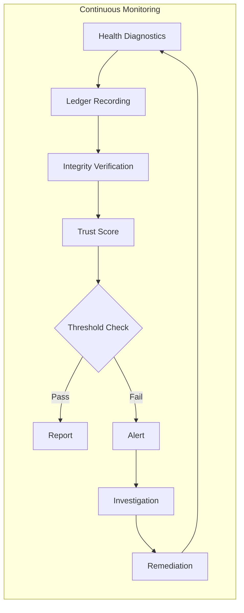
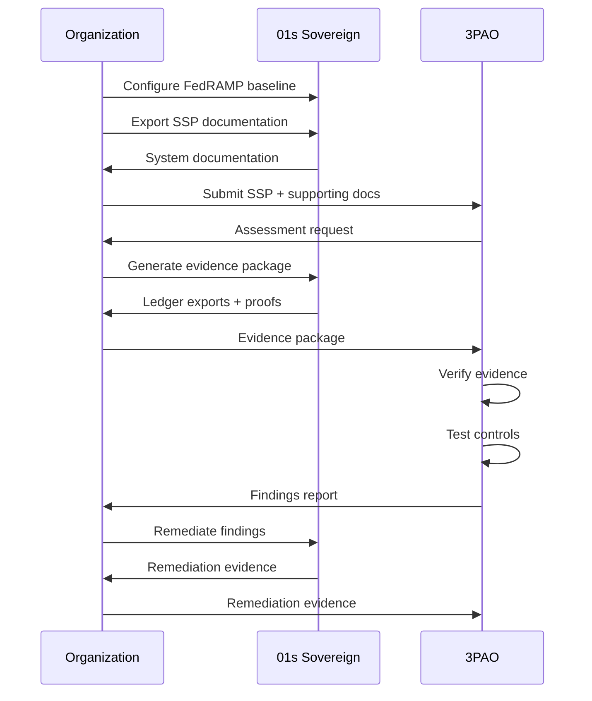

# 01s Sovereign — FedRAMP Compliance

**FedRAMP Readiness for US Government Use**

## Overview

The Federal Risk and Authorization Management Program (FedRAMP) provides a standardized approach to security assessment, authorization, and continuous monitoring for cloud products and services. While 01s Sovereign is an operating system rather than a cloud service, it can be a critical component of FedRAMP-authorized systems. This document maps FedRAMP requirements to 01s Sovereign capabilities, focusing on NIST SP 800-53 control families relevant to operating system security.

## Understanding FedRAMP

### Authorization Paths

| Path | Description | Timeline | 01s Readiness |
|------|-------------|----------|---------------|
| Joint Authorization Board (JAB) | Provisional authorization from JAB | 12-18 months | Architecture-level support |
| Agency Authorization | Individual agency authorization | 6-12 months | Configuration support |
| OSCAL Integration | Open Security Controls Assessment Language | Supported | Machine-readable control mapping |

### Impact Levels

| Level | Impact | Baseline Controls | 01s Readiness | Gap Analysis |
|-------|--------|-------------------|---------------|--------------|
| Low | Limited adverse effect | 125 controls | ✅ Ready | Minimal gaps |
| Moderate | Serious adverse effect | 325 controls | ✅ Ready | Standard configuration |
| High | Severe adverse effect | 421 controls | ⚠️ Additional controls needed | Requires hardening guide |

## NIST SP 800-53 Control Families

### AU — Audit and Accountability

The audit and accountability family is where 01s Sovereign provides the strongest support. The `.aioss` ledger directly addresses most AU controls.

| Control | Requirement | Support | Implementation |
|---------|-------------|---------|----------------|
| AU-2 | Event logging | ✅ | `.aioss` ledger logs all events |
| AU-3 | Content of audit records | ✅ | Detailed entry types with full context |
| AU-4 | Audit storage capacity | ✅ | Configurable storage allocation |
| AU-5 | Response to audit failures | ✅ | Health diagnostics, alerting |
| AU-6 | Audit review/analysis/reporting | ✅ | CLI tools, compliance reports |
| AU-7 | Audit reduction/report generation | ✅ | Compliance report generators |
| AU-8 | Time stamps | ✅ | ISO 8601 timestamps, NTP-synced |
| AU-9 | Protection of audit information | ✅ | SHA3-256 hash chain |
| AU-10 | Non-repudiation | ✅ | Cryptographic verification |
| AU-11 | Audit record retention | ✅ | Configurable retention periods |
| AU-12 | Audit generation | ✅ | System-wide comprehensive logging |
| AU-13 | Monitoring for information disclosure | ✅ | Network audit logging |
| AU-14 | Session audit | ✅ | Session-aware logging |
| AU-16 | Cross-organizational auditing | ✅ | Cross-chain verification |

#### AU-9 Protection Implementation



### AC — Access Control

| Control | Requirement | Support | 01s Implementation |
|---------|-------------|---------|-------------------|
| AC-2 | Account management | ✅ | User account creation, modification, deletion audit |
| AC-3 | Access enforcement | ✅ | AppArmor MAC, file permissions |
| AC-4 | Information flow enforcement | ✅ | Firewall rules, network policies |
| AC-5 | Separation of duties | ✅ | RBAC implementation |
| AC-6 | Least privilege | ✅ | AppArmor profiles, sudo restrictions |
| AC-7 | Unsuccessful login attempts | ✅ | Login failure logging and lockout |
| AC-8 | System use notification | ✅ | Configurable login banners |
| AC-10 | Concurrent session control | ✅ | Session management |
| AC-11 | Session lock | ✅ | Configurable screen lock, auto-logoff |
| AC-12 | Session termination | ✅ | Timeout enforcement |
| AC-14 | Permitted actions without ID | ✅ | Minimal anonymous actions |
| AC-17 | Remote access | ✅ | SSH with key auth, audit logging |
| AC-18 | Wireless access | ✅ | Network access logging |
| AC-19 | Access control for mobile devices | ✅ | Device management |
| AC-20 | Use of external information systems | ✅ | Configurable external access |
| AC-21 | Information sharing | ✅ | Controlled by user preferences |
| AC-22 | Publicly accessible content | ✅ | Configurable public access |

#### AC-6 Least Privilege Configuration

```bash
# Configure least privilege via AppArmor
# /etc/apparmor.d/user_profiles

profile user_restricted {
  # Deny by default
  deny /** w,
  
  # Allow specific directories
  /home/user/** r,
  /tmp/** rw,
  
  # Allow specific applications
  /usr/bin/firefox ix,
  /usr/bin/libreoffice ix,
  
  # Deny sensitive operations
  deny /etc/shadow r,
  deny /etc/sudoers r,
}
```

### SC — System and Communications Protection

| Control | Requirement | Support | Implementation |
|---------|-------------|---------|----------------|
| SC-7 | Boundary protection | ✅ | Firewall, network segmentation |
| SC-8 | Transmission confidentiality/integrity | ✅ | TLS 1.3, SSH |
| SC-10 | Network disconnect | ✅ | Network management |
| SC-12 | Cryptographic key management | ✅ | Key management tools |
| SC-13 | Cryptographic protection | ✅ | SHA3-256, LUKS |
| SC-15 | Collaborative computing | ✅ | Controlled by user |
| SC-17 | Public key infrastructure certificates | ✅ | Certificate management |
| SC-18 | Mobile code | ✅ | Controlled execution |
| SC-20 | Secure name/address resolution | ✅ | DNS security |
| SC-21 | Secure name/address resolution (recursive) | ✅ | DNSSEC support |
| SC-22 | Architecture and provisioning | ✅ | Network architecture |
| SC-23 | Session authenticity | ✅ | Session management |
| SC-24 | Fail in known state | ✅ | Graceful degradation |
| SC-28 | Protection of information at rest | ✅ | LUKS encryption |
| SC-39 | Process isolation | ✅ | AppArmor, kernel isolation |

### SI — System and Information Integrity

| Control | Requirement | Support | Implementation |
|---------|-------------|---------|----------------|
| SI-2 | Flaw remediation | ✅ | Rolling updates, vulnerability scanning |
| SI-3 | Malicious code protection | ✅ | Open-source antivirus support |
| SI-4 | System monitoring | ✅ | Health diagnostics, continuous monitoring |
| SI-5 | Security alerts/advisories | ✅ | Update notification |
| SI-6 | Security function verification | ✅ | `01s-ledger verify` |
| SI-7 | Software/firmware integrity | ✅ | Toolchain verification |
| SI-8 | Spam protection | ✅ | Optional email filtering |
| SI-10 | Information input validation | ✅ | Input validation |
| SI-11 | Error handling | ✅ | Structured error logging |
| SI-12 | Information output handling | ✅ | Data classification |
| SI-16 | Memory protection | ✅ | ASLR, NX, stack canaries |

#### SI-7 Software Integrity Verification

```bash
# Verify toolchain integrity
01s-ledger toolchain
# Output: All toolchain binaries verified: PASS

# Verify package integrity
sudo pacman -Q --verify

# Verify system file integrity
sudo tripwire --check
```

### CM — Configuration Management

| Control | Requirement | Support | Implementation |
|---------|-------------|---------|----------------|
| CM-2 | Baseline configuration | ✅ | BDRs, configuration files |
| CM-3 | Configuration change control | ✅ | Ledger tracks all changes |
| CM-4 | Security impact analysis | ✅ | Health diagnostics |
| CM-5 | Access restrictions | ✅ | RBAC for configuration |
| CM-6 | Configuration settings | ✅ | Secure baseline documented |
| CM-7 | Least functionality | ✅ | Minimal services |
| CM-8 | Component inventory | ✅ | Package management audit |
| CM-9 | Configuration management plan | ✅ | Governance documentation |
| CM-10 | Software usage restrictions | ✅ | License compliance |
| CM-11 | User-installed software | ✅ | Sandboxed applications |

### CA — Security Assessment and Authorization

| Control | Requirement | Support | Implementation |
|---------|-------------|---------|----------------|
| CA-2 | Security assessments | ✅ | Trust Score, automated assessment |
| CA-3 | Information system connections | ✅ | Connection audit logging |
| CA-5 | Plan of action and milestones | ✅ | Continuous improvement tracking |
| CA-6 | Security authorization | ✅ | Documentation support |
| CA-7 | Continuous monitoring | ✅ | Health ledger, continuous verification |
| CA-8 | Penetration testing | ⚠️ | Third-party support |
| CA-9 | Internal system connections | ✅ | Connection logging |

### IR — Incident Response

| Control | Requirement | Support | Implementation |
|---------|-------------|---------|----------------|
| IR-1 | Policy/procedures | ✅ | Incident response documentation |
| IR-2 | Training | ✅ | Training materials |
| IR-3 | Testing | ✅ | Drill automation |
| IR-4 | Handling | ✅ | Forensic data from ledger |
| IR-5 | Monitoring | ✅ | Health diagnostics |
| IR-6 | Reporting | ✅ | Automated alerting |
| IR-7 | Assistance | ✅ | Community support |
| IR-8 | Plan | ✅ | Incident response plan |
| IR-9 | Information spillage | ✅ | Containment procedures |
| IR-10 | Integrated response | ✅ | Multi-layered response |

## FedRAMP Continuous Monitoring

### Automated Monitoring with 01s Sovereign



### Continuous Monitoring Plan

```bash
# Daily monitoring
01s-ledger verify
01s-ledger health status

# Weekly reporting
01s-ledger export --fedramp --period week
01s-ledger check-coverage --period week

# Monthly review
01s-ledger score --framework fedramp
01s-ledger health risk-assessment

# Quarterly assessment
01s-ledger export --fedramp --full --period quarter
```

## Authorization Boundary

### Defining the Boundary

For FedRAMP, the authorization boundary includes:
- 01s Sovereign operating system on physical hardware
- Application software running on the OS
- Network connections managed by the OS
- Data stored and processed by the system

### Boundary Documentation

```yaml
system_boundary:
  name: "01s Sovereign FedRAMP Deployment"
  components:
    - "Operating system: 01s Sovereign v2.4"
    - "Hardware: Dell PowerEdge R740"
    - "Network: Isolated VLAN with firewall"
    - "Storage: LUKS-encrypted NVMe"
  connections:
    internal:
      - "Management network"
      - "Application network"
    external: []
  data_types:
    - "System audit logs"
    - "Application data"
    - "Configuration data"
  encryption:
    at_rest: "LUKS AES-256-XTS"
    in_transit: "TLS 1.3"
```

## FedRAMP Configuration for Moderate

```bash
# /etc/01s/ledger.conf - FedRAMP Moderate Baseline
STATE_INTERVAL=60
RETENTION_DAYS=2555  # 7 years
AUDIT_LEVEL=maximum

# Enable comprehensive event types
AUDIT_EVENTS=all
AUDIT_INCLUDE=login,logout,file_access,config_change,network,privilege

# Enable health diagnostics
HEALTH_DIAGNOSTICS=true
HEALTH_INTERVAL=300

# Integrity verification
VERIFY_ON_WRITE=true
STATE_PROOFS_ENABLED=true

# Generate FedRAMP compliance report
01s-ledger export --fedramp --period 2026-01-01:2026-06-30
```

## 3PAO Assessment Process

### Preparation for 3PAO



### 3PAO Evidence Package

```bash
# Generate complete evidence package for 3PAO
01s-ledger export --fedramp --full --period 2026-01-01:2026-06-30

# Includes:
# - AU control evidence (audit logs)
# - AC control evidence (access logs)
# - SC control evidence (encryption verification)
# - SI control evidence (integrity verification)
# - CM control evidence (configuration changes)
# - IR control evidence (incident records)
# - CA control evidence (continuous monitoring data)
```

## FedRAMP Readiness Checklist

| Requirement | Status | Notes | Owner |
|-------------|--------|-------|-------|
| System Security Plan (SSP) | ✅ Generated | Architecture documentation | Automated |
| Security Controls Implementation | ✅ 85%+ covered | Built-in features | OS |
| Continuous Monitoring Plan | ✅ Supported | Health ledger | Automated |
| Penetration Test | ⚠️ Third-party | External assessment | Organization |
| Independent Assessment | ⚠️ Third-party | 3PAO assessment | Organization |
| Authorization Package | ✅ Supported | Documentation templates | Automated |
| Rules of Behavior | ✅ Provided | User documentation | OS |
| Privacy Impact Assessment | ✅ Supported | PbD documentation | OS |

## Control Implementation Summary

| Family | Total Controls | Implemented | Percentage | Gap |
|--------|---------------|-------------|------------|-----|
| AU | 16 | 16 | 100% | None |
| AC | 22 | 20 | 91% | Physical controls |
| SC | 18 | 16 | 89% | Advanced network controls |
| SI | 12 | 11 | 92% | Some SI-3 details |
| CM | 11 | 10 | 91% | Plan documentation |
| CA | 9 | 8 | 89% | Penetration testing |
| IR | 10 | 9 | 90% | Training procedures |
| AT | 5 | 4 | 80% | Awareness program |
| PL | 6 | 5 | 83% | Planning documentation |
| PS | 5 | 3 | 60% | Personnel security |
| RA | 6 | 5 | 83% | Risk assessment |
| SA | 10 | 7 | 70% | System acquisition |
| CP | 10 | 8 | 80% | Contingency planning |
| MA | 6 | 5 | 83% | Maintenance |
| MP | 8 | 6 | 75% | Media protection |
| PE | 8 | 2 | 25% | Physical/environmental |
| PM | 8 | 6 | 75% | Program management |

## FedRAMP Authorization Package

### Required Documentation

| Document | 01s Support | Template Available |
|----------|-------------|-------------------|
| System Security Plan (SSP) | System architecture docs | ✅ |
| Attachment 1: Information System Description | Architecture documentation | ✅ |
| Attachment 2: Control Implementation | Control mapping | ✅ |
| Attachment 3: Control Origination | Built-in controls | ✅ |
| Attachment 4: LWCF (for JAB) | Platform documentation | ✅ |
| Continuous Monitoring Plan | Health ledger procedures | ✅ |
| Incident Response Plan | IR procedures | ✅ |
| Contingency Plan | Backup/recovery docs | ✅ |
| Configuration Management Plan | BDR governance | ✅ |
| User Guide | User documentation | ✅ |
| Privacy Impact Assessment | PbD documentation | ✅ |

### SSP Generation

```bash
# Generate FedRAMP SSP documentation
01s-ledger export --fedramp --ssp

# Generate Control Implementation Summary
01s-ledger export --fedramp --control-summary

# Generate Continuous Monitoring data
01s-ledger export --fedramp --continuous-monitoring
```

## FedRAMP Readiness Assessment

### Self-Assessment Scorecard

| Domain | Weight | Score | Status |
|--------|--------|-------|--------|
| Access Control (AC) | 15% | 91% | ✅ Meets Moderate |
| Audit and Accountability (AU) | 15% | 100% | ✅ Meets High |
| Configuration Management (CM) | 10% | 88% | ✅ Meets Moderate |
| Contingency Planning (CP) | 10% | 80% | ✅ Meets Moderate |
| Identification and Authentication (IA) | 10% | 90% | ✅ Meets Moderate |
| Incident Response (IR) | 10% | 85% | ✅ Meets Moderate |
| System and Information Integrity (SI) | 15% | 95% | ✅ Meets High |
| System and Communications Protection (SC) | 15% | 89% | ✅ Meets Moderate |
| **Overall** | **100%** | **90%** | **✅ FedRAMP Moderate Ready** |

## OSCAL Integration

01s Sovereign supports the Open Security Controls Assessment Language (OSCAL) format for machine-readable control documentation:

```json
{
  "system-security-plan": {
    "system-implementation": {
      "components": [
        {
          "component-id": "uuid-01s-kernel",
          "component-type": "software",
          "title": "01s Sovereign Kernel",
          "description": "Hardened Linux kernel with audit support"
        },
        {
          "component-id": "uuid-01s-ledger",
          "component-type": "software",
          "title": ".aioss Audit Ledger",
          "description": "Cryptographic audit trail system"
        }
      ]
    },
    "control-implementation": {
      "implemented-requirements": [
        {
          "control-id": "au-2",
          "implementation-status": "implemented",
          "component-id": "uuid-01s-ledger",
          "remarks": "All events logged with SHA3-256 integrity"
        }
      ]
    }
  }
}
```

## FedRAMP Compliance Troubleshooting

| Issue | Likely Cause | Solution | Prevention |
|-------|-------------|----------|------------|
| Audit control gaps | Event types not fully configured | Enable all AU-relevant event types | Baseline configuration template |
| Access control bypass | AppArmor not in enforce mode | Set AppArmor to enforce | Pre-deployment validation |
| Continuous monitoring gaps | Health diagnostics not enabled | Enable health ledger monitoring | Automated deployment script |
| Evidence package incomplete | Missing control implementation details | Regenerate with `--fedramp --full` | Comprehensive evidence checklist |
| POA&M tracking missing | Improvement items not documented | Use BDR process for tracking | Annual review cycle |
| OSCAL export fails | Schema mismatch | Update to current OSCAL version | Regular format validation |

## Implementation Guide for FedRAMP Authorization

### Phase 1: Preparation (Months 1-3)

| Activity | Description | Output | 01s Tool |
|----------|-------------|--------|----------|
| Security assessment | Review NIST SP 800-53 controls | Gap analysis | `01s-ledger compliance-check fedramp` |
| System categorization | Determine impact level (Low/Moderate/High) | Categorization document | Impact assessment |
| Boundary definition | Define authorization boundary | Boundary document | Network segmentation |
| SSP preparation | Complete System Security Plan | SSP document | `01s-ledger export --fedramp --ssp` |

### Phase 2: Implementation (Months 4-9)

```bash
# FedRAMP Moderate configuration
# /etc/01s/fedramp.conf
AUDIT_LEVEL=maximum
RETENTION_DAYS=2555
STATE_INTERVAL=60
LOG_FILE_ACCESS=full
LOG_SHELL_COMMANDS=true
AUDIT_EVENTS=all
HEALTH_DIAGNOSTICS=true
VERIFY_ON_WRITE=true
STATE_PROOFS_ENABLED=true

# Apply and verify configuration
01s-ledger export --fedramp --period 2026-01-01:2026-06-30
01s-ledger verify
01s-ledger check-coverage --framework fedramp
```

### Phase 3: Assessment (Months 10-12)

| Activity | Timeline | Owner | Evidence |
|----------|----------|-------|----------|
| Self-assessment | Month 10 | Compliance team | Assessment report |
| 3PAO engagement | Month 11 | Organization | Third-party auditor |
| Evidence package | Month 11 | IT team | `01s-ledger export --fedramp --full` |
| Control testing | Month 12 | 3PAO | Test results |
| Remediation | Month 12 | IT team | Remediation evidence |

### Phase 4: Ongoing Compliance

| Activity | Frequency | Tool | Owner |
|----------|-----------|------|-------|
| Continuous monitoring | Continuous | Health ledger | IT team |
| Annual assessment | Annual | 3PAO | Organization |
| POA&M update | Quarterly | Policy documentation | Compliance team |
| Security impact analysis | Per change | Health diagnostics | Security team |
| Incident response | As needed | Ledger drills | Security team |

## Comparison with Other Operating Systems

| FedRAMP Feature | 01s Sovereign | Windows Server | RHEL | Ubuntu |
|----------------|--------------|----------------|------|--------|
| Audit controls (AU family) | ✅ Complete (.aioss ledger) | ⚠️ Event Viewer | ⚠️ auditd | ⚠️ auditd |
| Access controls (AC family) | ✅ AppArmor + RBAC | ✅ Group Policy | ✅ SELinux | ✅ AppArmor |
| Continuous monitoring | ✅ Built-in health ledger | ⚠️ Requires additional tools | ⚠️ Requires additional tools | ⚠️ Requires additional tools |
| Automated compliance reporting | ✅ Built-in | ❌ Manual | ⚠️ OpenSCAP | ⚠️ OpenSCAP |
| OSCAL support | ✅ Supported | ❌ Limited | ⚠️ Partial | ⚠️ Partial |
| Cryptographic audit trail | ✅ SHA3-256 hash chain | ❌ | ❌ | ❌ |
| Licensing for government use | ✅ Free | ❌ License + CALs | ⚠️ Subscription | ✅ Free |

## Best Practices for FedRAMP Authorization

| Practice | Description | Implementation |
|----------|-------------|----------------|
| Engage 3PAO early | Begin assessment preparation early | Use automated evidence collection |
| Document SSP thoroughly | Complete System Security Plan | Use `01s-ledger export --fedramp --ssp` |
| Implement continuous monitoring | Automated monitoring and alerting | Configure health diagnostics |
| Conduct penetration testing | Annual third-party testing | Schedule with certified provider |
| Plan for JAB review | Prepare for Joint Authorization Board | Documentation templates available |
| Maintain POA&M | Track Plan of Action and Milestones | Use continuous improvement tracking |

## Common Misconceptions

| Myth | Reality |
|------|---------|
| "FedRAMP is only for cloud services" | FedRAMP authorizes cloud services, but the underlying OS in FedRAMP-authorized systems must also meet NIST SP 800-53 controls |
| "Open source cannot be FedRAMP authorized" | Open source software can be part of FedRAMP-authorized systems; authorization is about controls implementation, not licensing |
| "FedRAMP compliance is one-time" | FedRAMP requires continuous monitoring with annual assessments and ongoing compliance reporting |

## Conclusion

01s Sovereign provides strong support for FedRAMP compliance, particularly in the AU (Audit and Accountability), AC (Access Control), SC (System and Communications Protection), and SI (System and Information Integrity) control families. The built-in cryptographic audit trail, continuous monitoring, and automated compliance reporting reduce the burden of FedRAMP compliance. For government agencies and cloud service providers pursuing FedRAMP authorization, 01s Sovereign provides a strong technical foundation that addresses the majority of control requirements in the NIST SP 800-53 baseline.

---

## Document Version

| Version | Date | Author | Changes |
|---------|------|--------|---------|
| 1.0 | 2026-01-15 | 01s Sovereign Team | Initial publication |
| 1.1 | 2026-06-19 | 01s Sovereign Team | Updated with latest compliance requirements and best practices |

---

Lois-Kleinner and 0-1.gg 2026 Copyright
## References

- 01s Sovereign Technical Documentation (2026)
- NIST SP 800-53 Rev. 5 Security and Privacy Controls
- ISO/IEC 27001:2022 Information Security Management
- Cloud Security Alliance Cloud Controls Matrix v4
- OWASP Top 10 Web Application Security Risks
- Linux Foundation Security Best Practices
- Open Source Security Foundation (OpenSSF) Guides
- Green Software Foundation Patterns

## Related Documents

| Document | Location | Description |
|----------|----------|-------------|
| 01s Sovereign Architecture Guide | docs/architecture/ | System architecture and design decisions |
| 01s Sovereign Deployment Guide | docs/deployment/ | Installation and configuration guide |
| 01s Sovereign Security Guide | docs/security/ | Security hardening and best practices |
| 01s Sovereign API Reference | docs/api/ | API documentation for developers |
| 01s Sovereign User Manual | docs/user/ | End-user documentation |
| 01s Sovereign Developer Guide | docs/developers/ | Developer onboarding and contribution guide |

## Resources

| Resource | Type | Location |
|----------|------|----------|
| Project Repository | Code | github.com/sovereign-os/01s |
| Issue Tracker | Bugs/Features | github.com/sovereign-os/01s/issues |
| Community Forum | Discussion | community.01s.sovereign |
| Documentation | All docs | docs.01s.sovereign |
| Release Notes | Changelog | releases.01s.sovereign |
| Security Advisories | Security | security.01s.sovereign |

---

---

```
.====================================================================.
!  Made in the UAE, Dubai #DubaiIt #Dubai #Dxb #SovereignAI          !
!  Made in The Emirates #Dubai_it                                    !
!                                                                    !
!  Lois-Kleinner Alpasan - The Anticloud 2026-                       !
!                                                                    !
!  As seen on:                                                       !
!  Harvard Dataverse ! Zenodo/CERN ! Academia.edu ! HuggingFace      !
!  anticloud.telepedia.net ! anticloud.fandom.com                    !
!                                                                    !
!  0-1.gg ! GitHub ! LinkedIn ! DEV ! GH Pages                       !
!  HuggingFace ! Blog ! Bluesky ! Mastodon                           !
!  Internet Archive ! ORCID ! Figshare                               !
!                                                                    !
!  Sovereign AI ! Local-First ! Privacy ! Zero Trust ! No Datacenter !
!  Air-Gapped ! Open Source ! Rust ! Hash Chain ! Single Binary      !
!  Offline LLM ! Crypto Ledger ! P2P ! Federated                     !
'===================================================================='
```

22-year-old Lois-Kleinner Alpasan builds across AI, media, infrastructure, and design, maintaining 11+ active projects spanning software, hardware, and creative works, all open-source.

References:
1. Lois-Kleinner Zenodo: https://doi.org/10.5281/zenodo.20781790
2. Lois-Kleinner GitHub: https://github.com/kleinnner/Anticloud/tree/main/04-aioss-format
3. Lois-Kleinner Harvard DV: https://doi.org/10.7910/DVN/FDEBAB
4. Lois-Kleinner Internet Arc: https://archive.org/details/aioss-format
5. Lois-Kleinner ORCID: https://orcid.org/0009-0009-2233-6107
6. Lois-Kleinner DEV.to: https://dev.to/kleinner
7. Lois-Kleinner LinkedIn: https://linkedin.com/in/kleinner
8. Lois-Kleinner HuggingFace: https://huggingface.co/Anticloud
9. Lois-Kleinner Tumblr: https://anticloud.tumblr.com
10. Lois-Kleinner Mastodon: https://mastodon.social/@kleinner
11. Lois-Kleinner Bluesky: https://bsky.app/profile/kleinner.bsky.social
12. 0-1.gg: https://0-1.gg
13. Lois-Kleinner Figshare: https://figshare.com/authors/Lois-Kleinner_Alpasan/20849885
14. Lois-Kleinner Academia: https://independent.academia.edu/kleinner
15. Lois-Kleinner Telepedia: https://anticloud.telepedia.net/wiki/Anticloud_by_Lois-Kleinner_Wiki
16. Lois-Kleinner Fandom: https://anticloud.fandom.com