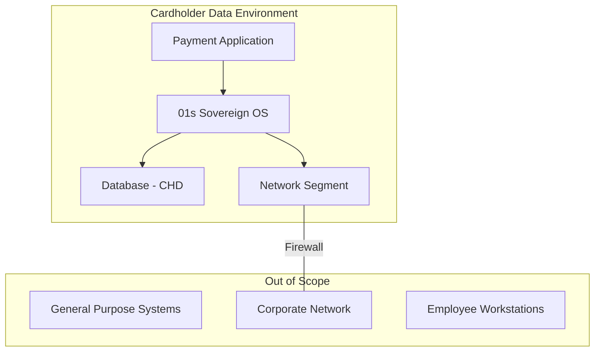
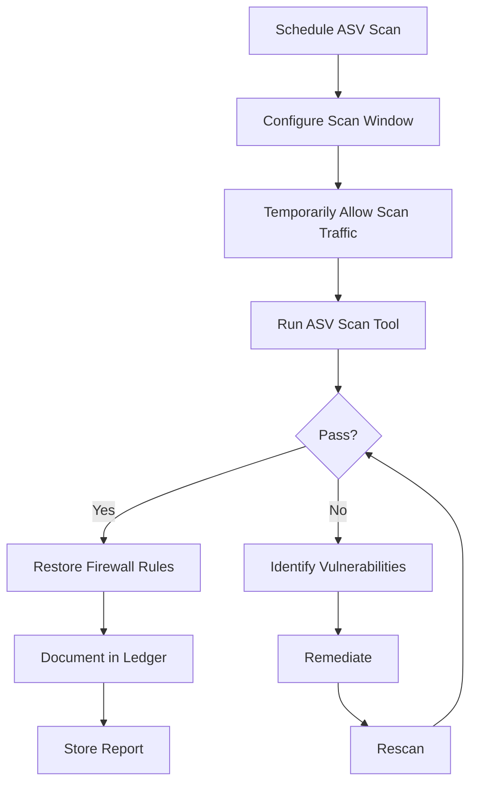
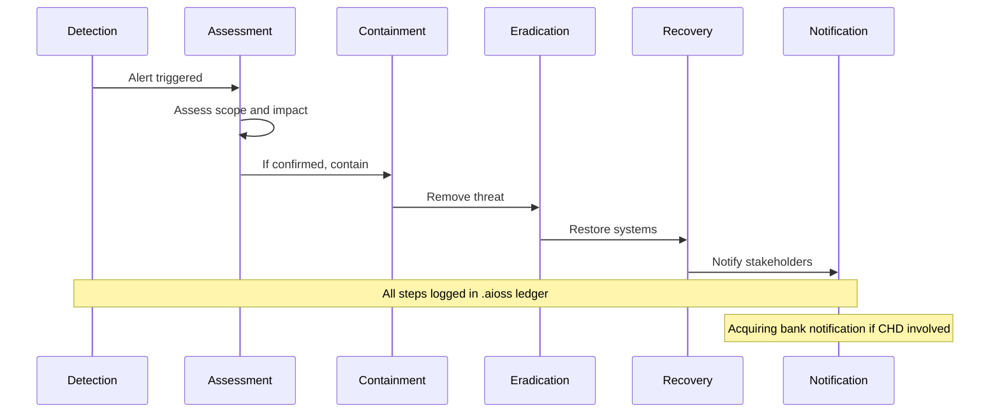

# 01s Sovereign — PCI DSS Compliance

**PCI DSS Compliance for Payment Processing**

## Overview

The Payment Card Industry Data Security Standard (PCI DSS) ensures that organizations that accept, process, store, or transmit credit card information maintain a secure environment. This document maps PCI DSS requirements to 01s Sovereign capabilities. PCI DSS v4.0, effective March 2024, introduced significant changes including increased focus on continuous security monitoring, expanded requirement for multi-factor authentication, and enhanced validation of security controls.

### PCI DSS Scope

The Cardholder Data Environment (CDE) includes all systems that store, process, or transmit cardholder data (CHD) and sensitive authentication data (SAD). 01s Sovereign can be deployed within the CDE boundary to provide enhanced security controls.



## PCI DSS Requirements Mapping

### Requirements 1-2: Build and Maintain a Secure Network

| Requirement | Description | 01s Support | Implementation |
|-------------|-------------|-------------|----------------|
| 1.1 | Firewall configuration | ✅ Default deny-outbound firewall | `iptables -P OUTPUT DROP` |
| 1.2 | Restrict traffic | ✅ AppArmor, firewall rules | Per-application rules |
| 1.3 | Prohibit public access | ✅ Network segmentation | VLAN isolation |
| 1.4 | Personal firewall | ✅ Built-in firewall | Host-based firewall |
| 1.5 | Manage firewall rules | ✅ Change audit | Rule change logging |
| 2.1 | Change vendor defaults | ✅ No default passwords | First boot password prompt |
| 2.2 | Configuration standards | ✅ BDRs for decisions | Security baseline |
| 2.3 | Encrypt admin access | ✅ SSH key-based auth | No password SSH |
| 2.4 | Security configuration | ✅ Hardened by default | CIS benchmark alignment |

#### Firewall Configuration for PCI

```bash
# Default deny outbound policy
sudo iptables -P OUTPUT DROP

# Allow only necessary outbound traffic
sudo iptables -A OUTPUT -p tcp --dport 443 -m state --state ESTABLISHED -j ACCEPT
sudo iptables -A OUTPUT -p tcp --dport 80 -m state --state ESTABLISHED -j ACCEPT

# Allow DNS
sudo iptables -A OUTPUT -p udp --dport 53 -j ACCEPT

# Log all dropped packets
sudo iptables -A OUTPUT -j LOG --log-prefix "OUTPUT-DROP: "

# Enable logging of firewall events to ledger
01s-ledger log firewall-rule --action added --rule "default-deny-outbound"
```

### Requirements 3-4: Protect Cardholder Data

| Requirement | Description | 01s Support | Implementation |
|-------------|-------------|-------------|----------------|
| 3.1 | Minimize storage | ✅ Zero telemetry, minimal collection | Data minimization |
| 3.2 | Don't store auth data | ✅ No sensitive data stored | Architecture constraint |
| 3.3 | Mask PAN when displayed | ✅ Display masking | Configurable masking |
| 3.4 | Render PAN unreadable | ✅ LUKS encryption | Full-disk encryption |
| 3.5 | Document key management | ✅ Key management policy | Key rotation procedures |
| 3.6 | Cryptographic key management | ✅ Key management tools | `openssl`, `tpm2` tools |
| 3.7 | Secure key storage | ✅ TPM support | HSM integration |
| 4.1 | Encrypt transmission | ✅ TLS 1.3 | OpenSSL configuration |
| 4.2 | Don't use weak cryptography | ✅ Strong ciphers only | Cipher suite restriction |

#### Key Management

```bash
# Generate and store encryption key
openssl rand -hex 32 > /etc/01s/encryption.key
chmod 600 /etc/01s/encryption.key

# Seal key in TPM
sudo tpm2_seal -a 0x81000000 -f /etc/01s/encryption.key.sealed \
  --pcr-list sha256:0,4,5,9

# Log key generation in ledger
01s-ledger log crypto-key --operation generation --algorithm AES-256 --timestamp "$(date -u +%Y-%m-%dT%H:%M:%SZ)"
```

### Requirements 5-6: Maintain Vulnerability Management

| Requirement | Description | 01s Support | Implementation |
|-------------|-------------|-------------|----------------|
| 5.1 | Anti-malware mechanisms | ✅ Open-source tools available | ClamAV, rkhunter |
| 5.2 | Anti-malware updated | ✅ Rolling updates | `pacman -Syu` |
| 5.3 | Anti-malware scanning | ✅ Scheduled scanning | `systemd` timers |
| 5.4 | Anti-malware logging | ✅ Ledger integration | Scan result logging |
| 6.1 | Identify vulnerabilities | ✅ Health diagnostic ledger | `01s-ledger health vuln-scan` |
| 6.2 | Prioritize vulnerabilities | ✅ Risk scoring | CVSS integration |
| 6.3 | Install security patches | ✅ Rolling updates | Timely patch deployment |
| 6.4 | Change control | ✅ Audit ledger tracks all changes | Change management |
| 6.5 | Secure coding standards | ✅ Open source code review | Community review |

#### Vulnerability Management

```bash
# Run vulnerability scan
sudo pacman -Syu
sudo clamav-scan /var/www/
sudo rkhunter --check

# Log results to ledger
01s-ledger log vuln-scan --tool clamav --result clean --timestamp "$(date -u +%Y-%m-%dT%H:%M:%SZ)"

# Generate vulnerability report
01s-ledger export --pci-dss --vuln-mgmt
```

### Requirements 7-8: Implement Strong Access Control

| Requirement | Description | 01s Support | Implementation |
|-------------|-------------|-------------|----------------|
| 7.1 | Need-to-know access | ✅ AppArmor MAC | Policy-based access |
| 7.2 | Access control system | ✅ RBAC + MAC | Multi-layer access |
| 7.3 | Access reviews | ✅ Quarterly audit | Access review reports |
| 8.1 | Unique IDs | ✅ User accounts | Account management |
| 8.2 | Multi-factor auth | ✅ 2FA support | TOTP, U2F |
| 8.3 | Secure authentication | ✅ PAM, SSH key auth | Auth configuration |
| 8.4 | MFA for admin access | ✅ MFA required | Admin MFA policy |
| 8.5 | Service accounts | ✅ Managed accounts | Service account audit |
| 8.6 | Application accounts | ✅ Application isolation | Flatpak sandbox |

#### Access Control Implementation

```bash
# Configure MFA
sudo pam-auth-update --enable totp

# Create audit user with read-only access
sudo useradd -m -G audit auditor
sudo passwd -l auditor

# Audit access controls
01s-ledger tail --type state | grep -i "access\|login\|auth"

# Review user access quarterly
01s-ledger access-report --period 2026-Q2
```

### Requirements 9-10: Regularly Monitor and Test Networks

| Requirement | Description | 01s Support | Implementation |
|-------------|-------------|-------------|----------------|
| 9.1 | Facility entry controls | OS-level only | Physical access (org) |
| 9.2 | Visitor management | Guest accounts | Guest account logging |
| 9.3 | Physical security | Device encryption | LUKS |
| 9.4 | Media security | Encrypted storage | Secure disposal |
| 10.1 | Audit trails | ✅ `.aioss` ledger | Complete audit |
| 10.2 | Audit trail entries | ✅ All required fields | Comprehensive entries |
| 10.3 | Audit trail protection | ✅ Hash chain | Tamper-evident |
| 10.4 | Time synchronization | ✅ NTP | Synchronized clocks |
| 10.5 | Audit trail security | ✅ Encryption + access control | Protected logs |
| 10.6 | Log review | ✅ Automated review | Continuous review |
| 10.7 | Log retention | ✅ Configurable retention | Retention policy |

#### Requirement 10: Audit Trails

Requirement 10 is the most directly relevant to 01s Sovereign. The `.aioss` ledger automatically logs:

```json
{
  "index": 42,
  "timestamp": "2026-06-19T14:30:00Z",
  "type": "state",
  "actor": "user_42",
  "content": {
    "action": "user_login",
    "user_id": "user_42",
    "auth_method": "password_mfa",
    "source_ip": "192.168.1.100",
    "session_id": "sess_abc123",
    "success": true,
    "event_type": "access_control"
  },
  "hash": "sha3-256:a1b2c3d4...",
  "parent_hash": "sha3-256:9f8e7d6c..."
}
```

| PCI Requirement | 10.2 Element | 01s Field | Example |
|-----------------|--------------|-----------|---------|
| 10.2.1 | User identification | `actor` + `actor_label` | `user_42`, `dr_smith` |
| 10.2.2 | Event type | `type` + `content.action` | `state`, `user_login` |
| 10.2.3 | Date and time | `timestamp` | `2026-06-19T14:30:00Z` |
| 10.2.4 | Success/failure | `content.success` | `true`, `false` |
| 10.2.5 | Origination | `content.source_ip` | `192.168.1.100` |
| 10.2.6 | Identity of affected data | `content.resource` | `/var/lib/payment/` |

### Requirements 11-12: Maintain Information Security Policy

| Requirement | Description | 01s Support | Implementation |
|-------------|-------------|-------------|----------------|
| 11.1 | Wireless scanning | ✅ Network monitoring | `airodump-ng` |
| 11.2 | ASV scanning | ⚠️ Third-party | ASV integration |
| 11.3 | Penetration testing | ⚠️ Third-party | Annual pentest |
| 11.4 | Intrusion detection | ✅ Health diagnostics | Anomaly detection |
| 11.5 | Change detection | ✅ Hash chain verification | File integrity monitoring |
| 11.6 | Incident response | ✅ Ledger forensics | Incident procedures |
| 12.1 | Information security policy | ✅ BDR governance | Policy documentation |
| 12.2 | Risk assessment | ✅ Trust Score | Risk management |
| 12.3 | Usage policies | ✅ User documentation | Acceptable use policy |
| 12.4 | Third-party security | ✅ Vendor assessment | Third-party management |
| 12.5 | Incident response plan | ✅ Documented | IR procedures |
| 12.6 | Security awareness | ✅ Training materials | Education program |
| 12.7 | Background checks | ⚠️ Organization | HR responsibility |
| 12.8 | Service providers | ✅ BA monitoring | Vendor oversight |
| 12.9 | Third-party confirmation | ✅ Cross-verification | Independent verification |
| 12.10 | Incident response plan testing | ✅ Drill automation | Annual testing |

## PCI DSS v4.0 New Requirements

| New Requirement | Effective Date | 01s Support |
|-----------------|----------------|-------------|
| 2.2.1: Configuration reviews | 2025 | ✅ Automated configuration audit |
| 5.3.3: Anti-malware logging | 2025 | ✅ Ledger integration |
| 6.4.1: Change control | 2025 | ✅ Complete change audit |
| 8.3.5: MFA for all admin | 2025 | ✅ MFA support |
| 8.4.2: MFA for non-console | 2025 | ✅ SSH MFA |
| 10.4.1: Automated log review | 2025 | ✅ Automated review |
| 10.7.2: Retention verification | 2025 | ✅ Automated retention check |

## ASV Scanning

01s Sovereign supports ASV (Approved Scanning Vendor) compliance through:

```bash
# Prepare system for ASV scan
sudo iptables -P INPUT ACCEPT  # Temporarily allow scan
# Run ASV scan tool (provided by ASV)
# Review results
sudo iptables -P INPUT DROP     # Restrict after scan

# Log ASV scan in ledger
01s-ledger log asv-scan --vendor "Vendor Name" --result "pass" --date "2026-06-19"
```

## PCI DSS Configuration

```bash
# /etc/01s/ledger.conf - PCI DSS Configuration
STATE_INTERVAL=60  # Detailed state logging
RETENTION_DAYS=395  # 12 months + 30 days
AUDIT_LEVEL=maximum

# Enable all audit event types for PCI
AUDIT_EVENTS=all
AUDIT_INCLUDE=login,logout,file_access,config_change,network,privilege

# Enable health diagnostics for continuous monitoring
HEALTH_DIAGNOSTICS=true
HEALTH_INTERVAL=300

# Enable maximum audit detail
01s-ledger log config audit_level=maximum

# Verify hash chain integrity for audit
01s-ledger verify

# Generate PCI DSS compliance report
01s-ledger export --pci-dss --period 2026-01-01:2026-06-30
```

## PCI DSS Evidence Package

```bash
# Generate complete PCI DSS evidence package
01s-ledger export --pci-dss --full --period 2026-01-01:2026-06-30

# Package includes:
# - Requirement 1: Firewall rules and changes
# - Requirement 2: Configuration baseline
# - Requirement 3: Encryption configuration
# - Requirement 4: TLS configuration
# - Requirement 7: Access control configuration
# - Requirement 8: Authentication logs
# - Requirement 10: Complete audit trail
# - Requirement 11: Vulnerability scan results
# - Requirement 12: Policy documentation
```

## CDE Scoping

### Determining CDE Boundary

```yaml
cardholder_data_environment:
  systems_in_scope:
    - "Payment application server"
    - "Database server (CHD storage)"
    - "Network segment between payment components"
  systems_out_of_scope:
    - "Employee workstations"
    - "Corporate file servers"
    - "Email systems"
  data_flows:
    - "Cardholder data enters via payment application"
    - "CHD stored in encrypted database"
    - "No CHD transmitted to external systems"
  segmentation:
    method: "VLAN + firewall rules"
    verification: "Periodic penetration testing"
```

## PCI DSS Compliance Automation

```bash
# Automated PCI DSS compliance check
01s-ledger compliance-check pci-dss

# Generate Requirement 10 evidence
01s-ledger export --pci-dss --req10 --period 2026-01-01:2026-06-30

# Generate full evidence package
01s-ledger export --pci-dss --full --period 2026-01-01:2026-06-30
```

## Compliance Validation Procedures

### Quarterly ASV Scan Procedure



### Annual Penetration Test Procedure

1. Define scope (all CDE systems)
2. Engage qualified third-party tester
3. Provide system documentation
4. Conduct white-box testing
5. Document findings
6. Remediate critical/high findings
7. Verify remediation
8. Store results for compliance

## PCI DSS v4.0 Transition Planning

| Requirement | v3.2.1 | v4.0 | Effective Date | Action Needed |
|-------------|--------|------|----------------|---------------|
| 2.2.1 | N/A | Configuration reviews | 2025 | Enable config audit |
| 5.3.3 | N/A | Anti-malware logging | 2025 | Enable ClamAV logging |
| 6.4.1 | Periodic | Continuous change control | 2025 | Enable change audit |
| 8.3.5 | MFA for remote | MFA for all admin | 2025 | Enable MFA |
| 8.4.2 | N/A | MFA for non-console | 2025 | Configure MFA |
| 10.4.1 | Periodic review | Automated log review | 2025 | Enable automated review |
| 10.7.2 | N/A | Retention verification | 2025 | Automated retention check |

## PCI DSS Security Controls

### Network Security Controls

| Control | Implementation | Verification |
|---------|---------------|--------------|
| Firewall rules | Default deny with explicit allow | `iptables -L -n` |
| Network segmentation | VLAN isolation | Network scan |
| Wireless security | WPA3 support | Configuration check |
| File integrity monitoring | SHA3-256 hash chain | `01s-ledger verify` |
| Anti-malware | ClamAV, rkhunter | Scan results |

### Access Control Integration

```bash
# Configure MFA for all administrative access
sudo pam-auth-update --enable totp

# Configure SSH key-only authentication
# /etc/ssh/sshd_config
PasswordAuthentication no
PubkeyAuthentication yes
AuthenticationMethods publickey

# Log authentication configuration
01s-ledger log config-change \
  --setting "ssh_authentication" \
  --value "key-only" \
  --reason "PCI DSS Requirement 8.3"
```

## Incident Response for PCI DSS

### Incident Response Flow



### Forensic Data Collection

```bash
# Collect forensic evidence from ledger
01s-ledger export --pci-dss --period "2026-06-18:2026-06-19"
01s-ledger verify --since "2026-06-18" --until "2026-06-19"
01s-ledger tail --type state | grep -i "access\|login\|config"
```

## PCI DSS Responsibility Matrix

| Requirement | 01s Sovereign | Organization | Shared |
|-------------|---------------|--------------|--------|
| Requirement 1 (Firewall) | Default deny configuration | Rule management | Rule review |
| Requirement 2 (Config) | Hardened baseline | Change management | Config audit |
| Requirement 3 (CHD) | Encryption at rest | Key management | Key procedures |
| Requirement 4 (Transmission) | TLS 1.3 | Certificate management | Certificate renewal |
| Requirement 5 (Malware) | ClamAV integration | Scan schedule | Scan review |
| Requirement 6 (Vulnerability) | Rolling updates | Patch testing | Patch deployment |
| Requirement 7 (Access) | AppArmor MAC | Access policies | Policy review |
| Requirement 8 (Auth) | MFA support | User management | Account review |
| Requirement 9 (Physical) | OS-level controls | Physical security | Physical procedures |
| Requirement 10 (Audit) | Complete ledger | Log review | Review procedures |
| Requirement 11 (Testing) | Verification tools | Penetration testing | Test coordination |
| Requirement 12 (Policy) | Documentation templates | Policy creation | Policy maintenance |

## Implementation Guide for PCI DSS Compliance

### Phase 1: Assessment (Weeks 1-4)

| Activity | Description | Output | 01s Support |
|----------|-------------|--------|-------------|
| Scope definition | Identify CDE boundaries | CDE scope document | Network segmentation |
| Gap analysis | Compare current controls to PCI DSS | Gap analysis report | `01s-ledger compliance-check pci-dss` |
| Risk assessment | Assess risks to CHD | Risk assessment | Health diagnostics |
| Remediation plan | Plan to address gaps | Remediation roadmap | Automated tracking |

### Phase 2: Configuration (Weeks 5-8)

```bash
# PCI DSS compliant configuration
# /etc/01s/ledger.conf
AUDIT_LEVEL=maximum
RETENTION_DAYS=395
STATE_INTERVAL=60
LOG_FILE_ACCESS=full
LOG_SHELL_COMMANDS=true
AUDIT_EVENTS=all

# /etc/01s/security.conf
MFA_REQUIRED=true
SSH_KEY_ONLY=true
DEFAULT_DENY_FIREWALL=true
APPARMOR_ENFORCING=true

# Verify configuration
01s-ledger compliance-check pci-dss --verbose
iptables -L -n
ss -tulpn
```

### Phase 3: Implementation (Weeks 9-16)

| Step | Action | Owner | Verification |
|------|--------|-------|--------------|
| 1 | Deploy hardened 01s configuration | IT team | Configuration audit |
| 2 | Enable MFA for all administrative access | IT team | MFA test |
| 3 | Configure firewall rules for CDE | Security team | Rule review |
| 4 | Set up automated log review | IT team | Log review test |
| 5 | Implement file integrity monitoring | Security team | Hash verification |
| 6 | Configure anti-malware scanning | IT team | Scan test |
| 7 | Test backup and recovery procedures | IT team | Recovery drill |

### Phase 4: Validation (Weeks 17-20)

```bash
# Comprehensive PCI DSS validation
# 1. Verify audit trail completeness
01s-ledger tail --type state | grep -c "access\|login\|config"
echo "Audit events: $(01s-ledger status | grep entries)"

# 2. Test integrity controls
01s-ledger verify --full

# 3. Verify access controls
sudo -u payment_app cat /var/lib/payment/test.txt
01s-ledger tail --type state | grep file_access

# 4. Test encryption
cryptsetup status /dev/mapper/luks-*

# 5. Generate compliance evidence package
01s-ledger export --pci-dss --full --period 2026-01-01:2026-06-30
```

### Phase 5: Ongoing Compliance

| Activity | Frequency | Tool | Owner |
|----------|-----------|------|-------|
| Log review | Daily | `01s-ledger tail` | IT team |
| Vulnerability scan | Quarterly | ASV tool | Security team |
| Penetration test | Annual | Third-party | Security team |
| File integrity check | Weekly | `01s-ledger verify` | IT team |
| Access review | Quarterly | `01s-ledger access-report` | Compliance team |
| Incident response drill | Annual | Ledger drills | Security team |
| Self-assessment questionnaire | Annual | PCI DSS SAQ | Compliance team |

## Best Practices for PCI DSS Compliance

| Practice | Description | Implementation |
|----------|-------------|----------------|
| Regular security scanning | Schedule vulnerability scans per PCI Requirement 11 | Configure automated scanning with `01s-ledger health vuln-scan` |
| Change management | Track all configuration changes per Requirement 6.4 | Ledger records all configuration changes |
| Log review procedures | Conduct regular log reviews per Requirement 10.6 | Schedule daily review of critical events |
| Access control audits | Review user access quarterly per Requirement 7.3 | Generate access review reports |
| Encryption key rotation | Rotate encryption keys per Requirement 3.6 | Document key rotation in ledger |
| Incident response testing | Test incident response annually per Requirement 12.10 | Conduct and log incident drills |

## Comparison with Other Operating Systems

| PCI DSS Feature | 01s Sovereign | Windows Server | Red Hat Enterprise Linux | Ubuntu Server |
|----------------|--------------|----------------|--------------------------|---------------|
| Audit trail completeness | Complete (.aioss ledger) | Event Viewer (limited) | auditd (configurable) | auditd (configurable) |
| Default secure configuration | Hardened by default | Security baselines needed | Security baselines needed | Security baselines needed |
| Open source verifiability | 100% open source | Proprietary | Source available (with subscription) | Open source |
| Licensing cost for CDE deployment | $0 per device | CAL + Server license | Subscription required | $0 (or subscription for support) |
| Automated compliance reporting | Built-in (`01s-ledger export --pci-dss`) | Requires additional tools | Requires additional tools | Requires additional tools |
| Cryptographic audit trail | SHA3-256 hash chain | Not available | Not available | Not available |

## Common Misconceptions

| Myth | Reality |
|------|---------|
| "PCI DSS compliance is only about software" | PCI DSS encompasses policies, procedures, network architecture, and physical security — software is one component |
| "Open source cannot be PCI DSS compliant" | Open source OS can be PCI DSS compliant; compliance depends on configuration and controls, not licensing model |
| "The .aioss ledger alone satisfies Requirement 10" | The ledger provides the technical audit trail, but organizations must also implement log review procedures and retention policies |
| "Linux cannot be used in the CDE" | Linux (including 01s) is widely used in CDEs; PCI DSS does not mandate a specific operating system |

## Conclusion

PCI DSS Requirement 10 is directly satisfied by the `.aioss` audit ledger. Other requirements are supported through encryption, access controls, configuration management, and continuous monitoring. For organizations handling payment card data, 01s Sovereign significantly reduces the technical burden of PCI DSS compliance while providing stronger audit guarantees, continuous monitoring, and automated evidence collection that manual approaches cannot match.

---

Lois-Kleinner and 0-1.gg 2026 Copyright
## Glossary of Key Terms

| Term | Definition |
|------|------------|
| Audit Trail | Chronological record of system events and user actions |
| Cryptographic Hash | One-way mathematical function producing a fixed-size output |
| Hash Chain | Sequence of linked cryptographic hashes ensuring tamper evidence |
| Integrity | Property that data has not been modified without authorization |
| Non-Repudiation | Inability to deny having performed an action |
| Pseudonymization | Replacement of identifying information with artificial identifiers |
| Retention Policy | Rules governing how long data is stored before deletion |
| Role-Based Access Control (RBAC) | Access control based on user roles and permissions |
| Sandboxing | Isolating applications to limit system access |
| Tamper-Evident | Design feature that makes unauthorized modifications detectable |

---
## References

- 01s Sovereign Technical Documentation (2026)
- NIST SP 800-53 Rev. 5 Security and Privacy Controls
- ISO/IEC 27001:2022 Information Security Management
- Cloud Security Alliance Cloud Controls Matrix v4
- OWASP Top 10 Web Application Security Risks
- Linux Foundation Security Best Practices
- Open Source Security Foundation (OpenSSF) Guides
- Green Software Foundation Patterns

## Related Documents

| Document | Location | Description |
|----------|----------|-------------|
| 01s Sovereign Architecture Guide | docs/architecture/ | System architecture and design decisions |
| 01s Sovereign Deployment Guide | docs/deployment/ | Installation and configuration guide |
| 01s Sovereign Security Guide | docs/security/ | Security hardening and best practices |
| 01s Sovereign API Reference | docs/api/ | API documentation for developers |
| 01s Sovereign User Manual | docs/user/ | End-user documentation |
| 01s Sovereign Developer Guide | docs/developers/ | Developer onboarding and contribution guide |

## Resources

| Resource | Type | Location |
|----------|------|----------|
| Project Repository | Code | github.com/sovereign-os/01s |
| Issue Tracker | Bugs/Features | github.com/sovereign-os/01s/issues |
| Community Forum | Discussion | community.01s.sovereign |
| Documentation | All docs | docs.01s.sovereign |
| Release Notes | Changelog | releases.01s.sovereign |
| Security Advisories | Security | security.01s.sovereign |

---

---

```
.====================================================================.
!  Made in the UAE, Dubai #DubaiIt #Dubai #Dxb #SovereignAI          !
!  Made in The Emirates #Dubai_it                                    !
!                                                                    !
!  Lois-Kleinner Alpasan - The Anticloud 2026-                       !
!                                                                    !
!  As seen on:                                                       !
!  Harvard Dataverse ! Zenodo/CERN ! Academia.edu ! HuggingFace      !
!  anticloud.telepedia.net ! anticloud.fandom.com                    !
!                                                                    !
!  0-1.gg ! GitHub ! LinkedIn ! DEV ! GH Pages                       !
!  HuggingFace ! Blog ! Bluesky ! Mastodon                           !
!  Internet Archive ! ORCID ! Figshare                               !
!                                                                    !
!  Sovereign AI ! Local-First ! Privacy ! Zero Trust ! No Datacenter !
!  Air-Gapped ! Open Source ! Rust ! Hash Chain ! Single Binary      !
!  Offline LLM ! Crypto Ledger ! P2P ! Federated                     !
'===================================================================='
```

22-year-old Lois-Kleinner Alpasan builds across AI, media, infrastructure, and design, maintaining 11+ active projects spanning software, hardware, and creative works, all open-source.

References:
1. Lois-Kleinner Zenodo: https://doi.org/10.5281/zenodo.20781790
2. Lois-Kleinner GitHub: https://github.com/kleinnner/Anticloud/tree/main/04-aioss-format
3. Lois-Kleinner Harvard DV: https://doi.org/10.7910/DVN/FSHFZF
4. Lois-Kleinner Internet Arc: https://archive.org/details/aioss-format
5. Lois-Kleinner ORCID: https://orcid.org/0009-0009-2233-6107
6. Lois-Kleinner DEV.to: https://dev.to/kleinner
7. Lois-Kleinner LinkedIn: https://linkedin.com/in/kleinner
8. Lois-Kleinner HuggingFace: https://huggingface.co/Anticloud
9. Lois-Kleinner Tumblr: https://anticloud.tumblr.com
10. Lois-Kleinner Mastodon: https://mastodon.social/@kleinner
11. Lois-Kleinner Bluesky: https://bsky.app/profile/kleinner.bsky.social
12. 0-1.gg: https://0-1.gg
13. Lois-Kleinner Figshare: https://figshare.com/authors/Lois-Kleinner_Alpasan/20849885
14. Lois-Kleinner Academia: https://independent.academia.edu/kleinner
15. Lois-Kleinner Telepedia: https://anticloud.telepedia.net/wiki/Anticloud_by_Lois-Kleinner_Wiki
16. Lois-Kleinner Fandom: https://anticloud.fandom.com
17. AIOSS Offline Verification Kit: https://dataverse.harvard.edu/dataset.xhtml?persistentId=doi:10.7910/DVN/OORKNJ