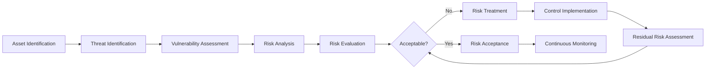
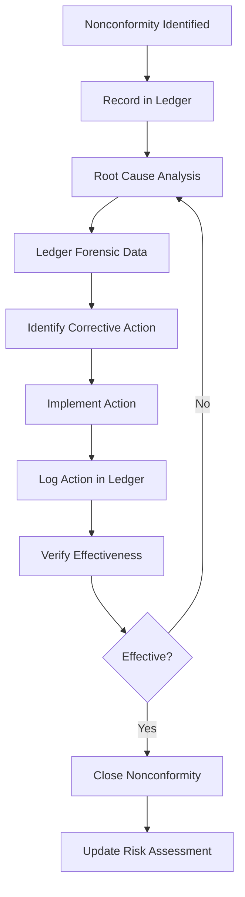
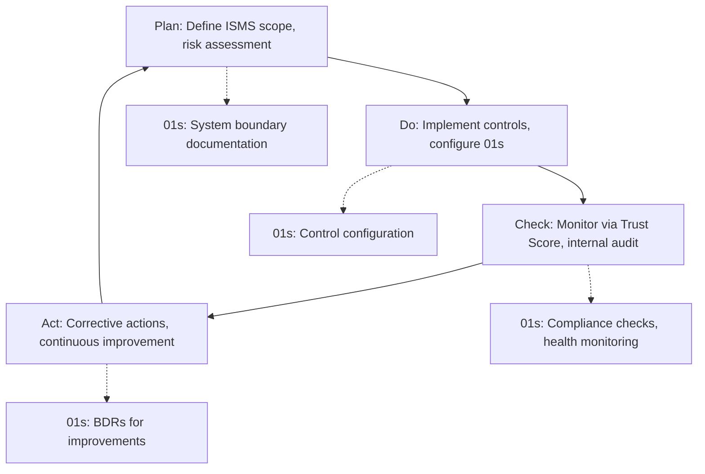

# 01s Sovereign — ISO 27001 Compliance

**ISO 27001 Information Security Management**

## Overview

ISO/IEC 27001 is the international standard for Information Security Management Systems (ISMS). It provides a framework for establishing, implementing, maintaining, and continually improving an ISMS. This document maps ISO 27001 requirements, particularly Annex A controls, to 01s Sovereign capabilities. With 114 controls across 14 themes, ISO 27001 is the most comprehensive information security framework, and 01s Sovereign provides technical controls that address the majority of technology-related requirements.

## ISO 27001 ISMS Framework

### ISMS Clauses

| Clause | Title | 01s Sovereign Support |
|--------|-------|----------------------|
| 4 | Context of the organization | System boundary documentation |
| 5 | Leadership | BDR governance structure |
| 6 | Planning | Risk assessment, Trust Score |
| 7 | Support | Documentation, training materials |
| 8 | Operation | Continuous operation with audit |
| 9 | Performance evaluation | Trust Score, compliance metrics |
| 10 | Improvement | Continuous monitoring, updates |

### Risk Assessment Methodology

01s Sovereign supports the risk assessment process through:
- Asset identification (system component inventory)
- Threat identification (health diagnostics)
- Vulnerability identification (security scanning)
- Risk analysis and evaluation (Trust Score)
- Risk treatment (configuration controls)



## ISO 27001 Annex A Controls

### A.5: Organizational Controls

| Control | Title | 01s Support | Implementation |
|---------|-------|-------------|----------------|
| 5.1 | Policies for information security | BDRs document decisions | Governance BDR log |
| 5.2 | Information security roles | Governance structure documented | Role definitions |
| 5.3 | Segregation of duties | RBAC separation | Access control audit |
| 5.4 | Management responsibilities | Leadership documentation | Governance docs |
| 5.5 | Contact with authorities | Incident reporting procedures | Authority notification |
| 5.6 | Contact with special interest groups | Open source community | Community engagement |
| 5.7 | Threat intelligence | Health diagnostics | Vulnerability monitoring |
| 5.8 | Information security in project management | BDR methodology | Project governance |
| 5.9 | Inventory of information | Ledger data inventory | `01s-ledger status` |
| 5.10 | Acceptable use | User policy documentation | Usage guidelines |
| 5.11 | Return of assets | Decommissioning procedures | Asset tracking |
| 5.12 | Classification of information | Data classification | Classification labels |
| 5.13 | Labelling of information | Ledger entry types | Type classification |
| 5.14 | Information transfer | Export logging | Transfer audit |
| 5.15 | Access control | AppArmor MAC, user auth | AC implementation |
| 5.16 | Identity management | User account management | Identity lifecycle |
| 5.17 | Authentication information | PAM, MFA, SSH keys | Auth configuration |
| 5.18 | Access rights | RBAC implementation | Rights management |
| 5.19 | Information security in supplier relationships | Vendor assessment | Third-party management |
| 5.20 | Addressing security in supplier agreements | DPA documentation | Agreement templates |
| 5.21 | Managing security in ICT supply chain | Dependency verification | SBOM management |
| 5.22 | Monitoring supplier services | Vendor activity logging | Supplier monitoring |
| 5.23 | Information security for cloud services | Local-first by design | No cloud dependency |
| 5.24 | Incident management planning | Incident response plan | IR documentation |
| 5.25 | Assessment of information security incidents | Forensic tools | Incident analysis |
| 5.26 | Response to incidents | Alerting procedures | IR execution |
| 5.27 | Learning from incidents | Post-incident review | Improvement tracking |
| 5.28 | Collection of evidence | `.aioss` ledger forensics | Evidence preservation |
| 5.29 | Disruption during testing | Isolation capabilities | Test environment |
| 5.30 | ICT readiness for business continuity | LTS, snapshot recovery | BCP support |
| 5.31 | Legal, statutory, regulatory requirements | Compliance mapping | Regulatory alignment |
| 5.32 | Intellectual property rights | Open source licensing | License compliance |
| 5.33 | Protection of records | Ledger retention | Record management |
| 5.34 | Privacy and protection of PII | Privacy by design | PbD implementation |
| 5.35 | Independent review of ISMS | Trust Score, external audit | Audit support |
| 5.36 | Compliance with policies | Automated enforcement | Policy verification |
| 5.37 | Documented operating procedures | Configuration documentation | Procedure docs |

### A.6: People Controls

| Control | Title | 01s Support |
|---------|-------|-------------|
| 6.1 | Screening | ⚠️ Organization responsibility |
| 6.2 | Terms and conditions | User agreements |
| 6.3 | Information security awareness | Training materials |
| 6.4 | Disciplinary process | Policy documentation |
| 6.5 | Responsibilities after termination | Account deactivation |
| 6.6 | Confidentiality agreements | BAA templates |
| 6.7 | Remote working | Secure remote access configuration |
| 6.8 | Information security event reporting | Alerting system |

### A.7: Physical Controls

| Control | Title | 01s Support |
|---------|-------|-------------|
| 7.1 | Physical security perimeter | OS-level only (org responsibility) |
| 7.2 | Physical entry | Authentication + logging |
| 7.3 | Securing offices, rooms, facilities | Device encryption |
| 7.4 | Physical security monitoring | Health diagnostics |
| 7.5 | Protecting against threats | Environmental monitoring |
| 7.6 | Working in secure areas | Session management |
| 7.7 | Clear desk and clear screen | Screen lock, auto-logoff |
| 7.8 | Equipment siting and protection | LUKS encryption |
| 7.9 | Security of assets off-premises | Mobile device management |
| 7.10 | Storage media | Encrypted storage |
| 7.11 | Supporting utilities | Resource monitoring |
| 7.12 | Cabling security | Network isolation |
| 7.13 | Equipment maintenance | Patch management |
| 7.14 | Secure disposal or reuse | `01s-ledger purge`, disk wipe |

### A.8: Technological Controls

The technological controls theme is where 01s Sovereign provides the strongest support.

| Control | Title | 01s Support | Verification |
|---------|-------|-------------|--------------|
| 8.1 | User endpoint devices | ✅ Full OS management | Device inventory |
| 8.2 | Privileged access rights | ✅ sudo, MAC, RBAC | Privilege audit |
| 8.3 | Information access restriction | ✅ AppArmor profiles | Policy enforcement |
| 8.4 | Access to source code | ✅ Open source repository | Source availability |
| 8.5 | Secure authentication | ✅ PAM, 2FA, SSH | Auth logs |
| 8.6 | Capacity management | ✅ Health diagnostics | Resource monitoring |
| 8.7 | Malware protection | ✅ Open-source tools | ClamAV integration |
| 8.8 | Vulnerability management | ✅ Rolling updates | Patch status |
| 8.9 | Configuration management | ✅ BDRs, configuration files | Config audit |
| 8.10 | Information deletion | ✅ `01s-ledger purge` | Deletion proof |
| 8.11 | Data masking | ✅ Pseudonymization | Masking configuration |
| 8.12 | Data leakage prevention | ✅ AppArmor + encryption | DLP controls |
| 8.13 | Backup | ✅ Snapshot tool, export | Backup verification |
| 8.14 | Redundancy | ✅ LTS, failover | Redundancy testing |
| 8.15 | Logging | ✅ Complete `.aioss` ledger | `01s-ledger verify` |
| 8.16 | Monitoring | ✅ Health diagnostics | Continuous monitoring |
| 8.17 | Clock synchronization | ✅ NTP | Timestamp accuracy |
| 8.18 | Use of privileged utility programs | ✅ Sudo logging | Utility audit |
| 8.19 | Installation of software | ✅ Package audit | Package change log |
| 8.20 | Network security | ✅ Firewall, segmentation | Network audit |
| 8.21 | Network segregation | ✅ VLAN support | Isolation verification |
| 8.22 | Network services | ✅ Service management | Service inventory |
| 8.23 | Web filtering | ✅ DNS filtering | Content blocking |
| 8.24 | Cryptography | ✅ SHA3-256, LUKS, TLS | Crypto verification |
| 8.25 | Development lifecycle | ✅ Open source development | SDLC documentation |
| 8.26 | Application security | ✅ Sandboxing | App isolation |
| 8.27 | Secure development environment | ✅ Containment | Dev environment |
| 8.28 | Outsourced development | ✅ Open source collaboration | Vendor oversight |
| 8.29 | Security testing | ✅ Automated scanning | Test results |
| 8.30 | Outsourced development testing | ✅ Third-party verification | Independent testing |
| 8.31 | Separation of development/test/production | ✅ Environment isolation | Environment policy |
| 8.32 | Change management | ✅ Audit trail | Change records |
| 8.33 | Test information | ✅ Test data management | Data protection |
| 8.34 | Protection of audit logs | ✅ SHA3-256 hash chain | Log integrity |

#### A.8.15 Logging Implementation

```bash
# Configure logging per ISO 27001 requirements
# /etc/01s/ledger.conf
STATE_INTERVAL=300
RETENTION_DAYS=1095  # 3 years
AUDIT_LEVEL=standard

# Enable comprehensive logging
01s-ledger log config audit_level=standard

# Verify logging is operational
01s-ledger status
# Should show active logging with configured retention
```

#### A.8.24 Cryptography Implementation

```bash
# Verify cryptographic configuration
cryptsetup status /dev/mapper/luks-*
openssl version -a
01s-ledger verify

# Check TLS configuration
openssl s_client -connect localhost:8443 -tls1_3

# Document cryptographic controls
01s-ledger export --iso-27001 --cryptography
```

## ISO 27001 and the Audit Ledger

### Clause 9.2: Internal Audit

The `.aioss` ledger supports internal audits by providing complete, verifiable records of all system events, enabling internal auditors to independently verify system integrity.

#### Internal Audit Procedure

```bash
# Step 1: Verify ledger integrity
01s-ledger verify

# Step 2: Export audit data for review period
01s-ledger export --iso-27001 --period 2026-01-01:2026-06-30

# Step 3: Review controls
01s-ledger compliance-check iso-27001

# Step 4: Generate audit report
01s-ledger export --iso-27001 --internal-audit
```

### Clause 9.3: Management Review

Ledger data supports management reviews through Trust Score metrics, health diagnostic trends, security incident summaries, and compliance status reports.

#### Management Review Dashboard

| Metric | Source | Frequency | Threshold |
|--------|--------|-----------|-----------|
| Trust Score | `01s-ledger score` | Monthly | > 0.9 |
| Security incidents | Incident log | Quarterly | Trend analysis |
| Compliance status | Compliance check | Quarterly | No critical gaps |
| Risk level | Risk assessment | Quarterly | Acceptable |
| Audit findings | Internal audit | Annually | Action plan |
| KPI achievement | Performance metrics | Quarterly | On target |

### Clause 10.1: Nonconformity and Corrective Action

When nonconformities are identified, the ledger provides complete forensic data for root cause analysis.

#### Corrective Action Process



## Statement of Applicability (SOA)

The SOA documents which Annex A controls are applicable and how they are implemented.

### SOA for 01s Sovereign

```yaml
statement_of_applicability:
  version: "1.0"
  date: "2026-06-19"
  scope: "01s Sovereign operating system deployment"
  
  applicable_controls:
    - id: "A.5.1"
      title: "Policies for information security"
      applicability: "Applicable"
      implementation: "BDR governance"
      justification: "BDRs document all security decisions"
      
    - id: "A.8.15"
      title: "Logging"
      applicability: "Applicable"
      implementation: "`.aioss` audit ledger"
      justification: "Complete, tamper-evident logging"
      
    - id: "A.8.24"
      title: "Cryptography"
      applicability: "Applicable"
      implementation: "SHA3-256, LUKS, TLS"
      justification: "Cryptographic controls meet requirements"
      
  excluded_controls:
    - id: "A.7.1"
      title: "Physical security perimeter"
      exclusion_reason: "Operating system cannot control physical perimeter"
      compensating_control: "Encryption and access controls"
```

## ISO 27001 Configuration

```bash
# /etc/01s/ledger.conf - ISO 27001 Configuration
STATE_INTERVAL=300
RETENTION_DAYS=1095  # 3 years
AUDIT_LEVEL=standard

# Enable logging for all relevant event types
AUDIT_EVENTS=all
AUDIT_INCLUDE=login,logout,file_access,config_change,network,privilege

# Generate ISO 27001 compliance reports
01s-ledger export --iso-27001 --period 2026-01-01:2026-06-30
01s-ledger export --iso-27001 --soa
01s-ledger export --iso-27001 --internal-audit

# Verify system integrity
01s-ledger verify
01s-ledger health status
```

## ISMS Documentation

01s Sovereign provides automated ISMS documentation:

| Document | Source | Automated |
|----------|--------|-----------|
| ISMS scope | System boundary documentation | ✅ |
| Information security policy | BDR governance | ✅ |
| Risk assessment methodology | Trust Score framework | ✅ |
| Risk treatment plan | Control implementation | ✅ |
| Statement of Applicability | Control mapping | ✅ |
| Internal audit plan | Audit schedule | ✅ |
| Incident response plan | IR documentation | ✅ |
| Business continuity plan | LTS/snapshot procedures | ✅ |

## ISO 27001 Internal Audit Procedure

### Audit Preparation

```bash
# Step 1: Verify ledger integrity covering the audit period
01s-ledger verify --since 2026-01-01 --until 2026-06-30

# Step 2: Export control evidence
01s-ledger export --iso-27001 --period 2026-01-01:2026-06-30

# Step 3: Generate control compliance report
01s-ledger compliance-check iso-27001 --output format=json

# Step 4: Review findings and prepare audit report
```

### Audit Checklist

| Control Area | Evidence Source | Review Method | Pass Criteria |
|-------------|----------------|--------------|--------------|
| A.5 Policies | BDR repository | Document review | All BDRs current |
| A.6 People | User accounts | User audit | Accounts match roles |
| A.7 Physical | Device encryption | LUKS check | Encryption active |
| A.8 Technology | Ledger export | Evidence review | Controls operating |
| Risk Assessment | Health diagnostics | Risk review | Risks documented |
| Incident Response | Incident logs | Log review | All incidents tracked |
| Business Continuity | Backup logs | Recovery test | Recovery successful |

### Audit Report Template

```yaml
internal_audit_report:
  date: "2026-06-19"
  auditor: "Internal Audit Team"
  scope: "01s Sovereign deployment"
  standard: "ISO/IEC 27001:2022"
  
  summary:
    total_controls: 114
    applicable_controls: 78
    compliant: 72
    partially_compliant: 5
    non_compliant: 1
    
  findings:
    - control: "A.8.15"
      status: "compliant"
      evidence: "Complete `.aioss` ledger"
      
    - control: "A.8.24"
      status: "compliant"
      evidence: "SHA3-256, LUKS, TLS verified"
      
    - control: "A.7.1"
      status: "non_compliant"
      finding: "Physical security is organizational responsibility"
      recommendation: "Implement facility access controls"
      
  conclusion: "ISMS controls are effectively designed and operating"
```

## ISO 27001 Management Review

### Review Input Data

```bash
# Collect data for management review
01s-ledger score --framework iso-27001
01s-ledger health status --format json
01s-ledger tail --type state | grep -i "incident\|security\|breach"
```

### Review Agenda

1. Status of previous action items
2. Changes in external context (regulatory, threat landscape)
3. Information security performance (Trust Score trends)
4. Security incidents and corrective actions
5. Audit results and findings
6. Risk assessment updates
7. Improvement opportunities

### Review Output

| Output | Description | Owner |
|--------|-------------|-------|
| Risk acceptance | Residual risks approved | Management |
| Improvement plan | Corrective actions | ISMS team |
| Resource requirements | Budget, personnel | Management |
| Policy updates | Policy changes | Document control |
| Audit schedule | Next audit dates | Internal audit |

## ISO 27001 Continuous Improvement

### PDCA Cycle with 01s Sovereign



### KPI Tracking

| KPI | Target | Measurement | 01s Source |
|-----|--------|-------------|------------|
| System uptime | > 99.5% | Availability | Health diagnostics |
| Security incidents | < 5/year | Incident count | Ledger incident logs |
| Patch latency | < 30 days | Time to patch | Update history |
| Audit finding closure | < 60 days | Closure time | BDR tracking |
| User training | 100% annually | Training records | Training logs |
| Risk assessment currency | Quarterly | Assessment date | Health risk checks |

## ISO 27001 Documentation Templates

### Information Security Policy

```markdown
# Information Security Policy

**Organization**: [Organization Name]
**Effective Date**: 2026-06-19
**Approved By**: [Management]
**BDR Reference**: BDR-2026-001

## Policy Statement
[Organization] is committed to protecting the confidentiality,
integrity, and availability of information assets. This policy
is supported by the technical controls implemented in
01s Sovereign.

## Scope
This policy applies to all systems running 01s Sovereign
within the organization.

## Principles
1. **Data Minimization**: Only collect necessary data
2. **Least Privilege**: Access only what is needed
3. **Defense in Depth**: Multiple security layers
4. **Continuous Monitoring**: Always verify
5. **Accountability**: All actions are logged

## Responsibilities
- **Management**: Provide resources for security
- **IT**: Implement and maintain controls
- **Users**: Follow security procedures
- **Auditors**: Verify compliance

## Review
This policy is reviewed annually or after significant changes.
```

### Risk Assessment Methodology

```yaml
risk_assessment_methodology:
  approach: "Asset-based, quantitative and qualitative"
  frequency: "Quarterly, and after significant changes"
  
  risk_calculation: |
    Risk = Likelihood × Impact
    
    Likelihood: 1-5 (Rare to Almost Certain)
    Impact: 1-5 (Insignificant to Catastrophic)
    
    Risk Level:
      1-4: Low (Acceptable)
      5-9: Medium (Monitor)
      10-16: High (Mitigation required)
      17-25: Critical (Immediate action)
  
  acceptance_criteria:
    - "Low risks are accepted by default"
    - "Medium risks require documented acceptance"
    - "High and critical risks require remediation plan"
  
  tools:
    assessment: "01s-ledger health risk-assessment"
    monitoring: "01s-ledger health status"
    reporting: "01s-ledger export --iso-27001"
```

## Conclusion

01s Sovereign provides strong technical support for ISO 27001 compliance, particularly in the A.8 (Technological Controls) theme. The `.aioss` audit ledger directly supports logging (8.15), monitoring (8.16), protection of audit logs (8.34), and information deletion (8.10) requirements. For organizations implementing an ISMS, 01s Sovereign provides the technical foundation that addresses the majority of technology-related Annex A controls, reducing the operational burden of compliance while improving the quality and verifiability of security controls.

---

Lois-Kleinner and 0-1.gg 2026 Copyright

```
.====================================================================.
!  Made in the UAE, Dubai #DubaiIt #Dubai #Dxb #SovereignAI          !
!  Made in The Emirates #Dubai_it                                    !
!                                                                    !
!  Lois-Kleinner Alpasan - The Anticloud 2026-                       !
!                                                                    !
!  As seen on:                                                       !
!  Harvard Dataverse ! Zenodo/CERN ! Academia.edu ! HuggingFace      !
!  anticloud.telepedia.net ! anticloud.fandom.com                    !
!                                                                    !
!  0-1.gg ! GitHub ! LinkedIn ! DEV ! GH Pages                       !
!  HuggingFace ! Blog ! Bluesky ! Mastodon                           !
!  Internet Archive ! ORCID ! Figshare                               !
!                                                                    !
!  Sovereign AI ! Local-First ! Privacy ! Zero Trust ! No Datacenter !
!  Air-Gapped ! Open Source ! Rust ! Hash Chain ! Single Binary      !
!  Offline LLM ! Crypto Ledger ! P2P ! Federated                     !
'===================================================================='
```

Lois-Kleinner Alpasan, 22, has served executive roles spanning technology, operations, finance, and product across 20+ organizations. His cross-functional work combines architecture, business, and AI strategy.

References:
1. Lois-Kleinner Zenodo: https://doi.org/10.5281/zenodo.20781790
2. Lois-Kleinner GitHub: https://github.com/kleinnner/Anticloud/tree/main/04-aioss-format
3. Lois-Kleinner Harvard DV: https://doi.org/10.7910/DVN/KFK12Y
4. Lois-Kleinner Internet Arc: https://archive.org/details/aioss-format
5. Lois-Kleinner ORCID: https://orcid.org/0009-0009-2233-6107
6. Lois-Kleinner DEV.to: https://dev.to/kleinner
7. Lois-Kleinner LinkedIn: https://linkedin.com/in/kleinner
8. Lois-Kleinner HuggingFace: https://huggingface.co/Anticloud
9. Lois-Kleinner Tumblr: https://anticloud.tumblr.com
10. Lois-Kleinner Mastodon: https://mastodon.social/@kleinner
11. Lois-Kleinner Bluesky: https://bsky.app/profile/kleinner.bsky.social
12. 0-1.gg: https://0-1.gg
13. Lois-Kleinner Figshare: https://figshare.com/authors/Lois-Kleinner_Alpasan/20849885
14. Lois-Kleinner Academia: https://independent.academia.edu/kleinner
15. Lois-Kleinner Telepedia: https://anticloud.telepedia.net/wiki/Anticloud_by_Lois-Kleinner_Wiki
16. Lois-Kleinner Fandom: https://anticloud.fandom.com
17. AIOSS Offline Verification Kit: https://dataverse.harvard.edu/dataset.xhtml?persistentId=doi:10.7910/DVN/OORKNJ