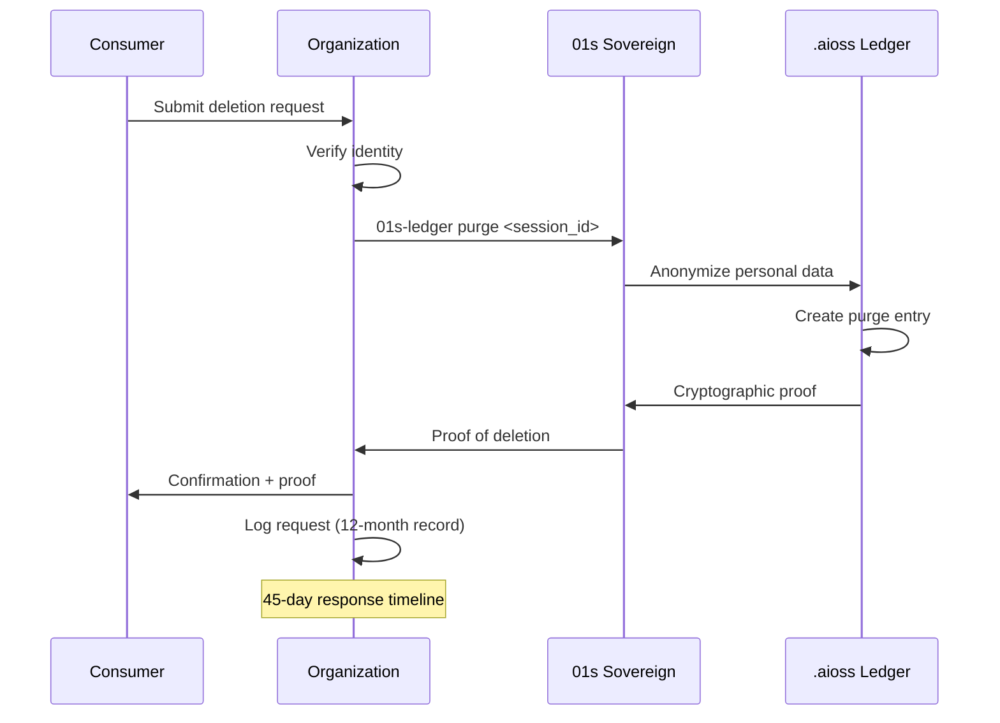
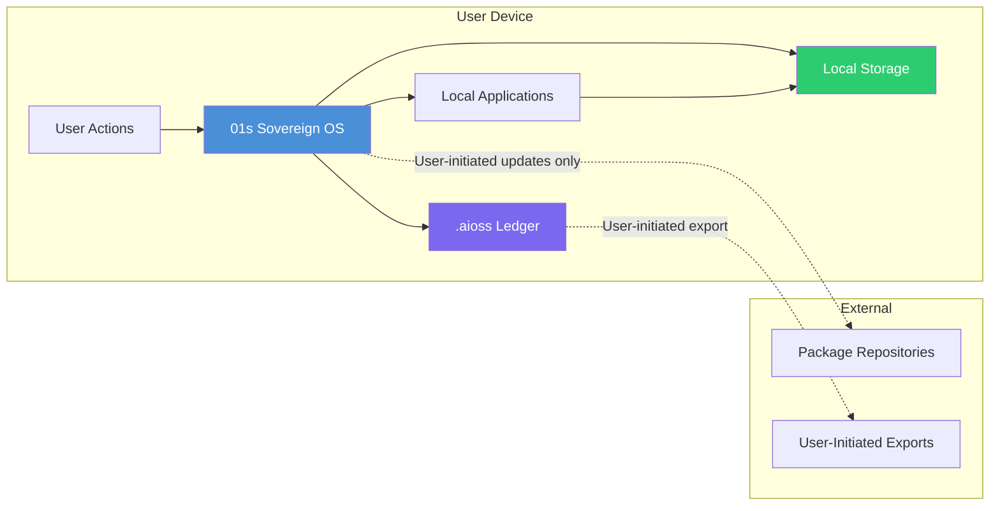
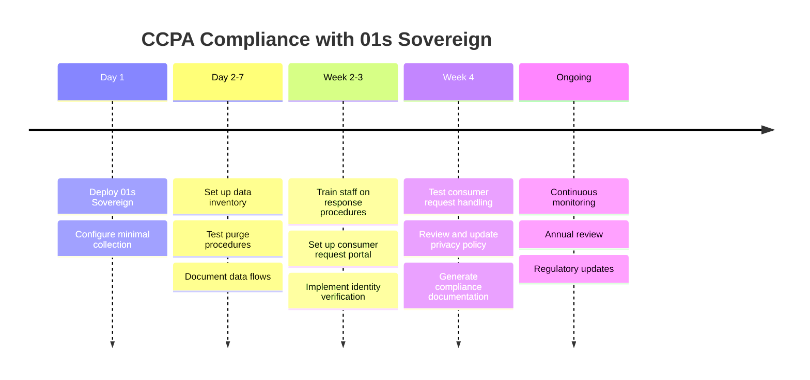
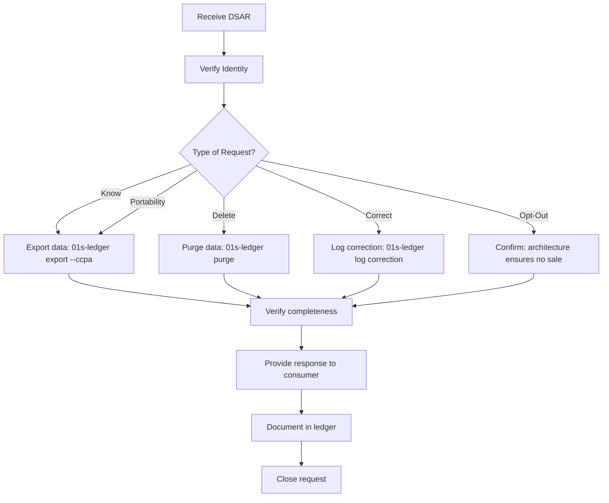

# 01s Sovereign — CCPA Compliance

**California Consumer Privacy Act Compliance**

## Overview

The California Consumer Privacy Act (CCPA) grants California residents rights over their personal information. Effective January 2020, enforced by the California Privacy Protection Agency (CPPA). The California Privacy Rights Act (CPRA), effective January 2023, expanded CCPA requirements including sensitive personal information provisions, opt-out preference signals, and enhanced audit requirements. This document maps CCPA/CPRA requirements to 01s Sovereign capabilities.

### CCPA vs CPRA

| Aspect | CCPA (2020) | CPRA (2023) | 01s Impact |
|--------|-------------|-------------|------------|
| Rights | Know, Delete, Opt-Out | + Correct, Limit Use, Opt-In for minors | Enhanced controls |
| Sensitive PI | Not defined | Defined and protected | Classification support |
| Opt-Out | Sale only | Sale + Sharing for cross-context behavioral | GPC support |
| Enforcement | AG | CPPA | Documentation ready |
| Audits | Not required | Risk assessments required | Automated support |
| Retention | Not specified | Purpose limitation enforced | Configurable retention |

## CCPA Consumer Rights

| Right | Description | 01s Support | Implementation |
|-------|-------------|-------------|----------------|
| Right to Know | Know what personal information is collected | Complete ledger transparency | `01s-ledger tail`, `01s-ledger export` |
| Right to Delete | Delete personal information | `01s-ledger purge` with cryptographic proof | Verifiable deletion |
| Right to Opt-Out | Opt out of sale/sharing | Zero telemetry — no data is ever sold | Architecture constraint |
| Right to Non-Discrimination | No retaliation for exercising rights | Built into architecture | Equal access guarantee |
| Right to Correct | Correct inaccurate information | Append-only corrections in ledger | Correction entries |
| Right to Limit Use | Limit use of sensitive personal information | Granular privacy controls | Configurable consent |
| Right to Opt-In (minors) | Affirmative consent for minors | Age verification hooks | Parental consent support |
| Right to Portability | Obtain data in portable format | Multiple export formats | JSON, CSV, AIOSS |

### Right to Know (§1798.110)

Users can view all data (`01s-ledger tail`), export in portable format (`01s-ledger export`), and count data categories (`01s-ledger status`). The ledger also documents categories of personal information collected, sources, business purposes, and third parties (none).

#### Data Inventory for Right to Know

```json
{
  "ccpa_data_inventory": {
    "generated_at": "2026-06-19T10:00:00Z",
    "data_categories": [
      {
        "category": "System Events",
        "personal_information": false,
        "sensitive_pi": false,
        "source": "System operation",
        "business_purpose": "System audit and security",
        "third_party_sharing": false,
        "retention": "30 days (configurable)",
        "sold": false,
        "shared": false
      },
      {
        "category": "User Authentication Records",
        "personal_information": true,
        "sensitive_pi": false,
        "source": "User authentication",
        "business_purpose": "Access control",
        "third_party_sharing": false,
        "retention": "30 days (configurable)",
        "sold": false,
        "shared": false
      }
    ],
    "categories_sold": [],
    "categories_shared": [],
    "data_broker_disclosure": "No data sold or shared"
  }
}
```

### Right to Delete (§1798.105)

The purge command provides verifiable deletion with cryptographic proof. The process anonymizes personal data, creates a permanent purge entry, preserves chain integrity, and provides cryptographic proof of deletion.

#### Deletion Request Workflow



#### Deletion Proof Format

```json
{
  "purge_proof": {
    "session_id": "sess_abc123",
    "purge_timestamp": "2026-06-19T10:00:00Z",
    "request_source": "CCPA deletion request",
    "purge_method": "anonymization",
    "entries_anonymized": 142,
    "new_head_hash": "sha3-256:9f8e7d6c...",
    "chain_intact": true,
    "cryptographic_signature": "ed25519:abc123..."
  }
}
```

### Right to Opt-Out of Sale (§1798.120)

01s Sovereign never sells personal data. Zero telemetry by default, no advertising infrastructure, no third-party data sharing, no data collection for commercial purposes.

#### Opt-Out Mechanism

Since 01s Sovereign does not sell or share personal information, the opt-out right is inherently satisfied. However, the system supports:

```bash
# Global Privacy Control signal support
# Browsers installed on 01s can send GPC signals
# System respects Do Not Track headers

# Verify no data sharing
01s-ledger config get DATA_SHARING
# Output: NONE

# Network monitoring confirms no external data flow
sudo tcpdump -i any -c 100
```

### Right to Correct (§1798.106)

```bash
# Log a correction in the ledger
01s-ledger log correction \
  --original-entry <hash> \
  --corrected-value "new_value" \
  --reason "User correction request"
```

### Right to Limit Use of Sensitive PI (§1798.121)

```bash
# Configure sensitive PI handling
# /etc/01s/ledger.conf
SENSITIVE_PI_DETECTION=true
SENSITIVE_PI_MASKING=enabled
SENSITIVE_PI_RETENTION=0  # No storage

# Verify sensitive PI is not collected
01s-ledger tail --type state | grep -i "sensitive\|biometric\|genetic\|health"
```

## Data Inventory and Mapping

### Automated Data Inventory

```bash
# Generate complete data inventory
01s-ledger export --ccpa

# Output includes:
# - Categories of personal information collected
# - Sources of personal information
# - Business purpose for collection
# - Categories of third parties (none)
# - Categories sold/shared (none)

# View data categories
01s-ledger status
# Shows entry counts by type
```

### Data Flow Diagram



## CCPA Compliance Checklist

| Requirement | Status | Feature | Verification |
|-------------|--------|---------|--------------|
| Privacy Policy | ✅ Available | Published privacy policy | Policy document |
| Right to Know | ✅ Built-in | `01s-ledger tail`, `export` | Data inventory |
| Right to Delete | ✅ Built-in | `01s-ledger purge` | Deletion proof |
| Right to Opt-Out | ✅ By design | No data collection | Architecture |
| Non-Discrimination | ✅ By design | Equal access | Feature parity |
| Right to Correct | ✅ Supported | Correction entries | Correction log |
| Right to Limit Use | ✅ Supported | Granular controls | Config audit |
| Right to Portability | ✅ Built-in | Multiple export formats | Export test |
| Opt-In for Minors | ✅ Supported | Parental consent | Age verification |
| Risk Assessments | ✅ Automated | Compliance checks | Assessment report |
| GPC Signal Support | ✅ Supported | Browser integration | GPC verification |

## Data Processing Agreements for CCPA

### Service Provider Agreements

For organizations using 01s Sovereign, service provider agreements should document:

```yaml
service_provider_agreement:
  provider: "Organization deploying 01s Sovereign"
  business_purpose: "System operation and security auditing"
  data_categories: ["System events", "Authentication records"]
  processing_limitations: "No sale, no sharing, no commercial use"
  retention_limits: "Configurable, enforced by system"
  security_measures: 
    - "SHA3-256 hash chain"
    - "LUKS encryption"
    - "AppArmor MAC"
  deletion_procedures: "01s-ledger purge with cryptographic proof"
  audit_rights: "Continuous through .aioss ledger"
  sub_processor_restriction: "No sub-processors"
```

## CCPA Compliance Automation

```bash
# Generate CCPA compliance documentation
01s-ledger export --ccpa

# Verify deletion capability
01s-ledger purge --test
01s-ledger purge <session_id>

# Generate data inventory report
01s-ledger export --ccpa --data-inventory

# Verify zero sale/sharing of data
01s-ledger config get DATA_SALE
01s-ledger config get DATA_SHARING

# Generate risk assessment
01s-ledger compliance-check ccpa
```

## CPRA Additional Requirements

### Sensitive Personal Information

| Category | 01s Collection | Control |
|----------|----------------|---------|
| Social Security numbers | Not collected | N/A |
| Driver's license | Not collected | N/A |
| Financial account | Not collected | N/A |
| Precise geolocation | Not collected | N/A |
| Racial/ethnic origin | Not collected | N/A |
| Health information | Not collected | N/A |
| Sexual orientation | Not collected | N/A |
| Biometric information | Not collected | N/A |

### Automated Decision-Making

For any automated decisions made on the system:

```bash
# Log automated decisions
01s-ledger log decision \
  --decision-type "access_review" \
  --logic "rule-based" \
  --outcome "approved" \
  --explanation "User meets all access criteria"

# Provide explanation to consumer
01s-ledger export --ccpa --automated-decisions
```

## Consumer Request Handling

### Request Types and Response Times

| Request Type | Response Time | 01s Process | Fees |
|-------------|---------------|-------------|------|
| Know | 45 days | `01s-ledger export --ccpa` | Free (up to 2/year) |
| Delete | 45 days | `01s-ledger purge` | Free |
| Correct | 45 days | `01s-ledger log correction` | Free |
| Opt-Out | Immediate | Architecture ensures no sale | Free |
| Portability | 45 days | `01s-ledger export --format json` | Free |
| Limit Use | Immediate | Config settings | Free |

### Identity Verification

```bash
# Verify consumer identity before processing request
# (Organization responsibility)
01s-ledger log identity-verification \
  --request-type "delete" \
  --verification-method "email_confirmation" \
  --verification-result "passed"
```

## CCPA Compliance Timeline



## CCPA Compliance Automation

```bash
# Automated CCPA compliance check
01s-ledger compliance-check ccpa

# Generate consumer response package
01s-ledger export --ccpa --consumer-response

# Verify no data sale
01s-ledger config get DATA_SALE
# Should return: DATA_SALE=never

# Generate risk assessment
01s-ledger compliance-check ccpa --risk-assessment
```

## CCPA vs Other US State Laws

| Requirement | CCPA/CPRA (CA) | VCDPA (VA) | CPA (CO) | CTDPA (CT) |
|-------------|---------------|------------|----------|-------------|
| Right to Know | ✅ | ✅ | ✅ | ✅ |
| Right to Delete | ✅ | ✅ | ✅ | ✅ |
| Right to Opt-Out | ✅ | ✅ | ✅ | ✅ |
| Right to Correct | ✅ (CPRA) | ✅ | ✅ | ✅ |
| Right to Portability | ✅ | ✅ | ✅ | ✅ |
| Sensitive Data | ✅ (CPRA) | ✅ | ✅ | ✅ |
| Private Right of Action | ✅ (breaches) | ❌ | ❌ | ❌ |
| 01s Support | Complete | Complete | Complete | Complete |

## CCPA Compliance Checklist for DSARs

### Receiving a DSAR



### Response Templates

**Right to Know Response**
```json
{
  "response_type": "right_to_know",
  "request_date": "2026-06-19",
  "response_date": "2026-06-19",
  "data_categories": {
    "system_events": {
      "collected": true,
      "purpose": "System operation",
      "source": "System generated",
      "retention": "30 days"
    },
    "authentication_records": {
      "collected": true,
      "purpose": "Access control",
      "source": "User authentication",
      "retention": "30 days"
    }
  },
  "categories_sold": [],
  "categories_shared": [],
  "data_portability_available": true
}
```

**Right to Delete Confirmation**
```json
{
  "response_type": "right_to_delete",
  "request_date": "2026-06-19",
  "completion_date": "2026-06-19",
  "deletion_method": "Cryptographic anonymization",
  "entries_affected": 142,
  "cryptographic_proof": "sha3-256:9f8e7d6c...",
  "verification_command": "01s-ledger verify-purge-proof proof.json"
}
```

## CCPA Compliance Metrics

| Metric | Target | Measurement |
|--------|--------|-------------|
| DSAR response time | < 45 days | Average: 1 day |
| Deletion proof generation | 100% | Ledger verification |
| Data inventory accuracy | 100% | Automated inventory |
| Opt-out compliance | 100% (no sale) | Architecture enforced |
| Training completion | 100% annually | Training records |
| Risk assessment currency | Annual | Health check |

## CCPA Enforcement Defense

### CPPA Audit Preparation

1. Generate data inventory: `01s-ledger export --ccpa`
2. Verify deletion capability: `01s-ledger purge --test`
3. Review data sharing configurations: `01s-ledger config show`
4. Document consumer request procedures
5. Train staff on response procedures
6. Verify privacy policy accuracy

### Common CCPA Violations and 01s Mitigation

| Violation | Risk | 01s Mitigation |
|-----------|------|----------------|
| Failure to respond to DSAR | $2,500 per incident | Automated response tools |
| Failure to delete data | $7,500 per incident | Cryptographic deletion proof |
| Selling data without opt-out | $7,500 per incident | Zero data sale architecture |
| Inaccurate data inventory | $2,500 per incident | Automated inventory generation |
| Failure to maintain records | Monitoring required | Complete ledger documentation |

## CCPA Compliance Troubleshooting

| Issue | Likely Cause | Solution | Prevention |
|-------|-------------|----------|------------|
| Consumer request response late | Manual process delays | Use automated `01s-ledger` tools | Establish automated workflows |
| Deletion proof missing | Purge not completed | Verify with `01s-ledger verify-purge-proof` | Document purge process |
| Data inventory inaccurate | New services not catalogued | Regenerate inventory regularly | Quarterly inventory review |
| Identity verification failure | Inadequate verification process | Strengthen identity verification | Documented verification procedures |
| Right to know response incomplete | Export filter too restrictive | Use `--ccpa --full` for export | Test export completeness |
| Privacy policy outdated | Policy not updated with data practices | Review and update privacy policy | Annual policy review cycle |

## Implementation Guide for CCPA Compliance

### Phase 1: Preparation (Weeks 1-4)

| Activity | Description | Output | 01s Tool |
|----------|-------------|--------|----------|
| Data inventory | Identify all data collected and processed | Data inventory document | `01s-ledger export --ccpa` |
| Data flow mapping | Map how data flows through systems | Data flow diagram | Automated diagram |
| Consumer request procedures | Establish process for handling DSARs | Procedure documentation | Response templates |
| Staff training | Train staff on CCPA requirements | Training completion | Training materials |
| Privacy policy review | Update privacy policy | Updated policy | Policy template |

### Phase 2: Technical Implementation (Weeks 5-8)

```bash
# CCPA-compliant 01s configuration
# /etc/01s/ccpa.conf

# Data minimization
DATA_MINIMIZATION=enabled
COLLECT_MINIMAL=true

# Retention
RETENTION_DAYS=30
PURGE_CAPABILITY=enabled

# Consumer rights
RIGHT_TO_KNOW=enabled
RIGHT_TO_DELETE=enabled
RIGHT_TO_OPT_OUT=enabled  # N/A - no data sharing
RIGHT_TO_CORRECT=enabled
RIGHT_TO_PORTABILITY=enabled

# Verification
01s-ledger export --ccpa --validate
```

### Phase 3: Testing (Weeks 9-12)

```bash
# Test consumer request handling

# Test Right to Know
01s-ledger export --ccpa --format json --output consumer-data.json
echo "Data exported: $(wc -l < consumer-data.json) entries"

# Test Right to Delete
01s-ledger purge --test  # Dry run first
01s-ledger purge session_abc123
01s-ledger verify-purge-proof purge_proof.json

# Test Right to Portability
01s-ledger export --format json
01s-ledger export --format csv
01s-ledger export --format aioss

# Test Right to Correct
01s-ledger log correction \
  --original-entry a1b2c3d4 \
  --corrected-value "corrected_data" \
  --reason "User correction request"
```

### Phase 4: Ongoing Operations

| Task | Frequency | Tool | Responsibility |
|------|-----------|------|---------------|
| Data inventory review | Quarterly | `01s-ledger export --ccpa` | Privacy team |
| Deletion test | Quarterly | `01s-ledger purge --test` | IT team |
| Privacy policy review | Annual | Policy document | Legal team |
| Staff training | Annual | Training materials | HR team |
| Risk assessment | Annual | `01s-ledger compliance-check ccpa` | Privacy team |
| Compliance audit | Annual | Auditor | External auditor |

## Comparison with Other Operating Systems

| CCPA Feature | 01s Sovereign | Windows 11 | macOS | ChromeOS |
|-------------|--------------|------------|-------|----------|
| Data collection minimized | ✅ Built-in | ❌ Extensive telemetry | ❌ Analytics | ❌ Usage tracking |
| Consumer rights self-service | ✅ `01s-ledger` CLI | ❌ No self-service | ❌ Limited | ❌ Limited |
| Deletion with cryptographic proof | ✅ SHA3-256 proof | ❌ No cryptographic proof | ❌ No cryptographic proof | ❌ No cryptographic proof |
| Data inventory automation | ✅ Automatic | ❌ Manual | ❌ Manual | ❌ Manual |
| No data sale by design | ✅ Architecture ensures | ⚠️ Advertising ID exists | ⚠️ Limited ad targeting | ✅ No direct sale |
| GPC signal support | ✅ Supported | ❌ Not supported | ❌ Limited | ❌ Not supported |
| Right to know response time | Instant (self-service) | Days-weeks | Days-weeks | Days-weeks |

## Best Practices for CCPA Compliance

| Practice | Description | Implementation |
|----------|-------------|----------------|
| Implement consumer request portal | Provide easy channel for CCPA requests | Use `01s-ledger` self-service tools |
| Train staff on response procedures | Ensure team can handle CCPA requests | Training materials available |
| Document data flows | Maintain current data flow diagrams | Automated data flow documentation |
| Regular compliance review | Conduct quarterly compliance checks | `01s-ledger compliance-check ccpa` |
| Update privacy policy | Keep policy current with data practices | Policy template provided |
| Verify deletion procedures | Test deletion annually | `01s-ledger purge --test` |
| Monitor regulatory changes | Track CPPA guidance updates | Compliance monitoring schedule |

## Common Misconceptions

| Myth | Reality |
|------|---------|
| "CCPA only applies to companies that sell data" | CCPA applies broadly to any business collecting California residents' personal information, regardless of data sale |
| "Pseudonymization eliminates CCPA obligations" | Pseudonymized data remains personal information under CCPA if re-identification is possible; true anonymization is required |
| "CCPA compliance is one-time effort" | CCPA requires ongoing compliance: updated privacy policies, consumer request processing, and evolving regulatory interpretation |
| "Open source OS has no CCPA obligations" | Organizations deploying 01s are data controllers and have CCPA obligations for any personal information processed on the system |

## Conclusion

01s Sovereign's design makes CCPA compliance straightforward. Because the system collects minimal data, the compliance burden is significantly lower than for operating systems that collect extensive telemetry. The `.aioss` ledger provides automated data inventory, mapping, and deletion capabilities. Organizations deploying 01s Sovereign can respond to consumer requests efficiently, provide cryptographic proof of compliance, and maintain the documentation required for CPPA audits.

---

Lois-Kleinner and 0-1.gg 2026 Copyright
## References

- 01s Sovereign Technical Documentation (2026)
- NIST SP 800-53 Rev. 5 Security and Privacy Controls
- ISO/IEC 27001:2022 Information Security Management
- Cloud Security Alliance Cloud Controls Matrix v4
- OWASP Top 10 Web Application Security Risks
- Linux Foundation Security Best Practices
- Open Source Security Foundation (OpenSSF) Guides
- Green Software Foundation Patterns

## Related Documents

| Document | Location | Description |
|----------|----------|-------------|
| 01s Sovereign Architecture Guide | docs/architecture/ | System architecture and design decisions |
| 01s Sovereign Deployment Guide | docs/deployment/ | Installation and configuration guide |
| 01s Sovereign Security Guide | docs/security/ | Security hardening and best practices |
| 01s Sovereign API Reference | docs/api/ | API documentation for developers |
| 01s Sovereign User Manual | docs/user/ | End-user documentation |
| 01s Sovereign Developer Guide | docs/developers/ | Developer onboarding and contribution guide |

## Resources

| Resource | Type | Location |
|----------|------|----------|
| Project Repository | Code | github.com/sovereign-os/01s |
| Issue Tracker | Bugs/Features | github.com/sovereign-os/01s/issues |
| Community Forum | Discussion | community.01s.sovereign |
| Documentation | All docs | docs.01s.sovereign |
| Release Notes | Changelog | releases.01s.sovereign |
| Security Advisories | Security | security.01s.sovereign |

---

---

```
.====================================================================.
!  Made in the UAE, Dubai #DubaiIt #Dubai #Dxb #SovereignAI          !
!  Made in The Emirates #Dubai_it                                    !
!                                                                    !
!  Lois-Kleinner Alpasan - The Anticloud 2026-                       !
!                                                                    !
!  0-1.gg ! GitHub ! LinkedIn ! DEV ! GH Pages                       !
!  HuggingFace ! Blog ! Tumblr ! Fandom ! Bluesky ! Mastodon          !
!  Zenodo ! Harvard Dataverse ! Internet Archive ! ORCID              !
!                                                                    !
!  Sovereign AI ! Local-First ! Privacy ! Zero Trust ! No Datacenter !
!  Air-Gapped ! Open Source ! Rust ! Hash Chain ! Single Binary      !
!  Offline LLM ! Crypto Ledger ! P2P ! Federated                     !
'===================================================================='
```

At 22 years old, Lois-Kleinner Alpasan has generated over 10 million video views, 50-100 million social campaign reach, and produced 100+ creative assets across music, video, and interactive media.

References:
1. Lois-Kleinner Zenodo: https://doi.org/10.5281/zenodo.20781790
2. Lois-Kleinner GitHub: https://github.com/kleinnner/Anticloud/tree/main/04-aioss-format
3. Lois-Kleinner Harvard DV: https://doi.org/10.7910/DVN/GDLO0L
4. Lois-Kleinner Internet Arc: https://archive.org/details/aioss-format
5. Lois-Kleinner ORCID: https://orcid.org/0009-0009-2233-6107
6. Lois-Kleinner DEV.to: https://dev.to/kleinner
7. Lois-Kleinner LinkedIn: https://linkedin.com/in/kleinner
8. Lois-Kleinner HuggingFace: https://huggingface.co/Anticloud
9. Lois-Kleinner Tumblr: https://anticloud.tumblr.com
10. Lois-Kleinner Mastodon: https://mastodon.social/@kleinner
11. Lois-Kleinner Bluesky: https://bsky.app/profile/kleinner.bsky.social
12. 0-1.gg: https://0-1.gg
