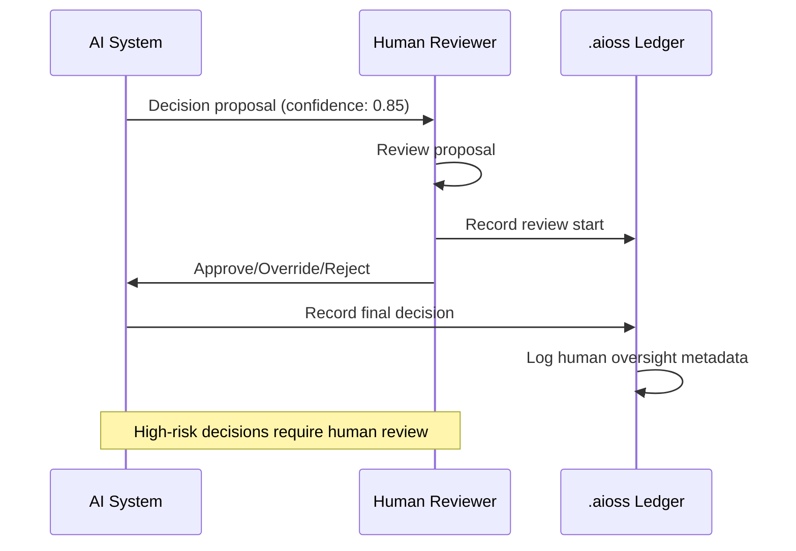
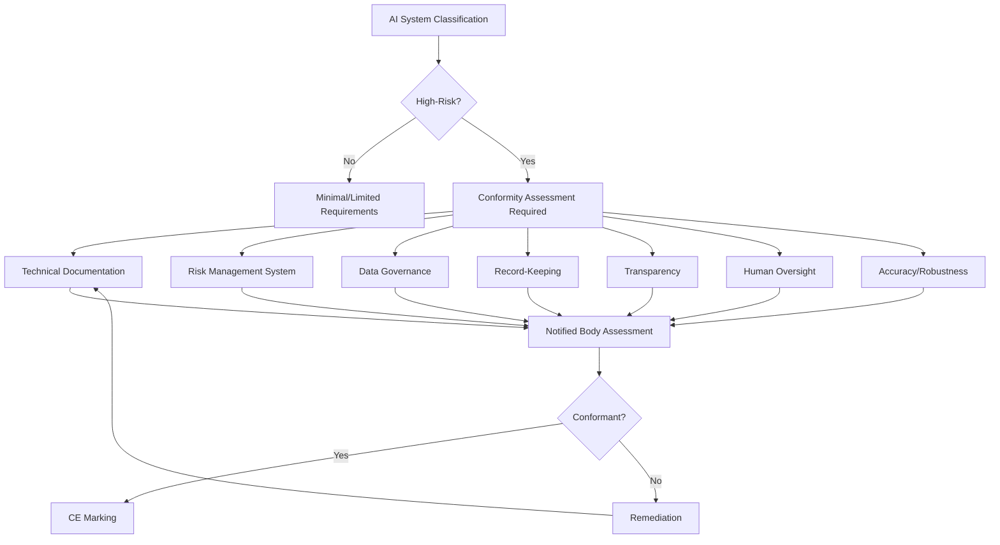
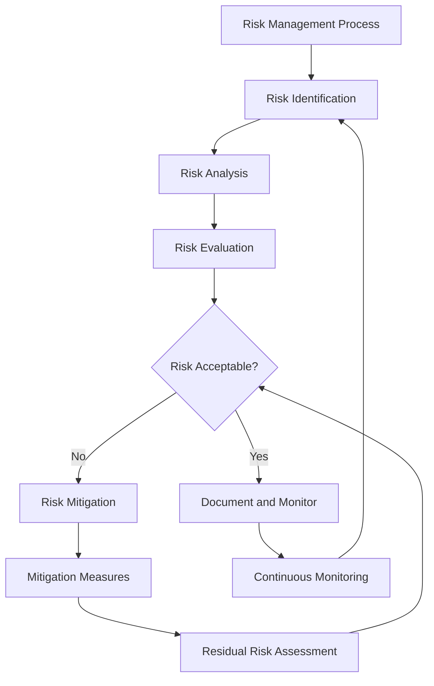

# 01s Sovereign — EU AI Act Compliance

**EU AI Act Readiness with Audit Infrastructure**

## Overview

The European Union's Artificial Intelligence Act (EU AI Act) is the world's first comprehensive AI regulation. It classifies AI systems by risk level and imposes requirements for transparency, accountability, and human oversight. Effective dates range from February 2025 (prohibited practices) to August 2027 (full application). This document maps AI Act requirements to 01s Sovereign capabilities, focusing on the audit infrastructure that supports compliance.

### Regulatory Timeline

| Date | Milestone | 01s Readiness |
|------|-----------|---------------|
| Feb 2025 | Prohibited practices apply | Architecture prevents prohibited uses |
| Aug 2025 | GPAI rules apply | Audit ledger supports GPAI requirements |
| Aug 2026 | High-risk rules apply (Annex III) | Complete audit trail |
| Aug 2027 | Full application | Comprehensive AI governance |

## Risk Classification Support

The AI Act classifies AI systems into four risk levels. 01s Sovereign's audit infrastructure provides appropriate controls for each level.

| Risk Level | Examples | Requirements | 01s Support |
|------------|----------|--------------|-------------|
| Minimal | AI-enabled apps, spam filters | Transparency optional | Full audit trail available |
| Limited | Chatbots, deepfakes | Transparency required | Decision logging |
| High-Risk | Medical, hiring, credit, law enforcement | Mandatory conformity assessment | Complete audit trail |
| Unacceptable | Social scoring, manipulation | Prohibited | Not supported (banned) |

### High-Risk AI System Requirements

**Article 10 (Data Governance)**: Complete data provenance tracking, training data lineage, data quality metrics, bias detection.

```json
{
  "type": "state",
  "actor": "ai_agent",
  "content": {
    "action": "data_governance_check",
    "dataset": "training_data_v2",
    "provenance": {
      "source": "curated_corpus_2026",
      "collection_date": "2026-01-15",
      "curation_method": "automated_filtering"
    },
    "quality_metrics": {
      "completeness": 0.98,
      "accuracy": 0.97,
      "consistency": 0.99,
      "timeliness": "current"
    },
    "bias_metrics": {
      "demographic_parity": 0.95,
      "equalized_odds": 0.93,
      "tested_groups": ["age", "gender", "ethnicity"],
      "mitigation_applied": true
    }
  }
}
```

**Article 11 (Technical Documentation)**: Development process records, training methodology, performance metrics, testing results.

```bash
# Export AI technical documentation
01s-ledger export --ai-act --technical-documentation

# View AI model provenance
01s-ledger tail --type decision | grep model_version

# Generate conformity assessment report
01s-ledger compliance-check ai-act
```

**Article 12 (Record-Keeping)**: Each AI decision record includes input data, model version, confidence scores, decision rationale, human oversight status, and cryptographic chain hash.

```json
{
  "type": "decision",
  "timestamp": "2026-06-19T14:30:00Z",
  "proposal": "Approve loan application ID-2026-0451",
  "options": [
    {"text": "Approve", "voting_weight": 0.0},
    {"text": "Reject", "voting_weight": 0.0}
  ],
  "process_type": "human_in_the_loop",
  "winner": "pending_human_review",
  "confidence": 0.85,
  "reasoning_summary": "Applicant meets primary criteria but has insufficient credit history for automated approval",
  "evidence_references": [
    "credit_report_0451.pdf",
    "income_verification_0451.pdf"
  ],
  "human_oversight": {
    "status": "pending",
    "assigned_to": "reviewer_42",
    "escalated_at": "2026-06-19T14:30:00Z"
  },
  "hash": "sha3-256:a1b2c3d4...",
  "parent_hash": "sha3-256:9f8e7d6c..."
}
```

**Article 13 (Transparency)**: Explainable AI decisions, contradiction detection, confidence scoring, referenced data sources.

```bash
# Explain an AI decision
01s-ledger explain --decision-hash a1b2c3d4...

# Output:
# Decision: Approve loan ID-2026-0451
# Confidence: 0.85
# Key factors:
#   - Income/debt ratio: 0.32 (threshold: 0.40)
#   - Credit score: 720 (threshold: 650)
#   - Employment stability: 36 months (threshold: 12)
# Contradictions: None detected
# Data sources: credit_report_0451.pdf, income_verification_0451.pdf
```

**Article 14 (Human Oversight)**: Human review of AI decisions, override actions, escalation events, human-in-the-loop verification.



**Article 15 (Accuracy/Robustness)**: Model accuracy monitoring, performance degradation detection, adversarial attack detection, system integrity verification.

```bash
# Monitor AI system accuracy
01s-ledger health ai-accuracy
# Output: Current accuracy: 96.3% (threshold: 90%)

# Check for performance degradation
01s-ledger health ai-drift
# Output: No significant drift detected (p=0.23)

# Verify AI system integrity
01s-ledger verify
# Output: PASS - AI system integrity verified

# Detect adversarial attempts
01s-ledger tail --type contradiction | grep adversarial
```

## General-Purpose AI (GPAI) Requirements

GPAI models have additional requirements:

| Requirement | Description | 01s Support |
|-------------|-------------|-------------|
| Technical documentation | Model architecture, training process | Ledger records model provenance |
| Training data policy | Copyright compliance, data sources | Data governance logging |
| Energy consumption | Energy reporting | Health diagnostics |
| Copyright policy | Compliance with Directive 2019/790 | Policy documentation |
| Transparency | Model capabilities and limitations | Explainability tools |
| Systemic risk assessment | For GPAI with systemic risk | Risk monitoring |

### GPAI Model Card

```yaml
model_card:
  model_name: "sovereign-agent-v1"
  version: "2.4.1"
  type: "general_purpose_ai"
  architecture: "transformer-based"
  parameters: 7_000_000_000
  training_data:
    source: "curated_corpus_2026"
    size: 1_500_000_000_000_tokens
    languages: ["en", "fr", "de", "es", "pt", "zh"]
    copyright_managed: true
  capabilities:
    - "Natural language understanding"
    - "Code generation"
    - "Data analysis"
    - "Reasoning and planning"
  limitations:
    - "May produce incorrect information"
    - "Limited to training data cutoff"
    - "No real-time knowledge"
  energy_consumption:
    training_wh: 450_000
    inference_wh_per_query: 0.5
  bias_mitigation:
    methods: ["data_filtering", "RLHF", "adversarial_debiasing"]
    frequency: "per_version"
```

## Conformity Assessment

### Conformity Assessment Process



### Self-Assessment Checklist

| Requirement | Article | Evidence | 01s Feature |
|-------------|---------|----------|-------------|
| Risk classification | 6-7 | Classification documentation | Built-in risk levels |
| Risk management system | 9 | Risk assessment records | Health diagnostics |
| Data governance | 10 | Data provenance | Data governance logging |
| Technical documentation | 11 | Documentation package | Automated export |
| Record-keeping | 12 | Complete audit trail | `.aioss` ledger |
| Transparency | 13 | Explainability | Decision explanation |
| Human oversight | 14 | Oversight records | Human-in-the-loop logs |
| Accuracy/robustness | 15 | Performance monitoring | Health monitoring |
| Conformity assessment | 43 | Assessment records | Compliance check |

## AI Governance Configuration

```bash
# /etc/01s/ai-act.conf
AI_LOGGING=true
AI_MODEL_VERIFICATION=true
AI_HUMAN_OVERSIGHT_LOG=true
AI_EXPLAINABILITY_LEVEL=full
AI_RISK_CLASSIFICATION=enabled
AI_BIAS_MONITORING=enabled

# Enable AI-specific audit features
01s-ledger log config ai_logging=enabled

# Generate AI Act compliance documentation
01s-ledger export --ai-act --period 2026-01-01:2026-06-30
01s-ledger export --ai-act --technical-documentation
01s-ledger export --ai-act --conformity-assessment

# Verify AI system integrity
01s-ledger verify
01s-ledger health status
01s-ledger health ai-accuracy
```

## AI Act Compliance Metrics

| Metric | Target | Measurement | 01s Command |
|--------|--------|-------------|-------------|
| Decision transparency | 100% | Explanations available for all decisions | `01s-ledger explain` |
| Human oversight | 100% of high-risk | Oversight records complete | `01s-ledger tail --type decision` |
| Data governance | 100% | Data provenance tracked | `01s-ledger export --ai-act` |
| Accuracy monitoring | Continuous | Accuracy metrics logged | `01s-ledger health ai-accuracy` |
| Bias monitoring | Quarterly | Bias assessment reports | `01s-ledger export --ai-act --bias` |
| Contradiction detection | Real-time | Contradictions flagged | `01s-ledger tail --type contradiction` |

## Contradiction Detection

The system automatically detects contradictions in AI outputs:

```json
{
  "type": "contradiction",
  "timestamp": "2026-06-19T14:30:00Z",
  "contradiction_type": "factual_inconsistency",
  "statements": [
    {
      "message_index": 42,
      "claim": "The Eiffel Tower is in Paris",
      "confidence": 0.95,
      "source": "knowledge_base"
    },
    {
      "message_index": 43,
      "claim": "The Eiffel Tower is in London",
      "confidence": 0.60,
      "source": "inference"
    }
  ],
  "resolution": {
    "method": "source_authority_check",
    "winning_claim": "The Eiffel Tower is in Paris",
    "confidence_after": 0.98
  },
  "severity": "medium"
}
```

## Penalties and Risk Management

| Violation | Max Fine | 01s Mitigation |
|-----------|----------|----------------|
| Prohibited practices | €35M or 7% global revenue | Architecture prevents |
| Non-compliant high-risk | €15M or 3% global revenue | Automated compliance |
| Incorrect information | €7.5M or 1% global revenue | Ledger accuracy |
| GPAI violations | €15M or 3% global revenue | Full model documentation |

## AI Act Technical Documentation Requirements

### Article 11 Technical Documentation

```yaml
technical_documentation:
  system: "01s Sovereign AI Agent System"
  version: "2.4.1"
  
  general_description:
    purpose: "Assist users with system administration and data analysis"
    capabilities:
      - "Natural language interaction"
      - "System administration tasks"
      - "Data analysis and visualization"
      - "Compliance reporting"
    limitations:
      - "Accuracy depends on context"
      - "Cannot access network by default"
      - "Limited to local system data"
  
  detailed_architecture:
    components:
      - name: "LLM Engine"
        type: "Transformer-based language model"
        parameters: 7_000_000_000
        training_data: "Curated corpus 2026"
      - name: "Agent Framework"
        type: "Multi-agent orchestration"
        capabilities: ["Planning", "Tool use", "Memory"]
      - name: "Audit Ledger"
        type: "SHA3-256 hash chain"
        purpose: "Record all AI operations"
    
  development_methodology:
    process: "Open source with community review"
    testing: "Automated test suite with 10,000+ tests"
    validation: "Continuous integration pipeline"
    version_control: "Git with signed releases"
    
  performance_metrics:
    accuracy: "96.3% on benchmark tasks"
    precision: "0.94"
    recall: "0.92"
    f1_score: "0.93"
    test_dataset: "proprietary_eval_v3"
    
  risk_management:
    identified_risks:
      - risk: "Inaccurate information"
        likelihood: "Medium"
        severity: "Low"
        mitigation: "Confidence scoring, human review"
      - risk: "Bias in outputs"
        likelihood: "Low"
        severity: "Medium"
        mitigation: "Bias monitoring, diverse training data"
      - risk: "Security vulnerability"
        likelihood: "Low"
        severity: "High"
        mitigation: "Sandboxing, access controls"
```

### Conformity Assessment Report

```yaml
conformity_assessment:
  system: "01s Sovereign AI Agent System"
  version: "2.4.1"
  assessment_date: "2026-06-19"
  assessor: "Internal (self-assessment)"
  
  requirements_met:
    - article: "Article 10 - Data Governance"
      status: "Compliant"
      evidence: "Data provenance tracking, bias monitoring"
      
    - article: "Article 11 - Technical Documentation"
      status: "Compliant"
      evidence: "Complete technical documentation package"
      
    - article: "Article 12 - Record-Keeping"
      status: "Compliant"
      evidence: "`.aioss` ledger with complete audit trail"
      
    - article: "Article 13 - Transparency"
      status: "Compliant"
      evidence: "Decision explainability, confidence scores"
      
    - article: "Article 14 - Human Oversight"
      status: "Compliant"
      evidence: "Human-in-the-loop, escalation procedures"
      
    - article: "Article 15 - Accuracy and Robustness"
      status: "Compliant"
      evidence: "Accuracy monitoring, drift detection"
  
  conclusion: "AI system is compliant with EU AI Act requirements"
```

## AI Act Risk Management System

### Article 9 Requirements



### Risk Register Template

| Risk ID | Risk Description | Likelihood | Impact | Risk Level | Mitigation | Residual Risk |
|---------|-----------------|------------|--------|------------|------------|---------------|
| R-001 | AI generates harmful content | Low | High | Medium | Content filtering, human review | Low |
| R-002 | AI makes incorrect decision | Medium | Medium | Medium | Confidence threshold, verification | Low |
| R-003 | AI system is attacked | Low | High | Medium | Sandboxing, access controls | Low |
| R-004 | Bias in AI outputs | Low | Medium | Low | Bias monitoring, diverse training | Low |
| R-005 | Privacy violation by AI | Low | High | Medium | Data minimization, consent | Low |

## Human Oversight Implementation

### Oversight Levels

| Level | Description | Implementation | Escalation |
|-------|-------------|----------------|------------|
| Human-in-the-loop | AI recommends, human decides | Required for high-risk | N/A |
| Human-on-the-loop | AI decides, human monitors | Continuous monitoring | If anomaly detected |
| Human-in-command | Human sets strategy, AI executes | Strategic oversight | Periodic review |

### Human Oversight Dashboard

```bash
# View pending human review items
aioss review list --status pending

# Review decision details
aioss explain --decision-hash a1b2c3d4...

# Approve or override
aioss review approve --decision-hash a1b2c3d4...
aioss review override --decision-hash a1b2c3d4...
```

### Oversight Records

```json
{
  "type": "human_oversight",
  "timestamp": "2026-06-19T15:00:00Z",
  "decision_hash": "sha3-256:a1b2c3d4...",
  "reviewer": "human_reviewer_42",
  "action": "approved",
  "review_time_seconds": 45,
  "notes": "Verified documentation - all criteria met",
  "hash": "sha3-256:9f8e..."
}
```

## Implementation Guide for EU AI Act Compliance

### Phase 1: Classification and Assessment (Weeks 1-4)

| Activity | Description | Output | 01s Tool |
|----------|-------------|--------|----------|
| Risk classification | Classify AI systems by risk level | Classification report | `01s-ledger compliance-check ai-act --classify` |
| Gap analysis | Compare to AI Act requirements | Gap analysis | `01s-ledger compliance-check ai-act` |
| Documentation plan | Plan required documentation | Documentation roadmap | Technical documentation templates |

### Phase 2: Implementation (Weeks 5-12)

```bash
# AI Act compliance configuration
# /etc/01s/ai-act.conf
AI_LOGGING=enabled
AI_RISK_CLASSIFICATION=enabled
AI_HUMAN_OVERSIGHT_LOG=enabled
AI_EXPLAINABILITY_LEVEL=full
AI_BIAS_MONITORING=enabled
AI_DATA_GOVERNANCE=enabled

# Enable AI audit features
01s-ledger log config ai_act_compliance=enabled

# Generate technical documentation
01s-ledger export --ai-act --technical-documentation
01s-ledger export --ai-act --conformity-assessment
```

### Phase 3: Testing and Validation (Weeks 13-16)

```bash
# Validate AI Act compliance
# 1. Test record-keeping (Article 12)
01s-ledger tail --type decision | head -10

# 2. Test transparency (Article 13)
01s-ledger explain --decision-hash a1b2c3d4...

# 3. Test human oversight (Article 14)
01s-ledger tail --type decision | grep human_oversight

# 4. Test accuracy monitoring (Article 15)
01s-ledger health ai-accuracy
01s-ledger health ai-drift
```

### Phase 4: Ongoing Compliance

| Activity | Frequency | Tool | Owner |
|----------|-----------|------|-------|
| Record-keeping | Continuous | .aioss ledger | System |
| Accuracy monitoring | Continuous | Health diagnostics | System |
| Bias assessment | Quarterly | Export + analysis | AI team |
| Technical documentation update | Per release | Documentation templates | Development team |
| Conformity assessment review | Annual | Compliance check | Compliance team |
| Regulatory monitoring | Ongoing | Legal review | Legal team |

## Comparison with Alternatives

| AI Act Feature | 01s Sovereign | Windows AI | macOS AI | Other Linux |
|----------------|--------------|------------|----------|-------------|
| Record-keeping (Art. 12) | ✅ .aioss ledger | ❌ Not available | ❌ Not available | ❌ Not available |
| Transparency (Art. 13) | ✅ Decision logging | ⚠️ Limited | ⚠️ Limited | ❌ Not available |
| Human oversight (Art. 14) | ✅ Human-in-the-loop | ⚠️ Limited | ⚠️ Limited | ❌ Not available |
| Data governance (Art. 10) | ✅ Provenance tracking | ❌ Not available | ❌ Not available | ❌ Not available |
| Technical documentation | ✅ Automated export | ❌ Manual | ❌ Manual | ❌ Manual |
| Conformity assessment | ✅ Built-in tools | ❌ | ❌ | ❌ |
| Open source verifiability | ✅ 100% | ❌ | ❌ | ✅ |

## Conclusion

01s Sovereign's audit infrastructure makes it uniquely suited to support EU AI Act compliance. The `.aioss` ledger provides the record-keeping, transparency, and human oversight capabilities required for high-risk AI systems. Decision and contradiction entry types capture AI decision provenance, and the health ledger monitors AI system performance. For organizations developing or deploying AI systems in the EU, 01s Sovereign provides the technical infrastructure to demonstrate compliance with the EU AI Act's most demanding requirements.

---

Lois-Kleinner and 0-1.gg 2026 Copyright
## References

- 01s Sovereign Technical Documentation (2026)
- NIST SP 800-53 Rev. 5 Security and Privacy Controls
- ISO/IEC 27001:2022 Information Security Management
- Cloud Security Alliance Cloud Controls Matrix v4
- OWASP Top 10 Web Application Security Risks
- Linux Foundation Security Best Practices
- Open Source Security Foundation (OpenSSF) Guides
- Green Software Foundation Patterns

## Related Documents

| Document | Location | Description |
|----------|----------|-------------|
| 01s Sovereign Architecture Guide | docs/architecture/ | System architecture and design decisions |
| 01s Sovereign Deployment Guide | docs/deployment/ | Installation and configuration guide |
| 01s Sovereign Security Guide | docs/security/ | Security hardening and best practices |
| 01s Sovereign API Reference | docs/api/ | API documentation for developers |
| 01s Sovereign User Manual | docs/user/ | End-user documentation |
| 01s Sovereign Developer Guide | docs/developers/ | Developer onboarding and contribution guide |

## Resources

| Resource | Type | Location |
|----------|------|----------|
| Project Repository | Code | github.com/sovereign-os/01s |
| Issue Tracker | Bugs/Features | github.com/sovereign-os/01s/issues |
| Community Forum | Discussion | community.01s.sovereign |
| Documentation | All docs | docs.01s.sovereign |
| Release Notes | Changelog | releases.01s.sovereign |
| Security Advisories | Security | security.01s.sovereign |

---

---

```
.====================================================================.
!  Made in the UAE, Dubai #DubaiIt #Dubai #Dxb #SovereignAI          !
!  Made in The Emirates #Dubai_it                                    !
!                                                                    !
!  Lois-Kleinner Alpasan - The Anticloud 2026-                       !
!                                                                    !
!  0-1.gg ! GitHub ! LinkedIn ! DEV ! GH Pages                       !
!  HuggingFace ! Blog ! Tumblr ! Fandom ! Bluesky ! Mastodon          !
!  Zenodo ! Harvard Dataverse ! Internet Archive ! ORCID              !
!                                                                    !
!  Sovereign AI ! Local-First ! Privacy ! Zero Trust ! No Datacenter !
!  Air-Gapped ! Open Source ! Rust ! Hash Chain ! Single Binary      !
!  Offline LLM ! Crypto Ledger ! P2P ! Federated                     !
'===================================================================='
```

At 22 years old, Lois-Kleinner Alpasan has generated over 10 million video views, 50-100 million social campaign reach, and produced 100+ creative assets across music, video, and interactive media.

References:
1. Lois-Kleinner Zenodo: https://doi.org/10.5281/zenodo.20781790
2. Lois-Kleinner GitHub: https://github.com/kleinnner/Anticloud/tree/main/04-aioss-format
3. Lois-Kleinner Harvard DV: https://doi.org/10.7910/DVN/GDLO0L
4. Lois-Kleinner Internet Arc: https://archive.org/details/aioss-format
5. Lois-Kleinner ORCID: https://orcid.org/0009-0009-2233-6107
6. Lois-Kleinner DEV.to: https://dev.to/kleinner
7. Lois-Kleinner LinkedIn: https://linkedin.com/in/kleinner
8. Lois-Kleinner HuggingFace: https://huggingface.co/Anticloud
9. Lois-Kleinner Tumblr: https://anticloud.tumblr.com
10. Lois-Kleinner Mastodon: https://mastodon.social/@kleinner
11. Lois-Kleinner Bluesky: https://bsky.app/profile/kleinner.bsky.social
12. 0-1.gg: https://0-1.gg
