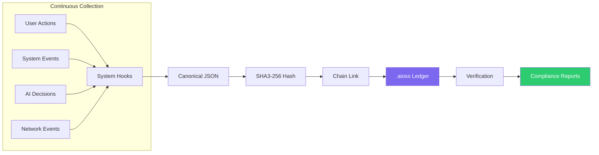
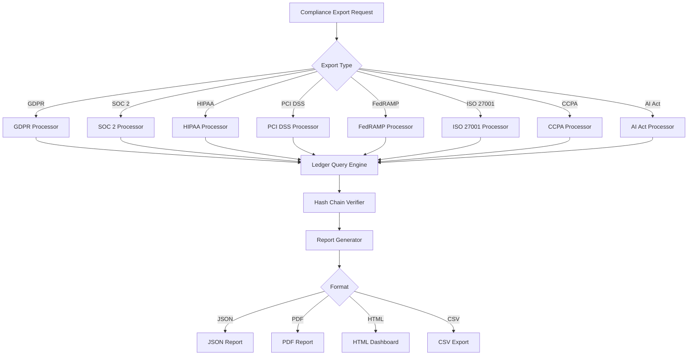
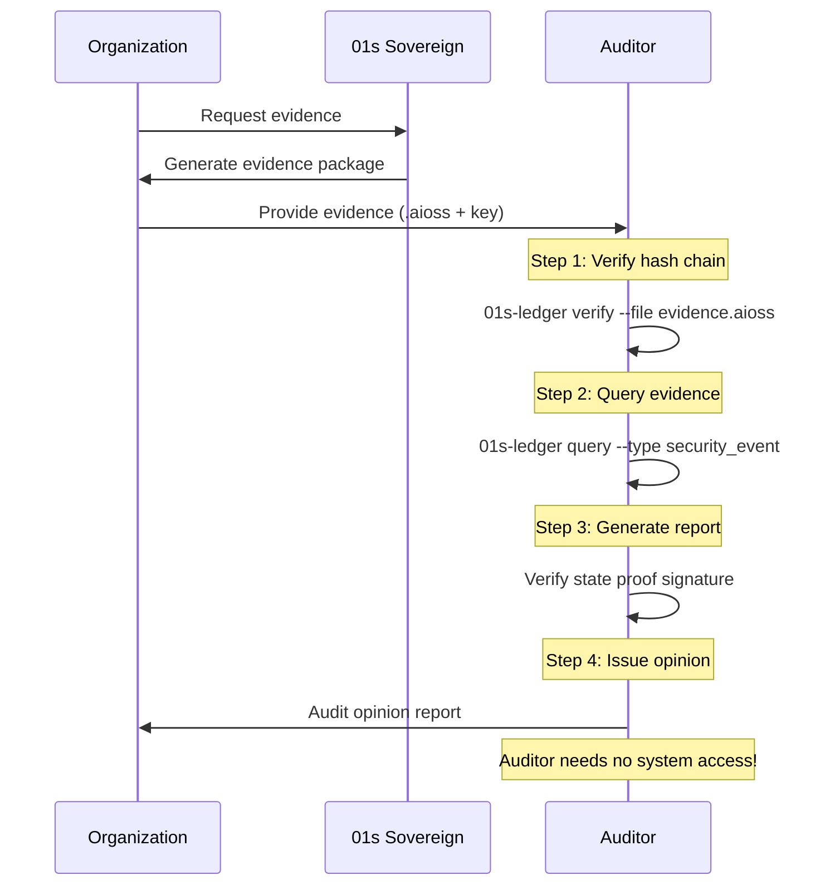
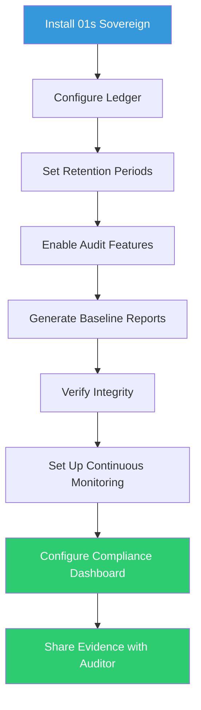

# 01s Sovereign — Compliance Automation with Ledger

**Using the `.aioss` Ledger for Automated Compliance Reporting**

## The Compliance Automation Problem

Organizations spend significant resources on compliance: manual evidence collection, periodic snapshots, evidence integrity concerns, high costs ($50-200K+ for SOC 2), and auditor friction (need for system access). The `.aioss` ledger transforms compliance from a periodic, manual, costly activity into a continuous, automated, affordable process.

### Traditional vs Automated Compliance

| Aspect | Traditional | With 01s Sovereign |
|--------|-------------|-------------------|
| Evidence collection | Manual, periodic | Automated, continuous |
| Evidence integrity | Screenshots, mutable logs | Cryptographically proven |
| Auditor access | System access required | Self-validating ledger |
| Cost | $50-200K+/year | $5-25K/year |
| Preparation time | 2-6 months | 1-2 weeks |
| Evidence quality | Subjective | Objective, cryptographic |
| Coverage | Sample-based | Complete |
| Frequency | Annual point-in-time | Continuous |

## How the `.aioss` Ledger Enables Compliance Automation

### 1. Continuous Evidence Collection

Instead of periodic snapshots, the ledger provides continuous, automatic evidence collection. Evidence collected includes user access logs, system configuration changes, security events, data processing activities, system availability data, and administrative actions.



#### Evidence Collection Coverage

| Framework | Key Evidence | Collection Method | Frequency |
|-----------|-------------|-------------------|-----------|
| SOC 2 | Access logs, config changes, security events | System hooks + health diagnostics | Continuous |
| GDPR | Processing records, consent, erasure | Ledger recording + export | Continuous |
| HIPAA | ePHI access, audit controls | File access logging | Continuous |
| PCI DSS | Audit trail (Req 10), firewall logs | System monitoring | Continuous |
| FedRAMP | AU, AC, SC controls | Comprehensive logging | Continuous |
| ISO 27001 | A.8 controls, logging, monitoring | Ledger + health checks | Continuous |
| CCPA | Data inventory, deletion | Ledger export + purge | On demand |
| AI Act | Decision records, oversight | AI event logging | Continuous |

### 2. Cryptographic Evidence Integrity

The hash chain provides tamper-evident evidence. The head hash before and after audit should remain unchanged, proving no tampering occurred. External auditors can independently verify without system access.

#### Hash Chain Properties

| Property | Benefit | Technical Mechanism |
|----------|---------|-------------------|
| Immutability | Evidence cannot be altered retroactively | SHA3-256 cryptographic linking |
| Tamper detection | Any modification is detectable | Chain verification |
| Non-repudiation | Actors cannot deny actions | Cryptographic signatures |
| Time ordering | Event sequence is provable | Parent hash chain |
| Completeness | No entries can be hidden | Genesis-to-head verification |
| Independent verification | Auditors need no system access | Stateless verification |

#### Auditor Verification

```bash
# Auditor receives: .aioss file + public key
# Auditor runs:
01s-ledger verify --file evidence_2026_Q2.aioss
# Output: PASS (0 tampered entries)

# This verification requires:
# - The .aioss file only
# - The public key
# - No system access
# - No database credentials
# - No complex tooling
```

### 3. Automated Report Generation

```bash
# GDPR Report
01s-ledger export --gdpr  # ROPA, data inventory, consent, deletion proofs

# SOC 2 Report  
01s-ledger export --soc2  # Control evidence, security events, access records

# HIPAA Report
01s-ledger export --hipaa  # ePHI access logs, audit trail verification

# PCI DSS Report
01s-ledger export --pci-dss  # Requirement 10 audit trail, firewall records

# FedRAMP Report
01s-ledger export --fedramp  # AU control evidence, SI control evidence

# ISO 27001 Report
01s-ledger export --iso-27001  # Annex A evidence, internal audit data

# CCPA Report
01s-ledger export --ccpa  # Data inventory, deletion proofs

# EU AI Act Report
01s-ledger export --ai-act  # AI decision provenance, human oversight logs
```

#### Report Generation Architecture



### 4. External Auditor Verification

Auditors receive the .aioss file and public key. Verification is stateless: `sha3_256_verify(ledger_file)` — no system access, database credentials, or complex tooling needed.

#### Auditor Workflow



### 5. Compliance Dashboard

```bash
# View compliance dashboard
01s-ledger dashboard

# Sample output:
# ╔══════════════════════════════════════════╗
# ║ 01s Sovereign Compliance Dashboard       ║
# ╠══════════════════════════════════════════╣
# ║ Overall Trust Score: 0.94/1.00          ║
# ║                                          ║
# ║ Framework Scores:                        ║
# ║   SOC 2:      96%                        ║
# ║   GDPR:       98%                        ║
# ║   HIPAA:      94%                        ║
# ║   PCI DSS:    92%                        ║
# ║   FedRAMP:    91%                        ║
# ║   ISO 27001:  95%                        ║
# ║   CCPA:       99%                        ║
# ║   AI Act:     97%                        ║
# ║                                          ║
# ║ Latest Verification: PASS (2 hours ago)  ║
# ║ Ledger Coverage: 100% (last 24 hours)    ║
# ╚══════════════════════════════════════════╝
```

## Compliance Automation API

### Programmatic Access

```python
import json
import subprocess

def get_compliance_report(framework, start_date, end_date):
    """Generate compliance report programmatically."""
    cmd = [
        "01s-ledger", "export",
        f"--{framework}",
        f"--period", f"{start_date}:{end_date}"
    ]
    result = subprocess.run(cmd, capture_output=True, text=True)
    return json.loads(result.stdout)

# Example: Get SOC 2 evidence
soc2_evidence = get_compliance_report("soc2", "2026-01-01", "2026-06-30")

# Example: Verify integrity
verify_result = subprocess.run(
    ["01s-ledger", "verify", "--format", "json"],
    capture_output=True, text=True
)
integrity_status = json.loads(verify_result.stdout)
```

### Webhook Integration

```bash
# Configure compliance webhooks
# /etc/01s/compliance-webhooks.conf

[webhook]
url = "https://compliance.example.com/webhook"
event_types = compliance_check,integrity_failure,report_generated
auth_token = "your_token"

# Example webhook payload
# POST /webhook
# {
#   "event": "compliance_check",
#   "framework": "soc2",
#   "result": "pass",
#   "score": 0.96,
#   "timestamp": "2026-06-19T14:30:00Z",
#   "ledger_head": "sha3-256:a1b2..."
# }
```

## Cost Comparison

| Cost Category | Traditional | With 01s Sovereign | Savings |
|---------------|-------------|-------------------|---------|
| Evidence collection | $20-50K/yr | $0 (automated) | 100% |
| Compliance tools license | $30-100K/yr | $0 (built-in) | 100% |
| Compliance headcount | $80-150K/yr | $20-40K/yr | 50-75% |
| Audit preparation | $20-50K/yr | $5-10K/yr | 75-80% |
| External audit fees | $30-80K/yr | $20-40K/yr | 35-50% |
| Continuous monitoring | $20-60K/yr | $0 (built-in) | 100% |
| Remediation verification | $10-30K/yr | $2-5K/yr | 80% |
| **Total** | **$180-430K/yr** | **$45-90K/yr** | **60-79%** |

## Multi-Framework Compliance

One ledger serves all compliance frameworks simultaneously:

```bash
# Single command generates evidence for all frameworks
01s-ledger export --all --period 2026-01-01:2026-06-30

# This produces:
# - gdpr_report.json
# - soc2_report.json
# - hipaa_report.json
# - pci_dss_report.json
# - fedramp_report.json
# - iso_27001_report.json
# - ccpa_report.json
# - ai_act_report.json
```

## Compliance Automation Maturity Model

| Level | Description | 01s Capability |
|-------|-------------|----------------|
| 1 | Manual evidence collection | Basic ledger recording |
| 2 | Semi-automated with periodic exports | Automated report generation |
| 3 | Continuous monitoring | Health diagnostics + Trust Score |
| 4 | Predictive compliance | Trend analysis + gap prediction |
| 5 | Self-healing compliance | Automated remediation |

## Getting Started with Compliance Automation

```bash
# Step 1: Configure ledger for compliance
# /etc/01s/ledger.conf
STATE_INTERVAL=300
RETENTION_DAYS=730  # 2 years minimum
AUDIT_LEVEL=standard

# Step 2: Verify ledger is running
systemctl status 01s-ledger
systemctl status 01s-state.timer

# Step 3: Generate baseline reports
01s-ledger export --all --period 2026-01-01:2026-06-30

# Step 4: Set up continuous verification
01s-ledger schedule-verify --daily --time 0200

# Step 5: Review compliance dashboard
01s-ledger dashboard

# Step 6: Share evidence with auditor
# Provide .aioss files and public key
```

## Compliance Automation Implementation Guide

### Step-by-Step Deployment



### Configuration Templates

**GDPR Configuration**
```bash
# /etc/01s/ledger.conf - GDPR
RETENTION_DAYS=730
AUDIT_LEVEL=standard
STATE_INTERVAL=300
```

**SOC 2 Configuration**
```bash
# /etc/01s/ledger.conf - SOC 2
RETENTION_DAYS=395
AUDIT_LEVEL=maximum
STATE_INTERVAL=300
```

**HIPAA Configuration**
```bash
# /etc/01s/ledger.conf - HIPAA
RETENTION_DAYS=2555
AUDIT_LEVEL=maximum
STATE_INTERVAL=60
```

**PCI DSS Configuration**
```bash
# /etc/01s/ledger.conf - PCI DSS
RETENTION_DAYS=395
AUDIT_LEVEL=maximum
STATE_INTERVAL=60
```

**FedRAMP Configuration**
```bash
# /etc/01s/ledger.conf - FedRAMP
RETENTION_DAYS=2555
AUDIT_LEVEL=maximum
STATE_INTERVAL=60
```

**Multiple Framework Configuration**
```bash
# /etc/01s/ledger.conf - Multi-Framework
# Use maximum settings for all frameworks
RETENTION_DAYS=2555  # 7 years (HIPAA maximum)
AUDIT_LEVEL=maximum
STATE_INTERVAL=60
LOG_FILE_ACCESS=full
LOG_SHELL_COMMANDS=true
HEALTH_DIAGNOSTICS=true
```

## Automated Evidence Collection Details

### Evidence Collection Schedule

| Framework | Evidence Type | Collection Method | Frequency |
|-----------|--------------|-------------------|-----------|
| SOC 2 | System access logs | Continuous logging | Real-time |
| SOC 2 | Configuration changes | Audit trail | Per change |
| SOC 2 | Security events | Health monitoring | Continuous |
| GDPR | Processing records | Activity logging | Continuous |
| GDPR | Consent records | Consent management | Per event |
| HIPAA | ePHI access logs | File access logging | Per access |
| PCI DSS | Audit trail (Requirement 10) | Comprehensive logging | Continuous |
| FedRAMP | AU controls | Audit logging | Continuous |
| FedRAMP | SI controls | Health monitoring | Continuous |

### Evidence File Formats

```bash
# JSON Evidence Format
01s-ledger export --soc2 --format json --output soc2_evidence.json

# CSV Evidence Format  
01s-ledger export --gdpr --format csv --output gdpr_evidence.csv

# PDF Report Format
01s-ledger export --hipaa --format pdf --output hipaa_report.pdf

# AIOSS Binary Format (for auditor verification)
01s-ledger export --all --format aioss --output compliance_package.aioss
```

## Compliance Automation ROI Calculator

```python
def calculate_compliance_roi(
    employees: int,
    frameworks: list,
    current_cost: float,
    with_01s_cost: float
):
    """Calculate ROI of compliance automation with 01s Sovereign."""
    
    savings = current_cost - with_01s_cost
    roi_percentage = (savings / current_cost) * 100
    
    time_saved_hours = employees * 40  # 40 hours per employee per year
    time_saved_percent = 80  # 80% reduction in compliance time
    
    print(f"Number of frameworks: {len(frameworks)}")
    print(f"Current compliance cost: ${current_cost:,.0f}/yr")
    print(f"With 01s Sovereign: ${with_01s_cost:,.0f}/yr")
    print(f"Annual savings: ${savings:,.0f}/yr")
    print(f"ROI: {roi_percentage:.0f}%")
    print(f"Time saved: {time_saved_hours:,} hours/year")
    print(f"Time reduction: {time_saved_percent}%")
    
    return savings

# Example: Mid-size company with 3 frameworks
calculate_compliance_roi(
    employees=50,
    frameworks=["SOC 2", "GDPR", "ISO 27001"],
    current_cost=300000,
    with_01s_cost=70000
)
```

## Auditor Communication Templates

### Evidence Package Cover Letter

```markdown
**Compliance Evidence Package**
**Organization**: [Organization Name]
**Audit Period**: 2026-01-01 to 2026-06-30
**Frameworks**: SOC 2, GDPR, HIPAA

**Contents**:
1. `.aioss` ledger files for the audit period
2. Hash chain verification report
3. State proof signatures
4. Compliance report exports
5. System configuration documentation

**Verification Instructions**:
1. Run: `01s-ledger verify --file evidence.aioss`
2. Run: `01s-ledger verify-state-proof --proof state_proof.json`
3. Query: `01s-ledger query --type <event_type>`

**Evidence Integrity**:
All evidence is cryptographically verified using SHA3-256
hash chain. Any tampering is detectable. Verification
requires no system access.

**Contact**: [Auditor contact] for questions
```

### Auditor Access Request Template

```json
{
  "auditor_access_request": {
    "request_date": "2026-06-19",
    "auditor_name": "Audit Firm Name",
    "audit_period": "2026-01-01 to 2026-06-30",
    "frameworks": ["SOC 2", "GDPR"],
    "evidence_requested": [
      "System access logs",
      "Configuration changes",
      "Security events",
      "Data processing records"
    ],
    "delivery_method": "Encrypted .aioss file",
    "access_type": "Stateless verification (no system access)"
  }
}
```

## Conclusion

The `.aioss` audit ledger transforms compliance from a periodic, manual, costly activity into a continuous, automated, affordable process. By providing cryptographic evidence that auditors can independently verify, 01s Sovereign eliminates the most time-consuming and expensive aspects of compliance. Organizations can reduce compliance costs by 60-79%, eliminate manual evidence collection, provide tamper-evident audit trails, enable stateless auditor verification, and maintain continuous compliance across multiple regulatory frameworks simultaneously.

---

Lois-Kleinner and 0-1.gg 2026 Copyright

```
.====================================================================.
!  Made in the UAE, Dubai #DubaiIt #Dubai #Dxb #SovereignAI          !
!  Made in The Emirates #Dubai_it                                    !
!                                                                    !
!  Lois-Kleinner Alpasan - The Anticloud 2026-                       !
!                                                                    !
!  As seen on:                                                       !
!  Harvard Dataverse ! Zenodo/CERN ! Academia.edu ! HuggingFace      !
!  anticloud.telepedia.net ! anticloud.fandom.com                    !
!                                                                    !
!  0-1.gg ! GitHub ! LinkedIn ! DEV ! GH Pages                       !
!  HuggingFace ! Blog ! Bluesky ! Mastodon                           !
!  Internet Archive ! ORCID ! Figshare                               !
!                                                                    !
!  Sovereign AI ! Local-First ! Privacy ! Zero Trust ! No Datacenter !
!  Air-Gapped ! Open Source ! Rust ! Hash Chain ! Single Binary      !
!  Offline LLM ! Crypto Ledger ! P2P ! Federated                     !
'===================================================================='
```

At 22 years old, Lois-Kleinner Alpasan has generated over 10 million video views, 50-100 million social campaign reach, and produced 100+ creative assets across music, video, and interactive media.

References:
1. Lois-Kleinner Zenodo: https://doi.org/10.5281/zenodo.20781790
2. Lois-Kleinner GitHub: https://github.com/kleinnner/Anticloud/tree/main/04-aioss-format
3. Lois-Kleinner Harvard DV: https://doi.org/10.7910/DVN/FSHFZF
4. Lois-Kleinner Internet Arc: https://archive.org/details/aioss-format
5. Lois-Kleinner ORCID: https://orcid.org/0009-0009-2233-6107
6. Lois-Kleinner DEV.to: https://dev.to/kleinner
7. Lois-Kleinner LinkedIn: https://linkedin.com/in/kleinner
8. Lois-Kleinner HuggingFace: https://huggingface.co/Anticloud
9. Lois-Kleinner Tumblr: https://anticloud.tumblr.com
10. Lois-Kleinner Mastodon: https://mastodon.social/@kleinner
11. Lois-Kleinner Bluesky: https://bsky.app/profile/kleinner.bsky.social
12. 0-1.gg: https://0-1.gg
13. Lois-Kleinner Figshare: https://figshare.com/authors/Lois-Kleinner_Alpasan/20849885
14. Lois-Kleinner Academia: https://independent.academia.edu/kleinner
15. Lois-Kleinner Telepedia: https://anticloud.telepedia.net/wiki/Anticloud_by_Lois-Kleinner_Wiki
16. Lois-Kleinner Fandom: https://anticloud.fandom.com
17. AIOSS Offline Verification Kit: https://dataverse.harvard.edu/dataset.xhtml?persistentId=doi:10.7910/DVN/OORKNJ