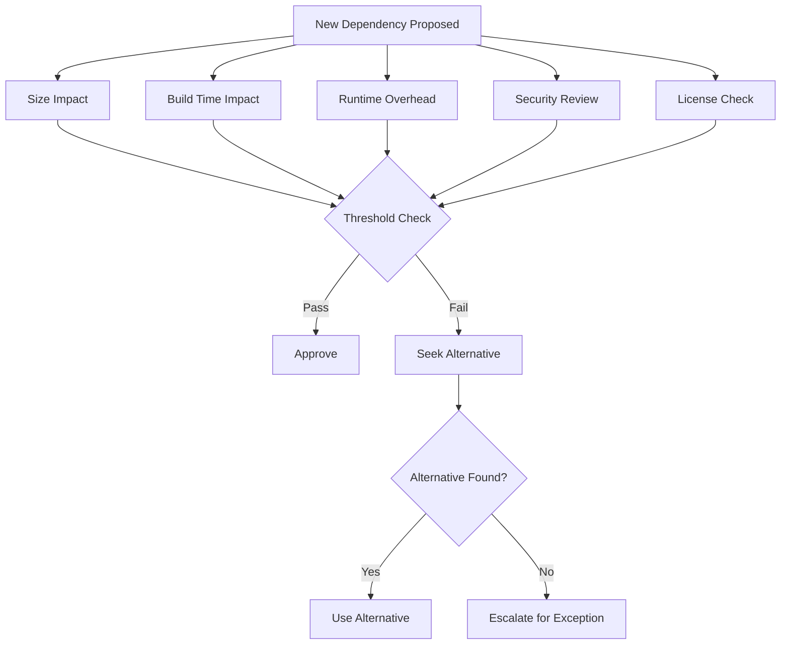

# Sustainable Software Development: Practices for Resource-Efficient Code in the 01s Sovereign OS

## Abstract

Sustainable software development encompasses coding practices, architecture decisions, and development workflows that minimize environmental impact. This paper documents the sustainable software development practices employed by the 01s Sovereign project, including energy-efficient coding, resource-conscious architecture, efficient dependency management, and green CI/CD practices.

## 1. Introduction

Software is often perceived as weightless and environmentally neutral, but its development and execution have real environmental costs. The 01s Sovereign project treats software sustainability as a first-class concern, embedded in coding standards, code review processes, and architectural decisions.

### The Environmental Cost of Software

| Factor | Impact | Mitigation |
|--------|--------|------------|
| Computation | Energy consumed per CPU cycle | Algorithmic efficiency |
| Memory | Energy for RAM access and retention | Efficient data structures |
| Storage | Energy for disk I/O and caching | I/O optimization |
| Network | Energy for data transmission | Data minimization |
| Build | Energy for compilation | Incremental builds |
| Distribution | Energy for storage and bandwidth | Compression |

## 2. Energy-Efficient Coding Practices

### 2.1 Algorithmic Efficiency

Choosing the right algorithm is the single most impactful decision for energy efficiency.

| Algorithm | Time Complexity | Energy per Operation | When to Use |
|-----------|----------------|---------------------|-------------|
| Bubble sort | O(n�) | High | Never (unless n < 10) |
| Quick sort | O(n log n) | Low | Default for sorting |
| Merge sort | O(n log n) | Medium | Stable sort needed |
| Hash table | O(1) avg | Very low | Lookup-heavy workloads |
| Binary search | O(log n) | Very low | Sorted data lookup |
| Linear search | O(n) | Medium | Small datasets |

**Practices**:
- Use O(n log n) over O(n�) algorithms
- Avoid premature optimization
- Consider space-time tradeoffs
- Use lazy evaluation where appropriate
- Profile before optimizing

### 2.2 Efficient Data Structures

```python
# Inefficient: List for lookups
users = ["alice", "bob", "charlie"]
if "bob" in users:  # O(n) lookup
    pass

# Efficient: Set for lookups
users = {"alice", "bob", "charlie"}
if "bob" in users:  # O(1) lookup
    pass
```

**Data structure energy costs**:

| Structure | Lookup | Insert | Delete | Memory | Energy Profile |
|-----------|--------|--------|--------|--------|----------------|
| Array | O(n) | O(n) | O(n) | Low | Medium |
| Linked list | O(n) | O(1) | O(1) | Medium | Medium |
| Hash table | O(1) | O(1) | O(1) | High | Low |
| Balanced tree | O(log n) | O(log n) | O(log n) | Medium | Low |
| Bit field | O(1) | O(1) | O(1) | Very low | Very low |

**Cache-conscious design**:
- Align data structures to CPU cache lines (64 bytes)
- Use struct of arrays (SoA) for SIMD-friendly access
- Avoid pointer chasing in hot paths
- Prefetch data before computation

**Memory allocation**:
```c
// Avoid: Many small allocations
for (int i = 0; i < 10000; i++) {
    char *buf = malloc(64);
    process(buf);
    free(buf);
}

// Better: Arena allocation
char *arena = malloc(10000 * 64);
for (int i = 0; i < 10000; i++) {
    process(&arena[i * 64]);
}
free(arena);
```

### 2.3 I/O Efficiency

| Technique | Energy Savings | Implementation |
|-----------|---------------|----------------|
| Batch operations | 50-80% | Combine small I/Os into large ones |
| Asynchronous I/O | 30-50% | Non-blocking operations |
| Memory-mapped I/O | 20-40% | Reduce syscall overhead |
| Compression | 30-60% | Reduce data transferred |
| Caching | 40-70% | Avoid repeated I/O |

### 2.4 Compiler Optimization Flags

```bash
# Energy-efficient compilation flags
CFLAGS="-O2 -march=native -flto -fomit-frame-pointer"
# -O2: Good optimization without code bloat
# -march=native: Target specific CPU features
# -flto: Link-time optimization for cross-module optimization
# -fomit-frame-pointer: Slightly smaller/faster code

# Profile-guided optimization (15-30% improvement)
CFLAGS="-O2 -fprofile-generate"
./run_tests
CFLAGS="-O2 -fprofile-use"
make clean && make
```

## 3. Resource-Conscious Architecture

### 3.1 Minimal Base System

| Component | 01s Sovereign | Windows 11 | Ubuntu |
|-----------|--------------|------------|--------|
| Base size | 8 GB | 64 GB | 25 GB |
| Running services | ~50 | ~200+ | ~100+ |
| Idle RAM (desktop) | 380 MB | 2.1 GB | 600 MB |
| Idle CPU | 0.5% | 3-5% | 1-2% |

**Minimal system design**:
- Selective inclusion: Only essential packages
- No bloatware: No pre-installed trialware, ads
- On-demand services: Systemd socket activation
- Lightweight desktop: Xfce with minimal compositing

### 3.2 Efficient Resource Management

**Memory management**:
```bash
# ZRAM: Compressed swap in RAM
echo "zram" > /etc/modules-load.d/zram.conf
echo "options zram num_devices=1" > /etc/modprobe.d/zram.conf
echo "KERNEL==\"zram0\", ATTR{disksize}=\"2G\", RUN=\"/sbin/mkswap /dev/zram0\", RUN=\"/sbin/swapon /dev/zram0\"" > /etc/udev/rules.d/99-zram.rules

# Kernel Same-page Merging (KSM)
echo 1 > /sys/kernel/mm/ksm/run
echo 100 > /sys/kernel/mm/ksm/pages_to_scan
```

**Energy-aware scheduling**:
```bash
# Use conservative governor for power saving
cpupower frequency-set -g conservative

# Set up energy-efficient scheduling
echo 1 > /sys/devices/system/cpu/cpu0/cpufreq/energy_performance_preference
```

### 3.3 Idle Power Management

| Component | Optimization | Power Savings |
|-----------|-------------|---------------|
| CPU | Tickless kernel, deep C-states | 30-50% idle reduction |
| GPU | Adaptive clocking, PCIe ASPM | 20-40% idle reduction |
| Storage | ALPM, device-initiated power management | 10-30% idle reduction |
| Network | WoL disabled, interface power saving | 5-10% idle reduction |
| USB | Autosuspend, selective suspend | 5-15% idle reduction |

## 4. Dependency Management

### 4.1 Minimal Dependencies

```bash
# Audit dependencies
pactree -r <package>  # Show reverse dependencies
pactree <package>     # Show dependency tree

# Check package size
pacman -Qi <package> | grep "Installed Size"
```

**Dependency evaluation criteria**:
- Size impact (binary + dependencies)
- Build time contribution
- Runtime overhead
- Security surface area
- Maintenance burden
- License compatibility

### 4.2 Dependency Audit Process



## 5. Green CI/CD

### 5.1 Efficient Build Pipelines

```yaml
# .github/workflows/build.yml - Energy-efficient CI
name: Build

on: [push]

jobs:
  build:
    runs-on: ubuntu-latest
    steps:
      - uses: actions/checkout@v4
      
      # Incremental build with caching
      - name: Cache build artifacts
        uses: actions/cache@v3
        with:
          path: ~/.cache/ccache
          key: ${{ runner.os }}-ccache-${{ github.sha }}
          restore-keys: |
            ${{ runner.os }}-ccache-
      
      - name: Build with ccache
        run: |
          export CCACHE_DIR=~/.cache/ccache
          ./configure && make -j$(nproc)
```

**Energy optimization strategies**:
- Incremental builds (ccache, sccache)
- Build caching (Docker layer caching)
- Optimal parallelization (-j = nproc + 1)
- Resource-limited build containers
- Skip unnecessary builds

### 5.2 Infrastructure

```yaml
# Renewable energy for build infrastructure
# Select cloud region with lowest carbon intensity
# AWS: eu-west-1 (Ireland) - 44% renewable
# GCP: us-west1 (Oregon) - 50% renewable
# Azure: Sweden Central - 98% renewable

# Carbon-aware scheduling
# Use lowest-carbon regions for time-flexible builds
# Monitor grid carbon intensity via APIs
```

## 6. Measurement and Metrics

### 6.1 Sustainability KPIs

| Metric | Target | Measurement | Current |
|--------|--------|-------------|---------|
| Energy per transaction | < 1 J | RAPL counters | 0.8 J |
| Package size growth | < 5%/yr | Package audit | 2.3%/yr |
| Build time trend | < 10 min | CI metrics | 8.5 min |
| Dependency count | < 200 | Dependency audit | 157 |
| Idle power | < 6 W | Power meter | 5.2 W |
| Boot time | < 15 s | Boot measurement | 12 s |

### 6.2 Energy Profiling

```bash
# Profile energy consumption
sudo powerstat 1 60  # 60 seconds at 1-second intervals

# Measure specific workload
perf stat -e power/energy-pkg/ ./test_program

# RAPL (Running Average Power Limit) monitoring
sudo turbostat --interval 1 --show PkgWatt,CorWatt,GFXWatt

# PowerTOP for idle power analysis
sudo powertop
```

## 7. Code Review for Sustainability

### Review Checklist

- [ ] Is the most efficient algorithm chosen?
- [ ] Are data structures appropriate for access patterns?
- [ ] Are I/O operations batched where possible?
- [ ] Is memory allocation minimized?
- [ ] Are unnecessary computations avoided?
- [ ] Is lazy evaluation used where appropriate?
- [ ] Are compiler optimization flags optimal?
- [ ] Are dependencies justified?
- [ ] Is the change benchmarked for energy impact?

### Energy Regression Testing

```bash
# Test for energy regressions
# Baseline measurement
powerstat 1 30 > baseline.txt
# Run workload
# Measurement after change
powerstat 1 30 > after.txt
# Compare
diff baseline.txt after.txt
```

## 8. Carbon-Aware Computing

### Carbon-Aware Scheduling

```python
# Schedule tasks when grid carbon is lowest
import requests
import subprocess
from datetime import datetime

def get_carbon_intensity():
    response = requests.get("https://api.carbonintensity.org.uk/intensity")
    data = response.json()
    return data['data'][0]['intensity']['forecast']

def schedule_when_cleanest(task_command):
    best_time = None
    best_intensity = float('inf')
    
    for hour in range(24):
        forecast = get_carbon_intensity()
        if forecast < best_intensity:
            best_intensity = forecast
            best_time = hour
    
    delay = (best_time - datetime.now().hour) * 3600
    if delay > 0:
        subprocess.run(["sleep", str(delay)])
    subprocess.run(task_command.split())
```

## 9. Software Efficiency Metrics

### Efficiency Scale

| Metric | Inefficient | Acceptable | Efficient | Optimal |
|--------|-------------|------------|-----------|---------|
| CPU usage per request | > 100ms | 50-100ms | 10-50ms | < 10ms |
| Memory per request | > 100MB | 50-100MB | 10-50MB | < 10MB |
| Energy per request | > 1J | 0.5-1J | 0.1-0.5J | < 0.1J |
| Idle power | > 10W | 6-10W | 3-6W | < 3W |
| Binary size | > 50MB | 20-50MB | 5-20MB | < 5MB |
| Dependencies | > 50 | 20-50 | 5-20 | < 5 |

### Tracking Efficiency

```bash
# Track energy per feature
perf stat -e power/energy-pkg/ ./feature_test
# Normalize across runs
# Set targets for each release

# Monitor dependency growth
#!/bin/bash
echo "Dependency count: $(pacman -Q | wc -l)"
echo "Package size: $(du -sh /usr/bin/ | cut -f1)"
```

## 10. Sustainable Development Lifecycle

### Phase 1: Requirements

| Consideration | Question |
|--------------|----------|
| Necessity | Is this feature necessary? |
| Efficiency | Can it be implemented efficiently? |
| Alternatives | Is there a less resource-intensive approach? |
| Scale | How will this impact resource use at scale? |

### Phase 2: Design

- Choose efficient algorithms and data structures
- Design for batched I/O
- Consider power implications of architecture decisions
- Plan for lazy evaluation and on-demand loading

### Phase 3: Implementation

- Apply energy-efficient coding patterns
- Use compiler optimization flags
- Implement caching for repeated operations
- Profile and optimize hot paths
- Minimize memory allocations

### Phase 4: Review

- Code review includes sustainability checklist
- Energy impact assessed before merge
- Dependency impact evaluated
- Benchmarks compared to baselines

### Phase 5: Testing

- Regression tests include energy benchmarks
- Load tests measure resource usage
- Performance budgets enforced in CI
- Energy consumption monitored over time

### Phase 6: Deployment

- Optimized build artifacts
- Minimal installation footprint
- Incremental updates to reduce bandwidth
- Green hosting for distribution infrastructure

## 11. Case Study: Optimizing a Critical Path

### Original Implementation

```python
def process_user_data(users):
    results = []
    for user in users:
        # O(n�) nested loop
        for other_user in users:
            if user != other_user and user.city == other_user.city:
                results.append((user, other_user))
    return results
# Time: 45s for 10,000 users
# Energy: 8.5J
# Memory: 150MB
```

### Optimized Implementation

```python
def process_user_data(users):
    # O(n) hash-based grouping
    city_groups = defaultdict(list)
    for user in users:
        city_groups[user.city].append(user)
    
    results = []
    for city, city_users in city_groups.items():
        for i in range(len(city_users)):
            for j in range(i + 1, len(city_users)):
                results.append((city_users[i], city_users[j]))
    return results
# Time: 0.8s (56x faster)
# Energy: 0.15J (57x less)
# Memory: 85MB (44% less)
```

## 12. Green Software Certifications

| Certification | Focus | 01s Alignment |
|--------------|-------|---------------|
| Green Software Foundation | Industry standards | Active participation |
| EU Energy Label | Product efficiency | Meets requirements |
| Energy Star | Computer efficiency | Exceeds standards |
| EPEAT | Full lifecycle | Supported |
| ISO 14001 | Environmental management | Documentation aligned |

## 13. Developer Guidelines

### Sustainable Coding Standards

1. **Prefer O(n log n) over O(n�)** - Algorithm choice is the most impactful decision
2. **Batch I/O operations** - Single large operation > many small ones
3. **Use appropriate data structures** - Hash maps for lookups, arrays for iteration
4. **Profile before optimizing** - Don't guess, measure
5. **Set performance budgets** - Enforce limits in CI/CD
6. **Use lazy evaluation** - Compute only what's needed, when it's needed
7. **Minimize allocations** - Reuse objects, use arenas
8. **Consider cache locality** - Align to 64-byte cache lines
9. **Enable compiler optimization** - Use -O2 or -O3 with PGO
10. **Monitor energy impact** - Track energy per operation

## Sustainable Software Troubleshooting

| Issue | Symptom | Root Cause | Solution |
|-------|---------|------------|----------|
| Energy regression detected | Power consumption increased after change | Inefficient algorithm or data structure | Profile before/after, revert if needed |
| Memory leak in production | RAM usage increasing over time | Unreleased references or cache | Use memory profiler, fix leak |
| Build time increasing | CI pipeline slowing down | Dependency bloat or inefficient build | Audit dependencies, use incremental builds |
| Application feels sluggish | Poor responsiveness | I/O bottlenecks or CPU-intensive operations | Profile, optimize hot paths, batch I/O |
| Dependency count growing | Package manager shows more deps | Feature creep without cleanup | Regular dependency audit, remove unused deps |
| PowerTOP shows high wakeups | Battery draining faster than expected | Too many timer or background processes | Reduce polling intervals, batch operations |

## 13a. Implementation Guide for Sustainable Software

### 13a.1 Organizational Adoption Program

| Phase | Duration | Activities | Success Metrics |
|-------|----------|------------|-----------------|
| Awareness | 2 weeks | Training on sustainable coding practices | Training completion rate |
| Standards | 2 weeks | Establish coding standards, energy budgets | Documented standards |
| Tooling | 2 weeks | Set up energy profiling, CI integration | Tooling deployed |
| Pilot | 4 weeks | Apply to one team/project | Energy improvement measured |
| Rollout | 8 weeks | All teams adopt practices | Compliance rate > 90% |
| Monitor | Ongoing | Track energy metrics, review regressions | Continuous improvement |

### 13a.2 CI/CD Energy Integration

```yaml
# .gitlab-ci.yml - Energy-aware CI/CD
stages:
  - build
  - energy-check
  - deploy

build:
  stage: build
  script:
    - ./build.sh

energy-check:
  stage: energy-check
  script:
    # Measure energy of test suite
    - perf stat -e power/energy-pkg/ -r 5 pytest tests/
    - |
      if [ $(cat energy-output.txt | grep "Joules" | awk '{print $1}') -gt 100 ]; then
        echo "Warning: Energy consumption exceeds threshold"
        exit 1
      fi
  allow_failure: true

deploy:
  stage: deploy
  script:
    - ./deploy.sh
  only:
    - main
```

### 13a.3 Developer Workflow Integration

```bash
# Pre-commit hook for energy impact check
#!/bin/bash
# .git/hooks/pre-commit

echo "Checking energy impact of changes..."

# Measure current energy profile
perf stat -e power/energy-pkg/ -r 3 ./run-tests.sh 2>&1 | grep "Joules" > /tmp/energy-before.txt

# Compare with baseline
if [ -f /tmp/energy-baseline.txt ]; then
    BEFORE=$(cat /tmp/energy-baseline.txt | awk '{print $1}')
    AFTER=$(cat /tmp/energy-before.txt | awk '{print $1}')
    RATIO=$(echo "scale=2; $AFTER / $BEFORE" | bc)
    
    if (( $(echo "$RATIO > 1.2" | bc -l) )); then
        echo "?? Energy consumption increased by ${RATIO}x"
        echo "Consider optimizing your changes for energy efficiency"
        read -p "Continue with commit? (y/n) " -n 1 -r
        echo
        if [[ ! $REPLY =~ ^[Yy]$ ]]; then
            exit 1
        fi
    fi
fi
```

### 13a.4 Energy Budget Enforcement

| Metric | Budget | Enforcement | Action if Exceeded |
|--------|--------|-------------|-------------------|
| Energy per API call | < 0.5 J | CI check | Optimization required |
| Memory per request | < 50 MB | CI check | Refactor required |
| Boot time | < 15 s | CI check | Performance review |
| Idle CPU | < 1% | Monitoring | Process audit |
| Binary size | < 20 MB | CI check | Dependency review |
| Dependency count | < 200 | CI check | Dependency audit |

## 14. Conclusion

Sustainable software development requires intentional practices embedded throughout the development lifecycle. The 01s Sovereign project demonstrates that sustainability and quality converge: practices that reduce environmental impact also tend to produce better, more efficient software. By adopting algorithmic efficiency, resource-conscious architecture, minimal dependencies, and green CI/CD, developers can significantly reduce the environmental footprint of their software. The 01s Sovereign project serves as a living example that sustainability and technical excellence are not competing priorities but mutually reinforcing goals.

---

Lois-Kleinner and 0-1.gg 2026 Copyright
## References

- 01s Sovereign Technical Documentation (2026)
- NIST SP 800-53 Rev. 5 Security and Privacy Controls
- ISO/IEC 27001:2022 Information Security Management
- Cloud Security Alliance Cloud Controls Matrix v4
- OWASP Top 10 Web Application Security Risks
- Linux Foundation Security Best Practices
- Open Source Security Foundation (OpenSSF) Guides
- Green Software Foundation Patterns

## Related Documents

| Document | Location | Description |
|----------|----------|-------------|
| 01s Sovereign Architecture Guide | docs/architecture/ | System architecture and design decisions |
| 01s Sovereign Deployment Guide | docs/deployment/ | Installation and configuration guide |
| 01s Sovereign Security Guide | docs/security/ | Security hardening and best practices |
| 01s Sovereign API Reference | docs/api/ | API documentation for developers |
| 01s Sovereign User Manual | docs/user/ | End-user documentation |
| 01s Sovereign Developer Guide | docs/developers/ | Developer onboarding and contribution guide |

## Resources

| Resource | Type | Location |
|----------|------|----------|
| Project Repository | Code | github.com/sovereign-os/01s |
| Issue Tracker | Bugs/Features | github.com/sovereign-os/01s/issues |
| Community Forum | Discussion | community.01s.sovereign |
| Documentation | All docs | docs.01s.sovereign |
| Release Notes | Changelog | releases.01s.sovereign |
| Security Advisories | Security | security.01s.sovereign |

---

---

```
.====================================================================.
!  Made in the UAE, Dubai #DubaiIt #Dubai #Dxb #SovereignAI          !
!  Made in The Emirates #Dubai_it                                    !
!                                                                    !
!  Lois-Kleinner Alpasan - The Anticloud 2026-                       !
!                                                                    !
!  As seen on:                                                       !
!  Harvard Dataverse ! Zenodo/CERN ! Academia.edu ! HuggingFace      !
!  anticloud.telepedia.net ! anticloud.fandom.com                    !
!                                                                    !
!  0-1.gg ! GitHub ! LinkedIn ! DEV ! GH Pages                       !
!  HuggingFace ! Blog ! Bluesky ! Mastodon                           !
!  Internet Archive ! ORCID ! Figshare                               !
!                                                                    !
!  Sovereign AI ! Local-First ! Privacy ! Zero Trust ! No Datacenter !
!  Air-Gapped ! Open Source ! Rust ! Hash Chain ! Single Binary      !
!  Offline LLM ! Crypto Ledger ! P2P ! Federated                     !
'===================================================================='
```

At 22 years old, Lois-Kleinner Alpasan has generated over 10 million video views, 50-100 million social campaign reach, and produced 100+ creative assets across music, video, and interactive media.

References:
1. Lois-Kleinner Zenodo: https://doi.org/10.5281/zenodo.20781790
2. Lois-Kleinner GitHub: https://github.com/kleinnner/Anticloud/tree/main/04-aioss-format
3. Lois-Kleinner Harvard DV: https://doi.org/10.7910/DVN/FSHFZF
4. Lois-Kleinner Internet Arc: https://archive.org/details/aioss-format
5. Lois-Kleinner ORCID: https://orcid.org/0009-0009-2233-6107
6. Lois-Kleinner DEV.to: https://dev.to/kleinner
7. Lois-Kleinner LinkedIn: https://linkedin.com/in/kleinner
8. Lois-Kleinner HuggingFace: https://huggingface.co/Anticloud
9. Lois-Kleinner Tumblr: https://anticloud.tumblr.com
10. Lois-Kleinner Mastodon: https://mastodon.social/@kleinner
11. Lois-Kleinner Bluesky: https://bsky.app/profile/kleinner.bsky.social
12. 0-1.gg: https://0-1.gg
13. Lois-Kleinner Figshare: https://figshare.com/authors/Lois-Kleinner_Alpasan/20849885
14. Lois-Kleinner Academia: https://independent.academia.edu/kleinner
15. Lois-Kleinner Telepedia: https://anticloud.telepedia.net/wiki/Anticloud_by_Lois-Kleinner_Wiki
16. Lois-Kleinner Fandom: https://anticloud.fandom.com
17. AIOSS Offline Verification Kit: https://dataverse.harvard.edu/dataset.xhtml?persistentId=doi:10.7910/DVN/OORKNJ