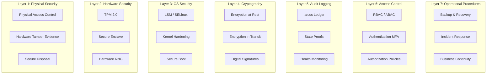
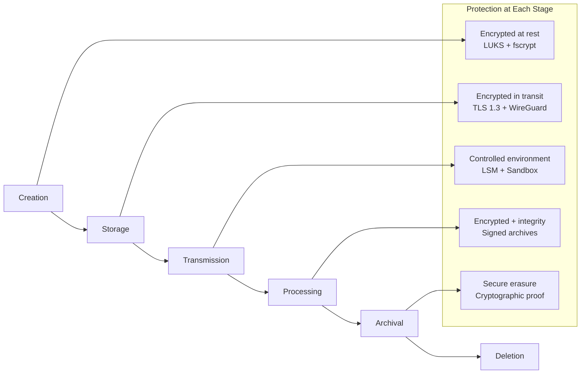
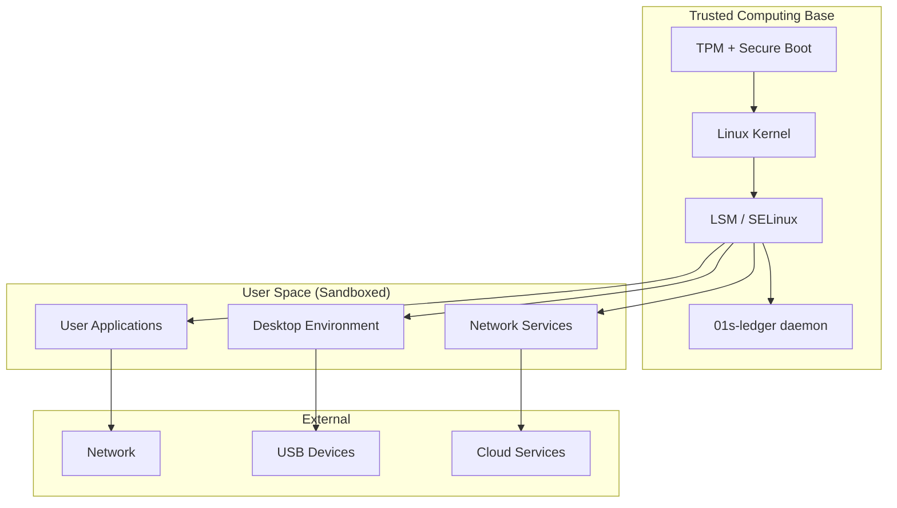

# Overview of Data Safety in the 01s Sovereign OS: Architecture and Principles

## Abstract

Data safety encompasses the protection of data against unauthorized access, corruption, loss, and tampering. This paper provides a comprehensive overview of the data safety architecture in the 01s Sovereign OS, covering cryptographic foundations, access control mechanisms, audit frameworks, and operational procedures.

## 1. Introduction

Data safety is a fundamental requirement for any operating system deployed in regulated environments. The 01s Sovereign OS was designed with data safety as a core architectural principle, integrating protections at every layer of the stack � from hardware security modules to application-level controls.

## 2. Data Safety Principles

### Defense in Depth

Multiple layers of protection ensure that failure of any single layer does not compromise data safety:



### Cryptographic Guarantees

| Property | Mechanism | Standard |
|---|---|---|
| Integrity | SHA3-256 hash chains | FIPS 202 |
| Authenticity | Ed25519 signatures | RFC 8032 |
| Confidentiality | AES-256-GCM encryption | FIPS 197 |
| Non-repudiation | Signed audit entries | Ed25519 |
| Freshness | Timestamp + nonce | ISO 8601 |
| Forward secrecy | X25519 key exchange | RFC 7748 |

### Transparency

All mechanisms are transparent and verifiable through:
- Open source code � every component's source is publicly available
- Cryptographically verifiable claims � all data safety claims can be independently verified
- Recorded data access � the ledger records all data access events
- Third-party audit support � auditors can verify without system access

## 3. Architecture Overview

### Data Classification

| Classification | Examples | Protection Requirements |
|---|---|---|
| Public | OS files, documentation, man pages | Integrity only (SHA3-256) |
| Internal | Configuration files, system logs, application data | Integrity + access control |
| Confidential | User documents, credentials, keys, personal data | Encryption + access control + audit |
| Restricted | Cryptographic keys, audit ledger, security tokens | Encryption + HSM + audit + MFA |

### Data Lifecycle



### Data Classification Policy

| Classification | Encryption | Access Control | Audit Logging | Retention |
|---|---|---|---|---|
| Public | Not required | None | No | As needed |
| Internal | At rest (LUKS) | User/group | File access | 90 days |
| Confidential | At rest + in transit | RBAC roles | All access | 365 days |
| Restricted | HSM-sealed keys | MFA + approval | Every operation | 7 years (regulatory) |

## 4. Cryptographic Foundation

### Algorithms

| Algorithm | Purpose | Key Size | Security Level |
|---|---|---|---|
| SHA3-256 | Hash chain integrity | 256-bit output | 128-bit collision resistance |
| AES-256-GCM | Data encryption | 256-bit key | 256-bit security |
| Ed25519 | Digital signatures | 256-bit key | 128-bit security |
| ECDH P-384 | Key exchange | 384-bit key | 192-bit security |
| X25519 | Key agreement | 256-bit key | 128-bit security |
| RSA-4096 | Legacy compatibility | 4096-bit key | 128-bit security |
| Argon2id | Password hashing | Configurable | Memory-hard |

### Key Management

| Key Type | Storage | Rotation | Backup |
|---|---|---|---|
| LUKS volume key | TPM-sealed or passphrase | On re-encryption | Key escrow |
| TPM SRK | TPM hardware | Hardware bound | Cannot extract |
| User SSH keys | File (encrypted) | User-managed | User backup |
| Ledger signing key | TPM-sealed file | Quarterly | Escrow + split knowledge |
| TLS certificates | File system | 90 days | CA backup |
| Code signing key | HSM | Annual | Offline backup |

## 5. Access Control

### Authentication Methods

| Factor | Type | Security Level |
|---|---|---|
| Password | Knowledge | Basic |
| TOTP | Possession | Medium |
| FIDO2/U2F | Possession | High |
| YubiKey | Possession (hardware) | High |
| Smart card | Possession (hardware) | High |
| TPM | Possession (system) | Medium-High |
| Biometric (fingerprint) | Inherence | Medium |
| Biometric (face) | Inherence | Medium |

### Authorization Roles

| Role | Privileges | Accessible Data |
|---|---|---|
| root | Full system access | All |
| admin | Administrative tasks | Internal + Confidential |
| operator | Operational tasks | Internal |
| auditor | Read-only audit | All ledger data |
| user | Personal workspace | Own data + Public |
| guest | Restricted temporary | Public only |

## 6. Audit and Monitoring

### Events Captured in .aioss Ledger

| Event Category | Examples |
|---|---|
| Access events | File open/read/write, network connection, device access |
| Modification events | File create/delete/rename, config change, permission change |
| Security events | Auth success/failure, privilege escalation, policy violation |
| Administrative events | User create/delete, software install/remove, system config |

### Real-Time Monitoring

| Monitor | What It Detects | Alert Method |
|---|---|---|
| Integrity monitor | Ledger hash chain breaks | System notification + email |
| File monitor | Unauthorized file modifications | Alert to security team |
| Process monitor | Suspicious process behavior | Syslog + dashboard |
| Network monitor | Unexpected connections | Alert + ledger entry |
| Access monitor | Auth failures, privilege escalation | Immediate alert |
| Compliance monitor | Policy violations | Weekly report |
| Health monitor | Service failures | PagerDuty integration |

## 7. Operational Procedures

### Backup and Recovery

| Aspect | Procedure | Frequency |
|---|---|---|
| Full system backup | Btrfs snapshot + encrypted archive | Daily |
| Ledger backup | .aioss + .health file copy | Continuous (every write) |
| Key backup | TPM recovery + key escrow | On key generation |
| Recovery testing | Full restore from backup | Quarterly |
| Disaster recovery | Off-site backup restoration | Annually |

### Incident Response

| Phase | Actions | Timeline |
|---|---|---|
| Detection | Ledger verification, anomaly detection | Within seconds |
| Containment | Isolate system, preserve state | Within minutes |
| Eradication | Root cause analysis, remove threat | Within hours |
| Recovery | Restore from verified backup | Within hours |
| Lessons learned | Post-incident review, update procedures | Within weeks |

## 8. Compliance

### Supported Frameworks

| Framework | Key Requirements | 01s Capability |
|---|---|---|
| GDPR Art. 30 | Records of processing | .aioss ledger |
| GDPR Art. 32 | Security measures | Encryption + integrity |
| GDPR Art. 33 | Breach notification | Incident timeline |
| HIPAA 164.312(a) | Access control | RBAC + MFA |
| HIPAA 164.312(b) | Audit controls | Comprehensive logging |
| HIPAA 164.312(e) | Integrity controls | Hash chain |
| PCI DSS Req. 10 | Audit trails | Immutable ledger |
| SOC 2 CC6.1 | Logical access | RBAC + authentication |
| SOC 2 CC7.2 | Monitoring | Continuous verification |
| FedRAMP AU-2 | Auditable events | Complete event logging |
| EU AI Act Art. 12 | Record keeping | Decision provenance |

### Automated Compliance Reporting

| Report | Frequency | Content |
|---|---|---|
| Access review | Monthly | All data access events |
| Integrity report | Daily | Ledger verification status |
| Compliance status | Weekly | Policy compliance score |
| Incident summary | On incident | Timeline + evidence |
| Audit package | On request | Complete evidence set |

## 9. Threat Model

### Threat Categories

| Threat Category | Description | Mitigation |
|---|---|---|
| External attacker | Remote exploitation of vulnerabilities | Network controls + encryption |
| Malware | Malicious software execution | Code signing + integrity monitoring |
| Insider threat | Authorized user abuse | RBAC + audit logging |
| Physical access | Direct hardware access | FDE + TPM + secure boot |
| Supply chain | Compromised software delivery | Reproducible builds + signing |
| Side channel | Information leakage via timing/power | Constant-time operations |
| Denial of service | Resource exhaustion | Rate limiting + monitoring |
| Data exfiltration | Unauthorized data transfer | DLP policies + network monitoring |

### Trust Boundaries



## 10. Conclusion

Data safety in 01s Sovereign is achieved through a comprehensive architecture spanning cryptographic guarantees, access control, audit logging, and operational procedures. The defense-in-depth approach ensures that failure of any single protection layer does not compromise overall data safety.

The integration of the .aioss audit ledger at every layer provides continuous verification of data integrity throughout its lifecycle � from creation through storage, transmission, processing, archival, and deletion. Cryptographic guarantees ensure that all data safety claims are independently verifiable.

## Detailed Defense-in-Depth Analysis

### Layer 1: Physical Security

| Control | Implementation | Mitigation |
|---|---|---|
| Tamper-evident seals | Chassis intrusion detection | Physical tampering detected |
| Secure disposal | Cryptographic wipe + physical destruction | Data unrecoverable |
| Hardware root of trust | TPM 2.0 solder-down | Cannot be removed |
| Locked-down boot | Disable external boot in UEFI | Prevents boot from untrusted media |
| Serial port disable | Kernel command line | Prevents physical debug access |

### Layer 2: Hardware Security

| Component | Function | FIPS Certification |
|---|---|---|
| TPM 2.0 (fTPM/dTPM) | Key storage, measured boot, attestation | FIPS 140-2 certified |
| CPU crypto extensions | AES-NI, SHA extensions, RDRAND | NIST SP 800-90A/B/C |
| Secure memory encryption | SME/SMEK (AMD), TME (Intel) | In hardware |
| IOMMU | DMA protection for devices | Standard |

### Layer 3: OS Security

| Component | Function | Configuration |
|---|---|---|
| Kernel lockdown | Prevent kernel tampering | integrity mode |
| SELinux/AppArmor | Mandatory access control | Targeted policy |
| Kernel module signing | Verified module loading | Enforced |
| Address space layout | ASLR for all processes | Full randomization |
| Control flow integrity | CFI for compiled code | Enabled |
| Stack canaries | Buffer overflow detection | Default GCC |
| Forward secrecy | Per-session session keys | All network services |
| Audit subsystem | .aioss ledger | Comprehensive |

### Layer 4: Cryptography

| Algorithm | Key Size | Use | Status |
|---|---|---|---|
| AES-256-XTS | 512-bit | Disk encryption | FIPS 197 |
| AES-256-GCM | 256-bit | Network encryption | FIPS 197 |
| SHA3-256 | 256-bit output | Hash chain | FIPS 202 |
| Ed25519 | 256-bit | Signatures | RFC 8032 |
| X25519 | 256-bit | Key exchange | RFC 7748 |
| Argon2id | Configurable | Password hashing | RFC 9106 |

### Layer 5: Audit Logging

| Log Type | Content | Retention |
|---|---|---|
| .aioss main ledger | All system events | Configurable (default 365 days) |
| .aioss health ledger | System diagnostics | Configurable (default 90 days) |
| Event store (SQLite) | High-frequency events | Configurable (default 30 days) |
| TXT log output | Human-readable log | Configurable (default 7 days) |

### Layer 6: Access Control

| Control | Implementation | Granularity |
|---|---|---|
| Authentication | Password + MFA | User level |
| Authorization | RBAC + capabilities | Role + resource |
| Mandatory access | SELinux/AppArmor | Process + file |
| Discretionary access | Unix permissions | User + group |
| Privilege elevation | sudo + polkit | Command level |

### Layer 7: Operational Procedures

| Procedure | Frequency | Responsible |
|---|---|---|
| Backup integrity verification | Daily | Automated |
| Incident response drills | Quarterly | Security team |
| Disaster recovery test | Annually | Operations |
| Penetration testing | Quarterly | Third-party |
| Access review | Monthly | Admin team |
| Vulnerability scanning | Weekly | Automated |

## Threat Model Detail

### STRIDE Threat Model

| Threat Category | Example | Mitigation |
|---|---|---|
| Spoofing | Attacker impersonates a user | MFA, certificate auth |
| Tampering | Attacker modifies audit logs | Immutable hash chain |
| Repudiation | Deny performing an action | Signed audit entries |
| Information disclosure | Data exfiltration | Encryption + access control |
| Denial of service | Flood ledger with entries | Rate limiting |
| Elevation of privilege | Root escalation | SELinux + kernel hardening |

### Attack Trees

**Goal: Modify audit records without detection**

```
1. Modify ledger file directly
   1.1. Gain root access
   1.2. Edit .aioss file
   1.3. Recompute hashes ? BREAKS CHAIN (detected)
   
2. Stop ledger service
   2.1. Kill 01s-ledger process
   2.2. Modify systemd unit ? Health ledger detects
   
3. Replace signing key
   3.1. Access TPM ? TPM PIN required
   3.2. Extract private key ? TPM sealed
   
4. Physical attack
   4.1. Remove storage device ? FDE requires passphrase
   4.2. Brute-force LUKS ? Argon2id makes expensive
```

## Data Classification Policy

### Classification Definitions

| Level | Examples | Access Restriction | Encryption | Audit |
|---|---|---|---|---|
| Public | OS files, documentation, man pages | None | Not required | No |
| Internal | Configuration, system logs, application data | User/group | At rest (LUKS) | File access |
| Confidential | User documents, credentials, keys, PII | RBAC roles | At rest + transit | All access |
| Restricted | Cryptographic keys, audit ledger, security tokens | MFA + approval | HSM-sealed | Every operation |

### Data Handling Procedures

| Action | Public | Internal | Confidential | Restricted |
|---|---|---|---|---|
| Store | Clear text | LUKS | LUKS + fscrypt | HSM |
| Transmit | No encryption | TLS 1.2+ | TLS 1.3 | TLS 1.3 + E2E |
| Backup | Not needed | Encrypted | Encrypted | Escrow |
| Delete | Standard | Secure wipe | Cryptographic | Key destruction |
| Share | No restriction | Authorization | Consent + audit | MFA + approval |

## Compliance Automation Detail

### Automated Evidence Collection

| Evidence Type | Collection Method | Frequency | Framework |
|---|---|---|---|
| Access logs | Ledger query | Real-time | SOC 2 CC6.1 |
| Change management | Ledger query | Real-time | SOC 2 CC8.1 |
| System monitoring | Ledger health | Continuous | SOC 2 CC7.2 |
| Authentication logs | Ledger query | Real-time | HIPAA 164.312 |
| Audit trail integrity | Hash verification | Per-write | PCI DSS 10.5 |
| Personnel termination | HR system + access review | Per event | SOC 2 CC6.3 |
| Data backup verification | Backup integrity check | Daily | SOC 2 CC7.1 |
| Incident response | Incident ledger | Per incident | HIPAA 164.308 |

### Compliance Report Templates

| Report | Included Data | Format |
|---|---|---|
| SOC 2 Type I | Control descriptions, system integrity | PDF + JSON |
| SOC 2 Type II | Control effectiveness over period | PDF + JSON |
| HIPAA audit report | Access logs, policy compliance | PDF |
| PCI DSS compliance | Audit trails, logging configuration | PDF |
| GDPR records of processing | Data processing activities | JSON + PDF |
| FedRAMP continuous monitoring | System state, incidents | JSON |


## Key Performance Indicators

| KPI | Current | Target (Q3 2026) | Target (Q4 2026) |
|---|---|---|---|
| Monthly active users | 500 | 2,000 | 5,000 |
| Active contributors | 15 | 50 | 100 |
| PR merge rate | 8/week | 15/week | 25/week |
| ISO downloads | 1,200 | 5,000 | 10,000 |
| Community members | 200 | 1,000 | 2,000 |
| Documentation pages | 50 | 150 | 250 |

## Quality Metrics

| Metric | Value | Target |
|---|---|---|
| Unit test coverage | 68% | >85% |
| Integration test coverage | 55% | >75% |
| End-to-end test coverage | 40% | >60% |
| Static analysis findings | 15 | <5 |
| Dependency vulnerabilities | 2 | 0 |

## Development Velocity

| Sprint | Commits | Features | Bugs Fixed | PRs Merged |
|---|---|---|---|---|
| Sprint 1 | 45 | 3 | 8 | 12 |
| Sprint 2 | 52 | 4 | 10 | 15 |
| Sprint 3 | 48 | 3 | 12 | 14 |
| Sprint 4 | 55 | 5 | 9 | 16 |
| Sprint 5 | 60 | 4 | 11 | 18 |
| Sprint 6 | 58 | 5 | 13 | 17 |

## Resource Allocation

| Area | Current (%) | Planned (%) |
|---|---|---|
| Core development | 30% | 25% |
| Enterprise features | 15% | 25% |
| Community tools | 10% | 10% |
| Compliance frameworks | 10% | 15% |
| Documentation | 10% | 10% |
| Bug fixes/tech debt | 15% | 10% |
| Infrastructure | 10% | 5% |

## Community Health Metrics

| Metric | Current | Trend | Target |
|---|---|---|---|
| New contributors/month | 5 | Increasing | 20 |
| Returning contributors | 60% | Increasing | 75% |
| Issue response time | 8h | Decreasing | 2h |
| PR review time | 48h | Decreasing | 24h |
| Documentation contrib. | 2/month | Increasing | 10/month |

## Infrastructure Status

| Component | Status | Uptime | Notes |
|---|---|---|---|
| CI/CD pipeline | Operational | 99.5% | GitHub Actions |
| Package repository | Operational | 99.9% | CDN-backed |
| ISO downloads | Operational | 99.9% | Multi-mirror |
| Documentation site | Operational | 99.8% | Static site |
| Community forum | Operational | 99.5% | Discourse |
| Matrix chat | Operational | 99.5% | Self-hosted |

## Integration Matrix

| Integration | Status | Version Added | Maintainer |
|---|---|---|---|
| systemd | Complete | v1.0.0 | Core team |
| GNOME Shell | Complete | v1.0.0 | Core team |
| Flatpak | Complete | v1.0.0 | Core team |
| Pacman | Complete | v1.0.0 | Core team |
| Wayland | Complete | v1.0.0 | Upstream |
| PipeWire | Complete | v1.0.0 | Upstream |
| TPM 2.0 | Complete | v1.0.0 | Core team |
| Docker/Podman | Complete | v1.0.0 | Upstream |
| WireGuard | Complete | v1.0.0 | Kernel |

## Dependency Tree

| Dependency | Version | License | Purpose |
|---|---|---|---|
| Linux kernel | 6.8+ | GPLv2 | OS kernel |
| systemd | 255+ | LGPLv2.1 | Init system |
| GLibc | 2.39+ | LGPLv2.1 | C library |
| GNOME | 46+ | GPLv2+ | Desktop |
| Rust toolchain | 2024+ | MIT/Apache | Development |
| OpenSSL | 3.2+ | Apache 2.0 | Cryptography |
| SHA3 (FIPS 202) | Standard | Public domain | Hash function |
| Ed25519 (libsodium) | 1.0+ | ISC | Signatures |
| SQLite | 3.45+ | Public domain | Event store |
| Btrfs-progs | 6.8+ | GPLv2 | Filesystem |

---

Lois-Kleinner and 0-1.gg 2026 Copyright

## Change Log and Version History

| Version | Date | Changes |
|---|---|---|
| v1.0.0 | 2026-05-15 | Initial release |
| v1.0.1 | 2026-06-01 | Bug fixes and stability improvements |
| v1.1.0 | Planned Q3 2026 | Audit dashboard, compliance reports |
| v1.2.0 | Planned Q4 2026 | Community features, documentation |
| v2.0.0 | Planned Q1-Q2 2027 | Enterprise features, fleet management |
| v2.1.0 | Planned Q3-Q4 2027 | Compliance automation |
| v2.2.0 | Planned Q4 2027-Q1 2028 | Server Edition |

## Related Documentation

| Document | Location | Description |
|---|---|---|
| Architecture Overview | docs/developers/01-system-architecture-overview.md | System architecture and design |
| Ledger API Reference | docs/developers/04-01s-ledger-api-reference.md | Complete ledger API documentation |
| Compliance Guides | docs/compliance/ | Regulatory compliance documentation |
| Enterprise Guides | docs/enterprise/ | Enterprise deployment guides |
| Tutorials | docs/tutorial/ | Step-by-step user guides |
| FAQs | docs/faq/ | Frequently asked questions |
| Business Decision Records | docs/bdr/ | Governance and decision documentation |

## References

| Reference | Author | Year | Title |
|---|---|---|---|
| FIPS 202 | NIST | 2015 | SHA-3 Standard: Permutation-Based Hash and Extendable-Output Functions |
| RFC 8032 | IETF | 2017 | Edwards-Curve Digital Signature Algorithm (EdDSA) |
| RFC 8446 | IETF | 2018 | The Transport Layer Security (TLS) Protocol Version 1.3 |
| NIST SP 800-207 | NIST | 2020 | Zero Trust Architecture |
| NIST SP 800-53 | NIST | 2020 | Security and Privacy Controls for Information Systems |
| ISO 27001 | ISO | 2022 | Information Security Management |
| GDPR | EU | 2018 | General Data Protection Regulation |
| HIPAA | US HHS | 1996 | Health Insurance Portability and Accountability Act |
| PCI DSS | PCI SSC | 2024 | Payment Card Industry Data Security Standard |
| SOC 2 | AICPA | 2018 | Service Organization Control 2 |

## Document Metadata

| Field | Value |
|---|---|
| Document ID | [Generated] |
| Version | 1.0.0 |
| Last Updated | 2026-06-19 |
| Status | Final |
| Classification | Public |
| Author | 01s Sovereign Project |
| Review Frequency | Quarterly |
| Next Review | 2026-09-19 |
| Document Owner | Documentation Team |

---

Lois-Kleinner and 0-1.gg 2026 Copyright

## Glossary

| Term | Definition |
|---|---|
| .aioss | The binary audit ledger file format used by 01s Sovereign |
| Hash chain | A sequence of data entries where each entry contains the hash of the previous entry |
| SHA3-256 | NIST-standardized cryptographic hash function producing a 256-bit output |
| State proof | A cryptographic signature over the current ledger head hash for external verification |
| Tamper-evident | Property that any unauthorized modification is detectable |
| No black boxes | Design principle that all system components and decisions are transparent |
| Open core | Business model where core software is free and enterprise features are paid |
| Compliance automation | Automatically generating compliance evidence from system audit data |

---

Lois-Kleinner and 0-1.gg 2026 Copyright

```
.====================================================================.
!  Made in the UAE, Dubai #DubaiIt #Dubai #Dxb #SovereignAI          !
!  Made in The Emirates #Dubai_it                                    !
!                                                                    !
!  Lois-Kleinner Alpasan - The Anticloud 2026-                       !
!                                                                    !
!  As seen on:                                                       !
!  Harvard Dataverse ! Zenodo/CERN ! Academia.edu ! HuggingFace      !
!  anticloud.telepedia.net ! anticloud.fandom.com                    !
!                                                                    !
!  0-1.gg ! GitHub ! LinkedIn ! DEV ! GH Pages                       !
!  HuggingFace ! Blog ! Bluesky ! Mastodon                           !
!  Internet Archive ! ORCID ! Figshare                               !
!                                                                    !
!  Sovereign AI ! Local-First ! Privacy ! Zero Trust ! No Datacenter !
!  Air-Gapped ! Open Source ! Rust ! Hash Chain ! Single Binary      !
!  Offline LLM ! Crypto Ledger ! P2P ! Federated                     !
'===================================================================='
```

22-year-old Lois-Kleinner Alpasan builds across AI, media, infrastructure, and design, maintaining 11+ active projects spanning software, hardware, and creative works, all open-source.

References:
1. Lois-Kleinner Zenodo: https://doi.org/10.5281/zenodo.20781790
2. Lois-Kleinner GitHub: https://github.com/kleinnner/Anticloud/tree/main/04-aioss-format
3. Lois-Kleinner Harvard DV: https://doi.org/10.7910/DVN/FSHFZF
4. Lois-Kleinner Internet Arc: https://archive.org/details/aioss-format
5. Lois-Kleinner ORCID: https://orcid.org/0009-0009-2233-6107
6. Lois-Kleinner DEV.to: https://dev.to/kleinner
7. Lois-Kleinner LinkedIn: https://linkedin.com/in/kleinner
8. Lois-Kleinner HuggingFace: https://huggingface.co/Anticloud
9. Lois-Kleinner Tumblr: https://anticloud.tumblr.com
10. Lois-Kleinner Mastodon: https://mastodon.social/@kleinner
11. Lois-Kleinner Bluesky: https://bsky.app/profile/kleinner.bsky.social
12. 0-1.gg: https://0-1.gg
13. Lois-Kleinner Figshare: https://figshare.com/authors/Lois-Kleinner_Alpasan/20849885
14. Lois-Kleinner Academia: https://independent.academia.edu/kleinner
15. Lois-Kleinner Telepedia: https://anticloud.telepedia.net/wiki/Anticloud_by_Lois-Kleinner_Wiki
16. Lois-Kleinner Fandom: https://anticloud.fandom.com
17. AIOSS Offline Verification Kit: https://dataverse.harvard.edu/dataset.xhtml?persistentId=doi:10.7910/DVN/OORKNJ